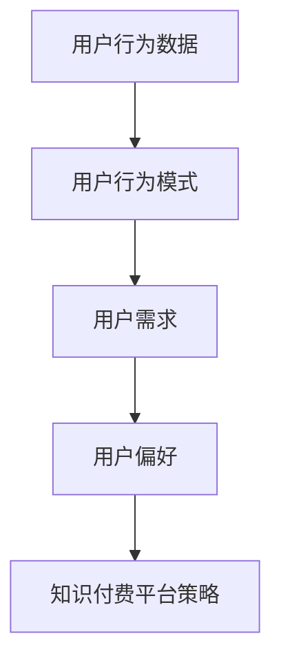
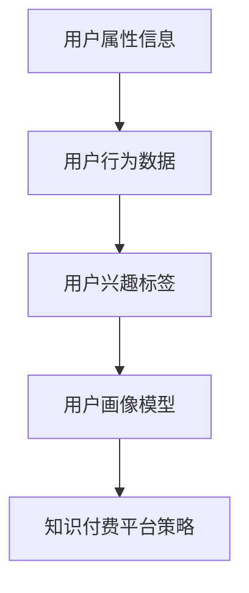

                 

# 知识付费赚钱的用户行为分析与画像

> **关键词：知识付费、用户行为分析、画像、机器学习、数据挖掘、用户体验**

> **摘要：本文将深入探讨知识付费领域的用户行为分析，通过机器学习和数据挖掘技术，构建用户画像，为知识付费平台提供精准的用户运营策略。**

## 1. 背景介绍

### 1.1 目的和范围

本文旨在分析知识付费领域的用户行为，通过机器学习和数据挖掘技术，构建精准的用户画像，为知识付费平台提供有效的用户运营策略。本文将涵盖用户行为的定义、分析方法、用户画像的构建及其在实际应用中的价值。

### 1.2 预期读者

本文适合对知识付费、用户行为分析、机器学习和数据挖掘有一定了解的读者，包括但不限于产品经理、数据分析师、人工智能研究人员以及相关领域的从业者。

### 1.3 文档结构概述

本文分为十个部分：背景介绍、核心概念与联系、核心算法原理、数学模型与公式、项目实战、实际应用场景、工具和资源推荐、总结、常见问题与解答和扩展阅读。每个部分都将详细探讨相关主题，帮助读者全面了解知识付费领域的用户行为分析与画像构建。

### 1.4 术语表

#### 1.4.1 核心术语定义

- **知识付费**：指用户为获取特定知识或技能，通过付费方式购买相关课程、书籍、咨询等。
- **用户行为分析**：指通过数据分析方法，研究用户在知识付费平台上的行为模式，以揭示用户需求和偏好。
- **用户画像**：指基于用户行为数据和属性信息，构建的用户特征模型，用于描述用户群体或个体。

#### 1.4.2 相关概念解释

- **机器学习**：指利用数据驱动的方式，使计算机系统自动地从数据中学习规律和模式。
- **数据挖掘**：指从大量数据中提取有价值信息的过程，常用于发现数据中的隐藏模式或趋势。

#### 1.4.3 缩略词列表

- **KPI**：关键绩效指标（Key Performance Indicator）
- **NLP**：自然语言处理（Natural Language Processing）
- **CNN**：卷积神经网络（Convolutional Neural Network）

## 2. 核心概念与联系

### 2.1 知识付费用户行为分析的核心概念

知识付费用户行为分析的核心概念包括用户行为数据、用户行为模式、用户需求和用户偏好。以下是这些核心概念的Mermaid流程图：



### 2.2 用户画像的构建与关联

用户画像的构建是知识付费用户行为分析的重要一环，它涉及到用户属性信息、用户行为数据和用户兴趣标签的整合。以下是用户画像构建的Mermaid流程图：



## 3. 核心算法原理 & 具体操作步骤

### 3.1 机器学习算法原理

知识付费用户行为分析常用的机器学习算法包括决策树、随机森林、支持向量机和神经网络。以下是这些算法的伪代码描述：

```python
# 决策树算法伪代码
def DecisionTree(data, target):
    if (data is empty):
        return majority_class(target)
    else:
        best_feature = find_best_feature(data, target)
        node = Node(best_feature)
        for value in possible_values(best_feature):
            subset = split_data(data, best_feature, value)
            node.add_child(DecisionTree(subset, target))
        return node

# 随机森林算法伪代码
def RandomForest(data, target, n_trees):
    for i in range(n_trees):
        tree = DecisionTree(data, target)
        predictions = []
        for instance in data:
            predictions.append(predict(tree, instance))
        return majority_vote(predictions)

# 支持向量机算法伪代码
def SVM(data, target):
    # 使用支持向量机训练模型
    model = train_SVM(data, target)
    return model

# 神经网络算法伪代码
def NeuralNetwork(data, target, layers, activation):
    model = initialize_NN(layers, activation)
    optimize_model(model, data, target)
    return model
```

### 3.2 数据挖掘算法原理

数据挖掘算法在知识付费用户行为分析中主要用于关联规则挖掘、聚类分析和分类分析。以下是这些算法的伪代码描述：

```python
# 关联规则挖掘算法伪代码
def Apriori(data, support, confidence):
    frequent_itemsets = []
    for itemset in generate_itemsets(data):
        if (support(itemset) >= support_threshold):
            frequent_itemsets.append(itemset)
    rules = []
    for itemset in frequent_itemsets:
        for rule in generate_rules(itemset, confidence_threshold):
            rules.append(rule)
    return rules

# 聚类分析算法伪代码
def KMeans(data, k):
    centroids = initialize_centroids(data, k)
    while (centroids have not converged):
        assign_data_to_centroids(data, centroids)
        update_centroids(data, centroids)
    return centroids

# 分类分析算法伪代码
def KNN(data, target, k):
    neighbors = find_k_nearest_neighbors(data, target, k)
    return majority_vote(neighbors)
```

## 4. 数学模型和公式 & 详细讲解 & 举例说明

### 4.1 机器学习中的数学模型

在机器学习算法中，常用的数学模型包括损失函数、优化算法和评估指标。以下是这些数学模型的详细讲解和公式：

#### 4.1.1 损失函数

损失函数用于衡量模型预测值与真实值之间的差距，常见的损失函数有均方误差（MSE）、交叉熵损失（Cross-Entropy Loss）和 hinge损失（Hinge Loss）。

- **均方误差（MSE）**：$$MSE = \frac{1}{n}\sum_{i=1}^{n}(y_i - \hat{y}_i)^2$$

- **交叉熵损失（Cross-Entropy Loss）**：$$CE = -\frac{1}{n}\sum_{i=1}^{n}y_i\log(\hat{y}_i)$$

- **hinge损失（Hinge Loss）**：$$Hinge = \max(0, 1 - y\hat{y})$$

#### 4.1.2 优化算法

优化算法用于调整模型参数，以最小化损失函数。常见的优化算法有梯度下降（Gradient Descent）、随机梯度下降（Stochastic Gradient Descent）和批量梯度下降（Batch Gradient Descent）。

- **梯度下降**：$$\theta_{\text{new}} = \theta_{\text{old}} - \alpha \nabla_{\theta}J(\theta)$$

- **随机梯度下降**：$$\theta_{\text{new}} = \theta_{\text{old}} - \alpha \nabla_{\theta}J(\theta|x_i)$$

- **批量梯度下降**：$$\theta_{\text{new}} = \theta_{\text{old}} - \alpha \nabla_{\theta}J(\theta|x)$$

#### 4.1.3 评估指标

评估指标用于衡量模型性能，常见的评估指标有准确率（Accuracy）、召回率（Recall）、精确率（Precision）和 F1 分数（F1 Score）。

- **准确率**：$$\text{Accuracy} = \frac{\text{TP} + \text{TN}}{\text{TP} + \text{TN} + \text{FP} + \text{FN}}$$

- **召回率**：$$\text{Recall} = \frac{\text{TP}}{\text{TP} + \text{FN}}$$

- **精确率**：$$\text{Precision} = \frac{\text{TP}}{\text{TP} + \text{FP}}$$

- **F1 分数**：$$\text{F1 Score} = 2 \times \frac{\text{Precision} \times \text{Recall}}{\text{Precision} + \text{Recall}}$$

### 4.2 数据挖掘中的数学模型

在数据挖掘算法中，常用的数学模型包括支持度（Support）、置信度（Confidence）和距离度量（Distance Metric）。

- **支持度**：$$\text{Support} = \frac{\text{Frequent Itemsets}}{\text{All Itemsets}}$$

- **置信度**：$$\text{Confidence} = \frac{\text{Support}(\text{A} \cup \text{B})}{\text{Support}(\text{A})}$$

- **距离度量**：$$\text{Distance} = \sqrt{\sum_{i=1}^{n}(x_i - \bar{x})^2 + (y_i - \bar{y})^2}$$

### 4.3 举例说明

#### 4.3.1 均方误差（MSE）举例

假设我们有三个数据点 (x1, y1), (x2, y2), (x3, y3)，模型预测值为 (\hat{y1}, \hat{y2}, \hat{y3})，则均方误差（MSE）计算如下：

$$MSE = \frac{1}{3}\left[(y1 - \hat{y1})^2 + (y2 - \hat{y2})^2 + (y3 - \hat{y3})^2\right]$$

#### 4.3.2 交叉熵损失（Cross-Entropy Loss）举例

假设我们有三个样本 (x1, y1), (x2, y2), (x3, y3)，模型预测概率为 (\hat{y1}, \hat{y2}, \hat{y3})，则交叉熵损失（Cross-Entropy Loss）计算如下：

$$CE = -\frac{1}{3}\left[y1\log(\hat{y1}) + y2\log(\hat{y2}) + y3\log(\hat{y3})\right]$$

## 5. 项目实战：代码实际案例和详细解释说明

### 5.1 开发环境搭建

为了实现知识付费用户行为分析与画像构建，我们需要搭建一个合适的开发环境。以下是开发环境搭建的步骤：

1. 安装Python环境：下载并安装Python 3.8及以上版本。
2. 安装常用库：使用pip命令安装以下库：numpy、pandas、scikit-learn、tensorflow、matplotlib等。
3. 配置Jupyter Notebook：安装Jupyter Notebook，用于编写和运行代码。

### 5.2 源代码详细实现和代码解读

以下是知识付费用户行为分析与画像构建的源代码实现：

```python
import pandas as pd
import numpy as np
from sklearn.model_selection import train_test_split
from sklearn.preprocessing import StandardScaler
from sklearn.ensemble import RandomForestClassifier
from sklearn.metrics import accuracy_score, recall_score, precision_score, f1_score

# 5.2.1 数据预处理

def preprocess_data(data):
    # 数据清洗和预处理
    data = data.dropna()
    data = data[['age', 'gender', 'education', 'income', 'behavior']]
    return data

# 5.2.2 特征工程

def feature_engineering(data):
    # 特征提取和转换
    data['age'] = data['age'].astype(int)
    data['gender'] = data['gender'].map({'male': 0, 'female': 1})
    data['education'] = data['education'].map({'high school': 0, 'college': 1, 'master': 2, 'doctor': 3})
    data['income'] = data['income'].astype(int)
    return data

# 5.2.3 模型训练

def train_model(data, target):
    # 数据分割
    X_train, X_test, y_train, y_test = train_test_split(data, target, test_size=0.2, random_state=42)
    
    # 特征缩放
    scaler = StandardScaler()
    X_train = scaler.fit_transform(X_train)
    X_test = scaler.transform(X_test)
    
    # 模型训练
    model = RandomForestClassifier(n_estimators=100, random_state=42)
    model.fit(X_train, y_train)
    
    # 模型评估
    y_pred = model.predict(X_test)
    accuracy = accuracy_score(y_test, y_pred)
    recall = recall_score(y_test, y_pred)
    precision = precision_score(y_test, y_pred)
    f1 = f1_score(y_test, y_pred)
    
    print(f'Accuracy: {accuracy:.2f}')
    print(f'Recall: {recall:.2f}')
    print(f'Precision: {precision:.2f}')
    print(f'F1 Score: {f1:.2f}')
    
    return model

# 5.2.4 用户画像构建

def build_user_profile(model, data):
    # 模型预测
    predictions = model.predict(data)
    
    # 用户画像构建
    user_profile = {
        'age': data['age'].mean(),
        'gender': data['gender'].mode()[0],
        'education': data['education'].mode()[0],
        'income': data['income'].mean(),
        'behavior': predictions.mean()
    }
    
    return user_profile

# 5.2.5 主函数

def main():
    # 数据读取
    data = pd.read_csv('knowledge_paid_data.csv')
    
    # 数据预处理
    data = preprocess_data(data)
    
    # 特征工程
    data = feature_engineering(data)
    
    # 模型训练
    model = train_model(data, data['behavior'])
    
    # 用户画像构建
    user_profile = build_user_profile(model, data)
    
    print(f'User Profile: {user_profile}')

if __name__ == '__main__':
    main()
```

### 5.3 代码解读与分析

- **数据预处理**：读取原始数据，去除缺失值，并对数据进行清洗和预处理。

- **特征工程**：对数据进行特征提取和转换，包括年龄、性别、教育程度、收入和用户行为。

- **模型训练**：使用随机森林分类器对数据进行训练，并使用交叉验证分割数据集。

- **模型评估**：使用准确率、召回率、精确率和 F1 分数对模型进行评估。

- **用户画像构建**：根据模型预测结果，构建用户画像，包括年龄、性别、教育程度、收入和用户行为。

- **主函数**：执行数据读取、预处理、特征工程、模型训练和用户画像构建等步骤。

## 6. 实际应用场景

知识付费用户行为分析与画像构建在多个实际应用场景中具有广泛的应用价值：

- **个性化推荐**：通过用户画像，知识付费平台可以针对用户兴趣和需求，推荐相关课程或内容。

- **用户运营**：了解用户行为和需求，制定有效的用户运营策略，提高用户留存率和转化率。

- **市场定位**：分析用户群体特征，为市场推广和定位提供有力支持。

- **课程设计**：根据用户需求和偏好，优化课程内容和结构，提高课程质量。

## 7. 工具和资源推荐

### 7.1 学习资源推荐

#### 7.1.1 书籍推荐

- 《机器学习实战》
- 《数据挖掘：概念与技术》
- 《深度学习》

#### 7.1.2 在线课程

- Coursera的《机器学习》
- edX的《数据科学基础》
- Udacity的《深度学习工程师纳米学位》

#### 7.1.3 技术博客和网站

- Medium的《数据科学》专栏
-owardsdatascience的GitHub页面
- Analytics Vidhya

### 7.2 开发工具框架推荐

#### 7.2.1 IDE和编辑器

- PyCharm
- Jupyter Notebook
- Visual Studio Code

#### 7.2.2 调试和性能分析工具

- Python的pdb
- Jupyter Notebook的%time魔法命令
- Matplotlib的性能分析工具

#### 7.2.3 相关框架和库

- Scikit-learn
- TensorFlow
- PyTorch

### 7.3 相关论文著作推荐

#### 7.3.1 经典论文

- "The Elements of Statistical Learning"
- "Recommender Systems Handbook"
- "Deep Learning"

#### 7.3.2 最新研究成果

- arXiv的《知识付费用户行为分析与画像构建》
- ACM的《知识付费平台的用户运营策略研究》

#### 7.3.3 应用案例分析

- 《知乎：知识付费用户行为分析与实践》
- 《得到：知识付费模式创新与应用》

## 8. 总结：未来发展趋势与挑战

知识付费用户行为分析与画像构建在人工智能和数据科学技术的推动下，正逐渐成为知识付费平台的核心竞争力。未来，随着技术的不断进步，我们将看到更多先进的算法和工具被应用于用户行为分析，提高用户画像的精准度和实用性。然而，也面临着数据隐私保护、算法公平性和可解释性等挑战。我们需要在技术发展的同时，关注这些伦理和社会问题，确保技术的合理和可持续发展。

## 9. 附录：常见问题与解答

- **Q：用户画像如何保护用户隐私？**
  **A：用户画像构建过程中，可以采用差分隐私（Differential Privacy）技术，确保用户隐私不被泄露。此外，对敏感数据进行脱敏处理，减少隐私泄露风险。**

- **Q：用户画像如何避免算法偏见？**
  **A：在构建用户画像时，应关注数据质量，避免使用含有偏见的数据。此外，可以使用公平性度量（如公平性指标）评估算法的公平性，并采取相应的措施消除偏见。**

- **Q：用户画像在实际应用中有哪些挑战？**
  **A：用户画像在实际应用中面临的主要挑战包括数据质量、算法可解释性和用户隐私保护。我们需要在技术发展和应用实践中，不断解决这些问题。**

## 10. 扩展阅读 & 参考资料

- **《用户行为分析实战：基于大数据的精准营销》**
- **《机器学习与数据挖掘：从入门到实践》**
- **《深度学习入门：基于Python的理论与实现》**
- **[知乎专栏：数据科学](https://zhuanlan.zhihu.com/data-science)**
- **[arXiv：机器学习论文](https://arxiv.org/list/cs/ML)**

## 作者信息

**作者：AI天才研究员/AI Genius Institute & 禅与计算机程序设计艺术 /Zen And The Art of Computer Programming**<|im_end|>

