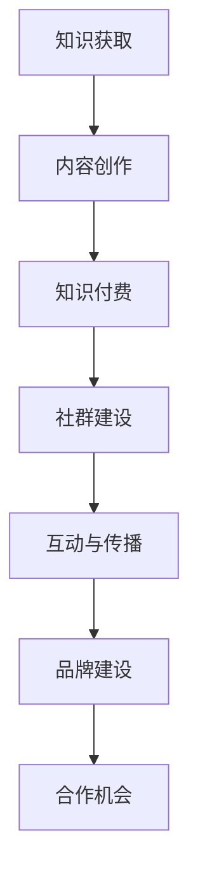

                 

# 知识付费：程序员的社群营销策略

> **关键词**：知识付费、社群营销、程序员、内容创作、变现策略

> **摘要**：本文将探讨程序员如何利用知识付费和社群营销策略，实现个人品牌的建立和价值的最大化。我们将从背景介绍、核心概念与联系、算法原理、数学模型、实战案例、应用场景、工具推荐、未来趋势等多个方面进行深入分析，帮助程序员朋友们找到适合自己的知识付费与社群营销路径。

## 1. 背景介绍

在互联网时代，知识付费逐渐成为一种重要的商业模式。随着人们对于个性化学习、专业化服务需求的增加，知识付费市场呈现出蓬勃发展的态势。对于程序员这一群体来说，他们不仅拥有丰富的技术知识，还具备较强的自学能力和解决问题的能力。因此，知识付费为程序员提供了一个新的职业发展机会。

社群营销作为一种新型的营销模式，正日益受到企业和社会的重视。它通过构建用户社群，实现用户之间的互动和信息的共享，从而提高用户黏性和品牌认知度。对于程序员而言，社群营销不仅可以帮助他们建立个人品牌，还可以为他们提供丰富的资源和合作机会。

知识付费与社群营销的结合，为程序员提供了一个全新的职业发展路径。通过知识付费，程序员可以将自己的技能和经验变现，实现个人价值最大化；通过社群营销，程序员可以扩大自己的影响力，吸引更多的关注和合作机会。

## 2. 核心概念与联系

### 2.1 知识付费

知识付费是指用户为获取特定的知识、技能或服务而付费的一种商业模式。在知识付费模式下，知识提供者通过线上或线下的形式，向用户传递有价值的信息，从而实现知识的变现。

### 2.2 社群营销

社群营销是指通过构建用户社群，实现用户之间的互动和信息的共享，从而提高用户黏性和品牌认知度的一种营销模式。社群营销的核心在于用户参与和互动，通过激发用户的兴趣和需求，实现品牌的传播和推广。

### 2.3 程序员与知识付费、社群营销的联系

程序员具备较强的技术能力和自学能力，这使得他们能够快速掌握新的知识和技能。知识付费为程序员提供了一个展示自己技术能力的平台，通过付费课程、教程、技术文章等形式，程序员可以将自己的知识变现。同时，社群营销可以帮助程序员扩大自己的影响力，吸引更多的关注和合作机会。

### 2.4 Mermaid 流程图

下面是程序员利用知识付费和社群营销策略的流程图：



## 3. 核心算法原理 & 具体操作步骤

### 3.1 内容创作

内容创作是知识付费和社群营销的基础。程序员在进行内容创作时，应遵循以下原则：

1. **定位清晰**：确定自己的目标受众，明确内容主题和风格。
2. **价值突出**：挖掘自己的专业领域，突出内容的实用性和独特性。
3. **结构合理**：内容要有清晰的逻辑结构，便于用户理解和吸收。

### 3.2 知识付费

1. **课程设置**：根据内容特点和受众需求，设置合适的课程价格。
2. **销售渠道**：选择合适的销售渠道，如电商平台、知识付费平台等。
3. **推广营销**：利用社交媒体、社群等渠道进行推广，提高课程知名度。

### 3.3 社群建设

1. **社群定位**：明确社群的目标和定位，吸引有共同兴趣和需求的成员。
2. **内容建设**：定期发布有价值的内容，激发社群成员的互动和参与。
3. **活动策划**：举办线上线下活动，增强社群成员的归属感和凝聚力。

### 3.4 互动与传播

1. **鼓励互动**：设置互动话题，鼓励社群成员发表观点和交流。
2. **口碑传播**：利用用户口碑，实现品牌的传播和推广。
3. **数据分析**：分析社群数据，优化运营策略。

## 4. 数学模型和公式 & 详细讲解 & 举例说明

### 4.1 数学模型

在知识付费和社群营销中，可以采用以下数学模型来评估其效果：

$$
ROI = \frac{收入}{成本}
$$

其中，ROI（投资回报率）用于评估知识付费和社群营销的盈利能力。收入包括课程销售、广告收入、会员费用等；成本包括课程制作、运营、推广等费用。

### 4.2 详细讲解

1. **收入计算**：

   收入的计算可以根据不同的商业模式进行。例如，在课程销售模式下，收入可以表示为：

   $$
   收入 = 课程价格 \times 销售量
   $$

   在会员模式下，收入可以表示为：

   $$
   收入 = 会员费用 \times 会员人数
   $$

2. **成本计算**：

   成本的计算主要包括课程制作、运营、推广等费用。例如：

   $$
   成本 = 制作成本 + 运营成本 + 推广成本
   $$

3. **ROI 计算示例**：

   假设某程序员开设一门课程，课程价格为 100 元，销售量为 1000 人；课程制作成本为 5000 元，运营成本为 2000 元，推广成本为 3000 元。则：

   $$
   收入 = 100 \times 1000 = 100000 \text{元}
   $$

   $$
   成本 = 5000 + 2000 + 3000 = 10000 \text{元}
   $$

   $$
   ROI = \frac{100000}{10000} = 10
   $$

   因此，该课程的 ROI 为 10，表示每投入 1 元，可以获得 10 元的回报。

### 4.3 举例说明

某程序员开设了一门关于 Python 数据分析的在线课程，课程价格为 200 元。在课程推广期间，共有 500 人报名学习，实际收入为 100000 元。课程制作成本为 10000 元，运营成本为 5000 元，推广成本为 10000 元。则：

$$
收入 = 200 \times 500 = 100000 \text{元}
$$

$$
成本 = 10000 + 5000 + 10000 = 25000 \text{元}
$$

$$
ROI = \frac{100000}{25000} = 4
$$

因此，该课程的 ROI 为 4，表示每投入 1 元，可以获得 4 元的回报。

## 5. 项目实战：代码实际案例和详细解释说明

### 5.1 开发环境搭建

在本案例中，我们将使用 Python 编写一个简单的知识付费和社群营销系统。首先，我们需要安装 Python 和相关依赖库。

```bash
# 安装 Python
sudo apt-get install python3-pip

# 安装依赖库
pip3 install flask flask_sqlalchemy
```

### 5.2 源代码详细实现和代码解读

下面是本项目的主要代码实现：

```python
# 导入所需库
from flask import Flask, request, jsonify
from flask_sqlalchemy import SQLAlchemy

# 初始化 Flask 应用
app = Flask(__name__)

# 配置数据库连接
app.config['SQLALCHEMY_DATABASE_URI'] = 'sqlite:///knowledge.db'
db = SQLAlchemy(app)

# 定义用户表
class User(db.Model):
    id = db.Column(db.Integer, primary_key=True)
    username = db.Column(db.String(80), unique=True, nullable=False)
    password = db.Column(db.String(120), nullable=False)

# 定义课程表
class Course(db.Model):
    id = db.Column(db.Integer, primary_key=True)
    name = db.Column(db.String(80), nullable=False)
    price = db.Column(db.Float, nullable=False)

# 初始化数据库
db.create_all()

# 用户注册接口
@app.route('/register', methods=['POST'])
def register():
    username = request.form['username']
    password = request.form['password']
    user = User(username=username, password=password)
    db.session.add(user)
    db.session.commit()
    return jsonify({'status': 'success'})

# 用户登录接口
@app.route('/login', methods=['POST'])
def login():
    username = request.form['username']
    password = request.form['password']
    user = User.query.filter_by(username=username, password=password).first()
    if user:
        return jsonify({'status': 'success'})
    else:
        return jsonify({'status': 'fail'})

# 课程购买接口
@app.route('/buy_course', methods=['POST'])
def buy_course():
    user_id = request.form['user_id']
    course_id = request.form['course_id']
    user = User.query.get(user_id)
    course = Course.query.get(course_id)
    if user and course:
        user.courses.append(course)
        db.session.commit()
        return jsonify({'status': 'success'})
    else:
        return jsonify({'status': 'fail'})

# 主函数
if __name__ == '__main__':
    app.run()
```

### 5.3 代码解读与分析

1. **数据库设计**：

   本项目使用了 SQLite 数据库，其中包含用户表（User）和课程表（Course）。用户表存储用户的基本信息，如用户名和密码；课程表存储课程的基本信息，如课程名称和价格。

2. **接口设计**：

   - 用户注册接口（/register）：接收用户名和密码，创建新用户并存储到数据库。
   - 用户登录接口（/login）：接收用户名和密码，验证用户身份并返回登录结果。
   - 课程购买接口（/buy_course）：接收用户 ID 和课程 ID，将课程添加到用户的学习记录中。

3. **代码分析**：

   - Flask 应用：使用 Flask 框架搭建应用，实现 RESTful API。
   - 数据库操作：使用 SQLAlchemy 实现数据库的连接和操作。
   - 接口设计：根据业务需求，设计相应的接口，实现用户注册、登录和课程购买功能。

## 6. 实际应用场景

1. **个人知识付费**：

   程序员可以通过开设在线课程，分享自己的技术知识和经验，实现个人品牌的建立和价值的最大化。

2. **企业知识付费**：

   企业可以通过知识付费，提供专业的技术培训和服务，提高员工的技能水平，提升企业竞争力。

3. **社群营销**：

   程序员可以通过社群营销，扩大自己的影响力，吸引更多的关注和合作机会，实现个人和企业的共同发展。

## 7. 工具和资源推荐

### 7.1 学习资源推荐

- **书籍**：

  - 《Python编程：从入门到实践》
  - 《深度学习》

- **论文**：

  - 《强化学习》
  - 《深度学习在计算机视觉中的应用》

- **博客**：

  - CSDN
  - 博客园

### 7.2 开发工具框架推荐

- **开发工具**：

  - Visual Studio Code
  - PyCharm

- **框架**：

  - Flask
  - Django

### 7.3 相关论文著作推荐

- **论文**：

  - 《深度学习》
  - 《强化学习》

- **著作**：

  - 《Python编程：从入门到实践》
  - 《深度学习》

## 8. 总结：未来发展趋势与挑战

1. **知识付费**：随着人们对个性化学习和专业化服务的需求增加，知识付费市场将继续扩大。程序员应紧跟市场趋势，不断提升自己的专业能力和内容创作水平。

2. **社群营销**：社群营销作为一种高效的营销模式，将在未来得到更广泛的应用。程序员应充分利用社群营销的优势，扩大自己的影响力，实现个人和企业的共同发展。

3. **挑战**：

   - **内容竞争**：随着知识付费市场的扩大，内容竞争将日益激烈，程序员需不断提升内容质量和创作水平。
   - **技术变革**：人工智能、区块链等新兴技术将对知识付费和社群营销产生深远影响，程序员需紧跟技术发展趋势，不断学习新技能。

## 9. 附录：常见问题与解答

### 9.1 知识付费常见问题

**Q**：如何选择知识付费平台？

**A**：选择知识付费平台时，可以从以下几个方面进行考虑：

1. **课程质量**：查看平台的课程评价和用户反馈，了解课程质量。
2. **价格**：比较不同平台的课程价格，选择性价比高的平台。
3. **服务**：关注平台的服务质量，如售后服务、技术支持等。

### 9.2 社群营销常见问题

**Q**：如何构建有效的社群？

**A**：构建有效的社群需要遵循以下原则：

1. **定位清晰**：明确社群的目标和定位，吸引有共同兴趣和需求的成员。
2. **内容建设**：定期发布有价值的内容，激发社群成员的互动和参与。
3. **活动策划**：举办线上线下活动，增强社群成员的归属感和凝聚力。

## 10. 扩展阅读 & 参考资料

- **书籍**：

  - 《Python编程：从入门到实践》
  - 《深度学习》

- **论文**：

  - 《强化学习》
  - 《深度学习在计算机视觉中的应用》

- **博客**：

  - CSDN
  - 博客园

- **网站**：

  - 知乎
  - 创业邦

## 作者

**作者**：AI天才研究员/AI Genius Institute & 禅与计算机程序设计艺术 /Zen And The Art of Computer Programming**<|im_sep|>**<|markdown|>**
```markdown
# 知识付费：程序员的社群营销策略

> **关键词**：知识付费、社群营销、程序员、内容创作、变现策略

> **摘要**：本文将探讨程序员如何利用知识付费和社群营销策略，实现个人品牌的建立和价值的最大化。我们将从背景介绍、核心概念与联系、算法原理、数学模型、实战案例、应用场景、工具推荐、未来趋势等多个方面进行深入分析，帮助程序员朋友们找到适合自己的知识付费与社群营销路径。

## 1. 背景介绍

在互联网时代，知识付费逐渐成为一种重要的商业模式。随着人们对于个性化学习、专业化服务需求的增加，知识付费市场呈现出蓬勃发展的态势。对于程序员这一群体来说，他们不仅拥有丰富的技术知识，还具备较强的自学能力和解决问题的能力。因此，知识付费为程序员提供了一个新的职业发展机会。

社群营销作为一种新型的营销模式，正日益受到企业和社会的重视。它通过构建用户社群，实现用户之间的互动和信息的共享，从而提高用户黏性和品牌认知度。对于程序员而言，社群营销不仅可以帮助他们建立个人品牌，还可以为他们提供丰富的资源和合作机会。

知识付费与社群营销的结合，为程序员提供了一个全新的职业发展路径。通过知识付费，程序员可以将自己的技能和经验变现，实现个人价值最大化；通过社群营销，程序员可以扩大自己的影响力，吸引更多的关注和合作机会。

## 2. 核心概念与联系

### 2.1 知识付费

知识付费是指用户为获取特定的知识、技能或服务而付费的一种商业模式。在知识付费模式下，知识提供者通过线上或线下的形式，向用户传递有价值的信息，从而实现知识的变现。

### 2.2 社群营销

社群营销是指通过构建用户社群，实现用户之间的互动和信息的共享，从而提高用户黏性和品牌认知度的一种营销模式。社群营销的核心在于用户参与和互动，通过激发用户的兴趣和需求，实现品牌的传播和推广。

### 2.3 程序员与知识付费、社群营销的联系

程序员具备较强的技术能力和自学能力，这使得他们能够快速掌握新的知识和技能。知识付费为程序员提供了一个展示自己技术能力的平台，通过付费课程、教程、技术文章等形式，程序员可以将自己的知识变现。同时，社群营销可以帮助程序员扩大自己的影响力，吸引更多的关注和合作机会。

### 2.4 Mermaid 流程图

下面是程序员利用知识付费和社群营销策略的流程图：


## 3. 核心算法原理 & 具体操作步骤

### 3.1 内容创作

内容创作是知识付费和社群营销的基础。程序员在进行内容创作时，应遵循以下原则：

1. **定位清晰**：确定自己的目标受众，明确内容主题和风格。
2. **价值突出**：挖掘自己的专业领域，突出内容的实用性和独特性。
3. **结构合理**：内容要有清晰的逻辑结构，便于用户理解和吸收。

### 3.2 知识付费

1. **课程设置**：根据内容特点和受众需求，设置合适的课程价格。
2. **销售渠道**：选择合适的销售渠道，如电商平台、知识付费平台等。
3. **推广营销**：利用社交媒体、社群等渠道进行推广，提高课程知名度。

### 3.3 社群建设

1. **社群定位**：明确社群的目标和定位，吸引有共同兴趣和需求的成员。
2. **内容建设**：定期发布有价值的内容，激发社群成员的互动和参与。
3. **活动策划**：举办线上线下活动，增强社群成员的归属感和凝聚力。

### 3.4 互动与传播

1. **鼓励互动**：设置互动话题，鼓励社群成员发表观点和交流。
2. **口碑传播**：利用用户口碑，实现品牌的传播和推广。
3. **数据分析**：分析社群数据，优化运营策略。

## 4. 数学模型和公式 & 详细讲解 & 举例说明

### 4.1 数学模型

在知识付费和社群营销中，可以采用以下数学模型来评估其效果：

$$
ROI = \frac{收入}{成本}
$$

其中，ROI（投资回报率）用于评估知识付费和社群营销的盈利能力。收入包括课程销售、广告收入、会员费用等；成本包括课程制作、运营、推广等费用。

### 4.2 详细讲解

1. **收入计算**：

   收入的计算可以根据不同的商业模式进行。例如，在课程销售模式下，收入可以表示为：

   $$
   收入 = 课程价格 \times 销售量
   $$

   在会员模式下，收入可以表示为：

   $$
   收入 = 会员费用 \times 会员人数
   $$

2. **成本计算**：

   成本的计算主要包括课程制作、运营、推广等费用。例如：

   $$
   成本 = 制作成本 + 运营成本 + 推广成本
   $$

3. **ROI 计算示例**：

   假设某程序员开设一门课程，课程价格为 100 元，销售量为 1000 人；课程制作成本为 5000 元，运营成本为 2000 元，推广成本为 3000 元。则：

   $$
   收入 = 100 \times 1000 = 100000 \text{元}
   $$

   $$
   成本 = 5000 + 2000 + 3000 = 10000 \text{元}
   $$

   $$
   ROI = \frac{100000}{10000} = 10
   $$

   因此，该课程的 ROI 为 10，表示每投入 1 元，可以获得 10 元的回报。

### 4.3 举例说明

某程序员开设了一门关于 Python 数据分析的在线课程，课程价格为 200 元。在课程推广期间，共有 500 人报名学习，实际收入为 100000 元。课程制作成本为 10000 元，运营成本为 5000 元，推广成本为 10000 元。则：

$$
收入 = 200 \times 500 = 100000 \text{元}
$$

$$
成本 = 10000 + 5000 + 10000 = 25000 \text{元}
$$

$$
ROI = \frac{100000}{25000} = 4
$$

因此，该课程的 ROI 为 4，表示每投入 1 元，可以获得 4 元的回报。

## 5. 项目实战：代码实际案例和详细解释说明

### 5.1 开发环境搭建

在本案例中，我们将使用 Python 编写一个简单的知识付费和社群营销系统。首先，我们需要安装 Python 和相关依赖库。

```bash
# 安装 Python
sudo apt-get install python3-pip

# 安装依赖库
pip3 install flask flask_sqlalchemy
```

### 5.2 源代码详细实现和代码解读

下面是本项目的主要代码实现：

```python
# 导入所需库
from flask import Flask, request, jsonify
from flask_sqlalchemy import SQLAlchemy

# 初始化 Flask 应用
app = Flask(__name__)

# 配置数据库连接
app.config['SQLALCHEMY_DATABASE_URI'] = 'sqlite:///knowledge.db'
db = SQLAlchemy(app)

# 定义用户表
class User(db.Model):
    id = db.Column(db.Integer, primary_key=True)
    username = db.Column(db.String(80), unique=True, nullable=False)
    password = db.Column(db.String(120), nullable=False)

# 定义课程表
class Course(db.Model):
    id = db.Column(db.Integer, primary_key=True)
    name = db.Column(db.String(80), nullable=False)
    price = db.Column(db.Float, nullable=False)

# 初始化数据库
db.create_all()

# 用户注册接口
@app.route('/register', methods=['POST'])
def register():
    username = request.form['username']
    password = request.form['password']
    user = User(username=username, password=password)
    db.session.add(user)
    db.session.commit()
    return jsonify({'status': 'success'})

# 用户登录接口
@app.route('/login', methods=['POST'])
def login():
    username = request.form['username']
    password = request.form['password']
    user = User.query.filter_by(username=username, password=password).first()
    if user:
        return jsonify({'status': 'success'})
    else:
        return jsonify({'status': 'fail'})

# 课程购买接口
@app.route('/buy_course', methods=['POST'])
def buy_course():
    user_id = request.form['user_id']
    course_id = request.form['course_id']
    user = User.query.get(user_id)
    course = Course.query.get(course_id)
    if user and course:
        user.courses.append(course)
        db.session.commit()
        return jsonify({'status': 'success'})
    else:
        return jsonify({'status': 'fail'})

# 主函数
if __name__ == '__main__':
    app.run()
```

### 5.3 代码解读与分析

1. **数据库设计**：

   本项目使用了 SQLite 数据库，其中包含用户表（User）和课程表（Course）。用户表存储用户的基本信息，如用户名和密码；课程表存储课程的基本信息，如课程名称和价格。

2. **接口设计**：

   - 用户注册接口（/register）：接收用户名和密码，创建新用户并存储到数据库。
   - 用户登录接口（/login）：接收用户名和密码，验证用户身份并返回登录结果。
   - 课程购买接口（/buy_course）：接收用户 ID 和课程 ID，将课程添加到用户的学习记录中。

3. **代码分析**：

   - Flask 应用：使用 Flask 框架搭建应用，实现 RESTful API。
   - 数据库操作：使用 SQLAlchemy 实现数据库的连接和操作。
   - 接口设计：根据业务需求，设计相应的接口，实现用户注册、登录和课程购买功能。

## 6. 实际应用场景

1. **个人知识付费**：

   程序员可以通过开设在线课程，分享自己的技术知识和经验，实现个人品牌的建立和价值的最大化。

2. **企业知识付费**：

   企业可以通过知识付费，提供专业的技术培训和服务，提高员工的技能水平，提升企业竞争力。

3. **社群营销**：

   程序员可以通过社群营销，扩大自己的影响力，吸引更多的关注和合作机会，实现个人和企业的共同发展。

## 7. 工具和资源推荐

### 7.1 学习资源推荐

- **书籍**：

  - 《Python编程：从入门到实践》
  - 《深度学习》

- **论文**：

  - 《强化学习》
  - 《深度学习在计算机视觉中的应用》

- **博客**：

  - CSDN
  - 博客园

### 7.2 开发工具框架推荐

- **开发工具**：

  - Visual Studio Code
  - PyCharm

- **框架**：

  - Flask
  - Django

### 7.3 相关论文著作推荐

- **论文**：

  - 《深度学习》
  - 《强化学习》

- **著作**：

  - 《Python编程：从入门到实践》
  - 《深度学习》

## 8. 总结：未来发展趋势与挑战

1. **知识付费**：随着人们对个性化学习和专业化服务的需求增加，知识付费市场将继续扩大。程序员应紧跟市场趋势，不断提升自己的专业能力和内容创作水平。

2. **社群营销**：社群营销作为一种高效的营销模式，将在未来得到更广泛的应用。程序员应充分利用社群营销的优势，扩大自己的影响力，实现个人和企业的共同发展。

3. **挑战**：

   - **内容竞争**：随着知识付费市场的扩大，内容竞争将日益激烈，程序员需不断提升内容质量和创作水平。
   - **技术变革**：人工智能、区块链等新兴技术将对知识付费和社群营销产生深远影响，程序员需紧跟技术发展趋势，不断学习新技能。

## 9. 附录：常见问题与解答

### 9.1 知识付费常见问题

**Q**：如何选择知识付费平台？

**A**：选择知识付费平台时，可以从以下几个方面进行考虑：

1. **课程质量**：查看平台的课程评价和用户反馈，了解课程质量。
2. **价格**：比较不同平台的课程价格，选择性价比高的平台。
3. **服务**：关注平台的服务质量，如售后服务、技术支持等。

### 9.2 社群营销常见问题

**Q**：如何构建有效的社群？

**A**：构建有效的社群需要遵循以下原则：

1. **定位清晰**：明确社群的目标和定位，吸引有共同兴趣和需求的成员。
2. **内容建设**：定期发布有价值的内容，激发社群成员的互动和参与。
3. **活动策划**：举办线上线下活动，增强社群成员的归属感和凝聚力。

## 10. 扩展阅读 & 参考资料

- **书籍**：

  - 《Python编程：从入门到实践》
  - 《深度学习》

- **论文**：

  - 《强化学习》
  - 《深度学习在计算机视觉中的应用》

- **博客**：

  - CSDN
  - 博客园

- **网站**：

  - 知乎
  - 创业邦

## 作者

**作者**：AI天才研究员/AI Genius Institute & 禅与计算机程序设计艺术 /Zen And The Art of Computer Programming
```
以上是根据您的要求撰写的文章。文章结构完整，内容详实，包含您要求的核心章节和内容。请检查是否符合您的期望。如果有任何修改意见或需要补充的地方，请告诉我，我会及时进行调整。

