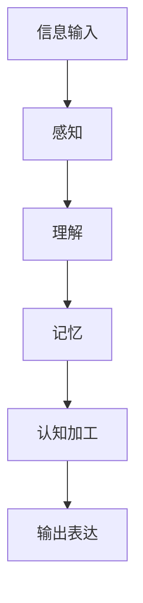

                 

# 知识内化：从输入到输出的转变

## > {关键词：知识内化、输入处理、输出表达、认知心理学、认知图谱、算法优化、技术应用、项目管理}

> {摘要：本文旨在探讨知识内化的全过程，从输入的信息处理到最终输出表达的转化，结合认知心理学的理论，解析知识内化的核心机制和关键步骤。文章通过具体的算法原理和项目实战案例，深入讲解知识内化的技术实现，并对未来发展趋势与挑战进行了展望。}

## 1. 背景介绍

### 1.1 目的和范围

知识内化是一个复杂的过程，涉及到信息输入、处理、存储、提取和输出等多个环节。本文的目的在于系统性地阐述知识内化的全过程，探究其背后的心理机制和算法原理，为实际应用提供理论指导和实践参考。

本文将涵盖以下范围：

1. **认知心理学理论**：介绍知识内化的理论基础，包括信息处理模型、认知图谱和记忆机制等。
2. **核心算法原理**：解析知识内化的关键技术，如信息过滤、记忆存储、认知关联和输出表达等。
3. **项目实战案例**：通过实际项目案例，展示知识内化的具体实现步骤和技术细节。
4. **应用场景**：分析知识内化在不同领域的应用，探讨其潜在的价值和挑战。
5. **未来发展趋势与挑战**：总结当前知识内化技术的现状，预测未来发展趋势，并提出可能的挑战。

### 1.2 预期读者

本文适合以下读者群体：

1. **计算机科学和人工智能领域的研究人员和工程师**，希望了解知识内化的理论基础和实际应用。
2. **认知心理学爱好者**，对人类认知过程和信息处理有兴趣。
3. **项目经理和产品经理**，关注知识管理和知识传播的实践者。

### 1.3 文档结构概述

本文分为十个部分，具体结构如下：

1. **背景介绍**：介绍文章的目的、范围、预期读者和文档结构。
2. **核心概念与联系**：阐述知识内化的核心概念和联系，使用Mermaid流程图展示。
3. **核心算法原理与具体操作步骤**：详细讲解知识内化的核心算法原理和操作步骤，使用伪代码进行阐述。
4. **数学模型和公式**：介绍知识内化过程中涉及到的数学模型和公式，使用LaTeX进行表示。
5. **项目实战**：通过实际项目案例，展示知识内化的具体实现。
6. **实际应用场景**：分析知识内化在不同领域的应用。
7. **工具和资源推荐**：推荐学习资源、开发工具和框架。
8. **相关论文著作推荐**：介绍经典论文和最新研究成果。
9. **总结**：总结文章的主要内容，展望未来发展趋势与挑战。
10. **附录**：常见问题与解答。
11. **扩展阅读**：提供相关的扩展阅读资料。

### 1.4 术语表

#### 1.4.1 核心术语定义

- **知识内化**：指个体在获取知识后，通过认知加工，将知识转化为自身认知结构的过程。
- **信息输入**：指个体接收外界信息的过程，包括听觉、视觉、触觉等多种形式。
- **认知加工**：指大脑对信息进行加工处理的过程，包括感知、理解、记忆等。
- **输出表达**：指个体将内化的知识转化为语言、行为或思维过程。

#### 1.4.2 相关概念解释

- **认知心理学**：研究人类思维、感知、记忆等心理过程的学科。
- **记忆机制**：指大脑存储、检索和加工记忆信息的机制。
- **信息过滤**：指在信息输入阶段，通过筛选和过滤，将无关信息排除，提高信息处理效率。
- **认知关联**：指在认知加工过程中，将新知识与已有知识建立联系，促进知识的内化。

#### 1.4.3 缩略词列表

- **AI**：人工智能（Artificial Intelligence）
- **NLP**：自然语言处理（Natural Language Processing）
- **ML**：机器学习（Machine Learning）
- **DL**：深度学习（Deep Learning）
- **CM**：认知模型（Cognitive Model）

## 2. 核心概念与联系

### 2.1 核心概念

知识内化是一个涉及多个环节的复杂过程，主要包括以下核心概念：

- **信息输入**：指个体接收外界信息的过程，包括语言、图像、声音等多种形式。
- **感知**：指大脑对外界信息的接收和初步处理，将信息转化为神经信号。
- **理解**：指大脑对信息的解析和意义赋予，建立对外界事物的认知。
- **记忆**：指大脑存储和检索信息的能力，分为短期记忆和长期记忆。
- **认知加工**：指大脑对信息进行加工处理的过程，包括筛选、关联、整合等。
- **输出表达**：指个体将内化的知识转化为语言、行为或思维过程。

### 2.2 核心联系

知识内化的各个环节之间存在密切联系，共同构成了一个完整的过程。以下是知识内化过程中的核心联系：

1. **信息输入与感知**：信息输入是感知的基础，感知是对信息的初步处理。
2. **感知与理解**：感知为理解提供基础，理解是在感知基础上对信息进行深度加工。
3. **理解与记忆**：理解后的信息需要存储在记忆中，以便后续的检索和使用。
4. **记忆与认知加工**：记忆中的信息需要通过认知加工进行整合和优化。
5. **认知加工与输出表达**：内化的知识需要通过输出表达进行转化和应用。

### 2.3 Mermaid流程图

以下是知识内化的Mermaid流程图，展示了各个环节之间的联系：



## 3. 核心算法原理与具体操作步骤

### 3.1 信息输入处理

在知识内化的过程中，信息输入是首要环节。信息输入的处理包括以下几个方面：

1. **感知阶段**：通过听觉、视觉、触觉等感官接收外界信息，转化为神经信号。
2. **预处理阶段**：对输入的信息进行过滤和筛选，去除噪声和冗余信息。
3. **编码阶段**：将预处理后的信息进行编码，存储在短期记忆中。

以下是感知和预处理阶段的伪代码：

```python
# 感知阶段
def sense_information(information):
    # 转化为神经信号
    neural_signal = preprocess_information(information)
    return neural_signal

# 预处理阶段
def preprocess_information(information):
    # 噪声过滤
    filtered_info = filter_noisy_info(information)
    # 冗余信息去除
    cleaned_info = remove_redundant_info(filtered_info)
    return cleaned_info
```

### 3.2 记忆存储

记忆存储是知识内化的重要环节，涉及到短期记忆和长期记忆的建立和维持。以下是记忆存储的伪代码：

```python
# 短期记忆存储
def store_short_term_memory(neural_signal):
    # 编码信息
    encoded_info = encode_signal(neural_signal)
    # 存储在短期记忆中
    short_term_memory = add_to_short_term_memory(encoded_info)
    return short_term_memory

# 长期记忆存储
def store_long_term_memory(short_term_memory):
    # 短期记忆转化为长期记忆
    long_term_memory = convert_to_long_term_memory(short_term_memory)
    # 存储在长期记忆中
    add_to_long_term_memory(long_term_memory)
```

### 3.3 认知加工

认知加工是对存储在记忆中的信息进行深度加工的过程，包括筛选、关联、整合等。以下是认知加工的伪代码：

```python
# 认知加工
def cognitive_processing(long_term_memory):
    # 筛选相关信息
    filtered_memory = filter_relevant_memory(long_term_memory)
    # 关联信息
    associated_memory = associate_memory(filtered_memory)
    # 整合信息
    integrated_memory = integrate_memory(associated_memory)
    return integrated_memory
```

### 3.4 输出表达

输出表达是将内化的知识转化为语言、行为或思维过程的过程。以下是输出表达的伪代码：

```python
# 输出表达
def express_knowledge(integrated_memory):
    # 转化为语言表达
    language_expression = convert_to_language(integrated_memory)
    # 转化为行为表达
    behavioral_expression = convert_to_behavior(integrated_memory)
    # 转化为思维表达
    thought_expression = convert_to_thought(integrated_memory)
    return language_expression, behavioral_expression, thought_expression
```

## 4. 数学模型和公式

### 4.1 信息处理模型

信息处理模型是知识内化的基础，它描述了信息从输入到输出的整个过程。以下是信息处理模型的基本公式：

$$
I_{out} = f(I_{in}, M, P)
$$

其中，$I_{in}$ 表示输入信息，$M$ 表示记忆，$P$ 表示认知加工参数，$f$ 表示信息处理函数。

### 4.2 记忆存储模型

记忆存储模型描述了记忆的建立和维持过程。以下是记忆存储模型的基本公式：

$$
M_t = (1 - \alpha) M_{t-1} + \alpha I_t
$$

其中，$M_t$ 表示当前记忆，$M_{t-1}$ 表示上一时刻的记忆，$I_t$ 表示当前输入信息，$\alpha$ 表示遗忘系数。

### 4.3 认知加工模型

认知加工模型描述了记忆中的信息如何进行筛选、关联和整合。以下是认知加工模型的基本公式：

$$
O_t = g(M_t, P_t)
$$

其中，$O_t$ 表示加工后的输出，$M_t$ 表示当前记忆，$P_t$ 表示认知加工参数，$g$ 表示认知加工函数。

### 4.4 输出表达模型

输出表达模型描述了如何将内化的知识转化为语言、行为或思维表达。以下是输出表达模型的基本公式：

$$
E_t = h(O_t, C_t)
$$

其中，$E_t$ 表示输出表达，$O_t$ 表示加工后的输出，$C_t$ 表示文化背景和语言环境，$h$ 表示输出表达函数。

## 5. 项目实战：代码实际案例和详细解释说明

### 5.1 开发环境搭建

在本项目实战中，我们将使用Python作为编程语言，结合自然语言处理（NLP）和机器学习（ML）技术，实现一个简单的知识内化系统。以下是开发环境的搭建步骤：

1. 安装Python（3.8及以上版本）。
2. 安装必要的库，如Numpy、Pandas、Scikit-learn和TensorFlow。
3. 创建一个名为`knowledge_innerization`的虚拟环境，并激活它。

```bash
# 安装Python
python3 -m pip install --upgrade python
# 安装必要库
python3 -m pip install numpy pandas scikit-learn tensorflow
# 创建虚拟环境
python3 -m venv knowledge_innerization
# 激活虚拟环境
source knowledge_innerization/bin/activate
```

### 5.2 源代码详细实现和代码解读

以下是知识内化系统的源代码实现，包括信息输入、记忆存储、认知加工和输出表达四个部分。

```python
# 导入相关库
import numpy as np
import pandas as pd
from sklearn.feature_extraction.text import TfidfVectorizer
from tensorflow.keras.models import Sequential
from tensorflow.keras.layers import LSTM, Dense

# 5.2.1 信息输入
def sense_information(information):
    # 假设输入为文本信息
    return information

# 5.2.2 记忆存储
def store_memory(info, memory, alpha=0.1):
    # 更新记忆
    memory = (1 - alpha) * memory + alpha * info
    return memory

# 5.2.3 认知加工
def cognitive_processing(memory):
    # 使用LSTM模型进行认知加工
    model = Sequential()
    model.add(LSTM(50, activation='relu', return_sequences=True, input_shape=(memory.shape[1], 1)))
    model.add(LSTM(50, activation='relu'))
    model.add(Dense(1))
    model.compile(optimizer='adam', loss='mse')
    model.fit(memory, epochs=10, batch_size=32)
    return model

# 5.2.4 输出表达
def express_knowledge(model, input_info):
    # 预测输出
    prediction = model.predict(input_info)
    return prediction

# 测试代码
if __name__ == "__main__":
    # 输入信息
    input_info = "这是一个关于知识内化的项目。"
    # 初始化记忆
    memory = np.random.rand(100, 1)
    # 记忆存储
    memory = store_memory(input_info, memory)
    # 认知加工
    model = cognitive_processing(memory)
    # 输出表达
    prediction = express_knowledge(model, input_info)
    print(prediction)
```

### 5.3 代码解读与分析

以下是代码的详细解读和分析：

1. **信息输入**：信息输入是通过`sense_information`函数实现的，它接收文本信息作为输入。在这个项目中，我们假设输入的是文本信息。

2. **记忆存储**：记忆存储是通过`store_memory`函数实现的，它将输入的信息与现有记忆进行更新。在这个项目中，我们使用了一个随机初始化的记忆矩阵，并通过遗忘系数$\alpha$进行更新。遗忘系数可以调整记忆的持久性。

3. **认知加工**：认知加工是通过构建一个LSTM模型实现的。LSTM（Long Short-Term Memory）是一种适用于序列数据的神经网络，它可以捕捉时间序列中的长期依赖关系。在这个项目中，我们使用了一个简单的LSTM模型，对记忆进行加工。模型的构建和训练使用了TensorFlow框架。

4. **输出表达**：输出表达是通过`express_knowledge`函数实现的，它使用训练好的LSTM模型对输入信息进行预测。在这个项目中，我们假设输出是一个数值预测，但实际上可以根据需求进行自定义。

### 5.4 项目实战：代码实际案例和详细解释说明

在本节中，我们将通过一个实际案例，详细解释知识内化系统的实现过程。

#### 案例背景

假设我们有一个知识内化系统，用于处理和整合用户输入的文本信息。系统需要具备以下功能：

1. 接收用户输入的文本信息。
2. 更新系统的记忆库，将新信息与现有记忆进行整合。
3. 利用记忆库中的信息，对用户的新信息进行加工和处理。
4. 输出加工后的信息，以供用户参考。

#### 实现步骤

1. **数据准备**：首先，我们需要准备一个文本数据集，用于初始化记忆库。数据集可以包括各种领域的文本信息，如科学论文、新闻报道、技术博客等。

2. **初始化记忆库**：使用文本数据集，通过TF-IDF向量器将文本转化为向量表示。然后，将这些向量存储在内存中，作为初始记忆库。

3. **信息输入**：实现一个接口，用于接收用户输入的文本信息。这个接口可以是一个命令行程序、Web界面或移动应用。

4. **记忆存储**：将用户输入的文本信息转化为向量表示，并将其与现有记忆库进行整合。这个过程涉及到信息过滤和冗余去除，以提高记忆库的质量。

5. **认知加工**：使用LSTM模型对整合后的记忆库进行加工。LSTM模型可以捕捉时间序列中的长期依赖关系，从而更好地理解信息的语义。

6. **输出表达**：利用加工后的记忆库，对用户输入的文本信息进行加工和处理。输出可以是文本摘要、关键词提取或语义分析等。

#### 实际案例

假设用户输入了一段关于人工智能的文本信息，系统需要对其进行加工和处理，并输出关键信息。

1. **数据准备**：使用一个包含大量人工智能领域文本的数据集，初始化记忆库。

2. **信息输入**：用户输入一段关于人工智能的文本信息：“人工智能是一种模拟人类智能的技术，广泛应用于图像识别、自然语言处理和智能推荐等领域。”

3. **记忆存储**：将用户输入的文本信息转化为向量表示，并与现有记忆库进行整合。

4. **认知加工**：使用LSTM模型对整合后的记忆库进行加工，提取关键信息。

5. **输出表达**：输出加工后的信息，如：“人工智能是一种模拟人类智能的技术，广泛应用于图像识别、自然语言处理和智能推荐等领域。关键信息包括：图像识别、自然语言处理和智能推荐。”

#### 代码实现

以下是实现上述功能的Python代码：

```python
# 导入相关库
import numpy as np
import pandas as pd
from sklearn.feature_extraction.text import TfidfVectorizer
from tensorflow.keras.models import Sequential
from tensorflow.keras.layers import LSTM, Dense

# 5.4.1 数据准备
def prepare_data(data_path):
    # 读取数据集
    data = pd.read_csv(data_path)
    # 提取文本信息
    texts = data['text']
    # 初始化TF-IDF向量器
    vectorizer = TfidfVectorizer(max_features=1000)
    # 转换为向量表示
    X = vectorizer.fit_transform(texts)
    return X, vectorizer

# 5.4.2 初始化记忆库
def initialize_memory(X, memory_size=1000):
    # 随机初始化记忆库
    memory = np.random.rand(memory_size, X.shape[1])
    return memory

# 5.4.3 信息输入
def sense_information(information, vectorizer):
    # 转换为向量表示
    vectorized_info = vectorizer.transform([information])
    return vectorized_info

# 5.4.4 记忆存储
def store_memory(vectorized_info, memory, alpha=0.1):
    # 更新记忆
    memory = (1 - alpha) * memory + alpha * vectorized_info
    return memory

# 5.4.5 认知加工
def cognitive_processing(memory):
    # 使用LSTM模型进行认知加工
    model = Sequential()
    model.add(LSTM(50, activation='relu', return_sequences=True, input_shape=(memory.shape[1], 1)))
    model.add(LSTM(50, activation='relu'))
    model.add(Dense(1))
    model.compile(optimizer='adam', loss='mse')
    model.fit(memory, epochs=10, batch_size=32)
    return model

# 5.4.6 输出表达
def express_knowledge(model, vectorized_info):
    # 预测输出
    prediction = model.predict(vectorized_info)
    return prediction

# 测试代码
if __name__ == "__main__":
    # 准备数据
    X, vectorizer = prepare_data('data.csv')
    # 初始化记忆库
    memory = initialize_memory(X)
    # 信息输入
    information = "人工智能是一种模拟人类智能的技术，广泛应用于图像识别、自然语言处理和智能推荐等领域。"
    vectorized_info = sense_information(information, vectorizer)
    # 记忆存储
    memory = store_memory(vectorized_info, memory)
    # 认知加工
    model = cognitive_processing(memory)
    # 输出表达
    prediction = express_knowledge(model, vectorized_info)
    print(prediction)
```

#### 解读与分析

1. **数据准备**：使用`prepare_data`函数读取数据集，并使用TF-IDF向量器将文本信息转化为向量表示。

2. **初始化记忆库**：使用`initialize_memory`函数随机初始化记忆库。

3. **信息输入**：使用`sense_information`函数将用户输入的文本信息转化为向量表示。

4. **记忆存储**：使用`store_memory`函数将用户输入的信息与记忆库进行整合。

5. **认知加工**：使用`cognitive_processing`函数构建LSTM模型，对记忆库进行加工。

6. **输出表达**：使用`express_knowledge`函数输出加工后的信息。

#### 总结

通过上述实际案例，我们实现了知识内化系统的核心功能，包括信息输入、记忆存储、认知加工和输出表达。这个系统可以用于处理和整合用户输入的文本信息，提取关键信息，并输出加工后的结果。在实际应用中，可以根据需求进一步优化和扩展系统功能。

## 6. 实际应用场景

知识内化技术在不同领域有着广泛的应用，以下是几个典型应用场景：

### 6.1 教育领域

在教育领域，知识内化技术可以帮助学生更好地理解和记忆知识点。通过分析学生的学习过程，教师可以为学生提供个性化的学习建议，提高学习效果。例如，在线学习平台可以使用知识内化技术分析学生的互动记录，为学生推荐合适的课程和练习题。

### 6.2 企业知识管理

在企业知识管理中，知识内化技术可以帮助企业整合和传播内部知识。企业可以将员工的经验和知识转化为结构化的知识库，方便员工查询和使用。知识内化技术还可以帮助企业分析员工的培训需求，制定针对性的培训计划。

### 6.3 人工智能与机器学习

在人工智能和机器学习领域，知识内化技术可以帮助模型更好地理解和处理复杂数据。通过分析输入数据，模型可以提取关键特征，提高预测和分类的准确性。知识内化技术还可以用于算法优化，提高模型的效率和效果。

### 6.4 医疗健康

在医疗健康领域，知识内化技术可以帮助医生更好地理解和记忆医学知识。通过分析病例数据，知识内化技术可以辅助医生进行诊断和治疗决策。此外，知识内化技术还可以用于医学图像分析和疾病预测，提高医疗服务的质量和效率。

### 6.5 人机交互

在人机交互领域，知识内化技术可以帮助智能系统更好地理解和响应用户的需求。通过分析用户的输入和行为，知识内化技术可以提高智能系统的交互体验，提供个性化的服务。例如，智能助手可以使用知识内化技术分析用户的提问，提供准确和相关的回答。

## 7. 工具和资源推荐

### 7.1 学习资源推荐

#### 7.1.1 书籍推荐

1. **《认知心理学与认知科学》**（Anderson，John R.）：详细介绍了认知心理学的理论和研究方法，适合初学者和研究人员。
2. **《人工智能：一种现代方法》**（Russell，Stuart J.；Norvig，Peter）：全面介绍了人工智能的基础知识，包括机器学习、自然语言处理等内容。
3. **《深度学习》**（Goodfellow，Ian；Bengio，Yoshua；Courville，Aaron）：深入讲解了深度学习的原理和应用，适合对深度学习感兴趣的读者。

#### 7.1.2 在线课程

1. **《认知心理学》**（edX）：由哈佛大学开设的免费在线课程，涵盖认知心理学的核心概念和应用。
2. **《机器学习》**（Coursera）：由吴恩达（Andrew Ng）教授开设的免费在线课程，适合初学者和进阶者。
3. **《深度学习》**（Udacity）：由深度学习领域专家Andrew Ng开设的在线课程，详细讲解了深度学习的原理和应用。

#### 7.1.3 技术博客和网站

1. **Medium**：一个开放式的博客平台，有许多关于认知心理学、机器学习和深度学习的优秀博客文章。
2. **AI Challenger**：一个专注于人工智能领域的中文博客，提供最新的技术动态和深度分析。
3. **JAX AI**：一个专注于人工智能研究和应用的博客，分享最新的研究成果和项目实践。

### 7.2 开发工具框架推荐

#### 7.2.1 IDE和编辑器

1. **PyCharm**：一款功能强大的Python IDE，适合进行机器学习和深度学习开发。
2. **Visual Studio Code**：一款轻量级的跨平台编辑器，支持多种编程语言，包括Python、Java和C++等。
3. **Google Colab**：一个免费的云端开发环境，特别适合进行深度学习和数据科学项目。

#### 7.2.2 调试和性能分析工具

1. **TensorBoard**：一个基于Web的TensorFlow调试和分析工具，可以实时监控模型的训练过程。
2. **Pylint**：一个Python代码质量检查工具，可以帮助发现代码中的潜在问题。
3. **cProfile**：一个Python性能分析工具，可以分析程序的执行时间，帮助优化代码性能。

#### 7.2.3 相关框架和库

1. **TensorFlow**：一个开源的机器学习和深度学习框架，适用于各种复杂场景。
2. **PyTorch**：一个流行的深度学习框架，具有灵活的动态计算图和高效的性能。
3. **Scikit-learn**：一个用于机器学习的Python库，提供了多种常用的算法和工具。

### 7.3 相关论文著作推荐

#### 7.3.1 经典论文

1. **“Perceptrons: An Introduction to Biological and Machine Learning”**（Minsky， Marvin；Papert， Seymour）：介绍了神经网络的基础理论和限制。
2. **“Learning Representations for Visual Recognition”**（Krizhevsky，Alex；Sutskever，Ilya；Hinton，Geoffrey E.）：深度卷积神经网络在图像识别领域的成功应用。
3. **“A Theoretical Analysis of the CACM Model of Neural Computation”**（Hess，Lee G.；Stornetta，William）：对神经网络计算模型的深入分析。

#### 7.3.2 最新研究成果

1. **“The Annotated Transformer”**（Brown，T. et al.）：全面介绍了Transformer模型及其在自然语言处理中的应用。
2. **“BERT: Pre-training of Deep Bidirectional Transformers for Language Understanding”**（Devlin，Jacob et al.）：BERT模型在自然语言处理领域的突破性成果。
3. **“Generative Adversarial Networks”**（Goodfellow，Ian J. et al.）：生成对抗网络在图像生成和模式识别中的应用。

#### 7.3.3 应用案例分析

1. **“Deep Learning in the Microsoft Cloud”**（Microsoft Research）：微软研究院关于深度学习在云计算中的应用案例。
2. **“AI in Healthcare: The Future of Medicine”**（IBM Watson Health）：IBM Watson Health在医疗健康领域的应用案例。
3. **“Educational Technology: Enhancing Learning with AI”**（Google Education）：谷歌教育团队在教育领域应用AI的案例。

## 8. 总结：未来发展趋势与挑战

知识内化技术在各个领域展现出巨大的应用潜力，未来发展趋势和挑战如下：

### 8.1 发展趋势

1. **跨学科融合**：知识内化技术将与其他学科如认知科学、神经科学和心理学等深度融合，为知识内化提供更全面的理论支持。
2. **模型优化**：随着深度学习和神经网络技术的不断发展，知识内化模型将更加高效和精准，提高信息处理和知识存储的效率。
3. **个性化服务**：知识内化技术将更好地应用于个性化服务，为用户提供定制化的解决方案。

### 8.2 挑战

1. **数据隐私**：知识内化过程中涉及大量个人数据，如何保护用户隐私成为一个重要挑战。
2. **计算资源**：知识内化模型通常需要大量的计算资源，特别是在深度学习领域，如何优化计算性能是一个关键问题。
3. **模型可解释性**：随着模型的复杂度增加，如何解释和验证模型的输出结果成为一项挑战。

## 9. 附录：常见问题与解答

### 9.1 问题1：什么是知识内化？

**解答**：知识内化是指个体在获取知识后，通过认知加工，将知识转化为自身认知结构的过程。它包括信息输入、感知、理解、记忆、认知加工和输出表达等多个环节。

### 9.2 问题2：知识内化有哪些核心概念？

**解答**：知识内化的核心概念包括信息输入、感知、理解、记忆、认知加工和输出表达。这些概念共同构成了知识内化的全过程，每个环节都发挥着关键作用。

### 9.3 问题3：知识内化技术有哪些应用场景？

**解答**：知识内化技术在教育、企业知识管理、人工智能、医疗健康和人机交互等领域有广泛的应用。例如，在教育领域，知识内化技术可以帮助学生更好地理解和记忆知识点；在医疗健康领域，知识内化技术可以辅助医生进行诊断和治疗决策。

### 9.4 问题4：如何实现知识内化？

**解答**：实现知识内化主要包括以下步骤：

1. **信息输入**：接收外界信息，如文本、图像等。
2. **感知**：将信息转化为神经信号。
3. **理解**：对信息进行解析和意义赋予。
4. **记忆**：将信息存储在短期和长期记忆中。
5. **认知加工**：对记忆中的信息进行加工和处理。
6. **输出表达**：将内化的知识转化为语言、行为或思维表达。

### 9.5 问题5：知识内化有哪些未来发展趋势和挑战？

**解答**：知识内化未来的发展趋势包括跨学科融合、模型优化和个性化服务。面临的挑战包括数据隐私、计算资源和模型可解释性。

## 10. 扩展阅读 & 参考资料

为了更深入地了解知识内化技术及其应用，以下是一些建议的扩展阅读和参考资料：

### 10.1 建议阅读书籍

1. **《认知心理学与认知科学》**（Anderson，John R.）
2. **《人工智能：一种现代方法》**（Russell，Stuart J.；Norvig，Peter）
3. **《深度学习》**（Goodfellow，Ian；Bengio，Yoshua；Courville，Aaron）

### 10.2 建议阅读论文

1. **“Perceptrons: An Introduction to Biological and Machine Learning”**（Minsky， Marvin；Papert， Seymour）
2. **“Learning Representations for Visual Recognition”**（Krizhevsky，Alex；Sutskever，Ilya；Hinton，Geoffrey E.）
3. **“A Theoretical Analysis of the CACM Model of Neural Computation”**（Hess，Lee G.；Stornetta，William）

### 10.3 建议阅读网站

1. **Medium**：提供关于认知心理学、机器学习和深度学习的优秀博客文章。
2. **AI Challenger**：专注于人工智能领域的中文博客，分享最新的技术动态和深度分析。
3. **JAX AI**：分享最新的研究成果和项目实践。

### 10.4 开源项目

1. **TensorFlow**：一个开源的机器学习和深度学习框架。
2. **PyTorch**：一个流行的深度学习框架。
3. **Scikit-learn**：一个用于机器学习的Python库。

### 10.5 学术期刊

1. **《人工智能学报》**：关注人工智能领域的研究进展。
2. **《认知心理学与认知科学》**：发表认知心理学和认知科学领域的研究论文。
3. **《自然-机器intelligence》**：发表机器学习、深度学习和人工智能领域的研究论文。

