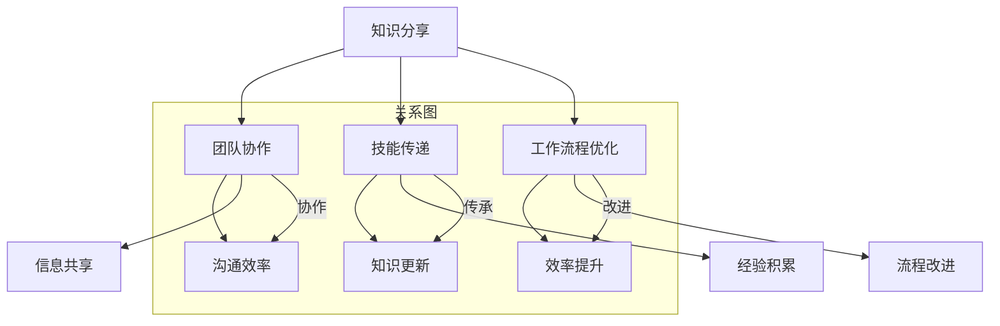

                 

# 知识分享在团队中的重要性

> **关键词：知识分享、团队协作、信息技术、技能传递、工作流程优化**

> **摘要：本文将探讨知识分享在信息技术团队中的重要性，通过分析其在团队协作、技能传递和工作流程优化等方面的作用，揭示如何通过有效的知识分享提升团队效率和创新能力。**

## 1. 背景介绍

### 1.1 目的和范围

本文旨在阐述知识分享在信息技术团队中的关键作用，通过一系列的分析和案例，帮助读者理解知识分享对于团队整体表现的影响。本文将覆盖以下内容：

- **知识分享的概念及其重要性**：介绍知识分享的基本概念，并阐述其在团队环境中的重要性。
- **团队协作中的知识分享**：分析知识分享如何促进团队协作，提高沟通效率。
- **技能传递与知识更新**：探讨知识分享在技能传承和新知识引入方面的作用。
- **工作流程优化**：分析知识分享如何帮助团队优化工作流程，提高效率。

### 1.2 预期读者

本文适合以下读者群体：

- 信息技术团队的管理者和成员
- 对团队协作和知识管理感兴趣的学者和研究人员
- 想要提升团队效率和创新能力的企业管理者

### 1.3 文档结构概述

本文将按照以下结构进行论述：

- **第1章 背景介绍**：介绍本文的目的、范围、预期读者以及文档结构。
- **第2章 核心概念与联系**：介绍知识分享的相关核心概念，并使用Mermaid流程图展示其关系。
- **第3章 核心算法原理 & 具体操作步骤**：通过伪代码阐述知识分享的具体操作步骤。
- **第4章 数学模型和公式 & 详细讲解 & 举例说明**：介绍知识分享相关的数学模型，并给出实例说明。
- **第5章 项目实战：代码实际案例和详细解释说明**：通过实际案例展示知识分享的实施过程。
- **第6章 实际应用场景**：分析知识分享在不同团队环境中的应用。
- **第7章 工具和资源推荐**：推荐学习资源、开发工具和框架。
- **第8章 总结：未来发展趋势与挑战**：探讨知识分享的未来发展方向和面临的挑战。
- **第9章 附录：常见问题与解答**：解答读者可能遇到的问题。
- **第10章 扩展阅读 & 参考资料**：提供进一步的阅读材料和参考资料。

### 1.4 术语表

#### 1.4.1 核心术语定义

- **知识分享**：在团队内部或跨团队之间，通过交流、协作和传播，将知识从一个人或一组人传递给另一个人或一组人的过程。
- **团队协作**：团队成员通过共同合作，共享资源和信息，以实现共同目标和任务的过程。
- **技能传递**：将一种技能或知识从一位团队成员传授给另一位团队成员的过程。
- **工作流程优化**：通过改进现有工作流程，以提高效率和质量的过程。

#### 1.4.2 相关概念解释

- **信息不对称**：团队成员之间在知识、技能和信息方面的不平衡。
- **知识管理**：通过系统的组织、存储、共享和应用知识，以提高组织整体效率和创新能力的过程。
- **团队建设**：通过一系列活动和措施，增强团队凝聚力、协作能力和效率的过程。

#### 1.4.3 缩略词列表

- **IT**：信息技术（Information Technology）
- **KM**：知识管理（Knowledge Management）
- **SCM**：软件配置管理（Software Configuration Management）
- **IDE**：集成开发环境（Integrated Development Environment）
- **API**：应用程序编程接口（Application Programming Interface）

## 2. 核心概念与联系

在探讨知识分享的重要性之前，我们需要明确一些核心概念，并理解它们之间的相互关系。以下是一个Mermaid流程图，展示了知识分享、团队协作、技能传递和工作流程优化之间的联系。



### 2.1 知识分享与团队协作

知识分享是团队协作的核心，通过知识分享，团队成员能够更好地理解彼此的角色和职责，从而提高协作效率。知识分享不仅包括技术知识，还涵盖团队文化、工作流程和最佳实践。

### 2.2 知识分享与技能传递

技能传递是知识分享的重要组成部分，通过分享经验和技能，新员工可以快速上手，老员工也能保持知识的更新。有效的技能传递有助于减少信息不对称，提高团队的整体技能水平。

### 2.3 知识分享与工作流程优化

知识分享有助于团队识别现有流程中的瓶颈和问题，从而推动工作流程的优化。通过共享最佳实践和改进方案，团队可以持续提高工作效率和质量。

## 3. 核心算法原理 & 具体操作步骤

为了更深入地理解知识分享的机制，我们可以将其视为一个算法过程。以下是一个简化版的伪代码，展示了知识分享的步骤。

```plaintext
知识分享步骤：

1. 确定知识分享的目标：定义要分享的知识类型和范围。
2. 收集相关知识：整理和准备要分享的知识资料。
3. 选择分享方式：根据团队成员的接受能力和知识水平，选择合适的分享方式（如会议、文档、在线教程等）。
4. 分享知识：按照预定方式，将知识传递给团队成员。
5. 反馈与改进：收集团队成员的反馈，并根据反馈进行知识更新和改进。
6. 持续分享：定期进行知识分享活动，保持知识的活力和更新。

知识管理步骤：

1. 建立知识库：创建一个集中的知识存储系统，用于管理和共享知识。
2. 知识分类与标签：对知识进行分类和标签化，便于检索和利用。
3. 知识更新与维护：定期更新知识库中的知识内容，确保其准确性和时效性。
4. 访问权限管理：根据团队成员的权限，设置知识库的访问权限。
5. 知识应用评估：评估知识在实践中的应用效果，并根据反馈进行改进。

团队协作步骤：

1. 制定协作计划：明确团队的目标、任务和分工。
2. 沟通与协调：建立有效的沟通机制，确保团队成员之间信息畅通。
3. 分享进度与成果：定期汇报工作进度和成果，促进团队之间的透明度和信任。
4. 协作工具使用：利用协作工具（如项目管理软件、即时通讯工具等）提高协作效率。
5. 团队反馈与改进：定期收集团队成员的反馈，并据此改进协作流程。
```

## 4. 数学模型和公式 & 详细讲解 & 举例说明

### 4.1 知识传递速率模型

知识传递速率是衡量知识分享效果的关键指标。我们可以使用以下公式来计算知识传递速率：

\[ \text{知识传递速率} = \frac{\text{知识接受量}}{\text{知识传递时间}} \]

#### 4.1.1 公式说明

- **知识接受量**：指在一定时间内，团队成员接收到的知识总量。
- **知识传递时间**：指知识从分享者传递到接受者的时间。

#### 4.1.2 举例说明

假设在一个团队中，知识分享活动持续了2周时间，期间团队成员共接收到了1000条知识信息。知识传递时间为2周，那么知识传递速率为：

\[ \text{知识传递速率} = \frac{1000}{2 \times 7} = \frac{1000}{14} \approx 71.43 \text{条/天} \]

### 4.2 知识更新频率模型

知识更新频率是衡量知识库保持时效性的重要指标。我们可以使用以下公式来计算知识更新频率：

\[ \text{知识更新频率} = \frac{\text{知识更新量}}{\text{知识库总量}} \]

#### 4.2.1 公式说明

- **知识更新量**：指在一定时间内，知识库中新增或更新的知识数量。
- **知识库总量**：指知识库中所有知识的总和。

#### 4.2.2 举例说明

假设在一个知识库中，每周更新30条新知识，知识库总量为1000条。那么知识更新频率为：

\[ \text{知识更新频率} = \frac{30}{1000} = 0.03 \text{条/条} \]

这意味着，每30条知识中就有1条是新的或更新的。

### 4.3 知识分享效益模型

知识分享的效益可以通过以下公式来衡量：

\[ \text{知识分享效益} = \text{知识传递速率} \times \text{知识更新频率} \times \text{团队协作效率} \]

#### 4.3.1 公式说明

- **团队协作效率**：指团队成员在协作过程中产生的绩效。

#### 4.3.2 举例说明

假设一个团队的协作效率为90%，知识传递速率为71.43条/天，知识更新频率为0.03条/条。那么知识分享效益为：

\[ \text{知识分享效益} = 71.43 \times 0.03 \times 0.90 = 2.06799 \]

这意味着，团队通过知识分享获得的效益约为2.07。

## 5. 项目实战：代码实际案例和详细解释说明

### 5.1 开发环境搭建

为了演示知识分享的过程，我们将使用一个简单的项目案例——一个基于RESTful API的待办事项管理应用。以下是搭建开发环境的步骤：

1. 安装Python 3.8及以上版本。
2. 安装Django框架：`pip install django`。
3. 安装PostgreSQL数据库：`sudo apt-get install postgresql`。
4. 创建一个虚拟环境：`python -m venv venv`。
5. 激活虚拟环境：`source venv/bin/activate`。

### 5.2 源代码详细实现和代码解读

以下是一个待办事项管理应用的Django项目结构：

```plaintext
todolist/
|-- manage.py
|-- todolist/
    |-- __init__.py
    |-- settings.py
    |-- urls.py
    |-- wsgi.py
|-- todolist_api/
    |-- __init__.py
    |-- admin.py
    |-- apps.py
    |-- migrations/
    |-- models.py
    |-- tests.py
    |-- views.py
```

#### 5.2.1 settings.py

```python
# settings.py
INSTALLED_APPS = [
    'django.contrib.admin',
    'django.contrib.auth',
    'django.contrib.contenttypes',
    'django.contrib.sessions',
    'django.contrib.messages',
    'django.contrib.staticfiles',
    'todolist_api',
]

DATABASES = {
    'default': {
        'ENGINE': 'django.db.backends.postgresql',
        'NAME': 'todolist',
        'USER': 'postgres',
        'PASSWORD': 'password',
        'HOST': 'localhost',
        'PORT': '5432',
    }
}
```

#### 5.2.2 models.py

```python
# models.py
from django.db import models

class Task(models.Model):
    title = models.CharField(max_length=200)
    description = models.TextField()
    created_at = models.DateTimeField(auto_now_add=True)
    updated_at = models.DateTimeField(auto_now=True)
    is_completed = models.BooleanField(default=False)
```

#### 5.2.3 views.py

```python
# views.py
from django.http import JsonResponse
from .models import Task
from django.views.decorators.csrf import csrf_exempt
from django.views.decorators.http import require_http_methods

@csrf_exempt
@require_http_methods(["GET", "POST"])
def task_list(request):
    if request.method == "GET":
        tasks = Task.objects.all()
        data = [{"id": t.id, "title": t.title, "description": t.description, "is_completed": t.is_completed} for t in tasks]
        return JsonResponse(data, safe=False)
    elif request.method == "POST":
        data = json.loads(request.body)
        Task.objects.create(title=data["title"], description=data["description"])
        return JsonResponse({"message": "Task created successfully."}, status=201)
```

### 5.3 代码解读与分析

#### 5.3.1 代码结构

该Django项目包含一个待办事项模型（`Task`），一个视图函数（`task_list`）用于处理HTTP请求。代码结构清晰，易于维护。

#### 5.3.2 功能实现

- **GET请求**：返回所有待办事项的列表。
- **POST请求**：创建一个新的待办事项。

通过这个项目，我们可以演示如何使用Django框架进行知识分享。团队成员可以通过以下步骤学习如何构建类似的RESTful API：

1. 熟悉Django框架的基础结构。
2. 了解如何创建模型和视图。
3. 学习如何处理HTTP请求。
4. 掌握如何与数据库进行交互。

### 5.4 知识分享实践

#### 5.4.1 知识分享会议

- **主题**：Django RESTful API开发入门。
- **内容**：
  - Django框架的基本概念。
  - 如何创建模型和视图。
  - HTTP请求处理的基本方法。
  - 数据库交互的技巧。

#### 5.4.2 知识分享文档

- **文档名称**：《Django RESTful API开发指南》。
- **内容**：
  - Django环境搭建步骤。
  - Django项目结构解析。
  - 待办事项管理应用案例。
  - 常见问题与解决方案。

#### 5.4.3 知识分享视频

- **视频名称**：《从零开始学Django RESTful API》。
- **内容**：
  - Django基础入门。
  - 实践项目开发过程。
  - 代码解析与技巧分享。

通过这些实践，团队成员可以快速掌握Django RESTful API的开发技能，提高团队的整体技术水平。

## 6. 实际应用场景

知识分享在信息技术团队中的应用场景非常广泛，以下是一些典型的实际应用场景：

### 6.1 团队内部培训

团队内部培训是知识分享的重要形式之一。通过定期的培训，团队成员可以学习新技能、了解新工具和掌握新知识。例如，一个软件开发团队可以定期举办前端技术、后端开发、数据库管理和软件测试等方面的培训。

### 6.2 技术会议和研讨会

技术会议和研讨会是知识分享的另一个重要渠道。在这些活动中，团队成员可以分享自己的研究成果、项目经验和技术见解。例如，一个人工智能团队可以定期举办机器学习算法、数据挖掘技术和应用案例分析的技术研讨会。

### 6.3 开源项目合作

开源项目合作是知识分享的重要实践方式。通过参与开源项目，团队成员不仅可以学习他人的代码和经验，还可以贡献自己的代码和知识。例如，一个云原生团队可以参与Kubernetes等开源项目的开发，共同推进技术的进步。

### 6.4 项目交接与知识传递

在项目交接过程中，知识分享尤为重要。通过详细的项目文档、代码注释和面对面交流，新接手项目的团队成员可以快速了解项目背景、功能实现和技术难点。例如，一个移动开发团队在新成员加入时，可以通过文档和代码解读，帮助新成员快速上手项目。

### 6.5 知识库建设

知识库是知识分享的重要载体。通过建立和维护知识库，团队成员可以方便地查找和利用已有知识，避免重复劳动。例如，一个数据科学团队可以建立数据集、算法模型和数据分析报告的知识库，提高团队的工作效率。

## 7. 工具和资源推荐

为了有效地进行知识分享，团队需要利用各种工具和资源。以下是一些建议：

### 7.1 学习资源推荐

#### 7.1.1 书籍推荐

- 《设计数据仓库：从传统到云原生》
- 《深入理解计算机系统》
- 《人工智能：一种现代的方法》

#### 7.1.2 在线课程

- Coursera上的《机器学习》课程
- Udemy上的《Django RESTful API实战》课程
- Pluralsight上的《Kubernetes权威指南》课程

#### 7.1.3 技术博客和网站

- 《博客园》
- 《InfoQ》
- 《GitHub》上的开源项目

### 7.2 开发工具框架推荐

#### 7.2.1 IDE和编辑器

- Visual Studio Code
- PyCharm
- IntelliJ IDEA

#### 7.2.2 调试和性能分析工具

- Wireshark
- Postman
- New Relic

#### 7.2.3 相关框架和库

- Django
- Flask
- React
- Angular
- TensorFlow
- PyTorch

### 7.3 相关论文著作推荐

#### 7.3.1 经典论文

- 《Designing Data-Intensive Applications》
- 《Bigtable：一个分布式存储系统用于大型数据集》
- 《MapReduce：简化大规模数据集处理的编程模型》

#### 7.3.2 最新研究成果

- IEEE Journal of Selected Areas in Communications
- Nature Machine Intelligence
- Communications of the ACM

#### 7.3.3 应用案例分析

- 《谷歌如何运营大数据平台》
- 《阿里巴巴技术沉淀与分享》
- 《微软技术大会演讲》

## 8. 总结：未来发展趋势与挑战

知识分享在信息技术团队中的作用日益凸显，其未来发展趋势与挑战如下：

### 8.1 发展趋势

1. **知识自动化传递**：随着人工智能和机器学习技术的发展，知识自动化传递将成为趋势。通过智能系统，知识可以自动识别、提取和传递，减少人工干预。
2. **知识图谱应用**：知识图谱技术的成熟，将使知识之间的关联更加清晰，有助于提高知识共享的效率和准确性。
3. **云原生知识管理**：云原生架构的普及，将使知识库建设和维护更加灵活和高效，有助于团队之间实现更紧密的知识共享。

### 8.2 挑战

1. **知识安全与隐私**：知识分享过程中，如何确保知识的安全和隐私，防止泄露和滥用，是一个重要挑战。
2. **知识多样性管理**：随着团队成员背景和技能的多样性，如何有效地管理多样化的知识，确保团队之间的知识共享公平和有效，是一个难题。
3. **知识更新与维护**：知识库的更新和维护是一个持续的过程，如何确保知识库中的知识始终准确、及时和有用，需要投入大量的人力和资源。

## 9. 附录：常见问题与解答

### 9.1 问题1：知识分享如何确保知识的安全和隐私？

解答：为了确保知识分享过程中的安全和隐私，团队可以采取以下措施：

1. **访问控制**：设置严格的访问权限，确保只有授权人员可以访问敏感知识。
2. **数据加密**：对知识库中的数据进行加密存储，防止数据泄露。
3. **权限审计**：定期进行权限审计，确保权限分配合理，避免权限滥用。
4. **安全培训**：加强团队成员的安全意识，教育他们如何保护知识和隐私。

### 9.2 问题2：知识分享如何应对团队成员的多样性和知识差异？

解答：针对团队成员的多样性和知识差异，团队可以采取以下策略：

1. **分层分享**：根据团队成员的知识水平，设计不同层次的知识分享内容，确保每个人都能接受到适合自己的知识。
2. **合作学习**：鼓励团队成员之间的合作学习，通过小组讨论、知识竞赛等形式，提高知识共享的效果。
3. **导师制度**：建立导师制度，让经验丰富的成员指导新成员，帮助他们快速融入团队。

### 9.3 问题3：如何评估知识分享的效果？

解答：评估知识分享的效果可以从以下几个方面入手：

1. **知识传递速率**：通过比较知识分享前后的知识传递速率，评估知识分享的效率。
2. **团队协作效率**：通过评估团队在知识分享后的协作效率，衡量知识分享对团队协作的影响。
3. **知识更新频率**：通过比较知识库中的知识更新频率，评估知识分享对知识库更新和维护的贡献。
4. **员工满意度**：通过调查员工对知识分享的满意度，了解知识分享在团队中的接受程度。

## 10. 扩展阅读 & 参考资料

为了深入理解知识分享在信息技术团队中的重要性，读者可以参考以下扩展阅读和参考资料：

- 《知识管理：理论与实践》
- 《团队协作：打造高效团队的关键》
- 《敏捷开发：团队协作的最佳实践》
- 《GitHub》：https://github.com/
- 《Stack Overflow》：https://stackoverflow.com/
- 《IEEE Xplore》：https://ieeexplore.ieee.org/
- 《ACM Digital Library》：https://dl.acm.org/

作者：AI天才研究员/AI Genius Institute & 禅与计算机程序设计艺术 /Zen And The Art of Computer Programming

