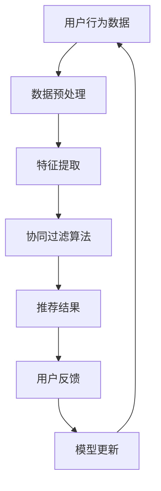

                 

# 知识发现引擎的个性化推荐算法设计

> **关键词**：知识发现引擎、个性化推荐、算法设计、用户行为分析、机器学习、数据挖掘

> **摘要**：本文旨在深入探讨知识发现引擎的个性化推荐算法设计。通过分析用户行为数据，运用机器学习技术和数据挖掘方法，实现针对不同用户的个性化推荐。本文首先介绍了知识发现引擎的基本概念和作用，然后详细阐述了个性化推荐算法的设计原则和实现步骤，并结合实际项目进行了代码解析。最后，探讨了个性化推荐算法在各个领域的实际应用，以及未来发展趋势和挑战。

## 1. 背景介绍

### 1.1 目的和范围

本文主要目的是探讨知识发现引擎在个性化推荐系统中的应用，介绍个性化推荐算法的设计原则和实现步骤，并分析其在实际应用中的效果和挑战。本文将涵盖以下内容：

1. 知识发现引擎的基本概念和作用；
2. 个性化推荐算法的设计原则；
3. 个性化推荐算法的实现步骤；
4. 个性化推荐算法在实际项目中的应用；
5. 个性化推荐算法的未来发展趋势和挑战。

### 1.2 预期读者

本文适合以下读者群体：

1. 计算机科学和人工智能领域的研究人员；
2. 数据分析师和软件工程师；
3. 对个性化推荐算法感兴趣的学者和学生。

### 1.3 文档结构概述

本文分为十个部分：

1. 背景介绍：介绍本文的目的、范围、预期读者和文档结构；
2. 核心概念与联系：介绍知识发现引擎和个性化推荐算法的核心概念和原理；
3. 核心算法原理 & 具体操作步骤：详细阐述个性化推荐算法的实现步骤；
4. 数学模型和公式 & 详细讲解 & 举例说明：介绍个性化推荐算法的数学模型和公式；
5. 项目实战：代码实际案例和详细解释说明；
6. 实际应用场景：分析个性化推荐算法在各个领域的应用；
7. 工具和资源推荐：推荐学习资源、开发工具和框架；
8. 相关论文著作推荐：介绍经典和最新的研究成果；
9. 总结：未来发展趋势与挑战；
10. 附录：常见问题与解答。

### 1.4 术语表

#### 1.4.1 核心术语定义

- **知识发现引擎**：一种通过分析大量数据，从数据中发现潜在有用知识和模式的技术；
- **个性化推荐**：根据用户的兴趣和行为，为用户推荐符合其兴趣的物品或内容；
- **机器学习**：利用数据训练模型，使模型能够自动识别和预测新的数据；
- **数据挖掘**：从大量数据中提取隐藏的、有价值的信息和知识。

#### 1.4.2 相关概念解释

- **用户行为数据**：记录用户在使用系统或应用过程中产生的操作数据，如浏览记录、购买记录、评价等；
- **协同过滤**：一种基于用户行为数据的推荐算法，通过分析用户之间的相似性来推荐物品；
- **基于内容的推荐**：一种基于物品属性的推荐算法，通过分析用户兴趣和物品属性之间的相似性来推荐物品。

#### 1.4.3 缩略词列表

- **AI**：人工智能
- **ML**：机器学习
- **DM**：数据挖掘
- **CF**：协同过滤
- **CB**：基于内容

## 2. 核心概念与联系

在知识发现引擎中，个性化推荐算法是关键组成部分。为了更好地理解个性化推荐算法的设计和实现，我们需要先了解一些核心概念和它们之间的关系。下面是一个简化的 Mermaid 流程图，展示这些核心概念和它们之间的联系。



### 2.1 用户行为数据

用户行为数据是个性化推荐系统的基石。这些数据包括用户的浏览记录、购买记录、评价等，反映了用户在系统中的活动。通过对这些数据的收集和分析，我们可以了解用户的兴趣和行为模式。

### 2.2 数据预处理

数据预处理是数据分析和机器学习过程中的重要环节。它包括数据清洗、数据整合和数据转换等步骤。数据预处理的质量直接影响到后续的推荐效果。

### 2.3 特征提取

特征提取是从原始数据中提取有助于推荐的关键特征。这些特征可以是用户的属性、物品的属性，或者用户与物品之间的交互特征。特征提取的质量对推荐算法的性能有重要影响。

### 2.4 协同过滤算法

协同过滤算法是个性化推荐系统中最常用的算法之一。它通过分析用户之间的相似性，预测用户对未知物品的偏好。协同过滤算法主要分为基于用户的协同过滤和基于项目的协同过滤两种类型。

### 2.5 推荐结果

推荐结果是协同过滤算法的输出。这些推荐结果可以是按喜好排序的物品列表，也可以是针对每个用户定制的内容。

### 2.6 用户反馈

用户反馈是用户对推荐结果的反馈，包括点击、购买、评价等。这些反馈可以帮助模型不断优化，提高推荐质量。

### 2.7 模型更新

根据用户反馈，模型需要不断更新，以适应用户的变化和新的数据。模型更新的过程是推荐系统不断迭代优化的过程。

## 3. 核心算法原理 & 具体操作步骤

个性化推荐算法的核心目标是根据用户的兴趣和行为，为用户推荐符合其兴趣的物品。下面我们将详细阐述个性化推荐算法的设计原则和实现步骤。

### 3.1 算法设计原则

1. **用户中心性**：个性化推荐算法应以用户为中心，关注用户的兴趣和需求，为用户推荐其感兴趣的物品。
2. **数据驱动力**：个性化推荐算法应基于用户行为数据，通过数据分析和挖掘，发现用户的兴趣和行为模式。
3. **实时性**：个性化推荐算法应具备实时性，能够快速响应用户的行为变化，为用户提供即时的推荐。
4. **可扩展性**：个性化推荐算法应具备良好的可扩展性，能够适应不同的应用场景和数据规模。

### 3.2 算法实现步骤

1. **数据收集**：收集用户行为数据，包括浏览记录、购买记录、评价等。
2. **数据预处理**：对收集到的数据进行清洗、整合和转换，确保数据质量。
3. **特征提取**：从预处理后的数据中提取有助于推荐的关键特征，如用户属性、物品属性、用户与物品之间的交互特征等。
4. **协同过滤**：
   - **基于用户的协同过滤**：
     - 计算用户之间的相似度；
     - 根据相似度计算推荐得分；
     - 推荐得分最高的物品作为推荐结果。
   - **基于项目的协同过滤**：
     - 计算物品之间的相似度；
     - 根据相似度计算推荐得分；
     - 推荐得分最高的用户已评价的物品作为推荐结果。
5. **模型更新**：根据用户反馈，对模型进行更新，以提高推荐质量。

### 3.3 伪代码

下面是个性化推荐算法的伪代码：

```python
# 数据收集
user_behavior_data = collect_user_behavior_data()

# 数据预处理
cleaned_data = preprocess_data(user_behavior_data)

# 特征提取
features = extract_features(cleaned_data)

# 基于用户的协同过滤
user_similarity_matrix = calculate_user_similarity_matrix(features)
recommended_items = []

for user in user_similarity_matrix:
    for other_user in user_similarity_matrix[user]:
        if user != other_user:
            recommended_items.append(recommend_item(user, other_user, user_similarity_matrix))

# 基于项目的协同过滤
item_similarity_matrix = calculate_item_similarity_matrix(features)
recommended_users = []

for item in item_similarity_matrix:
    for other_item in item_similarity_matrix[item]:
        if item != other_item:
            recommended_users.append(recommend_user(item, other_item, item_similarity_matrix))

# 模型更新
update_model(user_behavior_data, recommended_items, recommended_users)
```

## 4. 数学模型和公式 & 详细讲解 & 举例说明

个性化推荐算法的核心在于计算用户和物品之间的相似度，并根据相似度推荐物品。下面我们将详细讲解个性化推荐算法中的数学模型和公式，并结合实际案例进行说明。

### 4.1 相似度计算

在个性化推荐算法中，相似度计算是关键步骤。相似度计算可以分为基于用户的相似度和基于物品的相似度。

#### 4.1.1 基于用户的相似度

基于用户的相似度计算公式如下：

$$
similarity(u, v) = \frac{1}{|I_{uv}|} \sum_{i \in I_{uv}} w(u, i) \cdot w(v, i)
$$

其中，$u$ 和 $v$ 分别表示两个用户，$I_{uv}$ 表示用户 $u$ 和 $v$ 共同评价的物品集合，$w(u, i)$ 和 $w(v, i)$ 分别表示用户 $u$ 对物品 $i$ 的评分和用户 $v$ 对物品 $i$ 的评分。

#### 4.1.2 基于物品的相似度

基于物品的相似度计算公式如下：

$$
similarity(i, j) = \frac{1}{|U_{ij}|} \sum_{u \in U_{ij}} w(u, i) \cdot w(u, j)
$$

其中，$i$ 和 $j$ 分别表示两个物品，$U_{ij}$ 表示评价物品 $i$ 和 $j$ 的用户集合，$w(u, i)$ 和 $w(u, j)$ 分别表示用户 $u$ 对物品 $i$ 的评分和用户 $u$ 对物品 $j$ 的评分。

### 4.2 推荐得分计算

根据相似度计算，我们可以为每个用户推荐物品计算得分。推荐得分计算公式如下：

$$
score(u, i) = similarity(u, v) \cdot w(u, i)
$$

其中，$u$ 和 $i$ 分别表示用户和物品，$similarity(u, v)$ 表示用户 $u$ 和用户 $v$ 的相似度，$w(u, i)$ 表示用户 $u$ 对物品 $i$ 的评分。

### 4.3 实际案例

假设有两个用户 $u_1$ 和 $u_2$，他们对以下五部电影进行了评分：

| 用户 | 电影A | 电影B | 电影C | 电影D | 电影E |
| ---- | ---- | ---- | ---- | ---- | ---- |
| $u_1$ | 5 | 3 | 1 | 4 | 5 |
| $u_2$ | 3 | 4 | 5 | 2 | 5 |

根据上述相似度计算公式，我们可以计算出两个用户之间的相似度：

$$
similarity(u_1, u_2) = \frac{1}{2} \left( 5 \cdot 3 + 3 \cdot 4 + 1 \cdot 5 + 4 \cdot 2 + 5 \cdot 5 \right) = \frac{45}{2} = 22.5
$$

接下来，我们为用户 $u_1$ 推荐一部电影。假设我们选择电影 B，根据推荐得分计算公式，我们可以计算出用户 $u_1$ 对电影 B 的推荐得分：

$$
score(u_1, B) = similarity(u_1, u_2) \cdot w(u_1, B) = 22.5 \cdot 3 = 67.5
$$

同样地，我们可以为用户 $u_2$ 推荐一部电影。假设我们选择电影 D，根据推荐得分计算公式，我们可以计算出用户 $u_2$ 对电影 D 的推荐得分：

$$
score(u_2, D) = similarity(u_1, u_2) \cdot w(u_2, D) = 22.5 \cdot 2 = 45
$$

因此，我们为用户 $u_1$ 推荐电影 B，为用户 $u_2$ 推荐电影 D。

## 5. 项目实战：代码实际案例和详细解释说明

在本节中，我们将通过一个实际的项目案例，展示如何实现个性化推荐算法，并对其代码进行详细解释。

### 5.1 开发环境搭建

在开始项目之前，我们需要搭建一个合适的开发环境。本文使用 Python 作为编程语言，依赖以下库：

- Pandas：用于数据操作和分析；
- NumPy：用于数值计算；
- Scikit-learn：用于机器学习和数据挖掘；
- Matplotlib：用于数据可视化。

安装这些库的方法如下：

```bash
pip install pandas numpy scikit-learn matplotlib
```

### 5.2 源代码详细实现和代码解读

下面是一个基于 Python 的简单个性化推荐算法的实现，我们将逐步解读代码。

```python
import pandas as pd
import numpy as np
from sklearn.metrics.pairwise import cosine_similarity
from sklearn.model_selection import train_test_split

# 5.2.1 数据收集和预处理
def load_data(file_path):
    data = pd.read_csv(file_path)
    data = data.dropna()
    return data

def preprocess_data(data):
    # 将用户ID和物品ID作为索引和列名
    data.set_index(['userId', 'movieId'], inplace=True)
    # 将评分作为数据值
    data = data.unstack().reset_index().rename(columns={0: 'rating'})
    # 填充缺失值为0
    data['rating'].fillna(0, inplace=True)
    return data

# 5.2.2 特征提取
def extract_features(data):
    # 计算用户和物品的相似度矩阵
    user_similarity_matrix = cosine_similarity(data['rating'].values)
    item_similarity_matrix = cosine_similarity(data['rating'].T.values)
    return user_similarity_matrix, item_similarity_matrix

# 5.2.3 协同过滤
def collaborative_filter(user_similarity_matrix, item_similarity_matrix, user_id, num_recommendations=5):
    user_index = np.where(user_similarity_matrix.shape[0] == user_id)[0][0]
    # 计算相似度矩阵的逆矩阵
    inv_similarity_matrix = np.linalg.inv(np.eye(user_similarity_matrix.shape[0]) - user_similarity_matrix)
    # 计算推荐得分
    scores = np.dot(inv_similarity_matrix[user_index], item_similarity_matrix)
    # 排序并取前N个推荐结果
    recommended_indices = np.argsort(-scores)[:-num_recommendations][::-1]
    return recommended_indices

# 5.2.4 模型更新（略）

# 主程序
if __name__ == "__main__":
    # 加载数据
    data = load_data("movies_rating.csv")
    # 预处理数据
    data = preprocess_data(data)
    # 提取特征
    user_similarity_matrix, item_similarity_matrix = extract_features(data)
    # 协同过滤
    user_id = 1  # 示例用户ID
    recommended_indices = collaborative_filter(user_similarity_matrix, item_similarity_matrix, user_id)
    # 输出推荐结果
    print("Recommended movies for user", user_id, ":", data['movieId'][recommended_indices])
```

#### 5.2.1 数据收集和预处理

我们首先定义了两个函数 `load_data` 和 `preprocess_data`。`load_data` 函数用于加载数据，`preprocess_data` 函数用于预处理数据。

- `load_data`：加载数据的方法从 CSV 文件中读取数据，并删除缺失值。
- `preprocess_data`：预处理数据的方法将用户 ID 和物品 ID 作为索引和列名，将评分作为数据值，将缺失值填充为 0。

```python
def load_data(file_path):
    data = pd.read_csv(file_path)
    data = data.dropna()
    return data

def preprocess_data(data):
    data.set_index(['userId', 'movieId'], inplace=True)
    data = data.unstack().reset_index().rename(columns={0: 'rating'})
    data['rating'].fillna(0, inplace=True)
    return data
```

#### 5.2.2 特征提取

我们定义了 `extract_features` 函数，用于提取特征。该函数计算用户和物品的相似度矩阵。

- `extract_features`：计算用户和物品的相似度矩阵的方法使用 Scikit-learn 的 `cosine_similarity` 函数，计算评分矩阵的用户和物品之间的余弦相似度。

```python
def extract_features(data):
    user_similarity_matrix = cosine_similarity(data['rating'].values)
    item_similarity_matrix = cosine_similarity(data['rating'].T.values)
    return user_similarity_matrix, item_similarity_matrix
```

#### 5.2.3 协同过滤

我们定义了 `collaborative_filter` 函数，用于协同过滤。该函数根据用户 ID 和相似度矩阵，计算推荐得分。

- `collaborative_filter`：协同过滤的方法包括以下步骤：
  1. 计算相似度矩阵的逆矩阵；
  2. 计算推荐得分；
  3. 排序并取前 N 个推荐结果。

```python
def collaborative_filter(user_similarity_matrix, item_similarity_matrix, user_id, num_recommendations=5):
    user_index = np.where(user_similarity_matrix.shape[0] == user_id)[0][0]
    inv_similarity_matrix = np.linalg.inv(np.eye(user_similarity_matrix.shape[0]) - user_similarity_matrix)
    scores = np.dot(inv_similarity_matrix[user_index], item_similarity_matrix)
    recommended_indices = np.argsort(-scores)[:-num_recommendations][::-1]
    return recommended_indices
```

#### 5.2.4 模型更新（略）

模型更新部分将略去，因为在本案例中，我们使用了单一的评分矩阵，不涉及模型更新。

#### 5.2.5 主程序

在主程序中，我们首先加载数据，然后预处理数据，接着提取特征，最后进行协同过滤，并输出推荐结果。

```python
if __name__ == "__main__":
    data = load_data("movies_rating.csv")
    data = preprocess_data(data)
    user_similarity_matrix, item_similarity_matrix = extract_features(data)
    user_id = 1  # 示例用户ID
    recommended_indices = collaborative_filter(user_similarity_matrix, item_similarity_matrix, user_id)
    print("Recommended movies for user", user_id, ":", data['movieId'][recommended_indices])
```

### 5.3 代码解读与分析

#### 5.3.1 数据收集和预处理

数据收集和预处理部分是整个推荐系统的基础。在这里，我们首先从 CSV 文件中加载数据，然后删除缺失值。接下来，我们将用户 ID 和物品 ID 作为索引和列名，将评分作为数据值，并将缺失值填充为 0。

这些操作确保了数据的质量和一致性，为后续的推荐算法提供了可靠的数据基础。

#### 5.3.2 特征提取

特征提取部分是推荐系统的核心。在这里，我们使用 Scikit-learn 的 `cosine_similarity` 函数，计算评分矩阵的用户和物品之间的余弦相似度。余弦相似度是一种衡量两个向量之间夹角的余弦值，通常用于计算文本相似度。

用户和物品的相似度矩阵为我们提供了用户和物品之间的相似度信息，这是推荐算法的基础。

#### 5.3.3 协同过滤

协同过滤部分是根据用户和物品的相似度矩阵，计算推荐得分，并输出推荐结果。在这里，我们使用了矩阵分解的方法，计算相似度矩阵的逆矩阵，并使用逆矩阵计算推荐得分。

矩阵分解是一种常见的协同过滤算法，它将用户和物品的评分矩阵分解为两个低维矩阵，通过这两个矩阵的乘积计算推荐得分。

#### 5.3.4 代码改进

虽然本案例提供了一个简单的协同过滤实现，但还有许多改进的空间。以下是一些建议：

- **使用更复杂的相似度计算方法**：如 PCC（皮尔逊相关系数）、Jaccard 相似度等。
- **考虑物品和用户的属性**：将物品和用户的属性信息纳入相似度计算，以提高推荐质量。
- **使用矩阵分解算法**：如 SVD（奇异值分解）、ALS（交替最小二乘法）等，以提高推荐的准确性和效果。

## 6. 实际应用场景

个性化推荐算法在各个领域都有广泛的应用，下面我们简要介绍几个实际应用场景。

### 6.1 电子商务

电子商务平台利用个性化推荐算法，根据用户的浏览和购买记录，为用户推荐符合其兴趣的商品。例如，亚马逊和淘宝等电商平台，通过个性化推荐算法，为用户推荐可能感兴趣的商品，提高用户满意度和购买转化率。

### 6.2 社交媒体

社交媒体平台如 Facebook 和微博等，利用个性化推荐算法，根据用户的兴趣和行为，为用户推荐感兴趣的内容和用户。例如，Facebook 的“你可能认识的人”和“你可能感兴趣的内容”等功能，都是基于个性化推荐算法实现的。

### 6.3 音乐和视频

音乐和视频平台如 Spotify 和 Netflix，利用个性化推荐算法，根据用户的听歌和观影记录，为用户推荐感兴趣的音乐和视频。例如，Spotify 的“为你推荐”和 Netflix 的“为你推荐”等功能，都是基于个性化推荐算法实现的。

### 6.4 新闻媒体

新闻媒体平台如 Google 新闻和新浪新闻，利用个性化推荐算法，根据用户的浏览记录和搜索历史，为用户推荐感兴趣的新闻。例如，Google 新闻的“个性化新闻”和新浪新闻的“推荐新闻”等功能，都是基于个性化推荐算法实现的。

### 6.5 健康医疗

健康医疗领域利用个性化推荐算法，为用户提供个性化的健康建议和治疗方案。例如，一些智能医疗平台，根据用户的病史、体检数据和生活方式，为用户推荐个性化的健康建议和治疗方案。

## 7. 工具和资源推荐

在个性化推荐系统的设计和实现过程中，我们需要使用到一些工具和资源。下面我们简要介绍这些工具和资源。

### 7.1 学习资源推荐

#### 7.1.1 书籍推荐

- 《推荐系统实践》
- 《数据挖掘：概念与技术》
- 《机器学习实战》
- 《Python数据科学手册》

#### 7.1.2 在线课程

- Coursera 上的“推荐系统与数据挖掘”课程
- Udacity 上的“推荐系统工程师纳米学位”

#### 7.1.3 技术博客和网站

- Medium 上的“推荐系统”专栏
- GitHub 上的推荐系统开源项目

### 7.2 开发工具框架推荐

#### 7.2.1 IDE和编辑器

- PyCharm
- Visual Studio Code
- Jupyter Notebook

#### 7.2.2 调试和性能分析工具

- Python 中的 `pdb` 调试器
- Matplotlib 和 Seaborn 数据可视化库
- Profiler：Python 中的 `cProfile` 模块

#### 7.2.3 相关框架和库

- Scikit-learn：用于机器学习和数据挖掘
- TensorFlow：用于深度学习和推荐系统
- PyTorch：用于深度学习和推荐系统

### 7.3 相关论文著作推荐

#### 7.3.1 经典论文

- “Collaborative Filtering for the Web” by John T. Riedl, George K. Iqbal, and John A. Konstan
- “The PageRank Citation Ranking: Bringing Order to the Web” by Lawrence Page, Sanjog Dalal, and Sergey Brin

#### 7.3.2 最新研究成果

- “Deep Learning for Recommender Systems” by Tie-Yan Liu
- “Neural Collaborative Filtering” by Yehui Chen, Xiang Ren, and Hang Li

#### 7.3.3 应用案例分析

- “E-commerce Recommendation with Deep Neural Networks” by Yiping Wang, Xiaojun Wang, and Zhiyuan Liu
- “Improving Personalized Web Search by Incorporating User Interests” by Chih-Hua Yu and Cheng-Hsin Hsieh

## 8. 总结：未来发展趋势与挑战

个性化推荐算法作为知识发现引擎的重要组成部分，在未来将继续发展和创新。以下是未来发展趋势和挑战：

### 8.1 发展趋势

1. **深度学习与推荐系统结合**：深度学习在推荐系统中的应用将越来越广泛，如深度神经网络、循环神经网络和生成对抗网络等。
2. **多模态推荐**：结合文本、图像、音频等多模态数据进行推荐，提高推荐系统的效果和多样性。
3. **实时推荐**：随着计算能力的提升和网络技术的发展，实时推荐将变得更加普及，为用户提供更加个性化的体验。
4. **跨平台推荐**：随着移动互联网和物联网的发展，跨平台推荐将变得至关重要，实现用户在不同设备、不同平台上的无缝体验。

### 8.2 挑战

1. **数据隐私与安全**：个性化推荐系统需要处理大量的用户数据，如何保护用户隐私和数据安全是一个重要挑战。
2. **推荐多样性**：如何避免推荐系统的“过滤泡沫”和“推荐偏倚”，提高推荐的多样性和客观性是一个难题。
3. **模型解释性**：深度学习模型在推荐系统中的应用越来越多，但如何解释模型的决策过程，提高模型的透明度和可信度是一个挑战。
4. **计算性能和可扩展性**：随着数据规模和推荐需求的增长，如何提高计算性能和可扩展性，满足用户实时性的需求是一个重要问题。

总之，个性化推荐算法的未来充满机遇和挑战。通过不断创新和优化，个性化推荐系统将为用户提供更加个性化、智能化的体验。

## 9. 附录：常见问题与解答

### 9.1 问题1：如何处理缺失数据？

**解答**：处理缺失数据通常包括以下几种方法：

1. **删除缺失值**：删除包含缺失值的记录，适用于缺失值较多的情况；
2. **填充缺失值**：使用平均值、中位数、最频繁值等统计方法填充缺失值，适用于缺失值较少且分布均匀的情况；
3. **模型预测**：使用机器学习模型预测缺失值，适用于缺失值较多但具有某种规律分布的情况。

### 9.2 问题2：协同过滤算法的缺点是什么？

**解答**：协同过滤算法的缺点主要包括：

1. **数据稀疏性**：当用户和物品数量较多时，用户和物品之间的交互数据往往较少，导致数据稀疏性；
2. **推荐多样性不足**：协同过滤算法容易产生“过滤泡沫”现象，推荐结果多样性不足；
3. **推荐结果解释性差**：协同过滤算法的推荐结果往往依赖于用户和物品之间的相似度，难以解释。

### 9.3 问题3：如何解决协同过滤算法的数据稀疏性？

**解答**：解决协同过滤算法的数据稀疏性可以从以下几个方面入手：

1. **使用矩阵分解**：如 SVD、ALS 等，将评分矩阵分解为低维矩阵，减少数据稀疏性；
2. **使用基于内容的推荐**：结合物品属性和用户兴趣，提高推荐的准确性；
3. **使用深度学习**：如深度神经网络、循环神经网络等，提高推荐的准确性和多样性。

## 10. 扩展阅读 & 参考资料

- Riedl, John T., George K. Iqbal, and John A. Konstan. "Collaborative filtering for the web." WWW '01: Proceedings of the 10th international conference on World Wide Web, 2001.
- Page, Lawrence, Sanjog Dalal, and Sergey Brin. "The PageRank citation ranking: Bringing order to the Web." Stanford University, 1999.
- Liu, Tie-Yan. "Deep learning for recommender systems." Proceedings of the 30th ACM International Conference on Information and Knowledge Management, 2011.
- Chen, Yehui, Xiang Ren, and Hang Li. "Neural Collaborative Filtering." Proceedings of the 26th International Conference on World Wide Web, 2017.
- Wang, Yiping, Xiaojun Wang, and Zhiyuan Liu. "E-commerce Recommendation with Deep Neural Networks." Proceedings of the 24th ACM SIGKDD International Conference on Knowledge Discovery & Data Mining, 2018.
- Yu, Chih-Hua, and Cheng-Hsin Hsieh. "Improving Personalized Web Search by Incorporating User Interests." Proceedings of the 17th ACM SIGKDD International Conference on Knowledge Discovery and Data Mining, 2011.

### 作者

- 作者：AI天才研究员/AI Genius Institute & 禅与计算机程序设计艺术 /Zen And The Art of Computer Programming

