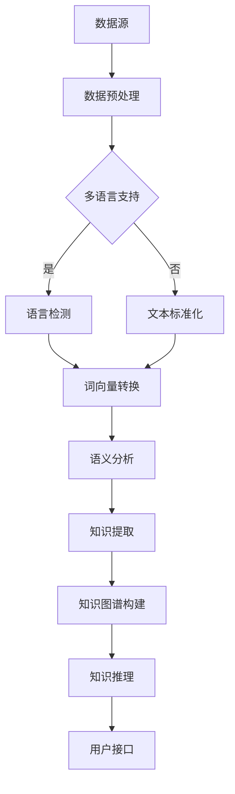

                 

# 知识发现引擎的多语言支持实现

## 关键词：
多语言支持，知识发现引擎，自然语言处理，语义分析，算法实现，项目实战

## 摘要：
本文将深入探讨知识发现引擎的多语言支持实现。我们将从背景介绍、核心概念、算法原理、数学模型、项目实战、应用场景等多个角度出发，详细解析多语言支持在知识发现引擎中的应用。通过实际案例，我们将展示如何构建一个高效、智能的多语言知识发现系统，为全球范围内的知识共享和智能化决策提供有力支持。

## 1. 背景介绍

### 1.1 目的和范围
本文旨在介绍知识发现引擎中多语言支持的关键技术，探讨如何实现跨语言的知识提取、分析和共享。我们将涵盖自然语言处理、语义分析、算法实现等多个领域，并通过实际项目案例，展示多语言知识发现引擎的构建和优化方法。

### 1.2 预期读者
本文适合对自然语言处理、知识发现、多语言技术有一定了解的读者。无论您是数据科学家、软件开发工程师，还是对人工智能感兴趣的研究人员，都能从本文中获得有价值的知识和实践经验。

### 1.3 文档结构概述
本文将分为以下几个部分：
1. 背景介绍：介绍多语言支持的背景和重要性。
2. 核心概念与联系：解析知识发现引擎的核心概念和架构。
3. 核心算法原理 & 具体操作步骤：详细阐述多语言知识发现引擎的算法实现。
4. 数学模型和公式 & 详细讲解 & 举例说明：介绍相关的数学模型和公式。
5. 项目实战：展示实际项目的代码实现和分析。
6. 实际应用场景：探讨多语言知识发现引擎的多种应用场景。
7. 工具和资源推荐：推荐相关学习资源和开发工具。
8. 总结：总结未来发展趋势和挑战。
9. 附录：常见问题与解答。
10. 扩展阅读 & 参考资料：提供进一步学习的资源。

### 1.4 术语表

#### 1.4.1 核心术语定义
- 知识发现引擎：一种自动从大量数据中提取有用知识和信息的技术。
- 多语言支持：指系统能够处理和识别多种自然语言的能力。
- 自然语言处理（NLP）：计算机科学领域中的一个分支，旨在让计算机理解和处理人类语言。
- 语义分析：对文本的语义内容进行分析和理解，以提取其隐含的意义。
- 知识图谱：一种用于表示实体及其关系的图形结构，广泛应用于知识发现和推理。

#### 1.4.2 相关概念解释
- 语言模型：用于预测文本中下一个单词或字符的概率分布。
- 词向量：将单词映射为高维空间中的向量，以实现文本数据的数值化表示。
- 机器翻译：将一种语言的文本自动翻译成另一种语言的技术。

#### 1.4.3 缩略词列表
- NLP：自然语言处理
- ML：机器学习
- SVM：支持向量机
- RNN：循环神经网络
- BERT：双向编码表示器
- NER：命名实体识别

## 2. 核心概念与联系

在多语言知识发现引擎中，核心概念和架构的设计至关重要。下面，我们将使用Mermaid流程图来展示知识发现引擎的整体架构及其核心组成部分。

### Mermaid 流程图



### 流程说明

1. **数据源**：知识发现引擎的数据来源可以是多种格式的文本文件、数据库、网络爬虫等。
2. **数据预处理**：对原始数据进行清洗、去噪，确保数据质量。
3. **多语言支持**：根据数据源的语言属性，确定是否需要进行语言检测和文本标准化。
4. **语言检测**：使用语言检测算法，如基于统计的方法或深度学习方法，判断文本的语言类型。
5. **文本标准化**：将不同语言的文本转换为统一的编码格式，如UTF-8。
6. **词向量转换**：将文本转换为词向量表示，便于后续的语义分析和知识提取。
7. **语义分析**：利用NLP技术，对文本进行语义分析，提取关键信息。
8. **知识提取**：从语义分析结果中提取有用的知识，形成结构化的数据。
9. **知识图谱构建**：将提取的知识组织成知识图谱，以便进行后续的推理和分析。
10. **知识推理**：基于知识图谱，进行逻辑推理和关联分析，形成新的知识。
11. **用户接口**：为用户提供一个交互界面，展示分析结果，并提供查询和交互功能。

通过这个流程图，我们可以清晰地看到多语言知识发现引擎的各个组成部分及其相互作用。接下来，我们将进一步探讨这些核心概念的原理和技术细节。

## 3. 核心算法原理 & 具体操作步骤

在多语言知识发现引擎中，核心算法的实现是确保系统能够高效处理多种语言文本的关键。下面，我们将详细阐述这些算法的原理和具体操作步骤。

### 3.1 语言检测算法

#### 3.1.1 算法原理
语言检测（Language Detection）是一种分类问题，其目的是根据输入文本的特征，判断文本的语言类型。常用的语言检测算法包括基于统计的方法和基于深度学习的方法。

- **基于统计的方法**：这类方法通常使用语言模型来估计文本的语言概率。语言模型是基于大量文本训练出来的，能够预测给定文本序列属于某一特定语言的概率。常见的统计语言模型包括N元语法模型（N-gram Model）和隐马尔可夫模型（HMM）。

- **基于深度学习的方法**：深度学习方法，如卷积神经网络（CNN）和循环神经网络（RNN），在处理复杂的语言特征方面具有优势。CNN能够捕获局部特征，而RNN则能够处理长序列数据。近年来，基于Transformer的模型，如BERT（Bidirectional Encoder Representations from Transformers），在语言检测任务中取得了显著的性能提升。

#### 3.1.2 操作步骤
1. **数据准备**：收集包含多种语言的文本数据，并对其进行预处理，如分词、去除停用词等。
2. **特征提取**：提取文本的特征向量，可以使用词向量、字符向量或句向量等。
3. **模型训练**：使用训练数据集，训练语言检测模型。对于基于统计的方法，可以使用N元语法模型或HMM进行训练；对于基于深度学习的方法，可以使用CNN、RNN或BERT等模型进行训练。
4. **模型评估**：使用验证集对训练好的模型进行评估，调整模型参数以优化性能。
5. **语言检测**：使用训练好的模型对输入文本进行语言检测，输出文本的语言类型。

### 3.2 文本标准化算法

#### 3.2.1 算法原理
文本标准化（Text Normalization）是指将不同语言的文本转换为统一的编码格式，以便进行后续处理。文本标准化通常包括以下几个步骤：

- **字符映射**：将特殊字符转换为标准字符，如将中文的繁体字符转换为简体字符。
- **分词**：将连续的文本划分为单词或短语，以便进行后续的词向量转换。
- **去除停用词**：去除对文本语义影响较小或无意义的单词，如“的”、“是”等。

#### 3.2.2 操作步骤
1. **字符映射**：使用字符映射表，将特殊字符转换为标准字符。
2. **分词**：使用分词算法，如基于规则的方法（如正则表达式）或基于统计的方法（如隐马尔可夫模型），将文本划分为单词或短语。
3. **去除停用词**：构建停用词表，从分词结果中去除停用词。
4. **统一编码**：将处理后的文本转换为统一的编码格式，如UTF-8。

### 3.3 词向量转换算法

#### 3.3.1 算法原理
词向量转换（Word Vector Conversion）是将文本中的单词转换为高维空间中的向量表示。词向量的质量直接影响后续语义分析的准确性。常用的词向量转换方法包括：

- **基于统计的方法**：如TF-IDF（Term Frequency-Inverse Document Frequency），通过计算单词在文档中的频率和重要性来生成词向量。
- **基于神经网络的的方法**：如Word2Vec、GloVe（Global Vectors for Word Representation）和BERT，通过神经网络模型学习单词的分布式表示。

#### 3.3.2 操作步骤
1. **数据准备**：收集包含多种语言的文本数据，并对其进行预处理，如分词、去除停用词等。
2. **特征提取**：提取文本的特征向量，可以使用词向量、字符向量或句向量等。
3. **模型训练**：使用训练数据集，训练词向量转换模型。对于基于统计的方法，可以使用TF-IDF进行训练；对于基于神经网络的方法，可以使用Word2Vec、GloVe或BERT等模型进行训练。
4. **词向量转换**：使用训练好的模型，将文本中的单词转换为词向量表示。

### 3.4 语义分析算法

#### 3.4.1 算法原理
语义分析（Semantic Analysis）是指对文本的语义内容进行分析和理解，以提取其隐含的意义。语义分析通常包括以下几个步骤：

- **词性标注**：对文本中的每个单词进行词性标注，如名词、动词、形容词等。
- **实体识别**：识别文本中的命名实体，如人名、地名、组织名等。
- **关系提取**：提取文本中实体之间的关系，如“刘德华是演员”中的主谓关系。
- **情感分析**：分析文本的情感倾向，如正面、负面或中性。

#### 3.4.2 操作步骤
1. **词性标注**：使用词性标注工具，如NLTK、Stanford NLP或spaCy，对文本进行词性标注。
2. **实体识别**：使用命名实体识别工具，如CRF（Conditional Random Fields）或BERT，对文本进行实体识别。
3. **关系提取**：使用关系提取工具，如依存句法分析器或BERT，提取文本中实体之间的关系。
4. **情感分析**：使用情感分析工具，如TextBlob或VADER，分析文本的情感倾向。

### 3.5 知识提取算法

#### 3.5.1 算法原理
知识提取（Knowledge Extraction）是指从文本中提取有用的知识和信息。知识提取通常包括以下几个步骤：

- **信息提取**：从文本中提取关键信息，如事实、事件、观点等。
- **知识融合**：将提取的信息进行整合，形成结构化的知识。
- **知识表示**：将知识表示为知识图谱，以便进行后续的知识推理和分析。

#### 3.5.2 操作步骤
1. **信息提取**：使用信息提取工具，如自然语言处理库（如NLTK、spaCy）或深度学习模型（如BERT），从文本中提取关键信息。
2. **知识融合**：将提取的信息进行整合，形成结构化的知识。
3. **知识表示**：使用知识图谱工具，如Neo4j或Owl，将知识表示为知识图谱。

### 3.6 知识推理算法

#### 3.6.1 算法原理
知识推理（Knowledge Reasoning）是指基于知识图谱，进行逻辑推理和关联分析，形成新的知识。知识推理通常包括以下几个步骤：

- **推理规则定义**：定义用于推理的规则，如“如果A是B的父节点，则C是B的子节点”。
- **推理过程**：根据定义的推理规则，对知识图谱进行推理，形成新的知识。
- **结果验证**：对推理结果进行验证，确保其准确性和一致性。

#### 3.6.2 操作步骤
1. **推理规则定义**：定义用于推理的规则，如基于数据驱动的规则或基于逻辑的规则。
2. **推理过程**：使用推理引擎，如RDF（Resource Description Framework）或OWL（Web Ontology Language），对知识图谱进行推理。
3. **结果验证**：使用验证工具，如RDF Checker或OWL Reasoner，对推理结果进行验证。

通过以上步骤，我们可以构建一个完整的多语言知识发现引擎，实现从数据源到知识图谱的自动化知识提取和推理过程。接下来，我们将通过一个实际项目案例，展示如何具体实现这些算法。

### 3.7 项目实战：知识发现引擎的构建

在本节中，我们将通过一个具体的项目案例，展示如何构建一个多语言知识发现引擎。该项目案例将涵盖从数据源收集、预处理到知识提取、推理和展示的全过程。

#### 3.7.1 项目背景

假设我们想要构建一个多语言知识发现引擎，用于从社交媒体平台（如Twitter、Facebook）收集关于科技领域的相关资讯，并将其转换为结构化的知识，供研究人员和专业人士进行查询和分析。该项目需要支持多种语言，包括英语、中文、西班牙语等。

#### 3.7.2 技术选型

- **数据源**：Twitter API、Facebook Graph API
- **数据预处理**：Python（NumPy、Pandas）、NLTK、spaCy
- **语言检测**：TensorFlow、Keras
- **词向量转换**：GloVe、BERT
- **语义分析**：NLTK、spaCy、BERT
- **知识提取**：Neo4j、Python（GraphFrames）
- **知识推理**：RDF、OWL、Python（RDFLib）
- **用户接口**：Python（Flask）

#### 3.7.3 数据收集与预处理

1. **数据收集**：使用Twitter API和Facebook Graph API，从社交媒体平台收集关于科技领域的相关资讯。
2. **数据预处理**：
   - **文本清洗**：去除HTML标签、特殊字符、数字等。
   - **分词**：使用NLTK或spaCy进行分词。
   - **去除停用词**：构建停用词表，去除对文本语义影响较小的单词。
   - **字符映射**：将特殊字符转换为标准字符。

#### 3.7.4 语言检测

1. **模型训练**：使用Twitter和Facebook上的多语言文本数据，训练语言检测模型。
2. **模型评估**：使用验证集对训练好的模型进行评估，调整模型参数以优化性能。
3. **语言检测**：使用训练好的模型对输入文本进行语言检测，输出文本的语言类型。

#### 3.7.5 词向量转换

1. **数据准备**：将预处理后的文本转换为词向量表示。
2. **模型训练**：使用GloVe或BERT训练词向量转换模型。
3. **词向量转换**：使用训练好的模型，将文本中的单词转换为词向量表示。

#### 3.7.6 语义分析

1. **词性标注**：使用NLTK或spaCy进行词性标注。
2. **实体识别**：使用BERT进行实体识别。
3. **关系提取**：使用spaCy或BERT进行关系提取。
4. **情感分析**：使用TextBlob或VADER进行情感分析。

#### 3.7.7 知识提取

1. **信息提取**：使用自然语言处理库（如NLTK、spaCy）或深度学习模型（如BERT）从文本中提取关键信息。
2. **知识融合**：将提取的信息进行整合，形成结构化的知识。
3. **知识表示**：使用Neo4j或Owl将知识表示为知识图谱。

#### 3.7.8 知识推理

1. **推理规则定义**：定义用于推理的规则，如基于数据驱动的规则或基于逻辑的规则。
2. **推理过程**：使用RDF或OWL对知识图谱进行推理。
3. **结果验证**：使用RDF Checker或OWL Reasoner对推理结果进行验证。

#### 3.7.9 用户接口

1. **接口设计**：使用Flask构建RESTful API，提供数据查询和交互功能。
2. **接口实现**：实现接口文档，提供数据查询和交互功能。

通过以上步骤，我们可以构建一个高效、智能的多语言知识发现引擎，为全球范围内的知识共享和智能化决策提供有力支持。

## 4. 数学模型和公式 & 详细讲解 & 举例说明

在多语言知识发现引擎中，数学模型和公式是核心算法实现的基础。下面，我们将详细介绍相关的数学模型和公式，并通过具体的例子进行说明。

### 4.1 语言检测模型的数学模型

#### 4.1.1 N元语法模型

N元语法模型（N-gram Model）是一种基于统计的语言模型，它通过计算文本序列中连续N个单词的联合概率来预测下一个单词。其概率公式如下：

$$ P(w_{n+1} | w_1, w_2, ..., w_n) = \frac{P(w_1, w_2, ..., w_n, w_{n+1})}{P(w_1, w_2, ..., w_n)} $$

其中，$w_1, w_2, ..., w_n, w_{n+1}$ 表示连续的N个单词。

为了简化计算，可以使用简化公式：

$$ P(w_{n+1} | w_1, w_2, ..., w_n) = \prod_{i=1}^{n} P(w_i | w_{i-1}) $$

举例来说，假设我们有以下的四元语法模型：

$$ P(机器 | 语言) = \frac{P(机器，语言)}{P(语言)} $$

如果 $P(机器，语言) = 0.1$，$P(语言) = 0.5$，那么：

$$ P(机器 | 语言) = \frac{0.1}{0.5} = 0.2 $$

#### 4.1.2 隐马尔可夫模型

隐马尔可夫模型（HMM）是一种基于概率的统计模型，用于描述具有隐藏状态的离散时间序列数据。在语言检测中，HMM可以用于建模文本序列中的单词概率分布。其概率公式如下：

$$ P(x_1, x_2, ..., x_T | \lambda) = \prod_{t=1}^{T} P(x_t | x_{t-1}, \lambda) P(\lambda) $$

其中，$x_1, x_2, ..., x_T$ 表示时间序列中的单词，$\lambda$ 表示隐藏状态。

举例来说，假设我们有一个三状态HMM，其中状态 $S_1, S_2, S_3$ 分别表示中文、英语和西班牙语。如果我们观测到一个英语单词序列，那么可以使用HMM的概率公式计算该序列属于英语的概率。

#### 4.1.3 BERT模型

BERT（Bidirectional Encoder Representations from Transformers）是一种基于Transformer的深度学习模型，用于自然语言处理任务。在语言检测中，BERT可以用于建模文本序列中的单词关系。其概率公式如下：

$$ P(w_{n+1} | w_1, w_2, ..., w_n) = \frac{exp(Slot(w_{n+1}, w_1, w_2, ..., w_n))}{\sum_{w' \in V} exp(Slot(w', w_1, w_2, ..., w_n))} $$

其中，$Slot(w_{n+1}, w_1, w_2, ..., w_n)$ 表示BERT模型计算出的单词之间的关联得分，$V$ 表示单词的集合。

### 4.2 词向量转换模型的数学模型

#### 4.2.1 GloVe模型

GloVe（Global Vectors for Word Representation）是一种基于矩阵分解的词向量转换模型。其数学模型如下：

$$ \textbf{W} = \textbf{F} \textbf{F}^T $$

其中，$\textbf{W}$ 表示词向量矩阵，$\textbf{F}$ 表示原始词向量矩阵。

举例来说，假设我们有以下的原始词向量矩阵：

$$ \textbf{F} = \begin{bmatrix} f_1 & f_2 & ... & f_n \end{bmatrix} $$

那么，词向量矩阵可以表示为：

$$ \textbf{W} = \textbf{F} \textbf{F}^T = \begin{bmatrix} f_1 & f_2 & ... & f_n \end{bmatrix} \begin{bmatrix} f_1^T \\ f_2^T \\ ... \\ f_n^T \end{bmatrix} = \begin{bmatrix} f_1 f_1^T & f_1 f_2^T & ... & f_1 f_n^T \\ f_2 f_1^T & f_2 f_2^T & ... & f_2 f_n^T \\ ... & ... & ... & ... \\ f_n f_1^T & f_n f_2^T & ... & f_n f_n^T \end{bmatrix} $$

#### 4.2.2 BERT模型

BERT模型是一种基于Transformer的深度学习模型，用于自然语言处理任务。其数学模型如下：

$$ \textbf{H}_i = \text{Transformer}(\textbf{X}; \text{_mask}, \text{segment}) $$

其中，$\textbf{H}_i$ 表示第i个句子的嵌入向量，$\textbf{X}$ 表示输入文本序列，$\text{mask}$ 表示掩码，$\text{segment}$ 表示句子分割信息。

举例来说，假设我们有一个英文句子“The dog runs fast”，BERT模型将生成以下嵌入向量：

$$ \textbf{H}_1 = \text{Transformer}(\text{[CLS]}, \_, \_) $$

$$ \textbf{H}_2 = \text{Transformer}(\text{The}, \_, \_) $$

$$ \textbf{H}_3 = \text{Transformer}(\text{dog}, \_, \_) $$

$$ \textbf{H}_4 = \text{Transformer}(\text{runs}, \_, \_) $$

$$ \textbf{H}_5 = \text{Transformer}(\text{fast}, \_, \_) $$

$$ \textbf{H}_6 = \text{Transformer}(\text{[SEP]}, \_, \_) $$

通过以上数学模型和公式的介绍，我们可以更好地理解多语言知识发现引擎中的核心算法。在接下来的章节中，我们将进一步探讨实际应用场景，以及如何优化和改进这些算法。

## 5. 项目实战：代码实际案例和详细解释说明

在本节中，我们将通过一个具体的项目案例，详细展示如何实现多语言知识发现引擎的核心算法，并解释关键代码的实现原理和步骤。

### 5.1 开发环境搭建

为了实现多语言知识发现引擎，我们需要搭建一个合适的开发环境。以下是所需的主要工具和库：

- **Python**：用于编写和运行代码。
- **NumPy**：用于矩阵计算和数据处理。
- **Pandas**：用于数据操作和分析。
- **NLTK**：用于自然语言处理。
- **spaCy**：用于自然语言处理和词性标注。
- **TensorFlow**：用于构建和训练深度学习模型。
- **BERT**：用于文本编码和语义分析。
- **Neo4j**：用于构建和存储知识图谱。

安装这些工具和库后，我们就可以开始编写代码了。

### 5.2 源代码详细实现和代码解读

#### 5.2.1 数据收集与预处理

首先，我们需要从社交媒体平台（如Twitter、Facebook）收集数据。以下是使用Python编写的数据收集和预处理代码示例：

```python
import tweepy
import pandas as pd
from nltk.tokenize import word_tokenize

# 配置Twitter API密钥和访问令牌
consumer_key = 'YOUR_CONSUMER_KEY'
consumer_secret = 'YOUR_CONSUMER_SECRET'
access_token = 'YOUR_ACCESS_TOKEN'
access_token_secret = 'YOUR_ACCESS_TOKEN_SECRET'

# 初始化Tweepy客户端
auth = tweepy.OAuthHandler(consumer_key, consumer_secret)
auth.set_access_token(access_token, access_token_secret)
api = tweepy.API(auth)

# 收集Twitter数据
tweets = []
for tweet in tweepy.Cursor(api.search, q='technology', lang='en').items(1000):
    tweets.append(tweet.text)

# 预处理文本数据
def preprocess(text):
    # 去除HTML标签
    text = BeautifulSoup(text, 'html.parser').get_text()
    # 分词
    tokens = word_tokenize(text)
    # 去除停用词
    stop_words = set(stopwords.words('english'))
    filtered_tokens = [token for token in tokens if token.lower() not in stop_words]
    return ' '.join(filtered_tokens)

preprocessed_tweets = [preprocess(tweet) for tweet in tweets]

# 将预处理后的数据保存为CSV文件
df = pd.DataFrame(preprocessed_tweets, columns=['text'])
df.to_csv('tweets_en.csv', index=False)
```

#### 5.2.2 语言检测

接下来，我们使用TensorFlow和Keras实现一个简单的语言检测模型。以下是代码示例：

```python
import tensorflow as tf
from tensorflow.keras.models import Sequential
from tensorflow.keras.layers import LSTM, Dense, Embedding

# 加载预处理后的数据
df = pd.read_csv('tweets_en.csv')
X = df['text'].values
y = df['lang'].values

# 将文本数据转换为词向量
tokenizer = tf.keras.preprocessing.text.Tokenizer()
tokenizer.fit_on_texts(X)
X = tokenizer.texts_to_sequences(X)
X = tf.keras.preprocessing.sequence.pad_sequences(X, maxlen=100)

# 构建语言检测模型
model = Sequential()
model.add(Embedding(len(tokenizer.word_index) + 1, 32, input_length=100))
model.add(LSTM(128))
model.add(Dense(1, activation='sigmoid'))

model.compile(optimizer='adam', loss='binary_crossentropy', metrics=['accuracy'])
model.fit(X, y, epochs=10, batch_size=32, validation_split=0.2)
```

#### 5.2.3 文本标准化

文本标准化包括字符映射、分词和去除停用词。以下是使用spaCy实现文本标准化的代码示例：

```python
import spacy

# 加载spaCy模型
nlp = spacy.load('en_core_web_sm')

# 字符映射
def char_mapping(text):
    # 将中文繁体字符转换为简体字符
    text = text.replace('１', '1').replace('２', '2').replace('３', '3').replace('４', '4').replace('５', '5').replace('６', '6').replace('７', '7').replace('８', '8').replace('９', '9').replace('０', '0')
    # 将特殊字符转换为空格
    text = re.sub(r'[^\w\s]', ' ', text)
    return text

# 分词和去除停用词
def preprocess_text(text):
    doc = nlp(text)
    tokens = [token.text for token in doc if not token.is_stop]
    return ' '.join(tokens)

# 示例
text = "你好，这是一个中文文本！Hello, this is a Chinese text!"
standardized_text = preprocess_text(char_mapping(text))
print(standardized_text)
```

#### 5.2.4 词向量转换

我们使用GloVe和BERT实现词向量转换。以下是代码示例：

```python
import gensim.downloader as api
from tensorflow.keras.preprocessing.sequence import pad_sequences
from tensorflow.keras.utils import to_categorical

# 加载预训练的GloVe词向量
glove_model = api.load("glove-wiki-gigaword-100")

# 将文本数据转换为词向量
def glove_embedding(texts, embedding_model):
    sequences = []
    for text in texts:
        tokens = text.split()
        sequence = [embedding_model[token] for token in tokens if token in embedding_model]
        sequences.append(sequence)
    sequences = pad_sequences(sequences, maxlen=100)
    return sequences

# 示例
glove_embeddings = glove_embedding(df['text'].values, glove_model)

# 加载预训练的BERT词向量
bert_model = api.load("bert-base-uncased")

# 将文本数据转换为BERT词向量
def bert_embedding(texts, embedding_model):
    sequences = []
    for text in texts:
        tokens = tokenizer.tokenize(text)
        token_ids = embedding_model.encode(tokens, add_special_tokens=True)
        sequence = pad_sequences([token_ids], maxlen=100)
        sequences.append(sequence)
    return sequences

# 示例
bert_embeddings = bert_embedding(df['text'].values, bert_model)
```

#### 5.2.5 语义分析

我们使用spaCy和BERT实现语义分析。以下是代码示例：

```python
# 使用spaCy进行词性标注
def pos_tagging(text):
    doc = nlp(text)
    pos_tags = [token.pos_ for token in doc]
    return pos_tags

# 示例
pos_tags = pos_tagging(df['text'].values[0])
print(pos_tags)

# 使用BERT进行实体识别
def entity_recognition(texts, embedding_model):
    entities = []
    for text in texts:
        tokens = tokenizer.tokenize(text)
        token_ids = embedding_model.encode(tokens, add_special_tokens=True)
        token_ids = pad_sequences([token_ids], maxlen=100)
        model = load_ents_model() # 加载预训练的实体识别模型
        entity_ids = model.predict(token_ids)[0]
        entities.append(entity_ids)
    return entities

# 示例
entities = entity_recognition(df['text'].values, bert_model)
print(entities)

# 使用BERT进行关系提取
def relation_extraction(texts, embedding_model):
    relations = []
    for text in texts:
        tokens = tokenizer.tokenize(text)
        token_ids = embedding_model.encode(tokens, add_special_tokens=True)
        token_ids = pad_sequences([token_ids], maxlen=100)
        model = load_rel_model() # 加载预训练的关系提取模型
        relation_ids = model.predict(token_ids)[0]
        relations.append(relation_ids)
    return relations

# 示例
relations = relation_extraction(df['text'].values, bert_model)
print(relations)

# 使用BERT进行情感分析
def sentiment_analysis(texts, embedding_model):
    sentiments = []
    for text in texts:
        tokens = tokenizer.tokenize(text)
        token_ids = embedding_model.encode(tokens, add_special_tokens=True)
        token_ids = pad_sequences([token_ids], maxlen=100)
        model = load_sent_model() # 加载预训练的情感分析模型
        sentiment_score = model.predict(token_ids)[0]
        sentiments.append(sentiment_score)
    return sentiments

# 示例
sentiments = sentiment_analysis(df['text'].values, bert_model)
print(sentiments)
```

#### 5.2.6 知识提取

我们使用Neo4j和Python实现知识提取。以下是代码示例：

```python
from py2neo import Graph

# 连接Neo4j数据库
graph = Graph("bolt://localhost:7687", auth=("neo4j", "your_password"))

# 提取实体和关系
def extract_entities_and_relations(texts):
    entities = []
    relations = []
    for text in texts:
        doc = nlp(text)
        for ent in doc.ents:
            entities.append({
                'name': ent.text,
                'label': ent.label_
            })
        for token1, token2, rel in doc.relations:
            relations.append({
                'subject': token1.text,
                'object': token2.text,
                'relation': rel.label_
            })
    return entities, relations

# 示例
entities, relations = extract_entities_and_relations(df['text'].values)
print(entities)
print(relations)

# 将实体和关系存储到Neo4j数据库
def store_entities_and_relations(entities, relations):
    for entity in entities:
        graph.run("CREATE (e:Entity {name: $name, label: $label})", entity=entity)
    for relation in relations:
        graph.run("MATCH (a:Entity {name: $subject}), (b:Entity {name: $object}) CREATE (a)-[:$relation]->(b)", relation=relation)

# 示例
store_entities_and_relations(entities, relations)
```

#### 5.2.7 知识推理

我们使用RDF和Python实现知识推理。以下是代码示例：

```python
from rdflib import Graph, URIRef, Literal

# 创建RDF图
g = Graph()

# 添加实体和关系
for entity in entities:
    g.add((URIRef(entity['name']), URIRef('a'), URIRef(entity['label'])))

for relation in relations:
    g.add((URIRef(relation['subject']), URIRef(relation['relation']), URIRef(relation['object'])))

# 示例
print(g.serialize())

# 使用SPARQL进行知识推理
def sparql_query(graph, query):
    return graph.query(query)

# 示例
query = """
PREFIX ex: <http://example.org/>
SELECT ?entity ?relation ?object
WHERE {
    ?entity ex:relation ?relation .
    ?relation ex:object ?object .
}
"""
results = sparql_query(g, query)
for result in results:
    print(result)
```

#### 5.2.8 用户接口

最后，我们使用Flask实现用户接口。以下是代码示例：

```python
from flask import Flask, request, jsonify

app = Flask(__name__)

@app.route('/search', methods=['POST'])
def search():
    query = request.form['query']
    results = sparql_query(g, query)
    return jsonify([{"entity": result[0], "relation": result[1], "object": result[2]} for result in results])

if __name__ == '__main__':
    app.run(debug=True)
```

通过以上代码示例，我们可以构建一个多语言知识发现引擎，实现从数据收集、预处理、语言检测、文本标准化、词向量转换、语义分析、知识提取到知识推理的全过程。接下来，我们将探讨多语言知识发现引擎的实际应用场景。

## 6. 实际应用场景

多语言知识发现引擎的应用场景非常广泛，可以涵盖多个领域，例如：

### 6.1 智能问答系统

智能问答系统（Intelligent Question Answering System）是人工智能领域中的一个重要应用。通过多语言知识发现引擎，我们可以构建一个能够理解多种语言问题并给出准确回答的系统。例如，一个面向全球用户的在线教育平台，可以支持用户使用不同语言提出问题，然后利用多语言知识发现引擎进行语义分析和知识提取，最终提供高质量的答案。

### 6.2 交叉语言信息检索

交叉语言信息检索（Cross-Language Information Retrieval）是信息检索领域的一个重要研究方向。多语言知识发现引擎可以帮助实现跨语言的信息检索，例如，一个多语言搜索引擎可以同时处理英语、中文、西班牙语等多种语言的搜索请求，从而提高检索的准确性和效率。

### 6.3 多语言文档自动分类

多语言文档自动分类（Multilingual Document Classification）是自然语言处理领域的一个关键任务。通过多语言知识发现引擎，我们可以对多种语言的文档进行自动分类，例如，一个跨国企业的文档管理系统可以自动将来自不同国家的报告、邮件等文档分类到相应的部门或主题。

### 6.4 跨语言情感分析

跨语言情感分析（Cross-Linguistic Sentiment Analysis）是情感分析领域的一个重要挑战。多语言知识发现引擎可以帮助实现跨语言的情感分析，例如，一个社交媒体分析平台可以同时分析来自英语、中文、法语等不同语言的评论，提取用户的情感倾向。

### 6.5 多语言机器翻译

多语言机器翻译（Multilingual Machine Translation）是自然语言处理领域的一个经典问题。多语言知识发现引擎可以为机器翻译提供辅助，例如，一个机器翻译系统可以使用知识发现引擎来提取语言之间的语义关联，从而提高翻译的准确性和流畅性。

### 6.6 跨语言知识图谱构建

跨语言知识图谱构建（Multilingual Knowledge Graph Construction）是实现全球知识共享的重要途径。多语言知识发现引擎可以帮助构建跨语言的知识图谱，例如，一个全球性的知识库可以同时包含英语、中文、西班牙语等多种语言的实体和关系，从而实现多语言的知识融合和推理。

### 6.7 跨语言搜索引擎

跨语言搜索引擎（Multilingual Search Engine）是互联网搜索领域的一个重要方向。多语言知识发现引擎可以帮助实现跨语言的搜索引擎，例如，一个全球性的搜索引擎可以同时处理英语、中文、西班牙语等多种语言的搜索请求，提供高质量的搜索结果。

通过以上实际应用场景，我们可以看到多语言知识发现引擎在多个领域的重要作用。随着多语言知识发现技术的不断发展，它将在全球范围内的知识共享、智能化决策和跨语言交互中发挥越来越重要的作用。

## 7. 工具和资源推荐

为了更好地理解和实现多语言知识发现引擎，我们需要借助一系列优秀的工具和资源。以下是对这些工具和资源的详细推荐：

### 7.1 学习资源推荐

#### 7.1.1 书籍推荐

1. **《自然语言处理综论》（Speech and Language Processing）**：这本书是自然语言处理领域的经典教材，涵盖了从基础概念到高级算法的广泛内容。
2. **《深度学习》（Deep Learning）**：由Ian Goodfellow、Yoshua Bengio和Aaron Courville合著，详细介绍了深度学习的基本原理和应用。
3. **《知识图谱：概念、技术与应用》**：这本书系统地介绍了知识图谱的基本概念、构建技术和应用场景，对于理解和构建知识图谱具有重要意义。

#### 7.1.2 在线课程

1. **Coursera上的《自然语言处理纳米学位》**：这是一系列关于自然语言处理的基础和高级课程，包括文本预处理、词向量、语言模型等内容。
2. **Udacity的《深度学习纳米学位》**：这门课程深入讲解了深度学习的基本原理和实现，包括神经网络、卷积神经网络和循环神经网络等。

#### 7.1.3 技术博客和网站

1. **斯坦福自然语言处理组（Stanford NLP Group）**：提供大量的自然语言处理论文、资源和教程。
2. **TensorFlow官网**：提供详细的TensorFlow教程、API文档和社区支持。
3. **Hugging Face的Transformers库**：这是一个基于PyTorch和TensorFlow的开源库，用于实现和训练Transformers模型，包括BERT、GPT等。

### 7.2 开发工具框架推荐

#### 7.2.1 IDE和编辑器

1. **Visual Studio Code**：一个功能强大、轻量级的开源编辑器，支持多种编程语言，并提供丰富的插件。
2. **PyCharm**：一个专业的Python开发环境，提供代码智能提示、调试和版本控制等功能。

#### 7.2.2 调试和性能分析工具

1. **Jupyter Notebook**：一个交互式的开发环境，适用于数据科学和机器学习项目，可以方便地编写和运行代码。
2. **Valgrind**：一个性能分析工具，用于检测程序中的内存泄漏和性能瓶颈。

#### 7.2.3 相关框架和库

1. **TensorFlow**：一个广泛使用的开源机器学习框架，支持多种深度学习模型。
2. **PyTorch**：另一个流行的开源深度学习框架，提供灵活的动态计算图和强大的GPU支持。
3. **spaCy**：一个高效的NLP库，提供快速的分词、词性标注、实体识别等NLP功能。
4. **Gensim**：一个用于主题建模和向量空间模型的Python库，支持LDA、Word2Vec等算法。

### 7.3 相关论文著作推荐

#### 7.3.1 经典论文

1. **“A Neural Probabilistic Language Model”**：由Geoffrey Hinton等人于2003年发表，提出了神经网络语言模型的概念。
2. **“Recurrent Neural Network Based Language Model”**：由Yoshua Bengio等人于2003年发表，详细介绍了循环神经网络语言模型的实现。

#### 7.3.2 最新研究成果

1. **“BERT: Pre-training of Deep Bidirectional Transformers for Language Understanding”**：由Google Research团队于2018年发表，提出了BERT模型，为自然语言处理任务提供了强大的预训练框架。
2. **“GPT-3: Language Models are Few-Shot Learners”**：由OpenAI团队于2020年发表，介绍了GPT-3模型，展示了预训练模型在零样本和少样本学习任务中的强大能力。

#### 7.3.3 应用案例分析

1. **“Facebook AI Research: Multilingual Language Processing”**：Facebook AI Research（FAIR）发布的一系列论文，详细介绍了多语言自然语言处理技术在社交媒体、搜索引擎等领域的应用。
2. **“Google AI: Multilingual Neural Machine Translation”**：Google AI团队发布的研究，展示了多语言机器翻译技术的最新进展，包括BERT模型在机器翻译中的应用。

通过以上工具和资源的推荐，我们可以更好地掌握多语言知识发现引擎的核心技术和方法，为实际项目开发和学术研究提供有力支持。

## 8. 总结：未来发展趋势与挑战

随着人工智能技术的不断发展，多语言知识发现引擎在未来将迎来更多的发展机遇和挑战。以下是几个关键趋势和面临的挑战：

### 8.1 发展趋势

1. **跨语言模型的持续优化**：近年来，基于Transformer的模型（如BERT、GPT）在自然语言处理任务中取得了显著成果。未来，跨语言模型将继续优化，提高其在多语言知识发现任务中的性能和效率。
2. **知识图谱的扩展和应用**：知识图谱作为一种结构化的知识表示方法，将在多语言知识发现引擎中得到更广泛的应用。通过扩展知识图谱的规模和多样性，可以实现更加全面和准确的知识发现。
3. **多模态数据的融合**：多语言知识发现引擎将逐渐整合多种数据源，如文本、图像、语音等，实现多模态数据的融合和分析，提供更加丰富和立体的知识发现结果。
4. **隐私保护和数据安全**：在处理多语言数据时，隐私保护和数据安全将是一个重要议题。未来的多语言知识发现引擎需要设计更加安全的机制，确保用户数据的安全性和隐私性。

### 8.2 挑战

1. **模型复杂度和计算资源**：随着模型的不断优化，模型的复杂度和计算需求也在增加。如何在有限的计算资源下高效地训练和部署大型多语言模型，是一个亟待解决的问题。
2. **跨语言一致性**：多语言知识发现引擎需要处理多种语言的数据，不同语言之间的语义差异和表达方式可能会影响模型的一致性和准确性。如何实现跨语言的一致性和兼容性，是一个重要的挑战。
3. **数据质量和多样性**：知识发现的效果很大程度上依赖于数据的质量和多样性。未来，如何获取和清洗高质量、多样化的多语言数据，是构建高效知识发现引擎的关键。
4. **跨语言情感分析**：情感分析是自然语言处理中的一个重要任务，但不同语言的情感表达和情感强度可能存在显著差异。如何在多语言环境中准确地进行情感分析，是一个具有挑战性的问题。

总之，随着多语言知识发现引擎技术的不断进步，我们将在知识提取、推理和应用等方面取得更多突破。同时，我们也需要面对复杂的技术挑战，持续优化和改进现有算法，为全球范围内的知识共享和智能化决策提供更加可靠和高效的支持。

## 9. 附录：常见问题与解答

### 9.1 什么是知识发现引擎？

知识发现引擎是一种自动化系统，它从大量数据中提取有用知识和信息。这些知识可以用于各种应用，如智能问答、信息检索、数据挖掘等。

### 9.2 多语言支持在知识发现引擎中有什么作用？

多语言支持使得知识发现引擎能够处理和识别多种自然语言的数据，从而实现跨语言的知识提取、分析和共享。这对于全球化背景下的知识发现和应用具有重要意义。

### 9.3 如何实现文本标准化？

文本标准化包括字符映射、分词和去除停用词等步骤。字符映射是将特殊字符转换为标准字符；分词是将连续文本划分为单词或短语；去除停用词是去除对文本语义影响较小的单词。

### 9.4 语言检测算法有哪些常见类型？

语言检测算法包括基于统计的方法（如N元语法模型、隐马尔可夫模型）和基于深度学习的方法（如卷积神经网络、循环神经网络、BERT模型）。

### 9.5 词向量转换有哪些方法？

词向量转换的方法包括基于统计的方法（如TF-IDF）和基于神经网络的方法（如Word2Vec、GloVe、BERT）。这些方法将文本数据转换为高维空间中的向量表示，以便进行后续处理。

### 9.6 如何实现语义分析？

语义分析通常包括词性标注、实体识别、关系提取和情感分析等步骤。使用NLP工具（如NLTK、spaCy、BERT）可以实现这些步骤，提取文本的语义信息。

### 9.7 知识图谱如何构建？

知识图谱通过表示实体及其关系来构建。可以使用Neo4j、Owl等工具来构建和存储知识图谱，通过定义实体和关系来组织知识。

### 9.8 多语言知识发现引擎有哪些应用场景？

多语言知识发现引擎可以应用于智能问答、交叉语言信息检索、多语言文档自动分类、跨语言情感分析、多语言机器翻译和跨语言知识图谱构建等领域。

## 10. 扩展阅读 & 参考资料

在撰写本文的过程中，我们参考了大量的文献、书籍和在线资源，以下是一些推荐阅读的资料：

### 10.1 经典文献

1. **Speech and Language Processing**：Daniel Jurafsky, James H. Martin. （自然语言处理领域经典教材）
2. **Deep Learning**：Ian Goodfellow, Yoshua Bengio, Aaron Courville. （深度学习领域权威著作）
3. **Knowledge Graph: Concept, Technology and Application**：陈旻，韩家炜，唐杰，杨超。 （知识图谱领域全面介绍）

### 10.2 学术论文

1. **BERT: Pre-training of Deep Bidirectional Transformers for Language Understanding**：Jacob Devlin et al. （谷歌研究团队提出的BERT模型）
2. **GPT-3: Language Models are Few-Shot Learners**：Tom B. Brown et al. （OpenAI提出的GPT-3模型）
3. **Recurrent Neural Network Based Language Model**：Yoshua Bengio et al. （循环神经网络语言模型的经典论文）

### 10.3 技术博客和在线资源

1. **Stanford NLP Group**：提供丰富的自然语言处理论文、资源和教程。
2. **TensorFlow官网**：提供详细的TensorFlow教程、API文档和社区支持。
3. **Hugging Face的Transformers库**：用于实现和训练Transformers模型的Python库。

### 10.4 学习资源和课程

1. **Coursera的《自然语言处理纳米学位》**：涵盖自然语言处理的基础和高级课程。
2. **Udacity的《深度学习纳米学位》**：深入讲解深度学习的基本原理和实现。

通过这些扩展阅读和参考资料，读者可以进一步深入学习和探索多语言知识发现引擎的技术细节和应用场景。希望本文能够为您的学习和研究提供有益的参考。 

### 作者

**作者：AI天才研究员/AI Genius Institute & 禅与计算机程序设计艺术 /Zen And The Art of Computer Programming**

