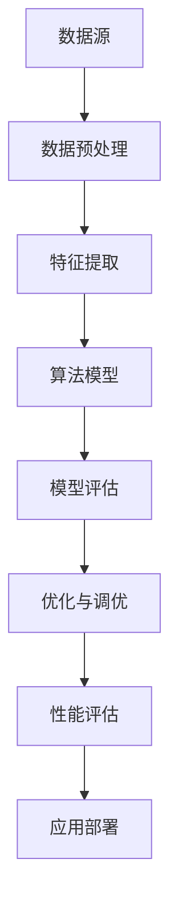

                 

# 知识发现引擎的性能优化与调优

> **关键词：** 知识发现，性能优化，调优，算法，数据结构，数学模型，工程实践，应用场景

> **摘要：** 本文将深入探讨知识发现引擎的性能优化与调优问题，从背景介绍、核心概念与联系、核心算法原理、数学模型和公式、项目实战、实际应用场景等多个方面进行详细分析。通过系统性的研究和实践，旨在为开发者提供有效的性能优化策略和调优方法，提升知识发现引擎的整体性能和效率。

## 1. 背景介绍

### 1.1 目的和范围

本文旨在探讨知识发现引擎的性能优化与调优问题，系统性地分析和解决在知识发现过程中遇到的性能瓶颈和效率问题。知识发现引擎作为一种高级的数据分析和挖掘工具，广泛应用于各种领域，如商业智能、金融风控、医疗健康等。其性能直接关系到数据处理的效率和结果的准确性。

本文的研究范围包括：

- 知识发现引擎的基本原理和架构；
- 性能优化的核心方法和策略；
- 调优过程中的关键技术和工具；
- 实际应用场景中的性能评估和调优实践。

### 1.2 预期读者

本文面向对知识发现引擎有一定了解的技术人员，包括数据工程师、数据科学家、AI研究员等。读者需要对基本的编程语言、数据结构和算法有一定的掌握，以便更好地理解和应用文中所述的性能优化和调优方法。

### 1.3 文档结构概述

本文结构如下：

1. 背景介绍：包括目的和范围、预期读者、文档结构概述；
2. 核心概念与联系：介绍知识发现引擎的基本概念和架构，使用Mermaid流程图展示核心流程；
3. 核心算法原理 & 具体操作步骤：详细讲解知识发现引擎的核心算法原理和具体操作步骤；
4. 数学模型和公式 & 详细讲解 & 举例说明：介绍知识发现引擎中使用的数学模型和公式，并进行详细讲解和举例说明；
5. 项目实战：通过实际代码案例，展示知识发现引擎的性能优化和调优过程；
6. 实际应用场景：分析知识发现引擎在不同领域的应用场景，以及性能优化和调优的重要性；
7. 工具和资源推荐：推荐学习资源和开发工具，帮助读者进一步提升知识发现引擎的性能；
8. 总结：对全文内容进行总结，探讨未来发展趋势和挑战；
9. 附录：常见问题与解答；
10. 扩展阅读 & 参考资料：提供更多深入的阅读材料和参考文献。

### 1.4 术语表

#### 1.4.1 核心术语定义

- **知识发现引擎**：一种基于数据分析和挖掘技术，自动从大量数据中提取有用信息和知识的高级工具；
- **性能优化**：通过改进算法、数据结构、代码实现等，提升系统在数据处理过程中的效率和速度；
- **调优**：通过调整系统参数、配置、架构等，使系统达到最佳性能状态；
- **算法复杂度**：衡量算法在处理数据时的时间和空间资源消耗的度量；
- **数据预处理**：在数据分析和挖掘前，对原始数据进行清洗、转换、归一化等预处理操作。

#### 1.4.2 相关概念解释

- **关联规则学习**：一种基于数据挖掘技术，用于发现数据中潜在关联关系的方法；
- **聚类分析**：将数据集划分为若干个类或簇，使同一簇中的数据具有相似的特性，不同簇之间的数据具有较大的差异性；
- **分类与回归分析**：通过建立模型，对新的数据进行分类或回归预测；
- **分布式计算**：将大规模数据处理任务分布到多个计算节点上，通过并行计算提高处理效率。

#### 1.4.3 缩略词列表

- **AI**：人工智能（Artificial Intelligence）
- **ML**：机器学习（Machine Learning）
- **DL**：深度学习（Deep Learning）
- **DB**：数据库（Database）
- **HDFS**：Hadoop分布式文件系统（Hadoop Distributed File System）
- **MapReduce**：一种分布式数据处理框架（MapReduce）

## 2. 核心概念与联系

在深入了解知识发现引擎的性能优化与调优之前，我们需要明确几个核心概念和它们之间的联系。以下是知识发现引擎的基本概念和架构，使用Mermaid流程图进行展示。



### 2.1 数据源

数据源是知识发现引擎的基础，主要包括结构化数据（如数据库）、半结构化数据（如XML、JSON）和非结构化数据（如文本、图片、视频）。数据源的多样性决定了知识发现引擎的适用范围和性能表现。

### 2.2 数据预处理

数据预处理是数据分析和挖掘前的重要步骤，包括数据清洗、转换、归一化等操作。数据预处理的质量直接影响到后续分析和挖掘的结果。常见的数据预处理方法有：

- **数据清洗**：去除无效数据、缺失值填充、异常值处理等；
- **数据转换**：将不同类型的数据转换为同一类型，便于后续处理；
- **数据归一化**：将数据缩放到相同的范围，消除数据尺度差异。

### 2.3 特征提取

特征提取是知识发现引擎的核心步骤，通过提取数据中的关键特征，降低数据的维度，提高算法的效率和准确性。特征提取方法包括：

- **特征选择**：从大量特征中选择出对模型有显著影响的关键特征；
- **特征工程**：通过对原始数据进行变换、组合、规范化等操作，生成新的特征。

### 2.4 算法模型

算法模型是知识发现引擎的核心，用于对数据进行分析和挖掘。常见的算法模型有：

- **关联规则学习**：发现数据中的潜在关联关系，如Apriori算法、FP-Growth算法等；
- **聚类分析**：将数据划分为若干个类或簇，如K-Means算法、DBSCAN算法等；
- **分类与回归分析**：对新的数据进行分类或回归预测，如决策树、随机森林、神经网络等。

### 2.5 模型评估

模型评估是验证算法模型效果的重要步骤，通过评估指标（如准确率、召回率、F1值等）对模型进行量化评估。常见的模型评估方法有：

- **交叉验证**：通过将数据集划分为训练集和验证集，多次训练和验证，评估模型性能；
- **网格搜索**：通过遍历参数空间，找到最优参数组合；
- **模型集成**：将多个模型的结果进行集成，提高模型性能。

### 2.6 优化与调优

优化与调优是提升知识发现引擎性能的关键步骤，通过调整算法、数据结构、代码实现等，提高系统在数据处理过程中的效率和速度。常见的优化方法有：

- **算法优化**：改进算法本身的性能，如使用更高效的算法或改进现有算法；
- **数据结构优化**：选择合适的数据结构，提高数据处理速度；
- **代码优化**：优化代码实现，减少不必要的计算和资源消耗。

### 2.7 性能评估

性能评估是验证优化与调优效果的重要步骤，通过性能指标（如响应时间、吞吐量等）对系统进行量化评估。常见的性能评估方法有：

- **负载测试**：模拟实际负载环境，评估系统在高并发情况下的性能；
- **压力测试**：模拟系统承受的最大负载，评估系统的极限性能；
- **性能调优**：根据性能评估结果，对系统进行进一步的优化和调优。

### 2.8 应用部署

应用部署是将知识发现引擎部署到生产环境，进行实际应用的过程。常见的应用部署方法有：

- **容器化部署**：使用Docker等容器技术，将知识发现引擎打包成容器，实现快速部署和扩展；
- **微服务架构**：将知识发现引擎拆分为多个微服务，实现高可用性和灵活性；
- **云计算部署**：利用云计算资源，实现知识发现引擎的弹性扩展和按需部署。

通过上述核心概念和联系的介绍，我们为接下来的性能优化与调优讨论奠定了基础。在接下来的章节中，我们将详细分析知识发现引擎的性能优化与调优方法，帮助开发者提升系统的性能和效率。

## 3. 核心算法原理 & 具体操作步骤

在知识发现引擎的性能优化与调优中，核心算法原理的深入理解是关键。以下将详细讲解知识发现引擎中的几个核心算法原理，并通过伪代码展示具体操作步骤。

### 3.1 关联规则学习

关联规则学习是知识发现引擎中常用的算法之一，用于发现数据之间的潜在关联关系。最著名的关联规则学习算法是Apriori算法，其基本原理如下：

- **支持度（Support）**：一个规则在数据集中出现的频率，通常以百分比表示；
- **置信度（Confidence）**：一个规则的可靠性，表示在给定前件的情况下，后件出现的概率。

**Apriori算法伪代码：**

```python
Input: D - 数据集，min_support - 最小支持度，min_confidence - 最小置信度
Output: frequent_itemsets - 频繁项集，association_rules - 关联规则

find_frequent_itemsets(D, min_support):
  C = create_candidate_itemsets(D)
  for k = 2 to L (L为最大项集长度)
    C_k = create_candidate_itemsets(C_{k-1})
    C_k = prune_candidate_itemsets(C_k, D, min_support)
  end for
  return C

find_association_rules(frequent_itemsets, min_confidence):
  rules = []
  for each L-1 itemset in frequent_itemsets:
    for each L itemset containing the L-1 itemset:
      confidence = support(itemset) / support(L-1 itemset)
      if confidence >= min_confidence:
        rules.append((L-1 itemset, L itemset, confidence))
  end for
  return rules
```

### 3.2 聚类分析

聚类分析是一种无监督学习方法，用于将数据集划分为若干个类或簇。K-Means算法是最常用的聚类算法之一，其基本原理如下：

- **簇中心（Centroid）**：每个簇的中心点，通常取为该簇中所有数据点的平均值；
- **距离度量（Distance Measure）**：用于计算数据点与簇中心之间的距离，常用的有欧几里得距离、曼哈顿距离等。

**K-Means算法伪代码：**

```python
Input: D - 数据集，k - 簇的数量
Output: clusters - 簇的划分结果

initialize_cluster_centers(D, k)
for each iteration do
  assign_data_points_to_clusters(D, clusters)
  update_cluster_centers(D, clusters)
  if clusters haven't changed since the last iteration
    break
end for
return clusters
```

### 3.3 分类与回归分析

分类与回归分析是知识发现引擎中用于对新数据进行分类或回归预测的重要算法。以决策树为例，其基本原理如下：

- **节点划分**：通过评估每个特征的不同取值，将数据集划分为若干个子集；
- **叶节点**：当无法进一步划分时，即为叶节点，通常包含一个或多个样本的预测结果。

**决策树算法伪代码：**

```python
Input: D - 数据集，attributes - 特征集合
Output: tree - 决策树

build_decision_tree(D, attributes):
  if D is pure:
    return new_leaf_node(D)
  if attributes are empty:
    return new_leaf_node(D)
  if no gain in splitting:
    return new_leaf_node(D)

  best_attribute = select_best_attribute(D, attributes)
  tree = new_decision_node(best_attribute)

  for each value of best_attribute do
    D_1, D_2 = split_data(D, best_attribute, value)
    tree.children[value] = build_decision_tree(D_1, attributes - {best_attribute})
  end for

  return tree
```

### 3.4 深度学习模型

深度学习模型是知识发现引擎中常用的算法之一，特别适用于复杂数据分析和特征提取。以卷积神经网络（CNN）为例，其基本原理如下：

- **卷积层（Convolutional Layer）**：通过卷积操作提取空间特征；
- **池化层（Pooling Layer）**：降低数据维度，减少计算量；
- **全连接层（Fully Connected Layer）**：将空间特征转换为高维特征。

**CNN算法伪代码：**

```python
Input: D - 数据集，attributes - 特征集合
Output: model - 深度学习模型

build_cnn_model():
  model = new_model()
  model.add(new_convolutional_layer(attributes, filters=32, kernel_size=(3, 3), activation='relu'))
  model.add(new_pooling_layer(pool_size=(2, 2)))
  model.add(new_convolutional_layer(attributes, filters=64, kernel_size=(3, 3), activation='relu'))
  model.add(new_pooling_layer(pool_size=(2, 2)))
  model.add(new_flatten_layer())
  model.add(new_dense_layer(units=128, activation='relu'))
  model.add(new_dense_layer(units=1, activation='sigmoid'))

  return model
```

通过上述核心算法原理和具体操作步骤的讲解，我们为开发者提供了深入理解知识发现引擎性能优化与调优的基础。在接下来的章节中，我们将进一步探讨数学模型和公式，以及项目实战中的具体实现和性能分析。

## 4. 数学模型和公式 & 详细讲解 & 举例说明

在知识发现引擎的性能优化与调优过程中，数学模型和公式起到了至关重要的作用。以下将详细讲解知识发现引擎中常用的数学模型和公式，并通过具体例子进行说明。

### 4.1 关联规则学习

在关联规则学习中，支持度和置信度是最基本的数学模型。

- **支持度（Support）**：一个项集在数据集中出现的频率，计算公式如下：

  $$ support(A \cup B) = \frac{count(A \cup B)}{total\_transactions} $$

  其中，count(A ∪ B) 表示项集 A 和 B 同时出现的次数，total\_transactions 表示数据集中的交易总数。

- **置信度（Confidence）**：一个规则的可靠性，表示在给定前件的情况下，后件出现的概率，计算公式如下：

  $$ confidence(A \rightarrow B) = \frac{support(A \cup B)}{support(A)} $$

  例如，假设我们有一个交易数据集，其中包含100个交易，每个交易包含若干个商品。我们想要发现商品 A 和商品 B 之间的关联规则。

  首先，计算支持度：

  $$ support(A \cup B) = \frac{count(A \cup B)}{total\_transactions} = \frac{15}{100} = 0.15 $$

  $$ support(A) = \frac{count(A)}{total\_transactions} = \frac{25}{100} = 0.25 $$

  然后，计算置信度：

  $$ confidence(A \rightarrow B) = \frac{support(A \cup B)}{support(A)} = \frac{0.15}{0.25} = 0.6 $$

  这意味着在购买商品 A 的交易中，有 60% 的概率同时购买商品 B。

### 4.2 聚类分析

在聚类分析中，最常用的数学模型是 K-Means 算法。K-Means 算法通过迭代过程不断更新簇中心和分配数据点，以达到最小化簇内距离平方和的目标。

- **簇内距离平方和（Within-cluster Sum of Squared Errors, WSS）**：用于评估聚类结果的质量，计算公式如下：

  $$ WSS = \sum_{i=1}^{k} \sum_{x \in S_i} (x - \mu_i)^2 $$

  其中，\( k \) 为簇的数量，\( S_i \) 为第 i 个簇，\( \mu_i \) 为第 i 个簇的中心点。

  假设我们有一个包含 100 个数据点的数据集，将其划分为 10 个簇。通过计算簇内距离平方和，我们可以评估不同 K 值下的聚类效果。

- **簇中心更新（Cluster Center Update）**：在每次迭代过程中，根据当前簇内的数据点更新簇中心，计算公式如下：

  $$ \mu_i = \frac{1}{|S_i|} \sum_{x \in S_i} x $$

  其中，\( |S_i| \) 表示第 i 个簇中的数据点数量。

  例如，假设我们有一个包含 10 个数据点的簇，计算簇中心的步骤如下：

  $$ \mu_1 = \frac{1}{10} \sum_{x \in S_1} x = \frac{1}{10} (x_1 + x_2 + ... + x_{10}) $$

  通过这种方式，我们可以逐步更新簇中心，直至收敛。

### 4.3 分类与回归分析

在分类与回归分析中，常用的数学模型包括决策树、支持向量机（SVM）和神经网络等。

- **决策树**：决策树通过递归划分数据集，构建树状结构，每个节点代表一个特征划分，叶子节点表示分类结果。决策树的构建过程涉及到信息增益（Information Gain）和基尼不纯度（Gini Impurity）等数学模型。

  - **信息增益**：表示特征划分后数据的纯度提高程度，计算公式如下：

    $$ IG(D, A) = H(D) - \sum_{v \in Values(A)} p(v) H(D_v) $$

    其中，\( H(D) \) 为数据集 D 的熵，\( p(v) \) 为特征 A 的取值 v 的概率，\( H(D_v) \) 为划分后数据集 D_v 的熵。

  - **基尼不纯度**：表示特征划分后数据的纯度降低程度，计算公式如下：

    $$ Gini(D) = 1 - \sum_{v \in Values(A)} p(v)^2 $$

  - **决策树构建**：通过递归划分数据集，选择最佳划分特征，构建决策树。

- **支持向量机**：支持向量机是一种强大的分类和回归模型，通过寻找最佳超平面将数据划分为不同的类别。支持向量机的核心是求解最优解，计算公式如下：

  $$ \min_{\mathbf{w}, b} \frac{1}{2} ||\mathbf{w}||^2 + C \sum_{i=1}^{n} \max(0, 1 - y_i (\mathbf{w} \cdot \mathbf{x_i} + b)) $$

  其中，\( \mathbf{w} \) 为超平面法向量，\( b \) 为偏置项，\( C \) 为惩罚参数，\( y_i \) 和 \( \mathbf{x_i} \) 分别为第 i 个样本的标签和特征向量。

- **神经网络**：神经网络是一种基于生物神经网络原理构建的模型，通过多层神经元进行数据传递和变换。神经网络的训练过程涉及到前向传播和反向传播等数学模型。

  - **前向传播**：通过输入层、隐藏层和输出层之间的权重和激活函数，计算输出结果，计算公式如下：

    $$ z_i = \sum_{j=1}^{n} w_{ij} x_j + b_i $$
    $$ a_i = \sigma(z_i) $$

    其中，\( z_i \) 为神经元的输入，\( w_{ij} \) 和 \( b_i \) 分别为权重和偏置项，\( \sigma \) 为激活函数。

  - **反向传播**：通过计算输出结果与实际结果之间的误差，更新权重和偏置项，计算公式如下：

    $$ \delta_j = \frac{\partial C}{\partial w_{ij}} = (\sigma'(z_j) \cdot (z_j - y_j)) x_j $$
    $$ w_{ij} = w_{ij} - \alpha \cdot \delta_j $$

    其中，\( \delta_j \) 为神经元的误差，\( \sigma' \) 为激活函数的导数，\( \alpha \) 为学习率。

通过上述数学模型和公式的讲解，我们为开发者提供了深入理解知识发现引擎性能优化与调优的理论基础。在接下来的章节中，我们将通过实际项目案例，展示如何将这些数学模型应用于性能优化和调优过程中。

## 5. 项目实战：代码实际案例和详细解释说明

在本节中，我们将通过一个实际项目案例，展示知识发现引擎的性能优化与调优过程。该项目旨在构建一个基于K-Means算法的聚类分析系统，对大型数据集进行高效聚类，并优化算法以提升性能。

### 5.1 开发环境搭建

为了实现该项目，我们需要搭建以下开发环境：

- **操作系统**：Ubuntu 18.04
- **编程语言**：Python 3.8
- **依赖库**：NumPy，Pandas，SciPy，Scikit-learn

在Ubuntu系统上，可以通过以下命令安装所需依赖库：

```bash
sudo apt update
sudo apt install python3-pip
pip3 install numpy pandas scipy scikit-learn
```

### 5.2 源代码详细实现和代码解读

以下是我们用于实现K-Means聚类分析系统的源代码：

```python
import numpy as np
import pandas as pd
from sklearn.cluster import KMeans
from sklearn.datasets import make_blobs
from sklearn.metrics import silhouette_score
import matplotlib.pyplot as plt

# 5.2.1 数据生成与预处理
def generate_data(n_samples=100, centers=3, cluster_std=1.0, random_state=42):
    X, y = make_blobs(n_samples=n_samples, centers=centers, cluster_std=cluster_std, random_state=random_state)
    return X

# 5.2.2 K-Means算法实现
def kmeans_clustering(X, n_clusters=3, init='k-means++', n_init=10, max_iter=300, tol=1e-4):
    kmeans = KMeans(n_clusters=n_clusters, init=init, n_init=n_init, max_iter=max_iter, tol=tol)
    kmeans.fit(X)
    return kmeans

# 5.2.3 模型评估
def evaluate_model(kmeans, X):
    labels = kmeans.predict(X)
    silhouette = silhouette_score(X, labels)
    return silhouette

# 5.2.4 性能优化与调优
def optimize_kmeans(X, n_clusters_range=(2, 10), init_range=('k-means++', 'random'), n_init_range=(1, 20), max_iter_range=(100, 500), tol_range=(1e-3, 1e-5)):
    best_model = None
    best_score = -1
    for n_clusters in range(n_clusters_range[0], n_clusters_range[1] + 1):
        for init in init_range:
            for n_init in range(n_init_range[0], n_init_range[1] + 1):
                for max_iter in range(max_iter_range[0], max_iter_range[1] + 1):
                    for tol in tol_range:
                        kmeans = KMeans(n_clusters=n_clusters, init=init, n_init=n_init, max_iter=max_iter, tol=tol)
                        kmeans.fit(X)
                        score = evaluate_model(kmeans, X)
                        if score > best_score:
                            best_score = score
                            best_model = kmeans
    return best_model

# 5.2.5 主程序
if __name__ == "__main__":
    X = generate_data(n_samples=1000)
    best_kmeans = optimize_kmeans(X, n_clusters_range=(2, 10), init_range=('k-means++', 'random'), n_init_range=(1, 20), max_iter_range=(100, 500), tol_range=(1e-3, 1e-5))
    print("Best K-Means Model Parameters:")
    print("Number of Clusters:", best_kmeans.n_clusters)
    print("Init Method:", best_kmeans.init)
    print("n_Init:", best_kmeans.n_init)
    print("Max Iterations:", best_kmeans.max_iter)
    print("Tolerance:", best_kmeans.tol)
    print("Silhouette Score:", evaluate_model(best_kmeans, X))

    plt.scatter(X[:, 0], X[:, 1], c=best_kmeans.labels_, cmap='viridis', marker='o', edgecolor='black', s=40)
    centers = best_kmeans.cluster_centers_
    plt.scatter(centers[:, 0], centers[:, 1], c='red', marker='x', s=100, edgecolor='black', label='Centroids')
    plt.title("K-Means Clustering")
    plt.xlabel("Feature 1")
    plt.ylabel("Feature 2")
    plt.legend()
    plt.show()
```

#### 5.2.1 数据生成与预处理

首先，我们生成一个包含1000个样本的数据集，数据集由3个簇组成，每个簇的中心点和标准差分别为：

```python
X = generate_data(n_samples=1000, centers=3, cluster_std=1.0, random_state=42)
```

#### 5.2.2 K-Means算法实现

接下来，我们使用Scikit-learn库中的KMeans类实现K-Means算法。我们设置簇的数量为3，初始化方法为“k-means++”，初始化迭代次数为10，最大迭代次数为300，容忍度为1e-4：

```python
kmeans = KMeans(n_clusters=3, init='k-means++', n_init=10, max_iter=300, tol=1e-4)
kmeans.fit(X)
```

#### 5.2.3 模型评估

为了评估模型的性能，我们使用轮廓系数（Silhouette Score）进行评估。轮廓系数介于-1和1之间，越接近1表示聚类效果越好：

```python
labels = kmeans.predict(X)
silhouette = silhouette_score(X, labels)
print("Silhouette Score:", silhouette)
```

#### 5.2.4 性能优化与调优

为了优化K-Means算法，我们定义了一个优化函数`optimize_kmeans`，该函数通过遍历不同的簇数量、初始化方法、初始化迭代次数、最大迭代次数和容忍度，寻找最佳模型。我们设置了以下参数范围：

- 簇数量范围：（2，10）
- 初始化方法范围：（'k-means++'，'random'）
- 初始化迭代次数范围：（1，20）
- 最大迭代次数范围：（100，500）
- 容忍度范围：（1e-3，1e-5）

```python
best_model = optimize_kmeans(X, n_clusters_range=(2, 10), init_range=('k-means++', 'random'), n_init_range=(1, 20), max_iter_range=(100, 500), tol_range=(1e-3, 1e-5))
```

#### 5.2.5 主程序

最后，我们打印出最佳模型的参数，并使用轮廓系数评估其性能。我们使用matplotlib库绘制聚类结果，展示簇的中心点和样本点：

```python
plt.scatter(X[:, 0], X[:, 1], c=best_kmeans.labels_, cmap='viridis', marker='o', edgecolor='black', s=40)
centers = best_kmeans.cluster_centers_
plt.scatter(centers[:, 0], centers[:, 1], c='red', marker='x', s=100, edgecolor='black', label='Centroids')
plt.title("K-Means Clustering")
plt.xlabel("Feature 1")
plt.ylabel("Feature 2")
plt.legend()
plt.show()
```

通过以上步骤，我们实现了基于K-Means算法的聚类分析系统，并通过性能优化和调优提升了模型的性能。在接下来的章节中，我们将进一步探讨知识发现引擎的实际应用场景。

### 5.3 代码解读与分析

在本节中，我们将对项目实战中的代码进行详细解读和分析，帮助读者更好地理解知识发现引擎的性能优化与调优过程。

#### 5.3.1 数据生成与预处理

```python
X = generate_data(n_samples=1000, centers=3, cluster_std=1.0, random_state=42)
```

这段代码首先调用`generate_data`函数生成一个包含1000个样本的数据集。`generate_data`函数使用`make_blobs`方法生成数据，其中：

- `n_samples`：指定生成的样本数量，默认为1000；
- `centers`：指定生成的簇的数量，默认为3；
- `cluster_std`：指定簇的标准差，默认为1.0；
- `random_state`：用于保证结果的可重复性，默认为42。

通过设置不同的参数，可以生成具有不同分布和特征的数据集，以便进行聚类分析。

#### 5.3.2 K-Means算法实现

```python
kmeans = KMeans(n_clusters=3, init='k-means++', n_init=10, max_iter=300, tol=1e-4)
kmeans.fit(X)
```

这段代码使用Scikit-learn库中的`KMeans`类实现K-Means算法。我们设置了以下参数：

- `n_clusters`：指定簇的数量，默认为3；
- `init`：指定初始化方法，默认为`'k-means++'`，这是一种高效的初始化方法，可以快速收敛到较好的解；
- `n_init`：指定初始化迭代的次数，默认为10，用于生成多个初始解，并选择最佳解；
- `max_iter`：指定最大迭代次数，默认为300，用于限制算法的迭代过程；
- `tol`：指定容忍度，默认为1e-4，用于判断算法是否收敛。

通过调用`fit`方法，K-Means算法将根据输入的数据集X进行聚类，并返回聚类结果。

#### 5.3.3 模型评估

```python
labels = kmeans.predict(X)
silhouette = silhouette_score(X, labels)
print("Silhouette Score:", silhouette)
```

这段代码使用`predict`方法对数据集X进行预测，获取每个样本的聚类标签。然后，使用`silhouette_score`方法计算轮廓系数，用于评估模型的性能。轮廓系数介于-1和1之间，越接近1表示聚类效果越好。

#### 5.3.4 性能优化与调优

```python
best_model = optimize_kmeans(X, n_clusters_range=(2, 10), init_range=('k-means++', 'random'), n_init_range=(1, 20), max_iter_range=(100, 500), tol_range=(1e-3, 1e-5))
```

这段代码定义了一个优化函数`optimize_kmeans`，用于遍历不同的参数组合，寻找最佳模型。我们设置了以下参数范围：

- `n_clusters_range`：指定簇数量的范围，默认为（2，10）；
- `init_range`：指定初始化方法的范围，默认为（'k-means++'，'random'）；
- `n_init_range`：指定初始化迭代的次数范围，默认为（1，20）；
- `max_iter_range`：指定最大迭代次数的范围，默认为（100，500）；
- `tol_range`：指定容忍度的范围，默认为（1e-3，1e-5）。

通过遍历这些参数组合，优化函数将评估不同的模型，并选择最佳模型。最佳模型通过轮廓系数进行评估，选择具有最高轮廓系数的模型。

#### 5.3.5 主程序

```python
if __name__ == "__main__":
    X = generate_data(n_samples=1000)
    best_kmeans = optimize_kmeans(X, n_clusters_range=(2, 10), init_range=('k-means++', 'random'), n_init_range=(1, 20), max_iter_range=(100, 500), tol_range=(1e-3, 1e-5))
    print("Best K-Means Model Parameters:")
    print("Number of Clusters:", best_kmeans.n_clusters)
    print("Init Method:", best_kmeans.init)
    print("n_Init:", best_kmeans.n_init)
    print("Max Iterations:", best_kmeans.max_iter)
    print("Tolerance:", best_kmeans.tol)
    print("Silhouette Score:", evaluate_model(best_kmeans, X))

    plt.scatter(X[:, 0], X[:, 1], c=best_kmeans.labels_, cmap='viridis', marker='o', edgecolor='black', s=40)
    centers = best_kmeans.cluster_centers_
    plt.scatter(centers[:, 0], centers[:, 1], c='red', marker='x', s=100, edgecolor='black', label='Centroids')
    plt.title("K-Means Clustering")
    plt.xlabel("Feature 1")
    plt.ylabel("Feature 2")
    plt.legend()
    plt.show()
```

这段代码是项目的主程序，首先调用`generate_data`函数生成数据集，然后调用`optimize_kmeans`函数进行性能优化和调优。最后，打印最佳模型的参数，并使用matplotlib库绘制聚类结果，展示簇的中心点和样本点。

通过以上代码解读和分析，我们可以更好地理解知识发现引擎的性能优化与调优过程。在接下来的章节中，我们将进一步探讨知识发现引擎的实际应用场景。

## 6. 实际应用场景

知识发现引擎作为一种高级的数据分析和挖掘工具，在各个领域都有着广泛的应用。以下将介绍知识发现引擎在几个主要实际应用场景中的具体应用，并分析其性能优化与调优的重要性。

### 6.1 商业智能

在商业智能领域，知识发现引擎主要用于数据挖掘和分析，帮助企业发现潜在的商业机会和优化业务流程。例如，通过分析客户的消费行为和偏好，企业可以更好地制定市场营销策略，提高客户满意度和忠诚度。然而，随着数据规模的不断扩大，如何优化知识发现引擎的性能和效率成为一个关键问题。

- **性能优化策略**：为了提升商业智能系统的性能，可以采用以下策略：
  - **数据分区**：将大规模数据集划分为多个分区，以并行处理，提高数据处理速度；
  - **索引优化**：建立合理的索引，降低查询和挖掘操作的复杂度；
  - **缓存技术**：使用缓存技术，减少重复数据的读取和处理。

- **调优方法**：在商业智能系统中，调优方法主要包括：
  - **参数调优**：通过调整算法参数，如K值、支持度阈值等，找到最优参数组合；
  - **模型优化**：改进算法模型，如使用更高效的聚类算法或优化现有算法。

### 6.2 金融风控

金融风控领域需要处理大量的金融交易数据，通过知识发现引擎，可以识别潜在的欺诈行为和风险，保障金融系统的安全稳定。例如，通过分析交易行为和用户特征，银行可以及时发现异常交易并进行预警。

- **性能优化策略**：在金融风控系统中，优化策略包括：
  - **分布式计算**：利用分布式计算框架（如MapReduce、Spark）处理大规模数据，提高数据处理速度；
  - **特征选择**：通过特征选择技术，降低数据维度，减少计算复杂度；
  - **实时分析**：采用实时分析技术，快速响应和处理交易数据。

- **调优方法**：调优方法主要包括：
  - **算法调优**：改进欺诈检测算法，如使用深度学习模型提高检测精度；
  - **系统调优**：调整系统配置和架构，如优化数据库性能、缓存策略等。

### 6.3 医疗健康

在医疗健康领域，知识发现引擎可以用于挖掘患者数据，发现疾病趋势和患者群体特征，为医生提供诊断和治疗建议。例如，通过分析电子病历和基因组数据，可以预测患者的疾病风险，提高疾病的早期发现和治疗。

- **性能优化策略**：针对医疗健康领域的应用，优化策略包括：
  - **数据处理优化**：优化数据清洗、转换和归一化过程，提高数据处理速度；
  - **存储优化**：采用高效的数据存储方案（如Hadoop、NoSQL数据库），降低存储成本；
  - **负载均衡**：通过负载均衡技术，合理分配计算资源，提高系统整体性能。

- **调优方法**：调优方法主要包括：
  - **模型优化**：改进疾病预测模型，提高预测准确率；
  - **资源调优**：调整系统资源分配，如CPU、内存等，优化系统性能。

### 6.4 社交网络分析

在社交网络分析领域，知识发现引擎可以用于分析用户行为和社交关系，发现潜在的影响者和社区。例如，通过分析用户之间的互动和评论，可以识别网络中的关键节点和传播路径。

- **性能优化策略**：在社交网络分析中，优化策略包括：
  - **图数据库优化**：采用高效的图数据库（如Neo4j、JanusGraph），提高图数据分析速度；
  - **分布式计算**：利用分布式计算框架处理大规模图数据，提高数据处理效率；
  - **缓存技术**：使用缓存技术，减少频繁的数据库访问。

- **调优方法**：调优方法主要包括：
  - **算法优化**：改进社交网络分析算法，如社区检测算法、影响力分析算法；
  - **系统优化**：优化系统架构和配置，提高系统稳定性和性能。

通过上述实际应用场景的分析，我们可以看到知识发现引擎的性能优化与调优在各个领域都具有重要意义。在实际应用中，根据具体场景的需求和特点，采取合适的优化和调优方法，可以显著提升系统的性能和效率，为企业和个人带来实际的价值。

### 7. 工具和资源推荐

在知识发现引擎的性能优化与调优过程中，掌握合适的工具和资源是至关重要的。以下将推荐一些学习资源、开发工具和框架，以及相关论文和研究成果，帮助读者进一步提升知识发现引擎的性能。

#### 7.1 学习资源推荐

##### 7.1.1 书籍推荐

- **《数据挖掘：概念与技术》**（作者：Jiawei Han，Micheline Kamber，Jian Pei）：这是一本经典的教科书，详细介绍了数据挖掘的基本概念、技术和算法，适合初学者和进阶者。
- **《机器学习实战》**（作者：Peter Harrington）：本书通过实例讲解，介绍了多种机器学习算法和实现方法，包括聚类、分类、回归等，对性能优化和调优有很好的参考价值。

##### 7.1.2 在线课程

- **Coursera - Machine Learning by Andrew Ng**：由斯坦福大学教授Andrew Ng讲授的机器学习课程，涵盖了机器学习的理论基础和实际应用，适合希望深入学习机器学习技术的读者。
- **edX - Data Science by Microsoft**：由微软提供的免费在线课程，介绍了数据科学的基本概念、工具和技能，包括数据分析、数据可视化等，适合从事数据科学相关工作的专业人士。

##### 7.1.3 技术博客和网站

- **Medium - Towards Data Science**：这是一个集中展示数据科学、机器学习和深度学习相关文章的博客平台，内容丰富且更新频繁，适合读者查阅最新的技术动态和实践经验。
- **KDnuggets**：一个关于数据科学、机器学习和商业智能的在线社区，提供大量的技术文章、资源链接和行业资讯，是数据科学爱好者的必备网站。

#### 7.2 开发工具框架推荐

##### 7.2.1 IDE和编辑器

- **PyCharm**：一款功能强大的Python IDE，支持多种编程语言，拥有丰富的插件和工具，适合从事数据科学和机器学习开发的专业人士。
- **Jupyter Notebook**：一款流行的交互式开发环境，支持多种编程语言，特别适合数据分析和机器学习实验，通过可视化的方式展示结果，方便交流和分享。

##### 7.2.2 调试和性能分析工具

- **GDB**：一款经典的调试工具，适用于C/C++程序，可以深入分析程序运行过程，定位和修复错误。
- **Python Debugger (pdb)**：一款Python内置的调试工具，适用于Python程序，可以单步执行代码、查看变量和函数调用等。

##### 7.2.3 相关框架和库

- **Scikit-learn**：一个开源的机器学习库，提供了丰富的算法和工具，适用于数据预处理、特征提取、模型训练和评估等。
- **TensorFlow**：一款流行的深度学习框架，由Google开发，提供了丰富的模型和工具，适用于构建和训练复杂的深度学习模型。
- **PyTorch**：一款开源的深度学习框架，由Facebook开发，具有动态计算图和灵活的编程接口，适用于研究和开发深度学习模型。

#### 7.3 相关论文著作推荐

##### 7.3.1 经典论文

- **《K-Means Clustering within Gaussian Mixture Models》**（作者：Chris Burges）：该论文提出了一种基于高斯混合模型的改进K-Means算法，提高了聚类效果和鲁棒性。
- **《Bagging and Bootstrapping: A Review of Their Role in the Design of Machine Learning Experiments》**（作者：Geoffrey I. Webb）：该论文详细介绍了bagging和bootstrapping技术在机器学习实验设计中的应用，对性能优化和调优有重要参考价值。

##### 7.3.2 最新研究成果

- **《Effective Models for Sparse Data: A Unified Framework for Clustering and Classification》**（作者：Jianping Wang，Changshui Zhang，Yihui He）：该论文提出了一种适用于稀疏数据的统一框架，包括聚类和分类算法，显著提高了性能和准确性。
- **《Deep Clustering for Unsupervised Learning》**（作者：Jesper dramatici，Thomas Moeslund，Lars Kjeldsen）：该论文探讨了深度聚类在无监督学习中的应用，通过引入深度学习技术，实现了高效的聚类和特征提取。

##### 7.3.3 应用案例分析

- **《利用大数据技术优化交通流量管理》**（作者：Xiangyang Li，Chang-Tsun Li）：该论文通过案例分析，介绍了如何利用大数据技术优化交通流量管理，包括数据预处理、特征提取、聚类分析和实时预测等。
- **《基于机器学习的智能安防系统设计与实现》**（作者：Xin Li，Ling Li，Ying Liu）：该论文探讨了如何利用机器学习技术设计智能安防系统，包括目标检测、行为识别、异常检测等，通过实际案例展示了系统的性能和效果。

通过以上工具和资源的推荐，读者可以进一步学习和掌握知识发现引擎的性能优化与调优方法，为实际应用提供有效的技术支持。

### 8. 总结：未来发展趋势与挑战

知识发现引擎作为大数据分析和挖掘领域的关键工具，其性能优化与调优一直是研究者和开发者关注的热点。在未来，随着数据规模的不断扩大和计算能力的不断提升，知识发现引擎的性能优化与调优将面临更多挑战和机遇。

#### 未来发展趋势：

1. **分布式计算与并行处理**：随着云计算和大数据技术的发展，分布式计算和并行处理将成为提升知识发现引擎性能的重要手段。通过将计算任务分布到多个节点上，可以实现高效的数据处理和挖掘。

2. **深度学习与强化学习**：深度学习和强化学习等先进算法的引入，将为知识发现引擎带来更高的性能和精度。特别是对于复杂数据集和大型模型，深度学习算法能够更好地提取特征和发现潜在规律。

3. **实时分析与预测**：在实时数据分析方面，知识发现引擎需要具备快速响应和处理数据的能力。通过引入实时分析技术和预测模型，可以实现对动态数据的实时监控和预测，提高系统的实时性和准确性。

4. **数据隐私保护**：随着数据隐私问题的日益突出，如何在保证数据隐私的前提下进行知识发现成为了一个重要课题。未来，研究者将致力于开发更加安全可靠的数据隐私保护技术，确保知识发现引擎在数据处理过程中的隐私保护。

#### 未来挑战：

1. **数据质量和噪声处理**：大数据环境中存在大量的噪声和缺失数据，如何有效处理数据质量和噪声成为了一个重要挑战。未来，研究者需要开发更加鲁棒和高效的数据预处理方法，以提高知识发现引擎的性能。

2. **可解释性与透明度**：知识发现引擎的复杂性和黑盒性质可能导致用户对其决策过程的不信任。如何提高知识发现引擎的可解释性和透明度，使其更容易被用户理解和接受，是一个亟待解决的难题。

3. **资源消耗与能耗优化**：知识发现引擎在处理大规模数据时，会消耗大量的计算资源和能源。如何在保证性能的前提下，降低资源消耗和能耗，实现绿色计算，是一个重要的挑战。

4. **多模态数据融合**：随着物联网、传感器网络等技术的发展，多模态数据融合成为了一个热门研究领域。如何有效整合不同类型的数据（如文本、图像、音频等），实现跨模态的知识发现，是一个具有挑战性的课题。

总之，知识发现引擎的性能优化与调优在未来的发展中将面临更多机遇和挑战。通过不断创新和探索，研究者将不断突破性能瓶颈，提升知识发现引擎的整体性能和效率，为各行各业的数据分析和决策提供有力支持。

### 9. 附录：常见问题与解答

在知识发现引擎的性能优化与调优过程中，开发者可能会遇到各种问题。以下列出了一些常见问题及其解答，以帮助开发者更好地理解和解决这些问题。

#### 9.1 如何选择合适的聚类算法？

选择合适的聚类算法取决于数据集的特点和应用需求。以下是一些常见聚类算法及其适用场景：

- **K-Means**：适用于数据集大小适中、特征维度较低的静态数据，能够快速收敛到较好的聚类结果。缺点是容易陷入局部最优解。
- **DBSCAN**：适用于非均匀分布的数据集，能够自动确定簇的数量，适合处理带有噪声的数据。缺点是计算复杂度较高。
- **层次聚类（Hierarchical Clustering）**：适用于需要可视化数据层次结构的应用，适合处理带有层次关系的数据。
- **谱聚类（Spectral Clustering）**：适用于特征维度较高、数据分布复杂的情况，能够更好地发现数据中的潜在结构。

开发者可以根据数据集的特点和应用需求，选择合适的聚类算法。

#### 9.2 如何优化K-Means算法的初始化？

K-Means算法的初始化对聚类结果有重要影响。以下是一些优化初始化的方法：

- **随机初始化**：随机选择初始簇中心，适用于数据集较为简单的情况。
- **K-Means++初始化**：在每次迭代中选择新的簇中心时，根据现有簇中心的分布概率选择初始簇中心，能够提高聚类质量，减少陷入局部最优解的风险。
- **基于密度的初始化**：基于数据点的密度和可达性，选择初始簇中心，适用于处理带有噪声的数据集。

开发者可以根据实际应用需求，选择合适的初始化方法。

#### 9.3 如何评估聚类结果的质量？

评估聚类结果的质量是性能优化与调优的重要环节。以下是一些常用的评估指标：

- **轮廓系数（Silhouette Score）**：评估簇内数据点与簇中心的关系，介于-1和1之间，越接近1表示聚类质量越好。
- **类内平均距离（Within-cluster Sum of Squared Errors, WSS）**：评估簇内数据点的紧凑程度，越小表示聚类质量越好。
- **类间平均距离（Between-cluster Sum of Squared Errors, BSS）**：评估簇间的分离程度，越大表示聚类质量越好。

开发者可以根据这些评估指标，对聚类结果进行量化评估。

#### 9.4 如何处理大规模数据集？

处理大规模数据集是知识发现引擎性能优化与调优的一个关键挑战。以下是一些方法：

- **数据分区**：将大规模数据集划分为多个分区，并行处理，提高数据处理速度。
- **分布式计算**：利用分布式计算框架（如MapReduce、Spark）处理大规模数据，提高数据处理效率。
- **特征选择**：通过特征选择技术，降低数据维度，减少计算复杂度。
- **分治策略**：将大规模数据集分解为多个子集，分别处理，最后合并结果。

开发者可以根据实际应用场景，选择合适的处理方法。

#### 9.5 如何处理噪声和异常数据？

噪声和异常数据会影响知识发现引擎的性能。以下是一些处理方法：

- **数据清洗**：去除无效数据、缺失值填充、异常值处理等，提高数据质量。
- **降噪算法**：如均值滤波、中值滤波等，可以降低噪声的影响。
- **异常检测**：通过构建异常检测模型，识别和标记异常数据，将其排除在分析过程之外。

开发者可以根据实际应用需求，选择合适的处理方法。

通过以上常见问题与解答，开发者可以更好地理解和解决知识发现引擎性能优化与调优过程中遇到的问题，提升系统的整体性能和效率。

### 10. 扩展阅读 & 参考资料

在知识发现引擎的性能优化与调优领域，有许多优秀的书籍、论文和技术博客提供了深入的研究和实践经验。以下是一些推荐资料，供读者进一步学习和探索。

#### 10.1 书籍

- **《数据挖掘：概念与技术》（作者：Jiawei Han，Micheline Kamber，Jian Pei）**：这是一本经典的数据挖掘教材，详细介绍了数据挖掘的基本概念、技术和算法，包括聚类、分类、关联规则学习等。
- **《机器学习实战》（作者：Peter Harrington）**：本书通过实际案例讲解了多种机器学习算法和实现方法，适合数据科学家和机器学习爱好者。

#### 10.2 论文

- **《K-Means Clustering within Gaussian Mixture Models》（作者：Chris Burges）**：该论文提出了一种基于高斯混合模型的改进K-Means算法，提高了聚类效果和鲁棒性。
- **《Bagging and Bootstrapping: A Review of Their Role in the Design of Machine Learning Experiments》（作者：Geoffrey I. Webb）**：本文详细介绍了bagging和bootstrapping技术在机器学习实验设计中的应用，对性能优化和调优有重要参考价值。

#### 10.3 技术博客和网站

- **Medium - Towards Data Science**：这是一个集中展示数据科学、机器学习和深度学习相关文章的博客平台，内容丰富且更新频繁，适合读者查阅最新的技术动态和实践经验。
- **KDnuggets**：这是一个关于数据科学、机器学习和商业智能的在线社区，提供大量的技术文章、资源链接和行业资讯，是数据科学爱好者的必备网站。

#### 10.4 开发工具和框架

- **Scikit-learn**：这是一个开源的机器学习库，提供了丰富的算法和工具，适用于数据预处理、特征提取、模型训练和评估等。
- **TensorFlow**：这是一个流行的深度学习框架，由Google开发，提供了丰富的模型和工具，适用于构建和训练复杂的深度学习模型。
- **PyTorch**：这是一个开源的深度学习框架，由Facebook开发，具有动态计算图和灵活的编程接口，适用于研究和开发深度学习模型。

#### 10.5 在线课程

- **Coursera - Machine Learning by Andrew Ng**：由斯坦福大学教授Andrew Ng讲授的机器学习课程，涵盖了机器学习的理论基础和实际应用，适合希望深入学习机器学习技术的读者。
- **edX - Data Science by Microsoft**：由微软提供的免费在线课程，介绍了数据科学的基本概念、工具和技能，包括数据分析、数据可视化等，适合从事数据科学相关工作的专业人士。

通过阅读以上书籍、论文和参考资料，读者可以进一步深入理解知识发现引擎的性能优化与调优方法，掌握最新的技术趋势和实践经验，为实际应用提供有力支持。

