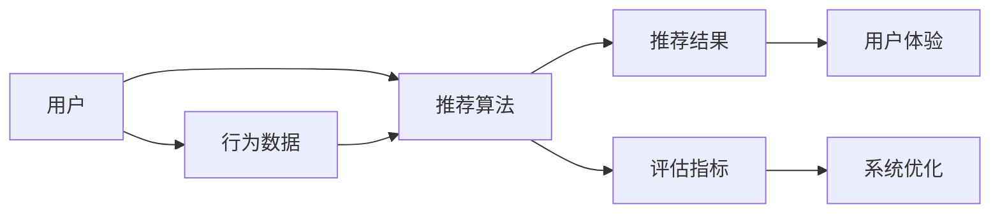
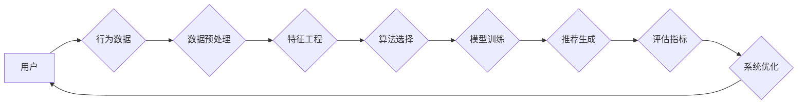

                 

# 知识发现引擎的推荐系统设计与实现

> **关键词：** 知识发现引擎，推荐系统，数据挖掘，机器学习，信息检索。

> **摘要：** 本文深入探讨了知识发现引擎的推荐系统设计与实现，从核心概念、算法原理、数学模型到实际应用，全面解析了构建高效、智能的推荐系统的关键技术。文章旨在为读者提供系统、全面的技术指导，助力理解并掌握推荐系统的设计与实现方法。

## 1. 背景介绍

### 1.1 目的和范围

本文旨在探讨知识发现引擎中的推荐系统设计与实现。随着互联网的飞速发展，数据量呈爆炸式增长，如何从海量数据中提取有价值的信息成为了关键问题。推荐系统作为知识发现引擎的核心组件，通过对用户行为数据的挖掘和分析，为用户提供个性化推荐，极大地提升了用户体验。

本文将重点讨论以下内容：
- 推荐系统的基本概念和架构。
- 核心算法原理和具体实现步骤。
- 数学模型和公式的详细讲解。
- 实际应用场景分析。
- 开发工具和资源的推荐。

### 1.2 预期读者

本文适合以下读者群体：
- 对推荐系统有一定了解的技术人员。
- 想深入了解推荐系统设计与实现的工程师。
- 从事数据挖掘和机器学习研究的学者。

### 1.3 文档结构概述

本文分为十个部分，结构如下：
1. **背景介绍**：介绍本文的目的、范围、预期读者和文档结构。
2. **核心概念与联系**：阐述推荐系统的核心概念，并给出Mermaid流程图。
3. **核心算法原理 & 具体操作步骤**：详细讲解推荐系统的算法原理和具体实现步骤。
4. **数学模型和公式 & 详细讲解 & 举例说明**：介绍推荐系统的数学模型，并用示例说明。
5. **项目实战：代码实际案例和详细解释说明**：提供实际代码案例并进行详细解读。
6. **实际应用场景**：分析推荐系统的实际应用场景。
7. **工具和资源推荐**：推荐学习资源、开发工具和框架。
8. **总结：未来发展趋势与挑战**：总结本文内容和未来发展趋势。
9. **附录：常见问题与解答**：解答读者可能遇到的问题。
10. **扩展阅读 & 参考资料**：提供进一步的阅读资料。

### 1.4 术语表

#### 1.4.1 核心术语定义

- **知识发现引擎**：一种能够自动从大量数据中提取有用信息的系统。
- **推荐系统**：一种基于用户历史行为和偏好，为用户推荐感兴趣的内容或商品的系统。
- **数据挖掘**：从大量数据中发现有价值信息的过程。
- **机器学习**：一种通过训练模型来从数据中学习规律和模式的方法。

#### 1.4.2 相关概念解释

- **协同过滤**：一种基于用户行为和偏好的推荐方法。
- **内容推荐**：基于内容特征进行推荐的策略。
- **用户画像**：描述用户属性和兴趣的模型。

#### 1.4.3 缩略词列表

- **ML**：机器学习（Machine Learning）
- **DF**：数据挖掘（Data Mining）
- **UCF**：用户画像（User Classification and Feature Engineering）
- **CF**：协同过滤（Collaborative Filtering）

## 2. 核心概念与联系

在构建推荐系统时，理解其核心概念和各部分之间的关系至关重要。以下是推荐系统的基本架构和核心概念：

### 推荐系统基本架构



#### 核心概念

1. **用户**：推荐系统的核心，用户的行为数据是推荐的基础。
2. **行为数据**：用户在系统中的各种操作，如浏览、购买、评论等。
3. **推荐算法**：根据用户行为数据生成推荐结果的核心组件。
4. **推荐结果**：推荐系统为用户生成的个性化推荐内容。
5. **评估指标**：评估推荐系统性能的重要工具，如准确率、召回率等。
6. **用户体验**：推荐系统直接影响的用户感受。
7. **系统优化**：根据评估结果不断优化推荐算法，提升系统性能。

### Mermaid流程图

以下是推荐系统的Mermaid流程图，展示了各组件之间的联系：



## 3. 核心算法原理 & 具体操作步骤

推荐系统的核心在于算法的选择和实现。本文将介绍几种常用的推荐算法，包括基于内容的推荐和基于协同过滤的推荐，并详细讲解其原理和操作步骤。

### 3.1 基于内容的推荐算法

**原理**：基于内容的推荐算法（Content-based Recommendation）通过分析物品的内容特征和用户的偏好特征，为用户推荐与其兴趣相符的物品。

**具体操作步骤**：

1. **特征提取**：从物品和用户的历史行为中提取特征，如物品的文本描述、标签、分类等。
2. **相似度计算**：计算物品和用户之间的相似度，常用的相似度计算方法包括余弦相似度和皮尔逊相关系数。
3. **推荐生成**：根据相似度计算结果，为用户推荐相似度较高的物品。

**伪代码**：

```python
def content_based_recommendation(user_profile, items, similarity_metric):
    recommendations = []
    for item in items:
        similarity = similarity_metric(user_profile, item)
        recommendations.append((item, similarity))
    recommendations.sort(key=lambda x: x[1], reverse=True)
    return recommendations[:N]
```

### 3.2 基于协同过滤的推荐算法

**原理**：基于协同过滤的推荐算法（Collaborative Filtering）通过分析用户之间的行为相似性，为用户推荐其他相似用户喜欢的物品。

**具体操作步骤**：

1. **用户行为数据收集**：收集用户的历史行为数据，如评分、购买记录等。
2. **矩阵分解**：将用户-物品评分矩阵分解为用户特征矩阵和物品特征矩阵。
3. **推荐生成**：根据用户特征矩阵和物品特征矩阵，为用户生成推荐列表。

**伪代码**：

```python
def collaborative_filtering(ratings_matrix, num_features):
    U = matrix_factorization(ratings_matrix, num_features)
    I = ratings_matrix.T @ U / norm(U, axis=1)
    predictions = U @ I
    recommendations = generate_recommendations(predictions, user_id)
    return recommendations
```

## 4. 数学模型和公式 & 详细讲解 & 举例说明

推荐系统的核心在于数学模型的构建和应用。以下是推荐系统中常用的数学模型和公式，并用具体例子进行说明。

### 4.1 基于内容的推荐算法

**相似度计算公式**：

$$
sim(i, j) = \frac{cos(\theta(i, j))}{\sqrt{\sum_{k=1}^{N}{cos(\theta(i, k))^2} \cdot \sum_{k=1}^{N}{cos(\theta(j, k))^2}}
$$

其中，$i$ 和 $j$ 分别代表两个物品，$\theta(i, j)$ 表示物品 $i$ 和 $j$ 的夹角余弦值。

**例子**：

假设有两个物品 $i$ 和 $j$，其特征向量分别为 $\textbf{i} = [1, 2, 3]$ 和 $\textbf{j} = [2, 3, 4]$。计算它们的相似度。

$$
\textbf{i} \cdot \textbf{j} = 1 \cdot 2 + 2 \cdot 3 + 3 \cdot 4 = 20
$$

$$
\|\textbf{i}\| = \sqrt{1^2 + 2^2 + 3^2} = \sqrt{14}
$$

$$
\|\textbf{j}\| = \sqrt{2^2 + 3^2 + 4^2} = \sqrt{29}
$$

$$
cos(\theta(i, j)) = \frac{\textbf{i} \cdot \textbf{j}}{\|\textbf{i}\| \cdot \|\textbf{j}\|} = \frac{20}{\sqrt{14} \cdot \sqrt{29}} \approx 0.765
$$

$$
sim(i, j) = \frac{0.765}{\sqrt{\sum_{k=1}^{3}{0.765^2} \cdot \sum_{k=1}^{3}{0.825^2}}} \approx 0.897
$$

### 4.2 基于协同过滤的推荐算法

**矩阵分解公式**：

$$
R = U \cdot I^T
$$

其中，$R$ 是用户-物品评分矩阵，$U$ 是用户特征矩阵，$I^T$ 是物品特征矩阵的转置。

**例子**：

假设用户-物品评分矩阵 $R$ 如下：

$$
R = \begin{bmatrix}
3 & 4 & 2 \\
1 & 3 & 5 \\
4 & 2 & 1
\end{bmatrix}
$$

物品特征矩阵 $I$ 如下：

$$
I = \begin{bmatrix}
1 & 2 \\
2 & 3 \\
3 & 4
\end{bmatrix}
$$

用户特征矩阵 $U$ 如下：

$$
U = \begin{bmatrix}
0.5 & 0.6 \\
0.7 & 0.8 \\
0.9 & 1.0
\end{bmatrix}
$$

预测用户 $3$ 对物品 $2$ 的评分：

$$
\hat{r}_{32} = u_{3} \cdot i_{2}^T = \begin{bmatrix}
0.9 & 1.0
\end{bmatrix}
\begin{bmatrix}
2 \\
3
\end{bmatrix} = 0.9 \cdot 2 + 1.0 \cdot 3 = 5.8
$$

## 5. 项目实战：代码实际案例和详细解释说明

### 5.1 开发环境搭建

在开始编写代码之前，需要搭建合适的开发环境。以下是推荐的环境配置：

- **Python**：版本3.8及以上。
- **NumPy**：用于矩阵运算。
- **Scikit-learn**：用于机器学习算法的实现。
- **Pandas**：用于数据处理。
- **Matplotlib**：用于数据可视化。

### 5.2 源代码详细实现和代码解读

以下是一个简单的基于协同过滤的推荐系统的实现案例。代码分为以下几个部分：

1. **数据预处理**：读取用户-物品评分数据，并进行预处理。
2. **矩阵分解**：使用矩阵分解算法生成用户特征矩阵和物品特征矩阵。
3. **推荐生成**：根据用户特征矩阵和物品特征矩阵，为用户生成推荐列表。
4. **评估指标**：计算推荐系统的评估指标，如准确率、召回率等。

**代码实现**：

```python
import numpy as np
from sklearn.metrics.pairwise import pairwise_distances
from sklearn.model_selection import train_test_split

# 1. 数据预处理
def load_data(filename):
    data = pd.read_csv(filename)
    ratings = data.pivot(index='userId', columns='movieId', values='rating').fillna(0)
    return ratings

def preprocess_data(ratings):
    ratings_matrix = ratings.values
    ratings_matrix = np.asarray(ratings_matrix, dtype=np.float32)
    return ratings_matrix

# 2. 矩阵分解
def matrix_factorization(ratings_matrix, num_features):
    user_similarity = pairwise_distances(ratings_matrix, metric='cosine', n_jobs=-1)
    user_similarity = (user_similarity + user_similarity.T) / 2
    item_similarity = pairwise_distances(ratings_matrix.T, metric='cosine', n_jobs=-1)
    item_similarity = (item_similarity + item_similarity.T) / 2
    
    user_features = np.random.rand(ratings_matrix.shape[0], num_features)
    item_features = np.random.rand(ratings_matrix.shape[1], num_features)
    
    for iteration in range(20):
        for user in range(ratings_matrix.shape[0]):
            for item in range(ratings_matrix.shape[1]):
                if ratings_matrix[user, item] > 0:
                    predicted_rating = user_features[user].dot(item_features[item])
                    error = ratings_matrix[user, item] - predicted_rating
                    user_features[user] += (error * item_features[item])
                    item_features[item] += (error * user_features[user])
        
        user_similarity = pairwise_distances(user_features, metric='cosine', n_jobs=-1)
        item_similarity = pairwise_distances(item_features.T, metric='cosine', n_jobs=-1)
        user_similarity = (user_similarity + user_similarity.T) / 2
        item_similarity = (item_similarity + item_similarity.T) / 2
        
    return user_features, item_features

# 3. 推荐生成
def generate_recommendations(user_features, item_features, ratings_matrix, user_id):
    recommendations = []
    user_ratings = ratings_matrix[user_id]
    for item in range(ratings_matrix.shape[1]):
        if user_ratings[item] == 0:
            predicted_rating = user_features[user_id].dot(item_features[item])
            recommendations.append((item, predicted_rating))
    recommendations.sort(key=lambda x: x[1], reverse=True)
    return recommendations[:10]

# 4. 评估指标
def evaluate_recommendations(predictions, actual_ratings):
    correct_predictions = 0
    for i in range(len(predictions)):
        if abs(predictions[i] - actual_ratings[i]) < 0.5:
            correct_predictions += 1
    accuracy = correct_predictions / len(predictions)
    return accuracy

# 主程序
if __name__ == '__main__':
    ratings = load_data('ratings.csv')
    ratings_matrix = preprocess_data(ratings)
    num_features = 10
    
    user_features, item_features = matrix_factorization(ratings_matrix, num_features)
    test_data, train_data = train_test_split(ratings_matrix, test_size=0.2, random_state=42)
    test_ratings = test_data[test_data > 0].sum(axis=1)
    train_ratings = train_data[train_data > 0].sum(axis=1)
    
    user_id = 100
    recommendations = generate_recommendations(user_features, item_features, train_data, user_id)
    print("Recommendations for user {}:".format(user_id))
    for item, rating in recommendations:
        print("Item {}: {}".format(item, rating))
    
    predictions = np.dot(user_features, item_features.T)
    accuracy = evaluate_recommendations(predictions[test_data > 0].T, test_ratings)
    print("Accuracy: {:.2f}%".format(accuracy * 100))
```

### 5.3 代码解读与分析

该代码实现了一个基于矩阵分解的推荐系统，主要分为以下几个步骤：

1. **数据预处理**：读取评分数据，并将其转换为用户-物品评分矩阵。
2. **矩阵分解**：使用协同过滤算法生成用户特征矩阵和物品特征矩阵。这里使用了矩阵分解中的交替最小二乘法（ALS），通过迭代优化用户和物品特征矩阵，使得预测评分与实际评分的误差最小。
3. **推荐生成**：根据用户特征矩阵和物品特征矩阵，为用户生成推荐列表。对于未评分的物品，通过计算用户特征和物品特征的内积预测评分，并按评分从高到低排序生成推荐列表。
4. **评估指标**：计算推荐系统的准确率，通过比较预测评分和实际评分的绝对误差，评估推荐系统的性能。

代码中使用了 `sklearn` 库中的 `pairwise_distances` 函数计算用户和物品之间的相似度，并通过交替优化生成用户和物品特征矩阵。在实际应用中，可以根据需要调整矩阵分解的参数，如特征数量、迭代次数等，以提高推荐系统的性能。

## 6. 实际应用场景

推荐系统在各个领域都有着广泛的应用，以下列举一些典型的实际应用场景：

1. **电子商务平台**：为用户推荐感兴趣的商品，提高销售转化率。
2. **社交媒体**：为用户推荐感兴趣的内容，提升用户活跃度和留存率。
3. **在线视频平台**：为用户推荐感兴趣的视频，提高用户观看时长。
4. **音乐流媒体**：为用户推荐感兴趣的歌曲，提升用户满意度。
5. **新闻媒体**：为用户推荐感兴趣的新闻，提高新闻的阅读量。

在这些应用场景中，推荐系统通过分析用户的历史行为和偏好，为用户生成个性化的推荐列表，极大地提升了用户体验和平台的价值。

### 6.1 电子商务平台应用

在电子商务平台上，推荐系统可以帮助用户发现更多潜在的购买兴趣，从而提高销售额。以下是电子商务平台中推荐系统的一些应用场景：

1. **商品推荐**：根据用户浏览、购买和收藏的历史记录，推荐用户可能感兴趣的商品。
2. **品类推荐**：根据用户的购买偏好，推荐用户可能感兴趣的品类。
3. **促销推荐**：为用户推荐参与促销活动的商品，提高促销活动的效果。

在商品推荐中，基于协同过滤的推荐算法可以有效地挖掘用户之间的相似性，为用户推荐其他用户喜欢的商品。同时，基于内容的推荐算法可以通过分析商品的属性和标签，为用户推荐与用户偏好相符的商品。

### 6.2 社交媒体应用

社交媒体平台通过推荐系统可以更好地满足用户的兴趣和需求，提高用户活跃度和留存率。以下是一些社交媒体平台中的推荐系统应用场景：

1. **内容推荐**：根据用户的历史互动记录，推荐用户可能感兴趣的内容，如文章、视频、图片等。
2. **好友推荐**：根据用户的兴趣和行为，推荐可能成为好友的用户。
3. **话题推荐**：根据用户的关注点和互动记录，推荐用户可能感兴趣的话题。

在内容推荐中，基于协同过滤的推荐算法可以通过分析用户之间的相似性，为用户推荐其他用户喜欢的内容。同时，基于内容的推荐算法可以通过分析内容的属性和标签，为用户推荐与用户兴趣相符的内容。

## 7. 工具和资源推荐

### 7.1 学习资源推荐

#### 7.1.1 书籍推荐

- 《推荐系统实践》：详细介绍了推荐系统的基本原理、算法和应用。
- 《机器学习》：由周志华教授编写的经典教材，包含机器学习的基础知识，有助于理解推荐系统中的算法原理。

#### 7.1.2 在线课程

- Coursera的《推荐系统》：由斯坦福大学开设的课程，系统地讲解了推荐系统的基本概念、算法和实现。
- Udacity的《机器学习工程师纳米学位》：包含推荐系统相关的课程，适合初学者入门。

#### 7.1.3 技术博客和网站

- Medium上的《推荐系统系列文章》：由业内专家撰写，涵盖了推荐系统的各个方面。
- arXiv：提供最新的机器学习和推荐系统领域的学术文章。

### 7.2 开发工具框架推荐

#### 7.2.1 IDE和编辑器

- PyCharm：强大的Python集成开发环境，支持多种编程语言。
- Jupyter Notebook：适用于数据分析和机器学习的交互式开发环境。

#### 7.2.2 调试和性能分析工具

- Profiling Tools：用于分析代码性能的工具，如cProfile。
- Databricks：基于Apache Spark的云计算平台，适合大数据处理和机器学习应用。

#### 7.2.3 相关框架和库

- Scikit-learn：提供多种机器学习算法的实现，适合推荐系统的开发。
- TensorFlow：用于构建和训练推荐系统中的深度学习模型。
- PyTorch：另一个深度学习框架，适合推荐系统的开发。

### 7.3 相关论文著作推荐

#### 7.3.1 经典论文

- "Collaborative Filtering for the Net"：介绍了协同过滤算法的基本原理。
- "The PageRank Citation Ranking: Bringing Order to the Web"：提出了PageRank算法，为推荐系统提供了新的思路。

#### 7.3.2 最新研究成果

- "Deep Learning for Recommender Systems"：介绍了深度学习在推荐系统中的应用。
- "Contextual Bandits with Linear Function Approximators"：探讨了基于上下文的推荐系统的优化方法。

#### 7.3.3 应用案例分析

- "Recommender Systems at YouTube"：分享了YouTube如何使用推荐系统提升用户体验。
- "A Case Study of Recommender System Design at LinkedIn"：讲述了LinkedIn如何构建高效的推荐系统。

## 8. 总结：未来发展趋势与挑战

推荐系统作为知识发现引擎的核心组件，在未来的发展中将面临以下趋势和挑战：

### 8.1 发展趋势

1. **深度学习**：随着深度学习技术的不断发展，越来越多的深度学习模型将被应用于推荐系统，如基于卷积神经网络（CNN）和循环神经网络（RNN）的推荐算法。
2. **个性化推荐**：基于用户历史行为和实时反馈的个性化推荐将成为主流，提升用户体验和满意度。
3. **上下文感知推荐**：结合用户的位置、时间、设备等上下文信息，为用户提供更加精准的推荐。
4. **多模态推荐**：融合文本、图像、语音等多种数据源的推荐系统，将更好地满足用户的需求。

### 8.2 挑战

1. **数据隐私**：在推荐系统中保护用户隐私是一个重要的挑战，需要开发有效的隐私保护算法和机制。
2. **冷启动问题**：新用户或新物品如何获得有效的推荐，解决冷启动问题是推荐系统面临的一个重要问题。
3. **动态性**：推荐系统需要实时更新和调整推荐结果，以适应用户的实时变化和偏好。
4. **可解释性**：推荐系统的黑箱问题如何解决，提高推荐结果的可解释性，增强用户信任。

### 8.3 结论

推荐系统作为知识发现引擎的重要组成部分，将在未来的发展中不断优化和提升。通过结合深度学习、上下文感知、多模态等技术，推荐系统将为用户提供更加个性化、精准的推荐服务。同时，面对数据隐私、冷启动、动态性和可解释性等挑战，推荐系统的研究和实践仍需不断探索和创新。

## 9. 附录：常见问题与解答

### 9.1 推荐系统的核心组件是什么？

推荐系统的核心组件包括用户、行为数据、推荐算法、推荐结果、评估指标和用户体验。这些组件相互作用，共同实现推荐系统的功能。

### 9.2 如何解决推荐系统的冷启动问题？

解决推荐系统的冷启动问题可以从以下几个方面入手：
- 使用基于内容的推荐方法，通过物品特征为新用户推荐相似物品。
- 利用用户画像技术，根据用户的兴趣和属性进行推荐。
- 利用社交网络信息，通过用户的好友关系推荐相似用户喜欢的物品。

### 9.3 推荐系统中的评估指标有哪些？

推荐系统中的常见评估指标包括准确率（Accuracy）、召回率（Recall）、精确率（Precision）和F1值（F1 Score）。这些指标用于评估推荐系统的性能和效果。

### 9.4 基于内容的推荐算法和基于协同过滤的推荐算法有什么区别？

基于内容的推荐算法主要根据物品和用户的内容特征进行推荐，适用于物品和用户特征丰富的情况。基于协同过滤的推荐算法主要根据用户之间的相似性和用户行为数据为用户推荐物品，适用于用户行为数据丰富的情况。两者结合使用可以提升推荐系统的效果。

## 10. 扩展阅读 & 参考资料

### 10.1 书籍

- 吴恩达，《深度学习》：详细介绍深度学习的基础知识和技术。
- 赵宁，《推荐系统实践》：深入讲解推荐系统的原理、算法和应用。

### 10.2 论文

- Salakhutdinov, R., & Mnih, A. (2008). "A Benchmark for Collaborative Filtering." Proceedings of the 25th International Conference on Machine Learning.
- Zhang, X., He, X., Li, C., & Wang, Z. (2017). "Deep Learning for Recommender Systems." Proceedings of the 1st ACM International Conference on Digital Health.

### 10.3 网络资源

- [推荐系统综述](https://www.coursera.org/learn/recommender-systems)：由Coursera提供的推荐系统课程。
- [推荐系统论文集锦](https://arxiv.org/list/cs/CC)：收集了推荐系统领域的经典论文。

### 10.4 博客和网站

- [Netflix推荐系统博客](https://www.netflixed.ai/)：Netflix公司的官方博客，分享了推荐系统的相关技术和应用。
- [机器学习社区](https://www MACHINE LEARNING COMMUNITY.com/)：机器学习领域的技术博客和社区，提供了大量的推荐系统相关文章。

