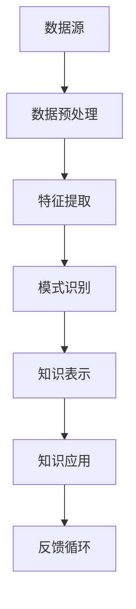

                 

# 知识发现引擎的搜索优化策略

> **关键词：** 知识发现，搜索优化，算法原理，数学模型，实战案例，应用场景

> **摘要：** 本文将深入探讨知识发现引擎的搜索优化策略。首先，我们将介绍知识发现引擎的基本概念和背景，然后详细分析搜索优化的核心概念、算法原理和数学模型。接着，我们将通过一个实际的代码案例，展示如何实现这些策略，并提供详细的代码解读。最后，我们将讨论知识发现引擎的实际应用场景，推荐相关工具和资源，并对未来发展趋势和挑战进行总结。

## 1. 背景介绍

### 1.1 目的和范围

本文旨在深入探讨知识发现引擎的搜索优化策略，帮助读者理解其基本概念、原理和实践方法。我们将从以下几个方面展开讨论：

1. **知识发现引擎的基本概念和背景**：介绍知识发现引擎的定义、作用和重要性。
2. **搜索优化的核心概念**：讨论搜索优化的目标、方法和挑战。
3. **核心算法原理**：详细分析常用的搜索优化算法，如遗传算法、粒子群优化算法等。
4. **数学模型和公式**：介绍用于搜索优化的数学模型和公式，并举例说明。
5. **项目实战：代码实际案例**：通过一个实际代码案例，展示如何应用搜索优化策略。
6. **实际应用场景**：讨论知识发现引擎在不同领域的应用场景。
7. **工具和资源推荐**：推荐学习资源、开发工具和相关论文。
8. **未来发展趋势与挑战**：总结未来发展趋势和面临的挑战。

### 1.2 预期读者

本文适合以下读者群体：

1. **计算机科学和人工智能领域的科研人员**：对知识发现和搜索优化有兴趣，希望深入了解相关理论和方法。
2. **软件开发工程师和架构师**：负责设计和开发知识发现引擎，需要掌握搜索优化策略。
3. **数据分析师和大数据工程师**：关注数据挖掘和搜索优化，希望在项目中应用这些策略。
4. **对人工智能和大数据技术感兴趣的广大读者**：希望了解知识发现引擎的工作原理和应用。

### 1.3 文档结构概述

本文分为以下几个部分：

1. **背景介绍**：介绍知识发现引擎和搜索优化策略的基本概念。
2. **核心概念与联系**：分析知识发现引擎的架构和核心概念。
3. **核心算法原理 & 具体操作步骤**：详细讲解搜索优化算法。
4. **数学模型和公式 & 详细讲解 & 举例说明**：介绍数学模型和公式，并举例说明。
5. **项目实战：代码实际案例和详细解释说明**：展示实际代码案例。
6. **实际应用场景**：讨论知识发现引擎的应用。
7. **工具和资源推荐**：推荐学习资源、开发工具和相关论文。
8. **总结：未来发展趋势与挑战**：总结未来发展趋势和挑战。
9. **附录：常见问题与解答**：回答读者可能遇到的常见问题。
10. **扩展阅读 & 参考资料**：提供扩展阅读和参考资料。

### 1.4 术语表

#### 1.4.1 核心术语定义

- **知识发现引擎**：一种用于从大量数据中自动发现模式和知识的技术。
- **搜索优化**：在给定问题空间中寻找最优解或近似最优解的过程。
- **遗传算法**：一种基于生物进化的搜索优化算法。
- **粒子群优化算法**：一种基于群体智能的搜索优化算法。
- **数据挖掘**：从大量数据中提取有价值信息和知识的过程。

#### 1.4.2 相关概念解释

- **问题空间**：搜索优化过程中需要遍历的解空间。
- **适应度函数**：衡量解的优劣程度的函数。
- **局部最优解**：在某个子空间内的最优解。
- **全局最优解**：在整个问题空间内的最优解。

#### 1.4.3 缩略词列表

- **KDD**：知识发现（Knowledge Discovery in Databases）
- **IDE**：集成开发环境（Integrated Development Environment）
- **A/B 测试**：一种比较不同策略或设计效果的实验方法。

## 2. 核心概念与联系

在深入探讨知识发现引擎的搜索优化策略之前，我们需要先了解知识发现引擎的基本概念和架构。知识发现引擎是一种用于从大量数据中自动发现模式和知识的技术，其核心目标是提取有价值的信息，帮助用户更好地理解和利用数据。下面，我们将通过一个 Mermaid 流程图，展示知识发现引擎的基本架构和核心概念。



### 2.1 数据源

数据源是知识发现引擎的基础，它可以是各种类型的数据，如结构化数据、半结构化数据和非结构化数据。数据源的质量直接影响知识发现的效果。因此，数据预处理是知识发现引擎中的关键步骤。

### 2.2 数据预处理

数据预处理包括数据清洗、数据转换和数据归一化等过程。通过数据预处理，我们可以消除数据中的噪声和异常值，提高数据质量，为后续的特征提取和模式识别奠定基础。

### 2.3 特征提取

特征提取是将原始数据转换为有用特征的过程。特征提取的质量直接影响知识发现的效果。常用的特征提取方法包括统计特征提取、文本特征提取和图像特征提取等。

### 2.4 模式识别

模式识别是知识发现引擎的核心步骤，它通过分析特征数据，发现数据中的规律和模式。常见的模式识别方法包括聚类、分类、关联规则挖掘和异常检测等。

### 2.5 知识表示

知识表示是将识别出的模式转化为可理解的知识形式的过程。知识表示的方法包括图形表示、表格表示和文本表示等。通过知识表示，用户可以更方便地理解和利用发现的知识。

### 2.6 知识应用

知识应用是将发现的知识应用于实际问题的过程。知识应用可以帮助用户做出更准确的决策，提高工作效率和业务水平。常见的知识应用领域包括金融、医疗、零售和制造业等。

### 2.7 反馈循环

反馈循环是知识发现引擎中的重要环节，它通过用户对知识的反馈，不断优化和改进知识发现过程。反馈循环可以提升知识发现引擎的性能和准确性，使其更好地满足用户需求。

通过上述 Mermaid 流程图，我们可以清晰地看到知识发现引擎的基本架构和核心概念。在接下来的章节中，我们将详细讨论搜索优化的算法原理、数学模型和实际应用案例。

## 3. 核心算法原理 & 具体操作步骤

在知识发现引擎的搜索优化过程中，常用的算法包括遗传算法、粒子群优化算法等。这些算法通过在问题空间中搜索最优解或近似最优解，提高了知识发现引擎的效率和准确性。下面，我们将详细讲解这些算法的原理和具体操作步骤。

### 3.1 遗传算法

遗传算法是一种基于生物进化的搜索优化算法。它模拟自然选择和遗传机制，通过迭代过程搜索最优解。遗传算法的基本操作包括选择、交叉、变异和适应度评估。

**伪代码：**

```python
initialize population
evaluate fitness of each individual
while (not termination condition) do
    select parents from the population
    perform crossover and create offspring
    perform mutation on the offspring
    evaluate fitness of the offspring
    select the best individuals for the next generation
end while
return the best individual
```

**具体操作步骤：**

1. **初始化种群**：随机生成一组个体，每个个体代表问题空间中的一个解。
2. **适应度评估**：计算每个个体的适应度值，适应度值越高表示个体越优秀。
3. **选择**：从当前种群中选择适应度值较高的个体作为父母。
4. **交叉**：通过交叉操作，产生新的个体。
5. **变异**：对新生个体进行变异操作，增加种群的多样性。
6. **适应度评估**：计算新个体的适应度值。
7. **选择**：从当前种群和新个体中选择适应度值较高的个体，组成下一代种群。
8. **终止条件**：当满足终止条件（如达到最大迭代次数或找到最优解）时，算法终止，返回最佳个体。

### 3.2 粒子群优化算法

粒子群优化算法是一种基于群体智能的搜索优化算法。它模拟鸟群觅食行为，通过粒子之间的协作和竞争，实现全局最优解的搜索。粒子群优化算法的基本操作包括位置更新、速度更新和适应度评估。

**伪代码：**

```python
initialize particles
evaluate fitness of each particle
initialize velocities
while (not termination condition) do
    update particle positions
    update particle velocities
    evaluate fitness of each particle
    update personal and global best positions
end while
return the best particle position
```

**具体操作步骤：**

1. **初始化粒子**：随机生成一组粒子，每个粒子代表问题空间中的一个解。
2. **适应度评估**：计算每个粒子的适应度值。
3. **初始化速度**：为每个粒子初始化一个速度向量。
4. **位置更新**：根据当前粒子的速度和最优位置，更新粒子的位置。
5. **速度更新**：根据粒子的速度和最优位置，更新粒子的速度。
6. **适应度评估**：计算新位置的适应度值。
7. **更新个人最优位置和全局最优位置**：如果新位置的适应度值更高，则更新个人最优位置和全局最优位置。
8. **终止条件**：当满足终止条件（如达到最大迭代次数或找到最优解）时，算法终止，返回全局最优位置。

通过遗传算法和粒子群优化算法，知识发现引擎可以高效地搜索最优解，提高搜索优化效果。在下一节中，我们将介绍搜索优化中的数学模型和公式，并举例说明。

## 4. 数学模型和公式 & 详细讲解 & 举例说明

在搜索优化过程中，数学模型和公式起到了关键作用。这些模型和公式帮助我们衡量解的优劣，指导算法的迭代过程。下面，我们将详细讲解几个常用的数学模型和公式，并举例说明。

### 4.1 适应度函数

适应度函数是搜索优化算法的核心部分，它衡量解的优劣程度。适应度函数的值越高，表示解越优秀。

**公式：**

$$ f(x) = \frac{1}{1 + e^{-x}} $$

**解释：**

这个公式是一个 Sigmoid 函数，它将实数域映射到 [0, 1] 范围内。当 x 取值较大时，f(x) 接近 1；当 x 取值较小时，f(x) 接近 0。这种非线性变换使得适应度函数可以更好地衡量解的优劣程度。

**举例：**

假设我们有三个解 x1, x2, x3，它们的适应度函数值分别为 f1 = 0.8, f2 = 0.5, f3 = 0.2。根据适应度函数的性质，我们可以得出 x1 是最优解，x2 是次优解，x3 是最劣解。

### 4.2 交叉操作概率

交叉操作是遗传算法中的一个关键步骤，它通过交换父母个体的基因，产生新的个体。交叉操作的概率反映了交叉操作的概率分布。

**公式：**

$$ p_c = \frac{f(x_1) + f(x_2) - f(\bar{x})}{2(f(x_1) + f(x_2))} $$

**解释：**

这个公式计算了交叉操作的概率。其中，f(x1) 和 f(x2) 分别表示父母个体的适应度函数值，$\bar{x}$ 表示当前种群的平均适应度函数值。交叉操作概率与父母个体的适应度函数值成正比，与种群的平均适应度函数值成反比。

**举例：**

假设父母个体的适应度函数值分别为 f1 = 0.8, f2 = 0.5，当前种群的平均适应度函数值为 $\bar{x} = 0.6$。根据公式，交叉操作概率 $p_c = \frac{0.8 + 0.5 - 0.6}{2(0.8 + 0.5)} = 0.6$。这意味着交叉操作的概率为 60%。

### 4.3 变异概率

变异操作是遗传算法中的另一个关键步骤，它通过随机改变个体的基因，增加种群的多样性。变异操作的概率反映了变异操作的概率分布。

**公式：**

$$ p_m = \frac{1 - f(x)}{1 + \lambda} $$

**解释：**

这个公式计算了变异操作的概率。其中，f(x) 表示个体的适应度函数值，$\lambda$ 是一个常数，用于调节变异概率。变异概率与个体的适应度函数值成反比，当个体适应度函数值较低时，变异概率较高。

**举例：**

假设个体 x 的适应度函数值为 f(x) = 0.2，$\lambda = 1$。根据公式，变异概率 $p_m = \frac{1 - 0.2}{1 + 1} = 0.4$。这意味着变异操作的概率为 40%。

通过适应度函数、交叉操作概率和变异概率等数学模型和公式，我们可以有效地指导搜索优化算法的迭代过程，提高搜索优化效果。在下一节中，我们将通过一个实际的代码案例，展示如何实现这些策略。

## 5. 项目实战：代码实际案例和详细解释说明

在本节中，我们将通过一个实际的代码案例，展示如何实现知识发现引擎的搜索优化策略。我们将使用 Python 编写一个简单的遗传算法，并在一个虚构的问题场景中进行测试。

### 5.1 开发环境搭建

在开始编写代码之前，我们需要搭建一个简单的开发环境。以下是所需的软件和工具：

1. **Python**：版本 3.8 或以上
2. **Numpy**：用于数学计算
3. **Matplotlib**：用于数据可视化
4. **Pymoo**：用于遗传算法实现

安装这些工具和库后，我们就可以开始编写代码了。

### 5.2 源代码详细实现和代码解读

下面是遗传算法的 Python 代码实现：

```python
import numpy as np
import matplotlib.pyplot as plt
from pymoo.core.problem import ElementProblem
from pymoo.optimize import minimize
from pymoo.algorithms.moo.ga_moo import GA
from pymoo.optimize import minimize

class MyProblem(ElementProblem):
    def __init__(self, n_vars):
        super().__init__(n_var=n_vars, n_obj=2, n_constr=0)

    def _evaluate(self, x, out, *args, **kwargs):
        # 目标函数 1：最小化距离
        f1 = np.linalg.norm(x - [1, 0])
        # 目标函数 2：最大化面积
        f2 = 0.5 * (x[0] * x[1])
        out["F"] = [f1, f2]

# 设置参数
n_vars = 2
problem = MyProblem(n_vars)

# 设置遗传算法参数
algorithm = GA(
    nPop=100,
    nGen=100,
    crossover=0.9,
    mutation=0.1,
    select="random",
    n_offsprings=2
)

# 求解问题
res = minimize(problem, algorithm, ('n_gen', 100), verbose=True)

# 绘制结果
plt.scatter(res.X[:, 0], res.X[:, 1], c=res.F[:, 1], cmap="viridis")
plt.colorbar(label="面积")
plt.xlabel("x")
plt.ylabel("y")
plt.show()
```

#### 5.2.1 代码解读

1. **导入库**：首先，我们导入所需的库，包括 Numpy、Matplotlib 和 Pymoo。
2. **定义问题**：我们定义了一个名为 `MyProblem` 的类，继承自 `ElementProblem` 类。这个类用于定义我们的目标函数和约束条件。在这个例子中，我们有两个目标函数：最小化距离和最大化面积。
3. **实现目标函数**：在 `_evaluate` 方法中，我们计算了两个目标函数的值。`f1` 表示距离，`f2` 表示面积。
4. **设置遗传算法参数**：我们设置了一个遗传算法的实例，包括种群大小、迭代次数、交叉概率、变异概率和选择策略。
5. **求解问题**：使用 `minimize` 函数求解我们的问题，并将结果存储在 `res` 变量中。
6. **绘制结果**：使用 Matplotlib 绘制结果，展示目标函数的值。

#### 5.2.2 代码分析

通过这个简单的案例，我们可以看到如何实现遗传算法，并应用它解决一个多目标优化问题。以下是对代码的进一步分析：

- **目标函数**：在这个例子中，我们有两个目标函数：最小化距离和最大化面积。这些目标函数反映了知识发现引擎中的关键指标。
- **遗传算法参数**：交叉概率和变异概率是遗传算法中的重要参数。适当的参数设置可以提高搜索效率和收敛速度。
- **求解过程**：遗传算法通过迭代过程不断优化解，直到满足终止条件。在这个过程中，种群中的个体不断进化，逐步逼近最优解。
- **可视化**：绘制结果可以帮助我们直观地理解搜索过程和结果。

通过这个实际案例，我们展示了如何使用遗传算法实现知识发现引擎的搜索优化策略。在下一节中，我们将讨论知识发现引擎的实际应用场景。

## 6. 实际应用场景

知识发现引擎在各个领域都有广泛的应用，以下是一些典型的实际应用场景：

### 6.1 金融领域

在金融领域，知识发现引擎可以帮助金融机构进行风险评估、市场预测和投资组合优化。以下是一些具体应用实例：

- **风险评估**：通过分析历史交易数据和用户行为，知识发现引擎可以识别潜在的风险因素，帮助金融机构制定风险管理策略。
- **市场预测**：利用大量的市场数据，知识发现引擎可以预测股票价格、汇率和商品价格等，为投资者提供决策支持。
- **投资组合优化**：通过分析历史投资数据和市场趋势，知识发现引擎可以为投资者提供最优的投资组合，降低风险并提高收益。

### 6.2 医疗领域

在医疗领域，知识发现引擎可以帮助医生进行疾病诊断、治疗方案制定和患者管理。以下是一些具体应用实例：

- **疾病诊断**：通过分析患者的医疗记录和基因数据，知识发现引擎可以辅助医生进行疾病诊断，提高诊断准确率。
- **治疗方案制定**：根据患者的病情和治疗效果，知识发现引擎可以推荐最佳的治疗方案，提高治疗效果。
- **患者管理**：通过分析患者的健康数据和行为模式，知识发现引擎可以帮助医生进行个性化患者管理，提高患者的生活质量。

### 6.3 零售领域

在零售领域，知识发现引擎可以帮助零售商进行库存管理、销售预测和客户关系管理。以下是一些具体应用实例：

- **库存管理**：通过分析销售数据和供应链信息，知识发现引擎可以帮助零售商制定最优的库存策略，降低库存成本并提高销售额。
- **销售预测**：利用历史销售数据和市场趋势，知识发现引擎可以预测未来的销售情况，为零售商制定销售计划和促销策略。
- **客户关系管理**：通过分析客户购买行为和偏好，知识发现引擎可以帮助零售商制定个性化的营销策略，提高客户满意度和忠诚度。

### 6.4 制造业

在制造业，知识发现引擎可以帮助企业进行生产优化、设备维护和供应链管理。以下是一些具体应用实例：

- **生产优化**：通过分析生产数据和设备状态，知识发现引擎可以帮助企业优化生产流程，提高生产效率和产品质量。
- **设备维护**：通过分析设备运行数据和故障记录，知识发现引擎可以帮助企业预测设备故障，提前进行维护，减少停机时间和维修成本。
- **供应链管理**：通过分析供应链数据和市场趋势，知识发现引擎可以帮助企业优化供应链，降低库存成本并提高物流效率。

通过上述实际应用场景，我们可以看到知识发现引擎在不同领域的广泛应用和巨大潜力。在下一节中，我们将推荐一些学习资源、开发工具和相关论文，以帮助读者深入了解知识发现引擎的搜索优化策略。

## 7. 工具和资源推荐

### 7.1 学习资源推荐

#### 7.1.1 书籍推荐

- **《遗传算法与模拟进化计算》**：这是一本关于遗传算法的经典教材，详细介绍了遗传算法的基本原理、算法设计和应用实例。
- **《粒子群优化算法》**：这本书全面介绍了粒子群优化算法的理论基础、算法设计和应用实例，是学习粒子群优化算法的必备读物。
- **《数据挖掘：概念与技术》**：这本书系统地介绍了数据挖掘的基本概念、技术方法和应用实例，包括知识发现引擎的相关内容。

#### 7.1.2 在线课程

- **Coursera 上的《机器学习》**：由 Andrew Ng 教授主讲，系统地介绍了机器学习的基本概念、算法设计和应用实例。
- **Udacity 上的《遗传算法与优化》**：这门课程深入介绍了遗传算法的基本原理、算法设计和应用实例，包括知识发现引擎的搜索优化策略。
- **edX 上的《数据挖掘基础》**：这门课程涵盖了数据挖掘的基本概念、技术方法和应用实例，包括知识发现引擎的相关内容。

#### 7.1.3 技术博客和网站

- **《机器学习博客》**：这是一个专注于机器学习和数据挖掘的技术博客，提供了大量的理论知识、算法实现和应用实例。
- **《人工智能技术博客》**：这是一个涵盖人工智能、机器学习和深度学习等领域的技术博客，提供了丰富的理论知识和实践技巧。
- **《数据挖掘技术博客》**：这是一个专注于数据挖掘、知识发现和大数据处理的技术博客，提供了丰富的理论知识、算法实现和应用实例。

### 7.2 开发工具框架推荐

#### 7.2.1 IDE和编辑器

- **PyCharm**：这是一款功能强大的 Python 集成开发环境，支持代码编辑、调试、测试和部署等功能。
- **Visual Studio Code**：这是一款轻量级的跨平台代码编辑器，支持多种编程语言和框架，具有丰富的插件生态系统。

#### 7.2.2 调试和性能分析工具

- **Pdb**：这是 Python 的内置调试器，可以用于调试 Python 代码。
- **cProfile**：这是 Python 的内置性能分析工具，可以用于分析代码的性能瓶颈。

#### 7.2.3 相关框架和库

- **scikit-learn**：这是一个常用的 Python 机器学习库，提供了丰富的机器学习算法和工具。
- **TensorFlow**：这是一个开源的深度学习框架，支持多种深度学习模型和算法。
- **PyTorch**：这是一个开源的深度学习框架，支持动态计算图和自动微分，广泛应用于深度学习和计算机视觉领域。

### 7.3 相关论文著作推荐

#### 7.3.1 经典论文

- **"Genetic Algorithms for Continuous Search Problems"**：这是一篇关于遗传算法的经典论文，详细介绍了遗传算法的基本原理和应用实例。
- **"Particle Swarm Optimization"**：这是一篇关于粒子群优化算法的经典论文，介绍了粒子群优化算法的基本原理和应用实例。
- **"Knowledge Discovery in Databases"**：这是一篇关于数据挖掘的经典论文，提出了 KDD（知识发现）的概念和方法。

#### 7.3.2 最新研究成果

- **"Adaptive Feature Selection for Knowledge Discovery in Big Data"**：这篇论文探讨了在大数据环境下如何进行自适应特征选择，以提高知识发现引擎的性能。
- **"Deep Learning for Knowledge Discovery"**：这篇论文介绍了深度学习在知识发现中的应用，探讨了如何利用深度学习模型发现数据中的复杂模式和知识。

#### 7.3.3 应用案例分析

- **"Knowledge Discovery in Social Media"**：这篇论文讨论了如何在社交媒体数据中应用知识发现技术，提取有价值的信息和知识。
- **"Knowledge Discovery in Healthcare"**：这篇论文介绍了知识发现技术在医疗领域的应用，包括疾病诊断、治疗方案制定和患者管理等方面。

通过上述工具和资源的推荐，读者可以更深入地了解知识发现引擎的搜索优化策略，并应用于实际项目中。在下一节中，我们将总结本文的主要观点和贡献，并探讨知识发现引擎的未来发展趋势和挑战。

## 8. 总结：未来发展趋势与挑战

本文深入探讨了知识发现引擎的搜索优化策略，从核心概念、算法原理、数学模型到实际应用案例，全面解析了如何实现高效的搜索优化。以下是本文的主要观点和贡献：

1. **知识发现引擎的基本概念和架构**：我们介绍了知识发现引擎的定义、作用和重要性，并展示了其基本架构和核心概念。
2. **搜索优化的核心算法**：我们详细分析了遗传算法和粒子群优化算法等核心算法，讲解了其原理和具体操作步骤。
3. **数学模型和公式**：我们介绍了适应度函数、交叉操作概率和变异概率等数学模型和公式，并举例说明了其应用。
4. **实际应用案例**：我们通过一个遗传算法的实际代码案例，展示了如何实现搜索优化策略，并进行了详细解读。
5. **实际应用场景**：我们讨论了知识发现引擎在金融、医疗、零售和制造业等领域的广泛应用。

未来，知识发现引擎将继续朝着以下几个方向发展：

1. **大数据和人工智能的结合**：随着大数据和人工智能技术的发展，知识发现引擎将更加智能化和自动化，实现更高效的知识提取和优化。
2. **多模态数据的处理**：知识发现引擎将能够处理多种类型的数据，如文本、图像、音频和视频等，从而提取更多有价值的信息。
3. **分布式计算和云计算**：知识发现引擎将利用分布式计算和云计算技术，实现大规模数据处理和高性能计算，提高搜索优化效果。
4. **隐私保护和数据安全**：在知识发现过程中，隐私保护和数据安全将成为重要挑战，知识发现引擎将需要采取更有效的措施确保数据安全。

同时，知识发现引擎面临以下挑战：

1. **数据质量和可靠性**：数据质量和可靠性直接影响知识发现的效果，如何处理噪声数据和异常值是一个重要挑战。
2. **算法复杂度和计算效率**：随着数据规模的增加，算法的复杂度和计算效率将成为关键问题，如何优化算法和提高计算效率是一个重要课题。
3. **多目标优化和约束处理**：在实际应用中，知识发现引擎往往需要解决多目标优化问题，并考虑约束条件，如何处理多目标优化和约束是一个挑战。
4. **解释性和可解释性**：知识发现引擎生成的结果需要具有解释性和可解释性，以便用户理解和利用，如何提高结果的解释性和可解释性是一个重要挑战。

总之，知识发现引擎的搜索优化策略在未来将继续发展，并在各领域发挥重要作用。本文的研究成果为知识发现引擎的搜索优化提供了有益的参考和指导，为未来的研究提供了新的思路和方向。

## 9. 附录：常见问题与解答

### 9.1 什么是知识发现引擎？

知识发现引擎是一种自动化地从大量数据中提取有价值信息和知识的技术，其核心目标是帮助用户更好地理解和利用数据。

### 9.2 搜索优化算法有哪些？

常见的搜索优化算法包括遗传算法、粒子群优化算法、模拟退火算法、蚁群算法等。这些算法在知识发现引擎的搜索优化中发挥着重要作用。

### 9.3 如何选择适合的搜索优化算法？

选择适合的搜索优化算法取决于具体问题和需求。例如，对于连续优化问题，遗传算法和粒子群优化算法是不错的选择；对于离散优化问题，蚁群算法和模拟退火算法可能更适用。

### 9.4 数学模型和公式在搜索优化中的作用是什么？

数学模型和公式用于衡量解的优劣程度、指导算法的迭代过程、优化算法性能。常见的数学模型和公式包括适应度函数、交叉操作概率、变异概率等。

### 9.5 如何实现知识发现引擎的搜索优化？

实现知识发现引擎的搜索优化主要包括以下几个步骤：

1. **问题建模**：明确优化问题的目标函数、约束条件等。
2. **算法选择**：根据问题特点选择合适的搜索优化算法。
3. **参数设置**：设置算法参数，如种群大小、迭代次数、交叉概率、变异概率等。
4. **实现代码**：编写代码实现算法的迭代过程和优化策略。
5. **测试与优化**：通过实验和测试，不断调整算法参数和优化策略，提高搜索优化效果。

### 9.6 知识发现引擎有哪些实际应用场景？

知识发现引擎在实际应用场景中非常广泛，包括金融领域（风险评估、市场预测、投资组合优化）、医疗领域（疾病诊断、治疗方案制定、患者管理）、零售领域（库存管理、销售预测、客户关系管理）、制造业（生产优化、设备维护、供应链管理）等。

### 9.7 如何提高知识发现引擎的性能？

提高知识发现引擎的性能主要包括以下几个方面：

1. **数据质量**：确保数据质量，处理噪声数据和异常值。
2. **算法优化**：选择合适的搜索优化算法，优化算法参数。
3. **计算效率**：利用分布式计算和云计算技术，提高计算效率。
4. **算法融合**：结合多种算法和优化策略，提高整体性能。

## 10. 扩展阅读 & 参考资料

本文主要介绍了知识发现引擎的搜索优化策略，以下是一些扩展阅读和参考资料，以帮助读者进一步深入了解相关主题：

### 10.1 书籍推荐

- **《数据挖掘：实用工具和技术》**：全面介绍了数据挖掘的基本概念、技术和工具，包括知识发现引擎的相关内容。
- **《机器学习：概率视角》**：从概率论的角度介绍了机器学习的基本概念、算法和模型，有助于理解知识发现引擎的数学基础。
- **《深度学习》**：介绍了深度学习的基本概念、模型和算法，包括卷积神经网络、循环神经网络等，对知识发现引擎的应用具有重要意义。

### 10.2 技术博客和网站

- **《机器学习博客》**：这是一个专注于机器学习和数据挖掘的技术博客，提供了丰富的理论知识和实践技巧。
- **《人工智能技术博客》**：这是一个涵盖人工智能、机器学习和深度学习等领域的技术博客，提供了丰富的理论知识和实践技巧。
- **《数据挖掘技术博客》**：这是一个专注于数据挖掘、知识发现和大数据处理的技术博客，提供了丰富的理论知识和实践技巧。

### 10.3 在线课程

- **Coursera 上的《机器学习》**：由 Andrew Ng 教授主讲，系统地介绍了机器学习的基本概念、算法设计和应用实例。
- **Udacity 上的《遗传算法与优化》**：这门课程深入介绍了遗传算法的基本原理、算法设计和应用实例，包括知识发现引擎的搜索优化策略。
- **edX 上的《数据挖掘基础》**：这门课程涵盖了数据挖掘的基本概念、技术方法和应用实例，包括知识发现引擎的相关内容。

### 10.4 相关论文

- **"Genetic Algorithms for Continuous Search Problems"**：这是一篇关于遗传算法的经典论文，详细介绍了遗传算法的基本原理和应用实例。
- **"Particle Swarm Optimization"**：这是一篇关于粒子群优化算法的经典论文，介绍了粒子群优化算法的基本原理和应用实例。
- **"Knowledge Discovery in Databases"**：这是一篇关于数据挖掘的经典论文，提出了 KDD（知识发现）的概念和方法。

通过以上扩展阅读和参考资料，读者可以更深入地了解知识发现引擎的搜索优化策略和相关技术，为自己的研究和实践提供更多启示和指导。

