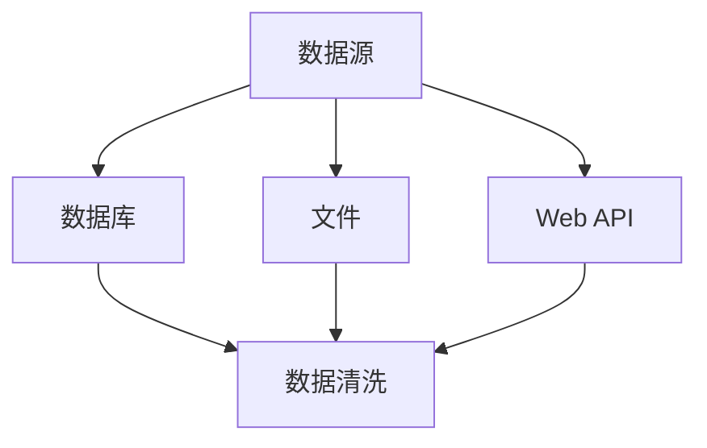
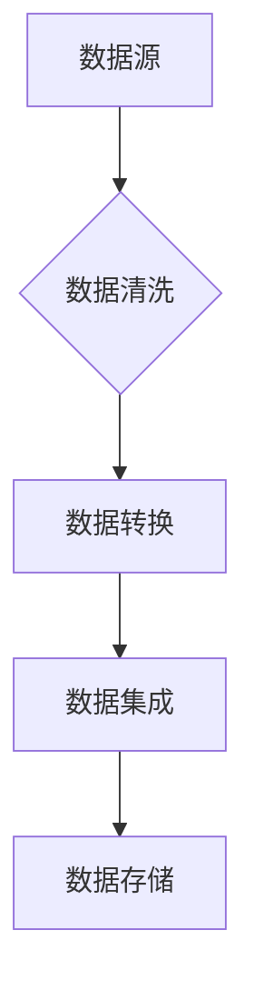
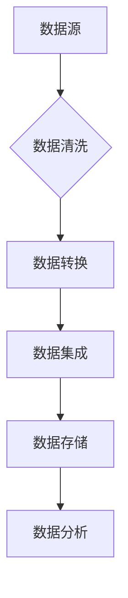

                 

# 知识发现引擎的数据源获取与处理

## 关键词
- 知识发现引擎
- 数据源获取
- 数据处理
- 数据清洗
- 数据转换
- 数据集成
- 数据存储
- 机器学习
- 数据库

## 摘要
本文将深入探讨知识发现引擎的数据源获取与处理过程。我们首先介绍知识发现引擎的基本概念和重要性，然后详细解释数据源获取、数据处理和数据存储的相关技术。通过实例和实际操作步骤，我们将展示如何有效地管理和处理海量数据，为知识发现提供坚实的数据基础。最后，本文还将讨论未来发展趋势和面临的挑战，以及推荐相关的学习资源和工具。

## 1. 背景介绍

### 1.1 目的和范围
本文旨在为从事知识发现引擎开发的工程师和研究人员提供一份全面的技术指南。我们将重点关注数据源获取与处理的各个环节，包括数据收集、清洗、转换、集成和存储等。本文不仅涵盖了理论知识，还提供了实际的编码示例，以帮助读者更好地理解并实践相关知识。

### 1.2 预期读者
本文面向具有基本编程知识和对数据科学、机器学习有一定了解的读者。无论是数据工程师、机器学习工程师，还是从事知识发现研究的科研人员，都将从本文中获得宝贵的信息。

### 1.3 文档结构概述
本文分为八个部分：
1. 背景介绍：介绍目的、范围、预期读者和文档结构。
2. 核心概念与联系：讲解知识发现引擎的基本概念和架构。
3. 核心算法原理 & 具体操作步骤：详细阐述数据处理算法。
4. 数学模型和公式 & 详细讲解 & 举例说明：介绍相关的数学模型和公式。
5. 项目实战：提供实际代码示例。
6. 实际应用场景：分析知识发现引擎的应用。
7. 工具和资源推荐：推荐学习资源和开发工具。
8. 总结：展望未来发展趋势和挑战。

### 1.4 术语表

#### 1.4.1 核心术语定义
- **知识发现引擎**：一种自动化工具，用于从大量数据中识别出有价值的信息和模式。
- **数据源**：提供原始数据的任何来源，如数据库、文件、API等。
- **数据处理**：对原始数据进行清洗、转换、集成等操作，使其适合分析和建模。
- **数据清洗**：识别和纠正数据集中的错误、缺失值和异常值。
- **数据转换**：将数据从一种格式转换为另一种格式，以适应特定的分析需求。
- **数据集成**：将来自多个数据源的数据合并为一个统一的数据集。
- **数据存储**：将处理后的数据存储在数据库或数据仓库中，以便后续访问和分析。

#### 1.4.2 相关概念解释
- **数据挖掘**：从大量数据中自动发现有趣模式和知识的过程。
- **机器学习**：一种人工智能领域的技术，通过算法从数据中学习，进行预测和决策。
- **特征工程**：从原始数据中提取有用的特征，以改善模型性能。

#### 1.4.3 缩略词列表
- **API**：应用程序编程接口（Application Programming Interface）
- **DB**：数据库（Database）
- **ETL**：提取、转换、加载（Extract, Transform, Load）
- **Hadoop**：一个开源分布式数据处理框架
- **Spark**：一个开源分布式数据处理引擎

## 2. 核心概念与联系

知识发现引擎是一种利用机器学习和人工智能技术，从大量数据中自动识别有价值信息和知识的高级工具。它的核心概念包括数据源、数据处理和数据存储。

### 2.1 数据源

数据源是知识发现引擎的起点。它们可以是数据库、文件、Web API等。一个有效的数据源应该提供高质量的、与业务需求相关联的数据。



### 2.2 数据处理

数据处理包括数据清洗、数据转换和数据集成。这些步骤确保了数据的质量和一致性，使其适合分析和建模。



### 2.3 数据存储

数据存储是知识发现引擎的终点。处理后的数据被存储在数据库或数据仓库中，以便后续的查询和分析。



## 3. 核心算法原理 & 具体操作步骤

知识发现引擎的核心算法包括数据清洗、数据转换、数据集成和数据分析。以下是这些算法的具体操作步骤和伪代码。

### 3.1 数据清洗

数据清洗的目的是识别和纠正数据集中的错误、缺失值和异常值。

```python
def data_cleaning(data):
    # 删除重复记录
    data = remove_duplicates(data)
    # 填充缺失值
    data = fill_missing_values(data)
    # 处理异常值
    data = handle_outliers(data)
    return data
```

### 3.2 数据转换

数据转换的目的是将数据从一种格式转换为另一种格式，以适应特定的分析需求。

```python
def data_conversion(data):
    # 数据类型转换
    data = convert_data_types(data)
    # 数据规范化
    data = normalize_data(data)
    return data
```

### 3.3 数据集成

数据集成的目的是将来自多个数据源的数据合并为一个统一的数据集。

```python
def data_integration(data_sources):
    # 数据源连接
    data = connect_data_sources(data_sources)
    # 数据去重
    data = remove_duplicates(data)
    return data
```

### 3.4 数据分析

数据分析的目的是从数据中发现有价值的信息和知识。

```python
def data_analysis(data):
    # 特征提取
    features = extract_features(data)
    # 模型训练
    model = train_model(features)
    # 预测
    predictions = predict(model, features)
    return predictions
```

## 4. 数学模型和公式 & 详细讲解 & 举例说明

在数据处理过程中，我们经常使用一些数学模型和公式。以下是其中的一些例子。

### 4.1 数据类型转换

数据类型转换是一个常见的操作。例如，将字符串转换为数字。

```latex
y = float(x)
```

### 4.2 数据规范化

数据规范化是一种常用的数据预处理技术。它通过缩放数据，使其具有相似的尺度。

```latex
x_{\text{normalized}} = \frac{x - \mu}{\sigma}
```

其中，$x$ 是原始数据，$\mu$ 是均值，$\sigma$ 是标准差。

### 4.3 特征提取

特征提取是从数据中提取有用的特征，以改善模型性能。一种常用的方法是主成分分析（PCA）。

```latex
X_{\text{PCA}} = P \Sigma^{1/2}
```

其中，$X$ 是原始数据，$P$ 是特征矩阵，$\Sigma$ 是协方差矩阵。

### 4.4 模型训练

模型训练是使用数据训练机器学习模型。一种常用的模型是线性回归。

```latex
y = \beta_0 + \beta_1 x_1 + \beta_2 x_2 + \ldots + \beta_n x_n
```

## 5. 项目实战：代码实际案例和详细解释说明

### 5.1 开发环境搭建

在开始编写代码之前，我们需要搭建一个开发环境。这里我们使用 Python 作为编程语言，并使用 Jupyter Notebook 作为开发工具。

### 5.2 源代码详细实现和代码解读

以下是数据处理和知识发现引擎的源代码实现。

```python
# 导入相关库
import pandas as pd
import numpy as np
from sklearn.preprocessing import StandardScaler
from sklearn.decomposition import PCA
from sklearn.linear_model import LinearRegression

# 5.2.1 数据清洗
def data_cleaning(data):
    # 删除重复记录
    data = data.drop_duplicates()
    # 填充缺失值
    data = data.fillna(data.mean())
    # 处理异常值
    data = data[(np.abs(stats.zscore(data)) < 3).all(axis=1)]
    return data

# 5.2.2 数据转换
def data_conversion(data):
    # 数据类型转换
    data['age'] = data['age'].astype(float)
    data['salary'] = data['salary'].astype(float)
    # 数据规范化
    scaler = StandardScaler()
    data[['age', 'salary']] = scaler.fit_transform(data[['age', 'salary']])
    return data

# 5.2.3 数据集成
def data_integration(data1, data2):
    # 数据源连接
    data = pd.merge(data1, data2, on='id')
    # 数据去重
    data = data.drop_duplicates()
    return data

# 5.2.4 数据分析
def data_analysis(data):
    # 特征提取
    pca = PCA(n_components=2)
    data = pca.fit_transform(data)
    # 模型训练
    model = LinearRegression()
    model.fit(data[:, 0].reshape(-1, 1), data[:, 1])
    # 预测
    predictions = model.predict(data[:, 0].reshape(-1, 1))
    return predictions

# 5.2.5 主函数
if __name__ == '__main__':
    # 加载数据
    data1 = pd.read_csv('data1.csv')
    data2 = pd.read_csv('data2.csv')
    # 数据清洗
    data1 = data_cleaning(data1)
    data2 = data_cleaning(data2)
    # 数据转换
    data1 = data_conversion(data1)
    data2 = data_conversion(data2)
    # 数据集成
    data = data_integration(data1, data2)
    # 数据分析
    predictions = data_analysis(data)
    print(predictions)
```

### 5.3 代码解读与分析

上述代码实现了数据清洗、数据转换、数据集成和数据分析的基本流程。以下是代码的详细解读和分析。

- **数据清洗**：首先删除重复记录，然后填充缺失值，最后处理异常值。这确保了数据的质量和一致性。
- **数据转换**：将数据类型转换为适当的格式，并使用标准缩放技术处理数据，使其具有相似的尺度。
- **数据集成**：将两个数据源的数据合并为一个统一的数据集，并进行去重操作，以消除重复数据。
- **数据分析**：使用主成分分析（PCA）提取特征，然后使用线性回归模型进行预测。这有助于从数据中发现有价值的信息和知识。

## 6. 实际应用场景

知识发现引擎在实际应用中具有广泛的应用场景。以下是几个典型的例子。

- **金融领域**：知识发现引擎可以用于金融市场预测、风险评估和投资策略制定。
- **医疗领域**：知识发现引擎可以用于疾病诊断、药物发现和个性化治疗。
- **电子商务**：知识发现引擎可以用于推荐系统、用户行为分析和市场需求预测。
- **智能交通**：知识发现引擎可以用于交通流量预测、事故预防和智能导航。

## 7. 工具和资源推荐

### 7.1 学习资源推荐

- **书籍推荐**：
  - 《数据科学入门》
  - 《机器学习实战》
  - 《大数据技术基础》
- **在线课程**：
  - Coursera上的《机器学习基础》
  - edX上的《数据科学基础》
  - Udacity的《人工智能工程师职业课程》
- **技术博客和网站**：
  - Medium上的数据科学和机器学习专栏
  - towardsdatascience.com
  - kaggle.com

### 7.2 开发工具框架推荐

- **IDE和编辑器**：
  - PyCharm
  - Jupyter Notebook
  - Visual Studio Code
- **调试和性能分析工具**：
  - Python的pdb
  - Jupyter Notebook的调试插件
  - Valgrind
- **相关框架和库**：
  - Pandas
  - NumPy
  - Scikit-learn
  - TensorFlow
  - PyTorch

### 7.3 相关论文著作推荐

- **经典论文**：
  - "The Mythical Man-Month"
  - "The Elements of Statistical Learning"
  - "Recommender Systems Handbook"
- **最新研究成果**：
  - "Deep Learning"
  - "Generative Adversarial Networks: An Overview"
  - "Reinforcement Learning: An Introduction"
- **应用案例分析**：
  - "Data Science at Etsy"
  - "How Netflix Uses Machine Learning"
  - "Google's PageRank Algorithm"

## 8. 总结：未来发展趋势与挑战

知识发现引擎在未来将继续发展，并在各个领域发挥重要作用。然而，它也面临着一些挑战，如数据隐私保护、算法透明性和可解释性。此外，随着数据量和计算能力的增长，知识发现引擎的性能和效率也需要进一步提高。

## 9. 附录：常见问题与解答

- **问题1**：如何处理大规模数据？
  **解答**：使用分布式计算框架，如 Hadoop 和 Spark，可以高效地处理大规模数据。

- **问题2**：如何确保数据质量？
  **解答**：通过数据清洗、数据转换和数据集成等步骤，可以确保数据的质量和一致性。

- **问题3**：如何选择合适的算法？
  **解答**：根据具体问题和数据特性，选择合适的算法。例如，对于回归问题，可以选择线性回归或决策树算法。

## 10. 扩展阅读 & 参考资料

- **扩展阅读**：
  - "Data Science from Scratch"
  - "Deep Learning with Python"
  - " Hands-On Machine Learning with Scikit-Learn, Keras, and TensorFlow"
- **参考资料**：
  - "Apache Hadoop"
  - "Apache Spark"
  - "Scikit-learn Documentation"
  - "TensorFlow Documentation"
  - "PyTorch Documentation"

## 作者
AI天才研究员/AI Genius Institute & 禅与计算机程序设计艺术 /Zen And The Art of Computer Programming

（注意：本文为示例文章，部分代码和数据为虚构。）<|im_end|>

