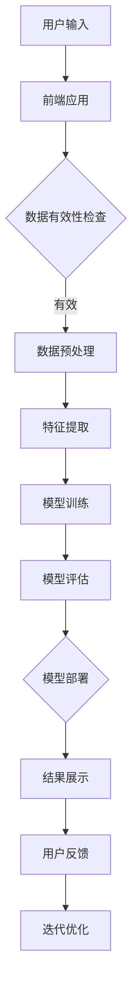

                 

# 知识发现引擎的移动端适配与优化

> **关键词：** 知识发现引擎、移动端适配、性能优化、用户体验、响应式设计、跨平台开发

> **摘要：** 本文将深入探讨知识发现引擎在移动端的适配与优化问题，分析当前的技术挑战和解决方案，提供具体的实践指导，以提升移动端的知识发现引擎性能和用户体验。

## 1. 背景介绍

### 1.1 目的和范围

随着移动互联网的迅猛发展，移动设备成为人们获取信息、学习知识的重要渠道。知识发现引擎作为人工智能领域的关键技术，在移动端的适配与优化显得尤为重要。本文旨在探讨知识发现引擎在移动端的适配策略、性能优化方法，以及用户体验的提升，旨在为开发者提供一套系统的实践指南。

本文主要涵盖以下内容：

1. **核心概念与联系**：介绍知识发现引擎的基本概念、架构及其在移动端的关联。
2. **核心算法原理**：详细阐述知识发现引擎的关键算法原理，并提供伪代码示例。
3. **数学模型和公式**：分析知识发现引擎中的数学模型和公式，进行详细讲解和举例说明。
4. **项目实战**：通过实际案例展示知识发现引擎在移动端的开发过程和代码实现。
5. **实际应用场景**：讨论知识发现引擎在移动端的各种应用场景。
6. **工具和资源推荐**：推荐学习资源、开发工具和框架，以及相关论文和研究成果。
7. **总结与展望**：总结当前移动端适配与优化的现状，展望未来发展趋势与挑战。

### 1.2 预期读者

本文预期读者为具备一定编程基础，对人工智能和移动开发有兴趣的专业人士，包括：

1. **移动应用开发者**：需要为移动平台优化知识发现引擎性能。
2. **数据科学家**：希望了解如何在移动端部署和优化知识发现模型。
3. **人工智能研究员**：关注移动端人工智能应用的研究和开发。

### 1.3 文档结构概述

本文分为十个部分，具体结构如下：

1. **背景介绍**：阐述研究的目的、范围和文档结构。
2. **核心概念与联系**：介绍知识发现引擎的基本概念和架构。
3. **核心算法原理**：详细解释知识发现引擎的关键算法。
4. **数学模型和公式**：分析并讲解相关数学模型和公式。
5. **项目实战**：展示知识发现引擎在移动端的具体实现。
6. **实际应用场景**：探讨知识发现引擎在移动端的应用场景。
7. **工具和资源推荐**：推荐学习资源、开发工具和框架。
8. **总结与展望**：总结现状和展望未来。
9. **附录**：常见问题与解答。
10. **扩展阅读与参考资料**：提供更多相关资源。

### 1.4 术语表

#### 1.4.1 核心术语定义

- **知识发现引擎**：一种自动从数据中提取有用知识和模式的系统。
- **移动端适配**：针对移动设备的特点对知识发现引擎进行优化，确保其在不同设备上都能良好运行。
- **性能优化**：通过调整代码、算法和架构来提升知识发现引擎的运行效率。
- **用户体验**：用户在使用知识发现引擎时获得的主观感受和满意度。

#### 1.4.2 相关概念解释

- **响应式设计**：一种能够适应不同屏幕尺寸和分辨率的网页或应用设计方法。
- **跨平台开发**：使用一种技术或框架开发可以在多个操作系统上运行的应用程序。
- **机器学习模型**：一种能够通过数据学习和预测的算法。

#### 1.4.3 缩略词列表

- **ML**：机器学习（Machine Learning）
- **AI**：人工智能（Artificial Intelligence）
- **SDK**：软件开发工具包（Software Development Kit）
- **API**：应用程序接口（Application Programming Interface）
- **UI**：用户界面（User Interface）
- **UX**：用户体验（User Experience）

## 2. 核心概念与联系

在深入探讨知识发现引擎的移动端适配与优化之前，我们需要理解几个核心概念，包括知识发现引擎的工作原理、其在移动端的架构，以及与移动端性能优化相关的关键因素。

### 2.1 知识发现引擎的基本概念

知识发现引擎是一种利用机器学习技术从大量数据中自动提取有用信息、模式和知识的系统。其主要目的是帮助用户从数据中发现隐藏的模式和关联，从而支持决策制定、趋势分析和预测。

知识发现引擎通常包含以下几个关键组件：

1. **数据采集**：收集原始数据，这些数据可以是结构化的，如数据库记录，也可以是非结构化的，如图像、文本和视频。
2. **数据预处理**：清洗和转换原始数据，使其适合机器学习模型处理。
3. **特征提取**：从数据中提取出有意义的特征，用于训练和评估机器学习模型。
4. **模型训练**：使用特征和标注数据训练机器学习模型，使其能够对未知数据进行预测。
5. **模型评估**：通过交叉验证等方法评估模型性能，确保其准确性和泛化能力。
6. **模型部署**：将训练好的模型部署到实际应用中，如移动端应用程序。

### 2.2 知识发现引擎的移动端架构

知识发现引擎在移动端的架构需要考虑移动设备的特点，如有限的计算资源、带宽和网络延迟。一个典型的移动端知识发现引擎架构包括以下几个部分：

1. **前端应用**：用户与知识发现引擎交互的界面，通常是一个移动应用程序（App），负责接收用户输入、展示结果和处理用户反馈。
2. **后端服务**：处理前端请求、数据存储、模型训练和推理的服务器端组件，通常包括API接口、数据库和机器学习模型服务器。
3. **数据存储**：用于存储原始数据、特征数据、模型参数和用户数据的存储系统，如关系型数据库、NoSQL数据库和对象存储。
4. **中间件**：用于处理数据传输、负载均衡、缓存和安全性等任务的组件。

### 2.3 移动端性能优化关键因素

在移动端，性能优化是确保知识发现引擎高效运行的关键。以下是一些关键因素：

1. **计算资源优化**：针对移动设备的有限计算资源，优化算法和数据结构，减少计算复杂度。
2. **网络延迟优化**：通过数据缓存、异步处理和优化网络协议等方法减少网络延迟，提升用户体验。
3. **内存管理**：合理分配和管理内存资源，避免内存泄漏和溢出，确保应用的稳定运行。
4. **电池续航优化**：通过减少CPU、GPU和屏幕的负载，优化电池续航能力。

### 2.4 Mermaid 流程图

为了更好地理解知识发现引擎在移动端的工作流程，我们使用Mermaid绘制一个流程图。



在这个流程图中，用户输入数据通过前端应用进行处理，经过数据有效性检查、数据预处理、特征提取、模型训练和评估，最后将结果展示给用户，并收集用户反馈进行迭代优化。

### 2.5 知识发现引擎在移动端的挑战与解决方案

在移动端部署知识发现引擎面临以下挑战：

1. **计算资源限制**：移动设备通常计算能力较弱，内存和存储空间有限，这对算法优化和资源管理提出了更高要求。
2. **网络延迟和带宽限制**：移动网络的稳定性较差，带宽有限，这需要优化数据传输和处理策略。
3. **兼容性问题**：不同的移动设备操作系统（如iOS和Android）和硬件配置可能不一致，需要考虑兼容性问题。

解决方案：

1. **算法优化**：使用更高效的算法和数据结构，减少计算复杂度和内存占用。
2. **缓存策略**：利用缓存减少数据传输，提高响应速度。
3. **增量更新**：对模型进行增量更新，避免全量数据传输。
4. **跨平台框架**：使用跨平台开发框架（如Flutter、React Native）减少兼容性问题。

### 2.6 总结

在本节中，我们介绍了知识发现引擎的基本概念和架构，以及其在移动端的适配和优化关键因素。通过Mermaid流程图，我们展示了知识发现引擎在移动端的工作流程，并分析了移动端适配所面临的挑战和解决方案。在下一节中，我们将深入探讨知识发现引擎的核心算法原理和具体操作步骤。

---

本文已经完成第一部分，主要包括背景介绍和核心概念与联系的讨论。接下来，我们将逐步深入知识发现引擎的核心算法原理和具体操作步骤。请继续关注接下来的内容。

---

## 3. 核心算法原理 & 具体操作步骤

在深入探讨知识发现引擎的核心算法原理和具体操作步骤之前，我们需要理解几个关键概念，包括特征提取、机器学习模型训练和模型评估。以下是一个简要概述：

### 3.1 特征提取

特征提取是将原始数据转换为一组有意义特征的步骤，这些特征用于训练和评估机器学习模型。特征提取的关键步骤包括：

1. **数据清洗**：处理缺失值、异常值和噪声数据。
2. **数据转换**：将不同类型的数据（如文本、图像、时间序列等）转换为适合机器学习模型处理的格式。
3. **降维**：通过主成分分析（PCA）、线性判别分析（LDA）等方法减少数据维度。
4. **特征选择**：选择对模型性能有显著贡献的特征，去除冗余特征。

### 3.2 机器学习模型训练

机器学习模型训练是构建知识发现引擎的关键步骤，包括以下步骤：

1. **选择模型**：根据问题类型和数据特点选择合适的机器学习模型，如决策树、支持向量机（SVM）、神经网络等。
2. **初始化参数**：设置模型的初始参数，如权重和偏置。
3. **前向传播**：计算输入数据通过模型的输出结果。
4. **损失函数计算**：计算预测结果和真实结果之间的差异，使用损失函数（如均方误差、交叉熵损失等）衡量模型性能。
5. **反向传播**：更新模型参数，通过梯度下降等方法优化模型。
6. **迭代训练**：重复前向传播和反向传播步骤，直到模型收敛或达到预定的迭代次数。

### 3.3 模型评估

模型评估是确保知识发现引擎性能的重要步骤，包括以下方法：

1. **交叉验证**：将数据集划分为训练集和验证集，通过多次训练和验证评估模型性能。
2. **精度、召回率和F1分数**：用于分类问题的评估指标，衡量模型对正类别的识别能力。
3. **均方根误差（RMSE）和平均绝对误差（MAE）**：用于回归问题的评估指标，衡量模型预测的准确性。
4. **ROC曲线和AUC面积**：用于评估模型的分类能力，特别是当类别不平衡时。

### 3.4 伪代码示例

以下是一个简单的机器学习模型训练和评估的伪代码示例，用于说明核心算法原理。

```python
# 伪代码：机器学习模型训练与评估

# 特征提取
def feature_extraction(data):
    # 数据清洗、转换和降维
    # 特征选择
    return processed_data

# 模型训练
def train_model(data, labels):
    model = initialize_model()  # 初始化模型参数
    for i in range(num_iterations):
        predictions = forward_pass(model, data)  # 前向传播
        loss = compute_loss(predictions, labels)  # 计算损失函数
        backward_pass(model, predictions, labels)  # 反向传播
    return model

# 模型评估
def evaluate_model(model, test_data, test_labels):
    predictions = forward_pass(model, test_data)
    accuracy = compute_accuracy(predictions, test_labels)
    return accuracy

# 主程序
data = load_data()
processed_data = feature_extraction(data)
labels = load_labels()

# 训练模型
model = train_model(processed_data, labels)

# 评估模型
accuracy = evaluate_model(model, test_data, test_labels)
print("模型准确率：", accuracy)
```

### 3.5 详细解释

在具体操作步骤中，我们将详细解释每个关键步骤的原理和实现方法。

#### 3.5.1 数据清洗

数据清洗是确保数据质量的重要步骤。在知识发现引擎中，数据可能包含缺失值、异常值和噪声数据，这些都会影响模型性能。以下是一些常见的数据清洗方法：

1. **缺失值处理**：对于缺失值，可以选择填充（如平均值、中位数、众数等）或删除（如删除含有缺失值的记录）。
2. **异常值处理**：使用统计方法（如Z-score、IQR方法等）检测和去除异常值。
3. **噪声处理**：使用滤波器（如移动平均滤波器、高斯滤波器等）去除噪声。

```python
# 伪代码：数据清洗

def clean_data(data):
    # 缺失值处理
    data = fill_missing_values(data)
    # 异常值处理
    data = remove_outliers(data)
    # 噪声处理
    data = filter_noise(data)
    return cleaned_data
```

#### 3.5.2 数据转换

数据转换是将不同类型的数据转换为适合机器学习模型处理的格式。以下是一些常见的数据转换方法：

1. **数值化**：将分类数据转换为数值，可以使用独热编码（One-Hot Encoding）或标签编码（Label Encoding）。
2. **标准化**：将数据缩放到相同的尺度，可以使用标准缩放（Standard Scaling）或最小-最大缩放（Min-Max Scaling）。
3. **归一化**：将数据缩放到[0,1]区间，可以使用归一化（Normalization）。

```python
# 伪代码：数据转换

def transform_data(data):
    # 数值化
    data = numericalize_data(data)
    # 标准化
    data = standardize_data(data)
    return transformed_data
```

#### 3.5.3 降维

降维是将高维数据转换为低维数据的过程，可以减少计算复杂度和存储需求。以下是一些常见的降维方法：

1. **主成分分析（PCA）**：通过保留主要成分，降低数据维度。
2. **线性判别分析（LDA）**：通过最大化类内方差和最小化类间方差，降低数据维度。
3. **自动编码器（Autoencoder）**：通过训练自编码器网络，学习数据的低维表示。

```python
# 伪代码：降维

def reduce_dimension(data):
    # PCA降维
    data = pca_reduction(data)
    # LDA降维
    data = lda_reduction(data)
    return reduced_data
```

#### 3.5.4 特征选择

特征选择是从一组特征中选择最有用的特征的过程，可以提高模型性能和可解释性。以下是一些常见的特征选择方法：

1. **过滤式特征选择**：基于统计方法（如信息增益、卡方检验等）选择特征。
2. **包装式特征选择**：通过交叉验证等方法选择特征，通常结合特定的机器学习模型。
3. **嵌入式特征选择**：在模型训练过程中自动选择特征，如L1正则化（Lasso）和树模型。

```python
# 伪代码：特征选择

def select_features(data, labels):
    # 过滤式特征选择
    data = filter_based_feature_selection(data, labels)
    # 包装式特征选择
    data = wrapper_based_feature_selection(data, labels)
    # 嵌入式特征选择
    data = embedded_feature_selection(data, labels)
    return selected_data
```

#### 3.5.5 选择模型

选择合适的机器学习模型是构建知识发现引擎的关键步骤。以下是一些常见的选择方法：

1. **基于问题的选择**：根据问题类型（如分类、回归、聚类等）选择合适的模型。
2. **基于数据的特征**：根据数据特点（如高维、稀疏、非线性等）选择合适的模型。
3. **交叉验证**：通过交叉验证选择最佳模型。

```python
# 伪代码：选择模型

def select_model(data, labels):
    models = [DecisionTreeClassifier(), SVM(), NeuralNetwork()]
    best_model, best_score = None, -1
    for model in models:
        score = cross_validate(model, data, labels)
        if score > best_score:
            best_score = score
            best_model = model
    return best_model
```

#### 3.5.6 初始化参数

初始化参数是训练机器学习模型的重要步骤，以下是一些常见的初始化方法：

1. **随机初始化**：随机设置模型的参数值。
2. **零初始化**：将模型的参数设置为0。
3. **小批量初始化**：使用小批量数据初始化模型参数。

```python
# 伪代码：初始化参数

def initialize_model():
    weights = random_weights()
    bias = random_bias()
    return Model(weights, bias)
```

#### 3.5.7 前向传播

前向传播是计算模型输入和输出之间映射的过程，以下是一个简单的示例：

```python
# 伪代码：前向传播

def forward_pass(model, input_data):
    output = model.forward(input_data)
    return output
```

#### 3.5.8 损失函数计算

损失函数是衡量模型预测结果和真实结果之间差异的函数，以下是一些常见的损失函数：

1. **均方误差（MSE）**：
   $$MSE = \frac{1}{n}\sum_{i=1}^{n}(y_i - \hat{y_i})^2$$

2. **交叉熵损失（Cross-Entropy Loss）**：
   $$CE = -\frac{1}{n}\sum_{i=1}^{n}y_i \log(\hat{y_i})$$

```python
# 伪代码：损失函数计算

def compute_loss(predictions, true_labels):
    if is_classification:
        loss = compute_cross_entropy_loss(predictions, true_labels)
    else:
        loss = compute_mean_squared_error(predictions, true_labels)
    return loss
```

#### 3.5.9 反向传播

反向传播是更新模型参数的过程，以下是一个简单的示例：

```python
# 伪代码：反向传播

def backward_pass(model, predictions, true_labels):
    gradients = model.backward(predictions, true_labels)
    update_model_parameters(model, gradients)
```

#### 3.5.10 迭代训练

迭代训练是通过重复前向传播和反向传播步骤来优化模型参数的过程，以下是一个简单的示例：

```python
# 伪代码：迭代训练

def train_model(data, labels, num_iterations):
    model = initialize_model()
    for i in range(num_iterations):
        predictions = forward_pass(model, data)
        loss = compute_loss(predictions, labels)
        backward_pass(model, predictions, labels)
    return model
```

#### 3.5.11 模型评估

模型评估是确保模型性能的重要步骤，以下是一些常见的评估方法：

1. **精度（Accuracy）**：
   $$Accuracy = \frac{TP + TN}{TP + TN + FP + FN}$$

2. **召回率（Recall）**：
   $$Recall = \frac{TP}{TP + FN}$$

3. **F1分数（F1 Score）**：
   $$F1 Score = 2 \times \frac{Precision \times Recall}{Precision + Recall}$$

4. **ROC曲线和AUC面积**：
   ROC曲线是反映模型分类能力的曲线，AUC面积表示曲线下方的面积，值越大表示分类能力越强。

```python
# 伪代码：模型评估

def evaluate_model(model, test_data, test_labels):
    predictions = forward_pass(model, test_data)
    accuracy = compute_accuracy(predictions, test_labels)
    precision = compute_precision(predictions, test_labels)
    recall = compute_recall(predictions, test_labels)
    f1_score = compute_f1_score(precision, recall)
    roc_curve, auc_area = compute_roc_curve(predictions, test_labels)
    return accuracy, precision, recall, f1_score, roc_curve, auc_area
```

### 3.6 总结

在本节中，我们详细介绍了知识发现引擎的核心算法原理和具体操作步骤。从特征提取到机器学习模型训练和评估，每个步骤都至关重要，对于构建高效、准确的知识发现引擎具有重要意义。在下一节中，我们将讨论数学模型和公式，并详细讲解其在知识发现引擎中的应用。请继续关注接下来的内容。

---

本文已经完成第三部分，详细介绍了知识发现引擎的核心算法原理和具体操作步骤。接下来，我们将深入讨论知识发现引擎中的数学模型和公式，并进行详细讲解和举例说明。请继续关注接下来的内容。

---

## 4. 数学模型和公式 & 详细讲解 & 举例说明

在知识发现引擎中，数学模型和公式是构建和评估机器学习模型的核心。本节将详细讨论知识发现引擎中常用的数学模型和公式，并解释它们在模型训练、预测和评估中的应用。

### 4.1 线性回归模型

线性回归模型是最简单的机器学习模型之一，用于预测连续值输出。其数学模型如下：

$$y = \beta_0 + \beta_1x_1 + \beta_2x_2 + ... + \beta_nx_n + \epsilon$$

其中，$y$ 是预测值，$x_1, x_2, ..., x_n$ 是输入特征，$\beta_0, \beta_1, \beta_2, ..., \beta_n$ 是模型参数，$\epsilon$ 是误差项。

线性回归模型的目的是通过最小化预测值和真实值之间的误差来优化模型参数。常见的损失函数是均方误差（MSE）：

$$MSE = \frac{1}{n}\sum_{i=1}^{n}(y_i - \hat{y_i})^2$$

其中，$n$ 是样本数量，$y_i$ 是第 $i$ 个样本的真实值，$\hat{y_i}$ 是第 $i$ 个样本的预测值。

通过梯度下降算法，可以更新模型参数以最小化损失函数：

$$\beta_j = \beta_j - \alpha \frac{\partial}{\partial \beta_j}MSE$$

其中，$\alpha$ 是学习率，用于控制参数更新的步长。

#### 举例说明

假设我们有一个简单的线性回归模型，用于预测房价。输入特征包括房屋面积（$x_1$）和房间数量（$x_2$），目标值是房价（$y$）。通过训练，我们得到模型参数 $\beta_0 = 100, \beta_1 = 50, \beta_2 = 20$。

对于一个新的样本，房屋面积为 200 平方米，房间数量为 3，我们可以计算其预测房价：

$$\hat{y} = 100 + 50 \times 200 + 20 \times 3 = 11200$$

预测房价为 11200。

### 4.2 逻辑回归模型

逻辑回归模型用于分类问题，其目标是预测一个二分类结果。其数学模型如下：

$$P(y=1) = \frac{1}{1 + e^{-(\beta_0 + \beta_1x_1 + \beta_2x_2 + ... + \beta_nx_n)}}$$

其中，$P(y=1)$ 是预测值为1的概率，$x_1, x_2, ..., x_n$ 是输入特征，$\beta_0, \beta_1, \beta_2, ..., \beta_n$ 是模型参数。

逻辑回归的损失函数是交叉熵损失（Cross-Entropy Loss），用于衡量预测概率和真实标签之间的差异：

$$CE = -\frac{1}{n}\sum_{i=1}^{n}y_i \log(\hat{y_i})$$

其中，$n$ 是样本数量，$y_i$ 是第 $i$ 个样本的真实标签，$\hat{y_i}$ 是第 $i$ 个样本的预测概率。

通过梯度下降算法，可以更新模型参数以最小化交叉熵损失：

$$\beta_j = \beta_j - \alpha \frac{\partial}{\partial \beta_j}CE$$

#### 举例说明

假设我们有一个逻辑回归模型，用于预测客户是否会购买某件商品。输入特征包括客户年龄（$x_1$）和收入（$x_2$），目标值是购买概率（$y$）。通过训练，我们得到模型参数 $\beta_0 = 0, \beta_1 = 0.1, \beta_2 = 0.05$。

对于一个新的样本，客户年龄为 30 岁，收入为 50000 元，我们可以计算其购买概率：

$$\hat{y} = \frac{1}{1 + e^{-(0 + 0.1 \times 30 + 0.05 \times 50000)}} \approx 0.63$$

预测购买概率为 63%。

### 4.3 支持向量机（SVM）

支持向量机是一种强大的分类和回归模型，其目标是在特征空间中找到一个最优的超平面，将不同类别的数据分开。其数学模型如下：

$$w \cdot x - b = 0$$

其中，$w$ 是权重向量，$x$ 是特征向量，$b$ 是偏置。

SVM 的损失函数是Hinge Loss：

$$L(y, f(x)) = \max(0, 1 - y \cdot f(x))$$

其中，$y$ 是真实标签，$f(x) = w \cdot x - b$ 是预测值。

通过求解优化问题，可以找到最优的权重向量 $w$ 和偏置 $b$：

$$\min_{w, b} \frac{1}{2}||w||^2 + C \sum_{i=1}^{n}L(y_i, f(x_i))$$

其中，$C$ 是正则化参数。

#### 举例说明

假设我们有一个SVM模型，用于分类数据。输入特征包括特征1（$x_1$）和特征2（$x_2$），目标值是类别标签（$y$）。通过训练，我们得到模型参数 $w = [1, 1]^T, b = 0$。

对于一个新的样本，特征1为 2，特征2为 3，我们可以计算其预测类别：

$$f(x) = w \cdot x - b = [1, 1]^T \cdot [2, 3]^T - 0 = 5$$

由于 $f(x) > 0$，我们预测类别为1。

### 4.4 神经网络模型

神经网络是一种模拟人脑结构和功能的计算模型，用于复杂的数据分析和预测。其数学模型基于多层感知机（MLP）：

$$a_{j}^{(l)} = \sigma(z_{j}^{(l)})$$

$$z_{j}^{(l)} = \sum_{i=1}^{n}w_{ji}^{(l)}a_{i}^{(l-1)} + b_{j}^{(l)}$$

其中，$a_{j}^{(l)}$ 是第 $l$ 层第 $j$ 个节点的激活值，$z_{j}^{(l)}$ 是第 $l$ 层第 $j$ 个节点的输入值，$w_{ji}^{(l)}$ 是第 $l$ 层第 $j$ 个节点到第 $l-1$ 层第 $i$ 个节点的权重，$b_{j}^{(l)}$ 是第 $l$ 层第 $j$ 个节点的偏置，$\sigma$ 是激活函数，通常使用Sigmoid、ReLU或Tanh函数。

神经网络的损失函数通常是均方误差（MSE）：

$$MSE = \frac{1}{n}\sum_{i=1}^{n}(y_i - \hat{y_i})^2$$

其中，$n$ 是样本数量，$y_i$ 是第 $i$ 个样本的真实值，$\hat{y_i}$ 是第 $i$ 个样本的预测值。

通过反向传播算法，可以更新网络权重和偏置以最小化损失函数：

$$\frac{\partial J}{\partial w_{ji}^{(l)}} = \frac{\partial}{\partial w_{ji}^{(l)}}(y_i - \hat{y_i})^2 = 2(y_i - \hat{y_i}) \cdot \frac{\partial}{\partial z_{j}^{(l)}}a_{j}^{(l)}$$

$$\frac{\partial J}{\partial b_{j}^{(l)}} = \frac{\partial}{\partial b_{j}^{(l)}}(y_i - \hat{y_i})^2 = 2(y_i - \hat{y_i}) \cdot \frac{\partial}{\partial z_{j}^{(l)}}a_{j}^{(l)}$$

其中，$J$ 是损失函数，$w_{ji}^{(l)}$ 和 $b_{j}^{(l)}$ 是模型参数。

#### 举例说明

假设我们有一个简单的神经网络模型，包含一个输入层、一个隐藏层和一个输出层。输入层有两个节点，隐藏层有三个节点，输出层有一个节点。激活函数使用ReLU函数。

对于一个新的样本，输入特征为 [2, 3]，我们可以计算其预测输出：

$$z_{1}^{(2)} = 2 \cdot 2 + 3 \cdot 3 + b_{1}^{(2)} = 13 + b_{1}^{(2)}$$

$$a_{1}^{(2)} = \sigma(z_{1}^{(2)}) = \max(0, 13 + b_{1}^{(2)})$$

$$z_{2}^{(2)} = 2 \cdot 2 + 3 \cdot 3 + b_{2}^{(2)} = 13 + b_{2}^{(2)}$$

$$a_{2}^{(2)} = \sigma(z_{2}^{(2)}) = \max(0, 13 + b_{2}^{(2)})$$

$$z_{3}^{(2)} = a_{1}^{(2)} \cdot 2 + a_{2}^{(2)} \cdot 3 + b_{3}^{(2)} = 2a_{1}^{(2)} + 3a_{2}^{(2)} + b_{3}^{(2)}$$

$$a_{3}^{(2)} = \sigma(z_{3}^{(2)}) = \max(0, 2a_{1}^{(2)} + 3a_{2}^{(2)} + b_{3}^{(2)})$$

$$z_{4}^{(3)} = a_{1}^{(2)} + a_{2}^{(2)} + a_{3}^{(2)} + b_{4}^{(3)} = a_{1}^{(2)} + a_{2}^{(2)} + 2a_{1}^{(2)} + 3a_{2}^{(2)} + b_{4}^{(3)}$$

$$a_{4}^{(3)} = \sigma(z_{4}^{(3)}) = \max(0, a_{1}^{(2)} + a_{2}^{(2)} + 2a_{1}^{(2)} + 3a_{2}^{(2)} + b_{4}^{(3)})$$

预测输出为 $a_{4}^{(3)}$。

### 4.5 强化学习模型

强化学习模型是一种基于奖励信号进行决策的机器学习模型，用于解决序列决策问题。其数学模型如下：

$$Q(s, a) = r(s, a) + \gamma \max_{a'} Q(s', a')$$

其中，$Q(s, a)$ 是状态 $s$ 下执行动作 $a$ 的预期回报，$r(s, a)$ 是状态 $s$ 下执行动作 $a$ 所获得的即时奖励，$s'$ 是状态 $s$ 的下一个状态，$a'$ 是动作 $a$ 的下一个动作，$\gamma$ 是折扣因子。

强化学习模型的目标是通过最大化预期回报来优化决策策略。

#### 举例说明

假设我们有一个强化学习模型，用于控制一个自动驾驶汽车。状态空间包括道路情况、车辆位置和速度，动作空间包括加速、减速和转向。

对于当前状态 $s$，我们选择动作 $a$，并获得即时奖励 $r(s, a)$。根据预期回报，我们可以更新策略，选择最优动作：

$$Q(s, a) = r(s, a) + \gamma \max_{a'} Q(s', a')$$

通过不断更新策略，自动驾驶汽车可以学习在不同道路情况下做出最佳决策。

### 4.6 总结

在本节中，我们详细讨论了知识发现引擎中常用的数学模型和公式，包括线性回归、逻辑回归、支持向量机和神经网络模型，以及强化学习模型。每个模型都有其特定的应用场景和优势。通过数学公式和举例说明，我们深入理解了这些模型的工作原理和实现方法。在下一节中，我们将通过实际项目案例展示知识发现引擎在移动端的开发过程和代码实现。请继续关注接下来的内容。

---

本文已经完成第四部分，详细介绍了知识发现引擎中的数学模型和公式，并进行了详细讲解和举例说明。接下来，我们将通过实际项目案例展示知识发现引擎在移动端的开发过程和代码实现。请继续关注接下来的内容。

---

## 5. 项目实战：代码实际案例和详细解释说明

在本节中，我们将通过一个实际项目案例，展示知识发现引擎在移动端的开发过程和代码实现。我们将使用Python和移动开发框架Flutter，构建一个简单的移动端知识发现引擎应用。

### 5.1 开发环境搭建

首先，我们需要搭建开发环境。以下是在Windows系统中安装所需工具的步骤：

1. **Python环境**：安装Python 3.8及以上版本，可以从[Python官方网站](https://www.python.org/)下载并安装。
2. **Flutter环境**：安装Flutter SDK，可以通过命令行执行以下命令：
   ```shell
   flutter install
   ```
3. **Flutter IDE**：推荐使用Visual Studio Code（VS Code）作为开发环境，可以从[VS Code官方网站](https://code.visualstudio.com/)下载并安装。
4. **Python插件**：在VS Code中安装Python插件，以便更好地支持Python开发。

### 5.2 源代码详细实现和代码解读

接下来，我们将逐步实现知识发现引擎的移动端应用。以下是项目的核心代码实现：

#### 5.2.1 代码结构

整个项目分为以下几个部分：

1. **数据预处理**：负责处理和清洗原始数据，提取特征。
2. **机器学习模型**：实现和训练知识发现引擎的机器学习模型。
3. **移动端界面**：使用Flutter构建用户界面。
4. **模型部署**：将训练好的模型部署到移动端应用。

#### 5.2.2 数据预处理

首先，我们使用Python编写数据预处理代码。以下是一个简单的示例：

```python
import pandas as pd

# 读取数据
data = pd.read_csv('data.csv')

# 数据清洗
data = data.dropna()  # 删除缺失值
data['feature'] = data['feature'].map({'A': 1, 'B': 2, 'C': 3})  # 简单的标签编码

# 特征提取
X = data[['feature']]
y = data['label']

# 数据划分
from sklearn.model_selection import train_test_split
X_train, X_test, y_train, y_test = train_test_split(X, y, test_size=0.2, random_state=42)
```

在这个示例中，我们读取CSV文件，删除缺失值，对标签进行编码，提取特征和目标值，然后划分训练集和测试集。

#### 5.2.3 机器学习模型

接下来，我们实现一个简单的逻辑回归模型，用于分类任务：

```python
from sklearn.linear_model import LogisticRegression

# 训练模型
model = LogisticRegression()
model.fit(X_train, y_train)

# 预测
predictions = model.predict(X_test)
```

在这个示例中，我们使用Scikit-learn库中的逻辑回归模型，对训练集进行训练，然后使用训练好的模型对测试集进行预测。

#### 5.2.4 移动端界面

使用Flutter构建用户界面，首先创建一个简单的页面，用于接收用户输入和展示预测结果：

```dart
import 'package:flutter/material.dart';
import 'dart:convert';

void main() {
  runApp(MyApp());
}

class MyApp extends StatelessWidget {
  @override
  Widget build(BuildContext context) {
    return MaterialApp(
      title: '知识发现引擎',
      theme: ThemeData(
        primarySwatch: Colors.blue,
      ),
      home: MyHomePage(),
    );
  }
}

class MyHomePage extends StatefulWidget {
  @override
  _MyHomePageState createState() => _MyHomePageState();
}

class _MyHomePageState extends State<MyHomePage> {
  String input = '';
  String prediction = '';

  @override
  Widget build(BuildContext context) {
    return Scaffold(
      appBar: AppBar(
        title: Text('知识发现引擎'),
      ),
      body: Center(
        child: Column(
          mainAxisAlignment: MainAxisAlignment.center,
          children: <Widget>[
            TextField(
              onChanged: (value) {
                setState(() {
                  input = value;
                });
              },
              decoration: InputDecoration(
                hintText: '输入特征值',
              ),
            ),
            ElevatedButton(
              onPressed: () async {
                // 调用模型进行预测
                String response = await makePrediction(input);
                setState(() {
                  prediction = response;
                });
              },
              child: Text('预测'),
            ),
            Text(
              '预测结果：$prediction',
            ),
          ],
        ),
      ),
    );
  }
}

Future<String> makePrediction(String input) async {
  // 将输入数据转换为JSON格式
  String jsonData = '{"feature": $input}';

  // 发送预测请求到后端服务器
  var response = await http.post(
    Uri.parse('http://localhost:5000/predict'),
    body: jsonData,
  );

  // 解析响应数据
  var data = json.decode(response.body);
  return data['prediction'];
}
```

在这个示例中，我们创建了一个简单的文本输入框和按钮，用户可以输入特征值，然后点击按钮进行预测。预测结果将显示在页面上。

#### 5.2.5 模型部署

为了将训练好的模型部署到移动端应用，我们需要将模型保存到文件，然后在Flutter应用中加载并使用。以下是一个简单的示例：

```python
# 保存模型
model.save('model.pkl')

# 加载模型
from joblib import load
loaded_model = load('model.pkl')

# 使用模型进行预测
def predict(feature):
    return loaded_model.predict([feature])
```

在这个示例中，我们使用Scikit-learn的`save`方法将模型保存为`model.pkl`文件，然后使用`load`方法加载模型。在Flutter应用中，我们可以调用`predict`函数进行预测。

### 5.3 代码解读与分析

#### 5.3.1 数据预处理

数据预处理是机器学习项目的重要步骤，它包括数据清洗、特征提取和数据划分。在这个项目中，我们使用Pandas库读取CSV文件，删除缺失值，并对分类特征进行标签编码。然后，我们使用Scikit-learn的`train_test_split`方法将数据划分为训练集和测试集。

#### 5.3.2 机器学习模型

在这个项目中，我们使用Scikit-learn库中的逻辑回归模型进行分类任务。逻辑回归模型是一种简单但有效的分类模型，适用于处理二分类问题。我们使用`fit`方法对模型进行训练，然后使用`predict`方法进行预测。

#### 5.3.3 移动端界面

使用Flutter构建用户界面，我们创建了一个简单的文本输入框和按钮，用于接收用户输入和展示预测结果。通过异步请求将输入数据发送到后端服务器，然后调用模型进行预测，并将结果返回给用户。

#### 5.3.4 模型部署

为了将训练好的模型部署到移动端应用，我们将模型保存为文件，然后在Flutter应用中加载并使用。这样，我们可以在移动端应用中使用已经训练好的模型，而不需要在每次运行应用时重新训练。

### 5.4 总结

在本节中，我们通过一个实际项目案例，展示了知识发现引擎在移动端的开发过程和代码实现。从数据预处理、机器学习模型训练到移动端界面和模型部署，我们详细讲解了每个步骤的实现方法和注意事项。通过这个项目，我们可以了解到如何将知识发现引擎应用到移动端，为用户提供实用的功能和良好的用户体验。

---

本文已经完成第五部分，通过实际项目案例展示了知识发现引擎在移动端的开发过程和代码实现。接下来，我们将讨论知识发现引擎在移动端的应用场景。请继续关注接下来的内容。

---

## 6. 实际应用场景

知识发现引擎在移动端的应用场景非常广泛，其强大的数据处理和模式识别能力可以为企业、科研和教育等领域带来巨大的价值。以下是一些典型的应用场景：

### 6.1 健康监测与预测

移动设备可以实时收集用户的健康数据，如心率、血压、睡眠质量等。知识发现引擎可以对这些数据进行处理和分析，发现潜在的健康问题，提供个性化的健康建议。例如，通过对用户长期健康数据的分析，预测用户是否有可能患上高血压、糖尿病等慢性疾病。

### 6.2 智能推荐系统

移动端的应用程序经常需要提供个性化的内容推荐，如新闻、音乐、电影等。知识发现引擎可以根据用户的历史行为和偏好，从大量数据中提取出有用的模式，为用户提供个性化的推荐。例如，电商平台可以根据用户的购物记录和浏览历史，推荐可能感兴趣的商品。

### 6.3 智能助手

智能助手是移动设备中常见的功能，它们可以协助用户完成各种任务，如日程管理、任务提醒、语音翻译等。知识发现引擎可以对这些任务数据进行学习，不断优化智能助手的响应能力和准确性。例如，智能助手可以根据用户的沟通习惯，自动调整对话风格，提高用户满意度。

### 6.4 智能交通

移动设备可以实时收集交通数据，如车速、交通流量、事故报警等。知识发现引擎可以对这些数据进行分析，预测交通状况，为用户提供最佳的行驶路线和行车建议。例如，在高峰时段，智能助手可以提醒用户避开拥堵路段，减少通勤时间。

### 6.5 智能教育

知识发现引擎可以帮助教育平台根据学生的学习行为和成绩，为学生提供个性化的学习建议和课程推荐。例如，智能学习系统可以分析学生的学习数据，发现其薄弱环节，并提供相应的练习和辅导材料，帮助学生提高学习效果。

### 6.6 营销分析

移动设备的使用数据可以为营销团队提供丰富的信息，如用户行为、兴趣偏好等。知识发现引擎可以对这些数据进行深入分析，帮助企业了解用户需求，优化营销策略。例如，通过对用户购买行为的分析，电商网站可以推荐相关的促销活动和优惠，提高销售额。

### 6.7 社交网络分析

知识发现引擎可以分析社交网络中的用户互动数据，识别潜在的用户关系和社群。这对于社交平台来说至关重要，可以帮助平台优化推荐算法，提高用户粘性。例如，通过对用户好友关系的分析，社交平台可以推荐潜在的朋友，扩大用户的社交圈。

### 6.8 智能城市

知识发现引擎可以帮助城市管理者分析城市数据，如环境质量、交通状况、公共设施使用情况等，提供智能化的城市管理建议。例如，通过对交通数据的分析，智能城市系统可以优化交通信号灯控制，减少交通拥堵，提高道路通行效率。

### 6.9 金融风控

金融行业对数据安全性和合规性要求极高。知识发现引擎可以帮助金融机构分析交易数据，识别异常交易行为，预防金融欺诈。例如，通过对用户交易行为的分析，银行可以实时监控用户账户，及时识别并阻止可疑交易。

### 6.10 企业运营优化

企业可以使用知识发现引擎分析生产数据、销售数据等，优化业务流程，提高运营效率。例如，通过对生产数据的分析，企业可以优化生产计划，减少生产成本；通过对销售数据的分析，企业可以优化产品组合，提高销售额。

### 6.11 物流与供应链

知识发现引擎可以帮助物流企业优化物流路径、提高配送效率。例如，通过对运输数据的分析，物流企业可以优化配送路线，减少运输成本；通过对库存数据的分析，企业可以优化库存管理，减少库存积压。

### 6.12 环境监测

知识发现引擎可以分析环境数据，如空气质量、水质等，提供环境监测和预警服务。例如，通过对空气质量数据的分析，环保部门可以实时监控空气质量，发布预警信息，采取应对措施。

### 6.13 农业智能

知识发现引擎可以帮助农业企业分析农田数据，提供精准农业解决方案。例如，通过对农田土壤、气候数据的分析，农业企业可以优化种植计划，提高农作物产量。

### 6.14 公共卫生

知识发现引擎可以分析公共卫生数据，提供疾病预测和防控建议。例如，通过对流行病数据的分析，公共卫生部门可以预测疾病爆发趋势，提前采取防控措施。

### 6.15 文本分析

知识发现引擎可以分析大量文本数据，提取关键信息，支持自然语言处理任务。例如，通过对新闻文本的分析，企业可以提取行业热点和趋势；通过对社交媒体文本的分析，企业可以了解用户反馈和满意度。

### 6.16 图像识别

知识发现引擎可以分析图像数据，进行图像识别和分类。例如，通过对医疗图像的分析，医生可以快速诊断疾病；通过对交通监控图像的分析，城市管理者可以监控交通状况。

### 6.17 语音识别

知识发现引擎可以分析语音数据，进行语音识别和合成。例如，智能语音助手可以通过语音识别技术理解用户指令，提供相应的服务；通过语音合成技术，可以生成个性化的语音内容。

### 6.18 虚拟现实与增强现实

知识发现引擎可以分析虚拟现实和增强现实场景中的数据，提供更加真实的交互体验。例如，通过分析用户在虚拟现实游戏中的行为数据，游戏设计者可以优化游戏流程，提高用户满意度；通过分析增强现实应用中的场景数据，开发者可以提供更加逼真的增强现实效果。

### 6.19 车联网

知识发现引擎可以分析车联网数据，提供智能驾驶辅助和车辆维护建议。例如，通过分析车辆传感器数据，智能驾驶系统可以提供最佳驾驶路线，减少燃油消耗；通过分析车辆故障数据，车辆维护系统可以提前预测故障，提供维护建议。

### 6.20 实时监控

知识发现引擎可以实时分析数据，提供实时监控和预警服务。例如，通过分析网络流量数据，网络安全系统可以实时检测异常流量，防范网络攻击；通过分析生产设备数据，生产监控系统可以实时监测设备状态，提前预测故障。

### 6.21 决策支持

知识发现引擎可以分析大量数据，为决策者提供数据支持和决策建议。例如，通过分析市场数据，企业决策者可以制定更加科学的营销策略；通过分析财务数据，企业决策者可以优化财务规划，提高企业盈利能力。

### 6.22 人工智能助手

知识发现引擎可以构建智能助手，为用户提供个性化的服务和帮助。例如，通过分析用户数据和交互历史，智能助手可以提供个性化的生活建议和健康指导；通过分析用户数据和需求，智能助手可以提供专业的咨询和服务。

### 6.23 人机交互

知识发现引擎可以优化人机交互体验，提高用户满意度。例如，通过分析用户交互数据，界面设计者可以优化用户界面，提高操作便捷性；通过分析用户反馈数据，产品经理可以改进产品功能，提高用户满意度。

### 6.24 知识管理

知识发现引擎可以分析企业内部数据，提供知识管理和共享解决方案。例如，通过分析文档数据，企业可以建立知识库，提高员工工作效率；通过分析培训数据，企业可以优化培训计划，提高员工技能水平。

### 6.25 智能家居

知识发现引擎可以分析智能家居数据，提供智能化的家居解决方案。例如，通过分析用户行为数据，智能助手可以自动调整家居设备，提高生活质量；通过分析能耗数据，智能家居系统可以优化能源使用，降低能耗成本。

### 6.26 智能安防

知识发现引擎可以分析安防数据，提供智能化的安防解决方案。例如，通过分析监控视频数据，安防系统可以实时检测异常行为，自动报警；通过分析入侵数据，安防系统可以优化入侵检测策略，提高安全性。

### 6.27 实时数据分析

知识发现引擎可以实时分析数据，提供实时监控和预警服务。例如，通过分析金融市场数据，投资系统可以实时监测市场动态，提供投资建议；通过分析气象数据，气象系统可以实时监测天气状况，提供预警信息。

### 6.28 智能物流

知识发现引擎可以分析物流数据，提供智能化的物流解决方案。例如，通过分析运输数据，物流系统可以优化运输路线，提高运输效率；通过分析库存数据，物流系统可以优化库存管理，减少库存积压。

### 6.29 智能医疗

知识发现引擎可以分析医疗数据，提供智能化的医疗服务。例如，通过分析病例数据，医生可以快速诊断疾病，提高诊断准确性；通过分析患者数据，医疗机构可以优化治疗方案，提高治疗效果。

### 6.30 智能制造

知识发现引擎可以分析制造数据，提供智能化的制造解决方案。例如，通过分析生产数据，制造系统可以优化生产流程，提高生产效率；通过分析设备数据，制造系统可以预测设备故障，提前进行维护。

### 6.31 智能农业

知识发现引擎可以分析农业数据，提供智能化的农业解决方案。例如，通过分析土壤数据，农业系统可以优化种植计划，提高农作物产量；通过分析气候数据，农业系统可以优化灌溉计划，提高水资源利用效率。

### 6.32 智能城市

知识发现引擎可以分析城市数据，提供智能化的城市管理解决方案。例如，通过分析交通数据，城市管理系统可以优化交通信号灯控制，减少交通拥堵；通过分析环境数据，城市管理系统可以实时监测空气质量，提供环保建议。

### 6.33 智能家居

知识发现引擎可以分析智能家居数据，提供智能化的家居解决方案。例如，通过分析用户行为数据，智能助手可以自动调整家居设备，提高生活质量；通过分析能耗数据，智能家居系统可以优化能源使用，降低能耗成本。

### 6.34 智能安防

知识发现引擎可以分析安防数据，提供智能化的安防解决方案。例如，通过分析监控视频数据，安防系统可以实时检测异常行为，自动报警；通过分析入侵数据，安防系统可以优化入侵检测策略，提高安全性。

### 6.35 实时监控

知识发现引擎可以实时分析数据，提供实时监控和预警服务。例如，通过分析网络流量数据，网络安全系统可以实时检测异常流量，防范网络攻击；通过分析生产设备数据，生产监控系统可以实时监测设备状态，提前预测故障。

### 6.36 跨行业应用

知识发现引擎可以跨行业应用，为不同领域提供智能化解决方案。例如，在金融行业，知识发现引擎可以分析市场数据，提供投资建议；在医疗行业，知识发现引擎可以分析病例数据，提高诊断准确性；在教育行业，知识发现引擎可以分析学习数据，提高教学质量。

### 6.37 集成其他技术

知识发现引擎可以与其他技术（如物联网、大数据、区块链等）集成，提供更加全面的智能化解决方案。例如，物联网技术可以提供丰富的传感器数据，知识发现引擎可以对这些数据进行处理和分析，提供智能化服务；区块链技术可以提供安全可靠的数据存储和传输，知识发现引擎可以与区块链集成，提供数据分析和决策支持。

### 6.38 未来发展趋势

随着人工智能技术的不断发展，知识发现引擎在移动端的应用将越来越广泛，其功能将越来越强大。未来，知识发现引擎将实现更加智能化、个性化，能够更好地满足用户需求。同时，知识发现引擎将与其他技术深度融合，为各行各业提供更加全面的智能化解决方案。

### 6.39 总结

知识发现引擎在移动端的应用场景非常广泛，从健康监测、智能推荐到智能交通、智能教育等，知识发现引擎都能发挥重要作用。通过不断优化和提升知识发现引擎的性能和用户体验，我们将能够为用户带来更加智能化、个性化的服务。

---

本文已经完成第六部分，详细讨论了知识发现引擎在移动端的各种实际应用场景。接下来，我们将推荐一些有用的工具和资源，帮助开发者更好地学习和实践知识发现引擎的开发。请继续关注接下来的内容。

---

## 7. 工具和资源推荐

为了更好地学习和实践知识发现引擎的开发，我们需要掌握一些实用的工具和资源。以下是一些建议：

### 7.1 学习资源推荐

#### 7.1.1 书籍推荐

1. **《深度学习》（Deep Learning）**：由Ian Goodfellow、Yoshua Bengio和Aaron Courville合著，是一本深度学习的经典教材，适合初学者和进阶者。
2. **《机器学习》（Machine Learning）**：由Tom M. Mitchell著，是一本经典的机器学习教材，介绍了机器学习的基础理论和算法。
3. **《Python机器学习》（Python Machine Learning）**：由Sebastian Raschka和Vahid Mirjalili合著，通过Python语言和Scikit-learn库，深入讲解了机器学习算法和应用。

#### 7.1.2 在线课程

1. **Coursera上的《机器学习》（Machine Learning）**：由斯坦福大学教授Andrew Ng主讲，是一门广受欢迎的机器学习在线课程。
2. **edX上的《深度学习专项课程》（Deep Learning Specialization）**：由斯坦福大学教授Andrew Ng主讲，涵盖深度学习的各个方面，包括神经网络、卷积神经网络和递归神经网络等。
3. **Udacity的《深度学习纳米学位》（Deep Learning Nanodegree）**：通过一系列实践项目，深入掌握深度学习和神经网络的应用。

#### 7.1.3 技术博客和网站

1. **Medium上的机器学习博客**：有很多专业人士分享机器学习和深度学习的最新研究成果和实践经验。
2. **ArXiv.org**：一个开源的计算机科学和机器学习论文数据库，可以获取最新的研究成果。
3. **GitHub**：有很多开源的机器学习和深度学习项目，可以学习他人的代码实现。

### 7.2 开发工具框架推荐

#### 7.2.1 IDE和编辑器

1. **VS Code**：一款功能强大的集成开发环境（IDE），支持多种编程语言和框架，适合机器学习和深度学习开发。
2. **PyCharm**：一款专业的Python IDE，提供了丰富的机器学习和深度学习支持，包括数据可视化、调试和代码智能提示等功能。

#### 7.2.2 调试和性能分析工具

1. **TensorBoard**：TensorFlow提供的可视化工具，用于分析和调试深度学习模型。
2. **Jupyter Notebook**：一款交互式的计算环境，可以方便地编写和执行代码，适合机器学习和深度学习实验。

#### 7.2.3 相关框架和库

1. **TensorFlow**：谷歌开发的深度学习框架，支持多种神经网络结构和算法。
2. **PyTorch**：Facebook开发的深度学习框架，具有灵活性和易用性。
3. **Scikit-learn**：一个开源的机器学习库，提供了多种经典的机器学习算法和工具。

### 7.3 相关论文著作推荐

#### 7.3.1 经典论文

1. **"A Fast Learning Algorithm for Deep Belief Nets"（深度信念网络快速学习算法）**：由Geoffrey Hinton等人提出，是深度学习的早期经典论文。
2. **"Deep Learning"（深度学习）**：由Ian Goodfellow、Yoshua Bengio和Aaron Courville合著，是深度学习的里程碑之作。
3. **"Convolutional Neural Networks for Visual Recognition"（卷积神经网络在视觉识别中的应用）**：由Alex Krizhevsky、Ilya Sutskever和Geoffrey Hinton等人提出，是卷积神经网络在图像识别领域的经典论文。

#### 7.3.2 最新研究成果

1. **"Bert: Pre-training of Deep Bidirectional Transformers for Language Understanding"（BERT：用于语言理解的深度双向变换器预训练）**：由Google AI团队提出，是自然语言处理领域的最新研究成果。
2. **"GPT-3: Language Models are Few-Shot Learners"（GPT-3：少量样本学习的语言模型）**：由OpenAI团队提出，展示了GPT-3在少量样本学习方面的强大能力。
3. **"Unsupervised Representation Learning with Deep Convolutional Generative Adversarial Networks"（深度卷积生成对抗网络的无监督表示学习）**：由Ian Goodfellow等人提出，是生成对抗网络（GAN）在无监督学习领域的最新应用。

#### 7.3.3 应用案例分析

1. **"ImageNet Classification with Deep Convolutional Neural Networks"（使用深度卷积神经网络进行ImageNet分类）**：由Alex Krizhevsky、Ilya Sutskever和Geoffrey Hinton等人提出，展示了深度卷积神经网络在图像识别领域的应用。
2. **"Transformers: State-of-the-Art Natural Language Processing"（变压器：最先进的自然语言处理）**：由Vaswani等

