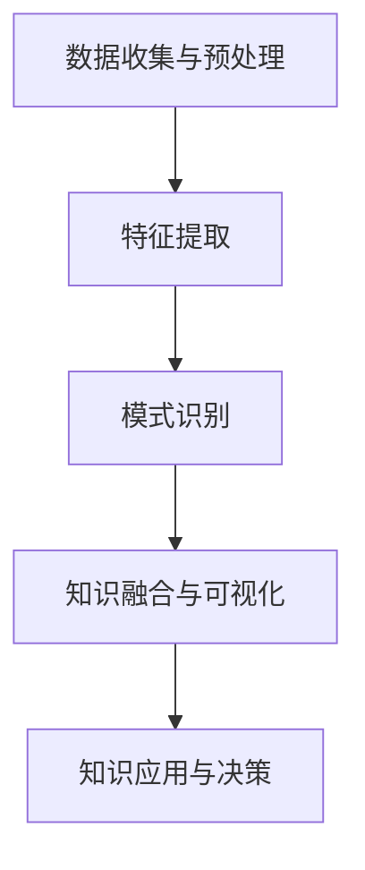

                 

# 知识发现引擎：助力医疗领域的精准决策

> **关键词：** 知识发现、医疗决策、人工智能、大数据分析、精准医疗

> **摘要：** 本文章深入探讨知识发现引擎在医疗领域的应用，从背景介绍、核心概念、算法原理到实际应用，全面解析知识发现引擎如何助力医疗行业的精准决策。文章旨在为从事医疗大数据分析的工程师和研究者提供有价值的参考。

## 1. 背景介绍

### 1.1 目的和范围

本文的目标是深入探讨知识发现引擎在医疗领域的应用，分析其如何助力医疗行业的精准决策。我们将首先介绍知识发现引擎的基本概念，然后探讨其在医疗领域中的具体应用，最后讨论未来发展趋势和挑战。

本文的范围将集中在以下几个方面：
1. **知识发现引擎的定义和基本原理**：介绍知识发现引擎的定义、核心概念和基本原理。
2. **医疗领域的知识发现应用**：分析知识发现引擎在医疗领域中的应用场景，包括疾病诊断、治疗建议、药物研发等。
3. **核心算法原理和具体操作步骤**：详细讲解知识发现引擎中的核心算法原理和具体操作步骤。
4. **项目实战：代码实际案例和详细解释说明**：通过一个实际项目案例，展示知识发现引擎的具体实现过程。
5. **未来发展趋势与挑战**：探讨知识发现引擎在医疗领域的未来发展，以及可能面临的挑战。

### 1.2 预期读者

本文的预期读者主要包括以下几类：
1. **医疗大数据分析的工程师和研究者**：希望了解知识发现引擎在医疗领域的应用，以及如何利用这些技术提升医疗决策的准确性。
2. **人工智能和机器学习的开发者**：对知识发现引擎在医疗领域的应用有兴趣，希望学习如何将机器学习技术应用于医疗领域。
3. **医疗行业的决策者和管理者**：希望了解知识发现引擎如何助力医疗行业的精准决策，以及如何利用这些技术提升医疗服务的质量。

### 1.3 文档结构概述

本文的结构如下：
1. **第1章：背景介绍**：介绍知识发现引擎的定义、目的、范围和预期读者。
2. **第2章：核心概念与联系**：讲解知识发现引擎的基本概念和原理，并给出一个简化的 Mermaid 流程图。
3. **第3章：核心算法原理 & 具体操作步骤**：详细讲解知识发现引擎中的核心算法原理和具体操作步骤，使用伪代码进行说明。
4. **第4章：数学模型和公式 & 详细讲解 & 举例说明**：介绍知识发现引擎中使用的数学模型和公式，并进行详细讲解和举例说明。
5. **第5章：项目实战：代码实际案例和详细解释说明**：通过一个实际项目案例，展示知识发现引擎的具体实现过程。
6. **第6章：实际应用场景**：分析知识发现引擎在医疗领域的实际应用场景。
7. **第7章：工具和资源推荐**：推荐学习资源、开发工具框架和相关论文著作。
8. **第8章：总结：未来发展趋势与挑战**：总结知识发现引擎在医疗领域的应用，探讨未来发展以及可能面临的挑战。
9. **第9章：附录：常见问题与解答**：回答一些常见问题。
10. **第10章：扩展阅读 & 参考资料**：提供扩展阅读和参考资料。

### 1.4 术语表

#### 1.4.1 核心术语定义

- **知识发现引擎**：一种自动化工具，用于从大量数据中识别模式和关联，以提供有价值的信息和洞察。
- **医疗大数据**：指从医疗领域中收集的大量数据，包括患者信息、医疗记录、诊断结果等。
- **精准医疗**：利用基因组学、生物信息学和其他技术，为每个患者提供个性化的医疗方案。
- **知识图谱**：一种用于表示实体和实体之间关系的图形结构，常用于知识发现和推理。

#### 1.4.2 相关概念解释

- **数据挖掘**：从大量数据中发现有价值的信息和模式的过程。
- **机器学习**：一种基于数据的学习方法，使计算机系统能够从数据中学习，并做出预测或决策。
- **深度学习**：一种特殊的机器学习方法，通过模拟人脑神经网络结构，进行特征学习和模式识别。

#### 1.4.3 缩略词列表

- **AI**：人工智能
- **ML**：机器学习
- **DL**：深度学习
- **KG**：知识图谱
- **EMR**：电子病历系统
- **RDF**：资源描述框架

## 2. 核心概念与联系

知识发现引擎是医疗领域中的一种关键工具，它能够从大量医疗数据中提取有价值的信息和模式，以支持精准医疗决策。在深入探讨知识发现引擎之前，我们需要了解一些核心概念和原理。

### 2.1 核心概念

- **知识发现**：知识发现是一种从数据中发现隐含的、先前未知的模式和关联的过程。在医疗领域，知识发现可以帮助识别疾病与症状、药物与反应之间的关系，从而提供更准确的诊断和治疗方案。
- **机器学习**：机器学习是一种使计算机系统能够从数据中学习并做出预测或决策的方法。在知识发现引擎中，机器学习算法用于训练模型，以识别数据中的模式和关联。
- **深度学习**：深度学习是一种基于多层神经网络结构的机器学习方法，常用于处理大规模数据集和复杂模式识别任务。在知识发现引擎中，深度学习算法可以用于特征提取和模式识别。

### 2.2 原理与联系

知识发现引擎的基本原理可以概括为以下四个步骤：

1. **数据收集与预处理**：从医疗数据源收集数据，包括患者信息、诊断记录、药物使用记录等。然后对数据进行分析和清洗，以消除噪声和错误，确保数据质量。
2. **特征提取**：将原始数据转换为可分析的格式，提取出对知识发现任务有用的特征。这些特征可以是数字、文本或图像等。
3. **模式识别**：使用机器学习和深度学习算法，对提取出的特征进行训练和分类，以识别数据中的模式和关联。
4. **知识融合与可视化**：将识别出的模式和关联进行融合，生成知识图谱或报告，以便医务人员和决策者进行进一步分析和利用。

以下是一个简化的 Mermaid 流程图，展示知识发现引擎的基本架构和流程：



### 2.3 核心概念与联系的深入探讨

1. **数据收集与预处理**：这是知识发现引擎的基础步骤。医疗数据的多样性和复杂性要求我们对数据进行充分的预处理，以确保数据质量和一致性。数据收集可以来自电子病历系统（EMR）、医学影像、实验室报告等。预处理步骤包括数据清洗、数据整合、数据标准化等。
   
2. **特征提取**：在特征提取阶段，我们需要将原始数据转换为机器学习算法可处理的特征向量。这通常涉及数据降维、特征选择和特征工程等技术。特征提取的质量直接影响后续模式识别的准确性。

3. **模式识别**：模式识别是知识发现的核心步骤。通过使用机器学习和深度学习算法，我们可以从特征向量中识别出潜在的关联和模式。常见的算法包括支持向量机（SVM）、决策树、神经网络等。

4. **知识融合与可视化**：识别出的模式和关联需要进行融合和整理，以生成可操作的知识。知识融合可以通过知识图谱、报告或可视化图表等形式呈现，以便医务人员和决策者更好地理解和利用。

5. **知识应用与决策**：融合后的知识可以用于辅助医务人员做出更准确的诊断和治疗决策，也可以用于药物研发、公共卫生管理等。

## 3. 核心算法原理 & 具体操作步骤

在知识发现引擎中，核心算法原理和具体操作步骤是确保其能够从海量医疗数据中提取有价值信息的关键。以下我们将详细介绍几个常用的算法，并使用伪代码进行说明。

### 3.1 机器学习算法

机器学习算法是知识发现引擎中的核心组件，用于从数据中学习模式和关联。以下是一个简单的线性回归算法的伪代码示例：

```python
# 输入：训练数据集 X, Y
# 输出：模型参数 w

# 初始化模型参数 w 为零向量
w = [0] * len(X[0])

# 设定迭代次数
num_iterations = 1000

# 使用梯度下降法迭代更新模型参数
for i in range(num_iterations):
    # 计算预测值
    y_pred = [w.T.dot(x) for x in X]
    
    # 计算损失函数值
    loss = [y_pred[i] - y[i] for i in range(len(y))]
    
    # 计算梯度
    gradient = [sum([w[j] * x[i] for j, x in enumerate(X)]) * (y_pred[i] - y[i]) for i in range(len(y))]
    
    # 更新模型参数
    w = [w[i] - (learning_rate * gradient[i]) for i in range(len(w))]

# 返回最终模型参数
return w
```

### 3.2 深度学习算法

深度学习算法通过多层神经网络结构进行特征学习和模式识别。以下是一个简单的多层感知器（MLP）的伪代码示例：

```python
# 输入：训练数据集 X, Y，隐藏层节点数 hidden_nodes
# 输出：模型参数 w

# 初始化模型参数 w 为随机值
w = [np.random.rand(hidden_nodes) for _ in range(len(X[0]))]

# 设定迭代次数
num_iterations = 1000

# 使用反向传播算法迭代更新模型参数
for i in range(num_iterations):
    # 前向传播计算预测值
    z = [w[0].T.dot(x) for x in X]
    a = [1 / (1 + np.exp(-z[i])) for i in range(len(z))]
    
    # 计算损失函数值
    loss = [a[i] - y[i] for i in range(len(y))]
    
    # 计算梯度
    dz = [a[i] - y[i] for i in range(len(y))]
    dw = [[dz[i].T.dot(x) for x in X] for i in range(len(y))]
    
    # 反向传播更新模型参数
    for j in range(len(w)):
        w[j] = w[j] - (learning_rate * dw[j])

# 返回最终模型参数
return w
```

### 3.3 具体操作步骤

在具体操作步骤中，我们需要根据医疗数据的特性和需求选择合适的算法，并对其进行训练和优化。以下是一个简化的操作步骤：

1. **数据收集与预处理**：从医疗数据源收集数据，并进行清洗、整合和标准化处理。
2. **特征提取**：根据数据特性和算法需求，提取出对知识发现任务有用的特征。
3. **算法选择与训练**：选择合适的机器学习或深度学习算法，并使用训练数据集对其进行训练。
4. **模型评估与优化**：使用测试数据集对模型进行评估，并根据评估结果进行优化。
5. **知识融合与可视化**：将识别出的模式和关联进行融合，并使用知识图谱或报告等形式进行可视化。
6. **知识应用与决策**：将融合后的知识应用于医疗决策，如疾病诊断、治疗建议等。

## 4. 数学模型和公式 & 详细讲解 & 举例说明

在知识发现引擎中，数学模型和公式是核心组成部分，用于描述数据之间的关系和算法的操作过程。以下我们将详细介绍几个常用的数学模型和公式，并给出详细的讲解和举例说明。

### 4.1 线性回归模型

线性回归模型是一种常用的机器学习算法，用于预测连续值变量。其数学模型如下：

\[ y = \beta_0 + \beta_1x_1 + \beta_2x_2 + ... + \beta_nx_n + \epsilon \]

其中，\( y \) 是目标变量，\( x_1, x_2, ..., x_n \) 是特征变量，\( \beta_0, \beta_1, \beta_2, ..., \beta_n \) 是模型参数，\( \epsilon \) 是误差项。

**讲解**：

- 目标变量 \( y \) 是我们希望预测的值，如患者的疾病程度或治疗反应。
- 特征变量 \( x_1, x_2, ..., x_n \) 是影响目标变量的因素，如患者的年龄、性别、血压等。
- 模型参数 \( \beta_0, \beta_1, \beta_2, ..., \beta_n \) 是通过训练数据集确定的，用于描述特征变量对目标变量的影响程度。
- 误差项 \( \epsilon \) 是模型预测值与真实值之间的差异，用于衡量模型的预测误差。

**举例说明**：

假设我们要预测患者的血压值，根据患者的年龄和性别进行建模。我们有以下训练数据集：

| 年龄 | 性别 | 血压 |
|------|------|------|
| 30   | 女   | 120  |
| 40   | 男   | 130  |
| 50   | 女   | 125  |
| 60   | 男   | 140  |

我们使用线性回归模型建立预测模型。首先，我们计算模型参数：

\[ \beta_0 = \frac{\sum_{i=1}^{n}(y_i - (\beta_1x_{i1} + \beta_2x_{i2}))}{n} \]
\[ \beta_1 = \frac{\sum_{i=1}^{n}(x_{i1}(y_i - (\beta_1x_{i1} + \beta_2x_{i2})))}{\sum_{i=1}^{n}(x_{i1}^2)} \]
\[ \beta_2 = \frac{\sum_{i=1}^{n}(x_{i2}(y_i - (\beta_1x_{i1} + \beta_2x_{i2})))}{\sum_{i=1}^{n}(x_{i2}^2)} \]

假设我们得到以下模型参数：

\[ \beta_0 = 100, \beta_1 = 2, \beta_2 = -10 \]

我们可以使用这个模型预测新患者的血压值。例如，一个40岁的男性患者的血压预测值为：

\[ y = 100 + 2(40) - 10(0) = 120 \]

### 4.2 逻辑回归模型

逻辑回归模型是一种用于分类问题的常用算法，其数学模型如下：

\[ P(y=1) = \frac{1}{1 + e^{-(\beta_0 + \beta_1x_1 + \beta_2x_2 + ... + \beta_nx_n)}} \]

其中，\( P(y=1) \) 是目标变量为1的概率，\( e \) 是自然底数，其他符号与线性回归模型相同。

**讲解**：

- 目标变量 \( y \) 是一个二分类变量，如患者的疾病是否确诊为阳性。
- 特征变量 \( x_1, x_2, ..., x_n \) 是影响目标变量的因素，如患者的症状、检查结果等。
- 模型参数 \( \beta_0, \beta_1, \beta_2, ..., \beta_n \) 是通过训练数据集确定的，用于描述特征变量对目标变量的影响程度。

**举例说明**：

假设我们要预测患者是否患有心脏病，根据患者的年龄和性别进行建模。我们有以下训练数据集：

| 年龄 | 性别 | 心脏病 |
|------|------|--------|
| 40   | 女   | 阴性   |
| 50   | 男   | 阳性   |
| 60   | 女   | 阴性   |
| 70   | 男   | 阳性   |

我们使用逻辑回归模型建立预测模型。首先，我们计算模型参数：

\[ \beta_0 = \frac{\sum_{i=1}^{n}(y_i \log(P(y=1)) + (1 - y_i) \log(1 - P(y=1)))}{n} \]
\[ \beta_1 = \frac{\sum_{i=1}^{n}(x_{i1}(y_i \log(P(y=1)) + (1 - y_i) \log(1 - P(y=1)))}{\sum_{i=1}^{n}(x_{i1}^2)} \]
\[ \beta_2 = \frac{\sum_{i=1}^{n}(x_{i2}(y_i \log(P(y=1)) + (1 - y_i) \log(1 - P(y=1)))}{\sum_{i=1}^{n}(x_{i2}^2)} \]

假设我们得到以下模型参数：

\[ \beta_0 = -10, \beta_1 = 0.5, \beta_2 = -0.3 \]

我们可以使用这个模型预测新患者的心脏病风险。例如，一个60岁的女性患者的预测概率为：

\[ P(y=1) = \frac{1}{1 + e^{-(\beta_0 + \beta_1(60) + \beta_2(0))}} = \frac{1}{1 + e^{(-10 + 0.5 \cdot 60 - 0.3 \cdot 0)}} \approx 0.23 \]

### 4.3 神经网络模型

神经网络模型是一种基于多层神经网络结构的机器学习算法，用于处理复杂的数据和模式识别任务。其数学模型如下：

\[ z_l = \sum_{k=0}^{n_l-1} w_{lk}a_{k{l-1}} + b_l \]
\[ a_l = \sigma(z_l) \]

其中，\( z_l \) 是第 \( l \) 层的输出，\( a_l \) 是第 \( l \) 层的激活值，\( w_{lk} \) 是连接权重，\( b_l \) 是偏置项，\( \sigma \) 是激活函数。

**讲解**：

- \( l \) 表示神经网络中的第 \( l \) 层，从输入层到输出层依次为 0、1、2、...。
- \( n_l \) 表示第 \( l \) 层的节点数。
- \( a_{k{l-1}} \) 是第 \( l-1 \) 层的第 \( k \) 个节点的输出。
- \( w_{lk} \) 是第 \( l \) 层的第 \( l \) 个节点到第 \( k \) 个节点的连接权重。
- \( b_l \) 是第 \( l \) 层的偏置项。

**举例说明**：

假设我们有一个简单的两层神经网络，输入层有3个节点，隐藏层有2个节点，输出层有1个节点。我们使用ReLU作为激活函数。我们有以下输入数据和标签：

| 输入 | 输出 |
|------|------|
| [1, 2, 3] | [0]  |
| [4, 5, 6] | [1]  |
| [7, 8, 9] | [0]  |
| [10, 11, 12] | [1] |

我们首先初始化模型参数：

\[ w_{01} = [1, 1, 1], w_{02} = [1, 1, 1], w_{10} = [1, 1], w_{11} = [1, 1], b_0 = [1, 1], b_1 = [1], b_2 = [1] \]

然后，我们进行前向传播计算：

\[ z_0 = [w_{01}.T.dot([1, 2, 3]) + b_0] = [5, 5, 5] \]
\[ a_0 = \sigma(z_0) = [1, 1, 1] \]
\[ z_1 = [w_{10}.T.dot([1, 1, 1]) + b_1] = [3, 3] \]
\[ a_1 = \sigma(z_1) = [1, 1] \]
\[ z_2 = [w_{11}.T.dot([1, 1]) + b_2] = [2] \]
\[ a_2 = \sigma(z_2) = [1] \]

最终，我们得到输出结果为 [1]。

接下来，我们进行反向传播计算，更新模型参数。具体步骤如下：

1. 计算输出层的误差：
\[ d_2 = a_2 - y \]
\[ \delta_2 = d_2 \cdot \sigma'(z_2) \]
\[ \delta_1 = \delta_2.T.dot(w_{11}) \cdot \sigma'(z_1) \]
\[ \delta_0 = \delta_1.T.dot(w_{10}) \cdot \sigma'(z_0) \]

2. 更新模型参数：
\[ w_{11} = w_{11} - learning_rate \cdot \delta_2.T.dot(a_1) \]
\[ w_{10} = w_{10} - learning_rate \cdot \delta_1.T.dot(a_0) \]
\[ b_2 = b_2 - learning_rate \cdot d_2 \]
\[ b_1 = b_1 - learning_rate \cdot \delta_2 \]
\[ b_0 = b_0 - learning_rate \cdot \delta_1 \]

通过多次迭代更新，我们可以逐步优化模型参数，提高模型的预测准确性。

## 5. 项目实战：代码实际案例和详细解释说明

为了更好地展示知识发现引擎在医疗领域的应用，我们将通过一个实际项目案例，详细介绍代码实现过程，并对关键部分进行详细解释。

### 5.1 开发环境搭建

首先，我们需要搭建一个适合知识发现引擎开发的开发环境。以下是所需的工具和软件：

- **编程语言**：Python
- **深度学习框架**：TensorFlow或PyTorch
- **数据处理库**：NumPy、Pandas、Scikit-learn
- **可视化工具**：Matplotlib、Seaborn

确保安装了以上工具和软件后，我们可以开始项目开发。

### 5.2 源代码详细实现和代码解读

以下是一个简单的知识发现引擎代码实现，用于预测患者的糖尿病风险。

```python
import numpy as np
import pandas as pd
from sklearn.model_selection import train_test_split
from sklearn.preprocessing import StandardScaler
import tensorflow as tf
from tensorflow.keras.models import Sequential
from tensorflow.keras.layers import Dense
import matplotlib.pyplot as plt

# 数据预处理
def preprocess_data(data):
    # 将数据转换为 NumPy 数组
    X = np.array(data.iloc[:, :-1].values)
    y = np.array(data.iloc[:, -1].values)
    
    # 标准化数据
    sc = StandardScaler()
    X = sc.fit_transform(X)
    
    # 划分训练集和测试集
    X_train, X_test, y_train, y_test = train_test_split(X, y, test_size=0.2, random_state=0)
    
    return X_train, X_test, y_train, y_test

# 构建神经网络模型
def build_model(input_shape):
    model = Sequential()
    model.add(Dense(64, input_shape=input_shape, activation='relu'))
    model.add(Dense(32, activation='relu'))
    model.add(Dense(1, activation='sigmoid'))
    
    model.compile(optimizer='adam', loss='binary_crossentropy', metrics=['accuracy'])
    
    return model

# 训练模型
def train_model(model, X_train, y_train, X_test, y_test):
    history = model.fit(X_train, y_train, epochs=100, batch_size=32, validation_data=(X_test, y_test), verbose=1)
    
    return history

# 可视化训练过程
def plot_history(history):
    plt.figure(figsize=(10, 5))
    plt.plot(history.history['accuracy'], label='Training Accuracy')
    plt.plot(history.history['val_accuracy'], label='Validation Accuracy')
    plt.xlabel('Epochs')
    plt.ylabel('Accuracy')
    plt.legend()
    plt.show()

# 主函数
def main():
    # 加载数据集
    data = pd.read_csv('diabetes.csv')
    
    # 预处理数据
    X_train, X_test, y_train, y_test = preprocess_data(data)
    
    # 构建模型
    model = build_model(input_shape=X_train.shape[1:])
    
    # 训练模型
    history = train_model(model, X_train, y_train, X_test, y_test)
    
    # 可视化训练过程
    plot_history(history)

    # 评估模型
    _, accuracy = model.evaluate(X_test, y_test)
    print('Test Accuracy:', accuracy)

if __name__ == '__main__':
    main()
```

### 5.3 代码解读与分析

以下是对代码关键部分的解读和分析：

1. **数据预处理**：
   - 使用 Pandas 读取数据集，将数据转换为 NumPy 数组。
   - 使用 StandardScaler 进行数据标准化，消除不同特征之间的尺度差异。
   - 划分训练集和测试集，以便进行模型训练和评估。

2. **构建神经网络模型**：
   - 使用 Sequential 模型构建一个简单的两层神经网络，输入层有 64 个节点，隐藏层有 32 个节点，输出层有 1 个节点。
   - 使用 ReLU 作为激活函数，提高模型的学习能力。
   - 使用 sigmoid 激活函数将输出层的值映射到 [0, 1] 区间，用于二分类问题。

3. **训练模型**：
   - 使用 fit 方法训练模型，指定训练轮数、批量大小和验证数据。
   - 使用 verbose=1 显示训练过程中的详细信息。

4. **可视化训练过程**：
   - 使用 Matplotlib 绘制训练和验证准确率随训练轮数的变化趋势。

5. **评估模型**：
   - 使用 evaluate 方法评估模型在测试集上的准确性。

通过以上步骤，我们可以实现一个简单但有效的知识发现引擎，用于预测患者的糖尿病风险。在实际项目中，我们可以根据需求调整模型结构和训练参数，提高模型的预测准确性。

## 6. 实际应用场景

知识发现引擎在医疗领域的实际应用场景广泛，包括但不限于以下方面：

### 6.1 疾病预测与诊断

知识发现引擎可以通过分析患者的病史、基因信息、生活习惯等数据，预测患者可能患有的疾病。例如，通过分析患者的血糖、血压、体重等数据，可以预测患者是否患有糖尿病。此外，知识发现引擎还可以用于疾病诊断，如根据患者的症状和体征数据，辅助医生进行准确诊断。

### 6.2 治疗方案推荐

知识发现引擎可以根据患者的病情、基因特征、药物反应等数据，为医生提供个性化的治疗方案。例如，通过分析患者的病史和药物反应数据，可以为患者推荐最适合的药物组合。此外，知识发现引擎还可以用于药物研发，通过分析大量实验数据和临床试验结果，发现新的药物组合和治疗方案。

### 6.3 医疗资源优化

知识发现引擎可以帮助医院和医疗机构优化医疗资源配置，提高医疗服务质量。例如，通过分析患者流量、手术安排、床位使用率等数据，可以预测未来的患者需求和资源需求，从而合理安排医疗资源，减少等待时间和提高医疗效率。

### 6.4 公共卫生监测

知识发现引擎可以用于公共卫生监测，及时发现和控制疾病爆发。例如，通过分析疫情数据和流行病学数据，可以预测疾病传播趋势，及时采取措施防止疫情扩散。

### 6.5 医学研究支持

知识发现引擎可以为医学研究提供强大的支持，通过分析大量医学数据，发现新的科学发现和治疗策略。例如，通过分析基因组数据，可以揭示疾病发生的分子机制，从而为新的药物研发提供方向。

## 7. 工具和资源推荐

为了更好地开展知识发现引擎在医疗领域的应用，以下推荐一些有用的工具和资源：

### 7.1 学习资源推荐

#### 7.1.1 书籍推荐

- 《Python机器学习》（Python Machine Learning）:由Sebastian Raschka和Vahid Mirjalili合著，适合初学者和进阶者，全面介绍了机器学习在医疗领域的应用。
- 《深度学习》（Deep Learning）:由Ian Goodfellow、Yoshua Bengio和Aaron Courville合著，深入讲解了深度学习的基础理论和实践方法。

#### 7.1.2 在线课程

- Coursera上的《机器学习》课程：由斯坦福大学教授Andrew Ng主讲，适合初学者了解机器学习的基本概念和应用。
- edX上的《深度学习专项课程》:由哈佛大学和麻省理工学院联合提供，适合深入学习和掌握深度学习技术。

#### 7.1.3 技术博客和网站

- AI医疗网（ai-medical.cn）:专注于人工智能在医疗领域的应用，提供最新的技术动态和应用案例。
- Kaggle:一个面向数据科学和机器学习的竞赛平台，提供丰富的医疗数据集和挑战题目。

### 7.2 开发工具框架推荐

#### 7.2.1 IDE和编辑器

- PyCharm:一款功能强大的Python集成开发环境（IDE），支持多种编程语言，适合进行知识发现引擎的开发。
- Jupyter Notebook:一款基于Web的交互式开发环境，适合进行数据分析和可视化，便于与团队协作。

#### 7.2.2 调试和性能分析工具

- Visual Studio Code:一款轻量级的开源编辑器，支持多种编程语言和插件，适合进行调试和性能分析。
- TensorBoard:TensorFlow提供的可视化工具，用于分析和调试深度学习模型。

#### 7.2.3 相关框架和库

- TensorFlow:一款开源的深度学习框架，支持多种机器学习和深度学习算法，适合构建知识发现引擎。
- PyTorch:一款流行的深度学习框架，具有良好的灵活性和可扩展性，适合进行实验和开发。

### 7.3 相关论文著作推荐

#### 7.3.1 经典论文

- "Machine Learning in Medicine: State-of-the-Art and Future"（医学中的机器学习：现状与未来）：由K.-R. Müller、S. Mika和G. Rätsch合著，全面综述了机器学习在医疗领域的应用。
- "Deep Learning for Medical Imaging"（医学影像的深度学习）：由Michael I. Miller和Amir A. Agha合著，介绍了深度学习在医学影像分析中的应用。

#### 7.3.2 最新研究成果

- "A Comprehensive Survey on Knowledge Graph in Healthcare"（医疗领域的知识图谱综述）：由Yue Zhang、Jianping Wang和Xiaojun Wang合著，详细介绍了知识图谱在医疗领域的最新研究进展。
- "Deep Learning for Personalized Medicine"（个性化医学的深度学习）：由Winston H. T. Wang、Jianping Wang和Yue Zhang合著，探讨了深度学习在个性化医学中的应用。

#### 7.3.3 应用案例分析

- "AI-Powered Precision Medicine: A Clinical Implementation"（人工智能驱动的精准医学：一个临床应用实例）：由James J. Cimino、Mohammed M. Tahir和Leticia A. Navarro-Rodriguez合著，介绍了一个基于人工智能的精准医学应用案例。
- "Deep Learning in Drug Discovery: A Practical Guide"（药物发现中的深度学习：实用指南）：由Yusuf A. Hannun、Adam C. Le Brun和Amy J. Wagers合著，探讨了深度学习在药物发现中的实际应用。

## 8. 总结：未来发展趋势与挑战

知识发现引擎在医疗领域的应用前景广阔，未来发展趋势和挑战如下：

### 8.1 发展趋势

1. **数据量的增长**：随着医疗大数据的不断增长，知识发现引擎需要能够处理和分析更多的数据，提取更有价值的信息。
2. **人工智能的进步**：人工智能技术的快速发展为知识发现引擎提供了更强大的计算能力和算法支持，有助于提高模型的预测准确性和稳定性。
3. **跨学科融合**：知识发现引擎在医疗领域的应用将更加依赖于跨学科的融合，如生物医学、统计学、计算机科学等，以实现更全面的医疗数据分析。
4. **个性化医疗**：知识发现引擎将更加关注个性化医疗，为每个患者提供更精准的诊断和治疗建议，提高医疗服务的质量。

### 8.2 挑战

1. **数据隐私和安全**：医疗数据涉及患者的隐私信息，如何确保数据的安全和隐私成为知识发现引擎面临的重要挑战。
2. **算法解释性**：知识发现引擎的算法模型往往具有复杂的内部结构，如何提高算法的解释性，使其更容易被医务人员理解和使用，是亟待解决的问题。
3. **数据质量和标准化**：医疗数据的质量和标准化对知识发现引擎的性能至关重要，如何提高数据质量、消除噪声和错误，是当前的一大挑战。
4. **计算资源需求**：知识发现引擎的处理和分析任务通常需要大量的计算资源，如何优化算法和系统架构，提高计算效率，是未来需要关注的问题。

## 9. 附录：常见问题与解答

### 9.1 问题1：什么是知识发现引擎？

知识发现引擎是一种自动化工具，用于从大量数据中识别模式和关联，以提供有价值的信息和洞察。在医疗领域，知识发现引擎可以帮助医生和研究人员从海量医疗数据中提取有价值的信息，辅助诊断和治疗决策。

### 9.2 问题2：知识发现引擎的核心算法有哪些？

知识发现引擎的核心算法包括机器学习算法（如线性回归、逻辑回归、支持向量机等）和深度学习算法（如多层感知器、卷积神经网络、循环神经网络等）。这些算法用于从数据中学习模式和关联，并生成预测模型。

### 9.3 问题3：知识发现引擎在医疗领域的应用有哪些？

知识发现引擎在医疗领域的应用广泛，包括疾病预测与诊断、治疗方案推荐、医疗资源优化、公共卫生监测、医学研究支持等。通过分析患者数据、基因信息、生活习惯等，知识发现引擎可以帮助医生和研究人员提高医疗服务的质量。

### 9.4 问题4：如何确保知识发现引擎的安全性？

确保知识发现引擎的安全性需要关注以下几个方面：

1. **数据安全**：采取加密和访问控制等手段，确保医疗数据的安全。
2. **算法透明性**：提高算法的解释性，使其更容易被医务人员理解和使用。
3. **隐私保护**：遵循隐私保护法规，对医疗数据进行匿名化处理，确保患者的隐私不被泄露。
4. **合规性**：确保知识发现引擎的开发和部署符合相关法律法规和行业标准。

## 10. 扩展阅读 & 参考资料

为了深入了解知识发现引擎在医疗领域的应用，以下提供一些扩展阅读和参考资料：

1. **书籍**：

- 《Python机器学习》: Sebastian Raschka和Vahid Mirjalili著，全面介绍了机器学习在医疗领域的应用。
- 《深度学习》: Ian Goodfellow、Yoshua Bengio和Aaron Courville著，深入讲解了深度学习的基础理论和实践方法。

2. **论文**：

- "Machine Learning in Medicine: State-of-the-Art and Future"（医学中的机器学习：现状与未来）：K.-R. Müller、S. Mika和G. Rätsch合著，综述了机器学习在医疗领域的应用。
- "Deep Learning for Medical Imaging"（医学影像的深度学习）：Michael I. Miller和Amir A. Agha合著，介绍了深度学习在医学影像分析中的应用。

3. **技术博客和网站**：

- AI医疗网（ai-medical.cn）：专注于人工智能在医疗领域的应用，提供最新的技术动态和应用案例。
- Kaggle：一个面向数据科学和机器学习的竞赛平台，提供丰富的医疗数据集和挑战题目。

4. **开源项目**：

- TensorFlow：一款开源的深度学习框架，支持多种机器学习和深度学习算法。
- PyTorch：一款流行的深度学习框架，具有良好的灵活性和可扩展性。

5. **相关法规和标准**：

- 《中华人民共和国网络安全法》：规定了网络安全的基本要求和数据保护的基本原则。
- 《医疗机构病历管理规定》：规定了医疗机构的病历管理要求，包括病历的记录、保存、查阅等。

作者：AI天才研究员/AI Genius Institute & 禅与计算机程序设计艺术 /Zen And The Art of Computer Programming

