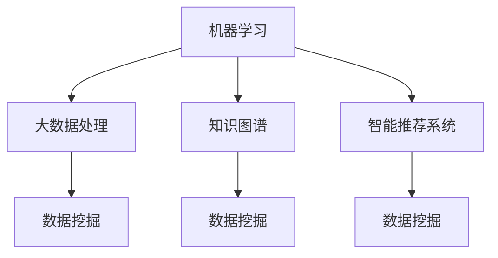

                 

# 知识发现引擎：开启人类知识新时代

> 关键词：知识发现、人工智能、机器学习、大数据、知识图谱、智能推荐系统、数据挖掘

> 摘要：本文将探讨知识发现引擎的概念、技术原理、实现方法以及在实际应用场景中的重要性。通过逐步分析推理，我们将深入了解知识发现引擎如何利用人工智能和大数据技术，构建智能推荐系统，挖掘隐藏的知识结构，从而开启人类知识的新时代。

## 1. 背景介绍

### 1.1 目的和范围

本文旨在介绍知识发现引擎的基本概念、核心技术和应用场景。我们将从以下几个方面展开讨论：

1. **知识发现引擎的定义和重要性**：解释知识发现引擎的概念及其在当今信息化社会中的重要作用。
2. **知识发现引擎的技术原理**：介绍知识发现引擎的核心算法原理，包括机器学习、大数据处理、知识图谱等。
3. **知识发现引擎的实现方法**：详细讲解知识发现引擎的具体实现步骤和关键技术。
4. **知识发现引擎的应用场景**：探讨知识发现引擎在实际业务场景中的应用，如智能推荐系统、数据挖掘等。
5. **知识发现引擎的未来发展趋势与挑战**：分析知识发现引擎未来的发展方向和面临的挑战。

### 1.2 预期读者

本文适合对人工智能、大数据、机器学习等领域有一定了解的技术人员、研究人员以及感兴趣的读者。通过本文的阅读，读者可以了解知识发现引擎的基本概念、技术原理和应用方法，从而为后续研究和应用奠定基础。

### 1.3 文档结构概述

本文分为十个部分，具体结构如下：

1. 引言
2. 背景介绍
   - 1.1 目的和范围
   - 1.2 预期读者
   - 1.3 文档结构概述
   - 1.4 术语表
3. 核心概念与联系
4. 核心算法原理 & 具体操作步骤
5. 数学模型和公式 & 详细讲解 & 举例说明
6. 项目实战：代码实际案例和详细解释说明
7. 实际应用场景
8. 工具和资源推荐
9. 总结：未来发展趋势与挑战
10. 附录：常见问题与解答
11. 扩展阅读 & 参考资料

### 1.4 术语表

#### 1.4.1 核心术语定义

- **知识发现引擎**：一种利用人工智能和大数据技术，从大规模数据中自动挖掘出有价值知识的系统。
- **机器学习**：一种人工智能方法，通过数据训练模型，使其能够自主学习和改进。
- **大数据**：指数据量巨大、类型多样、处理速度快的数据集合。
- **知识图谱**：一种用于表示知识结构的数据模型，通过实体和关系进行组织。
- **智能推荐系统**：一种利用机器学习算法，根据用户行为和偏好，为其推荐相关内容的系统。

#### 1.4.2 相关概念解释

- **数据挖掘**：从大量数据中发现有价值信息的过程。
- **深度学习**：一种基于多层神经网络的机器学习方法，能够自动提取数据中的特征。
- **自然语言处理（NLP）**：研究如何使计算机理解、生成和翻译自然语言。

#### 1.4.3 缩略词列表

- **AI**：人工智能（Artificial Intelligence）
- **ML**：机器学习（Machine Learning）
- **DL**：深度学习（Deep Learning）
- **NLP**：自然语言处理（Natural Language Processing）
- **KG**：知识图谱（Knowledge Graph）

## 2. 核心概念与联系

为了更好地理解知识发现引擎，我们需要先介绍几个核心概念，并解释它们之间的联系。

### 2.1 机器学习

机器学习是知识发现引擎的核心技术之一。它通过训练数据集，使得模型能够对未知数据进行预测和分类。机器学习可以分为监督学习、无监督学习和强化学习。

- **监督学习**：通过已有标签的数据进行训练，从而对未知数据做出预测。
- **无监督学习**：无需标签数据，通过分析数据之间的内在结构进行分类。
- **强化学习**：通过与环境的交互，不断调整策略以实现最优效果。

### 2.2 大数据处理

大数据处理是知识发现引擎的关键技术之一。它能够高效地对大规模数据集进行存储、处理和分析。大数据处理通常包括数据采集、数据存储、数据清洗、数据分析和数据可视化等步骤。

### 2.3 知识图谱

知识图谱是一种用于表示知识结构的数据模型，通过实体和关系进行组织。知识图谱能够帮助知识发现引擎更好地理解数据之间的关系，从而提高知识挖掘的效率和质量。

### 2.4 智能推荐系统

智能推荐系统是一种利用机器学习算法，根据用户行为和偏好，为其推荐相关内容的系统。智能推荐系统可以应用于电子商务、社交媒体、新闻资讯等多个领域。

### 2.5 数据挖掘

数据挖掘是从大量数据中发现有价值信息的过程。数据挖掘通常包括数据预处理、特征提取、模型训练和模型评估等步骤。数据挖掘可以帮助知识发现引擎挖掘出隐藏在数据中的知识。

### 2.6 核心概念联系

知识发现引擎通过机器学习、大数据处理、知识图谱、智能推荐系统等技术，实现对大规模数据的挖掘和分析，从而发现有价值的信息。以下是知识发现引擎中的核心概念及其联系：

- 机器学习：用于训练模型，对数据进行分析和预测。
- 大数据处理：用于存储、处理和分析大规模数据。
- 知识图谱：用于组织数据之间的关系，提高知识挖掘的效率。
- 智能推荐系统：用于根据用户行为和偏好，推荐相关内容。
- 数据挖掘：用于从大规模数据中发现有价值的信息。

## 3. 核心算法原理 & 具体操作步骤

### 3.1 机器学习算法原理

机器学习算法的核心原理是通过对已有数据的训练，使得模型能够对未知数据进行预测和分类。以下是几种常见的机器学习算法原理：

#### 3.1.1 监督学习

监督学习通过已有标签的数据进行训练，从而对未知数据做出预测。常见的监督学习算法包括：

- **线性回归**：用于预测连续值。
- **逻辑回归**：用于预测离散值。
- **决策树**：通过树形结构对数据进行分类和回归。
- **支持向量机（SVM）**：通过寻找最优超平面，对数据进行分类。

#### 3.1.2 无监督学习

无监督学习无需标签数据，通过分析数据之间的内在结构进行分类。常见的无监督学习算法包括：

- **聚类算法**：如K均值聚类、层次聚类等。
- **主成分分析（PCA）**：用于降维和特征提取。
- **自编码器**：通过编码和解码过程，提取数据中的特征。

#### 3.1.3 强化学习

强化学习通过与环境的交互，不断调整策略以实现最优效果。常见的强化学习算法包括：

- **Q-learning**：通过学习状态-动作价值函数，实现最优策略。
- **深度Q网络（DQN）**：基于深度学习实现强化学习。

### 3.2 大数据处理算法原理

大数据处理算法的核心是高效地存储、处理和分析大规模数据。以下是几种常见的大数据处理算法：

#### 3.2.1 分布式存储

分布式存储是将数据分散存储在多个节点上，从而提高数据存储的可靠性和扩展性。常见的分布式存储系统包括：

- **Hadoop HDFS**：基于Java语言实现，支持海量数据存储和处理。
- **Apache HBase**：基于HDFS的分布式存储系统，提供随机读写访问。

#### 3.2.2 分布式计算

分布式计算是将数据处理任务分散到多个节点上进行计算，从而提高数据处理的速度和效率。常见的分布式计算框架包括：

- **MapReduce**：基于Hadoop的分布式计算框架。
- **Apache Spark**：基于内存的分布式计算框架，提供丰富的数据处理算法。

#### 3.2.3 数据清洗

数据清洗是大数据处理的重要步骤，用于去除数据中的噪声和异常值。常见的数据清洗方法包括：

- **去重**：去除重复数据。
- **去噪声**：去除不完整、错误或异常的数据。
- **归一化**：将数据统一到同一尺度。

### 3.3 知识图谱构建算法原理

知识图谱是一种用于表示知识结构的数据模型，通过实体和关系进行组织。以下是知识图谱构建的常见算法：

#### 3.3.1 实体识别

实体识别是从文本数据中识别出关键实体，如人名、地名、组织名等。常见的实体识别算法包括：

- **基于规则的方法**：通过预设的规则进行实体识别。
- **基于机器学习的方法**：通过训练数据集，使模型能够自动识别实体。

#### 3.3.2 关系抽取

关系抽取是从文本数据中提取出实体之间的关系，如“张三工作于阿里巴巴”。常见的关系抽取算法包括：

- **基于规则的方法**：通过预设的规则进行关系抽取。
- **基于机器学习的方法**：通过训练数据集，使模型能够自动识别关系。

#### 3.3.3 知识融合

知识融合是将来自不同来源的知识进行整合，形成一个完整的知识图谱。常见的方法包括：

- **基于规则的方法**：通过预设的规则进行知识融合。
- **基于机器学习的方法**：通过训练数据集，使模型能够自动融合知识。

### 3.4 智能推荐系统算法原理

智能推荐系统是根据用户行为和偏好，为用户推荐相关内容。以下是几种常见的智能推荐系统算法：

#### 3.4.1 基于协同过滤的推荐

基于协同过滤的推荐通过分析用户之间的相似性，为用户推荐相似的其他用户喜欢的商品或内容。常见的协同过滤算法包括：

- **基于用户的协同过滤**：根据用户之间的相似度，推荐其他用户喜欢的商品。
- **基于物品的协同过滤**：根据商品之间的相似度，推荐给用户喜欢的商品。

#### 3.4.2 基于内容的推荐

基于内容的推荐通过分析用户的历史行为和偏好，为用户推荐与其兴趣相关的商品或内容。常见的基于内容的推荐算法包括：

- **基于关键词的推荐**：通过提取商品或内容的关键词，为用户推荐相似的商品或内容。
- **基于主题模型的推荐**：通过分析用户的历史行为，提取用户感兴趣的主题，为用户推荐相关主题的内容。

#### 3.4.3 混合推荐

混合推荐是将基于协同过滤和基于内容的推荐进行结合，以提高推荐效果。常见的混合推荐算法包括：

- **基于模型的混合推荐**：通过构建混合模型，结合协同过滤和基于内容的推荐。
- **基于规则的混合推荐**：通过预设的规则，结合协同过滤和基于内容的推荐。

### 3.5 数据挖掘算法原理

数据挖掘是从大规模数据中自动发现有价值信息的过程。以下是几种常见的数据挖掘算法：

#### 3.5.1 聚类算法

聚类算法将数据分为若干个簇，使得簇内的数据相似度较高，簇间的数据相似度较低。常见的聚类算法包括：

- **K均值聚类**：通过迭代优化，将数据分为K个簇。
- **层次聚类**：通过自底向上的合并或自顶向下的分裂，将数据分为多个簇。

#### 3.5.2 分类算法

分类算法将数据分为若干个类别，以便进行预测或分析。常见的分类算法包括：

- **决策树**：通过树形结构对数据进行分类。
- **随机森林**：通过随机森林算法进行分类。
- **支持向量机（SVM）**：通过寻找最优超平面进行分类。

#### 3.5.3 关联规则挖掘

关联规则挖掘用于发现数据之间的关联关系。常见的关联规则挖掘算法包括：

- **Apriori算法**：通过构建频繁项集，发现关联规则。
- **FP-Growth算法**：通过挖掘频繁模式，发现关联规则。

## 4. 数学模型和公式 & 详细讲解 & 举例说明

### 4.1 机器学习算法数学模型

#### 4.1.1 线性回归

线性回归是一种用于预测连续值的监督学习算法。其数学模型如下：

$$
y = w_0 + w_1x_1 + w_2x_2 + ... + w_nx_n
$$

其中，$y$ 为预测值，$w_0, w_1, w_2, ..., w_n$ 为权重，$x_1, x_2, ..., x_n$ 为特征值。

举例说明：

假设我们使用线性回归模型来预测房价，特征值包括房屋面积、房间数量等。给定一个数据集，我们可以通过最小二乘法求解权重：

$$
w = (X^T X)^{-1} X^T y
$$

其中，$X$ 为特征矩阵，$y$ 为标签矩阵，$w$ 为权重向量。

#### 4.1.2 逻辑回归

逻辑回归是一种用于预测离散值的监督学习算法。其数学模型如下：

$$
P(y=1) = \frac{1}{1 + e^{-z}}
$$

其中，$P(y=1)$ 为预测概率，$z$ 为线性组合：

$$
z = w_0 + w_1x_1 + w_2x_2 + ... + w_nx_n
$$

举例说明：

假设我们使用逻辑回归模型来预测是否购买某商品。特征值包括用户年龄、收入等。给定一个数据集，我们可以通过极大似然估计求解权重：

$$
w = \arg\max W [P(y|X) \cdot P(X)]
$$

其中，$W$ 为权重向量，$P(y|X)$ 为条件概率，$P(X)$ 为特征概率。

#### 4.1.3 决策树

决策树是一种基于树形结构的分类算法。其数学模型如下：

$$
T = \{f(x) = g(x) \wedge h(x)\}
$$

其中，$T$ 为决策树，$f(x)$ 为特征函数，$g(x)$ 为阈值函数，$h(x)$ 为子树。

举例说明：

假设我们使用决策树模型来分类水果，特征包括颜色、重量等。给定一个数据集，我们可以通过ID3算法构建决策树：

$$
T = \{颜色 = 红 \wedge 重量 = 轻\} \rightarrow 樱桃
$$

$$
T = \{颜色 = 绿 \wedge 重量 = 重\} \rightarrow 柠檬
$$

$$
T = \{颜色 = 黄 \wedge 重量 = 轻\} \rightarrow 草莓
$$

### 4.2 大数据处理算法数学模型

#### 4.2.1 分布式存储

分布式存储系统的数学模型如下：

$$
S = \{s_1, s_2, ..., s_n\}
$$

其中，$S$ 为分布式存储系统，$s_1, s_2, ..., s_n$ 为存储节点。

举例说明：

假设我们使用HDFS分布式存储系统，其中包含3个存储节点。给定一个数据集，我们可以将数据分为3个部分，分别存储在3个节点上：

$$
S = \{s_1, s_2, s_3\}
$$

$$
s_1 = \{数据_1, 数据_2, 数据_3\}
$$

$$
s_2 = \{数据_4, 数据_5, 数据_6\}
$$

$$
s_3 = \{数据_7, 数据_8, 数据_9\}
$$

#### 4.2.2 分布式计算

分布式计算系统的数学模型如下：

$$
C = \{c_1, c_2, ..., c_n\}
$$

其中，$C$ 为分布式计算系统，$c_1, c_2, ..., c_n$ 为计算节点。

举例说明：

假设我们使用MapReduce分布式计算框架，其中包含3个计算节点。给定一个数据集，我们可以将数据分为3个部分，分别处理：

$$
C = \{c_1, c_2, c_3\}
$$

$$
c_1 = \{数据_1, 数据_2, 数据_3\}
$$

$$
c_2 = \{数据_4, 数据_5, 数据_6\}
$$

$$
c_3 = \{数据_7, 数据_8, 数据_9\}
$$

### 4.3 知识图谱构建算法数学模型

#### 4.3.1 实体识别

实体识别的数学模型如下：

$$
E = \{e_1, e_2, ..., e_n\}
$$

其中，$E$ 为实体集合，$e_1, e_2, ..., e_n$ 为实体。

举例说明：

假设我们使用基于规则的实体识别算法，从文本中识别出以下实体：

$$
E = \{e_1(张三), e_2(北京), e_3(阿里巴巴)\}
$$

#### 4.3.2 关系抽取

关系抽取的数学模型如下：

$$
R = \{r_1, r_2, ..., r_n\}
$$

其中，$R$ 为关系集合，$r_1, r_2, ..., r_n$ 为关系。

举例说明：

假设我们使用基于规则的

