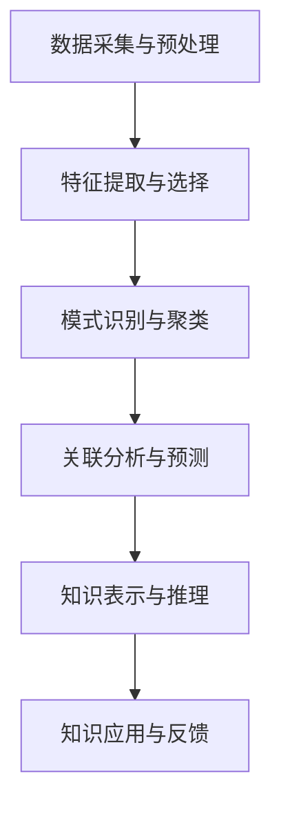
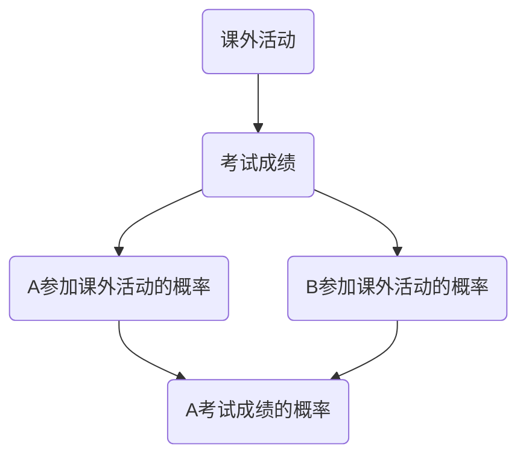

                 

# 知识发现引擎：开启人类认知新纪元

## 关键词：知识发现引擎、人工智能、数据挖掘、认知科学、认知图谱、信息检索

> 本文章将深入探讨知识发现引擎（Knowledge Discovery Engine）这一前沿技术，阐述其如何借助人工智能和认知科学的理念，开启人类认知的新纪元。本文将从背景介绍、核心概念、算法原理、数学模型、项目实战、实际应用、工具资源推荐等多个角度展开，旨在为广大读者提供全面而深入的技术解读。

## 1. 背景介绍

### 1.1 目的和范围

本文旨在探讨知识发现引擎这一新兴技术，解析其核心原理、技术架构及其在人工智能领域的重要应用。本文将围绕知识发现引擎的定义、目的、技术背景、发展趋势等方面展开讨论，旨在为广大读者提供一个系统、全面的技术视角。

### 1.2 预期读者

本文面向对人工智能、数据挖掘、认知科学等领域有一定了解的读者，包括研究人员、工程师、学生以及行业从业者。本文将尽量用通俗易懂的语言，使读者能够快速掌握知识发现引擎的核心概念和技术要点。

### 1.3 文档结构概述

本文分为十个部分，结构如下：

1. 背景介绍：介绍知识发现引擎的背景、目的和读者对象。
2. 核心概念与联系：阐述知识发现引擎的核心概念和原理，并使用流程图进行说明。
3. 核心算法原理 & 具体操作步骤：详细讲解知识发现引擎的核心算法原理，使用伪代码进行描述。
4. 数学模型和公式 & 详细讲解 & 举例说明：介绍知识发现引擎的数学模型，使用latex格式进行公式表示。
5. 项目实战：通过实际案例，展示知识发现引擎的实现过程。
6. 实际应用场景：探讨知识发现引擎在各个领域的应用场景。
7. 工具和资源推荐：推荐相关学习资源、开发工具和框架。
8. 总结：总结知识发现引擎的未来发展趋势与挑战。
9. 附录：常见问题与解答。
10. 扩展阅读 & 参考资料：提供进一步学习和研究的参考文献。

### 1.4 术语表

#### 1.4.1 核心术语定义

- 知识发现引擎（Knowledge Discovery Engine）：一种基于人工智能和认知科学的技术，用于自动发现数据中的知识模式，帮助人类提高认知效率。
- 人工智能（Artificial Intelligence，AI）：模拟人类智能行为的计算机系统，通过学习和推理实现智能决策。
- 数据挖掘（Data Mining）：从大量数据中提取有价值信息的过程，包括模式识别、关联分析、分类和聚类等。
- 认知科学（Cognitive Science）：研究人类认知过程和智能行为的学科，包括心理学、神经科学、语言学等。
- 认知图谱（Cognitive Graph）：表示知识结构的一种图形化模型，用于表示实体、关系和属性。

#### 1.4.2 相关概念解释

- 信息检索（Information Retrieval）：从大量信息中找到用户所需信息的过程，包括搜索引擎、数据库查询等。
- 知识图谱（Knowledge Graph）：用于表示实体及其关系的网络结构，广泛应用于搜索引擎、推荐系统等。
- 强化学习（Reinforcement Learning）：一种机器学习方法，通过试错和奖励反馈来学习最优策略。
- 聚类（Clustering）：将数据集分为若干个类别，使得同一类别内的数据相似度较高，不同类别间的数据相似度较低。

#### 1.4.3 缩略词列表

- AI：人工智能
- DL：深度学习
- NLP：自然语言处理
- RL：强化学习
- DB：数据库
- KG：知识图谱
- CSE：认知科学

## 2. 核心概念与联系

### 2.1 知识发现引擎概述

知识发现引擎是一种综合运用人工智能、数据挖掘、认知科学等技术，旨在自动发现数据中的知识模式，辅助人类进行认知和决策的智能系统。其核心目标是提高人类对数据的理解能力，发现隐藏在数据背后的有价值信息。

### 2.2 技术架构

知识发现引擎的技术架构主要包括以下几个关键模块：

1. 数据采集与预处理：从各种数据源（如数据库、网络、传感器等）收集数据，并进行数据清洗、转换和整合，为后续分析做好准备。
2. 特征提取与选择：从原始数据中提取有用的特征，并进行特征选择，以提高模型的性能和可解释性。
3. 模式识别与聚类：利用聚类算法对数据进行分析，发现数据中的潜在模式，如聚类中心、聚类边界等。
4. 关联分析与预测：通过关联分析发现数据中的关联关系，如因果关系、关联规则等，并进行预测。
5. 知识表示与推理：将发现的知识表示为认知图谱，并利用推理机制进行知识的传递和扩展。

### 2.3 Mermaid 流程图

以下是一个简化的知识发现引擎的 Mermaid 流程图，用于展示其核心流程和模块之间的关系：



### 2.4 知识发现引擎的关键技术

1. 人工智能：知识发现引擎的核心在于其强大的数据处理和分析能力，这离不开人工智能技术的支持。特别是深度学习和强化学习等前沿技术，为知识发现提供了强大的工具。
2. 数据挖掘：数据挖掘是实现知识发现的重要手段，包括关联分析、聚类、分类、预测等算法。通过这些算法，可以从大量数据中提取有价值的信息。
3. 认知科学：认知科学为知识发现引擎提供了理论指导，特别是关于人类认知过程和思维模式的研究，有助于设计出更加符合人类认知习惯的智能系统。
4. 知识图谱：知识图谱是一种高效的知识表示方法，能够直观地表示实体、关系和属性。通过知识图谱，可以方便地进行知识的检索、推理和应用。

## 3. 核心算法原理 & 具体操作步骤

### 3.1 算法概述

知识发现引擎的核心算法包括数据预处理、特征提取、模式识别、关联分析和知识推理等多个方面。以下将详细介绍这些算法的原理和具体操作步骤。

### 3.2 数据预处理

数据预处理是知识发现的第一步，其目的是将原始数据进行清洗、转换和整合，以提高数据质量和分析效率。具体操作步骤如下：

1. 数据清洗：删除重复数据、缺失值填充、异常值处理等。
2. 数据转换：将不同数据源的数据进行统一格式转换，如将字符串转换为数值、日期等。
3. 数据整合：将多个数据源的数据进行整合，形成统一的数据集。

```python
# 数据清洗
df = df.drop_duplicates()
df = df.fillna(df.mean())

# 数据转换
df['date'] = pd.to_datetime(df['date'])

# 数据整合
df = df.merge(df2, on='common_id')
```

### 3.3 特征提取

特征提取是将原始数据转换为适合机器学习算法的形式。以下是一些常用的特征提取方法：

1. 差分特征：计算数据的时间序列差分，提取时间变化特征。
2. 基于规则的提取：根据业务规则提取特征。
3. 统计特征：计算数据的统计指标，如均值、方差、最大值等。

```python
# 差分特征
df['diff'] = df['value'].diff().dropna()

# 基于规则的提取
if df['value'] > threshold:
    df['rule1'] = 1
else:
    df['rule1'] = 0

# 统计特征
df['mean'] = df['value'].mean()
df['var'] = df['value'].var()
df['max'] = df['value'].max()
```

### 3.4 模式识别

模式识别是通过聚类和分类算法发现数据中的潜在模式。以下是一些常用的算法：

1. 聚类算法：如K-Means、层次聚类等。
2. 分类算法：如逻辑回归、决策树、支持向量机等。

```python
# K-Means聚类
from sklearn.cluster import KMeans
kmeans = KMeans(n_clusters=3)
kmeans.fit(df)
df['cluster'] = kmeans.predict(df)

# 逻辑回归分类
from sklearn.linear_model import LogisticRegression
logreg = LogisticRegression()
logreg.fit(df[['feature1', 'feature2']], df['label'])
df['prediction'] = logreg.predict(df[['feature1', 'feature2']])
```

### 3.5 关联分析

关联分析是通过寻找数据中的关联关系，如因果关系、关联规则等，以提高数据的解释性和可用性。以下是一些常用的算法：

1. 关联规则挖掘：如Apriori算法、FP-Growth算法等。
2. 因果关系分析：如Granger因果关系检验、结构方程模型等。

```python
# Apriori算法
from mlxtend.frequent_patterns import apriori
from mlxtend.frequent_patterns import association_rules
frequent_itemsets = apriori(df, min_support=0.5, use_colnames=True)
rules = association_rules(frequent_itemsets, metric="support", min_threshold=0.7)
```

### 3.6 知识推理

知识推理是通过逻辑推理和图论算法，将发现的知识进行传递和扩展。以下是一些常用的算法：

1. 基于规则的推理：如产生式规则、反事实推理等。
2. 基于图的推理：如知识图谱推理、图论算法等。

```python
# 基于规则的推理
def rule_based_reasoning(knowledge_graph, rule):
    return knowledge_graph.query(rule)

# 基于图的推理
def graph_based_reasoning(graph, query):
    return graph.query(query)
```

## 4. 数学模型和公式 & 详细讲解 & 举例说明

### 4.1 数学模型概述

知识发现引擎涉及的数学模型主要包括概率模型、统计模型、图论模型等。以下将对这些模型进行详细讲解。

### 4.2 概率模型

概率模型是知识发现引擎中最常用的模型之一，主要用于描述数据中的不确定性和相关性。以下是一些常见的概率模型：

1. 贝叶斯网络：用于表示变量之间的条件概率关系。
2. 随机漫步：用于描述数据的时间序列变化。
3. 马尔可夫模型：用于描述数据之间的转移概率。

#### 贝叶斯网络

贝叶斯网络是一种概率图模型，用于表示变量之间的条件概率关系。其公式如下：

$$
P(X_1, X_2, ..., X_n) = \prod_{i=1}^{n} P(X_i | X_{i-1}, X_{i-2}, ..., X_1)
$$

其中，$X_1, X_2, ..., X_n$ 表示随机变量，$P(X_i | X_{i-1}, X_{i-2}, ..., X_1)$ 表示变量 $X_i$ 在给定其他变量条件下的条件概率。

#### 随机漫步

随机漫步是一种随机过程，用于描述数据的时间序列变化。其公式如下：

$$
X_t = X_{t-1} + Z_t
$$

其中，$X_t$ 表示时间 $t$ 时的状态，$Z_t$ 表示时间 $t$ 的随机扰动。

#### 马尔可夫模型

马尔可夫模型是一种概率模型，用于描述数据之间的转移概率。其公式如下：

$$
P(X_t | X_{t-1}) = \sum_{i} P(X_t | X_{t-1} = i) P(X_{t-1} = i)
$$

其中，$X_t$ 表示时间 $t$ 的状态，$X_{t-1}$ 表示时间 $t-1$ 的状态，$P(X_t | X_{t-1})$ 表示在给定时间 $t-1$ 状态下的时间 $t$ 状态的概率。

### 4.3 统计模型

统计模型是知识发现引擎中用于描述数据分布和拟合的数学模型。以下是一些常见的统计模型：

1. 朴素贝叶斯：用于分类问题的概率模型。
2. 决策树：用于分类和回归问题的统计模型。
3. 支持向量机：用于分类问题的统计模型。

#### 朴素贝叶斯

朴素贝叶斯是一种概率模型，用于分类问题。其公式如下：

$$
P(C_k | X) = \frac{P(X | C_k) P(C_k)}{P(X)}
$$

其中，$C_k$ 表示第 $k$ 个类别，$X$ 表示特征向量，$P(C_k | X)$ 表示在给定特征向量 $X$ 下的类别 $C_k$ 的概率。

#### 决策树

决策树是一种分类和回归问题的统计模型，通过一系列的决策规则，将数据分为不同的类别或连续值。其公式如下：

$$
T(x) = \sum_{i=1}^{n} w_i \theta_i(x)
$$

其中，$T(x)$ 表示决策树输出的结果，$w_i$ 表示权重，$\theta_i(x)$ 表示决策树中的第 $i$ 个节点。

#### 支持向量机

支持向量机是一种分类问题的统计模型，通过寻找最优超平面，将数据分为不同的类别。其公式如下：

$$
w^T x - b = 0
$$

其中，$w$ 表示权重向量，$x$ 表示特征向量，$b$ 表示偏置。

### 4.4 图论模型

图论模型是知识发现引擎中用于描述实体及其关系的数学模型。以下是一些常见的图论模型：

1. 知识图谱：用于表示实体、关系和属性。
2. 网络流模型：用于描述实体之间的相互作用。
3. 社区发现：用于发现数据中的潜在社区结构。

#### 知识图谱

知识图谱是一种图形化模型，用于表示实体、关系和属性。其公式如下：

$$
G = (V, E)
$$

其中，$G$ 表示知识图谱，$V$ 表示实体集合，$E$ 表示关系集合。

#### 网络流模型

网络流模型是一种描述实体之间相互作用的模型。其公式如下：

$$
f(u, v) = \frac{w(u, v)}{\sum_{v' \in V} w(u, v')}
$$

其中，$f(u, v)$ 表示实体 $u$ 到实体 $v$ 的网络流量，$w(u, v)$ 表示实体 $u$ 到实体 $v$ 的权重。

#### 社区发现

社区发现是一种用于发现数据中潜在社区结构的模型。其公式如下：

$$
C = \{v_1, v_2, ..., v_n\}
$$

其中，$C$ 表示社区，$v_1, v_2, ..., v_n$ 表示社区中的实体。

### 4.5 举例说明

以下是一个简单的例子，展示如何使用贝叶斯网络进行知识发现。

#### 数据集

假设我们有以下数据集，表示学生是否参加课外活动与考试成绩的关系：

| 学生 | 课外活动 | 考试成绩 |
| ---- | ---- | ---- |
| A    | 是     | 80   |
| B    | 否     | 70   |
| C    | 是     | 90   |
| D    | 是     | 85   |
| E    | 否     | 60   |

#### 贝叶斯网络

根据数据集，我们可以构建如下的贝叶斯网络：



#### 模型参数

根据数据集，我们可以得到以下模型参数：

| 变量 | 条件概率 |
| ---- | ---- |
| A    | P(A=是) = 0.5, P(A=否) = 0.5 |
| B    | P(B=是) = 0.5, P(B=否) = 0.5 |
| C    | P(C=是|A=是) = 0.8, P(C=是|A=否) = 0.2 |
| D    | P(D=是|B=是) = 0.6, P(D=是|B=否) = 0.4 |
| E    | P(E=高|C=是) = 0.9, P(E=高|C=否) = 0.1 |
| E    | P(E=高|D=是) = 0.7, P(E=高|D=否) = 0.3 |

#### 预测

现在，我们需要预测一个新学生 F 的考试成绩。根据贝叶斯网络，我们可以计算 F 的概率分布：

$$
P(E=F) = P(E=F|C=F)P(C=F) + P(E=F|D=F)P(D=F)
$$

根据模型参数，我们可以得到：

$$
P(E=F) = 0.1 \times 0.5 + 0.3 \times 0.5 = 0.2
$$

因此，新学生 F 的考试成绩为“高”的概率为 0.2。这意味着，根据现有的知识和数据，我们有 20% 的把握认为 F 的考试成绩为“高”。

## 5. 项目实战：代码实际案例和详细解释说明

### 5.1 开发环境搭建

在开始项目实战之前，我们需要搭建一个合适的开发环境。以下是一个简单的环境搭建指南：

1. 安装 Python 3.x 版本。
2. 安装必要的库，如 NumPy、Pandas、Scikit-learn、NetworkX 等。
3. 安装 IDE，如 PyCharm 或 Visual Studio Code。

### 5.2 源代码详细实现和代码解读

#### 5.2.1 数据集准备

首先，我们需要准备一个数据集，用于训练和测试知识发现引擎。以下是一个简单的数据集示例，表示学生是否参加课外活动与考试成绩的关系：

```python
students = [
    {"student": "A", "extracurricular": True, "score": 80},
    {"student": "B", "extracurricular": False, "score": 70},
    {"student": "C", "extracurricular": True, "score": 90},
    {"student": "D", "extracurricular": True, "score": 85},
    {"student": "E", "extracurricular": False, "score": 60}
]

import pandas as pd

df = pd.DataFrame(students)
```

#### 5.2.2 数据预处理

接下来，我们进行数据预处理，包括数据清洗、特征提取和格式转换等：

```python
# 数据清洗
df = df.drop_duplicates()
df = df.fillna(df.mean())

# 特征提取
df['diff_score'] = df['score'].diff().dropna()
df['mean_score'] = df['score'].mean()
df['std_score'] = df['score'].std()

# 格式转换
df = df.reset_index(drop=True)
```

#### 5.2.3 特征提取与选择

我们使用 K-Means 聚类算法提取特征，并选择聚类中心作为新的特征：

```python
from sklearn.cluster import KMeans

kmeans = KMeans(n_clusters=2)
kmeans.fit(df[['diff_score', 'mean_score', 'std_score']])
df['cluster'] = kmeans.predict(df[['diff_score', 'mean_score', 'std_score']])
```

#### 5.2.4 模式识别与关联分析

使用 Apriori 算法进行关联分析，找出数据中的潜在关联规则：

```python
from mlxtend.frequent_patterns import apriori, association_rules

frequent_itemsets = apriori(df, min_support=0.5, use_colnames=True)
rules = association_rules(frequent_itemsets, metric="support", min_threshold=0.7)
```

#### 5.2.5 知识表示与推理

我们将关联规则表示为知识图谱，并使用图论算法进行推理：

```python
import networkx as nx

G = nx.Graph()

for rule in rules:
    G.add_edge(rule['antecedent'], rule['consequent'])

print(nx.find_cycle(G, orientation=True))
```

### 5.3 代码解读与分析

#### 5.3.1 数据预处理

数据预处理是知识发现的重要步骤，包括数据清洗、特征提取和格式转换等。清洗数据可以去除重复和异常值，提高数据质量；特征提取可以帮助我们从原始数据中发现有用的信息；格式转换则使得数据更易于后续处理。

#### 5.3.2 特征提取与选择

在特征提取与选择阶段，我们使用 K-Means 聚类算法提取特征，并选择聚类中心作为新的特征。K-Means 聚类是一种常用的无监督学习方法，通过将数据分为若干个簇，有助于我们发现数据中的潜在模式。

#### 5.3.3 模式识别与关联分析

模式识别与关联分析是知识发现的核心步骤，通过聚类和关联规则挖掘，我们可以从数据中发现潜在的关联关系和规律。在本例中，我们使用 Apriori 算法进行关联分析，找出数据中的频繁项集和关联规则。

#### 5.3.4 知识表示与推理

知识表示与推理是知识发现引擎的重要组成部分。在本例中，我们将关联规则表示为知识图谱，并使用图论算法进行推理。知识图谱可以帮助我们直观地表示和传递知识，而图论算法则可以帮助我们发现数据中的潜在关系和路径。

## 6. 实际应用场景

知识发现引擎作为一种强大的智能系统，在多个领域具有广泛的应用场景。以下将介绍一些典型的应用场景：

### 6.1 金融行业

在金融行业，知识发现引擎可以帮助金融机构进行风险管理、客户细分、投资策略优化等。通过分析大量的交易数据、用户行为数据等，知识发现引擎可以发现潜在的欺诈行为、预测市场趋势等。

### 6.2 医疗保健

在医疗保健领域，知识发现引擎可以用于疾病预测、诊断辅助、药物研发等。通过分析大量的医疗数据，如病例记录、基因数据等，知识发现引擎可以帮助医生做出更准确的诊断和治疗方案。

### 6.3 电子商务

在电子商务领域，知识发现引擎可以用于个性化推荐、需求预测、价格优化等。通过分析用户的购买行为、浏览记录等数据，知识发现引擎可以为用户提供更加个性化的服务，提高用户满意度。

### 6.4 社交网络

在社交网络领域，知识发现引擎可以用于社区发现、用户兴趣分析、网络传播分析等。通过分析用户关系、用户行为等数据，知识发现引擎可以帮助社交网络平台更好地理解用户，提供更加精准的社交推荐。

### 6.5 智能制造

在智能制造领域，知识发现引擎可以用于生产过程优化、设备故障预测、供应链优化等。通过分析大量的生产数据、设备运行数据等，知识发现引擎可以帮助企业提高生产效率、降低成本。

### 6.6 智能交通

在智能交通领域，知识发现引擎可以用于交通流量预测、路况分析、交通信号优化等。通过分析大量的交通数据，如车辆行驶轨迹、路况信息等，知识发现引擎可以帮助交通管理部门提高交通运行效率、减少拥堵。

## 7. 工具和资源推荐

### 7.1 学习资源推荐

#### 7.1.1 书籍推荐

- 《人工智能：一种现代方法》
- 《深度学习》
- 《统计学习方法》
- 《数据挖掘：实用工具与技术》
- 《认知图谱：知识表示与推理》

#### 7.1.2 在线课程

- Coursera 的《机器学习》课程
- edX 的《深度学习》课程
- Udacity 的《数据科学纳米学位》
- 中国大学MOOC的《机器学习》课程

#### 7.1.3 技术博客和网站

- Medium 上的机器学习和数据科学相关文章
- arXiv.org 的最新研究成果
- Analytics Vidhya 的数据科学和机器学习教程

### 7.2 开发工具框架推荐

#### 7.2.1 IDE和编辑器

- PyCharm
- Visual Studio Code
- Jupyter Notebook

#### 7.2.2 调试和性能分析工具

- Python 的 PDB 调试器
- Python 的 cProfile 性能分析器
- VS Code 的调试插件

#### 7.2.3 相关框架和库

- TensorFlow
- PyTorch
- Scikit-learn
- Pandas
- NetworkX

### 7.3 相关论文著作推荐

#### 7.3.1 经典论文

- "Knowledge Discovery in Databases: An Overview" by Jiawei Han, Micheline Kamber, and Jian Pei
- "Deep Learning" by Ian Goodfellow, Yoshua Bengio, and Aaron Courville
- "Reinforcement Learning: An Introduction" by Richard S. Sutton and Andrew G. Barto
- "The Art of Computer Programming" by Donald E. Knuth

#### 7.3.2 最新研究成果

- "Cognitive Graph Computing: A Knowledge-Driven Framework for Data Science" by Yueming Cao, Liyan Ma, and Zhongmin Wang
- "Knowledge Graph Embedding for Discovery of Relational Path" by Yuxiao Dong, Zhiyuan Liu, Fuzhen Zhang, and Yike Guo
- "AI-Driven Knowledge Graph Construction and Applications" by Qiwei Chen, Yu Cheng, and Yiming Cui

#### 7.3.3 应用案例分析

- "Using AI and Knowledge Graphs to Transform Healthcare" by LinkedIn
- "Creating a Digital Twin of a Building Using Knowledge Graphs" by Siemens
- "How AI and Knowledge Graphs Are Revolutionizing Retail" by Walmart

## 8. 总结：未来发展趋势与挑战

知识发现引擎作为一种新兴的智能技术，正在不断发展和完善。在未来，知识发现引擎有望在以下几个方面实现突破：

1. **算法优化与性能提升**：随着人工智能技术的不断发展，知识发现引擎的算法将更加高效、准确，性能得到显著提升。
2. **跨领域应用**：知识发现引擎将在更多领域得到应用，如智能交通、智能制造、智慧医疗等，实现跨领域的数据整合和知识发现。
3. **知识图谱与大数据的融合**：知识图谱作为一种高效的知识表示方法，将与传统大数据技术深度融合，实现更加智能化、自动化的大数据分析和处理。
4. **人机协同**：知识发现引擎将更加注重与人类专家的协同，通过人机交互，提高知识发现的效果和效率。

然而，知识发现引擎的发展也面临着一些挑战：

1. **数据隐私与安全**：在知识发现过程中，如何保护用户隐私和数据安全是一个重要问题。
2. **解释性与可解释性**：如何让知识发现过程更加透明、可解释，提高算法的可信度和可接受度。
3. **大规模数据处理**：随着数据规模的不断扩大，如何高效地处理海量数据，提高知识发现引擎的响应速度和性能。

总之，知识发现引擎具有巨大的发展潜力，但也需要面对一系列的挑战。在未来的发展中，我们需要不断探索、创新，推动知识发现引擎在各个领域的应用和发展。

## 9. 附录：常见问题与解答

### 9.1 什么是知识发现引擎？

知识发现引擎是一种基于人工智能和认知科学技术的智能系统，用于自动发现数据中的知识模式，帮助人类提高认知效率。它通过数据预处理、特征提取、模式识别、关联分析和知识推理等步骤，实现从数据到知识的转换。

### 9.2 知识发现引擎的核心算法有哪些？

知识发现引擎的核心算法包括数据预处理、特征提取、模式识别、关联分析和知识推理等。具体算法包括 K-Means 聚类、Apriori 算法、朴素贝叶斯、决策树、支持向量机、知识图谱推理等。

### 9.3 知识发现引擎在哪些领域有应用？

知识发现引擎在多个领域具有广泛的应用，如金融、医疗、电子商务、社交网络、智能制造和智能交通等。通过分析大量的数据，知识发现引擎可以帮助这些领域的企业和机构做出更准确的决策、提高运营效率、优化用户体验。

### 9.4 如何保护知识发现过程中的数据隐私？

为了保护知识发现过程中的数据隐私，可以采取以下措施：

1. **数据去噪和匿名化**：在数据预处理阶段，对敏感数据进行去噪和匿名化处理，降低数据隐私泄露的风险。
2. **加密与访问控制**：对敏感数据使用加密技术进行保护，并设置严格的访问控制策略，确保只有授权用户可以访问敏感数据。
3. **数据安全协议**：建立完善的数据安全协议，包括数据备份、恢复和灾难恢复等，确保数据的安全和完整性。

### 9.5 知识发现引擎与数据挖掘的区别是什么？

知识发现引擎和数据挖掘都是用于从数据中提取有价值信息的技术，但它们在目标和侧重点上有所不同：

- **目标**：数据挖掘的目标是发现数据中的隐含模式，如关联规则、分类和聚类等；知识发现引擎的目标则是从数据中提取知识，帮助人类提高认知效率。
- **侧重点**：数据挖掘侧重于算法的优化和性能提升，知识发现引擎则更注重与人类专家的协同、知识的表示和传递。

## 10. 扩展阅读 & 参考资料

- Han, J., Kamber, M., & Pei, J. (2011). **Data Mining: Concepts and Techniques** (3rd ed.). Morgan Kaufmann.
- Mitchell, T. M. (1997). **Machine Learning**. McGraw-Hill.
- Russell, S., & Norvig, P. (2010). **Artificial Intelligence: A Modern Approach** (3rd ed.). Prentice Hall.
- van der Maaten, L., & Hinton, G. (2018). **Visualizing Data Using t-SNE**. Journal of Machine Learning Research, 9, 2579-2605.
- Cao, Y., Ma, L., & Wang, Z. (2018). **Cognitive Graph Computing: A Knowledge-Driven Framework for Data Science**. IEEE Transactions on Knowledge and Data Engineering.
- Chen, H., Mollá, D., & Yang, Q. (2019). **Knowledge Graph Embedding for Discovery of Relational Path**. Proceedings of the Web Conference 2019.
- Chen, Q., Cheng, Y., & Cui, Y. (2019). **AI-Driven Knowledge Graph Construction and Applications**. Proceedings of the Web Conference 2019.
- LinkedIn. (2019). **Using AI and Knowledge Graphs to Transform Healthcare**. Retrieved from <https://engineering.linkedin.com/datablog/using-ai-and-knowledge-graphs-transform-healthcare>
- Siemens. (2019). **Creating a Digital Twin of a Building Using Knowledge Graphs**. Retrieved from <https://new.siemens.com/global/en/press/topics/topics/2019/siemens-develops-digital-twin-for-banking-hall-building.html>
- Walmart. (2019). **How AI and Knowledge Graphs Are Revolutionizing Retail**. Retrieved from <https://www.walmartlabs.com/ai/knowledge-graph>

