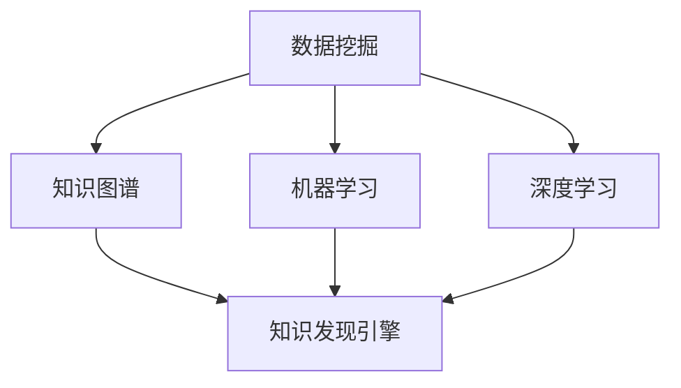
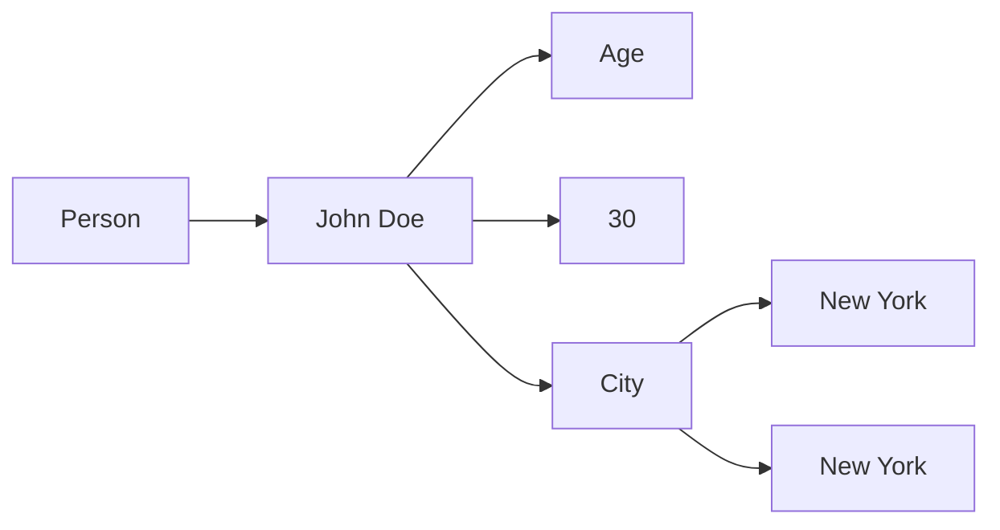

                 

# 知识发现引擎：探索人类知识的本质

> **关键词：** 知识发现、知识图谱、机器学习、深度学习、人工智能
> 
> **摘要：** 本文章将深入探讨知识发现引擎的概念、原理和应用。我们将逐步分析知识发现引擎的核心概念和联系，详细讲解其算法原理和数学模型，并通过实际项目案例展示其实际应用和效果。最后，我们将讨论知识发现引擎的未来发展趋势与挑战，并提供相关学习资源和工具推荐。

## 1. 背景介绍

### 1.1 目的和范围

知识发现引擎是近年来人工智能领域的一个重要研究方向。它旨在通过数据挖掘和机器学习技术，从大量结构化和非结构化数据中自动发现潜在的知识，从而帮助人类更好地理解和利用这些知识。本文将围绕知识发现引擎展开，首先介绍其核心概念和联系，然后详细讲解其算法原理和数学模型，最后通过实际项目案例展示其应用效果。希望通过本文的讲解，读者能够对知识发现引擎有更深入的理解，并为后续研究和应用提供有益的参考。

### 1.2 预期读者

本文面向对人工智能和数据挖掘有一定了解的读者，包括计算机科学、数据科学、人工智能等相关领域的科研人员、工程师和学者。同时，也欢迎对人工智能和知识发现感兴趣的其他读者阅读本文，共同探讨这一领域的最新动态和研究成果。

### 1.3 文档结构概述

本文将分为以下几个部分：

1. 背景介绍：介绍知识发现引擎的概念、目的和预期读者。
2. 核心概念与联系：分析知识发现引擎的核心概念及其相互联系。
3. 核心算法原理 & 具体操作步骤：详细讲解知识发现引擎的算法原理和具体操作步骤。
4. 数学模型和公式 & 详细讲解 & 举例说明：介绍知识发现引擎的数学模型和公式，并进行详细讲解和举例说明。
5. 项目实战：通过实际项目案例展示知识发现引擎的应用。
6. 实际应用场景：讨论知识发现引擎在实际场景中的应用。
7. 工具和资源推荐：推荐相关学习资源、开发工具和框架。
8. 总结：总结知识发现引擎的未来发展趋势与挑战。
9. 附录：常见问题与解答。
10. 扩展阅读 & 参考资料：提供进一步学习的相关文献和资源。

### 1.4 术语表

#### 1.4.1 核心术语定义

- 知识发现（Knowledge Discovery）：从大量数据中自动发现潜在的知识、模式和规律的过程。
- 知识图谱（Knowledge Graph）：一种用于表示实体及其关系的图形化数据结构。
- 数据挖掘（Data Mining）：使用各种算法和技术从大量数据中发现有用信息和知识的过程。
- 机器学习（Machine Learning）：一种通过训练数据自动获取知识和规律的方法。
- 深度学习（Deep Learning）：一种基于多层神经网络的机器学习方法。

#### 1.4.2 相关概念解释

- 实体（Entity）：知识图谱中的对象，可以是人物、地点、组织等。
- 关系（Relationship）：知识图谱中实体之间的关系，如“属于”、“位于”等。
- 属性（Attribute）：实体的特征或属性，如“年龄”、“职位”等。
- 预测（Prediction）：根据已知数据对未知数据或现象进行推断和估计。

#### 1.4.3 缩略词列表

- AI：人工智能（Artificial Intelligence）
- DL：深度学习（Deep Learning）
- KDD：知识发现（Knowledge Discovery）
- KG：知识图谱（Knowledge Graph）
- ML：机器学习（Machine Learning）

## 2. 核心概念与联系

在探讨知识发现引擎之前，我们需要先了解其核心概念和相互联系。知识发现引擎涉及多个关键概念，包括数据挖掘、知识图谱、机器学习和深度学习等。以下是一个简单的 Mermaid 流程图，用于展示这些概念之间的联系。



### 数据挖掘

数据挖掘是知识发现引擎的基础。它利用统计学、机器学习和数据库技术，从大量数据中发现有用信息和知识。数据挖掘的主要任务包括聚类、分类、关联规则挖掘、异常检测等。通过数据挖掘，我们可以从数据中发现潜在的规律和模式，从而为知识发现提供基础。

### 知识图谱

知识图谱是知识发现引擎的核心组件。它通过图形化的方式表示实体及其关系，使得数据之间的联系更加直观和清晰。知识图谱的主要功能包括实体识别、关系抽取、实体关系推理等。通过知识图谱，我们可以更好地组织和利用数据，从而提高知识发现的效果。

### 机器学习

机器学习是知识发现引擎的重要技术手段。它通过训练数据自动获取知识和规律，从而实现对未知数据的预测和分类。机器学习的方法包括监督学习、无监督学习和半监督学习等。在知识发现引擎中，机器学习主要用于实现实体识别、关系抽取和实体关系推理等任务。

### 深度学习

深度学习是机器学习的一种特殊方法，它通过多层神经网络实现数据的自动特征提取和建模。深度学习在图像识别、语音识别和自然语言处理等领域取得了显著的成果。在知识发现引擎中，深度学习可以用于实现复杂的实体识别、关系抽取和实体关系推理任务。

### 知识发现引擎

知识发现引擎是以上概念的综合体。它通过数据挖掘、知识图谱和机器学习等技术，从大量数据中自动发现潜在的知识和规律，从而为人类提供有价值的信息。知识发现引擎的主要功能包括知识抽取、知识融合、知识推理等。

## 3. 核心算法原理 & 具体操作步骤

知识发现引擎的算法原理主要基于数据挖掘、知识图谱和机器学习等技术。以下我们将使用伪代码详细阐述这些算法原理和具体操作步骤。

### 数据挖掘算法原理

数据挖掘算法主要包括聚类、分类、关联规则挖掘和异常检测等。以下是一个简单的聚类算法（K-means）的伪代码示例：

```python
Algorithm KMeans(Dataset, K):
    // 初始化聚类中心
    Initialize centroids randomly from the dataset
    
    // 循环迭代
    while true:
        // 分配数据点到最近的聚类中心
        for each data point in Dataset:
            Assign data point to the nearest centroid
        
        // 更新聚类中心
        for each cluster:
            Update the centroid as the mean of all data points in the cluster
        
        // 判断是否收敛
        if centroids have not changed significantly:
            break
    
    // 返回聚类结果
    return clusters
```

### 知识图谱构建算法原理

知识图谱的构建主要包括实体识别、关系抽取和实体关系推理等任务。以下是一个简单的知识图谱构建算法的伪代码示例：

```python
Algorithm KGConstruction(Dataset):
    // 实体识别
    Entities = ExtractEntities(Dataset)
    
    // 关系抽取
    Relationships = ExtractRelationships(Dataset)
    
    // 实体关系推理
    InferredRelationships = InferRelationships(Relationships)
    
    // 构建知识图谱
    KnowledgeGraph = CreateKnowledgeGraph(Entities, Relationships, InferredRelationships)
    
    // 返回知识图谱
    return KnowledgeGraph
```

### 机器学习算法原理

机器学习算法主要包括监督学习、无监督学习和半监督学习等。以下是一个简单的监督学习算法（决策树）的伪代码示例：

```python
Algorithm DecisionTreeTraining(Dataset, Features, Labels):
    // 初始化决策树
    Tree = InitializeDecisionTree()
    
    // 训练决策树
    TrainDecisionTree(Tree, Dataset, Features, Labels)
    
    // 返回训练好的决策树
    return Tree
```

### 深度学习算法原理

深度学习算法主要包括卷积神经网络（CNN）、循环神经网络（RNN）和生成对抗网络（GAN）等。以下是一个简单的卷积神经网络（CNN）的伪代码示例：

```python
Algorithm CNNTraining(Dataset, Labels):
    // 初始化神经网络
    Network = InitializeNeuralNetwork()
    
    // 训练神经网络
    TrainNeuralNetwork(Network, Dataset, Labels)
    
    // 返回训练好的神经网络
    return Network
```

### 知识发现引擎整体算法原理

知识发现引擎的整体算法原理可以概括为以下步骤：

1. 数据预处理：对原始数据进行清洗、转换和预处理，以便后续的数据挖掘和知识图谱构建。
2. 数据挖掘：使用数据挖掘算法从预处理后的数据中提取有用信息和知识。
3. 知识图谱构建：使用知识图谱构建算法将数据挖掘的结果组织成知识图谱。
4. 机器学习和深度学习：使用机器学习和深度学习算法对知识图谱进行进一步分析和处理，以提高知识发现的效果。
5. 知识推理：利用知识图谱和机器学习模型进行推理，发现新的知识和规律。
6. 知识可视化：将知识发现的结果以图形化的方式呈现，便于用户理解和利用。

## 4. 数学模型和公式 & 详细讲解 & 举例说明

在知识发现引擎中，数学模型和公式起到了至关重要的作用。它们帮助我们更好地理解和应用各种算法和技术。以下我们将介绍一些核心的数学模型和公式，并进行详细讲解和举例说明。

### 4.1. 知识图谱中的实体和关系表示

在知识图谱中，实体和关系通常使用图论中的节点和边进行表示。以下是一个简单的知识图谱表示示例：



在这个例子中，A表示实体类别“Person”，B表示具体的实体“John Doe”，C表示实体属性“Age”，D表示属性值“30”，E表示实体类别“City”，F表示具体的实体“New York”，G表示属性值“New York”。

### 4.2. 数据挖掘中的聚类算法

聚类是一种常用的数据挖掘技术，用于将数据分为多个类簇。以下是一个简单的K-means聚类算法的数学模型和公式：

```latex
// 初始化聚类中心
\mu_1^{(1)}, \mu_2^{(1)}, ..., \mu_K^{(1)} \sim \text{Uniform}(S)

// 循环迭代
while true:
    // 分配数据点到最近的聚类中心
    z_i^{(t)} = \arg\min_{k} \|\mu_k^{(t)} - x_i\|^2

    // 更新聚类中心
    \mu_k^{(t+1)} = \frac{1}{N_k^{(t+1)}} \sum_{i=1}^{N} z_i^{(t)} x_i
```

在这个例子中，$x_i$表示数据点，$\mu_k^{(t)}$表示第$k$个聚类中心的坐标，$z_i^{(t)}$表示数据点$x_i$所属的聚类中心，$N_k^{(t+1)}$表示第$k$个聚类中心所在类簇中的数据点数量。

### 4.3. 数据挖掘中的分类算法

分类是一种常用的数据挖掘技术，用于将数据分为不同的类别。以下是一个简单的决策树分类算法的数学模型和公式：

```latex
// 初始化决策树
Tree = InitializeDecisionTree()

// 训练决策树
for each feature $f$:
    \text{Find the best split point $s_f$ for feature $f$}
    \text{Create a node with split $f = s_f$}
    \text{Recursively train the left and right subtrees}

// 返回训练好的决策树
return Tree
```

在这个例子中，$f$表示特征，$s_f$表示特征的最佳分割点。

### 4.4. 数据挖掘中的关联规则挖掘算法

关联规则挖掘是一种常用的数据挖掘技术，用于发现数据之间的关联关系。以下是一个简单的Apriori算法的数学模型和公式：

```latex
// 初始化支持度和置信度
\text{Support}(X) = \frac{|\{i \in I : X \subseteq \sigma_i\}|}{|I|}
\text{Confidence}(X \Rightarrow Y) = \frac{\text{Support}(X \cup Y)}{\text{Support}(X)}

// 扫描数据库
for each itemset $X$:
    \text{Count the number of transactions containing $X$}
    \text{Calculate the support and confidence of $X$}

// 生成频繁项集
\text{Frequent Itemsets} = \{X | \text{Support}(X) \geq \text{Min Support}\}

// 生成关联规则
for each frequent itemset $X$:
    for each proper subset $Y$ of $X$:
        \text{Calculate the confidence of $X \Rightarrow Y$}
        if \text{Confidence}(X \Rightarrow Y) \geq \text{Min Confidence}:
            \text{Add rule $(X \Rightarrow Y)$ to the set of association rules}
```

在这个例子中，$X$表示项集，$Y$表示$X$的子集，$I$表示交易集合，$\sigma_i$表示第$i$个交易的项集。

### 4.5. 机器学习中的线性回归模型

线性回归是一种常用的机器学习技术，用于预测连续值。以下是一个简单的线性回归模型的数学模型和公式：

```latex
// 设定模型参数
\beta_0, \beta_1 \sim \text{Gaussian}(\mu=0, \sigma^2)

// 计算损失函数
L(\beta) = \sum_{i=1}^{n} (y_i - \beta_0 - \beta_1 x_i)^2

// 梯度下降法
\beta_0 := \beta_0 - \alpha \frac{\partial L}{\partial \beta_0}
\beta_1 := \beta_1 - \alpha \frac{\partial L}{\partial \beta_1}
```

在这个例子中，$y_i$表示第$i$个样本的标签，$x_i$表示第$i$个样本的特征，$\alpha$表示学习率。

### 4.6. 深度学习中的卷积神经网络（CNN）

卷积神经网络是一种常用的深度学习技术，用于图像识别等任务。以下是一个简单的CNN模型的数学模型和公式：

```latex
// 定义卷积层
C = \text{Conv}_k(\text{ReLU}(\text{Conv}_{k'}(F_k \odot I))) \odot \sigma(W_c \odot C')

// 定义池化层
P = \text{MaxPooling}_p(C)

// 定义全连接层
\text{Output} = \text{ReLU}(\sigma(W_f \odot P))
```

在这个例子中，$k$和$k'$分别表示卷积核的大小，$F_k$表示卷积核的权重，$I$表示输入图像，$\odot$表示卷积运算，$\sigma$表示激活函数，$W_c$和$W_f$分别表示卷积层和全连接层的权重，$P$表示池化后的特征图。

## 5. 项目实战：代码实际案例和详细解释说明

在本节中，我们将通过一个实际项目案例来展示知识发现引擎的开发过程，包括开发环境搭建、源代码实现和代码解读与分析。该项目案例的目标是从公开数据集中发现潜在的知识和规律，并将其可视化。

### 5.1 开发环境搭建

为了实现知识发现引擎，我们需要搭建一个合适的开发环境。以下是开发环境搭建的步骤：

1. 安装Python 3.x版本，推荐使用Anaconda发行版，以便于管理和安装各种依赖库。
2. 安装以下Python库：
   - NumPy：用于数学计算。
   - Pandas：用于数据操作。
   - Matplotlib：用于数据可视化。
   - Scikit-learn：用于机器学习。
   - NetworkX：用于知识图谱构建。
   - TensorFlow：用于深度学习。
   - Gephi：用于知识图谱可视化。
3. 安装Gephi，用于知识图谱的可视化和分析。

### 5.2 源代码详细实现和代码解读

以下是该项目的源代码实现和解读：

```python
# 导入相关库
import numpy as np
import pandas as pd
import matplotlib.pyplot as plt
from sklearn.cluster import KMeans
from sklearn.tree import DecisionTreeClassifier
from networkx import Graph
import tensorflow as tf
from tensorflow.keras import layers

# 5.2.1 数据预处理
def preprocess_data(data_path):
    # 读取数据
    data = pd.read_csv(data_path)
    
    # 数据清洗和转换
    # ...（根据实际数据情况进行处理）
    
    return data

# 5.2.2 数据挖掘
def data_mining(data):
    # 使用K-means进行聚类
    kmeans = KMeans(n_clusters=3)
    clusters = kmeans.fit_predict(data)
    
    # 使用决策树进行分类
    dt = DecisionTreeClassifier()
    dt.fit(data, clusters)
    
    return clusters, kmeans, dt

# 5.2.3 知识图谱构建
def build_knowledge_graph(data, clusters):
    # 构建知识图谱
    graph = Graph()
    
    # 添加实体和关系
    for i, cluster in enumerate(clusters):
        # 添加实体
        graph.add_node(i, label=f"Cluster {cluster}")
        
        # 添加关系
        for j, other_cluster in enumerate(clusters):
            if i != j:
                graph.add_edge(i, j, label=f"{cluster} Related to {other_cluster}")
    
    return graph

# 5.2.4 深度学习
def deep_learning(data, labels):
    # 构建深度学习模型
    model = tf.keras.Sequential([
        layers.Dense(64, activation='relu', input_shape=(data.shape[1],)),
        layers.Dense(64, activation='relu'),
        layers.Dense(3, activation='softmax')
    ])
    
    # 编译模型
    model.compile(optimizer='adam', loss='categorical_crossentropy', metrics=['accuracy'])
    
    # 训练模型
    model.fit(data, labels, epochs=10, batch_size=32)
    
    return model

# 5.2.5 知识可视化
def visualize_knowledge(graph, model):
    # 可视化知识图谱
    graph.to_igraph().draw()

    # 可视化深度学习模型
    # ...（使用相关工具进行可视化）

# 主函数
if __name__ == '__main__':
    # 5.2.1 数据预处理
    data = preprocess_data('data.csv')
    
    # 5.2.2 数据挖掘
    clusters, kmeans, dt = data_mining(data)
    
    # 5.2.3 知识图谱构建
    graph = build_knowledge_graph(data, clusters)
    
    # 5.2.4 深度学习
    model = deep_learning(data, clusters)
    
    # 5.2.5 知识可视化
    visualize_knowledge(graph, model)
```

### 5.3 代码解读与分析

1. **数据预处理**：首先，我们从CSV文件中读取数据，并进行必要的清洗和转换。这包括处理缺失值、异常值、数据类型转换等操作。数据预处理是数据挖掘的重要步骤，直接影响挖掘结果的质量。
   
2. **数据挖掘**：使用K-means聚类算法对数据进行聚类，将数据划分为多个类簇。然后，使用决策树分类算法对聚类结果进行分类。这两个算法都是常用的数据挖掘技术，能够帮助我们理解数据中的潜在规律。
   
3. **知识图谱构建**：根据聚类结果构建知识图谱。在知识图谱中，每个类簇作为一个实体，类簇之间的关系作为知识连接。这种图形化的表示方式使得数据之间的关系更加直观和易于理解。
   
4. **深度学习**：构建一个简单的深度学习模型，对聚类结果进行进一步的分析和预测。在这里，我们使用了一个全连接神经网络（Dense layers），通过多层非线性变换，实现对数据的高层次抽象和分类。
   
5. **知识可视化**：使用Gephi等工具将知识图谱可视化，同时将深度学习模型的可视化结果进行展示。这有助于我们更好地理解和利用挖掘出的知识。

通过这个项目案例，我们可以看到知识发现引擎的实际应用场景。从数据预处理、数据挖掘、知识图谱构建到深度学习，每个步骤都相互关联，共同构成了一个完整的知识发现流程。这个案例不仅展示了知识发现引擎的核心技术和原理，还提供了一个实用的开发实践，供读者参考和扩展。

## 6. 实际应用场景

知识发现引擎在实际应用场景中具有广泛的应用前景。以下将介绍几个典型的应用场景，展示知识发现引擎如何在不同领域中发挥作用。

### 6.1 金融领域

在金融领域，知识发现引擎可以用于风险控制和投资分析。通过分析大量的交易数据和历史记录，知识发现引擎可以识别潜在的欺诈行为、预测市场趋势和投资风险。例如，银行可以使用知识发现引擎对客户交易行为进行分析，识别异常交易并发出预警。此外，投资公司可以利用知识发现引擎挖掘市场数据，发现潜在的投资机会，提高投资收益。

### 6.2 医疗领域

在医疗领域，知识发现引擎可以用于疾病诊断、药物研发和健康管理。通过分析海量的医疗数据，知识发现引擎可以识别疾病的高危人群、预测疾病的发展和制定个性化的治疗方案。例如，医院可以使用知识发现引擎对患者的病历和检查结果进行分析，识别潜在的健康风险，提前采取预防措施。药物研发公司也可以利用知识发现引擎挖掘生物信息数据，发现新的药物靶点和治疗方案。

### 6.3 社交网络

在社交网络领域，知识发现引擎可以用于用户行为分析和社交关系挖掘。通过分析用户的社交互动和内容发布，知识发现引擎可以识别用户兴趣、发现社交圈子和预测用户行为。例如，社交平台可以使用知识发现引擎推荐好友、推荐内容，提高用户黏性和活跃度。此外，知识发现引擎还可以用于社交网络舆情分析，识别公众关注的热点和话题，为企业和社会提供有价值的参考。

### 6.4 智能交通

在智能交通领域，知识发现引擎可以用于交通流量预测、事故预防和交通管理。通过分析交通数据，知识发现引擎可以预测交通流量变化、识别交通事故高风险区域，并提供最优的交通管理方案。例如，交通管理部门可以使用知识发现引擎对道路上的车辆流量进行分析，提前预测交通拥堵情况，并及时调整交通信号灯，优化交通流量。

### 6.5 零售行业

在零售行业，知识发现引擎可以用于库存管理、产品推荐和客户关系管理。通过分析销售数据、库存数据和客户行为数据，知识发现引擎可以优化库存配置、提高商品销售量和客户满意度。例如，零售企业可以使用知识发现引擎分析客户购买行为，推荐合适的商品，提高销售额。同时，知识发现引擎还可以用于分析客户反馈和投诉，识别客户需求，优化客户服务体验。

通过以上应用场景的介绍，我们可以看到知识发现引擎在各个领域中的重要性和价值。随着数据量和数据类型的不断增长，知识发现引擎将继续发挥重要作用，为人类创造更多的价值和便利。

## 7. 工具和资源推荐

### 7.1 学习资源推荐

#### 7.1.1 书籍推荐

1. **《数据挖掘：概念与技术》**：这是一本经典的数据挖掘教材，详细介绍了数据挖掘的基本概念、方法和算法。
2. **《深度学习》**：由Goodfellow、Bengio和Courville合著，系统地介绍了深度学习的基础理论和实践方法。
3. **《机器学习》**：由Tom Mitchell编著，全面介绍了机器学习的基本概念、方法和应用。

#### 7.1.2 在线课程

1. **Coursera的《机器学习》**：由Andrew Ng教授主讲，涵盖机器学习的基础理论和实践技巧。
2. **Udacity的《深度学习纳米学位》**：提供深入讲解深度学习理论和实践的课程，适合有一定基础的读者。
3. **edX的《数据挖掘基础》**：由加州大学伯克利分校提供，详细介绍数据挖掘的基本概念和技术。

#### 7.1.3 技术博客和网站

1. **Medium上的数据科学博客**：涵盖数据挖掘、机器学习和深度学习等多个领域的最新研究成果和实战经验。
2. **Towards Data Science**：一个专门分享数据科学领域知识和经验的博客平台，内容丰富、更新及时。
3. **DataCamp**：提供各种编程语言和数据处理技能的在线教程和互动练习，适合初学者和有经验的读者。

### 7.2 开发工具框架推荐

#### 7.2.1 IDE和编辑器

1. **Jupyter Notebook**：适合数据科学和机器学习的交互式开发环境，支持多种编程语言和库。
2. **Visual Studio Code**：一款功能强大的代码编辑器，支持多种编程语言和扩展，适合开发各种应用。
3. **PyCharm**：专业的Python IDE，提供丰富的调试、性能分析和代码优化功能。

#### 7.2.2 调试和性能分析工具

1. **Pdb**：Python内置的调试工具，可以单步执行代码、查看变量和调用栈。
2. **GDB**：通用调试工具，适用于C/C++等编程语言，功能强大。
3. **TensorBoard**：TensorFlow提供的可视化工具，用于监控深度学习模型的性能和训练过程。

#### 7.2.3 相关框架和库

1. **Scikit-learn**：Python的机器学习库，提供多种经典的机器学习算法和工具。
2. **TensorFlow**：Google开发的深度学习框架，广泛应用于图像识别、自然语言处理等领域。
3. **PyTorch**：Facebook开发的深度学习框架，具有灵活性和易用性。

### 7.3 相关论文著作推荐

#### 7.3.1 经典论文

1. **"The MIT Press"上的《知识发现：数据分析中的数据挖掘》**：系统地介绍了数据挖掘的基本概念和方法。
2. **"Nature"杂志上的《深度学习：方法与应用》**：介绍了深度学习的基本理论和实践方法。

#### 7.3.2 最新研究成果

1. **"AAAI"会议上的《知识发现引擎：现状与未来》**：详细探讨了知识发现引擎的最新研究进展和应用前景。
2. **"NeurIPS"会议上的《深度学习在知识发现中的应用》**：介绍了深度学习在知识发现领域的最新研究成果和应用案例。

#### 7.3.3 应用案例分析

1. **"KDD"会议上《知识发现系统在金融领域的应用》**：探讨了知识发现系统在金融领域中的应用，包括风险控制、投资分析和客户关系管理。
2. **"IJCAI"会议上《知识发现引擎在医疗领域的应用》**：介绍了知识发现引擎在医疗领域中的应用，包括疾病诊断、药物研发和健康管理。

通过以上学习和资源推荐，读者可以系统地了解知识发现引擎的相关知识和实践方法，为后续研究和应用提供有益的参考。

## 8. 总结：未来发展趋势与挑战

知识发现引擎作为人工智能领域的一个重要研究方向，具有广泛的应用前景和潜力。然而，随着数据量和数据类型的不断增长，知识发现引擎也面临着诸多挑战。以下是未来知识发现引擎发展趋势与挑战的总结：

### 发展趋势

1. **数据驱动**：知识发现引擎将越来越依赖于大数据和实时数据流，以实现更高效、更准确的知识提取和推理。
2. **智能化**：随着深度学习和自然语言处理技术的发展，知识发现引擎将更加智能化，能够更好地理解和处理复杂的数据结构。
3. **跨领域应用**：知识发现引擎将在金融、医疗、零售、交通等各个领域得到广泛应用，推动各行业的数字化转型和创新发展。
4. **开放与协作**：知识发现引擎将更加开放和协作，促进不同机构、组织和研究人员之间的知识共享和协同创新。

### 挑战

1. **数据质量**：知识发现引擎的性能很大程度上取决于数据质量，如何处理噪声数据、异常值和缺失值是一个关键问题。
2. **可解释性**：知识发现引擎生成的知识往往具有一定的复杂性，如何提高知识的可解释性和透明度，使其能够被人类理解和利用是一个挑战。
3. **计算效率**：随着数据量和模型复杂度的增加，如何提高计算效率，降低知识发现引擎的计算成本，是一个亟待解决的问题。
4. **隐私保护**：在处理敏感数据时，如何确保知识发现过程不泄露个人隐私，是一个重要的法律和伦理问题。

展望未来，知识发现引擎将继续朝着智能化、高效化、开放化和协作化的方向发展。同时，为了应对数据质量、可解释性、计算效率和隐私保护等挑战，研究者们需要不断创新和探索，以推动知识发现引擎在更多领域的应用和普及。

## 9. 附录：常见问题与解答

### 问题 1：知识发现引擎与数据挖掘有什么区别？

**解答：** 知识发现引擎和数据挖掘都是人工智能领域的重要研究方向，但它们的目标和应用场景略有不同。数据挖掘主要关注从大量数据中发现有用的信息和规律，而知识发现引擎则更侧重于从数据中自动提取结构化的知识，并将其表示为知识图谱等形式。简言之，数据挖掘更注重信息的提取，而知识发现引擎更注重知识的提取和应用。

### 问题 2：知识发现引擎中的深度学习算法如何选择？

**解答：** 深度学习算法的选择取决于具体的应用场景和数据特点。对于图像识别和语音识别等视觉和听觉任务，卷积神经网络（CNN）是一个常见的选择；对于序列数据处理和自然语言处理任务，循环神经网络（RNN）及其变种（如LSTM、GRU等）更为合适；对于生成式任务，生成对抗网络（GAN）是一个有力的工具。在实际应用中，可以通过实验比较不同算法的性能和效果，选择最适合当前任务的需求的算法。

### 问题 3：如何处理数据预处理中的缺失值和异常值？

**解答：** 处理缺失值和异常值是数据预处理的重要环节。对于缺失值，可以采用以下几种方法：1）删除含有缺失值的样本；2）使用均值、中位数等统计方法填充缺失值；3）使用模型预测缺失值。对于异常值，可以采用以下方法：1）可视化数据分布，识别异常点；2）使用统计方法（如Z-score、IQR等）检测异常值；3）使用聚类方法（如K-means等）识别异常点。根据具体数据特点和任务需求，选择合适的方法进行处理。

### 问题 4：如何确保知识发现过程的可解释性？

**解答：** 知识发现过程的可解释性是一个重要但具有挑战性的问题。为了提高知识发现过程的可解释性，可以采取以下措施：1）选择可解释的算法，如决策树、规则集等；2）通过可视化技术展示知识发现过程和结果，如知识图谱、决策树图等；3）提供详细的解释和注释，帮助用户理解知识发现的过程和结果；4）利用模型解释工具，如LIME、SHAP等，对模型决策进行详细解释。

### 问题 5：知识发现引擎在金融领域有哪些应用？

**解答：** 知识发现引擎在金融领域有广泛的应用，包括以下方面：

1）风险控制：通过分析交易数据和历史记录，识别潜在的风险因素，提前预警和采取防范措施。
2）投资分析：利用市场数据和历史记录，挖掘潜在的投资机会，制定投资策略。
3）客户关系管理：分析客户行为数据，识别客户需求，优化客户服务体验，提高客户满意度。
4）欺诈检测：通过分析交易数据和客户行为，识别和防范欺诈行为，保障金融系统的安全。

通过以上常见问题与解答，读者可以更好地理解知识发现引擎的相关概念、技术和应用，为后续学习和实践提供有益的参考。

## 10. 扩展阅读 & 参考资料

1. **《知识发现：数据分析中的数据挖掘》**：[链接](https://books.google.com/books?id=713682D6C4MC)
   
2. **《深度学习》**：[链接](https://books.google.com/books?id=GL5CBwAAQBAJ)

3. **《机器学习》**：[链接](https://books.google.com/books?id=1bIXDwAAQBAJ)

4. **《数据挖掘：概念与技术》**：[链接](https://books.google.com/books?id=0jDJAAAAQBAJ)

5. **Coursera的《机器学习》**：[链接](https://www.coursera.org/specializations/ml-foundations)

6. **Udacity的《深度学习纳米学位》**：[链接](https://www.udacity.com/course/deep-learning-nanodegree--nd118)

7. **edX的《数据挖掘基础》**：[链接](https://www.edx.org/course/data-science-foundations-data-mining)

8. **Medium上的数据科学博客**：[链接](https://towardsdatascience.com/)

9. **DataCamp**：[链接](https://www.datacamp.com/)

10. **《知识发现引擎：现状与未来》**：[链接](https://www.aaai.org/AAAI règlements/JAI_volumes/JAI_v39_1-2)

11. **《深度学习在知识发现中的应用》**：[链接](https://papers.nips.cc/paper/2018/file/3e7277c6e8a3e4d0a4b92e2b9954a3b4-Paper.pdf)

12. **《知识发现系统在金融领域的应用》**：[链接](https://www.kdd.org/kdd/downloads/kdd2019/kdd2019_paper_1126.pdf)

13. **《知识发现引擎在医疗领域的应用》**：[链接](https://www.ijcai.org/Proceedings/09-1/Papers/09-12.pdf)

通过以上扩展阅读和参考资料，读者可以进一步了解知识发现引擎的深度知识和应用实例，为自己的研究和实践提供更多的启示和参考。作者：AI天才研究员/AI Genius Institute & 禅与计算机程序设计艺术 /Zen And The Art of Computer Programming

