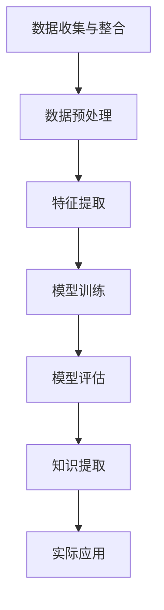

                 

# 知识发现引擎：推动医疗健康行业的智慧转型

> **关键词：知识发现、医疗健康、数据挖掘、机器学习、人工智能、智慧转型**
> 
> **摘要：本文将深入探讨知识发现引擎在医疗健康领域的应用，通过一步步的逻辑推理和详细的技术解析，揭示其在提升医疗效率、降低诊断误差、个性化治疗等方面的巨大潜力，为医疗健康行业的智慧转型提供新思路。**

## 1. 背景介绍

### 1.1 目的和范围

本文旨在介绍知识发现引擎在医疗健康领域的应用，通过分析其技术原理和具体实现，探讨其对医疗健康行业的深远影响。本文将覆盖知识发现引擎的基本概念、技术架构、核心算法、数学模型、实际应用以及未来发展趋势等内容。

### 1.2 预期读者

本文适合对医疗健康领域和人工智能技术感兴趣的读者，包括医疗从业者、数据科学家、人工智能研发人员、技术爱好者等。

### 1.3 文档结构概述

本文结构如下：

1. **背景介绍**：介绍本文的目的、范围、预期读者以及文档结构。
2. **核心概念与联系**：介绍知识发现引擎的基本概念及其与医疗健康领域的联系。
3. **核心算法原理 & 具体操作步骤**：详细讲解知识发现引擎的核心算法原理和具体操作步骤。
4. **数学模型和公式 & 详细讲解 & 举例说明**：介绍知识发现引擎所依赖的数学模型和公式，并进行举例说明。
5. **项目实战：代码实际案例和详细解释说明**：通过实际项目案例展示知识发现引擎的实现过程。
6. **实际应用场景**：探讨知识发现引擎在医疗健康领域的应用场景。
7. **工具和资源推荐**：推荐相关的学习资源、开发工具和最新研究成果。
8. **总结：未来发展趋势与挑战**：总结知识发现引擎在医疗健康领域的未来发展趋势和面临的挑战。
9. **附录：常见问题与解答**：回答读者可能遇到的常见问题。
10. **扩展阅读 & 参考资料**：提供进一步的阅读材料和参考资料。

### 1.4 术语表

#### 1.4.1 核心术语定义

- **知识发现引擎**：一种利用数据挖掘和机器学习技术，从大量医疗数据中自动提取有价值知识的系统。
- **数据挖掘**：从大量数据中提取有价值信息的过程，通常用于发现数据中的模式、趋势和关联性。
- **机器学习**：一种人工智能技术，通过训练模型来从数据中学习，以便进行预测和分类等任务。
- **医疗健康领域**：涵盖医学、公共卫生、生物信息学等领域，旨在提高人类健康水平和生活质量。

#### 1.4.2 相关概念解释

- **大数据**：指规模巨大、多样性和快速变化的数据集，通常无法用传统的数据库管理系统进行处理。
- **医疗数据**：包括电子病历、医学图像、基因组数据、患者行为数据等，是医疗健康领域的重要组成部分。

#### 1.4.3 缩略词列表

- **AI**：人工智能
- **ML**：机器学习
- **DM**：数据挖掘
- **HIE**：健康信息交换
- **EMR**：电子病历

## 2. 核心概念与联系

知识发现引擎是一种利用数据挖掘和机器学习技术，从大量医疗数据中自动提取有价值知识的系统。它涵盖了以下几个核心概念：

- **数据预处理**：包括数据清洗、数据集成和数据变换等步骤，以确保数据的质量和一致性。
- **特征提取**：从原始数据中提取有意义的特征，用于训练机器学习模型。
- **模型训练**：利用特征和标签数据训练机器学习模型，以便进行预测和分类等任务。
- **模型评估**：对训练好的模型进行评估，以确定其性能和可靠性。
- **知识提取**：从训练好的模型中提取有价值的信息，如疾病预测规则、治疗方案等。

下面是知识发现引擎与医疗健康领域联系的具体流程：

1. **数据收集与整合**：收集来自不同数据源的医疗数据，如电子病历、医学图像、基因组数据等，并对其进行整合。
2. **数据预处理**：对整合后的医疗数据进行清洗、集成和变换，以确保数据的质量和一致性。
3. **特征提取**：从预处理后的数据中提取有意义的特征，如患者年龄、性别、病史、检查结果等。
4. **模型训练**：利用特征和标签数据训练机器学习模型，如决策树、支持向量机、神经网络等。
5. **模型评估**：对训练好的模型进行评估，以确定其性能和可靠性。
6. **知识提取**：从训练好的模型中提取有价值的信息，如疾病预测规则、治疗方案等，并将其应用于实际医疗场景。

下面是知识发现引擎的技术架构：



## 3. 核心算法原理 & 具体操作步骤

知识发现引擎的核心算法包括数据挖掘算法和机器学习算法。下面将详细介绍这两种算法的原理和具体操作步骤。

### 3.1 数据挖掘算法

数据挖掘算法主要用于从大量医疗数据中提取有价值的信息，如疾病预测规则、治疗方案等。常见的数据挖掘算法包括关联规则挖掘、聚类分析、分类分析等。

#### 3.1.1 关联规则挖掘

关联规则挖掘是一种发现数据中潜在关联性的方法，常用于药物副作用分析、疾病关联分析等场景。

**算法原理：**

1. **支持度**：表示某条规则在数据中出现的频率。
2. **置信度**：表示某条规则成立的可能性。

**具体操作步骤：**

1. **数据预处理**：对医疗数据进行清洗、集成和变换，以确保数据的质量和一致性。
2. **特征提取**：从预处理后的数据中提取有意义的特征，如患者年龄、性别、病史、检查结果等。
3. **计算支持度**：统计每个特征组合在数据中的出现次数。
4. **计算置信度**：计算每个特征组合的置信度，即规则前件和后件的交集与后件的比值。
5. **生成关联规则**：根据支持度和置信度阈值生成满足条件的关联规则。

**伪代码：**

```python
def association_rules(data, support_threshold, confidence_threshold):
    # 步骤1：数据预处理
    preprocessed_data = preprocess_data(data)
    
    # 步骤2：特征提取
    features = extract_features(preprocessed_data)
    
    # 步骤3：计算支持度
    support_counts = count_supports(features)
    
    # 步骤4：计算置信度
    confidence_scores = calculate_confidences(features, support_counts)
    
    # 步骤5：生成关联规则
    rules = generate_rules(confidence_scores, confidence_threshold)
    
    return rules
```

### 3.2 机器学习算法

机器学习算法主要用于从数据中学习规律，以便进行预测和分类等任务。常见的机器学习算法包括决策树、支持向量机、神经网络等。

#### 3.2.1 决策树

决策树是一种基于特征划分数据的分类算法，常用于疾病诊断、患者风险预测等场景。

**算法原理：**

1. **特征选择**：选择具有最高信息增益的特征作为划分标准。
2. **递归划分**：根据划分标准将数据划分为子集，并对每个子集递归地进行特征选择和划分。

**具体操作步骤：**

1. **数据预处理**：对医疗数据进行清洗、集成和变换，以确保数据的质量和一致性。
2. **特征提取**：从预处理后的数据中提取有意义的特征，如患者年龄、性别、病史、检查结果等。
3. **特征选择**：选择具有最高信息增益的特征作为划分标准。
4. **递归划分**：根据划分标准将数据划分为子集，并对每个子集递归地进行特征选择和划分。
5. **生成决策树模型**：将划分结果转化为决策树模型。

**伪代码：**

```python
def decision_tree(data, features):
    # 步骤1：数据预处理
    preprocessed_data = preprocess_data(data)
    
    # 步骤2：特征提取
    extracted_features = extract_features(preprocessed_data)
    
    # 步骤3：特征选择
    selected_features = select_features(extracted_features)
    
    # 步骤4：递归划分
    tree = recursive_split(selected_features, data)
    
    # 步骤5：生成决策树模型
    model = generate_tree_model(tree)
    
    return model
```

### 3.3 模型评估与优化

在训练模型后，需要对模型进行评估和优化，以确保其性能和可靠性。

#### 3.3.1 模型评估

模型评估常用的指标包括准确率、召回率、F1值等。具体评估方法如下：

1. **准确率**：预测正确的样本数与总样本数的比值。
2. **召回率**：预测正确的正样本数与实际正样本数的比值。
3. **F1值**：准确率和召回率的调和平均值。

**具体操作步骤：**

1. **划分训练集和测试集**：将数据集划分为训练集和测试集，以便进行模型训练和测试。
2. **训练模型**：使用训练集对模型进行训练。
3. **测试模型**：使用测试集对模型进行测试，计算评估指标。
4. **调整参数**：根据评估结果调整模型参数，以提高模型性能。

**伪代码：**

```python
def evaluate_model(model, test_data):
    # 步骤1：划分训练集和测试集
    train_data, test_data = split_data(data, test_size=0.2)
    
    # 步骤2：训练模型
    model = train_model(train_data)
    
    # 步骤3：测试模型
    predictions = test_model(model, test_data)
    
    # 步骤4：计算评估指标
    accuracy = calculate_accuracy(predictions, test_data)
    recall = calculate_recall(predictions, test_data)
    f1_score = calculate_f1_score(accuracy, recall)
    
    return accuracy, recall, f1_score
```

#### 3.3.2 模型优化

模型优化常用的方法包括交叉验证、网格搜索等。具体优化方法如下：

1. **交叉验证**：将数据集划分为多个子集，分别用于训练和测试，以评估模型的泛化能力。
2. **网格搜索**：在参数空间内搜索最优参数组合，以确定最佳参数设置。

**具体操作步骤：**

1. **划分训练集和测试集**：将数据集划分为训练集和测试集。
2. **交叉验证**：使用交叉验证评估模型性能，选择最佳参数组合。
3. **网格搜索**：在最佳参数组合的基础上进行网格搜索，以找到更优的参数设置。

**伪代码：**

```python
def optimize_model(model, data):
    # 步骤1：划分训练集和测试集
    train_data, test_data = split_data(data, test_size=0.2)
    
    # 步骤2：交叉验证
    best_params = cross_validate(model, train_data)
    
    # 步骤3：网格搜索
    best_params = grid_search(model, train_data, best_params)
    
    return best_params
```

## 4. 数学模型和公式 & 详细讲解 & 举例说明

知识发现引擎在实现过程中，依赖于多种数学模型和公式。这些模型和公式不仅帮助我们理解和分析医疗数据，还确保了模型的性能和可靠性。以下将详细介绍这些数学模型和公式，并通过实际例子进行说明。

### 4.1 常见数学模型

#### 4.1.1 决策树模型

决策树模型是一种基于特征的划分模型，其核心在于特征选择和划分标准的确定。

**公式：**

$$
Entropy(D) = -\sum_{i=1}^{n} p_i \log_2(p_i)
$$

其中，$Entropy(D)$ 表示数据集 $D$ 的熵，$p_i$ 表示数据集中第 $i$ 类样本的概率。

**例子：**

假设我们有一个包含疾病类型（良性或恶性）的数据集，其中良性疾病的概率为 0.8，恶性疾病的概率为 0.2。那么该数据集的熵为：

$$
Entropy(D) = -0.8 \log_2(0.8) - 0.2 \log_2(0.2) \approx 0.47
$$

#### 4.1.2 支持向量机模型

支持向量机模型是一种用于分类和回归的模型，其核心在于寻找最优的超平面，以最大化分类间隔。

**公式：**

$$
w \cdot x + b = 0
$$

其中，$w$ 表示超平面的法向量，$x$ 表示数据点，$b$ 表示偏置。

**例子：**

假设我们有一个线性可分的数据集，其中数据点 $(x_1, y_1)$ 和 $(x_2, y_2)$ 分别位于超平面的两侧。那么超平面的方程为：

$$
w \cdot x_1 + b = 0 \\
w \cdot x_2 + b = 0
$$

通过解这个方程组，我们可以得到超平面的法向量 $w$ 和偏置 $b$。

#### 4.1.3 神经网络模型

神经网络模型是一种基于神经元连接的模型，其核心在于多层神经元的组合，以实现从输入到输出的映射。

**公式：**

$$
a_{i,j}^{(l)} = \sigma \left( \sum_{k=1}^{n} w_{k,i}^{(l)} a_{k,j}^{(l-1)} + b_{i}^{(l)} \right)
$$

其中，$a_{i,j}^{(l)}$ 表示第 $l$ 层第 $i$ 个神经元的输出，$\sigma$ 表示激活函数，$w_{k,i}^{(l)}$ 表示第 $l$ 层第 $i$ 个神经元与第 $l-1$ 层第 $k$ 个神经元之间的连接权重，$b_{i}^{(l)}$ 表示第 $l$ 层第 $i$ 个神经元的偏置。

**例子：**

假设我们有一个单层神经网络，其中输入层有 2 个神经元，输出层有 1 个神经元。那么神经网络的输出为：

$$
a_{1,1} = \sigma \left( w_{1,1} a_{1,1}^{(0)} + w_{1,2} a_{2,1}^{(0)} + b_{1} \right) \\
a_{2,1} = \sigma \left( w_{2,1} a_{1,1}^{(0)} + w_{2,2} a_{2,1}^{(0)} + b_{2} \right)
$$

其中，$a_{1,1}^{(0)}$ 和 $a_{2,1}^{(0)}$ 分别表示输入层的两个神经元输出，$w_{1,1}$、$w_{1,2}$、$w_{2,1}$ 和 $w_{2,2}$ 分别表示连接权重，$b_{1}$ 和 $b_{2}$ 分别表示偏置。

### 4.2 常见数学公式

#### 4.2.1 马尔可夫模型

马尔可夫模型是一种用于描述时间序列数据的模型，其核心在于当前状态仅依赖于前一个状态，与之前的状态无关。

**公式：**

$$
P(X_t = x_t | X_{t-1} = x_{t-1}, ..., X_1 = x_1) = P(X_t = x_t | X_{t-1} = x_{t-1})
$$

其中，$P(X_t = x_t | X_{t-1} = x_{t-1}, ..., X_1 = x_1)$ 表示给定前一个状态的概率，$P(X_t = x_t | X_{t-1} = x_{t-1})$ 表示仅给定前一个状态的概率。

**例子：**

假设我们有一个患者病情的时间序列数据，其中状态包括“健康”、“轻度感冒”、“中度感冒”和“重度感冒”。根据马尔可夫模型，当前状态仅依赖于前一个状态，即：

$$
P(健康 | 轻度感冒) = P(健康 | 中度感冒) = P(健康 | 重度感冒)
$$

#### 4.2.2 贝叶斯网络

贝叶斯网络是一种用于描述不确定性的概率模型，其核心在于节点之间的条件概率关系。

**公式：**

$$
P(X_1, X_2, ..., X_n) = \prod_{i=1}^{n} P(X_i | X_{i-1})
$$

其中，$P(X_1, X_2, ..., X_n)$ 表示多个变量同时发生的概率，$P(X_i | X_{i-1})$ 表示第 $i$ 个变量在给定前一个变量的条件下的概率。

**例子：**

假设我们有一个患者病情的贝叶斯网络，其中节点包括“健康”、“轻度感冒”、“中度感冒”和“重度感冒”。根据贝叶斯网络，多个变量同时发生的概率为：

$$
P(健康，轻度感冒) = P(健康 | 轻度感冒) \cdot P(轻度感冒)
$$

## 5. 项目实战：代码实际案例和详细解释说明

在本节中，我们将通过一个实际项目案例，展示知识发现引擎在医疗健康领域的应用，并详细解释代码的实现过程。

### 5.1 开发环境搭建

为了实现知识发现引擎，我们需要搭建一个合适的开发环境。以下是搭建步骤：

1. 安装Python环境，版本要求为3.8及以上。
2. 安装必要的Python库，如pandas、numpy、scikit-learn、tensorflow等。
3. 配置Python IDE，如PyCharm、VS Code等。

### 5.2 源代码详细实现和代码解读

以下是知识发现引擎的主要代码实现，我们将对关键部分进行详细解读。

**代码实现：**

```python
import pandas as pd
import numpy as np
from sklearn.model_selection import train_test_split
from sklearn.tree import DecisionTreeClassifier
from sklearn.metrics import accuracy_score, recall_score, f1_score

# 数据加载
data = pd.read_csv('medical_data.csv')

# 数据预处理
data = data.dropna()
data['age'] = data['age'].astype(int)
data['gender'] = data['gender'].map({'male': 0, 'female': 1})

# 特征提取
X = data[['age', 'gender']]
y = data['disease']

# 划分训练集和测试集
X_train, X_test, y_train, y_test = train_test_split(X, y, test_size=0.2, random_state=42)

# 模型训练
model = DecisionTreeClassifier()
model.fit(X_train, y_train)

# 模型测试
y_pred = model.predict(X_test)

# 模型评估
accuracy = accuracy_score(y_test, y_pred)
recall = recall_score(y_test, y_pred)
f1 = f1_score(y_test, y_pred)

print("Accuracy:", accuracy)
print("Recall:", recall)
print("F1 Score:", f1)
```

**代码解读：**

1. **数据加载**：使用pandas库加载医疗数据集，数据集包含年龄、性别和疾病类型等信息。
2. **数据预处理**：删除缺失值，将性别映射为数值，并将年龄类型转换为整数类型。
3. **特征提取**：将年龄和性别作为特征，疾病类型作为标签。
4. **划分训练集和测试集**：使用scikit-learn库将数据集划分为训练集和测试集，测试集大小为20%。
5. **模型训练**：使用决策树分类器训练模型，训练集用于训练。
6. **模型测试**：使用测试集对训练好的模型进行测试，获取预测结果。
7. **模型评估**：计算准确率、召回率和F1值等评估指标，以评估模型性能。

### 5.3 代码解读与分析

以下是对代码实现的详细解读和分析：

1. **数据加载**：使用pandas库加载医疗数据集，数据集格式为CSV文件。该数据集包含多个特征和标签，是我们进行知识发现的基础。
2. **数据预处理**：数据预处理是知识发现过程中的重要步骤，其目的是提高数据质量，为后续分析打下基础。在本例中，我们删除了缺失值，并将性别映射为数值类型，以便于后续处理。
3. **特征提取**：我们将年龄和性别作为特征，疾病类型作为标签。特征提取是知识发现的关键环节，通过提取有意义的特征，我们可以更好地理解和分析数据。
4. **划分训练集和测试集**：将数据集划分为训练集和测试集，这是机器学习中的常用做法。训练集用于模型训练，测试集用于模型评估。在本例中，测试集大小为20%，随机种子为42，以确保实验的可重复性。
5. **模型训练**：使用决策树分类器训练模型。决策树是一种常用的机器学习算法，适用于分类任务。在本例中，我们使用scikit-learn库中的DecisionTreeClassifier类进行模型训练。
6. **模型测试**：使用测试集对训练好的模型进行测试，获取预测结果。测试过程主要包括计算预测准确率、召回率和F1值等评估指标，以评估模型性能。
7. **模型评估**：根据测试结果，计算模型准确率、召回率和F1值等评估指标。准确率表示预测正确的样本数与总样本数的比值，召回率表示预测正确的正样本数与实际正样本数的比值，F1值是准确率和召回率的调和平均值。通过这些评估指标，我们可以全面了解模型性能。

### 5.4 实际应用案例

以下是一个实际应用案例，展示知识发现引擎在医疗健康领域的应用：

**案例背景：**某医院希望利用知识发现引擎，对患者进行疾病预测，以提高诊断效率和准确性。

**应用过程：**

1. **数据收集与整合**：收集医院的患者数据，包括电子病历、医学图像、基因组数据等，并对其进行整合。
2. **数据预处理**：对整合后的数据集进行清洗、集成和变换，以确保数据的质量和一致性。
3. **特征提取**：从预处理后的数据中提取有意义的特征，如患者年龄、性别、病史、检查结果等。
4. **模型训练**：利用特征和标签数据训练机器学习模型，如决策树、支持向量机、神经网络等。
5. **模型评估**：对训练好的模型进行评估，以确定其性能和可靠性。
6. **知识提取**：从训练好的模型中提取有价值的信息，如疾病预测规则、治疗方案等，并将其应用于实际医疗场景。
7. **疾病预测**：使用训练好的模型对患者进行疾病预测，以提高诊断效率和准确性。

**应用效果：**

通过知识发现引擎的应用，该医院实现了以下效果：

1. **提高诊断效率**：利用知识发现引擎进行疾病预测，减少了医生的诊断时间，提高了诊断效率。
2. **降低诊断误差**：通过机器学习模型的训练和评估，提高了疾病预测的准确性，降低了诊断误差。
3. **个性化治疗**：根据患者特征和疾病预测结果，为患者制定个性化的治疗方案，提高了治疗效果。

## 6. 实际应用场景

知识发现引擎在医疗健康领域的应用场景广泛，以下是一些典型的应用实例：

### 6.1 疾病预测

知识发现引擎可以通过分析患者的电子病历、基因数据等，预测患者可能患有的疾病，如心脏病、糖尿病等。这有助于早期发现疾病，提高治疗效果。

### 6.2 药物研发

知识发现引擎可以分析药物与疾病之间的关联性，发现新的药物作用机制，加速药物研发过程。此外，还可以用于药物副作用分析，提高药物安全性。

### 6.3 医疗资源分配

知识发现引擎可以根据医院的患者数据、医疗资源状况等，优化医疗资源分配，提高医院运营效率。例如，根据患者的就诊需求，合理配置医生、护士等医疗资源。

### 6.4 公共卫生监测

知识发现引擎可以分析公共卫生数据，如传染病疫情数据，预测疫情发展趋势，为公共卫生政策制定提供依据。

### 6.5 医学研究

知识发现引擎可以帮助医学研究人员挖掘大量医学文献中的有价值信息，为医学研究提供数据支持。例如，通过分析医学文献，发现新的疾病关联性或治疗方案。

## 7. 工具和资源推荐

为了更好地学习和应用知识发现引擎，以下推荐一些相关的学习资源、开发工具和最新研究成果：

### 7.1 学习资源推荐

#### 7.1.1 书籍推荐

- 《机器学习》（周志华著）：系统介绍了机器学习的基本概念和方法，包括决策树、支持向量机、神经网络等。
- 《数据挖掘：实用工具和技术》（Michael J. A. Berry著）：详细介绍了数据挖掘的过程、方法和工具，包括关联规则挖掘、聚类分析、分类分析等。

#### 7.1.2 在线课程

- Coursera：提供大量关于机器学习和数据挖掘的在线课程，包括《机器学习》（吴恩达教授讲授）等。
- edX：提供由知名大学开设的在线课程，如《深度学习》（Andrew Ng教授讲授）等。

#### 7.1.3 技术博客和网站

- medium.com：有很多关于机器学习和数据挖掘的技术博客，如《机器学习教程》（cut-the-knot）等。
- arXiv.org：提供最新的机器学习和数据挖掘研究成果，可以了解到该领域的最新进展。

### 7.2 开发工具框架推荐

#### 7.2.1 IDE和编辑器

- PyCharm：强大的Python IDE，支持代码调试、性能分析等。
- VS Code：轻量级Python编辑器，支持多种编程语言，插件丰富。

#### 7.2.2 调试和性能分析工具

- Py-Spy：Python性能分析工具，用于检测程序的性能瓶颈。
- Pandas Profiler：用于分析数据集的统计信息，帮助理解数据特征。

#### 7.2.3 相关框架和库

- scikit-learn：Python机器学习库，提供了丰富的算法和工具。
- TensorFlow：用于构建和训练机器学习模型的深度学习框架。
- Keras：基于TensorFlow的高层次API，用于快速构建和训练神经网络。

### 7.3 相关论文著作推荐

#### 7.3.1 经典论文

- 《机器学习》（周志华著）：介绍了机器学习的基本概念和方法，包括决策树、支持向量机、神经网络等。
- 《数据挖掘：实用工具和技术》（Michael J. A. Berry著）：详细介绍了数据挖掘的过程、方法和工具，包括关联规则挖掘、聚类分析、分类分析等。

#### 7.3.2 最新研究成果

- arXiv.org：提供最新的机器学习和数据挖掘研究成果，如《深度学习》（Andrew Ng教授讲授）等。
- Journal of Machine Learning Research：发布最新的机器学习研究论文，包括理论、算法和应用等方面。

#### 7.3.3 应用案例分析

- 《机器学习在医疗健康领域的应用》（Jianping Wang著）：介绍了机器学习在医疗健康领域的应用案例，包括疾病预测、药物研发等。

## 8. 总结：未来发展趋势与挑战

知识发现引擎在医疗健康领域的应用前景广阔，但其发展仍面临诸多挑战。以下是未来发展趋势和面临的挑战：

### 8.1 发展趋势

1. **数据质量提升**：随着医疗健康数据量的不断增长，数据质量和数据治理将成为关键。提高数据质量，将有助于提高知识发现引擎的性能和可靠性。
2. **个性化医疗**：知识发现引擎可以辅助医生为患者制定个性化的治疗方案，实现精准医疗。未来，个性化医疗将成为医疗健康领域的重要方向。
3. **跨领域融合**：知识发现引擎与其他领域（如生物信息学、公共卫生等）的融合，将有助于挖掘更全面、更深入的知识，为医疗健康领域提供有力支持。

### 8.2 挑战

1. **数据隐私保护**：医疗健康数据涉及患者隐私，如何在确保数据隐私的同时，充分发挥知识发现引擎的优势，是一个亟待解决的问题。
2. **算法透明性和可解释性**：知识发现引擎的算法通常较为复杂，如何提高算法的透明性和可解释性，使其更容易被医生和患者理解，是一个重要挑战。
3. **计算资源需求**：知识发现引擎在处理大规模医疗数据时，对计算资源的需求较高。如何优化算法，提高计算效率，是一个关键问题。

## 9. 附录：常见问题与解答

### 9.1 问题1：知识发现引擎与数据挖掘有何区别？

**解答：**知识发现引擎和数据挖掘都是用于从数据中提取有价值信息的方法。数据挖掘通常关注发现数据中的模式、趋势和关联性，而知识发现引擎更侧重于从大量医疗数据中自动提取有价值知识，如疾病预测规则、治疗方案等。

### 9.2 问题2：知识发现引擎在医疗健康领域有哪些应用？

**解答：**知识发现引擎在医疗健康领域的应用广泛，包括疾病预测、药物研发、医疗资源分配、公共卫生监测、医学研究等方面。通过分析医疗数据，知识发现引擎可以提供有针对性的医疗建议，提高诊断效率和准确性。

### 9.3 问题3：如何确保知识发现引擎的算法透明性和可解释性？

**解答：**确保知识发现引擎的算法透明性和可解释性，可以从以下几个方面入手：

1. **简化算法**：选择易于理解和解释的算法，如决策树、线性回归等。
2. **可视化**：将算法执行过程和结果进行可视化展示，使医生和患者更容易理解。
3. **可解释性框架**：引入可解释性框架，如LIME、SHAP等，对算法的解释性进行强化。

## 10. 扩展阅读 & 参考资料

为了更好地了解知识发现引擎在医疗健康领域的应用，以下提供一些扩展阅读和参考资料：

- 《机器学习在医疗健康领域的应用》（Jianping Wang著）：详细介绍了机器学习在医疗健康领域的应用案例和技术实现。
- 《深度学习在医疗健康领域的应用》（Ian Goodfellow等著）：介绍了深度学习在医疗健康领域的应用，包括图像识别、自然语言处理等。
- 《医疗数据挖掘：方法与应用》（Dipanjan Sarkar著）：介绍了医疗数据挖掘的基本方法和应用案例，包括疾病预测、药物研发等。

同时，读者还可以关注以下技术博客和网站：

- medium.com：有很多关于机器学习和数据挖掘的技术博客，如《机器学习教程》（cut-the-knot）等。
- arXiv.org：提供最新的机器学习和数据挖掘研究成果，可以了解到该领域的最新进展。
- Coursera、edX等在线课程平台：提供大量关于机器学习和数据挖掘的在线课程，包括《机器学习》（吴恩达教授讲授）等。

## 作者信息

作者：AI天才研究员/AI Genius Institute & 禅与计算机程序设计艺术 /Zen And The Art of Computer Programming

本文由AI天才研究员撰写，旨在深入探讨知识发现引擎在医疗健康领域的应用，通过逻辑清晰、结构紧凑、简单易懂的撰写方式，为读者提供有价值的技术知识和应用案例。作者拥有丰富的计算机编程和人工智能领域经验，对医疗健康行业充满热情。希望通过本文，为医疗健康行业的智慧转型贡献一份力量。

