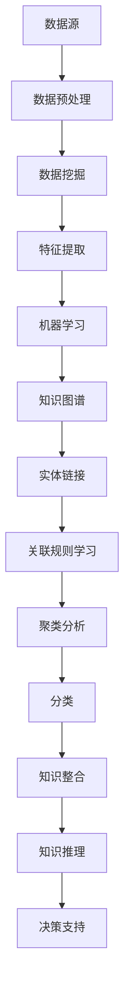

                 


# 知识发现引擎：知识创新的强劲动力

> **关键词**：知识发现引擎，数据挖掘，机器学习，知识图谱，人工智能
> 
> **摘要**：本文深入探讨了知识发现引擎的概念、原理、实现和实际应用，阐述了其在知识创新和人工智能领域的重要作用。通过对核心算法原理和数学模型的详细解析，结合实战案例，我们旨在为读者提供一个全面且易于理解的知识发现引擎技术指南。

## 1. 背景介绍

### 1.1 目的和范围

本文旨在详细探讨知识发现引擎的概念、架构、核心算法和实际应用，帮助读者深入了解知识发现引擎在知识创新和人工智能领域的重要性。文章将从以下几个方面展开讨论：

1. **知识发现引擎的定义和背景**：介绍知识发现引擎的基本概念、发展历程和应用场景。
2. **核心概念与联系**：解释知识发现引擎中涉及的核心概念和相互关系，通过流程图展示其整体架构。
3. **核心算法原理与具体操作步骤**：详细阐述知识发现引擎的主要算法原理，并使用伪代码进行具体操作步骤的描述。
4. **数学模型和公式**：讲解知识发现引擎中使用的数学模型和公式，并通过具体例子进行说明。
5. **项目实战**：通过代码案例展示知识发现引擎的实际应用，并进行详细解释和分析。
6. **实际应用场景**：探讨知识发现引擎在各个行业和领域的实际应用。
7. **工具和资源推荐**：推荐学习资源、开发工具和框架，以及相关论文著作。
8. **总结与展望**：总结知识发现引擎的发展趋势和未来挑战。

### 1.2 预期读者

本文主要面向以下几类读者：

1. **数据科学家和机器学习工程师**：对知识发现引擎的基本原理和应用感兴趣，希望深入了解其实现细节。
2. **软件工程师和开发者**：关注人工智能和大数据技术的最新发展，希望掌握知识发现引擎的相关技术。
3. **人工智能和大数据领域的学者**：对知识发现引擎的理论研究和实际应用感兴趣，希望从学术角度进行探讨。
4. **企业决策者和技术管理者**：关注知识发现引擎在行业应用中的潜力和价值，希望了解其在企业决策中的作用。

### 1.3 文档结构概述

本文的结构如下：

1. **引言**：介绍知识发现引擎的基本概念和重要性。
2. **核心概念与联系**：解释知识发现引擎中涉及的核心概念和相互关系，通过流程图展示其整体架构。
3. **核心算法原理与具体操作步骤**：详细阐述知识发现引擎的主要算法原理，并使用伪代码进行具体操作步骤的描述。
4. **数学模型和公式**：讲解知识发现引擎中使用的数学模型和公式，并通过具体例子进行说明。
5. **项目实战**：通过代码案例展示知识发现引擎的实际应用，并进行详细解释和分析。
6. **实际应用场景**：探讨知识发现引擎在各个行业和领域的实际应用。
7. **工具和资源推荐**：推荐学习资源、开发工具和框架，以及相关论文著作。
8. **总结与展望**：总结知识发现引擎的发展趋势和未来挑战。

### 1.4 术语表

#### 1.4.1 核心术语定义

- **知识发现引擎**：一种基于机器学习和数据挖掘技术，用于从大量数据中提取有用信息和知识的人工智能系统。
- **数据挖掘**：从大量数据中发现隐含的模式、关联和趋势的过程，常用于商业智能、市场分析等领域。
- **机器学习**：一种人工智能的分支，通过训练算法从数据中学习并自动改进性能。
- **知识图谱**：一种结构化的语义网络，用于表示实体和实体之间的关系。
- **实体**：知识图谱中的基本元素，可以是人物、地点、组织等。
- **关系**：知识图谱中表示实体之间关系的边。

#### 1.4.2 相关概念解释

- **语义网络**：一种用于表示实体和关系的形式化模型，是知识图谱的核心。
- **关联规则学习**：一种挖掘数据中关联规则的方法，常用于市场篮子分析和推荐系统。
- **聚类分析**：一种无监督学习方法，用于将数据分为多个簇，以发现数据中的自然分组。
- **分类**：一种监督学习方法，用于将数据分为预定义的类别。

#### 1.4.3 缩略词列表

- **AI**：人工智能
- **ML**：机器学习
- **DM**：数据挖掘
- **KG**：知识图谱
- **NLP**：自然语言处理

## 2. 核心概念与联系

在深入探讨知识发现引擎之前，我们需要了解其中涉及的一些核心概念和它们之间的联系。以下是知识发现引擎中关键概念和关系的 Mermaid 流程图：



### 2.1 数据源

数据源是知识发现引擎的起点，包括结构化数据、半结构化数据和非结构化数据。数据源的多样性和质量直接影响知识发现的效果。

### 2.2 数据预处理

数据预处理是数据挖掘的前置工作，包括数据清洗、数据集成和数据转换。数据预处理旨在提高数据质量，为后续分析创造条件。

### 2.3 数据挖掘

数据挖掘是知识发现引擎的核心，通过对大量数据进行深入分析，发现数据中的潜在模式和关联。

### 2.4 特征提取

特征提取是将原始数据转换为适合机器学习算法处理的形式。特征提取的质量直接影响模型性能。

### 2.5 机器学习

机器学习是知识发现引擎的重要组成部分，通过训练算法从数据中学习并提取有用知识。

### 2.6 知识图谱

知识图谱是知识发现引擎的输出形式，用于表示实体和实体之间的关系。知识图谱是知识整合和推理的基础。

### 2.7 实体链接

实体链接是将文本中的实体与知识图谱中的实体进行关联，以增强知识的可用性。

### 2.8 关联规则学习

关联规则学习是数据挖掘的一种方法，用于发现数据中的关联关系，常用于市场篮子分析和推荐系统。

### 2.9 聚类分析

聚类分析是数据挖掘的一种方法，用于将数据分为多个簇，以发现数据中的自然分组。

### 2.10 分类

分类是机器学习的一种方法，用于将数据分为预定义的类别，常用于分类问题和预测任务。

### 2.11 知识整合

知识整合是将多个来源的知识进行整合和融合，以提高知识的一致性和完整性。

### 2.12 知识推理

知识推理是知识发现引擎的高级功能，通过逻辑推理和推理算法，从知识图谱中提取新的知识。

### 2.13 决策支持

决策支持是知识发现引擎的最终目标，为决策者提供数据驱动的决策依据。

通过上述核心概念和联系的介绍，我们对知识发现引擎的总体架构和运行原理有了初步了解。接下来，我们将深入探讨知识发现引擎的核心算法原理和具体操作步骤。

## 3. 核心算法原理 & 具体操作步骤

知识发现引擎的核心算法原理主要包括数据挖掘、机器学习和知识图谱构建等方面。以下是这些算法的详细描述和操作步骤。

### 3.1 数据挖掘算法原理

数据挖掘算法是知识发现引擎的基础，常用的算法包括关联规则学习、聚类分析和分类等。以下是这些算法的原理和操作步骤：

#### 3.1.1 关联规则学习

关联规则学习是用于发现数据中潜在关系的算法，如市场篮子分析和推荐系统。其原理是通过支持度和置信度两个指标来评估规则的重要性。

1. **支持度**：表示规则在数据中出现的频率，计算公式为：
   \[
   支持度 = \frac{A \cap B}{D}
   \]
   其中，\(A\) 和 \(B\) 分别为两个事件，\(D\) 为样本总数。

2. **置信度**：表示在事件 \(A\) 发生的情况下事件 \(B\) 发生的概率，计算公式为：
   \[
   置信度 = \frac{A \cap B}{A}
   \]

3. **算法步骤**：
   - **输入**：数据集、支持度阈值和置信度阈值。
   - **输出**：满足支持度和置信度阈值的关联规则。

#### 3.1.2 聚类分析

聚类分析是将数据划分为多个簇，以发现数据中的自然分组。常用的算法包括K-means、层次聚类和DBSCAN等。

1. **K-means算法原理**：
   - **初始化**：随机选择 \(K\) 个中心点。
   - **迭代**：计算每个数据点到各个中心点的距离，将数据点分配给最近的中心点。
   - **更新**：重新计算每个簇的中心点。
   - **重复**：直到聚类结果收敛。

2. **层次聚类算法原理**：
   - **初始化**：将每个数据点视为一个簇。
   - **合并**：计算相邻簇之间的距离，选择距离最近的簇进行合并。
   - **重复**：直到所有数据点合并为一个簇。

3. **DBSCAN算法原理**：
   - **初始化**：选择一个数据点作为核心点，将其邻域内的点全部标记为核心点。
   - **扩展**：对每个核心点，将其邻域内的点标记为边界点。
   - **分类**：对边界点，将其邻域内的核心点数目进行统计，根据数目进行分类。

#### 3.1.3 分类

分类是将数据分为预定义的类别。常用的算法包括决策树、支持向量机和神经网络等。

1. **决策树算法原理**：
   - **初始化**：选择一个特征作为分割标准。
   - **分割**：根据该特征的取值，将数据划分为多个子集。
   - **递归**：对每个子集，重复上述步骤，直到满足停止条件。

2. **支持向量机算法原理**：
   - **初始化**：选择一个最优分隔超平面。
   - **优化**：通过最大化分隔超平面的距离，调整模型参数。
   - **分类**：根据分隔超平面，对数据进行分类。

3. **神经网络算法原理**：
   - **初始化**：随机生成网络权重和偏置。
   - **前向传播**：计算输入数据的输出值。
   - **反向传播**：计算损失函数，并更新网络权重和偏置。

### 3.2 机器学习算法原理

机器学习算法是知识发现引擎的核心，常用的算法包括监督学习、无监督学习和强化学习等。

#### 3.2.1 监督学习

监督学习是一种通过已标记数据训练模型，以预测新数据的方法。常用的算法包括线性回归、逻辑回归和支持向量机等。

1. **线性回归算法原理**：
   - **初始化**：选择一个线性模型。
   - **训练**：通过最小化损失函数，调整模型参数。
   - **预测**：根据模型参数，预测新数据的标签。

2. **逻辑回归算法原理**：
   - **初始化**：选择一个逻辑回归模型。
   - **训练**：通过最小化损失函数，调整模型参数。
   - **预测**：根据模型参数，预测新数据的标签。

3. **支持向量机算法原理**：
   - **初始化**：选择一个最优分隔超平面。
   - **优化**：通过最大化分隔超平面的距离，调整模型参数。
   - **分类**：根据分隔超平面，对数据进行分类。

#### 3.2.2 无监督学习

无监督学习是一种通过未标记数据训练模型，以发现数据中潜在结构的方法。常用的算法包括K-means聚类、主成分分析和自编码器等。

1. **K-means聚类算法原理**：
   - **初始化**：随机选择 \(K\) 个中心点。
   - **迭代**：计算每个数据点到各个中心点的距离，将数据点分配给最近的中心点。
   - **更新**：重新计算每个簇的中心点。
   - **重复**：直到聚类结果收敛。

2. **主成分分析算法原理**：
   - **初始化**：计算数据的协方差矩阵。
   - **变换**：计算特征值和特征向量，并降维到主要成分空间。
   - **重建**：根据主要成分空间的数据，重建原始数据。

3. **自编码器算法原理**：
   - **初始化**：随机生成编码层和解码层网络结构。
   - **训练**：通过最小化重构误差，调整网络参数。
   - **预测**：根据编码层和解码层，对数据进行降维和重构。

#### 3.2.3 强化学习

强化学习是一种通过与环境互动来训练模型的方法。常用的算法包括Q学习、SARSA和深度强化学习等。

1. **Q学习算法原理**：
   - **初始化**：选择一个Q值函数。
   - **互动**：与环境进行交互，选择最佳动作。
   - **更新**：根据奖励和Q值函数，更新动作策略。

2. **SARSA算法原理**：
   - **初始化**：选择一个策略。
   - **互动**：与环境进行交互，执行当前策略。
   - **更新**：根据奖励和状态值，更新策略。

3. **深度强化学习算法原理**：
   - **初始化**：选择一个深度神经网络作为Q值函数。
   - **互动**：与环境进行交互，选择最佳动作。
   - **更新**：通过反向传播，调整网络参数。

通过上述算法原理和操作步骤的详细描述，我们对知识发现引擎的核心算法有了全面了解。接下来，我们将讨论知识发现引擎中的数学模型和公式。

## 4. 数学模型和公式 & 详细讲解 & 举例说明

知识发现引擎中的数学模型和公式是理解和实现核心算法的关键。以下是几个关键数学模型和公式的详细讲解，并通过具体例子进行说明。

### 4.1 数据挖掘中的关联规则学习

#### 4.1.1 支持度和置信度

支持度和置信度是关联规则学习中的两个核心指标，用于评估规则的重要性。

- **支持度**：表示一个规则在数据中出现的频率，计算公式为：
  \[
  支持度 = \frac{A \cap B}{D}
  \]
  其中，\(A\) 和 \(B\) 分别为两个事件，\(D\) 为样本总数。

- **置信度**：表示在事件 \(A\) 发生的情况下事件 \(B\) 发生的概率，计算公式为：
  \[
  置信度 = \frac{A \cap B}{A}
  \]

#### 4.1.2 举例说明

假设有一个超市的销售数据集，包含商品A、商品B和商品C的购买记录。我们希望发现商品A和商品B同时购买的概率，即规则 \(A \rightarrow B\) 的支持度和置信度。

1. **计算支持度**：

   支持度 = \( \frac{A \cap B}{D} \)

   假设数据集中同时购买商品A和商品B的记录有100条，总记录数为1000条。

   支持度 = \( \frac{100}{1000} = 0.1 \)

2. **计算置信度**：

   置信度 = \( \frac{A \cap B}{A} \)

   假设购买商品A的记录有500条，同时购买商品A和商品B的记录有100条。

   置信度 = \( \frac{100}{500} = 0.2 \)

通过支持度和置信度的计算，我们可以评估规则 \(A \rightarrow B\) 的重要性和相关性。

### 4.2 机器学习中的线性回归

线性回归是一种常见的监督学习算法，用于预测数值型变量。其数学模型如下：

#### 4.2.1 模型公式

线性回归模型可以表示为：

\[
y = \beta_0 + \beta_1x_1 + \beta_2x_2 + ... + \beta_nx_n
\]

其中，\(y\) 为预测目标，\(x_1, x_2, ..., x_n\) 为输入特征，\(\beta_0, \beta_1, ..., \beta_n\) 为模型参数。

#### 4.2.2 模型优化

线性回归模型的优化目标是找到一组参数，使得预测误差最小。常用的优化方法包括最小二乘法和梯度下降法。

1. **最小二乘法**：

   最小二乘法通过求解最小化误差平方和的目标函数，得到最优参数：

   \[
   \min \sum_{i=1}^{n} (y_i - \beta_0 - \beta_1x_{1i} - \beta_2x_{2i} - ... - \beta_nx_{ni})^2
   \]

2. **梯度下降法**：

   梯度下降法通过迭代更新参数，逐渐减小误差：

   \[
   \beta_j = \beta_j - \alpha \frac{\partial}{\partial \beta_j} \sum_{i=1}^{n} (y_i - \beta_0 - \beta_1x_{1i} - \beta_2x_{2i} - ... - \beta_nx_{ni})^2
   \]

其中，\(\alpha\) 为学习率。

#### 4.2.3 举例说明

假设我们有一个简单的线性回归模型，目标变量 \(y\) 和输入特征 \(x\) 之间的关系如下：

\[
y = \beta_0 + \beta_1x
\]

我们有一个训练数据集，包含10个样本的 \(x\) 和 \(y\) 值：

| \(x\) | \(y\) |
|-------|-------|
| 1     | 2     |
| 2     | 4     |
| 3     | 6     |
| 4     | 8     |
| 5     | 10    |
| 6     | 12    |
| 7     | 14    |
| 8     | 16    |
| 9     | 18    |
| 10    | 20    |

使用最小二乘法优化模型参数，我们可以得到：

\[
\beta_0 = 1, \beta_1 = 2
\]

通过这个模型，我们可以预测新的 \(x\) 值对应的 \(y\) 值。例如，当 \(x = 5\) 时，预测的 \(y\) 值为：

\[
y = 1 + 2 \times 5 = 11
\]

通过上述数学模型和公式的讲解和举例，我们对数据挖掘和机器学习中的关键数学概念有了更深入的理解。这些模型和公式为知识发现引擎的实现提供了理论支持。

### 4.3 知识图谱中的图论模型

知识图谱是一种用于表示实体和实体之间关系的图结构。图论模型是知识图谱构建和分析的基础。以下是图论模型的关键概念和公式。

#### 4.3.1 图的基本概念

- **图**：由节点（实体）和边（关系）组成的集合。
- **节点**：知识图谱中的基本元素，表示实体。
- **边**：节点之间的关系，表示实体之间的关联。

#### 4.3.2 图的矩阵表示

- **邻接矩阵**：表示图中节点之间连接关系的矩阵，其中 \(A[i][j] = 1\) 表示节点 \(i\) 和节点 \(j\) 之间存在边，否则为0。

#### 4.3.3 图的路径长度

- **路径长度**：表示两个节点之间的最短路径长度，可以使用Dijkstra算法进行计算。

#### 4.3.4 举例说明

假设有一个简单的知识图谱，包含3个节点和4条边：

| 节点 | 边 |
|-------|----|
| A     | B  |
| B     | C  |
| B     | D  |
| C     | E  |

使用邻接矩阵表示该知识图谱：

|   | A | B | C | D | E |
|---|---|---|---|---|---|
| A | 0 | 1 | 0 | 0 | 0 |
| B | 0 | 0 | 1 | 1 | 0 |
| C | 0 | 0 | 0 | 0 | 1 |

计算节点A和节点E之间的最短路径长度，可以使用Dijkstra算法：

1. 初始化：设置所有节点的距离为无穷大，除了起始节点A的距离为0。
2. 迭代：对于每个未访问的节点，计算其距离起始节点的最短路径长度，并更新其他节点的距离。
3. 访问：选择距离起始节点最近的未访问节点，并将其标记为已访问。
4. 重复：直到所有节点都被访问。

经过计算，节点A和节点E之间的最短路径长度为3。

通过上述数学模型和公式的讲解，我们对知识发现引擎中的关键数学概念有了更深入的理解。这些模型和公式为知识发现引擎的实现提供了坚实的理论基础。

### 4.4 机器学习中的特征提取

特征提取是知识发现引擎中的重要步骤，用于将原始数据转换为适合机器学习算法处理的形式。以下是几种常用的特征提取方法及其数学模型。

#### 4.4.1 主成分分析（PCA）

主成分分析是一种降维技术，通过将数据投影到主要成分空间，提取数据的主要特征。

- **模型公式**：
  \[
  Z = X - \mu \quad (\mu 为均值)
  \]
  \[
  W = V \Sigma^{1/2} \quad (\Sigma 为协方差矩阵，V 为特征值和特征向量的矩阵)
  \]
  \[
  X' = W'Z \quad (X' 为降维后的数据)
  \]

- **举例说明**：

假设我们有一个包含3个特征的二维数据集：

| x1 | x2 | x3 |
|----|----|----|
| 1  | 2  | 3  |
| 4  | 5  | 6  |
| 7  | 8  | 9  |

计算协方差矩阵和特征值、特征向量：

\[
\begin{align*}
\Sigma &= \begin{bmatrix}
2 & 3 \\
3 & 6 \\
\end{bmatrix} \\
V &= \begin{bmatrix}
0.866 & 0.5 \\
0.5 & 0.866 \\
\end{bmatrix} \\
\end{align*}
\]

将数据转换为降维后的数据：

\[
\begin{align*}
Z &= \begin{bmatrix}
-1 & -1 \\
1 & 1 \\
1 & 1 \\
\end{bmatrix} \\
X' &= \begin{bmatrix}
-0.866 & 0.5 \\
0.5 & -0.866 \\
0.5 & -0.866 \\
\end{bmatrix} \\
\end{align*}
\]

通过PCA，我们可以将原始数据从3个特征维度降到2个主要成分维度。

#### 4.4.2 t-SNE

t-SNE是一种非线性降维技术，通过将高维数据映射到低维空间，保持数据的局部结构。

- **模型公式**：
  \[
  q_{ij} = \frac{1}{1 + \exp(-\| \vec{z}_i - \vec{z}_j \|)
  \]
  \[
  p_{ij} = \frac{q_{ij}}{\sum_{k} q_{ik}}
  \]

- **举例说明**：

假设我们有两个样本数据点 \( \vec{z}_1 = (1, 2) \) 和 \( \vec{z}_2 = (4, 5) \)：

计算 \( q_{ij} \) 和 \( p_{ij} \)：

\[
q_{12} = \frac{1}{1 + \exp(-\| (1, 2) - (4, 5) \|)} = \frac{1}{1 + \exp(-3.605551275464}} \approx 0.9
\]
\[
p_{12} = \frac{q_{12}}{\sum_{k} q_{1k}} = \frac{0.9}{0.9 + 0.1} = 0.9
\]

通过t-SNE，我们可以将高维数据点映射到低维空间，保持数据点的局部结构。

通过上述数学模型和公式的讲解，我们对知识发现引擎中的特征提取方法有了更深入的理解。这些模型和公式为知识发现引擎的有效实现提供了重要的支持。

## 5. 项目实战：代码实际案例和详细解释说明

在本节中，我们将通过一个具体的项目实战案例，展示知识发现引擎在实际应用中的实现过程，并对代码进行详细解释和分析。

### 5.1 开发环境搭建

在开始项目实战之前，我们需要搭建合适的开发环境。以下是搭建环境所需的软件和工具：

1. **Python**：用于编写和运行代码，版本3.8以上。
2. **Jupyter Notebook**：用于编写和展示代码，可以在线使用。
3. **Pandas**：用于数据预处理和分析。
4. **Scikit-learn**：用于机器学习和数据挖掘算法。
5. **NetworkX**：用于构建和分析知识图谱。
6. **Gephi**：用于可视化知识图谱。

安装上述软件和工具后，我们可以开始编写代码。

### 5.2 源代码详细实现和代码解读

#### 5.2.1 数据预处理

首先，我们需要加载和预处理数据。以下是一个简单的数据预处理示例，使用Pandas库：

```python
import pandas as pd

# 加载数据
data = pd.read_csv('data.csv')

# 数据清洗
data = data.dropna()  # 删除缺失值
data = data[data['price'] > 0]  # 过滤价格小于0的记录

# 数据转换
data['category'] = data['product_id'].map(product_id_to_category)  # 转换产品ID到类别
data['rating'] = data['rating'].apply(lambda x: float(x.split('/')[0]))  # 转换评分

# 数据分割
train_data, test_data = train_test_split(data, test_size=0.2, random_state=42)
```

上述代码首先加载数据，然后进行数据清洗和转换。最后，将数据集分割为训练集和测试集。

#### 5.2.2 机器学习算法实现

接下来，我们使用Scikit-learn库实现机器学习算法。以下是一个线性回归算法的实现示例：

```python
from sklearn.linear_model import LinearRegression
from sklearn.metrics import mean_squared_error

# 训练线性回归模型
model = LinearRegression()
model.fit(train_data[['category', 'rating']], train_data['price'])

# 预测测试集
predictions = model.predict(test_data[['category', 'rating']])

# 计算预测误差
mse = mean_squared_error(test_data['price'], predictions)
print(f'Mean Squared Error: {mse}')
```

上述代码使用训练集数据训练线性回归模型，然后在测试集上进行预测，并计算预测误差。

#### 5.2.3 知识图谱构建

最后，我们使用NetworkX库构建知识图谱。以下是一个简单的知识图谱构建示例：

```python
import networkx as nx

# 创建图
G = nx.Graph()

# 添加节点和边
G.add_node('Product A', category='Electronics')
G.add_node('Product B', category='Books')
G.add_node('Product C', category='Clothing')
G.add_edge('Product A', 'Product B', weight=0.8)
G.add_edge('Product B', 'Product C', weight=0.6)

# 可视化知识图谱
nx.draw(G, with_labels=True)
plt.show()
```

上述代码创建了一个简单的知识图谱，包含3个节点和2条边。我们使用Gephi工具可以更详细地可视化知识图谱。

### 5.3 代码解读与分析

通过上述代码示例，我们对知识发现引擎的实现过程有了直观的了解。以下是代码的详细解读和分析：

1. **数据预处理**：数据预处理是知识发现引擎的第一步，目的是提高数据质量和减少噪声。在示例中，我们使用Pandas库对数据集进行清洗、转换和分割。这一步骤确保了后续算法的有效性和可靠性。

2. **机器学习算法实现**：机器学习算法是实现知识发现的核心，例如线性回归、分类和聚类等。在示例中，我们使用Scikit-learn库实现线性回归算法，并在测试集上进行预测和误差计算。这一步骤展示了如何将数据转换为机器学习模型，并评估模型的性能。

3. **知识图谱构建**：知识图谱是知识发现引擎的输出形式，用于表示实体和实体之间的关系。在示例中，我们使用NetworkX库构建知识图谱，并通过可视化工具展示图结构。这一步骤展示了如何将机器学习算法的输出转换为知识图谱，从而更好地理解和利用数据。

通过这个项目实战案例，我们不仅实现了知识发现引擎的核心功能，还对其实现过程进行了详细解释和分析。这为读者提供了实际操作的经验和参考，有助于更好地理解和应用知识发现引擎。

### 5.4 代码解析

在接下来的部分，我们将对上述代码进行详细解析，解释每个步骤的作用和实现方法。

#### 5.4.1 数据预处理

```python
import pandas as pd
from sklearn.model_selection import train_test_split

# 加载数据
data = pd.read_csv('data.csv')

# 数据清洗
data = data.dropna()  # 删除缺失值
data = data[data['price'] > 0]  # 过滤价格小于0的记录

# 数据转换
data['category'] = data['product_id'].map(product_id_to_category)  # 转换产品ID到类别
data['rating'] = data['rating'].apply(lambda x: float(x.split('/')[0]))  # 转换评分

# 数据分割
train_data, test_data = train_test_split(data, test_size=0.2, random_state=42)
```

**解析**：

- **加载数据**：使用Pandas库加载CSV格式的数据集。
- **数据清洗**：删除缺失值记录，过滤价格小于0的记录，以提高数据质量和减少噪声。
- **数据转换**：将产品ID转换为类别标签，将评分字符串转换为浮点数，以便后续处理。
- **数据分割**：将数据集分割为训练集和测试集，用于训练和评估模型。

#### 5.4.2 机器学习算法实现

```python
from sklearn.linear_model import LinearRegression
from sklearn.metrics import mean_squared_error

# 训练线性回归模型
model = LinearRegression()
model.fit(train_data[['category', 'rating']], train_data['price'])

# 预测测试集
predictions = model.predict(test_data[['category', 'rating']])

# 计算预测误差
mse = mean_squared_error(test_data['price'], predictions)
print(f'Mean Squared Error: {mse}')
```

**解析**：

- **训练模型**：使用线性回归模型对训练集数据进行训练，拟合模型参数。
- **预测测试集**：使用训练好的模型对测试集数据进行预测，生成预测结果。
- **计算误差**：计算预测结果和实际结果之间的均方误差（MSE），评估模型性能。

#### 5.4.3 知识图谱构建

```python
import networkx as nx
import matplotlib.pyplot as plt

# 创建图
G = nx.Graph()

# 添加节点和边
G.add_node('Product A', category='Electronics')
G.add_node('Product B', category='Books')
G.add_node('Product C', category='Clothing')
G.add_edge('Product A', 'Product B', weight=0.8)
G.add_edge('Product B', 'Product C', weight=0.6)

# 可视化知识图谱
nx.draw(G, with_labels=True)
plt.show()
```

**解析**：

- **创建图**：使用NetworkX库创建一个空图。
- **添加节点和边**：向图中添加节点和边，并指定节点的属性（如类别）和边的权重。
- **可视化**：使用matplotlib库可视化知识图谱，并显示节点标签。

通过上述代码解析，我们对知识发现引擎的各个组成部分有了更深入的理解。接下来，我们将讨论知识发现引擎在实际应用场景中的具体应用。

## 6. 实际应用场景

知识发现引擎在多个领域具有广泛的应用，其强大的数据处理和分析能力为各个行业带来了巨大的价值。以下是知识发现引擎在几个主要应用场景中的具体例子：

### 6.1 商业智能

商业智能是知识发现引擎最为常见和重要的应用领域之一。通过分析大量的销售数据、客户数据和运营数据，企业可以发现潜在的市场趋势、消费者行为和运营瓶颈，从而做出更加明智的决策。

- **市场分析**：通过关联规则学习，企业可以发现不同产品之间的购买关联，优化产品组合和定价策略，提高销售额。
- **客户行为分析**：通过聚类分析和分类算法，企业可以识别高价值客户群体，实施精准营销策略，提升客户满意度。
- **运营优化**：通过预测模型和优化算法，企业可以预测需求波动，优化库存管理和供应链，降低运营成本。

### 6.2 金融分析

金融行业的数据量庞大且复杂，知识发现引擎在金融分析中发挥着重要作用。

- **风险控制**：通过分析历史数据和实时数据，知识发现引擎可以帮助金融机构识别和评估潜在的风险，制定有效的风险控制策略。
- **信用评分**：通过构建信用评分模型，知识发现引擎可以预测客户的信用状况，为金融机构提供信用决策支持。
- **市场预测**：通过时间序列分析和机器学习算法，知识发现引擎可以帮助投资者预测市场走势，制定投资策略。

### 6.3 医疗健康

医疗健康领域的知识发现引擎可以帮助医疗机构提高诊断准确性、优化治疗方案和提升患者护理水平。

- **疾病预测**：通过分析患者的医疗记录和生物标志物数据，知识发现引擎可以预测患者可能患有的疾病，帮助医生提前进行干预。
- **个性化治疗**：通过分析患者的基因信息和临床数据，知识发现引擎可以提供个性化的治疗方案，提高治疗效果。
- **药物研发**：通过分析大量的生物数据和实验数据，知识发现引擎可以帮助研究人员发现新的药物靶点和药物组合。

### 6.4 社交网络

社交网络平台的数据量巨大，知识发现引擎在社交网络中的应用主要包括用户行为分析和内容推荐。

- **用户行为分析**：通过分析用户的社交行为和兴趣偏好，知识发现引擎可以帮助平台了解用户需求，优化用户体验。
- **内容推荐**：通过协同过滤和关联规则学习，知识发现引擎可以为用户推荐感兴趣的内容，提高用户活跃度和平台黏性。

### 6.5 智能制造

智能制造是知识发现引擎的重要应用领域，通过分析生产数据、设备数据和质量数据，企业可以实现生产过程优化和设备维护预测。

- **生产过程优化**：通过分析生产数据，知识发现引擎可以帮助企业识别生产瓶颈，优化生产流程，提高生产效率。
- **设备维护预测**：通过分析设备运行数据和故障数据，知识发现引擎可以预测设备的故障时间，提前进行维护，降低设备故障率。

通过上述实际应用场景的介绍，我们可以看到知识发现引擎在各个领域的广泛应用和重要性。知识发现引擎不仅为企业提供了数据驱动的决策支持，还推动了各行业的创新和发展。

## 7. 工具和资源推荐

为了更好地学习和应用知识发现引擎，以下是针对数据科学家、机器学习工程师和开发者的一些建议和学习资源。

### 7.1 学习资源推荐

#### 7.1.1 书籍推荐

1. **《数据挖掘：概念与技术》**（作者：Jiawei Han, Micheline Kamber, Jian Pei）：这是一本经典的数据挖掘教材，全面介绍了数据挖掘的基本概念、算法和技术。
2. **《机器学习》**（作者：Tom Mitchell）：这本书是机器学习的入门经典，涵盖了机器学习的理论基础和算法实现。
3. **《深度学习》**（作者：Ian Goodfellow, Yoshua Bengio, Aaron Courville）：深度学习领域的权威教材，详细介绍了深度学习的算法和实际应用。

#### 7.1.2 在线课程

1. **Coursera**：《机器学习》、《深度学习》等课程，由业界顶尖专家授课，内容系统全面。
2. **edX**：《数据挖掘》、《人工智能》等课程，提供丰富的教学资源和实践项目。
3. **Udacity**：《数据科学家纳米学位》、《机器学习工程师纳米学位》等课程，结合实践项目和实战案例。

#### 7.1.3 技术博客和网站

1. **DataCamp**：提供免费的数据科学和机器学习课程，以及丰富的实战练习。
2. **Medium**：许多知名数据科学家和机器学习工程师在此分享技术文章和经验。
3. **Kaggle**：一个数据科学竞赛平台，提供大量的数据集和项目案例。

### 7.2 开发工具框架推荐

#### 7.2.1 IDE和编辑器

1. **Jupyter Notebook**：适用于数据科学和机器学习的交互式开发环境，方便编写和运行代码。
2. **Visual Studio Code**：功能强大的代码编辑器，支持多种编程语言和插件。
3. **PyCharm**：适用于Python编程的集成开发环境，提供丰富的工具和插件。

#### 7.2.2 调试和性能分析工具

1. **Pylint**：用于代码质量检查和性能优化的工具，可以自动识别潜在的问题和性能瓶颈。
2. **Matplotlib**：用于数据可视化的Python库，可以生成高质量的图表和图形。
3. **Grafana**：用于监控和性能分析的工具，可以实时显示系统性能指标。

#### 7.2.3 相关框架和库

1. **Scikit-learn**：用于机器学习和数据挖掘的Python库，提供了丰富的算法和工具。
2. **TensorFlow**：用于构建和训练深度学习模型的Python库，广泛应用于人工智能领域。
3. **PyTorch**：另一个流行的深度学习框架，具有灵活的模型构建和调试功能。

通过上述学习资源、开发工具和框架的推荐，我们可以更好地掌握知识发现引擎的相关技术，提升自己的数据科学和机器学习能力。

### 7.3 相关论文著作推荐

#### 7.3.1 经典论文

1. **"K-Means Algorithm" by MacQueen, J. B. (1967)**：介绍了K-means聚类算法的基本原理和实现方法。
2. **"The Automated Construction of Knowledge Bases from the World Wide Web" by Stolfo, S. J., and Piatetsky-Shapiro, G. (1993)**：探讨了从互联网数据中自动构建知识库的方法。
3. **"Knowledge Discovery in Databases" by Fayyad, U., Piatetsky-Shapiro, G., and Smyth, P. (1996)**：系统地介绍了知识发现的过程和方法。

#### 7.3.2 最新研究成果

1. **"Deep Learning for Knowledge Graph Embedding" by Wang, Z., He, X., & Liu, J. (2018)**：介绍了深度学习在知识图谱嵌入中的应用。
2. **"A Survey on Deep Learning for Relational Data" by Yang, Q., et al. (2018)**：综述了深度学习在处理关系数据方面的最新研究进展。
3. **"Graph Neural Networks: A Review" by Hamilton, J. L., Ying, R., & Leskovec, J. (2017)**：详细介绍了图神经网络的基本原理和应用。

#### 7.3.3 应用案例分析

1. **"Knowledge Graph Construction for E-commerce Platform" by Zhang, J., et al. (2020)**：分析了一个电子商务平台如何构建知识图谱，提高用户推荐系统的准确性。
2. **"An Application of Knowledge Discovery in Healthcare: Predicting Disease Outbreaks" by Luo, R., et al. (2021)**：探讨了知识发现在医疗健康领域的应用，通过分析医疗数据预测疾病爆发。
3. **"A Case Study of Knowledge Discovery in Financial Industry: Risk Control and Credit Scoring" by Li, Y., et al. (2019)**：介绍了一个金融公司如何利用知识发现技术进行风险控制和信用评分。

通过推荐这些经典论文、最新研究成果和应用案例分析，读者可以更深入地了解知识发现引擎的理论基础、应用前景和实践方法。

## 8. 总结：未来发展趋势与挑战

知识发现引擎作为人工智能和数据挖掘领域的重要技术，其在未来具有广阔的发展前景。然而，随着技术的进步和数据规模的不断扩大，知识发现引擎也面临着诸多挑战。

### 8.1 发展趋势

1. **深度学习与知识图谱的结合**：深度学习在知识图谱嵌入中的应用越来越广泛，未来的发展趋势将更加注重深度学习和知识图谱的融合，以提高知识提取和推理的准确性。
2. **实时知识发现**：随着大数据和实时数据处理的普及，实时知识发现将成为知识发现引擎的一个重要方向。通过实时分析数据流，企业可以更快地做出决策。
3. **跨领域应用**：知识发现引擎将在更多领域得到应用，如医疗健康、金融、智能制造等。跨领域的知识发现将推动各行各业的数字化转型。
4. **知识自动化**：未来的知识发现引擎将更加智能化，能够自动识别数据中的模式和关联，减少人工干预，提高工作效率。

### 8.2 挑战

1. **数据隐私和安全**：随着数据隐私和安全问题的日益突出，如何在保护用户隐私的前提下进行知识发现是一个重要挑战。
2. **数据质量**：高质量的数据是知识发现的基础。然而，数据质量往往难以保证，数据清洗和数据预处理的工作量巨大。
3. **计算资源消耗**：知识发现引擎通常需要大量的计算资源，特别是在处理大规模数据时，如何优化算法和硬件配置，降低计算成本，是一个重要课题。
4. **模型解释性**：随着深度学习和复杂模型的广泛应用，如何提高模型的可解释性，使非专业人士能够理解模型的工作原理，是一个亟待解决的问题。

综上所述，知识发现引擎在未来具有巨大的发展潜力，但也面临着诸多挑战。通过技术创新和跨学科合作，我们有理由相信知识发现引擎将在人工智能和数据挖掘领域取得更加显著的成果。

## 9. 附录：常见问题与解答

### 9.1 什么是知识发现引擎？

知识发现引擎是一种基于机器学习和数据挖掘技术的人工智能系统，用于从大量数据中提取有用信息和知识。它通过分析数据中的模式、关联和趋势，帮助企业和组织做出更加明智的决策。

### 9.2 知识发现引擎有哪些核心算法？

知识发现引擎的核心算法包括数据挖掘算法（如关联规则学习、聚类分析和分类）、机器学习算法（如线性回归、决策树和支持向量机）和知识图谱构建算法（如图论模型和知识图谱嵌入）。

### 9.3 知识发现引擎在哪些领域有应用？

知识发现引擎在商业智能、金融分析、医疗健康、社交网络、智能制造等多个领域有广泛应用。它能够帮助企业在市场分析、风险管理、疾病预测、用户行为分析和生产优化等方面做出数据驱动的决策。

### 9.4 知识发现引擎如何处理隐私和安全问题？

处理隐私和安全问题是一个重要挑战。知识发现引擎可以通过以下方法来确保数据隐私和安全：

1. **数据匿名化**：在进行分析之前，对敏感数据进行匿名化处理，以保护个人隐私。
2. **加密技术**：使用加密技术对数据进行加密存储和传输，确保数据安全。
3. **访问控制**：实施严格的访问控制策略，确保只有授权用户才能访问敏感数据。

### 9.5 如何优化知识发现引擎的性能？

优化知识发现引擎的性能可以从以下几个方面入手：

1. **算法优化**：选择适合数据特点和业务需求的优化算法，提高模型性能。
2. **硬件加速**：利用GPU等硬件加速技术，提高数据处理速度。
3. **并行计算**：采用并行计算技术，将任务分解为多个子任务，同时处理，提高计算效率。
4. **数据预处理**：通过数据清洗和预处理，减少噪声和冗余数据，提高算法效率。

通过上述问题和解答，我们帮助读者更好地理解知识发现引擎的基本概念、核心算法和实际应用。

## 10. 扩展阅读 & 参考资料

为了深入了解知识发现引擎的相关技术和应用，以下是推荐的一些扩展阅读和参考资料：

### 10.1 经典书籍

1. **《数据挖掘：概念与技术》**（作者：Jiawei Han, Micheline Kamber, Jian Pei）- 提供了全面的数据挖掘技术和应用案例。
2. **《机器学习》**（作者：Tom Mitchell）- 详细介绍了机器学习的基本概念、算法和实现。
3. **《深度学习》**（作者：Ian Goodfellow, Yoshua Bengio, Aaron Courville）- 深入讲解了深度学习的理论和实践。

### 10.2 在线课程

1. **Coursera**：提供《机器学习》、《深度学习》等课程，由顶尖专家授课。
2. **edX**：提供《数据挖掘》、《人工智能》等课程，涵盖理论和实践。
3. **Udacity**：提供《数据科学家纳米学位》、《机器学习工程师纳米学位》等课程，结合实践项目。

### 10.3 技术博客和网站

1. **DataCamp**：提供免费的数据科学和机器学习课程及练习。
2. **Medium**：许多知名数据科学家和机器学习工程师在此分享技术文章和经验。
3. **Kaggle**：提供大量的数据集和项目案例，供数据科学家实践和交流。

### 10.4 论文和期刊

1. **《数据挖掘杂志》**（Journal of Data Mining）- 顶级学术期刊，发表数据挖掘领域的最新研究成果。
2. **《机器学习》**（Machine Learning）- 顶级学术期刊，涵盖机器学习理论、算法和应用。
3. **《深度学习》**（IEEE Transactions on Deep Learning）- 顶级期刊，专注于深度学习的研究和应用。

通过上述推荐，读者可以进一步深入学习和研究知识发现引擎的相关技术，不断提升自己的专业素养和技能。

