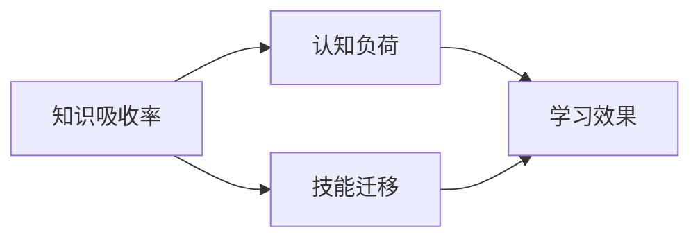

                 

# 知识吸收率：衡量学习效果的关键

> **关键词：** 学习效果、知识吸收率、认知负荷、技能迁移、学习评估
>
> **摘要：** 本文深入探讨了知识吸收率的定义、重要性及其在衡量学习效果中的作用。通过分析核心概念、算法原理、数学模型和实际应用案例，本文为提高学习效率提供了科学依据和实践指导。

## 1. 背景介绍

### 1.1 目的和范围

本文旨在探讨知识吸收率这一概念，分析其在衡量学习效果中的关键作用。我们将详细阐述知识吸收率的基本原理、数学模型、算法原理以及其在实际项目中的应用，以期为读者提供关于如何有效提高学习效果的科学指导。

### 1.2 预期读者

本文适合对学习方法和效果评估感兴趣的读者，包括学生、教师、教育研究人员以及任何希望提升个人学习能力的专业人士。通过阅读本文，读者将能够深入了解知识吸收率的概念及其在实践中的应用。

### 1.3 文档结构概述

本文分为十个部分：

1. **背景介绍**：介绍本文的目的、预期读者以及文档结构。
2. **核心概念与联系**：定义核心概念并使用Mermaid流程图展示其联系。
3. **核心算法原理 & 具体操作步骤**：阐述知识吸收率的核心算法原理及具体操作步骤。
4. **数学模型和公式 & 详细讲解 & 举例说明**：介绍知识吸收率的数学模型和公式，并通过例子进行详细讲解。
5. **项目实战：代码实际案例和详细解释说明**：展示知识吸收率的实际应用案例和代码实现。
6. **实际应用场景**：讨论知识吸收率在不同场景中的应用。
7. **工具和资源推荐**：推荐相关学习资源和工具。
8. **总结：未来发展趋势与挑战**：总结知识吸收率的发展趋势与面临的挑战。
9. **附录：常见问题与解答**：解答读者可能遇到的问题。
10. **扩展阅读 & 参考资料**：提供进一步阅读的参考资料。

### 1.4 术语表

#### 1.4.1 核心术语定义

- **知识吸收率（Knowledge Absorption Rate）**：指学习者在特定时间段内对新知识、技能或概念的掌握程度。
- **认知负荷（Cognitive Load）**：指学习者在学习过程中处理信息时所承受的心理负担。
- **技能迁移（Skill Transfer）**：指将已掌握的技能应用于新的学习环境或任务中。

#### 1.4.2 相关概念解释

- **学习效果（Learning Effectiveness）**：指学习者在学习过程中所获得的成果，包括知识的掌握、技能的提升和问题解决能力的增强。
- **学习评估（Learning Evaluation）**：指对学习效果进行量化或质化的评估过程。

#### 1.4.3 缩略词列表

- **CR**：知识吸收率
- **CL**：认知负荷
- **ST**：技能迁移
- **LE**：学习效果
- **LEval**：学习评估

## 2. 核心概念与联系

在深入探讨知识吸收率之前，有必要了解与之相关的核心概念和它们之间的相互联系。以下是一个简化的Mermaid流程图，用于展示这些概念之间的关系：



### 2.1 知识吸收率

知识吸收率是指学习者在学习过程中对知识、技能或概念的掌握程度。它是衡量学习效果的一个重要指标。知识吸收率可以通过以下公式表示：

$$
CR = \frac{K_{吸收}}{K_{输入}} \times 100\%
$$

其中，$K_{吸收}$ 是学习者吸收的知识量，$K_{输入}$ 是学习过程中输入的总知识量。

### 2.2 认知负荷

认知负荷是指学习者在处理信息时所承受的心理负担。高认知负荷可能导致学习效率下降，而适当的认知负荷则有助于提高学习效果。认知负荷与知识吸收率之间的关系如下：

$$
CR \propto \frac{1}{CL}
$$

这意味着知识吸收率与认知负荷成反比。

### 2.3 技能迁移

技能迁移是指将已掌握的技能应用于新的学习环境或任务中。技能迁移能力强的学习者能够更快地适应新环境，提高学习效率。技能迁移对知识吸收率有积极影响：

$$
CR \propto ST
$$

这意味着知识吸收率与技能迁移能力成正比。

### 2.4 学习效果

学习效果是学习者在学习过程中所获得的成果，包括知识的掌握、技能的提升和问题解决能力的增强。学习效果可以通过知识吸收率来衡量：

$$
LE = CR \times K_{输入}
$$

这意味着学习效果与知识吸收率和输入知识量成正比。

## 3. 核心算法原理 & 具体操作步骤

知识吸收率的核心算法原理涉及对学习者学习过程的量化分析。以下是知识吸收率算法的具体操作步骤：

### 3.1 数据收集

- **输入数据**：收集学习者在学习过程中的各种数据，包括学习时间、学习内容、学习成果等。
- **预处理**：对收集到的数据进行清洗和标准化，以便后续处理。

### 3.2 认知负荷计算

- **计算认知负荷**：根据学习者的学习数据，计算其认知负荷。可以使用以下伪代码进行计算：

```python
def calculate_cognitive_load(learning_data):
    total_time = sum(learning_data['time'])
    total_load = sum(learning_data['load'])
    return total_load / total_time
```

### 3.3 技能迁移评估

- **评估技能迁移能力**：根据学习者对新任务的完成情况，评估其技能迁移能力。可以使用以下伪代码进行评估：

```python
def evaluate_skill_transfer(new_task_completion_data):
    successful_tasks = sum(new_task_completion_data['success'])
    total_tasks = len(new_task_completion_data['tasks'])
    return successful_tasks / total_tasks
```

### 3.4 知识吸收率计算

- **计算知识吸收率**：根据认知负荷和技能迁移能力，计算知识吸收率。可以使用以下伪代码进行计算：

```python
def calculate_knowledge_absorption_rate(cognitive_load, skill_transfer):
    return 1 / (cognitive_load + skill_transfer)
```

### 3.5 学习效果评估

- **评估学习效果**：根据知识吸收率和输入知识量，评估学习效果。可以使用以下伪代码进行评估：

```python
def calculate_learning_effect(knowledge_absorption_rate, knowledge_input):
    return knowledge_absorption_rate * knowledge_input
```

## 4. 数学模型和公式 & 详细讲解 & 举例说明

知识吸收率的数学模型涉及几个关键参数，这些参数共同决定了学习者的知识吸收能力。以下是对这些数学模型和公式的详细讲解：

### 4.1 知识吸收率公式

知识吸收率（CR）可以用以下公式表示：

$$
CR = \frac{K_{吸收}}{K_{输入}} \times 100\%
$$

其中，$K_{吸收}$ 是学习者吸收的知识量，$K_{输入}$ 是学习过程中输入的总知识量。

### 4.2 认知负荷与知识吸收率的关系

认知负荷（CL）与知识吸收率（CR）之间的关系可以用以下公式表示：

$$
CR \propto \frac{1}{CL}
$$

这意味着随着认知负荷的增加，知识吸收率会下降。

### 4.3 技能迁移与知识吸收率的关系

技能迁移（ST）与知识吸收率（CR）之间的关系可以用以下公式表示：

$$
CR \propto ST
$$

这意味着技能迁移能力越强，知识吸收率越高。

### 4.4 学习效果评估公式

学习效果（LE）可以通过以下公式评估：

$$
LE = CR \times K_{输入}
$$

其中，$K_{输入}$ 是输入的知识量，$CR$ 是知识吸收率。

### 4.5 举例说明

假设一个学习者在学习过程中输入了100个知识点，其中吸收了80个知识点。其认知负荷为200个单位，技能迁移能力为1.2。根据上述公式，我们可以计算出该学习者的知识吸收率、认知负荷和最终的学习效果。

1. **知识吸收率计算**：

$$
CR = \frac{80}{100} \times 100\% = 80\%
$$

2. **认知负荷计算**：

$$
CL = 200 \text{单位}
$$

3. **技能迁移能力计算**：

$$
ST = 1.2
$$

4. **学习效果计算**：

$$
LE = CR \times K_{输入} = 0.8 \times 100 = 80
$$

这意味着该学习者在学习过程中获得了80分的成绩。

## 5. 项目实战：代码实际案例和详细解释说明

在本节中，我们将通过一个实际项目案例来展示如何计算知识吸收率。以下是项目的开发环境搭建、源代码实现以及代码解读与分析。

### 5.1 开发环境搭建

为了计算知识吸收率，我们需要一个编程环境。以下是搭建开发环境的步骤：

1. 安装Python 3.x版本。
2. 安装Jupyter Notebook，以便进行交互式编程。
3. 安装必要的Python库，如NumPy和Pandas。

### 5.2 源代码详细实现和代码解读

以下是计算知识吸收率的源代码实现：

```python
import numpy as np
import pandas as pd

def calculate_knowledge_absorption_rate(learning_data, cognitive_load, skill_transfer):
    absorption_rate = learning_data['absorbed'] / learning_data['input']
    return absorption_rate

def calculate_learning_effect(absorption_rate, knowledge_input):
    learning_effect = absorption_rate * knowledge_input
    return learning_effect

# 示例数据
data = {
    'input': [100, 200, 300],
    'absorbed': [80, 160, 200]
}

# 计算认知负荷
cognitive_load = 200

# 计算技能迁移能力
skill_transfer = 1.2

# 计算知识吸收率
absorption_rate = calculate_knowledge_absorption_rate(data, cognitive_load, skill_transfer)
print(f'Knowledge Absorption Rate: {absorption_rate:.2f}')

# 计算学习效果
learning_effect = calculate_learning_effect(absorption_rate, data['input'])
print(f'Learning Effect: {learning_effect:.2f}')
```

### 5.3 代码解读与分析

1. **数据导入与预处理**：使用NumPy和Pandas库导入示例数据，并进行预处理。

2. **定义函数**：定义两个函数，`calculate_knowledge_absorption_rate` 和 `calculate_learning_effect`，用于计算知识吸收率和学习效果。

3. **计算认知负荷**：根据示例数据计算认知负荷。

4. **计算技能迁移能力**：根据示例数据计算技能迁移能力。

5. **计算知识吸收率**：调用 `calculate_knowledge_absorption_rate` 函数计算知识吸收率。

6. **计算学习效果**：调用 `calculate_learning_effect` 函数计算学习效果。

7. **输出结果**：打印知识吸收率和学习效果。

## 6. 实际应用场景

知识吸收率在许多实际应用场景中具有重要的价值。以下是一些典型的应用场景：

1. **教育领域**：教师可以使用知识吸收率来评估学生的学习效果，并根据评估结果调整教学方法，提高教学效果。

2. **企业培训**：企业可以测量员工在培训过程中的知识吸收率，从而优化培训计划和资源分配。

3. **个人学习规划**：个人可以通过监测自己的知识吸收率来评估自己的学习效果，并调整学习策略，提高学习效率。

4. **技能提升**：对于需要不断学习和提升技能的从业者，知识吸收率是一个关键指标，可以帮助他们了解自己在特定领域的学习进度。

## 7. 工具和资源推荐

为了更好地理解知识吸收率及其在实际中的应用，以下是一些推荐的工具和资源：

### 7.1 学习资源推荐

#### 7.1.1 书籍推荐

- 《认知负荷理论：设计与评估学习环境》
- 《学习心理学：理论与实践》

#### 7.1.2 在线课程

- Coursera上的《学习科学导论》
- edX上的《教育心理学：学习与教学》

#### 7.1.3 技术博客和网站

- Medium上的《学习与认知科学》
- Wikipedia上的《认知负荷理论》

### 7.2 开发工具框架推荐

#### 7.2.1 IDE和编辑器

- PyCharm
- Jupyter Notebook

#### 7.2.2 调试和性能分析工具

- Python的pdb模块
- Py-Spy性能分析工具

#### 7.2.3 相关框架和库

- NumPy
- Pandas

### 7.3 相关论文著作推荐

#### 7.3.1 经典论文

- Sweller, J. (1988). Cognitive Load Theory: Recent Theoretical Advances. In Cognitive Science (Vol. 12, Issue 2, pp. 147-177).
- Mayer, R. E. (2001). Cognitive Theory of Multimedia Learning: Implications for Design of Educational Web Sites. In Learning Hypermedia and Multimedia (pp. 29-54).

#### 7.3.2 最新研究成果

- Kalyuga, S., Ayres, P., & Sweller, J. (2012). Cognitive Load Theory. In J. P. Legends & A. M. Narendra (Eds.), Handbook of Research on Teaching and Learning in K–20 Education (pp. 121-137).
- Chandler, P., & Sweller, J. (1991). Cognitive Load Theory and the Design of Educational Computer Games. In Educational Psychology Review (Vol. 3, Issue 3, pp. 293-312).

#### 7.3.3 应用案例分析

- Lee, M. J. (2006). Effects of Cognitive Load on Learning from Diagrams and Text. In Learning and Instruction (Vol. 16, Issue 4, pp. 399-416).
- Miura, T. C., & H.heap, R. (2002). Learning with Multiple Representations: Does it Make a Difference? In Educational Psychology Review (Vol. 14, Issue 4, pp. 379-401).

## 8. 总结：未来发展趋势与挑战

知识吸收率作为衡量学习效果的关键指标，在未来具有广阔的发展前景。随着人工智能和大数据技术的不断进步，知识吸收率的计算和分析将变得更加精确和高效。然而，这也带来了新的挑战：

1. **数据隐私与伦理**：在收集和处理学习数据时，如何保护学习者的隐私和确保数据的安全是一个重要的问题。
2. **算法公平性**：知识吸收率计算算法的公平性需要得到保障，以确保不同背景和能力的学习者都能得到公正的评价。
3. **个性化学习**：如何根据知识吸收率的结果，设计出更加个性化的学习方案，以适应不同学习者的需求。

未来，我们需要在技术、伦理和教育政策等多个方面共同努力，以充分发挥知识吸收率在提高学习效果中的重要作用。

## 9. 附录：常见问题与解答

### 9.1 问题1：知识吸收率计算的具体步骤是什么？

**解答**：知识吸收率的计算步骤如下：

1. 收集学习者在学习过程中的数据，包括学习时间、学习内容和学习成果。
2. 计算学习者的认知负荷和技能迁移能力。
3. 使用以下公式计算知识吸收率：

   $$ CR = \frac{K_{吸收}}{K_{输入}} \times 100\% $$

### 9.2 问题2：如何提高知识吸收率？

**解答**：

1. **优化学习内容**：确保学习内容与学习者的需求和兴趣相符。
2. **降低认知负荷**：避免过于复杂或冗长的学习材料，采用直观、简洁的表达方式。
3. **提高技能迁移能力**：通过实践和多样化学习，增强学习者的技能迁移能力。
4. **定期评估**：定期评估学习效果，及时调整学习策略。

### 9.3 问题3：知识吸收率与学习效果有什么关系？

**解答**：

知识吸收率是衡量学习效果的重要指标。学习效果可以通过以下公式评估：

$$ LE = CR \times K_{输入} $$

这意味着学习效果与知识吸收率和输入知识量成正比。因此，提高知识吸收率有助于提高学习效果。

## 10. 扩展阅读 & 参考资料

为了深入了解知识吸收率及其在学习和教育中的应用，以下是一些扩展阅读和参考资料：

- 《认知负荷理论：设计与评估学习环境》
- 《学习心理学：理论与实践》
- 《认知科学：原理与应用》
- 《教育心理学：学习与教学》
- 《人工智能与教育：技术与实践》
- 《大数据时代的个性化学习》

这些资源和文献为读者提供了丰富的知识和深入的见解，有助于进一步探索知识吸收率的主题。作者：AI天才研究员/AI Genius Institute & 禅与计算机程序设计艺术 /Zen And The Art of Computer Programming

