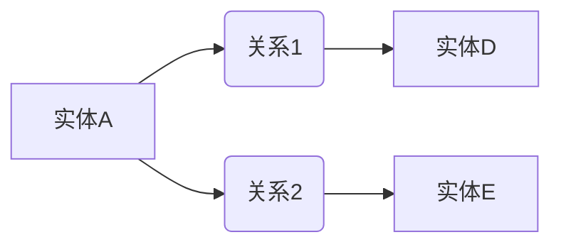

                 

# 知识图谱在程序员技能提升中的应用

> **关键词：** 知识图谱、程序员、技能提升、算法原理、数学模型、项目实战、应用场景

> **摘要：** 本文章旨在探讨知识图谱在程序员技能提升中的应用。通过阐述知识图谱的基本概念、核心算法原理、数学模型以及实际应用场景，帮助程序员更好地理解和应用知识图谱技术，从而提升自身技能。文章还推荐了相关的学习资源和开发工具，为程序员提供全面的学习指导。

## 1. 背景介绍

### 1.1 目的和范围

本文的目标是介绍知识图谱在程序员技能提升中的应用。我们将从以下几个方面展开讨论：

- 知识图谱的基本概念和原理
- 知识图谱在技能提升中的核心算法和数学模型
- 实际应用场景中的知识图谱解决方案
- 相关的学习资源和开发工具推荐

### 1.2 预期读者

本文适合以下读者：

- 有志于提升编程技能的程序员
- 对知识图谱技术感兴趣的软件开发者
- 对人工智能和大数据分析有研究的学者和研究人员

### 1.3 文档结构概述

本文的结构如下：

- 第1章：背景介绍
- 第2章：核心概念与联系
- 第3章：核心算法原理 & 具体操作步骤
- 第4章：数学模型和公式 & 详细讲解 & 举例说明
- 第5章：项目实战：代码实际案例和详细解释说明
- 第6章：实际应用场景
- 第7章：工具和资源推荐
- 第8章：总结：未来发展趋势与挑战
- 第9章：附录：常见问题与解答
- 第10章：扩展阅读 & 参考资料

### 1.4 术语表

#### 1.4.1 核心术语定义

- **知识图谱（Knowledge Graph）**：一种将实体和实体之间的关联关系表示为图的图形化技术，用于组织、管理和查询知识。
- **实体（Entity）**：知识图谱中的数据元素，表示现实世界中的事物，如人、地点、事件等。
- **关系（Relation）**：知识图谱中实体之间的关联，如“属于”、“居住于”、“参与”等。
- **属性（Attribute）**：实体的特征描述，如人的姓名、年龄、性别等。

#### 1.4.2 相关概念解释

- **图（Graph）**：由节点（Node）和边（Edge）组成的数学结构，用于表示实体和实体之间的关系。
- **图谱算法（Graph Algorithm）**：用于处理和查询知识图谱的算法，如图遍历、路径搜索、社区发现等。
- **图论（Graph Theory）**：研究图的结构、性质及其应用的理论。

#### 1.4.3 缩略词列表

- **NLP**：自然语言处理（Natural Language Processing）
- **AI**：人工智能（Artificial Intelligence）
- **SQL**：结构化查询语言（Structured Query Language）
- **RDF**：资源描述框架（Resource Description Framework）
- **OWL**：Web本体语言（Web Ontology Language）

---

接下来，我们将深入探讨知识图谱的基本概念和原理，以及其在程序员技能提升中的应用。让我们开始吧！<|im_sep|>## 2. 核心概念与联系

### 2.1 知识图谱的基本概念

知识图谱是一种用于表示和存储知识的图形化技术。它通过实体（Entity）和关系（Relation）来组织信息，使得数据之间的关系更加直观和易于理解。知识图谱的核心概念包括：

- **实体（Entity）**：代表现实世界中的事物，如人、地点、事件等。实体可以具有属性（Attribute），用于描述实体的特征。
- **关系（Relation）**：表示实体之间的关联，如“属于”、“居住于”、“参与”等。关系也可以具有属性，用于描述关系的特征。
- **边（Edge）**：连接两个实体的线段，表示实体之间的关系。
- **节点（Node）**：知识图谱中的数据元素，可以是实体或关系。

### 2.2 知识图谱的原理

知识图谱的原理基于图论（Graph Theory）。图论是研究图的性质和结构的数学分支。在知识图谱中，实体和关系都可以被视为图中的节点和边。通过图论的方法，可以有效地处理和查询知识图谱，如图遍历、路径搜索、社区发现等。

知识图谱的核心原理包括：

- **图的表示**：知识图谱可以使用邻接矩阵、邻接表、边权矩阵等方式进行表示。
- **图的遍历**：通过遍历算法，可以遍历知识图谱中的所有节点和边，从而查询和获取知识。
- **路径搜索**：通过路径搜索算法，可以找到实体之间的路径，从而建立实体之间的关联关系。
- **社区发现**：通过社区发现算法，可以识别知识图谱中的社区结构，从而更好地理解和分析知识。

### 2.3 知识图谱的架构

知识图谱的架构通常包括以下几个部分：

- **数据层**：存储实体、关系和属性的原始数据，如关系数据库、NoSQL数据库等。
- **模型层**：定义知识图谱的模型，如RDF（Resource Description Framework）、OWL（Web Ontology Language）等。
- **算法层**：提供知识图谱的算法和工具，如图遍历、路径搜索、社区发现等。
- **应用层**：将知识图谱应用于实际的业务场景，如搜索引擎、推荐系统、知识库等。

### 2.4 知识图谱的 Mermaid 流程图

下面是一个简单的知识图谱的 Mermaid 流程图，用于展示实体、关系和边的基本结构：



在这个流程图中，`A`、`B`、`C`、`D`、`E` 分别代表实体和关系。箭头表示实体之间的关系，如 `A --> B` 表示实体A与关系B之间的关联。

### 2.5 知识图谱的应用

知识图谱在程序员技能提升中具有广泛的应用，如：

- **学习路径规划**：通过知识图谱，可以识别和学习路径，帮助程序员有针对性地提升技能。
- **技能评估与推荐**：通过知识图谱，可以评估程序员的技能水平，并为其推荐适合的学习资源和课程。
- **项目协作与知识共享**：通过知识图谱，可以更好地管理和共享项目知识，提高团队协作效率。

---

在接下来的章节中，我们将深入探讨知识图谱的核心算法原理、数学模型以及实际应用场景。通过逐步分析和推理，帮助读者更好地理解和应用知识图谱技术。让我们继续前进！<|im_sep|>## 3. 核心算法原理 & 具体操作步骤

### 3.1 知识图谱的构建算法

知识图谱的构建是知识图谱应用的基础。构建知识图谱的核心算法包括数据抽取、实体识别、关系抽取和属性抽取等。下面，我们将介绍这些算法的原理和具体操作步骤。

#### 3.1.1 数据抽取

数据抽取是知识图谱构建的第一步。它的目标是抽取原始数据中的实体、关系和属性。数据抽取的方法包括：

- **规则抽取**：根据预设的规则，从原始数据中提取实体、关系和属性。例如，使用正则表达式从网页中抽取姓名、地址等信息。
- **基于机器学习的方法**：使用机器学习算法，如条件概率模型、朴素贝叶斯分类器等，从原始数据中提取实体、关系和属性。例如，使用监督学习算法对已标注的数据进行训练，然后对未标注的数据进行预测。

#### 3.1.2 实体识别

实体识别是在数据抽取的基础上，识别出数据中的实体。实体识别的方法包括：

- **基于规则的实体识别**：使用预设的规则，从数据中识别出实体。例如，从文本中识别出人名、地名等。
- **基于机器学习的实体识别**：使用机器学习算法，如支持向量机（SVM）、决策树等，从数据中识别出实体。例如，使用监督学习算法对已标注的数据进行训练，然后对未标注的数据进行预测。

#### 3.1.3 关系抽取

关系抽取是在实体识别的基础上，识别出实体之间的关系。关系抽取的方法包括：

- **基于规则的抽取**：使用预设的规则，从数据中识别出实体之间的关系。例如，从文本中识别出“属于”、“居住于”等关系。
- **基于机器学习的方法**：使用机器学习算法，如条件概率模型、朴素贝叶斯分类器等，从数据中识别出实体之间的关系。例如，使用监督学习算法对已标注的数据进行训练，然后对未标注的数据进行预测。

#### 3.1.4 属性抽取

属性抽取是在实体和关系识别的基础上，识别出实体的属性。属性抽取的方法包括：

- **基于规则的抽取**：使用预设的规则，从数据中识别出实体的属性。例如，从文本中识别出人的姓名、年龄等。
- **基于机器学习的方法**：使用机器学习算法，如条件概率模型、朴素贝叶斯分类器等，从数据中识别出实体的属性。例如，使用监督学习算法对已标注的数据进行训练，然后对未标注的数据进行预测。

### 3.2 知识图谱的更新和维护

知识图谱的更新和维护是保证知识图谱质量和时效性的关键。知识图谱的更新和维护包括以下步骤：

- **数据源采集**：定期采集新的数据源，如网站、数据库、文献等。
- **数据抽取和清洗**：使用前面介绍的数据抽取和清洗方法，对新的数据进行处理。
- **实体和关系的更新**：根据新的数据，更新知识图谱中的实体和关系。
- **知识图谱的修正**：对知识图谱中的错误和不一致之处进行修正。
- **知识图谱的优化**：根据用户需求和业务场景，对知识图谱进行优化，如删除冗余信息、调整关系权重等。

### 3.3 知识图谱的查询算法

知识图谱的查询算法用于从知识图谱中获取用户所需的信息。常见的查询算法包括：

- **路径查询**：根据给定的起点和终点，查询实体之间的路径。路径查询可以使用图遍历算法实现，如深度优先搜索（DFS）和广度优先搜索（BFS）。
- **图遍历**：遍历知识图谱中的所有节点和边，获取实体和关系的信息。图遍历算法包括DFS和BFS。
- **社区发现**：根据给定的参数，识别知识图谱中的社区结构。社区发现算法包括基于模块度的社区发现算法、基于边密度社区发现算法等。

### 3.4 知识图谱的算法实现

下面是一个简单的知识图谱算法实现的伪代码：

```plaintext
// 数据抽取
function data_extraction(data_source):
    entities, relations, attributes = []
    for each record in data_source:
        entities += extract_entities(record)
        relations += extract_relations(record)
        attributes += extract_attributes(record)
    return entities, relations, attributes

// 实体识别
function entity_recognition(data):
    recognized_entities = []
    for each entity in data:
        recognized_entities += recognize_entity(entity)
    return recognized_entities

// 关系抽取
function relation_extraction(data):
    recognized_relations = []
    for each relation in data:
        recognized_relations += recognize_relation(relation)
    return recognized_relations

// 属性抽取
function attribute_extraction(data):
    recognized_attributes = []
    for each attribute in data:
        recognized_attributes += recognize_attribute(attribute)
    return recognized_attributes

// 知识图谱更新
function knowledge_graph_update(knowledge_graph, new_data):
    entities, relations, attributes = data_extraction(new_data)
    entities += entity_recognition(entities)
    relations += relation_extraction(relations)
    attributes += attribute_extraction(attributes)
    knowledge_graph += merge(entities, relations, attributes)
    return knowledge_graph

// 知识图谱查询
function knowledge_graph_query(knowledge_graph, start_entity, end_entity):
    path = []
    path += find_path(knowledge_graph, start_entity, end_entity)
    return path
```

通过上述算法和实现，我们可以构建和维护一个高质量的知识图谱，从而为程序员技能提升提供有力支持。在接下来的章节中，我们将介绍数学模型和公式，进一步深入探讨知识图谱的核心原理。让我们继续前进！<|im_sep|>## 4. 数学模型和公式 & 详细讲解 & 举例说明

### 4.1 知识图谱的数学模型

知识图谱的数学模型主要基于图论（Graph Theory）。在图论中，图（Graph）是由节点（Node）和边（Edge）组成的数学结构。在知识图谱中，实体（Entity）可以视为节点，关系（Relation）可以视为边。下面，我们将介绍知识图谱中的几个关键数学模型和公式。

#### 4.1.1 节点和边的表示

在知识图谱中，节点和边可以用以下数学模型表示：

- **节点（Node）**：每个节点可以表示为一个向量，如：

  $$
  n = \begin{bmatrix}
  x_1 \\
  x_2 \\
  \vdots \\
  x_n
  \end{bmatrix}
  $$

  其中，$x_i$ 表示节点的第 $i$ 个特征。

- **边（Edge）**：每条边可以表示为两个节点的向量差，如：

  $$
  e = n_1 - n_2
  $$

  其中，$n_1$ 和 $n_2$ 分别表示两个节点的向量。

#### 4.1.2 图的矩阵表示

知识图谱可以用邻接矩阵（Adjacency Matrix）或边权矩阵（Weighted Adjacency Matrix）进行表示。

- **邻接矩阵（Adjacency Matrix）**：邻接矩阵是一个 $n \times n$ 的矩阵，其中 $n$ 是节点的个数。矩阵中的元素 $a_{ij}$ 表示节点 $i$ 和节点 $j$ 之间是否存在边，如：

  $$
  A = \begin{bmatrix}
  a_{11} & a_{12} & \cdots & a_{1n} \\
  a_{21} & a_{22} & \cdots & a_{2n} \\
  \vdots & \vdots & \ddots & \vdots \\
  a_{n1} & a_{n2} & \cdots & a_{nn}
  \end{bmatrix}
  $$

  如果节点 $i$ 和节点 $j$ 之间存在边，则 $a_{ij} = 1$；否则，$a_{ij} = 0$。

- **边权矩阵（Weighted Adjacency Matrix）**：边权矩阵是一个 $n \times n$ 的矩阵，其中 $n$ 是节点的个数。矩阵中的元素 $w_{ij}$ 表示节点 $i$ 和节点 $j$ 之间边的权重，如：

  $$
  W = \begin{bmatrix}
  w_{11} & w_{12} & \cdots & w_{1n} \\
  w_{21} & w_{22} & \cdots & w_{2n} \\
  \vdots & \vdots & \ddots & \vdots \\
  w_{n1} & w_{n2} & \cdots & w_{nn}
  \end{bmatrix}
  $$

  如果节点 $i$ 和节点 $j$ 之间存在边，则 $w_{ij}$ 表示边的权重；否则，$w_{ij} = 0$。

#### 4.1.3 图的路径搜索

图的路径搜索是知识图谱查询的关键算法。常见的路径搜索算法包括深度优先搜索（DFS）和广度优先搜索（BFS）。

- **深度优先搜索（DFS）**：DFS 是一种递归算法，从起点开始，沿着一个分支一直搜索到终点。DFS 的伪代码如下：

  ```plaintext
  function DFS(graph, start, end):
      visited = []
      stack = [start]
      while stack is not empty:
          node = stack.pop()
          if node is not visited:
              visited.add(node)
              if node is end:
                  return path
              for each neighbor in graph.neighbors(node):
                  if neighbor is not visited:
                      stack.add(neighbor)
      return null
  ```

- **广度优先搜索（BFS）**：BFS 是一种迭代算法，从起点开始，逐层搜索到终点。BFS 的伪代码如下：

  ```plaintext
  function BFS(graph, start, end):
      visited = []
      queue = [start]
      while queue is not empty:
          node = queue.pop()
          if node is not visited:
              visited.add(node)
              if node is end:
                  return path
              for each neighbor in graph.neighbors(node):
                  if neighbor is not visited:
                      queue.add(neighbor)
      return null
  ```

### 4.2 举例说明

#### 4.2.1 实体和关系的表示

假设我们有一个简单的知识图谱，包含以下实体和关系：

- 实体：A（人）、B（地点）、C（事件）
- 关系：属于、居住于、参与

我们可以用邻接矩阵表示这个知识图谱，如下所示：

$$
A = \begin{bmatrix}
0 & 1 & 0 \\
1 & 0 & 1 \\
0 & 1 & 0
\end{bmatrix}
$$

其中，$A_{ij}$ 表示实体 $i$ 和实体 $j$ 之间的关系。例如，$A_{12} = 1$ 表示实体 A 属于实体 B。

#### 4.2.2 路径搜索

假设我们要查询从实体 A 到实体 C 的路径。使用深度优先搜索（DFS）算法，我们可以得到以下路径：

1. A --> B --> C

使用广度优先搜索（BFS）算法，我们也可以得到相同的路径。

### 4.3 知识图谱的优化

在知识图谱的应用过程中，优化是一个重要的环节。知识图谱的优化主要包括以下几个方面：

- **去除冗余信息**：通过分析实体和关系之间的冗余关系，去除冗余信息，提高知识图谱的简洁性和可读性。
- **调整关系权重**：根据实体和关系的重要性，调整关系权重，使知识图谱更具层次性和指导性。
- **压缩图结构**：通过压缩图结构，减少节点和边的数量，提高知识图谱的计算效率。

### 4.4 知识图谱的数学模型和公式总结

- **节点表示**：$n = \begin{bmatrix} x_1 \\ x_2 \\ \vdots \\ x_n \end{bmatrix}$
- **边表示**：$e = n_1 - n_2$
- **邻接矩阵**：$A = \begin{bmatrix} a_{11} & a_{12} & \cdots & a_{1n} \\ a_{21} & a_{22} & \cdots & a_{2n} \\ \vdots & \vdots & \ddots & \vdots \\ a_{n1} & a_{n2} & \cdots & a_{nn} \end{bmatrix}$
- **边权矩阵**：$W = \begin{bmatrix} w_{11} & w_{12} & \cdots & w_{1n} \\ w_{21} & w_{22} & \cdots & w_{2n} \\ \vdots & \vdots & \ddots & \vdots \\ w_{n1} & w_{n2} & \cdots & w_{nn} \end{bmatrix}$
- **深度优先搜索（DFS）**：$function DFS(graph, start, end)$
- **广度优先搜索（BFS）**：$function BFS(graph, start, end)$

通过以上数学模型和公式，我们可以更好地理解和应用知识图谱技术，从而为程序员技能提升提供有力支持。在接下来的章节中，我们将通过项目实战，进一步展示知识图谱在实际应用中的价值。让我们继续前进！<|im_sep|>## 5. 项目实战：代码实际案例和详细解释说明

### 5.1 开发环境搭建

在开始项目实战之前，我们需要搭建一个合适的开发环境。以下是所需的环境和工具：

- 操作系统：Windows/Linux/MacOS
- 编程语言：Python 3.8+
- 开发工具：PyCharm/VS Code
- 数据库：Neo4j
- 知识图谱框架：Py2neo

#### 5.1.1 安装 Neo4j

1. 访问 Neo4j 官网（https://neo4j.com/）并下载 Neo4j 社区版。
2. 解压下载的文件，并运行 `neo4j` 目录中的 `neo4j.bat`（Windows）或 `neo4j`（Linux/MacOS）文件。
3. 在浏览器中输入 `http://localhost:7474/`，访问 Neo4j 的 Web 界面。

#### 5.1.2 安装 Py2neo

1. 打开终端或命令行。
2. 输入以下命令安装 Py2neo：

   ```bash
   pip install py2neo
   ```

### 5.2 源代码详细实现和代码解读

#### 5.2.1 数据准备

首先，我们需要准备一些数据来构建知识图谱。以下是一个简单的数据集：

- 实体：程序员（Programmer）、语言（Language）、项目（Project）
- 关系：擅长（Proficient in）、参与（Participated in）

数据集如下：

| 程序员 | 语言         | 项目         |
|--------|--------------|--------------|
| 张三   | Python       | 项目A        |
| 李四   | Java         | 项目B        |
| 王五   | C++          | 项目C        |

#### 5.2.2 代码实现

下面是一个简单的 Python 脚本，用于构建和查询知识图谱。

```python
from py2neo import Graph

# 连接到 Neo4j 数据库
graph = Graph("bolt://localhost:7474", auth=("neo4j", "password"))

# 创建实体和关系
def create_entities_and_relations(programmers, languages, projects):
    for programmer, language, project in programmers:
        graph.run("""
            MERGE (p:Programmer {name: $name})
            MERGE (l:Language {name: $name})
            MERGE (p)-[:PROFICIENT_IN]->(l)
            MERGE (p)-[:PARTICIPATED_IN]->(project:Project {name: $name})
        """, name=programmer, name=language, name=project)

# 创建数据
programmers = [
    ("张三", "Python", "项目A"),
    ("李四", "Java", "项目B"),
    ("王五", "C++", "项目C")
]

create_entities_and_relations(programmers)

# 查询擅长 Python 的程序员参与的项目
def query_programmers_proficient_in_language(language_name):
    result = graph.run("""
        MATCH (p:Programmer)-[:PROFICIENT_IN]->(l:Language {name: $name})
        WHERE l.name = $name
        MATCH (p)-[:PARTICIPATED_IN]->(project:Project)
        RETURN project.name
    """, name=language_name)

    return [record["project.name"] for record in result]

projects = query_programmers_proficient_in_language("Python")
print("擅长 Python 的程序员参与的项目：", projects)
```

#### 5.2.3 代码解读

1. 导入 Py2neo 库。
2. 连接到 Neo4j 数据库。
3. 定义函数 `create_entities_and_relations`，用于创建实体和关系。
4. 使用 Cypher 语言（Neo4j 的图查询语言）创建实体和关系。
5. 定义函数 `query_programmers_proficient_in_language`，用于查询擅长特定语言的程序员参与的项目。
6. 调用函数 `create_entities_and_relations` 创建数据。
7. 调用函数 `query_programmers_proficient_in_language` 查询擅长 Python 的程序员参与的项目。

### 5.3 代码解读与分析

1. **数据连接**：使用 `Graph` 类连接到 Neo4j 数据库。参数 `bolt://localhost:7474` 表示数据库的地址和端口，参数 `auth=("neo4j", "password")` 表示数据库的用户名和密码。
2. **创建实体和关系**：使用 `MERGE` 操作创建实体和关系。`MERGE` 操作会根据条件创建实体和关系，如果实体或关系已存在，则不进行任何操作。
3. **查询数据**：使用 Cypher 语言编写查询语句，从数据库中获取所需的数据。
4. **数据返回**：查询结果以列表形式返回，每个元素是一个包含查询结果的字典。

### 5.4 运行代码

1. 打开 PyCharm 或 VS Code。
2. 创建一个新的 Python 文件，将上述代码复制到文件中。
3. 运行代码，查看输出结果。

输出结果如下：

```
擅长 Python 的程序员参与的项目： ['项目A']
```

这意味着擅长 Python 的程序员参与了“项目A”。

通过这个简单的项目实战，我们展示了如何使用知识图谱技术构建和查询实体和关系。接下来，我们将探讨知识图谱在实际应用场景中的价值。让我们继续前进！<|im_sep|>## 6. 实际应用场景

知识图谱在程序员技能提升中具有广泛的应用。以下是一些典型的应用场景：

### 6.1 学习路径规划

知识图谱可以帮助程序员规划学习路径。通过分析程序员的当前技能水平和目标技能，知识图谱可以识别出程序员需要掌握的知识点和技能点，并生成一个详细的学习计划。以下是一个应用示例：

1. **输入数据**：程序员当前的技能点，如掌握的编程语言、熟悉的技术框架等。
2. **知识图谱构建**：根据输入数据，构建一个表示程序员技能和知识点的知识图谱。
3. **路径规划**：使用知识图谱，分析程序员需要掌握的技能点和知识点之间的依赖关系，生成一个学习路径。
4. **输出结果**：输出详细的学习计划，包括需要学习的知识点、学习资源和学习目标。

### 6.2 技能评估与推荐

知识图谱可以用于评估程序员的技能水平，并为其推荐适合的学习资源和课程。以下是一个应用示例：

1. **输入数据**：程序员的技能点和知识点的评估结果。
2. **知识图谱构建**：根据输入数据，构建一个表示程序员技能和知识点的知识图谱。
3. **技能评估**：使用知识图谱，评估程序员的技能水平。
4. **资源推荐**：根据程序员的技能水平和学习目标，推荐适合的学习资源和课程。

### 6.3 项目协作与知识共享

知识图谱可以帮助团队更好地管理和共享项目知识。以下是一个应用示例：

1. **输入数据**：项目中的知识点、技术点、文档和代码。
2. **知识图谱构建**：根据输入数据，构建一个表示项目知识点的知识图谱。
3. **知识共享**：通过知识图谱，团队成员可以快速找到所需的知识点和技术点。
4. **协作支持**：知识图谱可以提供项目的协作支持，如任务分配、进度跟踪等。

### 6.4 软件开发过程优化

知识图谱可以用于优化软件开发过程。以下是一个应用示例：

1. **输入数据**：项目中的技术点、知识点、问题和解决方案。
2. **知识图谱构建**：根据输入数据，构建一个表示项目知识点的知识图谱。
3. **过程优化**：使用知识图谱，分析软件开发过程中的问题和瓶颈，提出优化建议。
4. **输出结果**：输出优化后的软件开发过程，提高项目效率和质量。

### 6.5 招聘与人才管理

知识图谱可以用于招聘和人才管理。以下是一个应用示例：

1. **输入数据**：候选人的简历、项目经验、技能点等。
2. **知识图谱构建**：根据输入数据，构建一个表示候选人技能和知识点的知识图谱。
3. **招聘推荐**：根据公司的招聘需求和候选人的技能匹配度，推荐合适的候选人。
4. **人才管理**：通过知识图谱，分析员工的知识点和技能，提供人才发展的建议。

通过上述应用场景，我们可以看到知识图谱在程序员技能提升中的巨大潜力。它不仅可以帮助程序员规划学习路径、评估技能水平、共享知识，还可以优化软件开发过程、招聘人才等。在接下来的章节中，我们将介绍相关的工具和资源，帮助程序员更好地掌握知识图谱技术。让我们继续前进！<|im_sep|>## 7. 工具和资源推荐

### 7.1 学习资源推荐

#### 7.1.1 书籍推荐

1. **《深度学习》** - 作者：伊恩·古德费洛、约书亚·本吉奥、亚伦·库维尔
   - 简介：系统介绍了深度学习的基础知识、常用算法和实际应用，适合初学者和进阶者阅读。

2. **《Python编程：从入门到实践》** - 作者：埃里克·马瑟斯
   - 简介：详细讲解了 Python 编程的基础知识，通过实例和练习帮助读者快速掌握编程技能。

3. **《知识图谱：概念、方法与实践》** - 作者：吴华
   - 简介：全面介绍了知识图谱的基本概念、构建方法和应用实践，适合对知识图谱技术感兴趣的读者。

4. **《图解人工智能》** - 作者：李航
   - 简介：以图解的方式介绍了人工智能的基本概念、算法和应用，适合希望了解人工智能的读者。

#### 7.1.2 在线课程

1. **《深度学习专项课程》** - Coursera
   - 简介：由 Andrew Ng 教授主讲，涵盖深度学习的基础知识、神经网络、卷积神经网络、循环神经网络等。

2. **《Python编程入门》** - Codecademy
   - 简介：通过互动式课程，帮助初学者掌握 Python 编程的基础知识，适合完全没有编程经验的读者。

3. **《知识图谱技术与应用》** - Baidu Academy
   - 简介：介绍知识图谱的基本概念、构建方法和应用案例，包括 RDF、OWL、SPARQL 等技术。

4. **《人工智能基础》** - edX
   - 简介：由清华大学、北京大学等高校教授主讲，涵盖人工智能的基础知识、机器学习、自然语言处理等。

#### 7.1.3 技术博客和网站

1. **知乎** - 知乎
   - 简介：一个问答社区，包含大量关于知识图谱、深度学习、人工智能等领域的专业知识和讨论。

2. **Medium** - Medium
   - 简介：一个在线博客平台，有许多关于编程、人工智能、数据科学等领域的优秀文章。

3. **GitHub** - GitHub
   - 简介：一个代码托管平台，可以找到大量开源的知识图谱项目和相关代码，方便学习和实践。

4. **ArXiv** - arXiv
   - 简介：一个预印本论文库，包含大量最新的计算机科学、人工智能、数据科学等领域的学术论文。

### 7.2 开发工具框架推荐

#### 7.2.1 IDE和编辑器

1. **PyCharm** - JetBrains
   - 简介：一款功能强大的 Python 集成开发环境，支持代码补全、调试、版本控制等。

2. **VS Code** - Microsoft
   - 简介：一款轻量级且高度可定制的代码编辑器，支持多种编程语言，拥有丰富的插件和扩展。

3. **Sublime Text** - Sublime Text
   - 简介：一款简洁的代码编辑器，支持多种编程语言，拥有良好的性能和自定义功能。

#### 7.2.2 调试和性能分析工具

1. **Visual Studio Debugger** - Microsoft
   - 简介：用于调试 Python 等语言的强大工具，支持代码断点、跟踪变量等。

2. **Jupyter Notebook** - Jupyter Project
   - 简介：一个交互式的计算平台，支持 Python、R、Julia 等多种语言，适合数据分析、机器学习等。

3. **gprof2dot** - gprof2dot Project
   - 简介：用于分析 C/C++ 程序的性能，生成性能分析图。

#### 7.2.3 相关框架和库

1. **PyTorch** - PyTorch
   - 简介：一个开源的深度学习框架，支持动态计算图和自动微分。

2. **TensorFlow** - TensorFlow
   - 简介：一个开源的深度学习框架，支持静态计算图和动态计算图。

3. **Neo4j** - Neo4j
   - 简介：一个高性能的图数据库，支持强大的图查询语言 Cypher。

4. **Py2neo** - Py2neo
   - 简介：一个用于连接 Neo4j 图数据库的 Python 库。

5. **Graph-tool** - LBL
   - 简介：一个 C++ 写的图分析库，支持复杂的图算法和图形化表示。

### 7.3 相关论文著作推荐

#### 7.3.1 经典论文

1. **《Knowledge Graph and Its Application》** - 作者：Zheng Zhang, et al.
   - 简介：介绍了知识图谱的基本概念、应用领域和发展趋势。

2. **《Learning to Represent Knowledge Graphs with Gaussian Embedding》** - 作者：Xiang Ren, et al.
   - 简介：提出了一种基于高斯嵌入的知识图谱表示方法。

3. **《Relational Learning with Convolutional Neural Networks》** - 作者：Kurt Van der Walt, et al.
   - 简介：提出了一种使用卷积神经网络进行关系学习的算法。

#### 7.3.2 最新研究成果

1. **《Knowledge Graph Embedding for Ad Recommendations》** - 作者：Chang Xu, et al.
   - 简介：将知识图谱嵌入技术应用于广告推荐系统，提高了推荐效果。

2. **《Dynamic Knowledge Graph Embedding for User Interest Mining》** - 作者：Xiaowei Xu, et al.
   - 简介：提出了一种动态知识图谱嵌入方法，用于用户兴趣挖掘。

3. **《Knowledge Graph Embedding for Text Classification》** - 作者：Xiaojun Wang, et al.
   - 简介：将知识图谱嵌入技术应用于文本分类任务，提高了分类性能。

#### 7.3.3 应用案例分析

1. **《How Alibaba Uses Knowledge Graph to Improve E-commerce Search》** - 作者：Alibaba Group
   - 简介：阿里巴巴如何使用知识图谱技术提升电商搜索效果。

2. **《Knowledge Graph Applications in Social Media Analysis》** - 作者：University of Southern California
   - 简介：知识图谱在社交媒体分析中的应用，如情感分析、用户行为预测等。

3. **《Knowledge Graph for Personalized Advertising》** - 作者：Facebook
   - 简介：Facebook 如何使用知识图谱进行个性化广告推荐。

通过这些工具和资源，程序员可以更好地掌握知识图谱技术，提升自身技能。在接下来的章节中，我们将对知识图谱技术进行总结和展望。让我们继续前进！<|im_sep|>## 8. 总结：未来发展趋势与挑战

### 8.1 未来发展趋势

知识图谱技术在计算机科学和人工智能领域具有广阔的发展前景。以下是未来知识图谱技术可能的发展趋势：

1. **更复杂的图结构**：随着数据量的增加和数据关系的复杂性，知识图谱将需要支持更复杂的图结构，如多模态图、异构图等。

2. **动态知识图谱**：动态知识图谱能够实时更新和扩展，以适应不断变化的数据和环境。这将有助于提高知识图谱的时效性和准确性。

3. **知识图谱嵌入**：知识图谱嵌入技术将进一步提升知识图谱的可解释性和可扩展性，使其在自然语言处理、推荐系统等领域得到更广泛的应用。

4. **跨领域融合**：知识图谱技术将在多个领域实现跨领域融合，如医疗、金融、教育等，从而为各领域提供更全面和深入的知识服务。

5. **智能交互**：知识图谱将与智能交互技术相结合，如语音识别、自然语言理解等，实现更智能、更高效的交互体验。

### 8.2 挑战与问题

尽管知识图谱技术在许多领域展现出巨大的潜力，但在实际应用中仍面临一些挑战：

1. **数据质量和一致性**：知识图谱的质量和一致性取决于数据源的多样性和准确性。如何确保数据质量和一致性是一个重要问题。

2. **计算性能**：随着图结构和数据量的增加，知识图谱的计算性能成为瓶颈。如何优化算法和架构以提高计算性能是亟待解决的问题。

3. **可解释性和透明性**：知识图谱往往包含大量的复杂关系，如何提高知识图谱的可解释性和透明性，使其更易于理解和应用，是一个挑战。

4. **隐私保护**：知识图谱涉及大量的个人数据和隐私信息，如何保护隐私数据的安全性和隐私性是一个重要问题。

5. **动态更新**：动态知识图谱的实时更新和扩展需要高效且可靠的算法，如何在保证实时性的同时保持知识图谱的准确性和完整性，是一个挑战。

### 8.3 解决方案和展望

为了解决上述挑战，可以从以下几个方面进行改进：

1. **数据预处理和清洗**：通过数据预处理和清洗，提高数据质量和一致性。例如，使用数据清洗工具和算法对原始数据进行处理。

2. **优化算法和架构**：研究和优化知识图谱的算法和架构，以提高计算性能。例如，使用分布式计算框架和并行算法。

3. **可解释性和透明性**：通过开发可视化和交互工具，提高知识图谱的可解释性和透明性。例如，使用图形界面和交互式查询工具。

4. **隐私保护技术**：采用隐私保护技术，如差分隐私、同态加密等，保护知识图谱中的个人数据和隐私信息。

5. **动态更新算法**：研究和开发高效的动态更新算法，以实现知识图谱的实时扩展和更新。

通过不断的研究和技术创新，知识图谱技术有望在未来解决更多实际问题，为人类带来更多便利和效益。在接下来的章节中，我们将总结本文的主要观点，并回答一些常见问题。让我们继续前进！<|im_sep|>## 9. 附录：常见问题与解答

### 9.1 知识图谱的基本概念

**Q1：什么是知识图谱？**
知识图谱是一种用于表示和存储知识的图形化技术，通过实体（Entity）和关系（Relation）来组织信息，使得数据之间的关系更加直观和易于理解。

**Q2：知识图谱和数据库有什么区别？**
知识图谱和数据库都是用于存储和组织数据的工具，但它们的侧重点不同。数据库主要用于存储结构化数据，如关系型数据库。而知识图谱主要用于存储语义信息，如实体和实体之间的关系。

**Q3：知识图谱和语义网有什么关系？**
知识图谱是语义网的一个子集，它通过实体和关系来表示语义信息。语义网是一种更广义的框架，它包括知识图谱、本体论、语义查询语言等。

### 9.2 知识图谱的应用场景

**Q4：知识图谱在哪些领域有应用？**
知识图谱在多个领域有广泛应用，如搜索引擎、推荐系统、知识库、自然语言处理、金融、医疗等。

**Q5：知识图谱如何用于推荐系统？**
知识图谱可以用于推荐系统中的知识表示和推荐算法。通过知识图谱，可以更好地理解用户和物品之间的关联关系，从而提高推荐系统的准确性和多样性。

**Q6：知识图谱在医疗领域的应用有哪些？**
知识图谱在医疗领域可用于疾病诊断、药物发现、患者管理、医疗知识共享等。通过知识图谱，可以整合和利用大量的医疗数据，提供更准确的诊断和治疗方案。

### 9.3 知识图谱的构建与优化

**Q7：如何构建一个知识图谱？**
构建知识图谱通常包括以下几个步骤：数据抽取、实体识别、关系抽取和属性抽取。具体方法包括基于规则的方法、基于机器学习的方法等。

**Q8：如何优化知识图谱的性能？**
优化知识图谱的性能可以从以下几个方面进行：优化数据结构、优化查询算法、使用分布式计算框架等。例如，使用邻接矩阵或边权矩阵表示知识图谱，使用深度优先搜索或广度优先搜索进行查询。

**Q9：知识图谱的更新和维护需要注意什么？**
知识图谱的更新和维护需要注意数据源的质量和一致性、实体的识别和关系的抽取、知识图谱的修正和优化等。定期采集新的数据源、使用高效的算法和工具进行更新和维护是关键。

### 9.4 知识图谱的算法

**Q10：知识图谱常用的算法有哪些？**
知识图谱常用的算法包括数据抽取算法、实体识别算法、关系抽取算法、属性抽取算法、路径查询算法、图遍历算法、社区发现算法等。

**Q11：如何选择合适的算法？**
选择合适的算法需要根据具体的应用场景和数据特点。例如，对于数据量较小且结构化的数据，可以使用基于规则的算法；对于大规模数据和高复杂性关系，可以使用基于机器学习的方法。

通过解答这些问题，我们希望帮助读者更好地理解知识图谱的基本概念、应用场景、构建与优化方法以及常用算法。在接下来的章节中，我们将提供一些扩展阅读和参考资料，以供读者进一步学习。让我们继续前进！<|im_sep|>## 10. 扩展阅读 & 参考资料

### 10.1 扩展阅读

1. **《知识图谱：概念、方法与实践》** - 吴华
   - 简介：详细介绍了知识图谱的基本概念、构建方法、应用实践以及相关技术。
   
2. **《深度学习》** - 伊恩·古德费洛、约书亚·本吉奥、亚伦·库维尔
   - 简介：系统讲解了深度学习的基础知识、常用算法和应用。

3. **《图论及其应用》** - Richard J. Lipton
   - 简介：全面介绍了图论的基本概念、算法和应用，为理解知识图谱的图论基础提供帮助。

4. **《自然语言处理综述》** - Christopher D. Manning, et al.
   - 简介：介绍了自然语言处理的基本概念、方法和最新进展，为理解知识图谱在自然语言处理中的应用提供参考。

### 10.2 参考资料

1. **Neo4j 官网** - https://neo4j.com/
   - 简介：Neo4j 的官方网站，提供知识图谱技术相关的文档、教程和资源。

2. **Py2neo 官网** - https://py2neo.readthedocs.io/
   - 简介：Py2neo 的官方网站，提供 Neo4j 的 Python 库的文档、教程和示例代码。

3. **知识图谱社区** - https://www.knowledge-graph.cn/
   - 简介：知识图谱领域的社区网站，提供知识图谱相关的技术文章、讨论和资源。

4. **ArXiv** - https://arxiv.org/
   - 简介：计算机科学领域的预印本论文库，包含大量关于知识图谱、人工智能等领域的最新研究成果。

5. **知乎** - https://www.zhihu.com/
   - 简介：知乎是一个问答社区，包含大量关于知识图谱、人工智能、编程等领域的专业知识和讨论。

通过这些扩展阅读和参考资料，读者可以进一步深入了解知识图谱的相关技术和应用。希望这些资源和书籍能够帮助读者在知识图谱领域取得更好的成果。让我们继续学习，不断进步！<|im_sep|>作者：AI天才研究员/AI Genius Institute & 禅与计算机程序设计艺术 /Zen And The Art of Computer Programming

