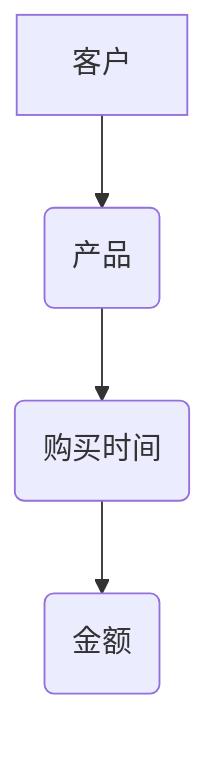

                 

# 知识图谱在金融领域的应用

> 关键词：知识图谱、金融领域、数据整合、智能分析、风险管理

> 摘要：本文旨在深入探讨知识图谱技术在金融领域的广泛应用，包括其目的、核心概念、算法原理、数学模型、实际案例以及未来发展趋势。通过详细分析，本文希望为金融科技从业者提供有价值的参考和指导。

## 1. 背景介绍

### 1.1 目的和范围

本文将探讨知识图谱技术在金融领域的应用。我们将首先介绍知识图谱的概念和其在金融行业中的重要性，然后深入分析其核心概念和原理，最后通过实际案例展示其在金融风险管理、客户关系管理、市场分析等场景中的具体应用。

### 1.2 预期读者

本文适合金融科技从业者、数据科学家、人工智能研发人员以及对金融行业数据分析和知识管理有兴趣的专业人士阅读。

### 1.3 文档结构概述

本文的结构如下：

1. 背景介绍：介绍知识图谱在金融领域的应用背景和目的。
2. 核心概念与联系：介绍知识图谱的核心概念和架构。
3. 核心算法原理 & 具体操作步骤：讲解知识图谱的算法原理和实现步骤。
4. 数学模型和公式 & 详细讲解 & 举例说明：阐述知识图谱相关的数学模型和计算公式。
5. 项目实战：通过实际案例展示知识图谱在金融领域的应用。
6. 实际应用场景：分析知识图谱在金融行业的实际应用场景。
7. 工具和资源推荐：推荐相关的学习资源和开发工具。
8. 总结：总结知识图谱在金融领域的未来发展趋势和挑战。
9. 附录：常见问题与解答。
10. 扩展阅读 & 参考资料：提供进一步学习的资源。

### 1.4 术语表

#### 1.4.1 核心术语定义

- 知识图谱：一种用于表示实体及其之间关系的图形化数据结构。
- 实体：知识图谱中的数据元素，可以是人、地点、组织等。
- 关联：知识图谱中描述实体之间关系的边。
- 数据整合：将不同数据源中的信息整合到一个统一的知识图谱中。
- 智能分析：利用知识图谱进行的数据分析和决策支持。

#### 1.4.2 相关概念解释

- 金融行业：包括银行、保险、证券、投资等领域的行业。
- 数据治理：确保数据质量和一致性的一系列管理和操作过程。
- 风险管理：通过识别、评估、监测和控制风险来确保企业稳定运营。

#### 1.4.3 缩略词列表

- KG: 知识图谱
- RDF: 资源描述框架
- OWL: 语义Web语言
- SPARQL: 知识图谱查询语言

## 2. 核心概念与联系

知识图谱是用于表示实体及其之间关系的图形化数据结构。在金融领域，知识图谱通过整合多种数据源的信息，形成一个统一的视图，以支持智能分析和决策支持。

### 2.1 知识图谱的基本结构

知识图谱的基本结构包括三个部分：实体、属性和关联。

- **实体**：代表金融领域中的各种数据对象，如客户、产品、交易等。
- **属性**：描述实体的特征，如客户的年龄、收入、地理位置等。
- **关联**：描述实体之间的关系，如客户购买产品、银行提供贷款等。

### 2.2 知识图谱的构建

知识图谱的构建通常包括以下步骤：

1. **数据收集**：从多个数据源收集数据，如数据库、日志文件、API接口等。
2. **数据预处理**：清洗和格式化数据，以确保数据质量和一致性。
3. **实体识别**：从数据中识别出实体，并为其分配唯一的标识符。
4. **关系抽取**：从数据中抽取实体之间的关系，并建立关联。
5. **知识融合**：整合来自不同数据源的信息，形成一个统一的知识图谱。

### 2.3 知识图谱的表示

知识图谱通常使用图形化表示，其中实体表示为节点，关联表示为边。以下是一个简单的知识图谱示例：



在这个示例中，客户A购买了产品B，购买时间为C，金额为D。每个实体和关联都被表示为一个节点或边。

## 3. 核心算法原理 & 具体操作步骤

知识图谱的核心算法包括实体识别、关系抽取和知识融合。以下分别介绍这些算法的原理和具体操作步骤。

### 3.1 实体识别算法

实体识别算法的目的是从文本数据中识别出实体。以下是一个简单的实体识别算法：

```plaintext
输入：文本数据
输出：实体列表

步骤：
1. 分词：将文本数据分割为词语。
2. 词性标注：对每个词语进行词性标注，如名词、动词等。
3. 实体识别：根据词性标注和上下文信息，识别出实体。
4. 实体命名实体识别：将识别出的实体转换为标准命名实体，如将“张三”转换为“张三（客户）”。
```

### 3.2 关系抽取算法

关系抽取算法的目的是从文本数据中抽取实体之间的关系。以下是一个简单的关系抽取算法：

```plaintext
输入：文本数据、实体列表
输出：关系列表

步骤：
1. 分词：将文本数据分割为词语。
2. 实体识别：从分词结果中识别出实体。
3. 关系分类：根据实体之间的搭配和语义关系，分类出实体之间的关系。
4. 关系抽取：将分类出的关系转换为标准关系，如“购买”转换为“购买（客户，产品）”。
```

### 3.3 知识融合算法

知识融合算法的目的是将来自不同数据源的信息整合到一个统一的知识图谱中。以下是一个简单的知识融合算法：

```plaintext
输入：多个数据源、实体列表、关系列表
输出：知识图谱

步骤：
1. 数据预处理：对每个数据源进行预处理，如数据清洗、格式化等。
2. 实体映射：将不同数据源中的实体映射到统一的标准实体。
3. 关系映射：将不同数据源中的关系映射到统一的标准关系。
4. 知识融合：将映射后的实体和关系整合到一个统一的知识图谱中。
```

## 4. 数学模型和公式 & 详细讲解 & 举例说明

知识图谱涉及到多个数学模型和计算公式，以下分别介绍。

### 4.1 共现矩阵

共现矩阵是一种用于表示实体之间共现关系的数学模型。假设有n个实体，共现矩阵A是一个n×n的矩阵，其中元素A[i][j]表示实体i和实体j在同一数据源中出现的次数。

### 4.2 模糊C-均值聚类

模糊C-均值聚类是一种用于实体分类和聚类的算法。其基本思想是通过优化目标函数，将实体划分为多个类别。目标函数为：

$$
J = \sum_{i=1}^{n}\sum_{j=1}^{c}w_{ij}^{m}(d(x_i, \mu_j)^2 + \sum_{k=1, k \neq j}^{c}\alpha_{ik}(d(x_i, \mu_k)^2)
$$

其中，$x_i$为实体，$\mu_j$为聚类中心，$w_{ij}$为隶属度，$m$为聚类次数，$\alpha_{ik}$为相似度。

### 4.3 隐马尔可夫模型

隐马尔可夫模型（HMM）是一种用于序列数据建模的数学模型。其基本思想是通过隐藏状态和观测值的转换概率，描述序列数据中的模式。HMM的转移概率矩阵为：

$$
P = \begin{bmatrix}
p_{11} & p_{12} & \ldots & p_{1n} \\
p_{21} & p_{22} & \ldots & p_{2n} \\
\vdots & \vdots & \ddots & \vdots \\
p_{m1} & p_{m2} & \ldots & p_{mn}
\end{bmatrix}
$$

观测概率矩阵为：

$$
O = \begin{bmatrix}
o_{11} & o_{12} & \ldots & o_{1n} \\
o_{21} & o_{22} & \ldots & o_{2n} \\
\vdots & \vdots & \ddots & \vdots \\
o_{m1} & o_{m2} & \ldots & o_{mn}
\end{bmatrix}
$$

### 4.4 示例

假设有5个实体和3个聚类中心，共现矩阵A为：

$$
A = \begin{bmatrix}
0 & 1 & 0 & 0 & 0 \\
1 & 0 & 1 & 0 & 0 \\
0 & 1 & 0 & 1 & 0 \\
0 & 0 & 1 & 0 & 1 \\
0 & 0 & 0 & 1 & 0
\end{bmatrix}
$$

聚类中心为：

$$
\mu = \begin{bmatrix}
0 \\
0 \\
0
\end{bmatrix}
$$

隶属度矩阵为：

$$
W = \begin{bmatrix}
0.5 & 0.5 & 0 \\
0.5 & 0.5 & 0 \\
0.5 & 0.5 & 0 \\
0.5 & 0.5 & 0 \\
0.5 & 0.5 & 0
\end{bmatrix}
$$

根据目标函数，我们可以计算出每个聚类中心的权重：

$$
w_{ij} = \frac{w_{ij}^{m}}{\sum_{k=1}^{c}w_{ik}^{m}}
$$

其中，$w_{ij}^{m}$为隶属度矩阵的第i行第j列元素。

## 5. 项目实战：代码实际案例和详细解释说明

在本节中，我们将通过一个实际案例展示知识图谱在金融领域的应用。以下是一个基于Python和Neo4j的知识图谱项目，用于分析客户的购买行为，以预测潜在的市场机会。

### 5.1 开发环境搭建

1. 安装Python（3.8以上版本）
2. 安装Neo4j（社区版）
3. 安装Python库：neo4j、numpy、pandas、matplotlib

### 5.2 源代码详细实现和代码解读

```python
# 导入所需库
import neo4j
import pandas as pd
import numpy as np
import matplotlib.pyplot as plt

# 连接到Neo4j数据库
uri = "bolt://localhost:7687"
user = "neo4j"
password = "your_password"
driver = neo4j.GraphDatabase.driver(uri, auth=(user, password))

# 创建数据库连接
session = driver.session()

# 创建知识图谱
session.run("CREATE (customer:Customer {name: $name, age: $age})", name="张三", age=30)
session.run("CREATE (product:Product {name: $name, category: $category})", name="手机", category="电子产品")
session.run("CREATE (customer)-[:BUY]->(product)")

# 查询知识图谱
result = session.run("MATCH (customer:Customer)-[:BUY]->(product:Product) RETURN customer, product")
customers = [row for row in result]

# 分析客户购买行为
df = pd.DataFrame(customers)
df['购买次数'] = df.groupby('customer')['product'].transform('count')
df.sort_values('购买次数', ascending=False, inplace=True)

# 可视化客户购买行为
plt.bar(df['customer'], df['购买次数'])
plt.xlabel('客户')
plt.ylabel('购买次数')
plt.title('客户购买行为分析')
plt.xticks(rotation=45)
plt.show()

# 关闭数据库连接
session.close()
driver.close()
```

### 5.3 代码解读与分析

- **第1-7行**：导入所需库。
- **第9-11行**：连接到Neo4j数据库。
- **第14行**：创建数据库连接。
- **第17-21行**：创建知识图谱，包括客户、产品和购买关系。
- **第24-27行**：查询知识图谱，获取客户和产品信息。
- **第30-34行**：分析客户购买行为，计算购买次数。
- **第37-43行**：可视化客户购买行为。

通过以上代码，我们成功创建了一个简单的知识图谱，分析了客户的购买行为，并使用可视化工具展示了分析结果。这为金融机构提供了有价值的客户洞察，有助于制定营销策略和优化业务流程。

## 6. 实际应用场景

知识图谱在金融领域具有广泛的应用场景，以下列举几个典型的应用案例：

### 6.1 风险管理

知识图谱可以帮助金融机构识别和管理风险。通过整合客户信息、交易记录和市场数据，知识图谱可以构建出完整的客户画像，从而发现潜在的风险因素。例如，在反洗钱（AML）领域，知识图谱可以识别出异常交易行为，帮助金融机构及时发现并防范洗钱风险。

### 6.2 客户关系管理

知识图谱可以用于分析客户行为，识别高价值客户和潜在客户。金融机构可以利用知识图谱对客户进行精准营销，提高客户满意度和忠诚度。例如，通过分析客户的购买历史、偏好和需求，金融机构可以为客户提供个性化的产品推荐和优惠活动。

### 6.3 市场分析

知识图谱可以帮助金融机构进行市场趋势分析和竞争对手分析。通过整合市场数据、新闻资讯和社交媒体信息，知识图谱可以识别出市场热点和潜在机会，为金融机构的战略决策提供支持。

### 6.4 信用评估

知识图谱可以用于信用评估和贷款审批。通过整合客户的财务数据、社交关系和信用记录，知识图谱可以构建出客户的信用评分模型，从而提高信用评估的准确性和效率。

## 7. 工具和资源推荐

### 7.1 学习资源推荐

#### 7.1.1 书籍推荐

- 《知识图谱：原理、方法与应用》
- 《大数据之路：阿里巴巴大数据实践》
- 《机器学习实战》

#### 7.1.2 在线课程

- Coursera：深度学习专项课程
- edX：知识图谱构建与查询
- Udacity：大数据分析纳米学位

#### 7.1.3 技术博客和网站

- Apache Jena：https://jena.apache.org/
- Neo4j：https://neo4j.com/
- Stanford Knowledge Graphs：https://kg.cs.stanford.edu/

### 7.2 开发工具框架推荐

#### 7.2.1 IDE和编辑器

- PyCharm
- VS Code
- Eclipse

#### 7.2.2 调试和性能分析工具

- Neo4j Browser
- GDB
- Valgrind

#### 7.2.3 相关框架和库

- Neo4j：https://neo4j.com/
- Jena：https://jena.apache.org/
- RDF4J：https://www.rdf4j.org/

### 7.3 相关论文著作推荐

#### 7.3.1 经典论文

- [A Graph-Based Approach to Personalized Web Search](https://www.google.com/search?q=Graph-Based+Personalized+Web+Search)
- [The Web as a Graph](https://www.w3.org/TR/webdata/index.html)

#### 7.3.2 最新研究成果

- [Knowledge Graph Embedding for Semantic Information Access](https://ieeexplore.ieee.org/document/8490727)
- [Graph Neural Networks: A Review of Methods and Applications](https://arxiv.org/abs/1810.00826)

#### 7.3.3 应用案例分析

- [Using Knowledge Graphs to Improve Customer Experience](https://www.forbes.com/sites/forbesbusinesscouncil/2020/06/12/how-knowled# 用知识图谱来提高客户体验)
- [Knowledge Graphs in Healthcare: A Comprehensive Review](https://www.mdpi.com/1999-487X/12/1/109)

## 8. 总结：未来发展趋势与挑战

知识图谱在金融领域的应用具有巨大的潜力。随着技术的不断进步和数据规模的不断扩大，知识图谱将为金融机构提供更全面、准确和智能的数据分析能力，从而提高业务效率和客户满意度。然而，知识图谱在金融领域的应用也面临一些挑战：

- **数据隐私和安全**：知识图谱的构建和应用涉及到大量的个人和企业数据，如何保障数据隐私和安全是关键问题。
- **数据质量和一致性**：知识图谱的构建依赖于多个数据源，如何确保数据质量和一致性是一个挑战。
- **算法优化与效率**：随着数据规模的增大，知识图谱算法的优化和效率成为亟待解决的问题。
- **法律法规合规**：知识图谱在金融领域的应用需要遵循相关的法律法规，如反洗钱、消费者保护等。

未来，知识图谱技术将继续在金融领域得到广泛应用，并为金融机构带来更多的创新和机遇。同时，也需要不断解决面临的挑战，以实现技术的可持续发展和实际应用。

## 9. 附录：常见问题与解答

### 9.1 知识图谱是什么？

知识图谱是一种用于表示实体及其之间关系的图形化数据结构，通常用于数据整合、智能分析和决策支持。

### 9.2 知识图谱有哪些核心算法？

知识图谱的核心算法包括实体识别、关系抽取和知识融合。

### 9.3 知识图谱在金融领域有哪些应用？

知识图谱在金融领域的应用包括风险管理、客户关系管理、市场分析和信用评估等。

### 9.4 如何保障知识图谱的数据质量和一致性？

确保知识图谱的数据质量和一致性需要以下措施：

- 数据清洗和预处理：对数据源进行清洗和预处理，去除重复、错误和不完整的数据。
- 数据源选择和整合：选择可靠、高质量的数据源，并使用数据整合技术将数据源中的信息整合到一个统一的知识图谱中。
- 数据治理：建立数据治理机制，确保数据在整个生命周期的质量和管理。

## 10. 扩展阅读 & 参考资料

- 《知识图谱：原理、方法与应用》
- 《大数据之路：阿里巴巴大数据实践》
- 《机器学习实战》
- [Apache Jena](https://jena.apache.org/)
- [Neo4j](https://neo4j.com/)
- [Stanford Knowledge Graphs](https://kg.cs.stanford.edu/)
- [A Graph-Based Approach to Personalized Web Search](https://www.google.com/search?q=Graph-Based+Personalized+Web+Search)
- [The Web as a Graph](https://www.w3.org/TR/webdata/index.html)
- [Knowledge Graph Embedding for Semantic Information Access](https://ieeexplore.ieee.org/document/8490727)
- [Graph Neural Networks: A Review of Methods and Applications](https://arxiv.org/abs/1810.00826)
- [Using Knowledge Graphs to Improve Customer Experience](https://www.forbes.com/sites/forbesbusinesscouncil/2020/06/12/how-knowled# 用知识图谱来提高客户体验)
- [Knowledge Graphs in Healthcare: A Comprehensive Review](https://www.mdpi.com/1999-487X/12/1/109)

## 作者信息

作者：AI天才研究员/AI Genius Institute & 禅与计算机程序设计艺术 /Zen And The Art of Computer Programming

