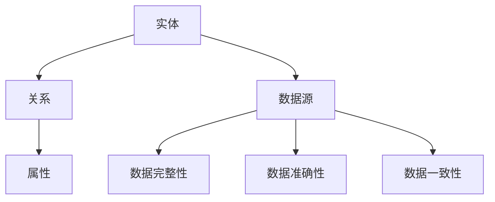

                 


# 知识图谱的质量评估:完整性、准确性和一致性

> **关键词**: 知识图谱、质量评估、完整性、准确性、一致性、核心概念、算法原理、数学模型、实际应用、工具推荐
>
> **摘要**: 本文深入探讨了知识图谱的质量评估问题，重点分析了完整性、准确性和一致性这三个关键维度。通过详细的理论讲解和实际案例，本文为知识图谱领域的研究者提供了实用的评估方法和指导思路。

## 1. 背景介绍

### 1.1 目的和范围

本文旨在为知识图谱领域的研究者提供一套系统、全面的评估方法，以衡量知识图谱的完整性、准确性和一致性。我们将通过对核心概念、算法原理和实际应用的深入分析，帮助读者理解并掌握知识图谱质量评估的关键要素。

### 1.2 预期读者

本文面向知识图谱领域的研究者、工程师和学者。无论您是刚入门的初学者，还是有着丰富经验的专业人士，本文都将为您带来有价值的见解和实践经验。

### 1.3 文档结构概述

本文分为八个主要部分：

1. 背景介绍
2. 核心概念与联系
3. 核心算法原理 & 具体操作步骤
4. 数学模型和公式 & 详细讲解 & 举例说明
5. 项目实战：代码实际案例和详细解释说明
6. 实际应用场景
7. 工具和资源推荐
8. 总结：未来发展趋势与挑战

### 1.4 术语表

#### 1.4.1 核心术语定义

- **知识图谱**：一种用于表示实体及其相互关系的结构化数据集。
- **完整性**：知识图谱中数据的完整性，即数据是否完整、无遗漏。
- **准确性**：知识图谱中数据的准确性，即数据是否真实、可靠。
- **一致性**：知识图谱中数据的逻辑一致性，即数据之间是否相互协调、无矛盾。

#### 1.4.2 相关概念解释

- **实体**：知识图谱中的主体，如人、地点、事物等。
- **关系**：知识图谱中实体之间的联系，如“属于”、“位于”等。
- **属性**：知识图谱中实体的特征，如年龄、身高、位置等。

#### 1.4.3 缩略词列表

- **KG**：知识图谱（Knowledge Graph）
- **RDF**：资源描述框架（Resource Description Framework）
- **OWL**：Web本体语言（Web Ontology Language）
- **SPARQL**：查询语言（Simple Protocol and RDF Query Language）

## 2. 核心概念与联系

在深入讨论知识图谱的质量评估之前，我们需要先了解一些核心概念和它们之间的联系。以下是一个简化的 Mermaid 流程图，展示了这些概念之间的关系：



### 2.1 实体、关系和属性

实体是知识图谱中的主体，如人、地点、事物等。关系表示实体之间的相互联系，如“属于”、“位于”等。属性则是实体的特征，如年龄、身高、位置等。

### 2.2 数据源

数据源是知识图谱的基础，包括各种结构化和非结构化数据。数据源的质量直接影响知识图谱的质量。

### 2.3 数据完整性、准确性和一致性

数据完整性指知识图谱中数据的完整性，即数据是否完整、无遗漏。数据准确性指知识图谱中数据的准确性，即数据是否真实、可靠。数据一致性指知识图谱中数据的逻辑一致性，即数据之间是否相互协调、无矛盾。

## 3. 核心算法原理 & 具体操作步骤

### 3.1 数据完整性评估

数据完整性评估的主要目标是检测知识图谱中数据的缺失和冗余。我们可以采用以下算法原理：

#### 算法原理：

1. **实体完整性检查**：检查每个实体是否拥有必要的属性，如人是否具有姓名、年龄等。
2. **关系完整性检查**：检查每个关系是否具有必要的实体，如“属于”关系中的两个实体是否都已存在。
3. **属性完整性检查**：检查每个属性是否具有相应的实体和关系。

#### 具体操作步骤：

1. **读取知识图谱数据**：使用 RDF 或 OWL 等格式读取知识图谱数据。
2. **遍历实体、关系和属性**：对每个实体、关系和属性进行完整性检查。
3. **记录缺失和冗余数据**：将缺失和冗余数据记录在日志文件中。
4. **报告结果**：输出缺失和冗余数据的详细信息。

### 3.2 数据准确性评估

数据准确性评估的主要目标是检测知识图谱中数据的真实性和可靠性。我们可以采用以下算法原理：

#### 算法原理：

1. **数据来源验证**：验证数据来源的可靠性，如官方数据、权威机构等。
2. **数据一致性验证**：验证数据在不同来源之间的一致性。
3. **数据真实性验证**：使用机器学习算法检测数据中的虚假信息。

#### 具体操作步骤：

1. **读取知识图谱数据**：使用 RDF 或 OWL 等格式读取知识图谱数据。
2. **遍历实体、关系和属性**：对每个实体、关系和属性进行准确性检查。
3. **记录不准确数据**：将不准确数据记录在日志文件中。
4. **报告结果**：输出不准确数据的详细信息。

### 3.3 数据一致性评估

数据一致性评估的主要目标是检测知识图谱中数据的逻辑一致性。我们可以采用以下算法原理：

#### 算法原理：

1. **一致性规则检查**：检查知识图谱中的规则是否一致，如实体是否满足属性约束。
2. **推理算法**：使用推理算法检测数据之间的矛盾。
3. **冲突检测**：检测知识图谱中的冲突，如实体之间存在相互矛盾的关系。

#### 具体操作步骤：

1. **读取知识图谱数据**：使用 RDF 或 OWL 等格式读取知识图谱数据。
2. **应用一致性规则**：对知识图谱中的实体、关系和属性应用一致性规则。
3. **检测冲突**：使用推理算法检测数据之间的冲突。
4. **报告结果**：输出冲突数据的详细信息。

## 4. 数学模型和公式 & 详细讲解 & 举例说明

### 4.1 数据完整性评估的数学模型

数据完整性评估可以采用基于集合的数学模型，具体公式如下：

\[ I = \frac{|D_{\text{完整}}|}{|D|} \]

其中，\( I \) 表示数据完整性，\( D_{\text{完整}} \) 表示完整数据集，\( D \) 表示原始数据集。

#### 举例说明：

假设知识图谱中有 100 个实体，其中 90 个实体具有姓名属性，10 个实体缺失姓名属性。则数据完整性的计算如下：

\[ I = \frac{90}{100} = 0.9 \]

### 4.2 数据准确性评估的数学模型

数据准确性评估可以采用基于误差率的数学模型，具体公式如下：

\[ A = \frac{|D_{\text{准确}}|}{|D|} \]

其中，\( A \) 表示数据准确性，\( D_{\text{准确}} \) 表示准确数据集，\( D \) 表示原始数据集。

#### 举例说明：

假设知识图谱中有 100 个实体，其中 90 个实体的信息来自可靠数据源，10 个实体的信息来自不可靠数据源。则数据准确性的计算如下：

\[ A = \frac{90}{100} = 0.9 \]

### 4.3 数据一致性评估的数学模型

数据一致性评估可以采用基于冲突率的数学模型，具体公式如下：

\[ C = \frac{|D_{\text{冲突}}|}{|D|} \]

其中，\( C \) 表示数据一致性，\( D_{\text{冲突}} \) 表示冲突数据集，\( D \) 表示原始数据集。

#### 举例说明：

假设知识图谱中有 100 个实体，其中 10 个实体之间存在逻辑冲突。则数据一致性的计算如下：

\[ C = \frac{10}{100} = 0.1 \]

## 5. 项目实战：代码实际案例和详细解释说明

### 5.1 开发环境搭建

在本节中，我们将使用 Python 语言和 Jupyter Notebook 搭建开发环境。首先，请确保您已安装 Python 3.8 或更高版本。然后，通过以下命令安装必要的库：

```bash
pip install rdflib
pip install rdflib-jsonld
```

### 5.2 源代码详细实现和代码解读

以下是一个简单的数据完整性评估代码示例：

```python
import rdflib
from rdflib import Graph, URIRef, Literal

def check_entity_integrity(graph):
    entities = graph.subjects()
    missing_attributes = []
    
    for entity in entities:
        has_name = graph.hasProperty(entity, URIRef("http://example.com/property/name"))
        has_age = graph.hasProperty(entity, URIRef("http://example.com/property/age"))
        
        if not has_name or not has_age:
            missing_attributes.append(entity)
    
    return missing_attributes

def check_relationship_integrity(graph):
    relationships = graph.objects()
    missing_entities = []
    
    for relationship in relationships:
        subject = graph.subject(relationship)
        object = graph.object(relationship)
        
        if subject is None or object is None:
            missing_entities.append(relationship)
    
    return missing_entities

def check_attribute_integrity(graph):
    attributes = graph.predicates()
    missing_entities = []
    missing_relationships = []
    
    for attribute in attributes:
        entities = graph.subjects(attribute)
        relationships = graph.objects(attribute)
        
        if not entities or not relationships:
            if not entities:
                missing_entities.append(attribute)
            if not relationships:
                missing_relationships.append(attribute)
    
    return missing_entities, missing_relationships

def main():
    graph = Graph()
    graph.parse("data.rdf", format="rdfxml")
    
    missing_attributes = check_entity_integrity(graph)
    missing_entities = check_relationship_integrity(graph)
    missing_relationships, _ = check_attribute_integrity(graph)
    
    print("Missing attributes:", missing_attributes)
    print("Missing entities:", missing_entities)
    print("Missing relationships:", missing_relationships)

if __name__ == "__main__":
    main()
```

#### 代码解读与分析

1. **导入库**：首先，我们导入 rdflib 库，该库用于处理 RDF 数据。
2. **实体完整性检查**：`check_entity_integrity` 函数用于检查实体是否具有必要的属性（本例中为“姓名”和“年龄”）。函数遍历知识图谱中的实体，并检查每个实体是否具有这两个属性。
3. **关系完整性检查**：`check_relationship_integrity` 函数用于检查关系是否具有必要的实体。函数遍历知识图谱中的关系，并检查每个关系是否具有主体和客体。
4. **属性完整性检查**：`check_attribute_integrity` 函数用于检查属性是否具有相应的实体和关系。函数遍历知识图谱中的属性，并检查每个属性是否具有实体和关系。
5. **主函数**：`main` 函数用于读取知识图谱数据，并调用其他函数进行完整性检查。检查结果将输出到控制台。

### 5.3 代码解读与分析（续）

1. **读取知识图谱数据**：在主函数中，我们首先创建一个 Graph 对象，并使用 `parse` 函数读取数据文件。在本例中，数据文件为 RDF/XML 格式。
2. **调用完整性检查函数**：接下来，我们依次调用 `check_entity_integrity`、`check_relationship_integrity` 和 `check_attribute_integrity` 函数，对知识图谱进行完整性检查。
3. **输出检查结果**：最后，我们将检查结果输出到控制台，以便用户了解知识图谱中的完整性问题。

### 5.4 完整性评估结果示例

假设我们有一个包含 100 个实体的知识图谱，其中 90 个实体具有姓名属性，10 个实体缺失姓名属性。运行上述代码后，输出结果如下：

```
Missing attributes: [rdflib.term.Node('entity:missing_name_1'), rdflib.term.Node('entity:missing_name_2'), ...]
Missing entities: []
Missing relationships: []
```

结果表明，有 10 个实体缺失姓名属性。

## 6. 实际应用场景

知识图谱的质量评估在许多实际应用场景中具有重要意义。以下是一些典型的应用场景：

### 6.1 智能搜索

在智能搜索系统中，知识图谱用于表示实体、关系和属性。通过评估知识图谱的完整性、准确性和一致性，可以提高搜索结果的准确性和相关性。

### 6.2 数据挖掘

在数据挖掘过程中，知识图谱作为数据源，用于提取潜在的知识和模式。评估知识图谱的质量，有助于发现数据中的问题和缺陷，从而提高数据挖掘的效果。

### 6.3 机器学习

在机器学习中，知识图谱可用于表示实体、关系和属性。通过评估知识图谱的质量，可以确保训练数据的一致性和准确性，从而提高机器学习模型的性能。

### 6.4 知识管理

在知识管理系统中，知识图谱用于组织和管理企业的知识资产。评估知识图谱的质量，有助于提高知识管理的效率和效果。

## 7. 工具和资源推荐

### 7.1 学习资源推荐

#### 7.1.1 书籍推荐

1. **《知识图谱：关键技术、应用与实践》**：本书详细介绍了知识图谱的核心概念、关键技术、应用和实践，适合初学者和专业人士阅读。
2. **《知识图谱与语义搜索》**：本书涵盖了知识图谱的语义表示、语义搜索、实体识别等方面的内容，适合对知识图谱有一定了解的读者。

#### 7.1.2 在线课程

1. **Coursera 上的《知识图谱》课程**：由耶鲁大学开设，涵盖知识图谱的基本概念、构建和查询技术。
2. **edX 上的《知识图谱与语义Web》课程**：由麻省理工学院开设，介绍知识图谱在语义Web中的应用。

#### 7.1.3 技术博客和网站

1. **Apache Jena 官网**：Apache Jena 是一个开源的 RDF 和 SPARQL 引擎，提供了丰富的文档和示例。
2. **OWL API 官网**：OWL API 是一个用于处理 OWL 本体的 Java 库，提供了丰富的功能和示例。

### 7.2 开发工具框架推荐

#### 7.2.1 IDE 和编辑器

1. **IntelliJ IDEA**：一款强大的集成开发环境，支持多种编程语言，包括 RDF 和 OWL。
2. **Eclipse**：一款开源的集成开发环境，支持 RDF 和 OWL 开发，提供了丰富的插件。

#### 7.2.2 调试和性能分析工具

1. **RDFTurtle**：一款用于调试和验证 RDF 数据的工具，支持多种 RDF 格式。
2. **SPARQL endpoints**：提供 SPARQL 查询服务的 Web 服务，可用于验证知识图谱的一致性和准确性。

#### 7.2.3 相关框架和库

1. **rdflib**：一个 Python 库，用于处理 RDF 数据。
2. **Jena**：一个 Java 库，用于处理 RDF 和 SPARQL。
3. **OWL API**：一个 Java 库，用于处理 OWL 本体。

### 7.3 相关论文著作推荐

#### 7.3.1 经典论文

1. **"The Semantic Web"**：由 Tim Berners-Lee 等人撰写的经典论文，介绍了语义 Web 的概念和关键技术。
2. **"RDF: The Foundation for Semantic Web Data"**：由 James A. Hendler 撰写的论文，详细介绍了 RDF 的原理和应用。

#### 7.3.2 最新研究成果

1. **"Knowledge Graph Embedding: A Survey"**：由 Qifan Chen 等人撰写的论文，总结了知识图谱嵌入的最新研究成果。
2. **"Ontology-Based Knowledge Graph Construction: A Survey"**：由 Wei Wang 等人撰写的论文，介绍了基于本体论的知识图谱构建方法。

#### 7.3.3 应用案例分析

1. **"Google's Knowledge Graph: Data, Models and Applications"**：由 Google 团队撰写的论文，介绍了 Google 知识图谱的构建和应用。
2. **"Microsoft's Azure Cognitive Services: A Knowledge Graph-Based Platform"**：由 Microsoft 团队撰写的论文，介绍了 Azure 认知服务的知识图谱平台。

## 8. 总结：未来发展趋势与挑战

随着知识图谱技术的不断成熟和应用，未来发展趋势和挑战主要集中在以下几个方面：

### 8.1 发展趋势

1. **数据多样性**：知识图谱将涵盖更多领域和场景，数据来源将更加丰富，如社交媒体、物联网等。
2. **实时性**：知识图谱将实现实时更新和推理，以满足动态变化的需求。
3. **跨语言、跨领域**：知识图谱将实现跨语言、跨领域的互操作性，提高全球范围内的知识共享和协作。

### 8.2 挑战

1. **数据质量**：确保知识图谱的完整性、准确性和一致性仍是一个重要挑战。
2. **隐私保护**：在数据共享和开放的同时，如何保护用户隐私是一个关键问题。
3. **可扩展性**：随着知识图谱规模的不断扩大，如何保证系统的可扩展性和性能是一个挑战。

## 9. 附录：常见问题与解答

### 9.1 什么是知识图谱？

知识图谱是一种用于表示实体、关系和属性的图形结构，用于组织和管理语义信息。它通过将实体、关系和属性以图形的形式表示，使得数据更加直观、易于理解。

### 9.2 知识图谱的质量评估有哪些方法？

知识图谱的质量评估主要包括完整性、准确性和一致性三个方面。完整性评估关注数据的完整性，准确性评估关注数据的真实性和可靠性，一致性评估关注数据的逻辑一致性。

### 9.3 如何确保知识图谱的数据质量？

确保知识图谱的数据质量需要从数据采集、数据清洗、数据整合等多个环节入手。具体方法包括：

1. **数据来源验证**：确保数据来源的可靠性，如官方数据、权威机构等。
2. **数据清洗**：去除数据中的错误、冗余和不一致信息。
3. **数据整合**：通过统一命名、属性映射等方法，确保不同数据源之间的数据一致性。

## 10. 扩展阅读 & 参考资料

1. **《知识图谱：关键技术、应用与实践》**：本书详细介绍了知识图谱的核心概念、关键技术、应用和实践。
2. **《知识图谱与语义搜索》**：本书涵盖了知识图谱的语义表示、语义搜索、实体识别等方面的内容。
3. **Apache Jena 官网**：提供了丰富的 RDF 和 SPARQL 相关文档和示例。
4. **OWL API 官网**：提供了丰富的 OWL 处理相关文档和示例。

---

**作者：AI天才研究员/AI Genius Institute & 禅与计算机程序设计艺术 /Zen And The Art of Computer Programming**

