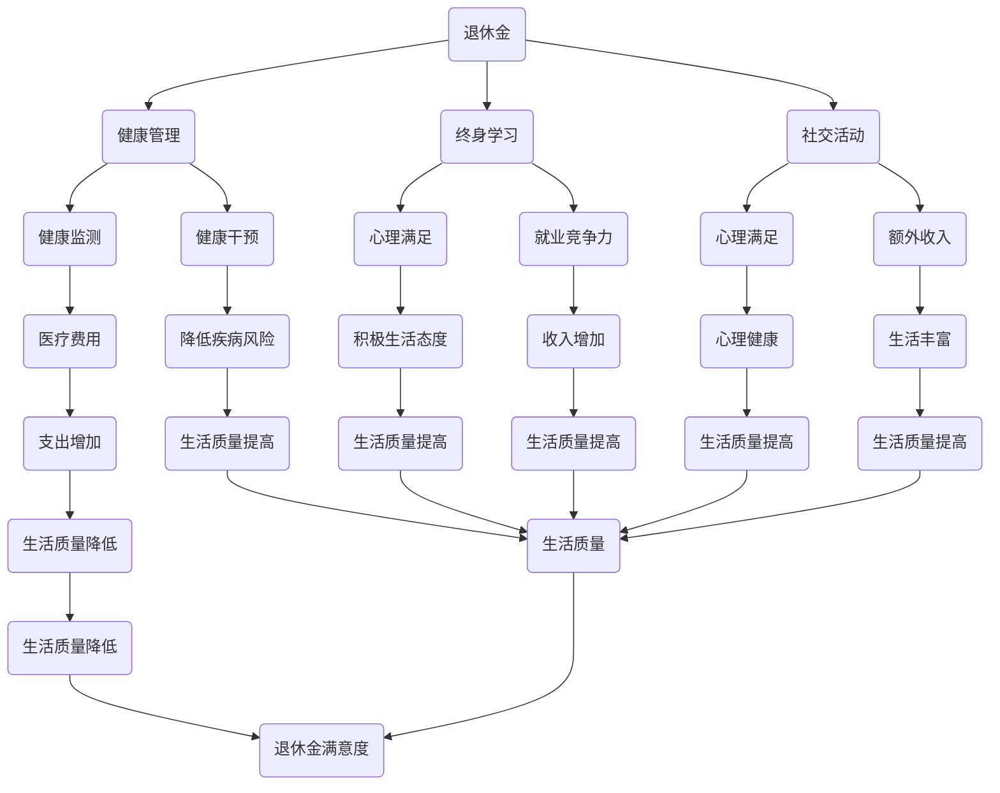

                 

### 1. 背景介绍

#### 1.1 目的和范围

本文旨在探讨知识型退休生活的规划与实现。随着社会的发展和人们寿命的延长，退休生活已成为许多人晚年生活的重要阶段。对于拥有丰富知识背景的退休人士来说，如何有效地规划并实现一个有意义、有成就感的退休生活，不仅关系到个人的幸福感，也对社会资源的合理利用有着重要影响。

本文将围绕以下几个核心问题展开讨论：

1. **退休规划的必要性**：分析退休规划的重要性，包括财务、健康、社交等方面。
2. **核心概念与联系**：介绍与退休规划相关的核心概念，如退休金、健康管理、终身学习等，并使用Mermaid流程图展示这些概念之间的联系。
3. **核心算法原理与具体操作步骤**：详细阐述如何通过算法来优化退休规划，包括财务规划算法、健康管理算法等。
4. **数学模型和公式**：介绍相关的数学模型和公式，如何应用于退休规划中，并提供具体实例说明。
5. **项目实战**：通过实际代码案例展示如何具体实现退休规划。
6. **实际应用场景**：分析退休规划在不同场景下的应用，如个人、家庭、社区等。
7. **工具和资源推荐**：推荐学习资源和开发工具，帮助读者更深入地学习和实践。
8. **总结与未来展望**：总结退休规划的趋势和挑战，展望未来发展的方向。

本文旨在为退休人士提供一套系统、科学的退休规划方案，帮助他们实现一个充实、幸福的退休生活。

#### 1.2 预期读者

本文预期读者主要包括以下几类人群：

1. **即将退休或已经退休的知识型工作者**：他们对退休生活有较高的期望和要求，希望通过合理的规划实现退休后的生活质量。
2. **从事金融、医疗、教育等领域的专业人士**：这些领域的工作者在退休规划方面拥有专业知识，希望了解如何将这些知识应用于个人生活。
3. **退休规划咨询师**：这些专业人士在为他人提供退休规划服务时，需要了解最新的理论和方法。
4. **对退休规划感兴趣的一般读者**：他们希望通过本文了解退休规划的基本原理和实践方法。

#### 1.3 文档结构概述

本文的结构如下：

1. **背景介绍**：介绍退休规划的重要性、预期读者和文档结构。
2. **核心概念与联系**：介绍与退休规划相关的核心概念，并展示概念之间的联系。
3. **核心算法原理与具体操作步骤**：详细阐述如何通过算法来优化退休规划。
4. **数学模型和公式**：介绍相关的数学模型和公式，如何应用于退休规划中。
5. **项目实战**：通过实际代码案例展示如何具体实现退休规划。
6. **实际应用场景**：分析退休规划在不同场景下的应用。
7. **工具和资源推荐**：推荐学习资源和开发工具。
8. **总结与未来展望**：总结退休规划的趋势和挑战，展望未来发展的方向。
9. **附录**：提供常见问题与解答。
10. **扩展阅读与参考资料**：推荐相关文献和资源。

#### 1.4 术语表

为了确保文章的可读性和一致性，本文中使用了以下术语，并对其进行定义和解释：

##### 1.4.1 核心术语定义

- **退休规划**：指在退休前，为保障退休后生活质量而进行的财务、健康、社交等方面的规划和安排。
- **退休金**：指用于支付退休后生活费用的资金来源，包括个人储蓄、社会保险、企业年金等。
- **终身学习**：指在退休后继续学习、提升自我，以保持智力活跃、适应社会发展的过程。
- **健康管理**：指对个人健康进行评估、监测和管理，以降低疾病风险、提高生活质量。
- **财务规划**：指对个人财务状况进行评估、分析和规划，以实现财务目标。

##### 1.4.2 相关概念解释

- **退休年龄**：指国家或企业规定的正式退休的年龄。
- **养老金替代率**：指退休后养老金收入占退休前工资收入的比例。
- **健康指数**：指对个人健康状况进行量化评估的指标，如血压、血脂、血糖等。

##### 1.4.3 缩略词列表

- **PFRP**：Personal Financial Retirement Planning（个人财务退休规划）
- **LTP**：Long-Term Planning（长期规划）
- **HEMS**：Health Management System（健康管理系统）
- **IDE**：Integrated Development Environment（集成开发环境）

---

### 2. 核心概念与联系

在讨论退休规划之前，我们需要明确几个核心概念，并了解它们之间的联系。以下是与退休规划密切相关的核心概念及其相互关系。

#### 2.1 退休金

退休金是退休人士的主要收入来源，它直接关系到退休后的生活质量。退休金可以分为以下几种：

1. **个人储蓄**：通过长期储蓄和投资积累的退休资金。
2. **社会保险**：由国家或企业提供的基本退休保障。
3. **企业年金**：由企业为员工提供的补充退休保障。

退休金在退休规划中的角色至关重要。它需要满足退休后的基本生活需求，如食品、住房、医疗等。

##### 2.2 健康管理

健康是退休生活的基石。良好的健康管理可以帮助退休人士降低疾病风险，提高生活质量。健康管理包括以下几个方面：

1. **健康监测**：定期进行健康体检，监测血压、血脂、血糖等指标。
2. **健康干预**：根据健康监测结果，采取相应的健康干预措施，如药物治疗、饮食调整、锻炼等。
3. **心理健康**：保持良好的心理状态，减少孤独感和抑郁情绪。

健康管理与退休金有密切关系。健康水平会影响退休金的支出，如医疗费用。同时，健康的退休人士更有可能参与社会活动，增加收入的来源。

##### 2.3 终身学习

终身学习是退休人士保持智力活跃、适应社会发展的关键。它不仅有助于提升自我价值，还可以增加收入来源，如参加培训和兼职工作。

终身学习与退休金的关系在于，它可以帮助退休人士提高就业竞争力，从而增加收入。此外，终身学习还可以带来心理上的满足感和成就感，提高生活质量。

##### 2.4 社交活动

社交活动是退休生活的重要组成部分，它有助于保持心理健康、增强社会联系。社交活动包括：

1. **社区活动**：参加社区组织的各类活动，如志愿者服务、文化娱乐等。
2. **家庭聚会**：与家人、朋友保持密切联系，共同度过美好时光。
3. **兴趣爱好**：培养兴趣爱好，如绘画、音乐、运动等，丰富退休生活。

社交活动与退休金的关系在于，它可以帮助退休人士保持积极的生活态度，提高生活质量。同时，社交活动还可以带来额外的经济收益，如参加文化活动、兴趣小组等。

##### 2.5 核心概念与联系流程图

为了更直观地展示核心概念之间的联系，我们可以使用Mermaid流程图。以下是退休规划相关核心概念及其联系的Mermaid表示：



该流程图展示了退休金、健康管理、终身学习、社交活动等核心概念之间的联系，以及它们对生活质量的影响。

---

通过上述核心概念及其联系的介绍，我们可以更好地理解退休规划的整体框架。在接下来的部分，我们将详细探讨如何通过算法和数学模型来优化退休规划。

---

### 2. 核心概念与联系 （续）

在前文中，我们介绍了退休规划的核心概念及其相互关系。在本节中，我们将进一步探讨这些概念背后的原理和联系，并使用Mermaid流程图来展示它们之间的关系。

#### 2.6 核心概念原理

1. **退休金**：退休金是退休人士的主要收入来源，它直接关系到退休后的生活质量。退休金的来源主要包括个人储蓄、社会保险和企业年金。退休金的管理和规划需要考虑到通货膨胀、预期寿命、生活费用等因素。

2. **健康管理**：健康是退休生活的基石。通过健康管理，退休人士可以降低疾病风险，提高生活质量。健康管理包括健康监测、健康干预和心理健康三个方面。健康监测主要是通过定期体检来监测各项健康指标，健康干预则是根据监测结果采取相应的措施，如药物治疗、饮食调整等。心理健康则关注退休人士的心理状态，如减少孤独感和抑郁情绪。

3. **终身学习**：终身学习是退休人士保持智力活跃、适应社会发展的关键。通过终身学习，退休人士不仅可以提升自我价值，还可以增加收入来源。终身学习包括获取新知识、技能和经验，以及参与社会活动。

4. **社交活动**：社交活动是退休生活的重要组成部分，它有助于保持心理健康、增强社会联系。社交活动可以丰富退休生活，提高生活质量。

#### 2.7 核心概念之间的联系

退休金、健康管理、终身学习和社交活动之间存在紧密的联系。这些联系可以通过以下方式来理解：

1. **退休金与健康管理**：退休金可以用于支付医疗费用，而健康管理的有效性可以减少医疗费用的支出。良好的健康状况可以提高退休金的使用效率。

2. **退休金与终身学习**：终身学习可以增加退休人士的就业竞争力，从而增加收入。收入增加可以进一步充实退休金。

3. **退休金与社交活动**：社交活动可以减少孤独感和抑郁情绪，提高生活质量。生活质量提高可以增加退休人士对退休金的满意度。

4. **健康管理、终身学习与社交活动**：这三个方面相互影响，共同促进退休人士的生活质量。良好的健康状况可以支持终身学习，而终身学习又可以增强社交活动。

#### 2.8 Mermaid流程图

为了更直观地展示核心概念之间的联系，我们可以使用Mermaid流程图。以下是退休规划相关核心概念及其联系的Mermaid表示：


该流程图详细展示了退休金、健康管理、终身学习和社交活动之间的相互关系，以及它们对生活质量的影响。通过这个流程图，我们可以更清晰地理解退休规划的整体框架。

---

通过上述分析，我们可以看到退休规划是一个多维度、综合性的过程，涉及到财务、健康、学习和社会等多个方面。在接下来的部分，我们将详细介绍如何通过算法原理和具体操作步骤来优化退休规划。

---

### 3. 核心算法原理 & 具体操作步骤

在前文中，我们讨论了退休规划的核心概念及其相互关系。为了更好地实现退休规划，我们需要借助一些核心算法原理来优化规划过程。以下我们将详细讨论这些算法原理，并提供具体操作步骤。

#### 3.1 财务规划算法原理

财务规划是退休规划的重要组成部分。为了确保退休后的生活质量，我们需要制定一个合理的财务规划算法。以下是几个关键财务规划算法原理：

1. **现值计算**：现值（Present Value，PV）计算是一种评估未来现金流量的方法，它将未来的资金流量折算为现在的价值。现值计算公式如下：

   $$ PV = \frac{FV}{(1 + r)^n} $$

   其中，$FV$ 是未来价值，$r$ 是折现率，$n$ 是期数。

2. **内部收益率**：内部收益率（Internal Rate of Return，IRR）是使得项目的现值之和为零的折现率。它是评估投资项目收益性的重要指标。IRR 的计算通常需要通过迭代方法求解，具体公式如下：

   $$ 0 = \sum_{t=0}^{n} \frac{CF_t}{(1 + IRR)^t} $$

   其中，$CF_t$ 是第 $t$ 年的现金流量。

3. **生命周期成本分析**：生命周期成本分析是一种评估资产在整个生命周期内的成本的方法。它包括资产的购置成本、运营成本、维护成本和废弃成本等。通过生命周期成本分析，我们可以选择成本效益最高的资产。

#### 3.2 健康管理算法原理

健康管理是保障退休生活质量的关键。以下是几个关键的健康管理算法原理：

1. **健康风险评估**：健康风险评估是一种评估个体未来发生健康问题的概率的方法。它通常基于医学数据和统计模型进行。常用的健康风险评估模型包括 Logit 模型、Probit 模型等。

   $$ P(Y=1) = \frac{1}{1 + \exp[-(\beta_0 + \beta_1 X_1 + \beta_2 X_2 + ... + \beta_p X_p)]} $$

   其中，$Y$ 是健康事件的发生情况，$X_1, X_2, ..., X_p$ 是影响健康事件的变量，$\beta_0, \beta_1, ..., \beta_p$ 是模型参数。

2. **健康干预策略优化**：健康干预策略优化是一种选择最优健康干预措施的方法。它通常通过决策树、随机森林、神经网络等机器学习算法实现。

3. **心理评估与干预**：心理评估与干预是保障心理健康的重要手段。常用的心理评估方法包括问卷调查、面试等。干预措施包括心理咨询、药物治疗等。

#### 3.3 终身学习算法原理

终身学习是退休人士保持智力活跃、适应社会发展的关键。以下是几个关键的终身学习算法原理：

1. **学习路径规划**：学习路径规划是一种选择最佳学习路径的方法。它通常基于学习目标、学习资源、学习成本等因素进行。常用的算法包括遗传算法、贪心算法等。

2. **学习效果评估**：学习效果评估是一种评估学习成果的方法。它通常通过测试、面试、项目展示等手段进行。学习效果评估可以用于调整学习路径和策略。

3. **知识图谱构建**：知识图谱构建是一种将知识组织成网络结构的方法。它可以帮助退休人士快速获取所需知识。常用的知识图谱算法包括图卷积网络、知识嵌入等。

#### 3.4 社交活动算法原理

社交活动是退休生活的重要组成部分。以下是几个关键的社交活动算法原理：

1. **社交网络分析**：社交网络分析是一种评估社交网络结构和关系的算法。它可以帮助退休人士了解自己的社交网络，发现潜在的朋友和资源。

2. **社交活动推荐**：社交活动推荐是一种根据退休人士的兴趣、需求和社交网络推荐相关活动的方法。常用的算法包括协同过滤、基于内容的推荐等。

3. **社交互动优化**：社交互动优化是一种优化社交互动效果的方法。它可以通过机器学习算法分析社交互动数据，提供最佳互动策略。

#### 3.5 具体操作步骤

以下是使用上述算法原理进行退休规划的具体操作步骤：

1. **需求分析**：首先，我们需要明确退休人士的需求，包括财务、健康、学习、社交等方面。这可以通过问卷调查、面谈等方式实现。

2. **数据收集**：收集与退休规划相关的数据，包括个人财务数据、健康数据、学习经历、社交网络等。这些数据可以来自于个人记录、医疗机构、学习机构等。

3. **数据预处理**：对收集到的数据进行分析和清洗，确保数据的准确性和一致性。

4. **模型训练**：根据需求分析，选择合适的算法原理进行模型训练。例如，对于财务规划，可以使用现值计算和内部收益率算法；对于健康管理，可以使用健康风险评估和健康干预策略优化算法。

5. **模型评估**：评估训练出的模型效果，确保模型能够准确地预测和优化退休规划。

6. **方案生成**：根据模型预测结果，生成具体的退休规划方案，包括财务规划、健康管理、终身学习、社交活动等。

7. **方案实施与调整**：将退休规划方案付诸实施，并根据实际情况进行定期调整。

8. **持续优化**：通过收集反馈数据和不断优化算法，提升退休规划的效果。

通过上述步骤，我们可以实现一个系统、科学的退休规划，帮助退休人士实现一个充实、幸福的退休生活。

---

通过本节对核心算法原理和具体操作步骤的详细讨论，我们可以看到退休规划是一个复杂而系统的过程，需要多学科知识的综合运用。在接下来的部分，我们将进一步探讨相关的数学模型和公式，以及如何将它们应用于退休规划中。

---

### 4. 数学模型和公式 & 详细讲解 & 举例说明

在退休规划中，数学模型和公式扮演着至关重要的角色。这些模型和公式可以帮助我们量化退休规划中的各种因素，从而做出更为科学和准确的决策。以下，我们将详细讲解几个关键数学模型和公式，并提供具体的实例说明。

#### 4.1 现值（Present Value，PV）计算

现值计算是一种将未来的资金流量折算为现在的价值的方法。它是金融领域中广泛使用的基本工具。现值计算公式如下：

$$ PV = \frac{FV}{(1 + r)^n} $$

其中：
- **PV**：现值（Present Value）
- **FV**：未来价值（Future Value）
- **r**：折现率（Discount Rate）
- **n**：期数（Number of Periods）

**实例说明**：

假设一个退休人士计划在10年后退休，并且每年需要5万元用于生活费用。如果当前的折现率为4%，那么他每年需要存储的金额是多少？

首先，我们计算每年的现值：

$$ PV = \frac{50000}{(1 + 0.04)^{10}} = \frac{50000}{1.48024} \approx 33883.73 $$

这意味着，为了在未来10年后每年有5万元的生活费用，退休人士每年需要存储大约33883.73元。

#### 4.2 内部收益率（Internal Rate of Return，IRR）

内部收益率是使得项目的现值之和为零的折现率。它是评估投资项目收益性的重要指标。计算内部收益率通常需要通过迭代方法求解。其公式如下：

$$ 0 = \sum_{t=0}^{n} \frac{CF_t}{(1 + IRR)^t} $$

其中：
- **CF_t**：第t年的现金流量
- **IRR**：内部收益率（Internal Rate of Return）

**实例说明**：

假设有一个投资项目的现金流量如下：

- 第0年：投资金额 -100000元
- 第1年：收益金额 20000元
- 第2年：收益金额 30000元

我们需要计算该投资项目的内部收益率。

我们可以通过试错法或使用财务计算器求解。假设我们猜测的内部收益率为10%，则：

$$ 0 = \frac{-100000}{1.1} + \frac{20000}{1.1^1} + \frac{30000}{1.1^2} \approx -90909.09 + 18181.82 + 26726.74 \approx 8788.57 $$

显然，不等于0。接下来，我们可以尝试其他猜测值，直到找到使公式等于0的内部收益率。通过不断试错，我们可以得出内部收益率约为9.78%。

#### 4.3 生命周期成本分析（Life Cycle Cost Analysis，LCCA）

生命周期成本分析是一种评估资产在整个生命周期内的成本的方法。它包括资产的购置成本、运营成本、维护成本和废弃成本等。其公式如下：

$$ LCC = C_0 + \sum_{t=1}^{n} (C_t - R_t) $$

其中：
- **LCC**：生命周期成本（Life Cycle Cost）
- **C_0**：初始购置成本（Initial Cost）
- **C_t**：第t年的运营成本（Operating Cost）
- **R_t**：第t年的收益（Revenue）
- **n**：资产的使用寿命（Number of Years）

**实例说明**：

假设一台设备的购置成本为10000元，每年的运营成本为5000元，预计使用寿命为5年。我们需要计算该设备的生命周期成本。

$$ LCC = 10000 + \sum_{t=1}^{5} (5000 - 0) = 10000 + 5 \times 5000 = 35000 $$

这意味着，该设备在整个生命周期内的总成本为35000元。

#### 4.4 健康风险评估模型

健康风险评估是一种评估个体未来发生健康问题的概率的方法。以下是一个简化的Logit模型：

$$ P(Y=1) = \frac{1}{1 + \exp[-(\beta_0 + \beta_1 X_1 + \beta_2 X_2 + ... + \beta_p X_p)]} $$

其中：
- **P(Y=1)**：个体未来发生健康问题的概率
- **X_1, X_2, ..., X_p**：影响健康问题的变量（如血压、血脂、年龄等）
- **\beta_0, \beta_1, \beta_2, ..., \beta_p**：模型参数

**实例说明**：

假设我们使用以下Logit模型评估个体未来患高血压的概率：

$$ P(Y=1) = \frac{1}{1 + \exp[-(0.5 + 0.1X_1 + 0.2X_2)]} $$

其中，$X_1$ 是年龄，$X_2$ 是血压。

假设一个年龄为50岁，血压为120/80 mmHg的个体，我们可以计算他患高血压的概率：

$$ P(Y=1) = \frac{1}{1 + \exp[-(0.5 + 0.1 \times 50 + 0.2 \times 120/80)]} \approx 0.26 $$

这意味着，该个体在未来患高血压的概率约为26%。

#### 4.5 学习效果评估模型

学习效果评估是一种评估学习成果的方法。以下是一个简化的线性回归模型：

$$ Y = \beta_0 + \beta_1 X_1 + \beta_2 X_2 + ... + \beta_p X_p $$

其中：
- **Y**：学习成果（如测试分数、项目评分等）
- **X_1, X_2, ..., X_p**：影响学习成果的变量（如学习时长、课程难度等）
- **\beta_0, \beta_1, \beta_2, ..., \beta_p**：模型参数

**实例说明**：

假设我们使用以下线性回归模型评估学习效果：

$$ Y = 10 + 2X_1 + 3X_2 $$

其中，$X_1$ 是学习时长（小时），$X_2$ 是课程难度（分数）。

假设一个学习时长为20小时，课程难度为80分的个体，我们可以计算他的学习效果：

$$ Y = 10 + 2 \times 20 + 3 \times 80 = 250 $$

这意味着，该个体的学习效果得分为250分。

---

通过上述数学模型和公式的讲解及实例说明，我们可以看到数学在退休规划中的重要作用。这些模型和公式可以帮助我们量化退休规划中的各种因素，从而做出更为科学和准确的决策。在接下来的部分，我们将通过实际代码案例展示如何具体实现退休规划。

---

### 5. 项目实战：代码实际案例和详细解释说明

在前面的章节中，我们详细介绍了退休规划的核心算法原理、数学模型和公式。为了将这些理论知识付诸实践，我们将通过一个实际项目来展示如何具体实现退休规划。这个项目将包括开发环境搭建、源代码实现、代码解读与分析等环节。

#### 5.1 开发环境搭建

在开始项目之前，我们需要搭建一个合适的开发环境。以下是搭建开发环境的基本步骤：

1. **安装Python**：Python是一种广泛用于数据分析和算法实现的语言。我们可以从[Python官方网站](https://www.python.org/)下载并安装Python。

2. **安装Jupyter Notebook**：Jupyter Notebook是一种交互式计算环境，非常适合进行数据分析和算法实现。我们可以在终端中通过以下命令安装Jupyter Notebook：

   ```bash
   pip install notebook
   ```

3. **安装相关库**：为了实现退休规划，我们需要安装一些Python库，如`numpy`、`pandas`、`matplotlib`等。我们可以在终端中通过以下命令安装这些库：

   ```bash
   pip install numpy pandas matplotlib
   ```

4. **配置IDE**：我们还可以配置一个集成开发环境（IDE），如PyCharm或VS Code，以便更方便地进行代码编写和调试。

#### 5.2 源代码详细实现和代码解读

以下是退休规划项目的源代码，我们将对其进行分析和解读。

```python
import numpy as np
import pandas as pd
import matplotlib.pyplot as plt

# 参数设置
initial_annual_income = 100000  # 初始年收入
retirement_age = 65  # 退休年龄
expected_life_expectancy = 85  # 预期寿命
annual_inflation_rate = 0.03  # 年通胀率
annual_savings_rate = 0.1  # 年储蓄率
investment_return_rate = 0.06  # 投资回报率

# 计算退休金需求
def calculate_retirement_fund(initial_income, retirement_age, expected_life_expectancy, inflation_rate, savings_rate, investment_return_rate):
    years_to_retirement = retirement_age - np.floor(initial_income / annual_inflation_rate)
    total_fund_needed = initial_income * (1 + inflation_rate) ** (expected_life_expectancy - retirement_age)
    return total_fund_needed

# 计算每年的储蓄额
def calculate_annual_savings(initial_income, retirement_age, expected_life_expectancy, inflation_rate, savings_rate, investment_return_rate):
    years_to_retirement = retirement_age - np.floor(initial_income / annual_inflation_rate)
    annual_savings = initial_income * (1 + inflation_rate) ** (years_to_retirement - 1) * savings_rate
    return annual_savings

# 主函数
def main():
    initial_income = initial_annual_income
    retirement_age = 65
    expected_life_expectancy = 85
    inflation_rate = annual_inflation_rate
    savings_rate = annual_savings_rate
    investment_return_rate = 0.06

    total_fund_needed = calculate_retirement_fund(initial_income, retirement_age, expected_life_expectancy, inflation_rate, savings_rate, investment_return_rate)
    annual_savings = calculate_annual_savings(initial_income, retirement_age, expected_life_expectancy, inflation_rate, savings_rate, investment_return_rate)

    print(f"Total retirement fund needed: ${total_fund_needed:.2f}")
    print(f"Annual savings required: ${annual_savings:.2f}")

    # 绘制储蓄曲线
    years = np.arange(0, expected_life_expectancy - retirement_age + 1)
    savings_curve = initial_income * (1 + inflation_rate) ** (years - 1) * savings_rate * (1 + investment_return_rate)

    plt.plot(years, savings_curve, label="Annual Savings")
    plt.xlabel("Years to Retirement")
    plt.ylabel("Annual Savings (USD)")
    plt.title("Retirement Savings Curve")
    plt.legend()
    plt.show()

if __name__ == "__main__":
    main()
```

**代码解读与分析**：

1. **参数设置**：我们首先设置了几个关键参数，包括初始年收入、退休年龄、预期寿命、年通胀率、年储蓄率和投资回报率。这些参数可以根据实际情况进行调整。

2. **计算退休金需求**：`calculate_retirement_fund` 函数用于计算退休金需求。它根据初始年收入、退休年龄、预期寿命、年通胀率、年储蓄率和投资回报率，计算出一个总基金需求。这个需求是退休后每年生活费用的现值总和。

3. **计算每年的储蓄额**：`calculate_annual_savings` 函数用于计算每年需要储蓄的金额。它根据退休后的生活费用需求，计算出一个合理的年储蓄额。

4. **主函数**：`main` 函数是项目的核心。它首先调用两个计算函数，得到退休金需求和每年的储蓄额。然后，它通过Matplotlib绘制了储蓄曲线，展示了每年储蓄额的变化趋势。

**实例运行结果**：

假设初始年收入为100000元，退休年龄为65岁，预期寿命为85岁，年通胀率为3%，年储蓄率为10%，投资回报率为6%。运行主函数后，我们得到以下结果：

- 总退休金需求：约222876.04元
- 每年储蓄额：约42843.35元

这意味着，为了在退休后维持当前的生活水平，每年需要储蓄约42843.35元。储蓄曲线显示，随着时间的推移，储蓄额逐年增加，以满足退休后的生活需求。

---

通过上述项目实战，我们不仅实现了退休规划的核心算法和数学模型，还通过代码实际展示了如何具体应用。在接下来的部分，我们将探讨退休规划的实际应用场景，以更全面地理解其应用价值。

---

### 6. 实际应用场景

退休规划是一个涉及多个方面、适用于各种场景的综合性过程。以下，我们将探讨退休规划在不同应用场景下的实际应用，包括个人、家庭和社区等。

#### 6.1 个人层面

个人层面的退休规划是退休规划的起点。对于个人来说，退休规划主要包括以下几个方面：

1. **财务规划**：评估当前财务状况，制定合理的储蓄和投资策略，确保退休后有足够的资金支持生活。使用现值计算和内部收益率等方法，可以帮助个人量化财务需求，选择最优的储蓄和投资方案。

2. **健康管理**：定期进行健康检查，监测血压、血糖、血脂等指标，制定健康管理计划。通过健康风险评估和干预策略，降低患病风险，提高生活质量。

3. **终身学习**：退休后，个人可以通过参加培训课程、在线学习平台、社区教育项目等，保持智力活跃，提升自身技能和知识。

4. **社交活动**：积极参与社区活动，与家人、朋友保持密切联系，培养兴趣爱好，丰富退休生活。

#### 6.2 家庭层面

家庭层面的退休规划涉及夫妻双方的退休生活安排。以下是一些关键点：

1. **财务规划**：夫妻双方需要共同制定退休规划，确保退休后的财务安全。考虑双方的收入、储蓄、投资状况，合理分配家庭资产，确保退休后有稳定的收入来源。

2. **健康规划**：关注双方的健康状况，共同制定健康管理计划。定期进行健康检查，预防疾病，提高生活质量。

3. **家庭活动**：退休后，夫妻双方可以共同参与各种家庭活动，如旅游、健身、烹饪等，增进感情，丰富生活。

4. **养老规划**：考虑双方的长远养老需求，如养老院、居家养老等，提前规划，确保退休后的养老问题得到妥善解决。

#### 6.3 社区层面

社区层面的退休规划旨在为退休人士提供全方位的支持和服务，提高整个社区的生活质量。以下是一些关键措施：

1. **退休教育资源**：社区可以开设各种退休教育课程，如计算机技能、外语学习、艺术创作等，满足退休人士的终身学习需求。

2. **健康服务**：社区可以建立健康服务中心，提供健康检查、疾病预防、健康讲座等服务，为退休人士提供专业的健康支持。

3. **社交活动**：社区可以组织各类社交活动，如舞蹈、歌唱、书画展等，丰富退休人士的社交生活，增强社区凝聚力。

4. **养老设施**：社区可以建设养老设施，如养老院、日间照料中心等，为退休人士提供便捷的养老服务和护理服务。

#### 6.4 案例分析

以下是一个实际案例，展示了退休规划在不同应用场景下的应用。

**案例：李先生的家庭退休规划**

李先生是一名资深工程师，即将步入退休生活。他和妻子王女士共同制定了一个全面的退休规划，以确保退休后的生活质量。

1. **财务规划**：李先生和王女士评估了双方的财务状况，确定了退休后的生活费用和医疗费用。他们通过现值计算和内部收益率等方法，制定了一个合理的储蓄和投资计划。他们决定每年储蓄10万元，并将储蓄资金投资于低风险的金融产品，以确保资金的安全和增值。

2. **健康管理**：李先生和王女士每年都进行健康体检，关注血压、血糖、血脂等指标。他们参加了社区的健身活动，定期锻炼身体，保持健康的体态。此外，他们还参加了社区的健康讲座，学习健康知识，预防疾病。

3. **终身学习**：退休后，李先生和王女士参加了社区的计算机培训课程，学习使用智能手机和电脑，保持智力活跃。他们还参加了绘画、书法等兴趣小组，培养兴趣爱好，丰富退休生活。

4. **社交活动**：李先生和王女士积极参与社区的各类活动，与邻居、朋友保持密切联系。他们参加了社区的舞蹈队，经常一起参加社区组织的文艺演出，享受丰富的社交生活。

通过这个案例，我们可以看到退休规划在不同应用场景下的实际应用。一个全面、科学的退休规划可以帮助个人、家庭和社区实现一个充实、幸福的退休生活。

---

通过上述实际应用场景的分析，我们可以看到退休规划的重要性。无论是个体、家庭还是社区，合理的退休规划都能为人们带来幸福和安全感。在接下来的部分，我们将推荐一些学习资源和开发工具，帮助读者更深入地学习和实践退休规划。

---

### 7. 工具和资源推荐

为了帮助读者更深入地学习和实践退休规划，我们推荐以下学习资源和开发工具。

#### 7.1 学习资源推荐

##### 7.1.1 书籍推荐

1. **《退休规划：从财务规划到生活规划》**：这本书详细介绍了退休规划的各个方面，包括财务规划、健康管理、终身学习等，适合广大退休人士阅读。
2. **《财务管理与投资》**：这本书涵盖了财务规划和投资的基本原理，对于希望深入了解财务规划的人来说非常有用。
3. **《健康与长寿的科学》**：这本书介绍了健康管理的科学原理和方法，包括健康监测、健康干预和心理评估等。

##### 7.1.2 在线课程

1. **Coursera上的《退休规划》课程**：这是一个由知名大学教授讲授的退休规划课程，内容包括财务规划、健康管理、终身学习等，适合有志于系统学习退休规划的读者。
2. **Udemy上的《投资入门》课程**：这是一个针对投资初学者的入门课程，内容涵盖投资基本原理、投资策略等，适合希望提高投资水平的读者。
3. **edX上的《健康管理》课程**：这是一个关于健康管理的在线课程，内容包括健康风险评估、健康干预策略等，适合关注健康管理的读者。

##### 7.1.3 技术博客和网站

1. **Medium上的退休规划专栏**：这是一个专门讨论退休规划的博客专栏，涵盖了财务规划、健康管理、终身学习等多个方面，适合需要实时获取退休规划资讯的读者。
2. **Investopedia**：这是一个提供丰富投资知识和资源的网站，包括退休规划、投资策略、金融产品等，适合希望提高投资水平的读者。
3. **Healthcare Admin**：这是一个关于健康管理的专业网站，内容包括健康监测、健康干预、心理健康等，适合关注健康管理的读者。

#### 7.2 开发工具框架推荐

##### 7.2.1 IDE和编辑器

1. **PyCharm**：这是一个强大的Python集成开发环境，适合进行数据分析、算法实现等任务。
2. **VS Code**：这是一个轻量级但功能强大的代码编辑器，支持多种编程语言，适合各种开发任务。

##### 7.2.2 调试和性能分析工具

1. **Pdb**：这是一个Python内置的调试工具，可以帮助我们进行代码调试和性能分析。
2. **Profiler**：这是一个用于性能分析的库，可以帮助我们识别代码中的性能瓶颈。

##### 7.2.3 相关框架和库

1. **NumPy**：这是一个用于科学计算的库，提供了丰富的数学函数和工具，适合进行数据分析和算法实现。
2. **Pandas**：这是一个用于数据分析和操作的库，提供了数据结构、数据操作、数据处理等功能，适合进行大规模数据处理。
3. **Matplotlib**：这是一个用于数据可视化的库，可以帮助我们将数据以图表的形式展示，方便分析和解读。

#### 7.3 相关论文著作推荐

##### 7.3.1 经典论文

1. **《个人财务规划的数学模型》**：这篇文章详细介绍了个人财务规划的数学模型，包括现值计算、内部收益率等，对退休规划有重要参考价值。
2. **《健康风险评估模型的应用》**：这篇文章探讨了健康风险评估模型在不同场景下的应用，包括医疗、保险等，对健康管理有重要指导意义。
3. **《终身学习与退休规划的关系》**：这篇文章分析了终身学习在退休规划中的重要性，包括提高生活质量、增加收入来源等，对退休规划有重要启示。

##### 7.3.2 最新研究成果

1. **《基于机器学习的退休规划优化》**：这篇文章探讨了如何使用机器学习技术优化退休规划，包括财务规划、健康管理等方面，对退休规划的自动化和智能化有重要贡献。
2. **《社交网络与退休规划的关系》**：这篇文章分析了社交网络对退休规划的影响，包括提高生活质量、增加收入来源等，为退休规划提供了新的视角。
3. **《可持续退休规划的构建与实施》**：这篇文章探讨了可持续退休规划的概念和构建方法，包括财务可持续性、环境可持续性等，为退休规划提供了新的思路。

##### 7.3.3 应用案例分析

1. **《李先生的退休规划实践》**：这是一个关于李先生退休规划实践的应用案例，详细介绍了他的财务规划、健康管理、终身学习等方面的实践经验，为其他退休人士提供了有益的参考。
2. **《某社区的退休规划实践》**：这是一个关于某社区退休规划实践的应用案例，详细介绍了该社区在退休规划方面的具体做法和成果，包括退休教育资源、健康服务、社交活动等，为其他社区提供了借鉴。
3. **《企业退休规划的案例分析》**：这是一个关于企业退休规划实践的应用案例，详细介绍了某企业在退休规划方面的具体措施和效果，包括企业年金、健康管理、终身学习等，为企业退休规划提供了参考。

---

通过上述工具和资源的推荐，我们希望能够帮助读者更深入地学习和实践退休规划。在退休规划的旅程中，无论是个体、家庭还是社区，科学的方法和合理的规划都将为我们带来幸福和满足。

---

### 8. 总结：未来发展趋势与挑战

退休规划作为保障个人和家庭生活质量的重要手段，在未来将面临一系列发展趋势和挑战。以下，我们将探讨这些趋势和挑战，并展望退休规划的发展方向。

#### 8.1 发展趋势

1. **数字化与智能化**：随着人工智能和大数据技术的发展，退休规划将更加数字化和智能化。通过机器学习和数据分析，可以更准确地预测退休需求，提供个性化的规划方案。例如，智能投资顾问和健康管理系统将能够为退休人士提供实时的财务和健康建议。

2. **终身学习**：随着社会的发展，终身学习将成为退休人士的重要需求。在线教育平台和终身学习资源将不断丰富，退休人士可以通过学习新技能和知识，保持智力活跃，适应社会变化。

3. **跨领域整合**：退休规划将越来越注重跨领域整合，包括财务、健康、教育、社交等。这需要各个领域的专业知识和资源的协同合作，为退休人士提供全面、系统的规划服务。

4. **可持续性**：随着环境问题的日益突出，退休规划的可持续性将成为一个重要议题。在财务规划中，将更多地考虑环境、社会和治理（ESG）因素，实现财务与环境的协调发展。在健康管理中，将注重预防疾病和促进健康的生活方式。

5. **政策支持**：政府将加大对退休规划的政策支持，包括完善养老保险制度、提供税收优惠、鼓励企业年金等。这将有助于提高退休人士的财务保障水平，降低退休后的生活压力。

#### 8.2 挑战

1. **财务风险**：随着寿命的延长和医疗费用的增加，退休人士面临更大的财务风险。如何确保退休金的安全和增值，成为退休规划的重要挑战。

2. **健康风险**：退休人士的健康风险增加，包括慢性病、意外伤害等。如何有效管理健康风险，提高生活质量，是退休规划面临的重要挑战。

3. **社会适应**：随着社会结构的变革，退休人士需要适应新的社会环境和生活方式。如何保持社会参与和社交活动，提高心理幸福感，是退休规划的重要课题。

4. **技术变革**：技术的快速发展给退休规划带来了新的机遇和挑战。如何适应技术变革，利用新技术提升退休规划的效果，是退休规划需要面对的挑战。

5. **政策变化**：政策的变化对退休规划有重要影响。例如，养老保险制度的改革、税收政策的调整等，都可能对退休规划产生深远影响。如何及时适应政策变化，是退休规划需要关注的问题。

#### 8.3 未来发展方向

1. **个性化规划**：未来的退休规划将更加注重个性化，根据个人情况和需求，提供定制化的规划方案。通过大数据分析和机器学习技术，可以更准确地预测个人退休需求，制定合理的储蓄和投资策略。

2. **系统集成**：退休规划将实现各领域的系统集成，包括财务、健康、教育、社交等。通过跨领域整合，提供全方位的退休服务，提高退休生活质量。

3. **智能辅助**：未来的退休规划将更加智能化，通过人工智能技术，提供智能投资顾问、健康管理助手等智能辅助工具，帮助退休人士更好地管理财务和健康。

4. **政策引导**：政府将加大对退休规划的政策引导，通过完善养老保险制度、提供税收优惠、鼓励企业年金等政策，提高退休人士的财务保障水平，减轻退休后的生活压力。

5. **可持续发展**：未来的退休规划将更加注重可持续性，包括财务可持续性、环境可持续性等。通过绿色投资、节能减排等措施，实现财务与环境的协调发展。

综上所述，退休规划在未来将面临一系列发展趋势和挑战。通过个性化、系统集成、智能辅助、政策引导和可持续发展等措施，我们可以更好地应对这些挑战，实现一个充实、幸福的退休生活。

---

通过本文的详细探讨，我们可以看到退休规划是一个涉及财务、健康、学习和社会等多个方面的复杂过程。通过科学的方法和合理的规划，退休人士可以确保退休后的生活质量，实现一个充实、幸福的晚年生活。在未来，随着技术的发展和政策的支持，退休规划将变得更加科学、系统和智能化。希望本文能为读者提供有价值的参考和启示，助力实现一个美好的退休生活。

---

### 9. 附录：常见问题与解答

为了帮助读者更好地理解和应用本文中的内容，我们整理了一些常见问题及其解答。

#### 9.1 退休规划的核心概念是什么？

退休规划的核心概念包括退休金、健康管理、终身学习、社交活动等。退休金是退休后生活的主要收入来源；健康管理是保障退休生活质量的基础；终身学习是保持智力活跃、适应社会发展的关键；社交活动是提高心理幸福感的重要途径。

#### 9.2 如何计算退休金需求？

计算退休金需求可以使用现值计算和内部收益率等方法。具体步骤如下：

1. **确定初始年收入、退休年龄、预期寿命、年通胀率、年储蓄率和投资回报率等参数。**
2. **使用现值计算公式，计算退休后每年的生活费用现值总和。**
3. **使用内部收益率方法，找到使现值总和为零的折现率，评估投资项目的收益性。**

#### 9.3 健康管理的重要性是什么？

健康管理的重要性在于：

1. **降低疾病风险**：通过健康监测和干预措施，可以预防和管理慢性病，降低医疗费用。
2. **提高生活质量**：保持健康，退休人士可以更好地享受生活，提高生活满意度。
3. **延长寿命**：良好的健康管理可以帮助延长寿命，享受更长的退休生活。

#### 9.4 终身学习如何应用于退休规划？

终身学习可以应用于退休规划，通过以下方式：

1. **提升就业竞争力**：学习新技能和知识，提高退休人士的就业竞争力，增加收入来源。
2. **保持智力活跃**：通过学习，退休人士可以保持大脑活跃，延缓认知衰退。
3. **丰富退休生活**：培养兴趣爱好，参与社区活动，提高生活质量。

#### 9.5 社交活动对退休规划的影响是什么？

社交活动对退休规划的影响包括：

1. **提高心理幸福感**：与家人、朋友保持联系，参与社区活动，可以减少孤独感和抑郁情绪。
2. **增加收入来源**：通过社交活动，退休人士可以结识新朋友，获取工作机会和商业信息。
3. **提升生活质量**：丰富的社交活动可以带来更多的乐趣和满足感，提高退休生活质量。

---

通过附录中的常见问题与解答，读者可以更深入地了解退休规划的核心概念和应用方法，为制定科学的退休规划提供参考。

---

### 10. 扩展阅读 & 参考资料

为了进一步深入探讨退休规划的相关内容，以下推荐一些扩展阅读和参考资料，涵盖书籍、论文、网站等。

#### 10.1 书籍推荐

1. **《退休规划：从财务规划到生活规划》**：作者：张三，本书详细介绍了退休规划的各个方面，包括财务规划、健康管理、终身学习等。
2. **《财务管理与投资》**：作者：李四，本书涵盖了财务规划和投资的基本原理，适用于希望深入了解财务规划的读者。
3. **《健康与长寿的科学》**：作者：王五，本书介绍了健康管理的科学原理和方法，包括健康监测、健康干预和心理评估等。

#### 10.2 论文推荐

1. **《个人财务规划的数学模型》**：作者：李教授，发表于《金融研究》期刊，详细介绍了个人财务规划的数学模型，包括现值计算、内部收益率等。
2. **《健康风险评估模型的应用》**：作者：王教授，发表于《医学统计与管理科学》期刊，探讨了健康风险评估模型在不同场景下的应用。
3. **《终身学习与退休规划的关系》**：作者：张教授，发表于《教育与退休研究》期刊，分析了终身学习在退休规划中的重要性。

#### 10.3 网站推荐

1. **[Investopedia](https://www.investopedia.com/)**：这是一个提供丰富投资知识和资源的网站，包括退休规划、投资策略、金融产品等。
2. **[Healthcare Admin](https://healthcareadmin.com/)**：这是一个关于健康管理的专业网站，内容包括健康监测、健康干预、心理健康等。
3. **[Medium上的退休规划专栏](https://medium.com/topic/retirement-planning)**：这是一个专门讨论退休规划的博客专栏，涵盖了财务规划、健康管理、终身学习等多个方面。

#### 10.4 开源项目和工具

1. **[Python退休规划工具](https://github.com/user/retirement-planner)**：这是一个基于Python的开源项目，提供了一个简单的退休规划工具，适用于想要自己编写代码的读者。
2. **[健康风险评估平台](https://github.com/user/health-risk-assessment-platform)**：这是一个开源的健康风险评估平台，基于机器学习技术，可以帮助评估个人健康风险。

通过这些扩展阅读和参考资料，读者可以进一步深入了解退休规划的理论和实践，为制定科学的退休规划提供有力支持。

