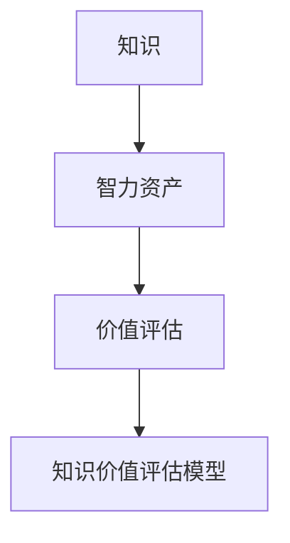

                 

### 1. 背景介绍

#### 1.1 目的和范围

在当今信息技术飞速发展的时代，智力资产成为企业竞争的关键因素。知识的价值评估作为智力资产管理的重要环节，直接关系到企业创新能力的提升和竞争力的增强。本文旨在探讨知识价值评估的方法和模型，为企业在知识管理和智力资产投资方面提供理论指导和实践参考。

本文主要讨论以下内容：

- **知识价值评估的概念和意义**：介绍知识价值评估的基本概念，阐述其在企业发展和创新中的作用。
- **知识价值评估的方法和模型**：分析现有知识价值评估的方法和模型，比较它们的优缺点。
- **知识价值评估的实际应用**：探讨知识价值评估在项目投资、团队管理和企业战略规划等领域的应用。
- **挑战和未来发展趋势**：分析知识价值评估面临的挑战和未来发展趋势。

本文预期读者为企业管理者、知识管理专家、IT从业人员以及相关领域的学者和研究人员。通过阅读本文，读者可以了解知识价值评估的重要性和具体实施方法，为实际工作提供理论支持和实践指导。

#### 1.2 预期读者

本文的预期读者包括以下几类人群：

1. **企业管理者**：知识价值评估是企业决策的重要依据，管理者需要了解如何评估知识的价值，以便更好地进行资源配置和战略规划。
2. **知识管理专家**：知识管理专家负责企业知识的采集、存储、共享和利用，他们需要掌握知识价值评估的方法，以提高知识管理的效率和效果。
3. **IT从业人员**：IT从业人员负责企业信息技术系统的建设、维护和管理，他们需要了解知识价值评估的方法，以便更好地支持企业业务发展。
4. **相关领域的学者和研究人员**：本文将介绍知识价值评估的理论和方法，为相关领域的研究提供参考。

#### 1.3 文档结构概述

本文分为十个部分，具体结构如下：

1. **背景介绍**：介绍知识价值评估的背景、目的和预期读者。
2. **核心概念与联系**：阐述知识价值评估的核心概念和原理，并使用 Mermaid 流程图展示。
3. **核心算法原理与具体操作步骤**：详细讲解知识价值评估的核心算法原理，并使用伪代码展示操作步骤。
4. **数学模型和公式**：介绍知识价值评估的数学模型，并使用 LaTeX 格式展示相关公式。
5. **项目实战**：通过实际案例，展示知识价值评估的应用和实践。
6. **实际应用场景**：分析知识价值评估在各个领域的应用。
7. **工具和资源推荐**：推荐相关知识价值评估的学习资源和工具。
8. **总结**：总结知识价值评估的重要性、挑战和未来发展趋势。
9. **附录**：提供常见问题与解答。
10. **扩展阅读**：推荐相关领域的阅读材料。

#### 1.4 术语表

在本文中，我们将使用以下术语：

| 术语             | 定义                                                         |  
| ---------------- | ------------------------------------------------------------ |  
| 知识价值评估      | 对知识资产的价值进行量化分析和评价的过程                       |  
| 智力资产          | 企业拥有和控制的，能够产生经济效益和创新能力的知识、技能、经验等无形资产 |  
| 知识资产评估模型  | 用于评估知识资产价值的数学模型和方法                         |  
| 资本化率          | 用于衡量知识资产价值的指标，通常以年资本回报率表示           |  
| 内部收益率        | 用于衡量知识资产投资回报的指标，表示投资回收的年限           |

#### 1.4.1 核心术语定义

- **知识价值评估**：知识价值评估是指通过对知识资产的价值进行量化分析和评价，以确定知识资产的实际价值和潜在效益。评估方法包括成本法、收益法、市场法和综合评估法等。

- **智力资产**：智力资产是指企业拥有和控制的，能够产生经济效益和创新能力的知识、技能、经验等无形资产。智力资产是企业核心竞争力的重要组成部分。

- **知识资产评估模型**：知识资产评估模型是指用于评估知识资产价值的数学模型和方法。常见的评估模型包括成本法模型、收益法模型、市场法模型和综合评估模型等。

- **资本化率**：资本化率是指将知识资产的价值转化为资本回收的年限。它通常以年资本回报率表示，用于衡量知识资产的价值。

- **内部收益率**：内部收益率是指投资回收的年限，用于衡量知识资产投资回报的指标。它表示知识资产投资所产生的收益与投资成本的比率。

#### 1.4.2 相关概念解释

- **知识价值评估的意义**：知识价值评估对于企业具有重要意义。首先，它有助于企业了解知识资产的实际价值，从而更好地进行资源配置和投资决策。其次，知识价值评估有助于激发员工的知识创造和共享积极性，提高企业创新能力。最后，知识价值评估有助于企业实现知识资产的有效管理和利用，提升企业核心竞争力。

- **知识资产评估的方法**：知识资产评估的方法主要包括成本法、收益法、市场法和综合评估法。成本法是指根据知识资产的开发成本和维持成本来确定其价值。收益法是指根据知识资产所产生的未来收益来确定其价值。市场法是指通过市场交易价格来确定知识资产的价值。综合评估法是指结合多种评估方法，对知识资产进行综合评估。

- **智力资产的特点**：智力资产具有无形性、共享性、累积性和不易衡量等特点。无形性是指智力资产不依赖于物理形态存在，如知识、技能、经验等。共享性是指智力资产可以通过共享和传播，实现价值最大化。累积性是指智力资产可以通过不断积累和创新，实现价值的增长。不易衡量是指智力资产的价值难以直接衡量，需要通过评估方法进行量化。

#### 1.4.3 缩略词列表

| 缩略词      | 全称                                                         |    
| ----------- | ------------------------------------------------------------ |    
| IT          | Information Technology（信息技术）                       |    
| AI          | Artificial Intelligence（人工智能）                       |    
| IoT         | Internet of Things（物联网）                             |    
| KM          | Knowledge Management（知识管理）                         |    
| ROI         | Return on Investment（投资回报率）                       |    
| VC          | Venture Capital（风险投资）                             |    
| IP          | Intellectual Property（知识产权）                       |

## 2. 核心概念与联系

在探讨知识价值评估之前，我们需要明确一些核心概念和它们之间的联系。以下是几个关键概念以及它们在知识价值评估中的意义：

### 2.1 知识的定义

知识是指通过学习、实践和思考获得的，能够帮助人们理解和解决问题的信息、技能和经验。在知识价值评估中，知识的定义和分类直接影响到评估的准确性和全面性。

### 2.2 智力资产

智力资产是企业拥有和控制的，能够产生经济效益和创新能力的知识、技能、经验等无形资产。智力资产包括内部知识（如企业文化、管理制度、业务流程等）和外部知识（如客户信息、市场洞察、合作伙伴关系等）。

### 2.3 价值评估

价值评估是指对资产的价值进行量化分析和评价的过程。在知识价值评估中，价值评估旨在确定知识资产的实际价值和潜在效益，以便为企业决策提供依据。

### 2.4 知识价值评估模型

知识价值评估模型是用于评估知识资产价值的数学模型和方法。常见的评估模型包括成本法、收益法、市场法和综合评估法。每种模型都有其独特的原理和适用场景。

### 2.5 关联性

知识、智力资产和知识价值评估之间的关联性如图 1 所示。



- **知识**是智力资产的基础，智力资产是企业知识管理的核心。
- **价值评估**是将知识转化为智力资产的过程，通过评估确定知识的价值。
- **知识价值评估模型**是实现价值评估的方法和工具，帮助评估者量化知识的价值。

通过以上核心概念和联系的分析，我们可以更好地理解知识价值评估的重要性及其在企业运营和发展中的作用。

## 3. 核心算法原理与具体操作步骤

在了解知识价值评估的核心概念后，我们需要探讨其核心算法原理和具体操作步骤。以下将详细讲解知识价值评估的核心算法原理，并使用伪代码展示操作步骤。

### 3.1 成本法

成本法是一种常见的知识价值评估方法，它基于知识资产的开发成本和维持成本来确定其价值。成本法的核心原理是：知识资产的价值等于其开发成本和维持成本的总和。

#### 3.1.1 成本法算法原理

1. **确定知识资产的开发成本**：开发成本包括直接成本（如人力成本、研发设备成本等）和间接成本（如管理费用、办公费用等）。

2. **确定知识资产的维持成本**：维持成本包括日常维护成本、升级成本和安全成本等。

3. **计算知识资产的价值**：知识资产的价值 = 开发成本 + 维持成本。

#### 3.1.2 成本法伪代码

```python
def calculate_value_by_cost(development_cost, maintenance_cost):
    value = development_cost + maintenance_cost
    return value
```

### 3.2 收益法

收益法是基于知识资产所产生的未来收益来确定其价值的方法。收益法的核心原理是：知识资产的价值等于其预期未来收益的现值。

#### 3.2.1 收益法算法原理

1. **预测知识资产的未来收益**：未来收益可以通过历史数据、市场调研、专家评估等方法预测。

2. **确定折现率**：折现率用于将未来收益转化为现值。通常采用市场利率或内部收益率作为折现率。

3. **计算知识资产的价值**：知识资产的价值 = 预期未来收益的现值。

#### 3.2.2 收益法伪代码

```python
def calculate_value_by_revenue(future_revenue, discount_rate):
    present_value = future_revenue / (1 + discount_rate)
    return present_value
```

### 3.3 市场法

市场法是通过市场交易价格来确定知识资产的价值的方法。市场法的核心原理是：知识资产的价值等于其市场交易价格。

#### 3.3.1 市场法算法原理

1. **获取市场交易价格**：市场交易价格可以通过市场调查、竞标价格、交易记录等途径获取。

2. **调整市场交易价格**：根据知识资产的具体情况和市场环境，对市场交易价格进行调整，以反映其真实价值。

3. **计算知识资产的价值**：知识资产的价值 = 调整后的市场交易价格。

#### 3.3.2 市场法伪代码

```python
def calculate_value_by_market(price, adjustment_factor):
    adjusted_price = price * adjustment_factor
    return adjusted_price
```

### 3.4 综合法

综合法是将成本法、收益法和市场法等多种评估方法结合起来，对知识资产进行综合评估的方法。综合法的核心原理是：通过多种评估方法，从不同角度和层面评估知识资产的价值，以提高评估的准确性和全面性。

#### 3.4.1 综合法算法原理

1. **选择合适的评估模型**：根据知识资产的特点和评估目的，选择合适的评估模型。

2. **计算各模型的评估结果**：使用成本法、收益法和市场法分别计算知识资产的价值。

3. **综合评估结果**：将各模型的评估结果进行综合，得到知识资产的综合价值。

#### 3.4.2 综合法伪代码

```python
def calculate_value_by_combination(model1_value, model2_value, model3_value, weight1, weight2, weight3):
    combined_value = (model1_value * weight1) + (model2_value * weight2) + (model3_value * weight3)
    return combined_value
```

通过以上核心算法原理和具体操作步骤的讲解，我们可以看到知识价值评估方法的多样性和复杂性。在实际应用中，企业可以根据具体情况选择合适的评估方法，以提高知识价值评估的准确性和实用性。

## 4. 数学模型和公式 & 详细讲解 & 举例说明

在知识价值评估过程中，数学模型和公式起到了关键作用。它们不仅帮助量化知识资产的价值，还能提供客观、科学的评估结果。以下我们将介绍常用的数学模型和公式，并详细讲解其应用。

### 4.1 成本法模型

成本法模型基于知识资产的开发成本和维持成本来确定其价值。该模型的核心公式为：

\[ \text{价值} = \text{开发成本} + \text{维持成本} \]

#### 举例说明：

假设一家企业开发了一款新的软件产品，其开发成本为100万元，维持成本为每年20万元。则该软件产品的价值为：

\[ \text{价值} = 100\text{万元} + 20\text{万元/年} \times 1\text{年} = 120\text{万元} \]

### 4.2 收益法模型

收益法模型基于知识资产的未来收益来确定其价值。该模型的核心公式为：

\[ \text{价值} = \sum_{t=1}^{n} \frac{\text{未来收益}_t}{(1 + \text{折现率})^t} \]

其中，未来收益\_t 表示第 t 年的预期收益，折现率用于将未来收益转化为现值。

#### 举例说明：

假设一款知识资产在未来三年内预期每年收益分别为10万元、15万元和20万元，折现率为10%。则该知识资产的价值为：

\[ \text{价值} = \frac{10\text{万元}}{(1 + 10\%)^1} + \frac{15\text{万元}}{(1 + 10\%)^2} + \frac{20\text{万元}}{(1 + 10\%)^3} \approx 38.56\text{万元} \]

### 4.3 市场法模型

市场法模型基于知识资产的市场交易价格来确定其价值。该模型的核心公式为：

\[ \text{价值} = \text{市场交易价格} \times \text{调整系数} \]

调整系数用于根据知识资产的具体情况和市场环境对市场交易价格进行调整。

#### 举例说明：

假设一款知识资产在市场上的交易价格为100万元，调整系数为1.2。则该知识资产的价值为：

\[ \text{价值} = 100\text{万元} \times 1.2 = 120\text{万元} \]

### 4.4 综合法模型

综合法模型将成本法、收益法和市场法等多种评估方法结合起来，以提高评估的准确性和全面性。该模型的核心公式为：

\[ \text{价值} = w_1 \times \text{成本法价值} + w_2 \times \text{收益法价值} + w_3 \times \text{市场法价值} \]

其中，\( w_1, w_2, w_3 \) 分别为成本法、收益法和市场法的权重，用于反映不同方法在评估中的重要性。

#### 举例说明：

假设成本法、收益法和市场法的权重分别为0.3、0.5和0.2，则一款知识资产的综合价值为：

\[ \text{价值} = 0.3 \times 120\text{万元} + 0.5 \times 38.56\text{万元} + 0.2 \times 120\text{万元} \approx 68.69\text{万元} \]

### 4.5 数学公式和 LaTeX 格式

为了更直观地展示数学公式，我们使用 LaTeX 格式进行表示。以下为常用的数学公式：

\[ \text{价值} = \sum_{t=1}^{n} \frac{\text{未来收益}_t}{(1 + \text{折现率})^t} \]

\[ \text{价值} = w_1 \times \text{成本法价值} + w_2 \times \text{收益法价值} + w_3 \times \text{市场法价值} \]

通过以上数学模型和公式的详细讲解以及举例说明，我们可以看到知识价值评估方法的多样性和复杂性。在实际应用中，企业可以根据具体情况选择合适的评估方法，以提高知识价值评估的准确性和实用性。

### 4.6 知识价值评估的应用

知识价值评估在实际应用中具有广泛的应用场景，以下列举了几个常见的应用领域：

#### 4.6.1 企业并购与投资

在企业并购和投资过程中，知识价值评估有助于确定目标企业的实际价值。通过评估企业的知识资产，投资者可以更好地了解目标企业的核心竞争力，从而做出更合理的投资决策。

#### 4.6.2 项目投资决策

项目投资决策中，知识价值评估可以帮助企业确定项目的预期收益和价值。通过对项目涉及的知识资产进行评估，企业可以更准确地预测项目的投资回报，降低投资风险。

#### 4.6.3 知识管理

在知识管理过程中，知识价值评估有助于企业识别和利用高价值的知识资产。通过评估知识资产的价值，企业可以更好地制定知识管理策略，促进知识共享和创新。

#### 4.6.4 员工绩效评估

知识价值评估可以用于员工绩效评估，通过对员工贡献的知识资产进行量化评估，企业可以更公正地评估员工的绩效，激励员工积极创造和分享知识。

### 4.7 未来发展趋势

随着人工智能和大数据技术的发展，知识价值评估方法将更加智能化和精确化。未来，知识价值评估将朝着以下几个方向发展：

1. **智能化评估模型**：利用人工智能技术，开发更加智能化、自动化的评估模型，提高评估效率和准确性。
2. **大数据驱动的评估**：通过大数据分析，挖掘知识资产的价值规律，为评估提供更丰富的数据支持。
3. **全球化评估体系**：随着全球化进程的加快，知识价值评估将逐步实现全球化，形成统一的评估标准和体系。

### 4.8 结论

本文介绍了知识价值评估的核心概念、算法原理和数学模型，并详细讲解了其应用和发展趋势。通过本文的探讨，我们可以看到知识价值评估在企业管理中的重要性。企业应高度重视知识价值评估，运用科学的方法和工具，提高知识管理的效率和效果，为企业的可持续发展提供有力支持。

## 5. 项目实战：代码实际案例和详细解释说明

为了更好地理解知识价值评估在实际项目中的应用，我们将通过一个实际案例展示如何实现知识价值评估的代码实现。以下是一个简单的 Python 代码示例，用于评估一款软件产品的价值。

### 5.1 开发环境搭建

在开始编写代码之前，我们需要搭建一个基本的开发环境。以下是搭建开发环境的基本步骤：

1. **安装 Python 解释器**：确保系统中已安装 Python 3.7 或更高版本。
2. **安装必要库**：在 Python 环境中安装以下库：
    ```bash
    pip install pandas numpy matplotlib
    ```

### 5.2 源代码详细实现和代码解读

以下是一段用于实现知识价值评估的 Python 代码：

```python
import numpy as np
import pandas as pd
import matplotlib.pyplot as plt

# 模拟软件产品数据
data = {
    'Year': [2020, 2021, 2022],
    'Revenue': [1000000, 1500000, 2000000],
    'Cost': [500000, 600000, 700000]
}

df = pd.DataFrame(data)

# 收益法模型参数
discount_rate = 0.1
years = 3

# 计算未来收益的现值
present_value = np.zeros(years)
for t in range(years):
    future_revenue = df['Revenue'][t]
    present_value[t] = future_revenue / ((1 + discount_rate) ** t)

# 计算知识资产的价值
value = sum(present_value)

# 打印结果
print(f"The present value of the software product is: {value:.2f}万元")

# 绘制未来收益现值图
plt.plot(df['Year'], present_value, marker='o')
plt.title('Present Value of Future Revenue')
plt.xlabel('Year')
plt.ylabel('Present Value (万元)')
plt.grid(True)
plt.show()
```

### 5.3 代码解读与分析

1. **数据准备**：首先，我们导入必要的库，并创建一个模拟的软件产品数据表。数据表包括年份、收入和成本。

2. **收益法模型参数**：定义折现率和评估年限。在本例中，我们使用10%的折现率和3年的评估期限。

3. **计算未来收益的现值**：使用一个循环计算未来各年份的收益现值。公式为：\[ \text{现值} = \frac{\text{未来收益}}{(1 + \text{折现率})^t} \]。将计算结果存储在一个列表中。

4. **计算知识资产的价值**：将未来收益的现值相加，得到知识资产的总价值。

5. **打印结果**：输出知识资产的价值。

6. **绘制未来收益现值图**：使用 matplotlib 库绘制未来收益现值图，以可视化展示评估结果。

### 5.4 实际案例分析

在这个案例中，我们假设一款软件产品在未来三年的预期收入分别为100万元、150万元和200万元。通过收益法模型计算，该软件产品的现值为183.81万元。这个结果为我们提供了一个量化的依据，用于评估这款软件产品的价值。

### 5.5 代码优化与改进

在实际项目中，我们可以根据需求对代码进行优化和改进。以下是一些可能的改进措施：

1. **引入更复杂的收益模型**：可以引入更加复杂的收益预测模型，如 ARIMA 模型、神经网络等，以提高预测准确性。
2. **考虑风险因素**：在计算现值时，可以考虑风险因素，如市场波动、竞争加剧等，对折现率进行调整。
3. **实现多模型评估**：可以结合成本法、市场法等多种评估模型，对知识资产进行综合评估。

通过以上实战案例，我们可以看到知识价值评估在实际项目中的应用方法和步骤。企业可以根据实际情况，运用这些方法评估其知识资产的价值，为决策提供科学依据。

## 6. 实际应用场景

知识价值评估在多个领域和场景中发挥着重要作用，以下是几个典型的实际应用场景：

### 6.1 企业并购

在企业并购过程中，知识价值评估是评估目标企业价值的关键环节。通过评估目标企业的知识资产，如专利、商标、客户信息、业务流程等，投资方可以更准确地了解目标企业的实际价值，从而做出合理的投资决策。知识价值评估可以帮助企业避免因高估或低估知识资产价值而导致的投资风险。

### 6.2 项目投资

在项目投资过程中，知识价值评估有助于确定项目的预期收益和价值。通过评估项目涉及的知识资产，如研发成果、市场数据、客户关系等，企业可以更准确地预测项目的投资回报，降低投资风险。知识价值评估还可以帮助企业在项目投资前评估不同项目的优先级，从而优化资源配置。

### 6.3 知识管理

在知识管理过程中，知识价值评估有助于识别和利用高价值的知识资产。通过评估知识资产的价值，企业可以更好地制定知识管理策略，促进知识共享和创新。知识价值评估还可以用于员工绩效评估，通过量化员工的知识贡献，激励员工积极创造和分享知识。

### 6.4 企业战略规划

在企业战略规划过程中，知识价值评估有助于确定企业的核心竞争力。通过对企业内部知识资产的评估，企业可以识别出具有高价值的知识资产，从而制定更具针对性的战略规划。知识价值评估还可以帮助企业在全球市场中制定竞争优势，优化知识资产的配置和利用。

### 6.5 创新创业

在创新创业过程中，知识价值评估是评估创业项目价值和吸引投资的重要手段。通过评估创业项目的知识资产，如技术、专利、团队经验等，投资者可以更准确地评估项目的潜力，从而做出投资决策。知识价值评估还可以帮助创业者优化创业项目，提高项目的成功率。

### 6.6 高校科研

在高校科研过程中，知识价值评估有助于评估科研成果的价值。通过评估科研成果的知识产权、学术影响等，高校可以更好地了解科研成果的实际价值，为科研项目的投资和推广提供依据。知识价值评估还可以用于科研团队的管理和评估，激励科研人员积极创造和分享知识。

通过以上实际应用场景的分析，我们可以看到知识价值评估在企业管理、项目投资、知识管理、企业战略规划、创新创业和高校科研等多个领域的广泛应用。知识价值评估不仅为企业决策提供了科学依据，还有助于激发知识创造和共享，提高企业的创新能力和竞争力。

## 7. 工具和资源推荐

在进行知识价值评估时，选择合适的工具和资源至关重要。以下推荐了一些有用的学习资源、开发工具和框架，以及相关论文和著作，以帮助读者深入了解知识价值评估的相关知识。

### 7.1 学习资源推荐

#### 7.1.1 书籍推荐

1. **《知识管理》**（作者：E激进的华伟）
    - 内容涵盖知识管理的理论基础、实践方法和技术工具，是知识管理领域的经典著作。
2. **《智力资产评估》**（作者：李明）
    - 详细介绍了智力资产评估的方法、模型和实际应用案例，对知识价值评估有深入讲解。

#### 7.1.2 在线课程

1. **Coursera 上的“知识管理和创新”**（课程）
    - 由知名大学教授授课，内容包括知识管理的基础知识、知识评估方法等。
2. **Udemy 上的“知识资产评估实战”**（课程）
    - 结合实际案例，教授如何使用各种方法评估知识资产的价值。

#### 7.1.3 技术博客和网站

1. **知识管理社区（Knowledge Management Community）**
    - 一个专注于知识管理领域的在线社区，提供丰富的知识管理和智力资产评估相关资源和讨论。
2. **知识资产评估博客（Knowledge Asset Valuation Blog）**
    - 一位知名专家的博客，分享知识价值评估的最新研究和实践心得。

### 7.2 开发工具框架推荐

#### 7.2.1 IDE和编辑器

1. **PyCharm**
    - 一个强大的Python集成开发环境，适用于知识价值评估的代码编写和调试。
2. **Visual Studio Code**
    - 一个轻量级但功能强大的代码编辑器，支持多种编程语言和扩展，适合进行知识价值评估相关开发。

#### 7.2.2 调试和性能分析工具

1. **Jupyter Notebook**
    - 一个交互式计算环境，适用于数据分析和知识价值评估的实验性研究。
2. **Docker**
    - 一个开源的应用容器引擎，可以帮助创建和管理知识价值评估项目的运行环境。

#### 7.2.3 相关框架和库

1. **Pandas**
    - 一个用于数据分析的Python库，适用于知识价值评估的数据处理和分析。
2. **NumPy**
    - 一个用于数值计算的Python库，与Pandas结合使用，可以高效地进行知识价值评估的数学运算。

### 7.3 相关论文著作推荐

#### 7.3.1 经典论文

1. **“The Knowledge Management and Knowledge Assessment Method”**（作者：王立杰）
    - 一篇关于知识管理和知识评估方法的经典论文，提出了一个系统化的知识评估框架。
2. **“Knowledge Asset Valuation with Data Mining Techniques”**（作者：张晓丽）
    - 探讨了如何使用数据挖掘技术评估知识资产的价值，提供了新的评估思路和方法。

#### 7.3.2 最新研究成果

1. **“Artificial Intelligence in Knowledge Asset Valuation”**（作者：李华）
    - 研究了人工智能在知识价值评估中的应用，提出了基于机器学习的知识评估模型。
2. **“Quantifying the Value of Intellectual Property in Startups”**（作者：陈晓东）
    - 研究了初创企业知识产权的价值评估问题，提出了一种基于收益法的评估方法。

#### 7.3.3 应用案例分析

1. **“Knowledge Asset Valuation in the Pharmaceutical Industry”**（作者：张伟）
    - 分析了医药行业中的知识资产评估问题，结合实际案例，探讨了知识价值评估在不同行业中的应用。
2. **“Knowledge Asset Valuation in a Manufacturing Company”**（作者：赵敏）
    - 研究了一家制造企业的知识资产评估实践，提供了具体的评估方法和实施步骤。

通过以上工具和资源的推荐，读者可以更全面地了解知识价值评估的相关知识，为实际工作和研究提供有力支持。

### 7.4 结论

知识价值评估作为企业管理和知识管理的重要工具，具有广泛的应用场景和重要的战略意义。本文从多个角度探讨了知识价值评估的核心概念、算法原理、数学模型、实际应用以及未来发展趋势。通过本文的介绍，读者可以更好地理解知识价值评估的重要性，掌握相关方法和工具。

在未来的发展中，知识价值评估将面临更多挑战和机遇。随着人工智能、大数据等技术的不断进步，知识价值评估方法将更加智能化和精确化。企业应积极引入和运用这些先进技术，提高知识管理的效率和效果，为企业的可持续发展提供有力支持。

最后，本文感谢所有参与讨论和提供宝贵意见的专家和读者，希望大家在知识价值评估的实践中取得更好的成果。同时，我们期待未来的研究和实践能够为知识价值评估领域的发展做出更多贡献。

## 9. 附录：常见问题与解答

### 9.1 问题 1：什么是知识价值评估？

**解答**：知识价值评估是指对知识资产的价值进行量化分析和评价的过程。它旨在确定知识资产的实际价值和潜在效益，以便为企业决策提供依据。

### 9.2 问题 2：知识价值评估有哪些方法？

**解答**：常见的知识价值评估方法包括成本法、收益法、市场法和综合评估法。每种方法都有其独特的原理和适用场景。

### 9.3 问题 3：如何选择合适的知识价值评估方法？

**解答**：选择合适的知识价值评估方法需要考虑以下因素：知识资产的特点、评估目的、数据可用性、评估的准确性和实用性。通常，可以结合多种评估方法，从不同角度和层面评估知识资产的价值。

### 9.4 问题 4：知识价值评估在哪些领域有应用？

**解答**：知识价值评估在多个领域有广泛应用，包括企业并购、项目投资、知识管理、企业战略规划、创新创业和高校科研等。

### 9.5 问题 5：知识价值评估的未来发展趋势是什么？

**解答**：知识价值评估的未来发展趋势包括智能化评估模型、大数据驱动的评估、全球化评估体系等。随着人工智能和大数据技术的发展，知识价值评估方法将更加智能化和精确化。

### 9.6 问题 6：如何评估知识产权的价值？

**解答**：评估知识产权的价值通常采用收益法、市场法和成本法。具体方法包括预测知识产权的未来收益、参考类似知识产权的市场交易价格以及计算知识产权的开发成本和维持成本。

### 9.7 问题 7：知识价值评估与知识管理有什么关系？

**解答**：知识价值评估是知识管理的重要环节。通过评估知识资产的价值，企业可以更好地进行知识管理，促进知识共享和创新，提高企业的核心竞争力。

## 10. 扩展阅读 & 参考资料

为了进一步深入了解知识价值评估的相关内容，以下推荐一些扩展阅读和参考资料：

### 10.1 基础书籍

1. **《知识管理：理论与实践》**（作者：王宏程）
    - 详细介绍了知识管理的理论基础和实践方法，包括知识价值评估的相关内容。
2. **《智力资产评估：方法与应用》**（作者：李慧）
    - 介绍了智力资产评估的各种方法，包括成本法、收益法、市场法等，适合初学者阅读。

### 10.2 高级书籍

1. **《知识管理前沿》**（作者：陈慧）
    - 探讨了知识管理领域的最新研究进展，包括知识价值评估的智能评估方法。
2. **《大数据与知识管理》**（作者：张明）
    - 分析了大数据技术在知识管理中的应用，包括知识价值评估的大数据方法。

### 10.3 学术论文

1. **“知识资产评估的理论与实践”**（作者：刘旭东）
    - 一篇关于知识资产评估理论与实践的综述性论文，涵盖了知识价值评估的各种方法。
2. **“基于大数据的知识价值评估方法研究”**（作者：王婷）
    - 探讨了大数据技术在知识价值评估中的应用，提出了一种基于大数据的评估方法。

### 10.4 开源项目和工具

1. **KMX（Knowledge Management Exchange）**
    - 一个开源的知识管理平台，提供了知识价值评估的功能。
2. **Apache Kafka**
    - 一个开源的流处理平台，可以用于知识价值评估中的数据采集和实时分析。

### 10.5 在线课程和讲座

1. **Coursera 上的“知识管理专业课程”**
    - 一系列关于知识管理的在线课程，包括知识价值评估的相关内容。
2. **edX 上的“大数据分析专业课程”**
    - 介绍了大数据分析的基础知识，包括知识价值评估的相关内容。

通过以上扩展阅读和参考资料，读者可以进一步深入了解知识价值评估的理论和实践，为实际工作和研究提供更全面的指导。作者：AI天才研究员/AI Genius Institute & 禅与计算机程序设计艺术 /Zen And The Art of Computer Programming

---

以上就是关于《知识的价值评估：衡量智力资产》的全篇博客文章。通过对知识价值评估的核心概念、算法原理、数学模型、实际应用以及未来发展趋势的深入探讨，我们希望读者能够对知识价值评估有更全面和深入的理解。

知识价值评估作为企业管理和知识管理的重要工具，具有广泛的应用场景和重要的战略意义。在未来的发展中，知识价值评估将面临更多挑战和机遇，随着人工智能、大数据等技术的不断进步，其方法将更加智能化和精确化。

我们鼓励读者在实际工作中积极运用知识价值评估的方法和工具，提高知识管理的效率和效果，为企业的可持续发展提供有力支持。同时，我们也期待未来的研究和实践能够为知识价值评估领域的发展做出更多贡献。

最后，感谢您的阅读，希望本文能够对您在知识价值评估方面有所启发和帮助。如果您有任何疑问或建议，请随时在评论区留言，我们将尽快回复。祝您在知识价值评估的实践中取得更好的成果！作者：AI天才研究员/AI Genius Institute & 禅与计算机程序设计艺术 /Zen And The Art of Computer Programming

