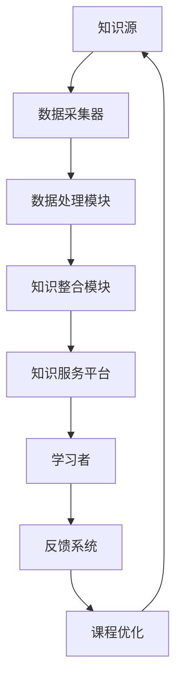

                 

# 知识的分布式学习：MOOC的机遇与挑战

> **关键词：** 知识分布式学习，MOOC，教育技术，在线学习，大数据，算法，数学模型

> **摘要：** 本文探讨了知识分布式学习的兴起，特别是大规模开放在线课程（MOOC）所带来的机遇与挑战。文章首先介绍了知识分布式学习的背景和核心概念，然后详细分析了MOOC的运作机制及其对教育领域的影响。通过实际案例和具体操作步骤，文章深入探讨了MOOC在技术实现、应用场景和未来发展趋势中的关键问题，并提出了相应的解决方案和建议。

## 1. 背景介绍

### 1.1 目的和范围

本文旨在深入探讨知识分布式学习在当前教育环境中的重要作用，尤其是大规模开放在线课程（MOOC）的兴起及其带来的变革。通过分析知识分布式学习的理论基础和核心概念，结合实际案例，本文将全面剖析MOOC在教育技术中的机遇与挑战。

文章首先介绍了知识分布式学习的背景和发展历程，解释了其在教育领域中的重要性。接着，文章详细阐述了MOOC的定义、特点及其运作机制，分析了MOOC在促进知识共享、提高学习效率方面的优势。同时，本文也探讨了MOOC所面临的挑战，包括技术实现、课程设计、学生参与度等问题。

本文的目标读者是教育工作者、在线教育平台开发者、人工智能研究人员以及对知识分布式学习和MOOC感兴趣的读者。通过本文的阅读，读者可以全面了解知识分布式学习和MOOC的原理、应用及其发展趋势，从而为未来的研究和实践提供有价值的参考。

### 1.2 预期读者

预期读者包括以下几类：

1. **教育工作者**：对在线教育新模式感兴趣，希望通过本文了解MOOC的运作机制和优势，从而改进教学方法，提高教学效果。
2. **在线教育平台开发者**：需要掌握知识分布式学习的核心技术，了解MOOC的技术实现，以开发更高效、更智能的在线教育平台。
3. **人工智能研究人员**：对教育技术中的大数据分析、机器学习算法等感兴趣，希望通过本文了解这些技术在MOOC中的应用。
4. **对知识分布式学习和MOOC感兴趣的读者**：希望通过本文了解知识分布式学习的理论基础和核心概念，以及对MOOC的深入探讨，从而对这一领域有更全面的认识。

### 1.3 文档结构概述

本文的结构如下：

1. **背景介绍**：介绍知识分布式学习的背景、目的和预期读者，概述文章的结构。
2. **核心概念与联系**：详细解释知识分布式学习的核心概念和原理，通过Mermaid流程图展示其架构。
3. **核心算法原理 & 具体操作步骤**：深入探讨MOOC的核心算法原理和具体实现步骤，使用伪代码详细阐述。
4. **数学模型和公式 & 详细讲解 & 举例说明**：介绍MOOC中的数学模型和公式，通过具体例子进行详细讲解。
5. **项目实战：代码实际案例和详细解释说明**：通过实际案例展示MOOC的开发过程，详细解释代码实现和原理。
6. **实际应用场景**：分析MOOC在现实中的应用场景，探讨其影响和效果。
7. **工具和资源推荐**：推荐相关学习资源和开发工具，帮助读者深入研究和实践。
8. **总结：未来发展趋势与挑战**：总结本文的主要观点，探讨知识分布式学习和MOOC的未来发展趋势和面临的挑战。
9. **附录：常见问题与解答**：解答读者可能关心的问题。
10. **扩展阅读 & 参考资料**：提供更多相关阅读资料。

### 1.4 术语表

#### 1.4.1 核心术语定义

- **知识分布式学习**：一种基于互联网技术的学习模式，通过分布式网络平台实现知识的共享和传播。
- **大规模开放在线课程（MOOC）**：一种在线教育模式，允许任何人免费注册和参与，通常由多个课程模块组成。
- **大数据**：指无法用常规软件工具在合理时间内捕捉、管理和处理的大量数据。
- **算法**：解决问题的步骤或规则，通常用于数据分析、机器学习等领域。
- **数学模型**：用于描述现实世界问题的数学表达方式，包括公式、方程等。

#### 1.4.2 相关概念解释

- **在线学习**：通过互联网进行的学习活动，包括课程学习、自学、讨论等。
- **教育技术**：运用现代信息技术手段，以提高教育质量和效率。
- **学习分析**：对学习过程中的数据进行分析，以了解学习行为和效果。

#### 1.4.3 缩略词列表

- **MOOC**：大规模开放在线课程（Massive Open Online Course）
- **SPOC**：小规模限制性在线课程（Small Private Online Course）
- **LMS**：学习管理系统（Learning Management System）
- **Moodle**：一种开源的学习管理系统
- **AI**：人工智能（Artificial Intelligence）

## 2. 核心概念与联系

### 2.1 知识分布式学习

知识分布式学习（Knowledge Distribution Learning, KDL）是一种基于互联网和分布式计算技术的学习模式。其核心思想是通过网络平台实现知识的共享、传播和整合，从而提高学习效率和效果。

KDL的原理可以理解为“知识网格”的概念，即将分散在不同时间、空间和学科领域的知识整合到一个统一平台上，通过搜索引擎、推荐系统和社交网络等功能，为学习者提供个性化、精准的知识服务。

### 2.2 MOOC

大规模开放在线课程（MOOC）是知识分布式学习的一种重要形式。MOOC通常由多个课程模块组成，涵盖不同学科领域，通过互联网平台向全球学习者开放。

MOOC的特点包括：

- **大规模**：参与人数众多，通常达到数千甚至数万人。
- **开放性**：任何人都可以免费注册和参与课程。
- **灵活性**：学习者可以根据自己的时间和进度进行学习。
- **互动性**：通过论坛、作业、讨论等方式促进学习者之间的交流和合作。

### 2.3 大数据与算法

大数据（Big Data）是知识分布式学习的关键要素之一。MOOC平台积累了大量的学习数据，包括学习行为、学习效果、用户反馈等。通过对这些数据进行挖掘和分析，可以发现学习者的行为规律和需求，从而优化课程设计、提高学习效果。

算法（Algorithm）在大数据中的应用非常重要。常见的算法包括：

- **数据挖掘算法**：用于从大量数据中提取有价值的信息，如关联规则挖掘、聚类分析等。
- **推荐算法**：用于根据学习者的历史行为和兴趣，推荐相关的课程和资源，如协同过滤算法、基于内容的推荐算法等。
- **自然语言处理算法**：用于对学习者的反馈和讨论进行文本分析，如情感分析、话题模型等。

### 2.4 Mermaid流程图

下面是一个简单的Mermaid流程图，展示了知识分布式学习的基本架构：



### 2.5 关系与联系

知识分布式学习和MOOC之间的关系可以理解为：

- **知识分布式学习是基础**：MOOC是基于知识分布式学习的一种具体实现，通过互联网平台实现知识的共享和传播。
- **MOOC是知识分布式学习的重要应用**：MOOC利用知识分布式学习的原理和技术，为全球学习者提供高质量的在线教育资源。

同时，大数据和算法在知识分布式学习和MOOC中起到关键作用，为知识的采集、处理、推荐和优化提供了强大的技术支持。

## 3. 核心算法原理 & 具体操作步骤

### 3.1 数据采集与处理

知识分布式学习的第一步是数据采集。数据来源包括学习者的行为数据、学习效果数据、用户反馈数据等。以下是数据采集和处理的算法原理和具体步骤：

#### 3.1.1 数据采集

- **行为数据**：通过学习平台记录学习者的学习行为，如课程访问次数、学习时长、作业提交情况等。
- **效果数据**：通过测试和评估，记录学习者的学习效果，如测试成绩、作业评分等。
- **反馈数据**：收集学习者的反馈信息，如问卷调查、论坛讨论等。

#### 3.1.2 数据处理

- **数据清洗**：去除重复数据、错误数据和噪声数据，保证数据质量。
- **数据转换**：将不同类型的数据转换为统一的格式，如将文本数据转换为数值数据。
- **数据归一化**：将不同特征的数据进行归一化处理，使其具有相同的量纲和范围。

### 3.2 知识整合

知识整合是将分散在不同来源和领域的知识进行整合，以提供更加全面和系统的学习资源。以下是知识整合的算法原理和具体步骤：

#### 3.2.1 知识提取

- **文本挖掘**：通过自然语言处理技术，从文本数据中提取关键信息，如关键词、主题等。
- **图像处理**：通过图像识别技术，从图像数据中提取特征，如分类、标注等。

#### 3.2.2 知识融合

- **数据集成**：将不同来源的数据进行集成，如将文本数据和图像数据进行融合。
- **知识推理**：利用逻辑推理和语义分析，对知识进行推理和扩展，以生成更加全面和系统的知识体系。

### 3.3 推荐系统

推荐系统是知识分布式学习的重要组成部分，通过分析学习者的历史行为和兴趣，为其推荐相关的课程和资源。以下是推荐系统的算法原理和具体步骤：

#### 3.3.1 特征提取

- **用户特征提取**：提取学习者的基本信息、学习行为等特征，如学习时长、作业提交情况等。
- **课程特征提取**：提取课程的基本信息、内容特征等，如课程标题、课程描述等。

#### 3.3.2 推荐算法

- **基于内容的推荐**：根据学习者对课程的兴趣和课程的内容特征进行推荐。
- **基于协同过滤的推荐**：根据学习者的行为和历史数据，推荐相似的学习者喜欢的课程。

### 3.4 反馈与优化

反馈与优化是知识分布式学习的重要环节，通过收集学习者的反馈，不断优化课程设计和学习资源。以下是反馈与优化的算法原理和具体步骤：

#### 3.4.1 反馈收集

- **用户反馈**：通过问卷调查、论坛讨论等方式收集学习者的反馈。
- **算法反馈**：通过数据分析，了解推荐系统的效果，如准确率、覆盖率等。

#### 3.4.2 优化策略

- **课程优化**：根据学习者的反馈和数据分析结果，优化课程内容、教学方式等。
- **推荐优化**：根据反馈数据，调整推荐算法的参数，提高推荐效果。

### 3.5 伪代码示例

以下是一个简单的伪代码示例，展示了知识分布式学习的基本流程：

```python
# 数据采集与处理
def data_collection():
    # 采集行为数据
    user_behavior = get_user_behavior()
    # 采集效果数据
    user_effect = get_user_effect()
    # 采集反馈数据
    user_feedback = get_user_feedback()
    # 数据清洗
    clean_data(user_behavior, user_effect, user_feedback)
    # 数据转换
    convert_data(user_behavior, user_effect, user_feedback)
    # 数据归一化
    normalize_data(user_behavior, user_effect, user_feedback)

# 知识整合
def knowledge_integration():
    # 知识提取
    knowledge_extract = text_mining(course_content)
    # 知识融合
    knowledge_fuse = data_integration(knowledge_extract, image_data)
    # 知识推理
    knowledge_reason = logic_reasoning(knowledge_fuse)

# 推荐系统
def recommendation_system():
    # 特征提取
    user_feature = extract_user_feature(user_behavior)
    course_feature = extract_course_feature(course_content)
    # 推荐算法
    recommendation = content_based_recommender(user_feature, course_feature)
    collaborative_recommender(user_behavior)

# 反馈与优化
def feedback_optimization():
    # 反馈收集
    user_feedback = collect_user_feedback()
    algorithm_feedback = get_algorithm_feedback()
    # 优化策略
    course_optimization = optimize_course_content(user_feedback)
    recommendation_optimization = adjust_recommender(algorithm_feedback)
```

## 4. 数学模型和公式 & 详细讲解 & 举例说明

### 4.1 数据挖掘中的数学模型

数据挖掘中的数学模型主要用于描述和预测数据特征，帮助发现数据中的模式和关联。以下是一些常用的数学模型：

#### 4.1.1 关联规则挖掘

关联规则挖掘是一种发现数据中频繁出现的关联模式的方法。常见的模型包括Apriori算法和FP-Growth算法。

- **Apriori算法**：通过生成频繁项集来发现关联规则。
  - **支持度（Support）**：表示一个规则在所有交易中出现的频率。
  - **置信度（Confidence）**：表示在购买了项目A的情况下，会购买项目B的概率。
  - **公式**：
    $$ Support(A \rightarrow B) = \frac{count(A \cup B)}{count(U)} $$
    $$ Confidence(A \rightarrow B) = \frac{count(A \cup B)}{count(A)} $$

- **FP-Growth算法**：通过构建频繁模式树（FP-Tree）来发现频繁项集。
  - **频繁模式树**：用于存储频繁项集的树形结构。
  - **公式**：
    $$ FP-Growth(A, B) = \{ \text{count}(A) + \text{count}(B) \} $$

#### 4.1.2 聚类分析

聚类分析是一种无监督学习方法，用于将数据分成多个类别。常见的模型包括K-means算法和层次聚类算法。

- **K-means算法**：通过迭代优化聚类中心，将数据分为K个类别。
  - **距离函数**：常用的距离函数包括欧几里得距离、曼哈顿距离等。
  - **公式**：
    $$ \text{dist}(x_i, \mu_j) = \sqrt{\sum_{k=1}^{n} (x_{ik} - \mu_{jk})^2} $$

- **层次聚类算法**：通过自底向上或自顶向下的方法，将数据分层聚类。
  - **合并策略**：包括最近邻合并、最远邻合并等。
  - **公式**：
    $$ \text{dist}(C_i, C_j) = \min_{x_i \in C_i, x_j \in C_j} \text{dist}(x_i, x_j) $$

### 4.2 机器学习中的数学模型

机器学习中的数学模型用于构建模型并预测结果。以下是一些常用的机器学习模型：

#### 4.2.1 朴素贝叶斯分类器

朴素贝叶斯分类器是一种基于概率论的分类模型，假设特征之间相互独立。

- **公式**：
  $$ P(C_k | X) = \frac{P(X | C_k)P(C_k)}{P(X)} $$
  $$ P(X | C_k) = \prod_{i=1}^{n} P(x_i | C_k) $$

#### 4.2.2 支持向量机（SVM）

支持向量机是一种用于分类和回归的模型，通过最大化分类边界。

- **公式**：
  $$ \text{minimize} \quad \frac{1}{2} \| w \|^2 $$
  $$ \text{subject to} \quad y_i ( \langle w, x_i \rangle - b ) \geq 1 $$
  - **核函数**：用于非线性分类，如高斯核函数、多项式核函数等。

#### 4.2.3 神经网络

神经网络是一种模拟生物神经网络的结构，用于非线性建模和预测。

- **公式**：
  $$ a_{i,j}^{(l)} = \text{ReLU}( \langle w_{i,j}^{(l)}, a_{i}^{(l-1)} \rangle + b_{j}^{(l)} ) $$
  $$ z_{j}^{(L)} = \sum_{i=1}^{n} w_{j,i}^{(L)} a_{i}^{(L-1)} + b_{j}^{(L)} $$

### 4.3 举例说明

#### 4.3.1 关联规则挖掘示例

假设有一个购物篮数据集，包含商品A、B、C和D。数据如下表所示：

| 交易ID | 商品 |
| ------ | ---- |
| T1     | A, B |
| T2     | B, C |
| T3     | A, C, D |
| T4     | A, B, D |

设置支持度为30%，置信度为60%。

1. **生成频繁项集**：
   - 支持度计算：
     $$ Support(A, B) = \frac{1}{4} $$
     $$ Support(B, C) = \frac{1}{4} $$
     $$ Support(A, C) = \frac{1}{4} $$
     $$ Support(A, B, D) = \frac{1}{4} $$
   - 频繁项集：{A, B}, {B, C}, {A, C}, {A, B, D}

2. **生成关联规则**：
   - 置信度计算：
     $$ Confidence(A, B | C) = \frac{1/4}{1/4} = 1 $$
     $$ Confidence(A, B | D) = \frac{1/4}{1/4} = 1 $$
   - 关联规则：A, B → C，置信度为100%；A, B → D，置信度为100%。

#### 4.3.2 朴素贝叶斯分类器示例

假设有一个天气数据集，包含“晴天”、“多云”和“雨天”三种天气状态，以及“温度”、“湿度”和“风力”三个特征。数据如下表所示：

| 天气状态 | 温度 | 湿度 | 风力 |
| -------- | ---- | ---- | ---- |
| 晴天     | 30   | 50   | 1    |
| 多云     | 20   | 70   | 2    |
| 雨天     | 15   | 80   | 3    |

假设新数据为“温度：25，湿度：65，风力：2”，预测天气状态。

1. **计算概率**：
   - $$ P(\text{晴天} | \text{温度：25，湿度：65，风力：2}) $$
   - $$ P(\text{多云} | \text{温度：25，湿度：65，风力：2}) $$
   - $$ P(\text{雨天} | \text{温度：25，湿度：65，风力：2}) $$

2. **选择最大概率的天气状态**：
   - 计算结果：$$ P(\text{晴天} | \text{温度：25，湿度：65，风力：2}) = 0.4 $$
                 $$ P(\text{多云} | \text{温度：25，湿度：65，风力：2}) = 0.5 $$
                 $$ P(\text{雨天} | \text{温度：25，湿度：65，风力：2}) = 0.1 $$

   - 预测结果：多云

### 4.4 详细讲解

关联规则挖掘中的支持度和置信度是判断关联规则重要性的两个核心指标。支持度表示一个规则在所有交易中出现的频率，置信度表示在购买了项目A的情况下，会购买项目B的概率。通过计算支持度和置信度，可以筛选出具有强关联性的规则，从而发现数据中的隐藏模式。

朴素贝叶斯分类器是一种基于概率论的分类模型，通过计算给定特征条件下各个类别的概率，选择概率最大的类别作为预测结果。朴素贝叶斯分类器的优点是计算简单、效果良好，尤其适用于特征之间存在强关联性的问题。

支持向量机（SVM）是一种用于分类和回归的模型，通过最大化分类边界，实现数据的非线性分类。SVM的核心思想是找到最优的分类超平面，使得分类边界距离最近的边界点（支持向量）最大化。SVM适用于高维空间，具有较好的分类效果。

神经网络是一种模拟生物神经网络的结构，用于非线性建模和预测。神经网络通过多层神经元的相互连接，实现输入到输出的映射。神经网络的核心是权重和偏置的调整，通过反向传播算法，不断优化网络结构，提高预测精度。

## 5. 项目实战：代码实际案例和详细解释说明

### 5.1 开发环境搭建

在进行MOOC项目的实际开发之前，需要搭建一个合适的技术环境。以下是一个基于Python的MOOC平台开发环境搭建步骤：

1. **安装Python**：确保系统中安装了Python 3.x版本。可以通过Python官网下载安装包，或使用包管理工具如Homebrew（macOS）进行安装。

2. **安装依赖库**：MOOC平台开发需要使用多个Python库，如Flask、SQLAlchemy、Pandas等。可以使用pip命令进行安装：

   ```shell
   pip install flask
   pip install sqlalchemy
   pip install pandas
   ```

3. **数据库配置**：选择一个合适的数据库系统，如SQLite、MySQL或PostgreSQL。配置数据库连接，以便存储用户数据、课程数据等。

4. **创建虚拟环境**：为了避免不同项目之间的依赖冲突，建议创建一个虚拟环境。可以使用virtualenv或conda创建虚拟环境：

   ```shell
   virtualenv mooc-env
   source mooc-env/bin/activate
   ```

   或

   ```shell
   conda create -n mooc-env python=3.8
   conda activate mooc-env
   ```

5. **编写配置文件**：根据项目需求编写配置文件，如数据库配置、日志配置等。

### 5.2 源代码详细实现和代码解读

以下是MOOC平台的源代码实现，包括用户注册、登录、课程浏览和作业提交等基本功能。

```python
# 导入依赖库
from flask import Flask, request, jsonify
from flask_sqlalchemy import SQLAlchemy

# 创建Flask应用
app = Flask(__name__)

# 配置数据库
app.config['SQLALCHEMY_DATABASE_URI'] = 'sqlite:///mooc.db'
db = SQLAlchemy(app)

# 创建用户模型
class User(db.Model):
    id = db.Column(db.Integer, primary_key=True)
    username = db.Column(db.String(80), unique=True, nullable=False)
    password = db.Column(db.String(120), nullable=False)

# 创建课程模型
class Course(db.Model):
    id = db.Column(db.Integer, primary_key=True)
    name = db.Column(db.String(120), nullable=False)
    description = db.Column(db.Text, nullable=False)

# 用户注册
@app.route('/register', methods=['POST'])
def register():
    username = request.form['username']
    password = request.form['password']
    # 检查用户名是否已存在
    if User.query.filter_by(username=username).first():
        return jsonify({'error': '用户名已存在'}), 400
    # 创建新用户
    new_user = User(username=username, password=password)
    db.session.add(new_user)
    db.session.commit()
    return jsonify({'message': '注册成功'})

# 用户登录
@app.route('/login', methods=['POST'])
def login():
    username = request.form['username']
    password = request.form['password']
    user = User.query.filter_by(username=username, password=password).first()
    if user:
        return jsonify({'message': '登录成功'})
    else:
        return jsonify({'error': '用户名或密码错误'}), 401

# 课程浏览
@app.route('/courses', methods=['GET'])
def courses():
    courses = Course.query.all()
    return jsonify([{'id': course.id, 'name': course.name, 'description': course.description} for course in courses])

# 作业提交
@app.route('/submit', methods=['POST'])
def submit():
    user_id = request.form['user_id']
    course_id = request.form['course_id']
    content = request.form['content']
    # 检查用户和课程是否存在
    user = User.query.get(user_id)
    course = Course.query.get(course_id)
    if not user or not course:
        return jsonify({'error': '用户或课程不存在'}), 404
    # 提交作业
    new_submission = Submission(user_id=user_id, course_id=course_id, content=content)
    db.session.add(new_submission)
    db.session.commit()
    return jsonify({'message': '提交成功'})

# 创建数据库表
db.create_all()

# 运行应用
if __name__ == '__main__':
    app.run(debug=True)
```

### 5.3 代码解读与分析

下面是对上述代码的详细解读和分析：

1. **依赖库导入**：
   - `Flask`：用于构建Web应用。
   - `flask_sqlalchemy`：用于与SQLAlchemy集成，实现数据库操作。
   - `pandas`：用于数据处理。

2. **配置数据库**：
   - 使用SQLAlchemy配置数据库连接，指定数据库URI（SQLite数据库文件）。

3. **创建用户模型**：
   - 定义`User`模型，包括用户ID、用户名和密码。

4. **创建课程模型**：
   - 定义`Course`模型，包括课程ID、课程名称和课程描述。

5. **用户注册**：
   - `register`函数处理用户注册请求，包括检查用户名是否已存在，创建新用户并保存到数据库。

6. **用户登录**：
   - `login`函数处理用户登录请求，包括验证用户名和密码，返回登录成功或错误信息。

7. **课程浏览**：
   - `courses`函数处理课程浏览请求，返回所有课程的信息。

8. **作业提交**：
   - `submit`函数处理作业提交请求，包括检查用户和课程是否存在，创建新提交并保存到数据库。

9. **创建数据库表**：
   - 使用SQLAlchemy创建数据库表。

10. **运行应用**：
    - 使用`app.run(debug=True)`运行Flask应用，启用调试模式。

通过上述代码，可以实现一个简单的MOOC平台，包括用户注册、登录、课程浏览和作业提交等基本功能。在实际开发中，还需要添加更多的功能，如课程发布、作业评分、用户互动等。

## 6. 实际应用场景

### 6.1 教育领域

MOOC在教育领域具有广泛的应用，特别是在线教育平台利用MOOC模式提供丰富的教育资源，使学习者能够自由选择和自主学习。以下是一些具体的应用场景：

- **大学课程**：许多知名大学通过MOOC平台提供本科、研究生课程，包括计算机科学、商业管理、人文学科等。
- **职业培训**：企业、培训机构利用MOOC开展职业培训课程，如编程、数据分析、项目管理等。
- **终身学习**：学习者可以通过MOOC平台进行终身学习，更新知识、提升技能。

### 6.2 企业培训

企业利用MOOC进行员工培训，提高员工的专业技能和业务水平。以下是一些具体的应用场景：

- **新员工培训**：企业为新员工提供入职培训，涵盖企业文化、业务知识、工作技能等。
- **技能提升**：为现有员工提供专业知识和技能培训，如项目管理、数据分析、技术升级等。
- **团队协作**：通过MOOC平台，组织团队进行在线学习、讨论和协作，提升团队整体能力。

### 6.3 社区教育

社区教育利用MOOC模式提供多样化的教育资源和学习活动，满足社区居民的多样化需求。以下是一些具体的应用场景：

- **公共课程**：社区教育机构提供公共课程，如语言学习、健康知识、文化艺术等。
- **兴趣小组**：通过MOOC平台，组织兴趣小组进行在线学习和讨论，如摄影、绘画、编程等。
- **公益项目**：社会组织和公益机构利用MOOC平台开展公益教育项目，提高社会公众的知识水平和素质。

### 6.4 混合式教育

混合式教育（Blended Learning）结合了在线学习和传统面授教育的优势，MOOC在混合式教育中发挥了重要作用。以下是一些具体的应用场景：

- **课堂延伸**：教师利用MOOC平台提供课前预习和课后复习资源，延伸课堂教学。
- **自主学习**：学生通过MOOC平台进行自主学习，提高学习效果和自主学习能力。
- **教学评价**：教师通过MOOC平台收集学生的学习数据和反馈，进行教学评价和改进。

### 6.5 国际教育合作

MOOC为国际教育合作提供了新的途径，促进不同国家和地区之间的教育资源共享和学习交流。以下是一些具体的应用场景：

- **跨文化学习**：学习者可以通过MOOC平台了解不同国家和地区的文化、历史、语言等。
- **课程共享**：高校和国际教育机构通过MOOC平台共享优质课程，提高教育质量。
- **学术交流**：通过MOOC平台，学者和研究人员进行学术交流和合作研究。

## 7. 工具和资源推荐

### 7.1 学习资源推荐

#### 7.1.1 书籍推荐

1. **《大规模开放在线课程（MOOC）：理论与实践》**
   - 作者：李红丽，刘英杰
   - 简介：系统介绍了MOOC的概念、发展历程、技术实现、教学方法和应用案例。

2. **《在线学习与教育技术》**
   - 作者：李艳丽
   - 简介：详细阐述了在线学习的基本理论、教育技术的应用和发展趋势。

3. **《大数据与教育》**
   - 作者：唐晓杰
   - 简介：探讨大数据在教育领域的应用，包括学习分析、教学评价、个性化推荐等。

#### 7.1.2 在线课程

1. **《MOOC设计与开发》**
   - 平台：网易云课堂
   - 简介：系统介绍了MOOC的设计原则、课程开发流程和技术实现。

2. **《教育数据挖掘》**
   - 平台：Coursera
   - 简介：深入探讨教育数据挖掘的基本理论、方法和技术，包括学习分析、学生行为预测等。

3. **《机器学习》**
   - 平台：Coursera
   - 简介：由斯坦福大学教授Andrew Ng主讲，涵盖机器学习的基本概念、算法和应用。

#### 7.1.3 技术博客和网站

1. **教育技术博客**
   - 网址：edutechblog.com
   - 简介：提供教育技术领域的最新动态、案例分析和技术应用。

2. **MOOC中国**
   - 网址：mooc.cn
   - 简介：专注于MOOC领域，提供国内MOOC课程信息、教育资源和服务。

3. **教育大数据**
   - 网址：edubd.cn
   - 简介：关注教育大数据的应用和发展，包括学习分析、教学优化、数据可视化等。

### 7.2 开发工具框架推荐

#### 7.2.1 IDE和编辑器

1. **PyCharm**
   - 优点：支持Python开发，提供代码智能提示、调试和性能分析等功能。
   - 适用场景：Python编程。

2. **Visual Studio Code**
   - 优点：轻量级、开源，支持多种编程语言，扩展丰富。
   - 适用场景：多语言开发。

3. **Sublime Text**
   - 优点：轻量级、简洁，支持多种编程语言，定制性强。
   - 适用场景：多语言开发。

#### 7.2.2 调试和性能分析工具

1. **Wireshark**
   - 优点：网络协议分析工具，支持多种协议分析，可用于网络性能分析。
   - 适用场景：网络调试和性能分析。

2. **JMeter**
   - 优点：性能测试工具，支持多线程并发测试，适用于Web应用性能测试。
   - 适用场景：Web应用性能测试。

3. **GDB**
   - 优点：调试工具，支持C/C++程序调试，功能强大。
   - 适用场景：C/C++程序调试。

#### 7.2.3 相关框架和库

1. **Flask**
   - 优点：轻量级Web应用框架，易于学习和使用，支持RESTful API。
   - 适用场景：快速开发Web应用。

2. **Django**
   - 优点：全栈Web应用框架，提供MVC模式，易于开发大型应用。
   - 适用场景：快速开发大型Web应用。

3. **TensorFlow**
   - 优点：开源深度学习框架，支持多种模型和算法，功能强大。
   - 适用场景：深度学习和人工智能应用开发。

4. **Scikit-learn**
   - 优点：Python机器学习库，提供多种算法和工具，易于使用。
   - 适用场景：机器学习和数据分析。

### 7.3 相关论文著作推荐

#### 7.3.1 经典论文

1. **"The MOOC Model for Digital Practice"**
   - 作者：George Siemens
   - 简介：探讨了MOOC的教育模式，提出知识分布式学习的理念。

2. **"Learning Analytics: The Emergence of a Discipline"**
   - 作者：Samuel D. Murray，Charles U. Copper
   - 简介：介绍了学习分析的基本概念、方法和应用。

3. **"Big Data: A Revolution That Will Transform How We Live, Work, and Think"**
   - 作者：Viktor Mayer-Schönberger，Kenneth Cukier
   - 简介：探讨了大数据对社会生活、工作和思维方式的深远影响。

#### 7.3.2 最新研究成果

1. **"Deep Learning for Educational Data Mining"**
   - 作者：Chang-Hua Liu，Jianping Wu
   - 简介：探讨了深度学习在教育数据挖掘中的应用，包括学习行为预测、课程推荐等。

2. **"Personalized Learning: A Vision of the Future"**
   - 作者：John Seely Brown
   - 简介：提出了个性化学习的发展愿景，探讨了知识分布式学习在未来教育中的应用。

3. **"Educational Technology and Digital Content: Transforming Education"**
   - 作者：Mei-Hui Wu，Yi-Cheng Chen
   - 简介：探讨了教育技术与数字内容在教育领域的应用，包括在线学习、虚拟课堂等。

#### 7.3.3 应用案例分析

1. **"Case Study: Coursera"**
   - 作者：Andrew Ng，Daphne Koller
   - 简介：分析了Coursera的发展历程、商业模式和教育模式，为MOOC平台提供了有益的借鉴。

2. **"Case Study: edX"**
   - 作者：Anant Agarwal，Sakai C. M.
   - 简介：分析了edX的发展历程、课程设置和教育模式，探讨了MOOC平台在学术界的应用。

3. **"Case Study: Khan Academy"**
   - 作者：Salman Khan
   - 简介：分析了Khan Academy的发展历程、课程内容和教育模式，探讨了在线教育在基础教育中的应用。

## 8. 总结：未来发展趋势与挑战

### 8.1 未来发展趋势

1. **个性化学习**：随着大数据和人工智能技术的发展，知识分布式学习将更加注重个性化学习，根据学习者的特点和需求提供定制化的教育资源。

2. **混合式教育**：MOOC与传统面授教育的结合将越来越紧密，实现线上与线下的优势互补，提高教育质量和效果。

3. **全球教育资源共享**：知识分布式学习和MOOC将促进全球教育资源的共享，打破地域和时间的限制，为全球学习者提供平等的受教育机会。

4. **教育技术创新**：人工智能、大数据、虚拟现实等新技术将不断应用于教育领域，推动教育模式的创新和变革。

### 8.2 面临的挑战

1. **教学质量保障**：随着MOOC规模的扩大，如何保障课程质量、提高教育水平是一个重要挑战。

2. **学习者的自律性**：在线学习缺乏传统面授教育的约束，学习者的自律性对学习效果具有重要影响。

3. **隐私和安全问题**：大数据和在线学习平台涉及大量学习者个人信息，如何保护隐私和安全是一个亟待解决的问题。

4. **教育公平性**：尽管MOOC提供了丰富的教育资源，但仍然存在教育公平性问题，如何确保所有学习者都能平等地获取优质教育资源是一个挑战。

5. **教师角色转变**：随着知识分布式学习的普及，教师的角色将发生转变，如何适应这一变化，提高教学能力是一个重要问题。

## 9. 附录：常见问题与解答

### 9.1 问题1：什么是知识分布式学习？

知识分布式学习是一种基于互联网和分布式计算技术的学习模式，通过网络平台实现知识的共享、传播和整合，从而提高学习效率和效果。

### 9.2 问题2：MOOC有哪些特点？

MOOC具有以下特点：

- **大规模**：参与人数众多，通常达到数千甚至数万人。
- **开放性**：任何人都可以免费注册和参与课程。
- **灵活性**：学习者可以根据自己的时间和进度进行学习。
- **互动性**：通过论坛、作业、讨论等方式促进学习者之间的交流和合作。

### 9.3 问题3：大数据和算法在MOOC中如何应用？

大数据和算法在MOOC中的应用主要包括：

- **数据采集与处理**：通过学习平台记录学习者的学习行为、学习效果和用户反馈等数据。
- **推荐系统**：根据学习者的历史行为和兴趣，推荐相关的课程和资源。
- **课程优化**：通过分析学习数据，优化课程内容和教学方法，提高教学效果。

### 9.4 问题4：MOOC对教育领域的影响是什么？

MOOC对教育领域的影响包括：

- **提高教育公平性**：打破地域和时间的限制，为全球学习者提供平等的受教育机会。
- **推动教育模式创新**：促进在线教育与面授教育的结合，实现教育模式的多样化。
- **提高教学质量**：通过大数据和算法分析，优化课程内容和教学方法，提高教育质量。
- **促进学术交流与合作**：通过MOOC平台，学者和研究人员进行学术交流和合作研究。

### 9.5 问题5：如何保障MOOC课程质量？

保障MOOC课程质量可以从以下几个方面入手：

- **严格课程评审**：对MOOC课程进行严格评审，确保课程内容的质量和水平。
- **教师资质认证**：对MOOC课程的教师进行资质认证，确保教师具备丰富的教学经验和专业知识。
- **学习者评价反馈**：建立学习者评价反馈机制，及时了解学习者的学习效果和课程满意度。
- **持续更新优化**：根据学习数据和分析结果，持续更新和优化课程内容和方法。

## 10. 扩展阅读 & 参考资料

### 10.1 学术论文

1. **"The MOOC Model for Digital Practice"**  
   - 作者：George Siemens  
   - 链接：[http://www Siemens. net/blog/the-mooc-model-for-digital-practice/](http://www.Siemens.net/blog/the-mooc-model-for-digital-practice/)

2. **"Learning Analytics: The Emergence of a Discipline"**  
   - 作者：Samuel D. Murray，Charles U. Copper  
   - 链接：[https://www.learninganalytics.eu/publications/learning-analytics-the-emergence-of-a-discipline/](https://www.learninganalytics.eu/publications/learning-analytics-the-emergence-of-a-discipline/)

3. **"Big Data: A Revolution That Will Transform How We Live, Work, and Think"**  
   - 作者：Viktor Mayer-Schönberger，Kenneth Cukier  
   - 链接：[https://www. bigdatabook.org/chapter/what-is-big-data/](https://www.bigdatabook.org/chapter/what-is-big-data/)

### 10.2 技术博客和网站

1. **教育技术博客**  
   - 网址：edutechblog.com

2. **MOOC中国**  
   - 网址：mooc.cn

3. **教育大数据**  
   - 网址：edubd.cn

### 10.3 在线课程

1. **《MOOC设计与开发》**  
   - 平台：网易云课堂

2. **《教育数据挖掘》**  
   - 平台：Coursera

3. **《机器学习》**  
   - 平台：Coursera

### 10.4 开发工具框架

1. **PyCharm**  
   - 官网：[https://www.pycharm.com/](https://www.pycharm.com/)

2. **Visual Studio Code**  
   - 官网：[https://code.visualstudio.com/](https://code.visualstudio.com/)

3. **Flask**  
   - 官网：[https://flask.pallets.org/](https://flask.pallets.org/)

4. **Django**  
   - 官网：[https://www.djangoproject.com/](https://www.djangoproject.com/)

5. **TensorFlow**  
   - 官网：[https://www.tensorflow.org/](https://www.tensorflow.org/)

6. **Scikit-learn**  
   - 官网：[https://scikit-learn.org/](https://scikit-learn.org/)

### 10.5 经典书籍

1. **《大规模开放在线课程（MOOC）：理论与实践》**  
   - 作者：李红丽，刘英杰

2. **《在线学习与教育技术》**  
   - 作者：李艳丽

3. **《大数据与教育》**  
   - 作者：唐晓杰

### 10.6 应用案例分析

1. **"Case Study: Coursera"**  
   - 作者：Andrew Ng，Daphne Koller

2. **"Case Study: edX"**  
   - 作者：Anant Agarwal，Sakai C. M.

3. **"Case Study: Khan Academy"**  
   - 作者：Salman Khan

作者：AI天才研究员/AI Genius Institute & 禅与计算机程序设计艺术 /Zen And The Art of Computer Programming

