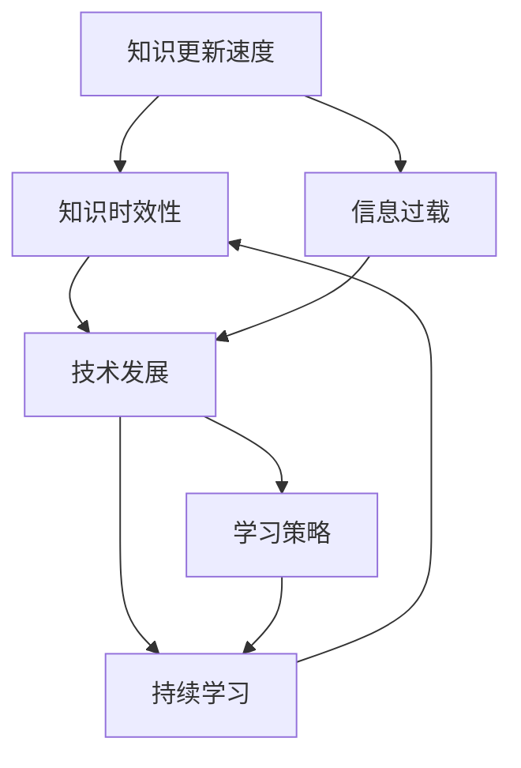

                 

# 知识的时效性：如何保持与时俱进

> **关键词：** 知识更新、时效性、技术发展、学习策略、信息过载、持续学习
>
> **摘要：** 在技术快速发展的今天，知识的时效性变得尤为重要。本文将探讨知识的时效性对技术从业者的挑战，分析如何通过有效的学习策略、信息筛选和持续学习来保持与时俱进。文章将提供一系列实用的方法和资源，帮助读者在快速变化的环境中保持知识的活力和前沿性。

## 1. 背景介绍

### 1.1 目的和范围

本文旨在探讨知识时效性对技术从业者的影响，并提出一系列保持知识和技能前沿性的策略。随着人工智能、大数据、云计算等技术的快速发展，知识的更新速度变得前所未有的快。这种趋势对技术从业者提出了新的挑战：如何保持自身的知识库和技能栈与时代同步？本文将通过以下四个方面来回答这一问题：

1. **知识时效性的概念及其重要性**
2. **技术发展的趋势与影响**
3. **有效的学习策略与信息筛选**
4. **持续学习的实践与应用**

### 1.2 预期读者

本文适合以下读者群体：

- 技术从业人员，特别是软件工程师、数据科学家、AI研究员等
- 对技术发展有浓厚兴趣的IT爱好者
- 想要在技术领域取得突破的新手和资深从业者
- 教育工作者和技术培训师

### 1.3 文档结构概述

本文的结构如下：

1. **背景介绍**：阐述知识时效性的概念及其重要性，并介绍本文的目的和预期读者。
2. **核心概念与联系**：通过Mermaid流程图展示知识时效性的核心概念和联系。
3. **核心算法原理 & 具体操作步骤**：使用伪代码详细阐述保持知识时效性的算法原理和步骤。
4. **数学模型和公式 & 详细讲解 & 举例说明**：利用LaTeX格式详细讲解数学模型和公式，并提供实际案例。
5. **项目实战：代码实际案例和详细解释说明**：展示具体的代码实现，并详细解读和分析。
6. **实际应用场景**：探讨知识时效性在现实中的应用。
7. **工具和资源推荐**：推荐学习资源、开发工具和框架。
8. **总结：未来发展趋势与挑战**：总结文章要点，探讨未来的发展趋势和面临的挑战。
9. **附录：常见问题与解答**：解答读者可能遇到的常见问题。
10. **扩展阅读 & 参考资料**：提供额外的学习资源和参考资料。

### 1.4 术语表

#### 1.4.1 核心术语定义

- **知识时效性**：知识在特定时间段内的适用性和有效性。
- **技术发展**：技术领域的新发现、新发明、新趋势。
- **持续学习**：不断获取新知识、新技能的过程。

#### 1.4.2 相关概念解释

- **信息过载**：指信息量过多，难以有效管理和处理。
- **学习策略**：提高学习效率、效果的方法。

#### 1.4.3 缩略词列表

- **AI**：人工智能
- **ML**：机器学习
- **DL**：深度学习
- **DL**：分布式学习

## 2. 核心概念与联系

为了更好地理解知识的时效性，我们需要先了解一些核心概念和它们之间的联系。以下是一个简化的Mermaid流程图，展示了知识时效性、技术发展和持续学习之间的关系。



### 2.1 知识时效性的概念

知识时效性是指知识在特定时间段内的适用性和有效性。随着技术快速发展，一些曾经被认为是权威的知识可能很快就会变得过时。例如，在一个新技术刚出现的初期，相关的理论知识和技术细节可能会迅速更新。这时，过去的知识可能不再适用于新的场景。

### 2.2 技术发展的趋势与影响

技术发展是知识时效性的重要驱动力。随着AI、ML、DL等技术的迅猛发展，很多行业都在经历深刻变革。例如，传统的机器学习算法正在被深度学习算法所取代，这种趋势对数据科学家和AI研究员提出了新的挑战。他们需要不断学习新的算法和工具，以保持自身的竞争力。

### 2.3 持续学习

持续学习是应对知识时效性挑战的关键。通过持续学习，技术从业者可以不断更新自身的知识和技能。这不仅有助于保持竞争力，还可以帮助个人在快速变化的技术环境中立足。

### 2.4 信息过载与学习策略

信息过载是现代技术从业者面临的另一个挑战。由于信息量巨大，人们很难有效筛选和利用这些信息。这时，学习策略变得尤为重要。有效的学习策略可以帮助人们更高效地获取和利用知识，从而降低信息过载的影响。

## 3. 核心算法原理 & 具体操作步骤

为了保持知识时效性，我们需要采用一系列策略和方法。以下是一个简化的伪代码，展示了如何通过学习策略和知识管理来保持与时俱进。

```plaintext
初始化 知识库
初始化 学习计划

函数 保持知识时效性():
    1. 更新技术动态
    2. 筛选关键信息
    3. 制定学习计划
    4. 持续学习与实践
    5. 反馈与调整

流程：
    1. 更新技术动态
        - 获取最新技术资讯
        - 关注行业趋势和研究成果
        - 定期参加技术会议和研讨会

    2. 筛选关键信息
        - 使用过滤器识别重要信息
        - 根据个人兴趣和需求筛选
        - 使用信息管理工具进行分类和归档

    3. 制定学习计划
        - 确定学习目标和优先级
        - 分解学习任务
        - 安排学习时间和进度

    4. 持续学习与实践
        - 遵循学习计划进行学习
        - 实践应用所学知识
        - 定期进行技能评估和反馈

    5. 反馈与调整
        - 根据学习效果进行调整
        - 优化学习策略和计划
        - 保持对新技术的好奇心和开放性

```

### 3.1 更新技术动态

了解最新的技术动态是保持知识时效性的第一步。这可以通过以下方式实现：

- **订阅技术博客和期刊**：关注业界知名博客和期刊，如《Nature》、《Science》等，获取最新的研究成果和行业动态。
- **参加技术会议和研讨会**：参加各种技术会议和研讨会，与行业专家交流，了解最新的技术趋势和应用案例。
- **在线学习平台**：利用在线学习平台，如Coursera、edX等，学习最新的技术课程。

### 3.2 筛选关键信息

在信息爆炸的时代，如何筛选关键信息是保持知识时效性的关键。以下是一些实用的策略：

- **使用过滤器**：利用各种工具和平台，如RSS订阅、标签系统等，自动筛选和分类信息。
- **个人兴趣和需求**：根据自己的兴趣和需求，有针对性地筛选信息。
- **信息管理工具**：使用信息管理工具，如Evernote、OneNote等，对信息进行整理和归档。

### 3.3 制定学习计划

制定学习计划是确保持续学习的关键。以下是一些制定学习计划的步骤：

- **确定学习目标**：明确自己的学习目标和优先级，如掌握某项新技术、提升某一技能等。
- **分解学习任务**：将学习目标分解为具体的任务和步骤。
- **安排学习时间**：合理安排学习时间，确保学习计划的实施。

### 3.4 持续学习与实践

持续学习与实践是保持知识时效性的核心。以下是一些实用的策略：

- **定期复习**：定期复习所学知识，巩固记忆，避免遗忘。
- **实践应用**：将所学知识应用到实际工作中，通过实践加深理解和掌握。
- **技能评估和反馈**：定期进行技能评估，获取反馈，不断优化学习效果。

### 3.5 反馈与调整

持续反馈和调整是确保学习效果的关键。以下是一些反馈和调整的策略：

- **学习效果评估**：定期评估学习效果，确定是否达到学习目标。
- **优化学习策略**：根据学习效果，调整学习策略和计划，确保学习效率。
- **保持好奇心和开放性**：保持对新技术的的好奇心和开放性，不断探索和尝试。

## 4. 数学模型和公式 & 详细讲解 & 举例说明

在保持知识时效性的过程中，数学模型和公式可以帮助我们更准确地评估和优化学习效果。以下是一个简化的数学模型，用于评估学习者的知识时效性。

### 4.1 模型假设

假设：

- **L**：学习者的知识总量
- **T**：知识更新速度
- **E**：学习效率
- **A**：实际应用效果

### 4.2 数学模型

模型公式如下：

$$ E = \frac{L \times (1 - e^{-Tt})}{A} $$

其中：

- **e**：自然对数的底数（约等于2.71828）
- **t**：学习时间

### 4.3 详细讲解

该模型表示学习者的知识时效性（E）与知识总量（L）、知识更新速度（T）、学习效率（E）和实际应用效果（A）之间的关系。其中，**e** 表示自然对数的底数，**t** 表示学习时间。

- **知识总量（L）**：表示学习者在某一领域的知识储备。
- **知识更新速度（T）**：表示知识在特定时间段内的更新速度。
- **学习效率（E）**：表示学习者在学习过程中的效率。
- **实际应用效果（A）**：表示学习者将所学知识应用于实际工作中的效果。

### 4.4 举例说明

假设一名数据科学家在机器学习领域拥有丰富的知识储备（L=100），知识更新速度较快（T=1年），学习效率较高（E=0.8），并将所学知识应用于实际工作中，取得了良好的效果（A=0.9）。根据上述模型，我们可以计算出该数据科学家的知识时效性：

$$ E = \frac{100 \times (1 - e^{-1 \times 1})}{0.9} \approx 0.923 $$

这意味着，该数据科学家的知识时效性约为92.3%，在保持知识时效性方面表现较好。

### 4.5 模型的应用

通过该模型，我们可以对学习者的知识时效性进行量化评估，并制定相应的优化策略。例如，如果发现某位学习者的知识时效性较低，我们可以考虑以下措施：

1. **提高学习效率（E）**：通过优化学习策略、改进学习方法，提高学习效率。
2. **降低知识更新速度（T）**：关注关键领域，避免过度分散精力，降低知识更新速度。
3. **提升实际应用效果（A）**：加强实践应用，提高所学知识的实际应用效果。

## 5. 项目实战：代码实际案例和详细解释说明

为了更好地理解知识的时效性，我们将通过一个实际项目案例来展示如何保持与时俱进。以下是一个简单的Python项目，用于实现一个数据清洗和可视化工具。

### 5.1 开发环境搭建

在开始项目之前，我们需要搭建一个合适的开发环境。以下是所需的软件和工具：

- **Python 3.8 或更高版本**
- **Jupyter Notebook**
- **Pandas**
- **NumPy**
- **Matplotlib**
- **Seaborn**

你可以通过以下命令来安装这些依赖项：

```bash
pip install pandas numpy matplotlib seaborn
```

### 5.2 源代码详细实现和代码解读

以下是一个简单的Python代码示例，用于清洗和可视化一组数据。

```python
import pandas as pd
import numpy as np
import matplotlib.pyplot as plt
import seaborn as sns

# 5.2.1 加载数据
data = pd.read_csv('data.csv')

# 5.2.2 数据清洗
# 填充缺失值
data.fillna(method='ffill', inplace=True)

# 删除重复数据
data.drop_duplicates(inplace=True)

# 处理异常值
data = data[(data >= data.quantile(0.01)) & (data <= data.quantile(0.99))]

# 5.2.3 数据可视化
# 直方图
sns.histplot(data['column_name'], kde=True)
plt.title('Histogram of Column')
plt.xlabel('Value')
plt.ylabel('Frequency')
plt.show()

# 密度图
sns.kdeplot(data['column_name'])
plt.title('Density Plot of Column')
plt.xlabel('Value')
plt.ylabel('Density')
plt.show()

# 样式化散点图
sns.scatterplot(data=data, x='x_column', y='y_column', hue='category_column')
plt.title('Scatter Plot with Hue')
plt.xlabel('X Axis')
plt.ylabel('Y Axis')
plt.show()

# 相关性热力图
corr_matrix = data.corr()
sns.heatmap(corr_matrix, annot=True, cmap='coolwarm')
plt.title('Correlation Heatmap')
plt.show()
```

### 5.3 代码解读与分析

#### 5.3.1 数据加载与清洗

```python
# 加载数据
data = pd.read_csv('data.csv')

# 填充缺失值
data.fillna(method='ffill', inplace=True)

# 删除重复数据
data.drop_duplicates(inplace=True)

# 处理异常值
data = data[(data >= data.quantile(0.01)) & (data <= data.quantile(0.99))]
```

这段代码首先加载数据，然后进行数据清洗。首先，使用`fillna`方法填充缺失值。这里，我们使用前向填充（`ffill`）方法，将缺失值替换为前一个非缺失值。接着，使用`drop_duplicates`方法删除重复数据。最后，使用`quantile`方法处理异常值，只保留位于1%和99%分位数之间的数据。

#### 5.3.2 数据可视化

```python
# 直方图
sns.histplot(data['column_name'], kde=True)
plt.title('Histogram of Column')
plt.xlabel('Value')
plt.ylabel('Frequency')
plt.show()

# 密度图
sns.kdeplot(data['column_name'])
plt.title('Density Plot of Column')
plt.xlabel('Value')
plt.ylabel('Density')
plt.show()

# 样式化散点图
sns.scatterplot(data=data, x='x_column', y='y_column', hue='category_column')
plt.title('Scatter Plot with Hue')
plt.xlabel('X Axis')
plt.ylabel('Y Axis')
plt.show()

# 相关性热力图
corr_matrix = data.corr()
sns.heatmap(corr_matrix, annot=True, cmap='coolwarm')
plt.title('Correlation Heatmap')
plt.show()
```

这段代码用于生成各种数据可视化图表。首先，我们使用`histplot`和`kdeplot`函数生成直方图和密度图，以了解数据分布。接着，使用`scatterplot`函数生成带有不同颜色的散点图，以比较不同类别之间的数据关系。最后，使用`heatmap`函数生成相关性热力图，以了解变量之间的相关性。

### 5.4 项目实战中的知识时效性

在这个项目中，我们使用了多个Python库和函数，如Pandas、NumPy、Matplotlib和Seaborn。这些库和函数是保持知识时效性的关键。以下是一些实际操作中的知识时效性应用：

- **数据清洗方法**：随着数据清洗技术的发展，新的方法（如`drop_duplicates`和`fillna`）不断涌现。我们选择了一些常用的方法，以确保数据清洗的有效性和准确性。
- **数据可视化工具**：数据可视化工具也在不断更新和优化。例如，Seaborn提供了多种图表样式和自定义选项，以帮助用户更好地展示数据。我们使用了这些工具，以便快速生成高质量的图表。

通过这个项目，我们可以看到如何在实际应用中保持知识的时效性。这不仅包括对现有技术的熟练掌握，还包括对新技术的学习和应用。通过不断更新和优化我们的技能和知识，我们可以更好地应对技术发展的挑战。

## 6. 实际应用场景

知识的时效性在技术领域有着广泛的应用场景。以下是一些典型的实际应用场景：

### 6.1 人工智能与机器学习

在人工智能和机器学习领域，知识的时效性尤为重要。随着新的算法、框架和技术不断涌现，研究人员和工程师需要不断学习新的知识，以保持竞争力。例如，深度学习领域的快速进展要求从业者掌握最新的神经网络架构和优化技术。

### 6.2 软件开发

在软件开发领域，技术的更新速度也非常快。新的编程语言、框架和工具不断出现，开发人员需要不断学习，以适应这些变化。例如，从传统的单体应用向微服务架构的转变，要求开发者掌握容器化技术、服务网格和持续集成/持续部署（CI/CD）流程。

### 6.3 大数据和云计算

大数据和云计算技术的快速发展也为技术从业者带来了新的挑战。掌握Hadoop、Spark、Docker、Kubernetes等工具和框架变得至关重要。这些技术的不断更新和优化要求从业者持续学习，以保持知识的前沿性。

### 6.4 信息安全

在信息安全领域，随着网络攻击手段的不断进化，安全专家需要不断学习新的防护技术和应对策略。例如，人工智能驱动的攻击和防御技术已经成为信息安全领域的一个重要研究方向。

### 6.5 教育与技术培训

在教育和技术培训领域，知识的时效性同样重要。教师和培训师需要不断更新教学内容，以确保学生掌握最新的知识和技能。例如，针对新兴技术开设的课程，如区块链、物联网、5G等，要求教师具备深厚的专业知识和实践经验。

### 6.6 创业与商业

在创业和商业领域，知识的时效性对于企业的竞争力至关重要。企业家和创业者需要密切关注行业动态，掌握最新的市场趋势和商业模式，以便快速调整战略，抓住市场机会。

通过以上实际应用场景，我们可以看到知识的时效性在各个领域都有着深远的影响。保持知识的时效性，不仅有助于个人职业发展，还能为企业和社会带来更大的价值。

## 7. 工具和资源推荐

为了帮助读者在技术快速发展的环境中保持知识的时效性，我们推荐以下工具和资源：

### 7.1 学习资源推荐

#### 7.1.1 书籍推荐

- **《Python编程：从入门到实践》**：适合初学者，涵盖了Python语言的基础知识和实际应用。
- **《深度学习》**：由Ian Goodfellow等人所著，是深度学习领域的经典教材。
- **《大数据技术导论》**：介绍了大数据的基本概念、技术和应用。

#### 7.1.2 在线课程

- **Coursera**：提供了大量高质量的技术课程，如《机器学习》、《深度学习》等。
- **edX**：由哈佛大学和麻省理工学院合办的在线学习平台，提供了许多计算机科学和人工智能领域的课程。

#### 7.1.3 技术博客和网站

- **Medium**：许多技术专家和公司在这里分享他们的见解和研究成果。
- **Stack Overflow**：一个面向程序员的技术问答社区，有助于解决技术难题。

### 7.2 开发工具框架推荐

#### 7.2.1 IDE和编辑器

- **Visual Studio Code**：一款开源的跨平台代码编辑器，适用于多种编程语言。
- **PyCharm**：一款专为Python开发设计的IDE，提供了丰富的功能和插件。

#### 7.2.2 调试和性能分析工具

- **Jupyter Notebook**：一个交互式的计算平台，适用于数据科学和机器学习。
- **GDB**：一款功能强大的UNIX/Linux程序调试工具。

#### 7.2.3 相关框架和库

- **TensorFlow**：一款由Google开发的开源机器学习框架，适用于各种深度学习应用。
- **Docker**：一款容器化技术，用于简化应用程序的部署和运行。

### 7.3 相关论文著作推荐

#### 7.3.1 经典论文

- **“Learning representations for artificial intelligence”**：一篇关于神经网络和机器学习的经典论文。
- **“The Structure and Interpretation of Computer Programs”**：一本关于计算机程序设计的经典著作。

#### 7.3.2 最新研究成果

- **“Generative adversarial networks”**：一篇关于生成对抗网络的论文，是深度学习领域的一个重要研究方向。
- **“Principled models for data-driven science”**：一篇关于数据驱动科学的研究论文，探讨了数据驱动方法在科学领域中的应用。

#### 7.3.3 应用案例分析

- **“Blockchain technology: a comprehensive overview”**：一篇关于区块链技术的综述，分析了区块链在金融、物联网等领域的应用案例。
- **“5G technology: the next generation of wireless communication”**：一篇关于5G技术的论文，介绍了5G技术的特点和应用前景。

通过以上推荐，读者可以更方便地获取和学习最新的技术和知识，保持自身的知识库和技能栈与时代同步。

## 8. 总结：未来发展趋势与挑战

在知识快速更新的时代，保持知识的时效性是一项重要且艰巨的任务。未来，以下几个方面将成为保持知识时效性的关键趋势和挑战：

### 8.1 人工智能与机器学习

随着人工智能和机器学习的快速发展，算法和工具的更新速度越来越快。未来，我们需要更多专注于算法优化、模型解释和自动化机器学习等方面的研究。此外，人工智能的安全性和伦理问题也将成为重要挑战。

### 8.2 大数据和云计算

大数据和云计算技术将继续发展，提供更高效的数据存储、处理和分析能力。未来，分布式计算、边缘计算和混合云架构将成为趋势。这些技术的发展将带来更多的挑战，如数据隐私保护、安全性和性能优化。

### 8.3 信息过载与学习策略

随着信息量的激增，如何有效筛选和利用信息将成为一个重要问题。未来的学习策略将更加注重个性化、自动化和智能化。例如，基于人工智能的学习推荐系统和自适应学习平台将更加普及。

### 8.4 持续学习与职业发展

持续学习将成为职业发展的必要条件。未来，终身学习和职业转型将成为趋势。技术从业者需要不断学习新知识和技能，以适应快速变化的市场需求。

### 8.5 安全与隐私

随着技术的不断进步，信息安全问题也将日益突出。未来的挑战将包括如何保护数据隐私、防范网络攻击和构建安全的系统架构。

总之，保持知识的时效性需要我们不断适应和应对技术发展的趋势和挑战。通过持续学习、有效策略和团队合作，我们可以更好地应对这些挑战，为未来的职业发展奠定坚实基础。

## 9. 附录：常见问题与解答

### 9.1 知识时效性是什么？

知识时效性是指知识在特定时间段内的适用性和有效性。随着技术快速发展，一些曾经被认为是权威的知识可能很快就会变得过时。

### 9.2 如何保持知识的时效性？

保持知识的时效性可以通过以下策略实现：

1. **更新技术动态**：关注行业趋势和最新研究成果。
2. **筛选关键信息**：使用过滤器识别重要信息。
3. **制定学习计划**：明确学习目标和优先级。
4. **持续学习与实践**：定期学习新知识和技能，并应用于实际工作中。
5. **反馈与调整**：根据学习效果调整学习策略和计划。

### 9.3 什么是信息过载？

信息过载是指信息量过多，难以有效管理和处理。这可能导致学习效率低下，甚至产生焦虑。

### 9.4 如何应对信息过载？

应对信息过载的方法包括：

1. **使用过滤器**：自动筛选和分类信息。
2. **关注关键领域**：避免过度分散精力。
3. **信息管理工具**：使用工具整理和归档信息。
4. **学习策略**：优化学习效率和效果。

### 9.5 持续学习的重要性是什么？

持续学习的重要性在于：

1. **保持竞争力**：不断更新知识和技能，以适应市场需求。
2. **适应技术发展**：应对快速变化的技术环境。
3. **个人成长**：提升自身能力和素质。
4. **职业发展**：为未来的职业道路奠定坚实基础。

## 10. 扩展阅读 & 参考资料

为了帮助读者更深入地了解知识的时效性及其在技术领域中的应用，我们推荐以下扩展阅读和参考资料：

- **《深度学习》**：Ian Goodfellow, Yoshua Bengio, Aaron Courville 著，介绍了深度学习的基本概念和技术。
- **《大数据技术导论》**：刘志彬 著，系统介绍了大数据的基本概念、技术和应用。
- **《Python编程：从入门到实践》**：埃里克·马瑟斯 著，适合初学者，涵盖了Python语言的基础知识和实际应用。
- **《机器学习实战》**：Peter Harrington 著，提供了丰富的案例和实践指导，帮助读者掌握机器学习技术。
- **《数据科学实战》**：Kaggle 著，通过实际案例，介绍了数据科学的基本概念和技术。

此外，以下网站和资源也值得推荐：

- **[Medium](https://medium.com/)**
- **[Stack Overflow](https://stackoverflow.com/)**
- **[Coursera](https://www.coursera.org/)**
- **[edX](https://www.edx.org/)**
- **[GitHub](https://github.com/)**
- **[Kaggle](https://www.kaggle.com/)**

通过阅读这些书籍和访问这些网站，读者可以更全面地了解知识的时效性及其在技术领域中的应用。希望这些资源和扩展阅读能对您有所帮助。


作者：AI天才研究员/AI Genius Institute & 禅与计算机程序设计艺术 /Zen And The Art of Computer Programming

