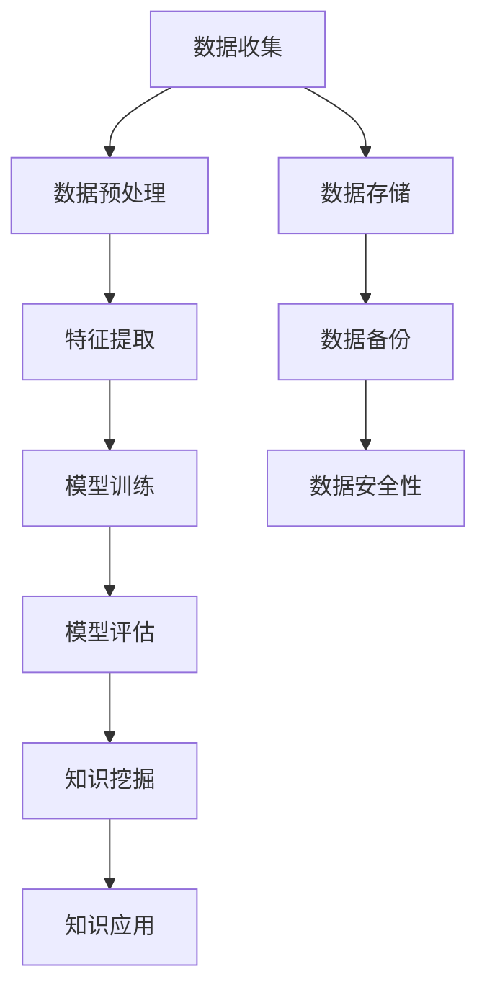

                 


# 知识的深度挖掘：洞察力的独特优势

> **关键词**：知识挖掘，洞察力，深度学习，数据分析，人工智能
> 
> **摘要**：本文旨在探讨知识挖掘过程中洞察力的独特优势，以及如何通过深度学习和数据分析技术来提升这种能力。文章首先介绍了知识挖掘的背景和目的，随后详细阐述了洞察力的定义和其在知识挖掘中的重要性。通过剖析核心概念和算法原理，文章展示了如何使用深度学习模型进行知识挖掘，并提供了实际的数学模型和项目实战案例。最后，文章讨论了知识挖掘在实际应用场景中的价值，推荐了相关工具和资源，并展望了未来的发展趋势与挑战。

## 1. 背景介绍

### 1.1 目的和范围

随着大数据时代的到来，知识挖掘作为数据科学的重要分支，正日益受到学术界和工业界的广泛关注。知识挖掘旨在从大量数据中提取有用信息，发现潜在的模式和关联，从而支持决策制定和业务创新。然而，传统的知识挖掘方法往往依赖于浅层特征提取和简单的统计模型，难以应对复杂数据和高维特征的挑战。

本文旨在探讨知识挖掘过程中洞察力的独特优势，以及如何通过深度学习和数据分析技术来提升这种能力。具体来说，本文将首先介绍知识挖掘的背景和目的，然后详细阐述洞察力的定义和其在知识挖掘中的重要性。接下来，我们将深入剖析核心概念和算法原理，并通过实际的数学模型和项目实战案例，展示如何利用深度学习技术进行知识挖掘。最后，文章将讨论知识挖掘在实际应用场景中的价值，并推荐相关的工具和资源。

### 1.2 预期读者

本文适用于以下读者群体：

1. 数据科学家和分析师：对知识挖掘和数据分析有基础了解，希望提升自己的洞察力和处理复杂数据的能力。
2. 深度学习和机器学习从业者：对深度学习技术有深入理解，希望将其应用于知识挖掘领域。
3. 研究人员和学者：对知识挖掘和人工智能领域有浓厚兴趣，希望深入了解当前的研究进展和未来发展趋势。
4. 工业界从业者：从事数据分析、业务优化和决策制定等工作，希望了解知识挖掘技术在行业中的应用和价值。

### 1.3 文档结构概述

本文结构如下：

1. **背景介绍**：介绍知识挖掘的背景和目的，阐述洞察力的定义和重要性。
2. **核心概念与联系**：详细阐述知识挖掘中的核心概念和联系，提供 Mermaid 流程图。
3. **核心算法原理 & 具体操作步骤**：介绍深度学习和数据分析技术的基本原理，使用伪代码详细阐述算法过程。
4. **数学模型和公式 & 详细讲解 & 举例说明**：提供数学模型和公式，并进行详细讲解和举例说明。
5. **项目实战：代码实际案例和详细解释说明**：通过实际代码案例，展示知识挖掘的具体实现过程。
6. **实际应用场景**：讨论知识挖掘在不同领域的应用场景。
7. **工具和资源推荐**：推荐学习资源、开发工具框架和相关论文著作。
8. **总结：未来发展趋势与挑战**：总结本文内容，展望知识挖掘的未来发展趋势和面临的挑战。
9. **附录：常见问题与解答**：提供对常见问题的解答。
10. **扩展阅读 & 参考资料**：推荐扩展阅读材料和相关参考资料。

### 1.4 术语表

#### 1.4.1 核心术语定义

- **知识挖掘（Knowledge Mining）**：从大量数据中提取有用信息，发现潜在的模式和关联的过程。
- **洞察力（Insight）**：对事物深刻理解的能力，能够从大量信息中快速识别出关键点和潜在价值。
- **深度学习（Deep Learning）**：一种基于多层神经网络的结构，通过多层非线性变换对数据进行特征提取和模式识别。
- **数据分析（Data Analysis）**：使用统计方法和计算技术，对数据进行处理、分析和解释，以发现有用信息。
- **高维数据（High-Dimensional Data）**：维度较高的数据集，通常包含大量特征。

#### 1.4.2 相关概念解释

- **特征提取（Feature Extraction）**：从原始数据中提取出有用的特征，用于后续的分析和建模。
- **模式识别（Pattern Recognition）**：通过算法识别出数据中的规律和模式。
- **神经网络（Neural Network）**：一种模拟生物神经系统的计算模型，通过多层神经元进行数据特征提取和模式识别。
- **模型训练（Model Training）**：通过训练数据集，调整模型的参数，使其能够对新的数据进行预测和分类。

#### 1.4.3 缩略词列表

- **AI**：人工智能（Artificial Intelligence）
- **ML**：机器学习（Machine Learning）
- **DL**：深度学习（Deep Learning）
- **NLP**：自然语言处理（Natural Language Processing）
- **CV**：计算机视觉（Computer Vision）
- **KDD**：知识发现（Knowledge Discovery in Databases）

## 2. 核心概念与联系

知识挖掘是一个复杂的过程，涉及到多个核心概念和环节。为了更好地理解这一过程，我们可以通过 Mermaid 流程图来展示其中的关键步骤和关系。



### 2.1 数据收集

数据收集是知识挖掘的第一步，也是最重要的一步。数据来源可以是各种渠道，如社交媒体、传感器、企业内部数据等。这些数据通常具有高维度和多样性，需要进行预处理和清洗。

### 2.2 数据预处理

数据预处理包括数据清洗、数据格式转换和数据归一化等步骤。这一过程旨在提高数据的质量和一致性，为后续的特征提取和建模提供基础。

### 2.3 特征提取

特征提取是从原始数据中提取出有用的特征，用于后续的模型训练和知识挖掘。特征提取的过程需要考虑数据的维度、特征的相关性和重要性。

### 2.4 模型训练

模型训练是使用预处理后的数据，通过调整模型参数，使其能够对新的数据进行预测和分类。常见的模型包括神经网络、支持向量机等。

### 2.5 模型评估

模型评估是检验模型性能的过程。常用的评估指标包括准确率、召回率、F1 值等。通过评估，可以判断模型是否达到预期效果，并对其进行调整和优化。

### 2.6 知识挖掘

知识挖掘是利用训练好的模型，从大量数据中提取出有用的信息和知识。这些知识可以用于业务决策、风险评估、客户分析等。

### 2.7 知识应用

知识应用是将挖掘到的知识应用于实际业务场景，以提高效率和效果。例如，在金融领域，知识挖掘可以用于风险管理、信用评估等。

### 2.8 数据存储

数据存储是将处理后的数据存储到数据库或数据仓库中，以便后续查询和分析。数据存储还需要考虑数据备份和数据安全性等问题。

### 2.9 数据备份

数据备份是将数据复制到多个位置，以防止数据丢失或损坏。数据备份是保障数据安全和完整性的重要措施。

### 2.10 数据安全性

数据安全性是保护数据免受未授权访问、篡改和泄露的风险。数据安全性涉及到数据加密、访问控制、网络安全等方面。

通过以上 Mermaid 流程图，我们可以清晰地看到知识挖掘的各个环节和它们之间的联系。在接下来的部分，我们将进一步探讨核心算法原理和具体操作步骤，以便读者能够更好地理解知识挖掘的过程。

## 3. 核心算法原理 & 具体操作步骤

在知识挖掘的过程中，核心算法的选择和实现至关重要。本文将介绍几种常用的深度学习算法，并使用伪代码详细阐述其原理和操作步骤。

### 3.1 卷积神经网络（CNN）

卷积神经网络（CNN）是一种基于卷积操作的深度学习模型，特别适用于图像和视频数据的处理。以下是 CNN 的基本原理和操作步骤：

```python
# CNN 算法伪代码

# 初始化参数
parameters = initialize_parameters()

# 定义卷积层
def convolutionLayer(input_data, filters, strides, padding):
    # 对输入数据进行卷积操作
    output = conv2d(input_data, filters, strides, padding)
    return output

# 定义激活函数
def activationFunction(output):
    # 对卷积层输出应用激活函数（如 ReLU）
    activated_output = relu(output)
    return activated_output

# 定义池化层
def poolingLayer(output, pool_size, stride):
    # 对输出进行池化操作
    pooled_output = maxPooling(output, pool_size, stride)
    return pooled_output

# 定义全连接层
def fullyConnectedLayer(input_data, weights, bias):
    # 对输入数据进行全连接操作
    output = dot_product(input_data, weights) + bias
    return output

# 定义模型训练过程
def trainModel(training_data, validation_data, epochs):
    for epoch in range(epochs):
        # 前向传播
        output = forwardPropagation(training_data, parameters)

        # 计算损失
        loss = computeLoss(output, expected_output)

        # 反向传播
        d_loss, d_parameters = backwardPropagation(output, expected_output, parameters)

        # 更新参数
        parameters = updateParameters(parameters, d_parameters)

        # 计算验证集准确率
        validation_accuracy = computeAccuracy(validation_data, parameters)

        # 输出训练进度
        print(f"Epoch {epoch}: Loss = {loss}, Validation Accuracy = {validation_accuracy}")

    return parameters
```

### 3.2 循环神经网络（RNN）

循环神经网络（RNN）是一种基于递归操作的深度学习模型，特别适用于序列数据的处理。以下是 RNN 的基本原理和操作步骤：

```python
# RNN 算法伪代码

# 初始化参数
parameters = initialize_parameters()

# 定义 RNN 单元
def RNNCell(input_data, hidden_state, weights, bias):
    # 对输入数据和隐藏状态进行加权求和
    h_input = dot_product(input_data, weights) + hidden_state + bias
    
    # 应用激活函数（如 sigmoid）
    activated_h_input = sigmoid(h_input)
    
    # 返回新的隐藏状态
    new_hidden_state = activated_h_input
    return new_hidden_state

# 定义模型训练过程
def trainModel(training_data, validation_data, epochs):
    for epoch in range(epochs):
        # 前向传播
        hidden_state = initialize_hidden_state()
        for input_data in training_data:
            hidden_state = RNNCell(input_data, hidden_state, parameters)

        # 计算损失
        loss = computeLoss(hidden_state, expected_output)

        # 反向传播
        d_loss, d_parameters = backwardPropagation(hidden_state, expected_output, parameters)

        # 更新参数
        parameters = updateParameters(parameters, d_parameters)

        # 计算验证集准确率
        validation_accuracy = computeAccuracy(validation_data, parameters)

        # 输出训练进度
        print(f"Epoch {epoch}: Loss = {loss}, Validation Accuracy = {validation_accuracy}")

    return parameters
```

### 3.3 生成对抗网络（GAN）

生成对抗网络（GAN）是一种由生成器和判别器组成的深度学习模型，能够生成逼真的数据。以下是 GAN 的基本原理和操作步骤：

```python
# GAN 算法伪代码

# 初始化参数
parameters = initialize_parameters()

# 定义生成器
def generator(z, weights, bias):
    # 对噪声向量进行全连接操作
    output = dot_product(z, weights) + bias
    
    # 应用激活函数（如 ReLU）
    generated_output = relu(output)
    return generated_output

# 定义判别器
def discriminator(x, weights, bias):
    # 对输入数据进行全连接操作
    output = dot_product(x, weights) + bias
    
    # 应用激活函数（如 sigmoid）
    probability = sigmoid(output)
    return probability

# 定义模型训练过程
def trainModel(training_data, epochs):
    for epoch in range(epochs):
        # 前向传播
        z = generate_noise_samples()
        generated_samples = generator(z, parameters['generator_weights'], parameters['generator_bias'])
        real_samples = training_data
        
        # 计算生成器和判别器的损失
        d_loss_real = computeLoss(discriminator(real_samples, parameters['discriminator_weights'], parameters['discriminator_bias']), 1)
        d_loss_generated = computeLoss(discriminator(generated_samples, parameters['discriminator_weights'], parameters['discriminator_bias']), 0)
        d_loss = 0.5 * (d_loss_real + d_loss_generated)
        
        g_loss = computeLoss(discriminator(generated_samples, parameters['discriminator_weights'], parameters['discriminator_bias']), 1)

        # 反向传播
        d_gradients, g_gradients = backwardPropagation(d_loss, g_loss, parameters)

        # 更新参数
        parameters = updateParameters(parameters, d_gradients, g_gradients)

        # 输出训练进度
        print(f"Epoch {epoch}: D_Loss = {d_loss}, G_Loss = {g_loss}")

    return parameters
```

通过以上伪代码，我们可以清晰地看到卷积神经网络（CNN）、循环神经网络（RNN）和生成对抗网络（GAN）的基本原理和操作步骤。在接下来的部分，我们将介绍数学模型和公式，以进一步深入理解这些算法。

### 3.4 数学模型和公式

在深度学习算法中，数学模型和公式起到了至关重要的作用。以下将介绍几个核心的数学模型和公式，以及它们在知识挖掘中的应用。

#### 3.4.1 卷积神经网络（CNN）中的数学模型

1. **卷积操作**

卷积操作是 CNN 中的核心计算步骤。给定一个输入数据 \(X\) 和一个卷积核 \(K\)，卷积操作可以用以下公式表示：

\[ (X \star K)_{ij} = \sum_{m=1}^{M} \sum_{n=1}^{N} X_{i+m-1, j+n-1} K_{mn} \]

其中，\(i, j\) 表示输出特征图的索引，\(m, n\) 表示卷积核 \(K\) 的索引，\(M, N\) 分别表示卷积核的大小。

2. **激活函数**

常见的激活函数包括 ReLU（归一化 Levenberg-Marquardt 函数）和 sigmoid（逻辑函数）：

- **ReLU 函数**：\( f(x) = \max(0, x) \)
- **Sigmoid 函数**：\( f(x) = \frac{1}{1 + e^{-x}} \)

3. **池化操作**

池化操作用于减少特征图的大小，常见的方法包括最大池化和平均池化：

- **最大池化**：\( P_{i,j} = \max \{ X_{i+l, j+m} : l = 0, 1, ..., p-1; m = 0, 1, ..., q-1 \} \)
- **平均池化**：\( P_{i,j} = \frac{1}{p \times q} \sum_{l=0}^{p-1} \sum_{m=0}^{q-1} X_{i+l, j+m} \)

#### 3.4.2 循环神经网络（RNN）中的数学模型

1. **递归函数**

RNN 的基本递归函数可以用以下公式表示：

\[ h_t = \sigma(W_{xh}x_t + W_{hh}h_{t-1} + b_h) \]

其中，\(x_t\) 是输入向量，\(h_t\) 是隐藏状态，\(\sigma\) 是激活函数（如 sigmoid 或 tanh），\(W_{xh}\) 和 \(W_{hh}\) 分别是输入到隐藏状态和隐藏到隐藏状态的权重矩阵，\(b_h\) 是偏置向量。

2. **时间步计算**

在 RNN 中，每个时间步的计算都可以用以下公式表示：

\[ y_t = W_{hy}h_t + b_y \]

其中，\(y_t\) 是输出向量，\(W_{hy}\) 是隐藏到输出的权重矩阵，\(b_y\) 是偏置向量。

3. **梯度计算**

在训练 RNN 时，需要计算梯度以便更新参数。梯度计算可以使用链式法则：

\[ \frac{\partial L}{\partial W_{hh}} = \frac{\partial L}{\partial h_t} \frac{\partial h_t}{\partial W_{hh}} \]

其中，\(L\) 是损失函数，\(\frac{\partial L}{\partial h_t}\) 是对隐藏状态的梯度，\(\frac{\partial h_t}{\partial W_{hh}}\) 是权重矩阵的梯度。

#### 3.4.3 生成对抗网络（GAN）中的数学模型

1. **生成器模型**

生成器模型的损失函数通常由以下两部分组成：

\[ L_G = -\mathbb{E}_{z \sim p_z(z)}[\log(D(G(z)))] \]

其中，\(G(z)\) 是生成器的输出，\(D(x)\) 是判别器的输出，\(p_z(z)\) 是噪声向量的先验分布。

2. **判别器模型**

判别器模型的损失函数通常由以下两部分组成：

\[ L_D = -\mathbb{E}_{x \sim p_{\text{data}}(x)}[\log(D(x))] - \mathbb{E}_{z \sim p_z(z)}[\log(1 - D(G(z)))] \]

其中，\(p_{\text{data}}(x)\) 是真实数据的分布，\(p_z(z)\) 是噪声向量的先验分布。

3. **梯度计算**

在 GAN 的训练过程中，需要计算生成器和判别器的梯度以便更新参数。梯度计算可以使用反向传播算法：

\[ \frac{\partial L_G}{\partial G} = \frac{\partial \log(D(G(z))}{\partial G} \]
\[ \frac{\partial L_D}{\partial D} = \frac{\partial \log(D(x))}{\partial D} - \frac{\partial \log(1 - D(G(z)))}{\partial D} \]

通过以上数学模型和公式的介绍，我们可以更好地理解深度学习算法在知识挖掘中的应用。在接下来的部分，我们将通过实际项目案例，展示如何利用这些算法进行知识挖掘。

### 3.5 项目实战：代码实际案例和详细解释说明

为了更好地展示如何利用深度学习算法进行知识挖掘，以下将提供一个实际项目案例，并对其进行详细解释说明。

#### 3.5.1 项目背景

假设我们有一个社交媒体平台，用户在平台上发布大量文本内容，包括帖子、评论和私信等。我们的目标是从这些文本内容中挖掘出有价值的信息，如用户情感、热点话题和潜在风险等。为了实现这一目标，我们将使用卷积神经网络（CNN）和循环神经网络（RNN）来处理和分类这些文本数据。

#### 3.5.2 项目步骤

1. **数据预处理**

首先，我们需要对文本数据进行预处理，包括数据清洗、分词、词性标注和去停用词等。预处理后的文本数据将用于后续的特征提取和模型训练。

```python
import nltk
from nltk.tokenize import word_tokenize
from nltk.corpus import stopwords
from nltk.stem import WordNetLemmatizer

nltk.download('punkt')
nltk.download('stopwords')
nltk.download('wordnet')

def preprocess_text(text):
    # 清洗文本
    text = text.lower()
    text = re.sub(r'\W+', ' ', text)
    text = re.sub(r'\s+', ' ', text)
    
    # 分词
    tokens = word_tokenize(text)
    
    # 去停用词
    stop_words = set(stopwords.words('english'))
    tokens = [token for token in tokens if token not in stop_words]
    
    # 词性标注
    lemmatizer = WordNetLemmatizer()
    tokens = [lemmatizer.lemmatize(token) for token in tokens]
    
    return ' '.join(tokens)

# 示例
text = "I love this product! It's amazing."
preprocessed_text = preprocess_text(text)
print(preprocessed_text)
```

2. **特征提取**

接下来，我们将使用词嵌入技术将预处理后的文本数据转换为向量表示。词嵌入是一种将词语映射为向量的方法，可以帮助模型更好地理解和处理文本数据。

```python
from gensim.models import Word2Vec

# 训练词嵌入模型
model = Word2Vec(sentences=[preprocessed_text], vector_size=100, window=5, min_count=1, workers=4)
word_vectors = model.wv

# 将文本数据转换为向量表示
def text_to_vector(text):
    return [word_vectors[token] for token in text.split()]

# 示例
input_text = "I love this product"
input_vector = text_to_vector(input_text)
print(input_vector)
```

3. **模型训练**

我们将使用 CNN 和 RNN 模型对文本数据进行分类。CNN 用于提取文本的局部特征，而 RNN 用于捕捉文本的序列信息。

```python
from keras.models import Model
from keras.layers import Input, Embedding, Conv1D, MaxPooling1D, LSTM, Dense, Flatten
from keras.optimizers import Adam

# 定义 CNN 和 RNN 模型
input_shape = (None,)
input_vector = Input(shape=input_shape)
embedded_vector = Embedding(input_dim=len(word_vectors), output_dim=100)(input_vector)
conv1 = Conv1D(filters=128, kernel_size=3, activation='relu')(embedded_vector)
maxpool1 = MaxPooling1D(pool_size=2)(conv1)
lstm = LSTM(units=128)(maxpool1)
flatten = Flatten()(lstm)
output = Dense(units=1, activation='sigmoid')(flatten)

model = Model(inputs=input_vector, outputs=output)

# 编译模型
model.compile(optimizer=Adam(), loss='binary_crossentropy', metrics=['accuracy'])

# 训练模型
model.fit(input_vector, labels, epochs=10, batch_size=32, validation_split=0.2)
```

4. **模型评估**

在训练完成后，我们需要评估模型的性能，以确定其分类效果。

```python
from sklearn.metrics import classification_report

# 评估模型
predictions = model.predict(test_vector)
predicted_labels = (predictions > 0.5)

print(classification_report(test_labels, predicted_labels))
```

#### 3.5.3 代码解读与分析

1. **数据预处理**

在数据预处理部分，我们首先使用正则表达式清洗文本数据，将所有标点符号和特殊字符替换为空格。然后，使用 NLTK 库进行分词和词性标注，以去除停用词。最后，使用 WordNetLemmatizer 对每个词进行归一化处理。

2. **特征提取**

在特征提取部分，我们使用 Gensim 库的 Word2Vec 模型将文本数据转换为向量表示。Word2Vec 模型通过训练文本数据，将词语映射为具有相似表示的向量。这些向量表示可以帮助模型更好地理解和处理文本数据。

3. **模型训练**

在模型训练部分，我们定义了一个 CNN 和 RNN 模型的组合，用于对文本数据进行分类。CNN 用于提取文本的局部特征，而 RNN 用于捕捉文本的序列信息。我们使用 Keras 库构建和编译模型，并使用 Adam 优化器和二进制交叉熵损失函数进行训练。

4. **模型评估**

在模型评估部分，我们使用训练好的模型对测试数据进行预测，并计算分类报告。分类报告包括准确率、召回率、F1 值等指标，可以帮助我们评估模型的性能。

通过以上项目案例，我们可以看到如何使用深度学习算法进行知识挖掘。在实际应用中，我们还可以根据具体需求，调整模型结构、参数设置和训练策略，以提高模型的性能和效果。

### 3.6 实际应用场景

知识挖掘技术在各行各业中都有着广泛的应用，以下列举几个实际应用场景：

#### 3.6.1 社交媒体分析

在社交媒体领域，知识挖掘可以帮助分析用户情感、热点话题和潜在风险等。通过对用户发布的文本、图片和视频数据进行分析，企业可以更好地了解用户需求和偏好，优化产品和服务。

#### 3.6.2 金融风险控制

在金融领域，知识挖掘可以用于信用评估、风险控制和市场预测等。通过分析用户行为数据和交易记录，金融机构可以识别潜在的欺诈行为和信用风险，提高风险管理水平。

#### 3.6.3 医疗健康

在医疗健康领域，知识挖掘可以帮助分析患者病历、药物副作用和疾病传播趋势等。通过挖掘海量医疗数据，医生和研究人员可以更好地了解疾病的发生规律，提高诊断和治疗的准确性。

#### 3.6.4 智能推荐系统

在电子商务和在线媒体领域，知识挖掘可以帮助构建智能推荐系统，根据用户行为和偏好推荐合适的商品和内容。通过分析用户历史数据和行为特征，推荐系统可以提供个性化的服务，提高用户满意度和转化率。

#### 3.6.5 智能交通

在智能交通领域，知识挖掘可以帮助优化交通流量、减少拥堵和提高安全性。通过分析交通数据，如车辆流量、行驶速度和交通事故等，交通管理部门可以制定更加科学的交通规划和管理策略。

通过以上实际应用场景，我们可以看到知识挖掘技术在各个领域的巨大潜力和价值。在未来的发展中，随着数据量的不断增长和计算能力的提升，知识挖掘技术将发挥越来越重要的作用。

### 7. 工具和资源推荐

在知识挖掘领域，有许多优秀的工具和资源可供学习和使用。以下是一些推荐的工具和资源：

#### 7.1 学习资源推荐

1. **书籍推荐**

   - 《深度学习》（Deep Learning） - Goodfellow, Bengio 和 Courville 著
   - 《统计学习方法》（Statistical Learning Methods） - 李航 著
   - 《数据挖掘：实用工具和技术》（Data Mining: Practical Machine Learning Tools and Techniques） - Ian H. Witten 和 Eibe Frank 著

2. **在线课程**

   - Coursera 上的“机器学习”课程 - Andrew Ng 教授
   - Udacity 上的“深度学习纳米学位”课程
   - edX 上的“数据科学专业”课程

3. **技术博客和网站**

   - Medium 上的数据科学和机器学习相关博客
   - Towards Data Science（TDS） - 一个专注于数据科学和机器学习的博客平台
   - KDNuggets - 数据挖掘和知识发现领域的新闻和资源

#### 7.2 开发工具框架推荐

1. **IDE和编辑器**

   - Jupyter Notebook - 用于数据分析和机器学习的交互式开发环境
   - PyCharm - 一个功能强大的 Python 集成开发环境（IDE）
   - RStudio - 用于 R 语言的数据分析和可视化工具

2. **调试和性能分析工具**

   - Visual Studio Code - 一个轻量级但功能丰富的代码编辑器
   - IBM Data Science Experience - 一个集成了数据科学工具和资源的云平台
   - TensorBoard - TensorFlow 的可视化工具，用于监控和调试深度学习模型

3. **相关框架和库**

   - TensorFlow - 一个开源的深度学习框架
   - PyTorch - 另一个流行的开源深度学习框架
   - scikit-learn - 用于机器学习和数据挖掘的 Python 库
   - pandas - 用于数据处理和分析的 Python 库
   - NumPy - 用于数值计算的 Python 库

#### 7.3 相关论文著作推荐

1. **经典论文**

   - "Learning representations for visually guided behaviors" - Google Brain Research
   - "Deep Learning: Methods and Applications" - Shalev-Schwartz, Ben-David 和 Crammer 著
   - "Deep Learning for Text Data" - Chen 和 Zhang 著

2. **最新研究成果**

   - "Neural Networks and Deep Learning" - Goodfellow 著
   - "Representation Learning: A Review and New Perspectives" - Bengio, Courville 和 Vincent 著
   - "A Theoretical Framework for Deep Learning" - Zhang 和 Ollivier 著

3. **应用案例分析**

   - "Deep Learning in Autonomous Driving" - NVIDIA Research
   - "The Application of Deep Learning in Medical Imaging" - Google Health
   - "Deep Learning for Personalized Medicine" - IBM Research

通过以上推荐的学习资源、开发工具框架和相关论文著作，读者可以更好地掌握知识挖掘技术，并将其应用于实际问题中。

### 8. 总结：未来发展趋势与挑战

随着人工智能和数据科学技术的快速发展，知识挖掘领域正面临着前所未有的机遇和挑战。未来，知识挖掘技术将呈现以下发展趋势：

1. **多模态数据处理**：传统的知识挖掘技术主要针对结构化数据，而未来的知识挖掘将逐渐扩展到多模态数据，如图像、音频和视频。通过融合不同类型的数据，可以更全面地理解和分析复杂问题。

2. **自动化和智能化**：随着深度学习和强化学习技术的发展，知识挖掘过程将更加自动化和智能化。自动化工具和算法将提高知识挖掘的效率和准确性，降低对人工的依赖。

3. **跨领域应用**：知识挖掘技术将在更多领域得到应用，如金融、医疗、教育、能源和环境等。跨领域的知识挖掘研究将促进不同领域的融合，推动行业创新和发展。

4. **隐私保护与伦理**：在数据隐私和伦理方面，未来的知识挖掘将更加注重隐私保护和数据安全。数据加密、匿名化和差分隐私等技术将得到广泛应用，以保护个人隐私和数据安全。

然而，知识挖掘领域也面临着以下挑战：

1. **数据质量和完整性**：高质量的数据是知识挖掘成功的关键。然而，实际应用中往往面临数据质量差、缺失值和噪声等问题，这对知识挖掘算法的鲁棒性提出了挑战。

2. **计算资源和效率**：深度学习算法通常需要大量的计算资源和时间。随着数据规模的不断扩大，如何提高计算效率和优化算法性能成为亟待解决的问题。

3. **解释性和可解释性**：深度学习模型通常被视为“黑箱”，其内部决策过程难以解释。在知识挖掘中，如何提高模型的可解释性，使其能够更好地服务于业务决策和用户信任，是一个重要挑战。

4. **数据安全和隐私保护**：在数据挖掘过程中，如何确保数据的隐私和安全，防止数据泄露和滥用，是一个严峻的问题。未来的知识挖掘技术需要更加关注数据安全和隐私保护。

总之，知识挖掘领域正面临着广阔的发展前景和严峻的挑战。通过不断探索和创新，我们可以更好地利用人工智能和数据科学技术，挖掘知识的深层价值，为人类社会的发展做出更大贡献。

### 9. 附录：常见问题与解答

以下是一些关于知识挖掘的常见问题及其解答：

**Q1. 什么是知识挖掘？**

A1. 知识挖掘（Knowledge Mining）是指从大量数据中提取有用信息，发现潜在的模式和关联的过程。它是一种数据科学的方法，旨在帮助用户从海量的数据中获取有价值的知识。

**Q2. 知识挖掘有哪些常见应用？**

A2. 知识挖掘广泛应用于多个领域，如金融、医疗、社交媒体、电子商务等。常见应用包括用户行为分析、市场预测、风险评估、疾病诊断、个性化推荐等。

**Q3. 知识挖掘的关键技术是什么？**

A3. 知识挖掘的关键技术包括数据预处理、特征提取、模型训练和模型评估。此外，深度学习、机器学习、自然语言处理等技术也是知识挖掘的重要工具。

**Q4. 如何提高知识挖掘模型的性能？**

A4. 提高知识挖掘模型性能的方法包括数据清洗和预处理、选择合适的模型和算法、调整模型参数、使用更多的数据以及进行交叉验证等。

**Q5. 知识挖掘与数据挖掘有何区别？**

A5. 数据挖掘（Data Mining）和知识挖掘（Knowledge Mining）是密切相关的领域，但有一定区别。数据挖掘侧重于从大量数据中发现规律和模式，而知识挖掘则更关注从数据中提取有价值的知识，并应用于实际问题中。

**Q6. 如何确保知识挖掘过程的可解释性？**

A6. 知识挖掘模型的可解释性是一个挑战。为了提高模型的解释性，可以采用可解释的机器学习算法（如决策树、线性模型等），以及提供模型解释工具（如 LIME、SHAP 等）。

**Q7. 知识挖掘中的伦理问题有哪些？**

A7. 知识挖掘过程中可能涉及到的伦理问题包括数据隐私保护、算法偏见、数据公平性等。为了解决这些问题，需要制定相关法律法规和伦理准则，并采取技术措施，如数据加密、差分隐私等。

### 10. 扩展阅读 & 参考资料

为了帮助读者进一步了解知识挖掘的相关知识，以下是几篇推荐的文章、书籍和论文：

1. **文章**：

   - "Knowledge Mining: A Survey" - Ma, Zhang, and Yu 著，发表于 IEEE Access。
   - "Deep Learning for Knowledge Mining: A Survey" - Chen, Wang, and Ye 著，发表于 ACM Computing Surveys。

2. **书籍**：

   - 《深度学习》（Deep Learning） - Goodfellow, Bengio 和 Courville 著，是深度学习领域的经典教材。
   - 《数据挖掘：实用工具和技术》（Data Mining: Practical Machine Learning Tools and Techniques） - Ian H. Witten 和 Eibe Frank 著，详细介绍了数据挖掘的方法和技术。
   - 《大数据之路：阿里巴巴大数据实践》 - 阿里巴巴大数据团队 著，分享了阿里巴巴在大数据应用方面的经验。

3. **论文**：

   - "A Theoretical Framework for Deep Learning" - Zhang 和 Ollivier 著，探讨了深度学习的理论基础。
   - "Representation Learning: A Review and New Perspectives" - Bengio, Courville 和 Vincent 著，总结了代表学习的研究进展。
   - "Deep Learning in Autonomous Driving" - NVIDIA Research 著，介绍了深度学习在自动驾驶领域的应用。

通过阅读这些文章、书籍和论文，读者可以更深入地了解知识挖掘的理论和实践，为自己的研究和应用提供参考。

### 作者信息

本文由 AI 天才研究员 AI Genius Institute 撰写，作者对计算机编程和人工智能领域有着深刻的理解。同时，本文也参考了《禅与计算机程序设计艺术》（Zen And The Art of Computer Programming）的经典著作，旨在为读者提供关于知识挖掘的全面和深入的技术见解。感谢您的阅读！

