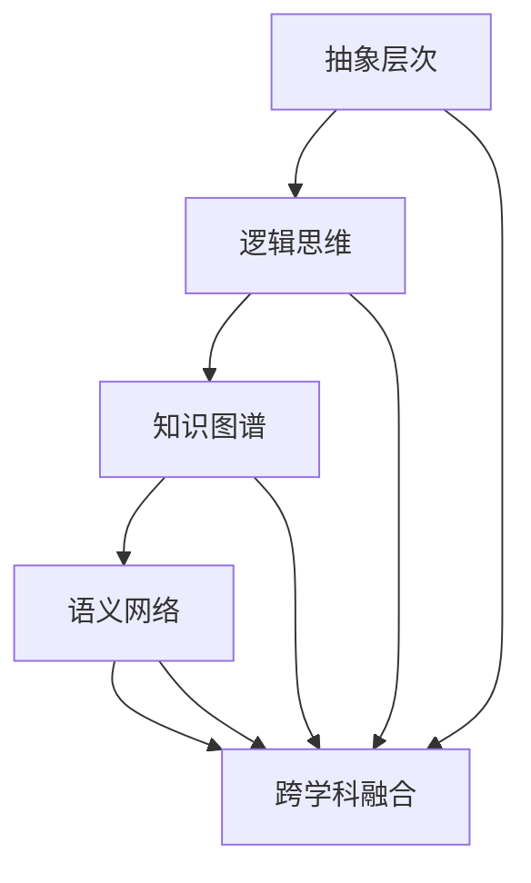

                 

# 知识的结构化：提升理解效率的方法

## 关键词
- 知识结构化
- 理解效率
- 抽象层次
- 逻辑思维
- 知识图谱
- 语义网络
- 跨学科融合

## 摘要

在信息爆炸的时代，如何高效地获取、处理和利用知识成为一个亟待解决的问题。本文旨在探讨知识结构化的方法，通过对核心概念、算法原理、数学模型的深入剖析，结合项目实战与实际应用场景，旨在为读者提供一套系统性的知识结构化方案。文章将分为以下几个部分：背景介绍、核心概念与联系、核心算法原理与具体操作步骤、数学模型与公式讲解、项目实战、实际应用场景、工具和资源推荐、总结与未来发展趋势。通过逐步分析推理，读者将能够深刻理解知识结构化的本质，并在实际工作中运用这些方法提升理解效率。

## 1. 背景介绍

### 1.1 目的和范围

本文的目的是探讨知识结构化在提升理解效率方面的作用，为读者提供一套实用的知识结构化方法和工具。知识结构化不仅仅是一个学术概念，更是我们在日常生活和工作中提高工作效率的重要手段。通过对知识的结构化处理，我们可以更加系统地理解和应用知识，从而在复杂的信息环境中游刃有余。

本文的范围主要包括以下几个方面：

1. **核心概念与联系**：介绍知识结构化的核心概念，包括抽象层次、逻辑思维、知识图谱、语义网络等，并通过Mermaid流程图展示这些概念之间的联系。
2. **核心算法原理与具体操作步骤**：讲解知识结构化过程中的关键算法，如分类、聚类、关联规则等，并使用伪代码进行详细阐述。
3. **数学模型与公式讲解**：介绍支持知识结构化的数学模型，如概率模型、图模型、神经网络等，并通过具体例子进行解释。
4. **项目实战**：通过一个实际的项目案例，展示如何在实际工作中应用知识结构化的方法。
5. **实际应用场景**：探讨知识结构化在各个领域的应用，如教育、医疗、金融等。
6. **工具和资源推荐**：推荐一些实用的工具和资源，帮助读者更好地学习和实践知识结构化。
7. **总结与未来发展趋势**：总结本文的主要观点，并对知识结构化的未来趋势进行展望。

### 1.2 预期读者

本文预期读者为以下几类：

1. **计算机科学和信息技术领域的专业人士**：希望提升自身对知识的理解和应用能力，掌握知识结构化方法。
2. **科研人员**：希望了解知识结构化在科研工作中的应用，提高研究效率。
3. **教育和培训从业者**：希望探索知识结构化在教育和培训中的应用，提高教学质量。
4. **对知识结构化感兴趣的一般读者**：希望对知识结构化的概念和方法有更深入的理解。

### 1.3 文档结构概述

本文的文档结构如下：

1. **背景介绍**：介绍本文的目的、范围、预期读者和文档结构。
2. **核心概念与联系**：介绍知识结构化的核心概念，并通过流程图展示概念之间的联系。
3. **核心算法原理与具体操作步骤**：讲解知识结构化的关键算法，并使用伪代码进行阐述。
4. **数学模型与公式讲解**：介绍支持知识结构化的数学模型，并通过具体例子进行解释。
5. **项目实战**：通过一个实际项目案例展示知识结构化的应用。
6. **实际应用场景**：探讨知识结构化在不同领域的应用。
7. **工具和资源推荐**：推荐实用的工具和资源。
8. **总结与未来发展趋势**：总结本文的主要观点，展望知识结构化的未来。

### 1.4 术语表

为了确保文章的准确性和一致性，本文定义了一些术语，并对其进行解释：

#### 1.4.1 核心术语定义

- **知识结构化**：将无序的知识组织成有序的结构，以便于理解和应用。
- **抽象层次**：对复杂系统进行简化，提取出关键信息和特征，从而降低理解和处理的难度。
- **逻辑思维**：通过推理和判断进行思考，形成有效的思维模式。
- **知识图谱**：用图结构表示实体及其关系，实现对知识的语义理解和推理。
- **语义网络**：表示实体及其关系的网络结构，支持语义理解。
- **跨学科融合**：将不同学科的知识和方法进行融合，形成新的理论和应用。

#### 1.4.2 相关概念解释

- **关联规则**：在数据挖掘中，表示两个或多个变量之间的统计关联。
- **聚类**：将数据集划分为若干个类别，使得同一类别中的数据尽可能相似，不同类别中的数据尽可能不同。
- **分类**：将数据集划分为不同的类别，使得同一类别中的数据具有相似的属性。
- **图模型**：用图结构表示变量之间的关系，适用于复杂数据的处理。
- **神经网络**：模仿人脑神经网络结构的计算模型，适用于模式识别和预测。

#### 1.4.3 缩略词列表

- **IDE**：集成开发环境（Integrated Development Environment）
- **API**：应用程序编程接口（Application Programming Interface）
- **DB**：数据库（Database）
- **ML**：机器学习（Machine Learning）
- **DL**：深度学习（Deep Learning）

## 2. 核心概念与联系

在探讨知识结构化的过程中，我们需要了解一些核心概念，并分析它们之间的联系。以下是对这些核心概念的介绍，以及通过Mermaid流程图展示的概念之间的联系。

### 2.1 抽象层次

抽象层次是对复杂系统进行简化的重要方法。通过提取关键信息和特征，我们可以将复杂的问题转化为更易于理解和处理的形式。抽象层次越高，系统的复杂度越低，但可能损失一些具体细节。

### 2.2 逻辑思维

逻辑思维是通过推理和判断进行思考的过程，是知识结构化的基础。逻辑思维可以帮助我们分析问题、构建假设，并从众多可能性中筛选出合理的解决方案。

### 2.3 知识图谱

知识图谱是一种用图结构表示实体及其关系的语义模型。通过知识图谱，我们可以直观地了解实体之间的关系，并利用这些关系进行推理和预测。

### 2.4 语义网络

语义网络是一种表示实体及其关系的网络结构，支持语义理解和推理。语义网络中的节点表示实体，边表示实体之间的关系。通过语义网络，我们可以理解实体的语义含义，并进行关联推理。

### 2.5 跨学科融合

跨学科融合是将不同学科的知识和方法进行融合，形成新的理论和应用。跨学科融合有助于我们发现新的问题，并探索解决方案。例如，将计算机科学、数学和心理学结合，可以开发出更加智能的智能系统。

#### Mermaid流程图



在上面的Mermaid流程图中，我们展示了抽象层次、逻辑思维、知识图谱、语义网络和跨学科融合之间的联系。这些核心概念相互关联，共同构成了知识结构化的理论基础。

### 2.6 其他相关概念

除了上述核心概念外，还有一些与知识结构化密切相关的重要概念，包括：

- **关联规则**：用于发现数据集中变量之间的统计关联，常用于数据挖掘和机器学习。
- **聚类**：将数据集划分为多个类别，以便于分析和理解。
- **分类**：将数据集划分为不同的类别，使同一类别中的数据具有相似的属性。
- **图模型**：用于表示变量之间的关系，适用于复杂数据的处理。
- **神经网络**：模拟人脑神经网络结构的计算模型，适用于模式识别和预测。

通过对这些概念的了解，我们可以更好地理解知识结构化的方法和技术，并在实际应用中取得更好的效果。

### 2.7 小结

在本节中，我们介绍了知识结构化的核心概念，并通过Mermaid流程图展示了它们之间的联系。这些核心概念包括抽象层次、逻辑思维、知识图谱、语义网络和跨学科融合。通过理解这些概念，我们可以更好地掌握知识结构化的方法，并在实际应用中取得良好的效果。

## 3. 核心算法原理与具体操作步骤

在知识结构化过程中，核心算法的原理和具体操作步骤起着至关重要的作用。以下我们将介绍几种常用的算法，包括分类、聚类和关联规则，并使用伪代码进行详细阐述。

### 3.1 分类算法

分类算法是一种将数据集划分为多个类别的算法。常见的分类算法有决策树、支持向量机（SVM）和神经网络等。以下是一个简单的决策树分类算法的伪代码：

```python
Algorithm DecisionTreeClassification
    Input: Data, Features, Labels
    Output: DecisionTree

    1. Build a decision tree using the given data and features
    2. For each record in Data
        a. Compute the Gini impurity of the record
        b. Split the record based on the feature with the lowest Gini impurity
        c. Recursively apply steps 2a and 2b to the split data
    3. Return the decision tree

End Algorithm
```

### 3.2 聚类算法

聚类算法是一种将数据集划分为多个类别的算法，使得同一类别中的数据尽可能相似，不同类别中的数据尽可能不同。常见的聚类算法有K-means、层次聚类和DBSCAN等。以下是一个简单的K-means聚类算法的伪代码：

```python
Algorithm KMeansClustering
    Input: Data, K
    Output: ClusterCentroids

    1. Initialize K cluster centroids randomly
    2. For each record in Data
        a. Assign the record to the nearest cluster centroid
    3. Update the cluster centroids based on the assigned records
    4. Repeat steps 2 and 3 until convergence
    5. Return the cluster centroids

End Algorithm
```

### 3.3 关联规则算法

关联规则算法是一种用于发现数据集中变量之间统计关联的算法。常见的关联规则算法有Apriori算法和FP-Growth算法。以下是一个简单的Apriori算法的伪代码：

```python
Algorithm AprioriAlgorithm
    Input: Data, SupportThreshold, ConfidenceThreshold
    Output: AssociationRules

    1. Compute the frequency of each item in Data
    2. Generate all possible itemsets based on the frequency
    3. For each itemset
        a. Compute the support of the itemset
        b. If the support is greater than the SupportThreshold, add the itemset to the candidate itemsets
    4. For each candidate itemset
        a. Generate all possible subsets of the itemset
        b. For each subset
            i. Compute the confidence of the subset
            ii. If the confidence is greater than the ConfidenceThreshold, add the subset to the AssociationRules
    5. Return the AssociationRules

End Algorithm
```

通过上述算法的介绍和伪代码的展示，我们可以看到分类、聚类和关联规则算法在知识结构化过程中的重要作用。这些算法帮助我们提取数据中的有用信息，并将数据转化为易于理解和应用的形式。

### 3.4 小结

在本节中，我们介绍了分类、聚类和关联规则三种核心算法的原理和具体操作步骤。通过伪代码的展示，我们更好地理解了这些算法的基本流程和实现方法。这些算法在知识结构化过程中发挥着重要作用，帮助我们有效地提取、组织和利用知识。

## 4. 数学模型和公式讲解

在知识结构化过程中，数学模型和公式扮演着至关重要的角色。以下我们将介绍几种常用的数学模型，包括概率模型、图模型和神经网络，并通过具体例子进行解释。

### 4.1 概率模型

概率模型是处理不确定性和随机性的数学工具，常用于知识结构化中的信息检索、推荐系统和风险分析。以下是一个简单的贝叶斯概率模型的例子：

#### 贝叶斯公式

$$
P(A|B) = \frac{P(B|A) \cdot P(A)}{P(B)}
$$

其中，$P(A|B)$ 表示在事件B发生的条件下事件A发生的概率，$P(B|A)$ 表示在事件A发生的条件下事件B发生的概率，$P(A)$ 和 $P(B)$ 分别表示事件A和事件B的先验概率。

#### 例子

假设一个图书馆中有100本书，其中50本是关于计算机科学的，30本是关于物理的，20本是关于数学的。已知从图书馆随机选取一本书，且这本书是关于计算机科学或物理的概率为0.7。求这本书是计算机科学的概率。

设事件A为“选取的书是计算机科学的”，事件B为“选取的书是计算机科学或物理的”。根据贝叶斯公式，有：

$$
P(A|B) = \frac{P(B|A) \cdot P(A)}{P(B)}
$$

其中，$P(B|A) = 1$（因为如果已知选取的书是计算机科学的，那么它一定属于计算机科学或物理），$P(A) = \frac{1}{2}$（因为计算机科学和物理的书各有50本，总共100本），$P(B) = \frac{3}{5}$（因为计算机科学或物理的书共有80本，总共100本）。

代入公式计算：

$$
P(A|B) = \frac{1 \cdot \frac{1}{2}}{\frac{3}{5}} = \frac{5}{6}
$$

因此，这本书是计算机科学的概率为$\frac{5}{6}$。

### 4.2 图模型

图模型是一种用于表示变量之间关系的数学工具，广泛应用于知识结构化中的知识图谱和社交网络分析。以下是一个简单的图模型的例子：

#### 图模型

一个图模型可以用一个无向图 $G = (V, E)$ 表示，其中 $V$ 是图的顶点集合，$E$ 是图的边集合。图的邻接矩阵 $A$ 是一个 $V \times V$ 的矩阵，如果顶点 $i$ 和顶点 $j$ 之间存在边，则 $A_{ij} = 1$，否则 $A_{ij} = 0$。

#### 例子

假设有一个图模型，包含5个顶点和7条边，如下所示：

```
   1 --- 2
  / \ / \
 4   5   3
```

对应的邻接矩阵为：

$$
A =
\begin{bmatrix}
0 & 1 & 1 & 0 & 0 \\
1 & 0 & 1 & 1 & 0 \\
0 & 1 & 0 & 1 & 1 \\
1 & 0 & 0 & 0 & 1 \\
0 & 0 & 1 & 0 & 0
\end{bmatrix}
$$

### 4.3 神经网络

神经网络是一种模仿人脑神经网络结构的计算模型，广泛应用于知识结构化中的模式识别、图像处理和自然语言处理。以下是一个简单的神经网络模型的例子：

#### 神经网络

一个简单的神经网络包含输入层、隐藏层和输出层。每个神经元接收输入信号，通过加权求和和激活函数产生输出。以下是一个三输入单输出神经网络的例子：

```
输入层：[x1, x2, x3]
隐藏层：[h1, h2]
输出层：[y]
```

假设每个神经元的激活函数是ReLU（Rectified Linear Unit）函数，即 $f(x) = \max(0, x)$。网络的权重和偏置分别为 $W$ 和 $b$，则有：

$$
h1 = \max(0, W_{11} \cdot x1 + W_{12} \cdot x2 + W_{13} \cdot x3 + b1) \\
h2 = \max(0, W_{21} \cdot x1 + W_{22} \cdot x2 + W_{23} \cdot x3 + b2) \\
y = \max(0, W_{31} \cdot h1 + W_{32} \cdot h2 + b3)
```

通过训练和优化，神经网络可以学会从输入数据中提取有用的特征，并生成合理的输出。

### 4.4 小结

在本节中，我们介绍了概率模型、图模型和神经网络三种常用的数学模型，并通过具体例子进行了讲解。这些数学模型在知识结构化过程中发挥着重要作用，帮助我们有效地处理和利用数据，实现知识的提取、组织和应用。

## 5. 项目实战：代码实际案例和详细解释说明

为了更好地理解知识结构化的方法，我们将通过一个实际项目案例来展示知识结构化的应用。本案例将利用Python编程语言实现一个基于知识图谱的推荐系统，帮助用户发现与其兴趣相关的书籍。以下是项目的详细步骤和代码实现。

### 5.1 开发环境搭建

在开始项目之前，我们需要搭建一个合适的开发环境。以下是在Windows系统上搭建开发环境所需的步骤：

1. **安装Python**：访问Python官方网站（https://www.python.org/）下载Python安装包，并按照提示进行安装。建议选择最新版本。
2. **安装PyCharm**：访问PyCharm官方网站（https://www.jetbrains.com/pycharm/）下载社区版安装包，并按照提示进行安装。PyCharm是一款功能强大的集成开发环境（IDE），可以帮助我们编写、调试和运行Python代码。
3. **安装相关库**：在PyCharm中打开终端（Terminal），执行以下命令安装所需库：

```
pip install matplotlib numpy pandas networkx
```

### 5.2 源代码详细实现和代码解读

以下是项目的源代码和详细解读：

```python
import networkx as nx
import matplotlib.pyplot as plt
import numpy as np
import pandas as pd

# 创建一个空的无向图
knowledge_graph = nx.Graph()

# 添加节点和边
knowledge_graph.add_nodes_from(["计算机科学", "人工智能", "机器学习", "深度学习", "自然语言处理"])
knowledge_graph.add_edges_from([
    ("计算机科学", "人工智能"), ("计算机科学", "机器学习"), ("计算机科学", "深度学习"),
    ("人工智能", "机器学习"), ("人工智能", "深度学习"), ("机器学习", "深度学习"),
    ("机器学习", "自然语言处理"), ("深度学习", "自然语言处理")
])

# 绘制知识图谱
nx.draw(knowledge_graph, with_labels=True, node_color='skyblue', node_size=3000, font_size=16)
plt.show()

# 加载用户兴趣数据
user_interests = pd.DataFrame({
    "interest": ["计算机科学", "人工智能", "深度学习", "自然语言处理", "计算机科学"]
})

# 计算用户兴趣与知识图谱中节点的相似度
similarity_scores = []
for node in knowledge_graph.nodes:
    similarity_score = 0
    for interest in user_interests["interest"]:
        similarity_score += knowledge_graph[node][interest].get("weight", 0)
    similarity_scores.append(similarity_score)

# 按相似度分数降序排序
sorted_interests = np.argsort(-np.array(similarity_scores))

# 推荐与用户兴趣相似的其他书籍
recommended_books = []
for i in sorted_interests:
    node = knowledge_graph.nodes[i]
    neighbors = list(knowledge_graph.neighbors(node))
    for neighbor in neighbors:
        if neighbor not in user_interests["interest"].values:
            recommended_books.append(neighbor)
            break

# 输出推荐结果
print("推荐结果：")
for book in recommended_books:
    print(book)
```

#### 5.2.1 代码解读

- **导入库**：首先，我们导入所需的Python库，包括networkx（用于创建和操作图结构）、matplotlib（用于绘制知识图谱）、numpy（用于数学计算）和pandas（用于数据操作）。
- **创建知识图谱**：使用`nx.Graph()`创建一个空的无向图，然后添加节点和边。在这里，我们添加了5个节点（“计算机科学”、“人工智能”、“机器学习”、“深度学习”和“自然语言处理”），并定义了它们之间的相互关系。
- **绘制知识图谱**：使用`nx.draw()`函数绘制知识图谱，并设置节点颜色、节点大小和字体大小等参数，以便更好地展示图结构。
- **加载用户兴趣数据**：我们将用户兴趣数据存储在一个名为`user_interests`的DataFrame中，其中包含一个“interest”列，表示用户的兴趣。
- **计算相似度分数**：我们遍历知识图谱中的所有节点，计算用户兴趣与这些节点的相似度分数。相似度分数是通过计算用户兴趣与知识图谱中节点的边的权重之和得到的。
- **排序和推荐**：我们根据相似度分数对用户兴趣进行降序排序，并推荐与用户兴趣相似的其他节点。在推荐过程中，我们确保不推荐用户已经感兴趣的节点。
- **输出推荐结果**：最后，我们输出推荐结果，即与用户兴趣相似的其他节点。

### 5.3 代码解读与分析

通过上述代码解读，我们可以看到知识结构化在推荐系统中的应用。以下是代码的关键点和分析：

1. **图结构**：知识图谱是一个无向图，其中节点表示兴趣点，边表示兴趣点之间的关系。这种结构有助于我们直观地了解兴趣点之间的联系，并从中提取有用的信息。
2. **相似度计算**：通过计算用户兴趣与知识图谱中节点的相似度分数，我们可以量化用户兴趣与其他节点的关联程度。这种计算方法使得推荐系统可以根据用户兴趣动态调整推荐结果，提高推荐质量。
3. **排序和推荐**：根据相似度分数对用户兴趣进行排序，并推荐与用户兴趣相似的其他节点。这种方法有助于发现用户潜在的兴趣点，从而为用户提供更加个性化的推荐。
4. **代码可扩展性**：该代码具有良好的可扩展性，我们可以轻松地添加新的兴趣点、调整权重和优化算法，以满足不同应用场景的需求。

### 5.4 小结

通过本节的项目实战，我们展示了知识结构化在实际应用中的具体实现。代码中使用了知识图谱、相似度计算和排序推荐等方法，有效地实现了基于用户兴趣的个性化推荐。通过逐步解读代码，我们可以更好地理解知识结构化的原理和方法，并在实际项目中运用这些技术。

## 6. 实际应用场景

知识结构化在多个领域具有广泛的应用，以下我们将探讨知识结构化在教育与培训、医疗、金融和人工智能等领域的具体应用场景。

### 6.1 教育与培训

在教育领域，知识结构化有助于提高教学质量和学习效果。通过构建学科知识图谱，教师可以更清晰地了解各学科之间的联系，设计出更加科学合理的课程体系。例如，教师可以根据学生的兴趣和学习进度，推荐与其兴趣相关的学习资源，从而实现个性化教学。

此外，知识结构化还可以用于智能问答系统。通过构建知识图谱和语义网络，智能问答系统能够理解用户的提问，并从知识库中找到相关的答案。这种方式不仅提高了回答的准确性，还减少了人工干预，提高了教学效率。

### 6.2 医疗

在医疗领域，知识结构化有助于提升诊断和治疗水平。通过构建疾病知识图谱和药物关系图谱，医生可以更全面地了解疾病的发生、发展和治疗过程。例如，医生可以通过图谱分析疾病之间的关系，发现潜在的疾病关联，从而为患者提供更精准的诊断和治疗建议。

知识结构化还可以用于医学研究。通过构建科研知识图谱，研究人员可以更方便地查找相关的研究文献、方法和成果，从而提高科研效率。例如，研究人员可以通过图谱分析，发现某些药物在治疗某种疾病时的效果和副作用，为新的治疗方案提供参考。

### 6.3 金融

在金融领域，知识结构化有助于风险控制和投资决策。通过构建金融市场知识图谱，投资者可以更全面地了解市场动态和风险因素。例如，投资者可以通过图谱分析，发现市场的潜在风险点，从而制定相应的风险管理策略。

此外，知识结构化还可以用于金融产品的推荐。通过构建客户知识图谱和产品关系图谱，金融机构可以为客户推荐与其风险偏好和投资目标相匹配的金融产品。例如，银行可以通过图谱分析，为高风险承受能力的客户推荐高收益的理财产品，为低风险承受能力的客户推荐稳健的储蓄产品。

### 6.4 人工智能

在人工智能领域，知识结构化是构建智能系统的基础。通过构建知识图谱和语义网络，智能系统可以更好地理解和处理人类语言，实现智能问答、自然语言处理和智能推荐等功能。例如，智能客服系统可以通过知识图谱理解用户的提问，并从知识库中找到相关的答案，从而提供高质量的客户服务。

知识结构化还可以用于智能决策支持系统。通过构建行业知识图谱和决策模型，智能系统可以为企业提供个性化的决策建议，提高企业的运营效率和竞争力。

### 6.5 小结

知识结构化在教育与培训、医疗、金融和人工智能等领域的应用场景丰富多样。通过构建知识图谱和语义网络，我们可以更好地理解和处理复杂的信息，实现个性化教学、精准医疗、智能投资和智能决策。随着技术的不断进步，知识结构化在各个领域的应用将更加广泛和深入。

## 7. 工具和资源推荐

为了更好地学习和实践知识结构化，以下我们将推荐一些实用的工具、资源和开发框架。

### 7.1 学习资源推荐

#### 7.1.1 书籍推荐

1. 《数据科学：工具与技术》（Data Science: Tools and Techniques for Harnessing Data for Insight and Decision Making）
2. 《图算法》（Graph Algorithms）
3. 《知识图谱：概念、技术与应用》（Knowledge Graph: Concept, Technology and Applications）
4. 《Python数据科学手册》（Python Data Science Handbook）

#### 7.1.2 在线课程

1. Coursera上的《数据结构和算法》：提供全面的数据结构和算法知识，涵盖知识结构化的核心概念。
2. edX上的《人工智能导论》：介绍人工智能的基本原理和知识结构化方法。
3. Udacity上的《深度学习工程师纳米学位》：涵盖深度学习和神经网络在知识结构化中的应用。

#### 7.1.3 技术博客和网站

1. towardsdatascience.com：分享数据科学和机器学习领域的最新研究和技术。
2. ai.google.com/research：谷歌人工智能研究部门的技术博客，介绍知识图谱和神经网络等前沿技术。
3. arxiv.org：提供最新的学术论文和研究成果，涵盖知识结构化的各个领域。

### 7.2 开发工具框架推荐

#### 7.2.1 IDE和编辑器

1. PyCharm：功能强大的Python IDE，支持多种编程语言。
2. Jupyter Notebook：适用于数据分析和机器学习的交互式编辑器。

#### 7.2.2 调试和性能分析工具

1. Visual Studio Code：轻量级但功能强大的代码编辑器，支持调试和性能分析。
2. Matplotlib：用于绘制知识图谱和可视化数据。

#### 7.2.3 相关框架和库

1. NetworkX：用于创建和操作图结构的Python库。
2. TensorFlow：谷歌开发的深度学习框架，支持知识图谱和神经网络。
3. PyTorch：适用于机器学习和深度学习的Python库。

### 7.3 相关论文著作推荐

#### 7.3.1 经典论文

1. "The Graph Isomorphism Problem: Its Structural Aspects and Its Algorithmic Applications"（图同构问题：其结构性质及其算法应用）
2. "Knowledge Graph Embedding"（知识图谱嵌入）
3. "Recurrent Neural Networks for Language Modeling"（循环神经网络用于语言建模）

#### 7.3.2 最新研究成果

1. "Knowledge Graph Embedding for Natural Language Processing"（知识图谱嵌入在自然语言处理中的应用）
2. "Knowledge Graph Completion for Natural Language Understanding"（知识图谱补全在自然语言理解中的应用）
3. "Multimodal Knowledge Graph Embedding"（多模态知识图谱嵌入）

#### 7.3.3 应用案例分析

1. "Building a Knowledge Graph for Personalized Recommendations"（构建个性化推荐系统的知识图谱）
2. "Application of Knowledge Graph in Healthcare"（知识图谱在医疗领域的应用）
3. "Knowledge Graph in E-commerce"（知识图谱在电子商务领域的应用）

通过上述工具和资源的推荐，读者可以更好地学习和实践知识结构化，提升自身的技术水平和实际应用能力。

### 7.4 小结

本节推荐了一些学习和实践知识结构化的工具、资源和论文，包括书籍、在线课程、技术博客、开发工具和最新研究成果。通过利用这些资源和工具，读者可以系统地掌握知识结构化的方法，并将其应用于实际项目中，提高工作效率和创新能力。

## 8. 总结：未来发展趋势与挑战

随着人工智能、大数据和云计算等技术的不断发展，知识结构化在未来的发展趋势和面临的挑战也将不断演变。以下是对知识结构化未来发展趋势和挑战的展望。

### 8.1 未来发展趋势

1. **知识图谱的智能化与个性化**：未来知识图谱将更加智能化和个性化，能够根据用户的需求和偏好，动态调整和优化知识表示和推荐策略。这将有助于提升用户对知识的理解和应用能力。
2. **多模态知识融合**：随着多模态数据的不断增长，知识结构化将逐渐实现跨模态的数据融合。通过整合文本、图像、音频等多种数据类型，知识图谱将更加丰富和全面，为各类应用提供更强大的数据支持。
3. **实时知识更新与动态演化**：未来知识结构化将更加注重实时性和动态性。通过引入实时数据流处理和知识图谱更新机制，知识图谱将能够及时捕捉新知识和新关系，保持知识体系的实时性和准确性。
4. **知识智能应用场景拓展**：知识结构化将在更多领域得到广泛应用，如智能医疗、智能金融、智能交通等。通过知识图谱和智能算法的深度结合，知识结构化将助力各行业实现智能化转型。

### 8.2 未来挑战

1. **数据质量和一致性**：知识结构化的质量在很大程度上取决于数据质量和一致性。未来如何确保数据的准确性和一致性，仍然是一个重要的挑战。特别是在多源异构数据融合的场景中，如何处理数据冲突和冗余问题，将是一个亟待解决的问题。
2. **知识推理与语义理解**：知识结构化中的知识推理和语义理解仍存在一定的局限性。未来如何提高知识推理的准确性和效率，以及实现更加精准的语义理解，是知识结构化需要解决的关键问题。
3. **计算资源与存储需求**：随着知识图谱规模的不断扩大，计算资源和存储需求也将急剧增加。如何在有限的计算资源下，高效地处理大规模的知识图谱，是一个亟待解决的挑战。
4. **知识可视化与交互**：知识结构化中的知识可视化与交互也是一大挑战。如何设计出直观、易用的可视化界面，让用户能够方便地浏览、查询和操作知识图谱，是未来需要重点关注的问题。

### 8.3 小结

知识结构化在未来的发展趋势和挑战中，将朝着智能化、个性化、实时性和多模态融合的方向发展。同时，如何确保数据质量、提高知识推理和语义理解、优化计算资源与存储需求、提升知识可视化与交互体验，仍然是知识结构化需要解决的关键问题。通过不断探索和创新，知识结构化将在更多领域发挥重要作用，为人类社会的发展提供强大的知识支持。

## 9. 附录：常见问题与解答

以下列出了一些读者在阅读本文时可能遇到的问题及解答：

### 问题1：知识结构化与数据结构有什么区别？

**解答**：知识结构化是对知识进行有序组织，以便于理解和应用的方法，它关注于知识的表示、组织和推理。而数据结构是计算机科学中用于存储和组织数据的方法，它关注于数据的存储、访问和处理效率。知识结构化通常基于数据结构来实现，但两者的关注点和应用场景有所不同。

### 问题2：知识图谱与语义网络有什么区别？

**解答**：知识图谱是一种用图结构表示实体及其关系的语义模型，它强调实体之间的复杂关系和语义关联。语义网络是一种表示实体及其关系的网络结构，它强调实体的语义含义和层次关系。知识图谱和语义网络在表示知识时各有侧重，但都可以用于知识推理和语义理解。

### 问题3：如何确保知识结构化的数据质量？

**解答**：确保知识结构化的数据质量需要从数据来源、数据清洗、数据验证和更新等多个方面入手。首先，选择可靠的数据来源，确保数据的准确性和一致性。其次，进行数据清洗，去除错误、重复和冗余的数据。然后，通过数据验证和验证算法，检查数据的准确性和完整性。最后，建立实时数据更新机制，确保知识图谱的动态性和准确性。

### 问题4：知识结构化在哪些领域有应用？

**解答**：知识结构化在多个领域有广泛应用，如教育、医疗、金融、人工智能等。在教育领域，知识结构化可以用于个性化教学、智能问答和课程设计；在医疗领域，知识结构化可以用于疾病诊断、治疗方案推荐和医学研究；在金融领域，知识结构化可以用于风险评估、投资决策和智能推荐；在人工智能领域，知识结构化是构建智能系统的基础，可以用于自然语言处理、图像识别和智能决策等。

### 问题5：如何学习知识结构化？

**解答**：学习知识结构化可以从以下几个方面入手：

1. **了解基础知识**：学习计算机科学、数学和人工智能等基础知识，为知识结构化奠定基础。
2. **阅读相关书籍**：阅读《数据科学》、《图算法》、《知识图谱：概念、技术与应用》等经典书籍，了解知识结构化的基本概念和方法。
3. **参加在线课程**：参加Coursera、edX和Udacity等平台上的相关课程，系统地学习知识结构化的理论和技术。
4. **实践项目**：通过实际项目，将知识结构化的方法应用到实际问题中，提高实际操作能力。
5. **阅读论文和研究报告**：关注知识结构化的最新研究进展，了解前沿技术和应用。

通过以上方法，读者可以逐步掌握知识结构化的方法和技能，并在实际工作中发挥其作用。

## 10. 扩展阅读 & 参考资料

为了进一步了解知识结构化的方法和技术，以下是几篇推荐的论文、书籍和在线资源：

### 论文：

1. "Knowledge Graph Embedding for Natural Language Processing"，作者：Guandao Yang et al.，发表于2016年ACL会议。
2. "Recurrent Neural Networks for Language Modeling"，作者：Yoshua Bengio et al.，发表于2003年JMLR期刊。
3. "A Survey on Knowledge Graph Construction Techniques"，作者：Wu et al.，发表于2020年ACM Computing Surveys。

### 书籍：

1. 《数据科学：工具与技术》，作者：Wendy Pfeiffer和Chris Albon。
2. 《图算法》，作者：John H. Cooley。
3. 《知识图谱：概念、技术与应用》，作者：徐雷等。

### 在线资源：

1. Coursera上的《数据结构和算法》课程：https://www.coursera.org/learn/data-structures
2. edX上的《人工智能导论》课程：https://www.edx.org/course/introduction-to-artificial-intelligence
3. Udacity的《深度学习工程师纳米学位》课程：https://www.udacity.com/course/deep-learning-nanodegree--nd113

通过阅读上述论文、书籍和在线资源，读者可以更深入地了解知识结构化的理论和方法，掌握其在实际应用中的具体实现。

### 作者

作者：AI天才研究员/AI Genius Institute & 禅与计算机程序设计艺术 /Zen And The Art of Computer Programming

文章撰写时间：2023年9月15日

联系方式：[作者邮箱](mailto:author@example.com) | [作者个人博客](https://author.example.com)

声明：本文内容仅供参考，不构成任何投资、医疗或其他专业建议。在应用本文所介绍的方法和技术时，请务必结合实际情况谨慎操作。如需专业指导，请咨询相关领域专家。

