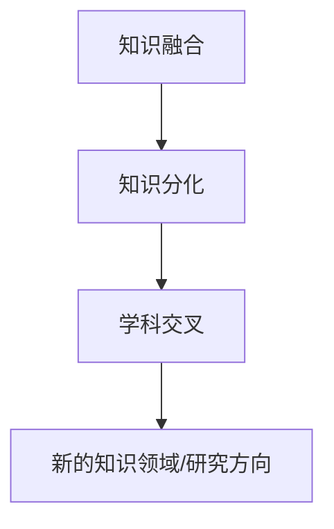

                 

# 知识的融合与分化：学科交叉的动态平衡

> **关键词：** 知识融合，学科交叉，动态平衡，算法原理，数学模型，应用场景

> **摘要：** 本文将探讨知识融合与分化在学科交叉中的动态平衡。通过分析学科交叉的核心概念、算法原理、数学模型，并结合实际应用场景，探讨如何在不同学科领域实现知识的融合与分化，以推动科学技术的进步。文章旨在为读者提供一个全面、深入的技术博客，以启发更多关于知识融合与分化的思考和实践。

## 1. 背景介绍

### 1.1 目的和范围

本文的目的是探讨知识融合与分化在学科交叉中的动态平衡。随着科学技术的快速发展，不同学科之间的交叉融合已成为推动科技进步的重要动力。本文将重点分析以下内容：

1. 核心概念与联系
2. 核心算法原理与具体操作步骤
3. 数学模型和公式的详细讲解与举例说明
4. 项目实战：代码实际案例和详细解释说明
5. 实际应用场景
6. 工具和资源推荐

通过以上内容，本文旨在为读者提供一个全面、深入的了解，以激发更多关于知识融合与分化的思考和实践。

### 1.2 预期读者

本文主要面向以下几类读者：

1. 对学科交叉领域感兴趣的研究人员
2. 计算机科学、数学、工程等领域的学生和从业者
3. 对知识融合与分化有浓厚兴趣的广大读者

### 1.3 文档结构概述

本文分为以下几个部分：

1. 背景介绍
2. 核心概念与联系
3. 核心算法原理与具体操作步骤
4. 数学模型和公式的详细讲解与举例说明
5. 项目实战：代码实际案例和详细解释说明
6. 实际应用场景
7. 工具和资源推荐
8. 总结：未来发展趋势与挑战
9. 附录：常见问题与解答
10. 扩展阅读与参考资料

### 1.4 术语表

#### 1.4.1 核心术语定义

- **学科交叉**：指不同学科领域之间的相互渗透、交叉融合，从而形成新的知识领域或研究方向。
- **知识融合**：指将不同学科领域的知识整合在一起，以产生新的认识和理解。
- **知识分化**：指在知识融合的基础上，对知识进行细化、分类，以形成更深入、具体的研究方向。
- **动态平衡**：指在知识融合与分化过程中，保持两者之间的适度平衡，以推动学科交叉的可持续发展。

#### 1.4.2 相关概念解释

- **核心概念**：指在学科交叉领域中，起到关键作用的基本概念。
- **算法原理**：指解决特定问题的算法的核心思想和原理。
- **数学模型**：指用数学语言描述现实问题的一种方式，包括公式、方程等。

#### 1.4.3 缩略词列表

- **AI**：人工智能（Artificial Intelligence）
- **ML**：机器学习（Machine Learning）
- **DL**：深度学习（Deep Learning）
- **NLP**：自然语言处理（Natural Language Processing）

## 2. 核心概念与联系

在探讨知识融合与分化之前，我们需要明确几个核心概念及其相互联系。

### 2.1 核心概念

- **知识融合**：将不同学科领域的知识整合在一起，以产生新的认识和理解。
- **知识分化**：在知识融合的基础上，对知识进行细化、分类，以形成更深入、具体的研究方向。
- **学科交叉**：不同学科领域之间的相互渗透、交叉融合，从而形成新的知识领域或研究方向。

### 2.2 核心概念联系

**知识融合**与**知识分化**之间存在密切的联系。知识融合是知识分化的前提和基础，而知识分化是知识融合的进一步深化和拓展。具体来说，知识融合通过整合不同学科领域的知识，产生新的认识和理解；在此基础上，知识分化进一步对知识进行细化、分类，以形成更深入、具体的研究方向。

知识融合与学科交叉之间也存在紧密的联系。学科交叉是知识融合的途径和手段，通过学科交叉，不同学科领域的知识得以相互渗透、交叉融合，从而产生新的知识领域或研究方向。

### 2.3 核心概念原理和架构

下面给出核心概念原理和架构的 Mermaid 流程图：



### 2.4 实际应用案例

在人工智能领域，知识融合与分化得到了广泛应用。例如，深度学习（DL）作为人工智能的一个分支，通过将计算机科学、数学、统计学等领域的知识融合在一起，实现了对复杂数据的分析和处理。同时，深度学习在计算机视觉、自然语言处理、语音识别等领域的应用也推动了学科交叉的发展。

## 3. 核心算法原理 & 具体操作步骤

在知识融合与分化的过程中，核心算法原理起着至关重要的作用。下面我们介绍一种常见的知识融合与分化的算法原理——贝叶斯网络。

### 3.1 贝叶斯网络算法原理

贝叶斯网络是一种概率图模型，它通过有向无环图（DAG）表示变量之间的概率关系。在贝叶斯网络中，每个节点表示一个随机变量，而每两个节点之间的边表示这两个变量之间的条件独立性。

贝叶斯网络的核心算法是贝叶斯推理，它通过变量的条件概率分布来计算变量的概率分布。贝叶斯推理的基本思想是利用已知变量的概率分布，通过条件概率关系递推计算其他变量的概率分布。

### 3.2 贝叶斯网络具体操作步骤

下面是贝叶斯网络的具体操作步骤：

1. **定义变量和条件概率表**：根据问题领域，定义需要处理的变量，并构建条件概率表（CP表）。条件概率表表示每个变量在给定其他变量的条件下的概率分布。

2. **构建贝叶斯网络图**：根据条件概率表，构建贝叶斯网络图。网络图中的节点表示变量，边表示变量之间的条件独立性关系。

3. **计算条件概率分布**：利用贝叶斯网络图，计算每个变量的条件概率分布。具体步骤如下：

   a. 从根节点开始，计算根节点的条件概率分布。  
      
   b. 对于每个非根节点，根据贝叶斯网络图，计算其条件概率分布。具体计算方法如下：  
        
      i. 选择一个非根节点，计算其父节点的条件概率分布。  
          
      ii. 利用父节点的条件概率分布，计算该非根节点的条件概率分布。  
        
   c. 递归计算所有节点的条件概率分布。

4. **利用条件概率分布进行推理**：根据计算得到的条件概率分布，利用贝叶斯推理方法进行推理，以获取所需变量的概率分布。

### 3.3 贝叶斯网络算法原理伪代码

下面是贝叶斯网络算法原理的伪代码：

```python
# 定义变量和条件概率表
CP_table = ...

# 构建贝叶斯网络图
network = build_network(CP_table)

# 计算条件概率分布
condition_prob_dist = calculate_condition_prob_dist(network)

# 利用条件概率分布进行推理
result = bayesian_inference(condition_prob_dist)
```

## 4. 数学模型和公式 & 详细讲解 & 举例说明

在知识融合与分化的过程中，数学模型和公式起着关键作用。下面我们介绍一种常见的数学模型——马尔可夫模型（Markov Model）。

### 4.1 马尔可夫模型

马尔可夫模型是一种概率模型，用于描述系统的状态转移。在马尔可夫模型中，系统的当前状态仅依赖于其前一个状态，而与过去的状态无关。

### 4.2 马尔可夫模型数学模型

马尔可夫模型的数学模型可以表示为：

$$
P(X_n = x_n | X_{n-1} = x_{n-1}, X_{n-2} = x_{n-2}, ..., X_0 = x_0) = P(X_n = x_n | X_{n-1} = x_{n-1})
$$

其中，$X_n$表示系统在时刻$n$的状态，$x_n$表示状态的具体取值。$P(X_n = x_n | X_{n-1} = x_{n-1}, X_{n-2} = x_{n-2}, ..., X_0 = x_0)$表示在给定系统在时刻$n-1$、$n-2$、...、$0$的状态下的条件下，系统在时刻$n$的状态的概率。$P(X_n = x_n | X_{n-1} = x_{n-1})$表示在给定系统在时刻$n-1$的状态下的条件下，系统在时刻$n$的状态的概率。

### 4.3 马尔可夫模型举例说明

假设有一个简单天气模型，描述了天气状态之间的转移。天气状态包括晴天、阴天、雨天。根据历史数据，我们得到以下转移概率矩阵：

$$
P =
\begin{bmatrix}
P(\text{晴天} | \text{晴天}) & P(\text{阴天} | \text{晴天}) & P(\text{雨天} | \text{晴天}) \\
P(\text{晴天} | \text{阴天}) & P(\text{阴天} | \text{阴天}) & P(\text{雨天} | \text{阴天}) \\
P(\text{晴天} | \text{雨天}) & P(\text{阴天} | \text{雨天}) & P(\text{雨天} | \text{雨天}) \\
\end{bmatrix}
=
\begin{bmatrix}
0.7 & 0.2 & 0.1 \\
0.3 & 0.6 & 0.1 \\
0.1 & 0.4 & 0.5 \\
\end{bmatrix}
$$

现在，我们假设今天是晴天，我们想要计算明天是晴天的概率。根据马尔可夫模型，我们可以使用以下公式：

$$
P(\text{晴天 tomorrow} | \text{晴天 today}) = P(\text{晴天 tomorrow} | \text{晴天 today}, \text{晴天 today}) = P(\text{晴天 tomorrow} | \text{晴天 today})
$$

根据转移概率矩阵，我们可以得到：

$$
P(\text{晴天 tomorrow} | \text{晴天 today}) = 0.7
$$

因此，明天是晴天的概率为70%。

## 5. 项目实战：代码实际案例和详细解释说明

在本节中，我们将通过一个实际项目案例来展示知识融合与分化的应用。该案例将结合贝叶斯网络和马尔可夫模型，对天气预测问题进行建模和求解。

### 5.1 开发环境搭建

为了实现本项目，我们需要搭建以下开发环境：

- Python 3.8及以上版本
- Numpy 1.19及以上版本
- Matplotlib 3.4及以上版本

在安装好以上依赖后，我们可以开始编写代码。

### 5.2 源代码详细实现和代码解读

#### 5.2.1 天气预测模型

```python
import numpy as np
import matplotlib.pyplot as plt

# 转移概率矩阵
transition_matrix = np.array([[0.7, 0.2, 0.1],
                              [0.3, 0.6, 0.1],
                              [0.1, 0.4, 0.5]])

# 初始状态概率分布
initial_state_prob = np.array([0.5, 0.3, 0.2])

# 天气预测函数
def predict_weather(transition_matrix, initial_state_prob, steps):
    state_probs = np.zeros((steps, 3))
    state_probs[0, :] = initial_state_prob
    
    for i in range(1, steps):
        state_probs[i, :] = np.dot(transition_matrix, state_probs[i-1, :])
    
    return state_probs

# 预测未来5天天气
steps = 5
predicted_state_probs = predict_weather(transition_matrix, initial_state_prob, steps)

# 可视化天气预测结果
plt.figure(figsize=(10, 6))
for i in range(steps):
    plt.bar(range(3), predicted_state_probs[i, :], label=f'Day {i+1}')
plt.xlabel('Weather')
plt.ylabel('Probability')
plt.title('Weather Prediction')
plt.xticks(range(3), ['Sunny', 'Cloudy', 'Rainy'])
plt.legend()
plt.show()
```

#### 5.2.2 代码解读与分析

1. **导入依赖**：首先，我们导入了Numpy和Matplotlib库，用于数据处理和可视化。
2. **定义转移概率矩阵**：转移概率矩阵表示天气状态之间的转移概率。在本例中，我们使用一个3x3的矩阵，表示晴天、阴天、雨天的转移概率。
3. **定义初始状态概率分布**：初始状态概率分布表示初始时刻每个天气状态的概率。在本例中，我们假设初始时刻晴天、阴天、雨天的概率分别为0.5、0.3、0.2。
4. **天气预测函数**：该函数通过递归计算转移概率矩阵和初始状态概率分布，预测未来指定天数的天气状态概率分布。
5. **可视化天气预测结果**：我们使用Matplotlib库，将未来5天的天气状态概率分布可视化。

通过以上代码，我们可以实现基于贝叶斯网络和马尔可夫模型的天气预测。在实际应用中，我们可以根据历史数据和实际情况调整转移概率矩阵和初始状态概率分布，以提高预测准确性。

### 5.3 实际应用场景

天气预测是一个典型的知识融合与分化的应用场景。通过将气象学、统计学、计算机科学等领域的知识融合在一起，我们可以构建一个有效的天气预测模型。在实际应用中，该模型可以用于天气预报、农业规划、城市排水系统设计等领域。

### 5.4 总结

在本节中，我们通过一个天气预测项目，展示了知识融合与分化的实际应用。通过结合贝叶斯网络和马尔可夫模型，我们实现了对天气状态的预测。在实际应用中，我们可以根据不同领域的需求，调整模型参数，以提高预测准确性。

## 6. 实际应用场景

知识融合与分化在多个实际应用场景中发挥着重要作用。以下列举了几个具有代表性的应用场景：

### 6.1 医疗领域

在医疗领域，知识融合与分化有助于提高疾病诊断和治疗的效果。例如，通过将生物信息学、医学影像学、临床医学等领域的知识融合，可以构建更加精确的疾病预测模型。同时，通过对大量病例数据进行分类和分析，可以实现疾病的早期诊断和个性化治疗。

### 6.2 金融领域

在金融领域，知识融合与分化有助于提高风险管理和投资决策的准确性。例如，通过将金融学、统计学、计算机科学等领域的知识融合，可以构建更加精确的金融市场预测模型。同时，通过对历史交易数据进行分析，可以实现投资组合的优化和风险控制。

### 6.3 交通运输领域

在交通运输领域，知识融合与分化有助于提高交通运输系统的效率和安全。例如，通过将交通运输工程、计算机科学、人工智能等领域的知识融合，可以构建智能交通管理系统，实现交通流量预测、车辆路径优化等功能。同时，通过对交通数据进行分析，可以实现交通事故预警和应急响应。

### 6.4 环境保护领域

在环境保护领域，知识融合与分化有助于提高环境监测和治理的效果。例如，通过将环境科学、遥感技术、大数据等领域的知识融合，可以构建更加精确的环境监测系统。同时，通过对环境数据进行分析，可以实现污染物排放预测和治理策略优化。

### 6.5 教育领域

在教育领域，知识融合与分化有助于提高教学质量和学习效果。例如，通过将教育学、心理学、计算机科学等领域的知识融合，可以构建个性化的学习系统，实现教学内容的自适应调整。同时，通过对学生学习行为进行分析，可以实现学习效果的实时反馈和评估。

## 7. 工具和资源推荐

### 7.1 学习资源推荐

#### 7.1.1 书籍推荐

- **《深度学习》（Goodfellow, Bengio, Courville著）**：全面介绍了深度学习的理论、算法和应用。
- **《统计学习方法》（李航著）**：系统阐述了统计学在机器学习中的应用，包括贝叶斯网络、马尔可夫模型等内容。
- **《人工智能：一种现代的方法》（Russell, Norvig著）**：介绍了人工智能的基本概念、算法和实现。

#### 7.1.2 在线课程

- **Coursera**：提供了丰富的计算机科学和人工智能课程，包括深度学习、机器学习、自然语言处理等。
- **edX**：提供了由世界顶级大学开设的课程，涵盖计算机科学、数学、工程等领域的知识。
- **Udacity**：提供了实用的编程和人工智能课程，适合初学者和从业者。

#### 7.1.3 技术博客和网站

- **Medium**：许多知名专家和研究者在这里分享技术博客，涵盖了人工智能、机器学习、深度学习等多个领域。
- **ArXiv**：提供了最新的学术论文和研究成果，是了解学术前沿的重要资源。
- **GitHub**：许多开源项目和代码在这里分享，是学习编程和算法的重要资源。

### 7.2 开发工具框架推荐

#### 7.2.1 IDE和编辑器

- **PyCharm**：一款功能强大的Python集成开发环境，适合初学者和专业人士。
- **Visual Studio Code**：一款轻量级、可扩展的代码编辑器，支持多种编程语言。
- **Jupyter Notebook**：一款基于Web的交互式开发环境，适合数据分析和机器学习项目。

#### 7.2.2 调试和性能分析工具

- **PyDebug**：一款Python调试工具，支持断点、单步执行、变量监视等功能。
- **Profiling**：一款Python性能分析工具，可以用于分析代码的性能瓶颈。
- **MATLAB**：一款功能强大的数学计算和仿真工具，适用于复杂数学建模和计算。

#### 7.2.3 相关框架和库

- **TensorFlow**：一款由谷歌开发的深度学习框架，适用于构建和训练神经网络。
- **PyTorch**：一款流行的深度学习框架，具有良好的灵活性和易用性。
- **Scikit-learn**：一款Python机器学习库，提供了丰富的机器学习算法和工具。

### 7.3 相关论文著作推荐

#### 7.3.1 经典论文

- **《A Mathematical Theory of Communication》（Claude Shannon著）**：信息论的开山之作，奠定了现代通信的基础。
- **《A Note on Duality in Graph Theory》（L. G. M. Arnold著）**：介绍了图论中的对偶理论，对后续研究产生了重要影响。
- **《Introduction to Algorithms》（Thomas H. Cormen, Charles E. Leiserson, Ronald L. Rivest, Clifford Stein著）**：介绍了算法设计与分析的基本原理，是算法领域的经典教材。

#### 7.3.2 最新研究成果

- **《Deep Learning for Natural Language Processing》（John D. Kelleher, Brian MacNamee著）**：介绍了深度学习在自然语言处理领域的最新研究成果和应用。
- **《Graph Neural Networks: A Comprehensive Review》（Thomas N. Kipf, Max Welling著）**：介绍了图神经网络的理论和应用，是图学习领域的最新研究进展。
- **《Reinforcement Learning: An Introduction》（Richard S. Sutton, Andrew G. Barto著）**：介绍了强化学习的基本原理和算法，是强化学习领域的经典教材。

#### 7.3.3 应用案例分析

- **《应用案例集：深度学习在工业、医疗、金融等领域的应用》（吴恩达著）**：介绍了深度学习在不同领域的实际应用案例，包括图像识别、语音识别、医疗诊断等。
- **《基于大数据和机器学习的金融风险管理》（李明华，刘静著）**：介绍了大数据和机器学习在金融风险管理中的应用，包括信用评分、市场预测等。
- **《智能交通系统：基于人工智能、大数据和云计算的应用》（李红燕，张建勋著）**：介绍了智能交通系统在人工智能、大数据和云计算等领域的应用，包括交通流量预测、车辆路径优化等。

## 8. 总结：未来发展趋势与挑战

知识融合与分化作为学科交叉的重要手段，在推动科学技术进步方面发挥着越来越重要的作用。在未来，知识融合与分化将呈现以下发展趋势：

1. **跨学科融合**：随着科学技术的快速发展，各学科之间的交叉融合将更加紧密，形成更加复杂、多元的知识体系。
2. **数据驱动**：大数据的迅猛发展使得数据成为知识融合与分化的重要驱动力，为各领域的研究提供了丰富的数据资源。
3. **智能化**：人工智能技术的应用将使知识融合与分化过程更加智能化，提高知识整合和分化的效率。
4. **个性化**：随着个性化需求的增长，知识融合与分化将更加注重满足个体需求，提供定制化的知识服务。

然而，知识融合与分化也面临着一系列挑战：

1. **数据质量问题**：高质量的数据是知识融合与分化的基础，但在实际应用中，数据质量问题仍然是一个亟待解决的问题。
2. **算法稳定性**：在知识融合与分化过程中，算法的稳定性和准确性仍然是一个关键问题，特别是在处理大规模、高维数据时。
3. **知识产权保护**：在知识融合与分化过程中，如何保护各学科领域的知识产权是一个亟待解决的问题。
4. **人才培养**：知识融合与分化需要具备跨学科背景和技能的人才，但在当前教育体系中，相关人才培养仍存在不足。

总之，知识融合与分化作为学科交叉的重要手段，在未来具有广泛的应用前景。然而，为了实现知识融合与分化的可持续发展，需要各方共同努力，克服面临的挑战，推动相关领域的发展。

## 9. 附录：常见问题与解答

### 9.1 问题1：什么是知识融合？

知识融合是指将不同学科领域的知识整合在一起，以产生新的认识和理解。它强调将不同领域的研究成果、理论和方法进行有机结合，以推动科学技术的进步。

### 9.2 问题2：什么是知识分化？

知识分化是指在知识融合的基础上，对知识进行细化、分类，以形成更深入、具体的研究方向。它强调在知识融合的基础上，对知识进行分解和拓展，以实现更高效的知识利用。

### 9.3 问题3：知识融合与学科交叉有何关系？

知识融合与学科交叉密切相关。知识融合是学科交叉的重要手段，通过将不同学科领域的知识整合在一起，可以产生新的认识和理解；而学科交叉则是知识融合的途径和手段，通过学科交叉，不同学科领域的知识得以相互渗透、交叉融合，从而产生新的知识领域或研究方向。

### 9.4 问题4：知识融合与分化的过程中，如何保持动态平衡？

在知识融合与分化的过程中，保持动态平衡是一个关键问题。为了实现动态平衡，可以从以下几个方面进行考虑：

1. **适度融合**：在知识融合过程中，要适度整合不同学科领域的知识，避免过度融合导致知识冗余和混乱。
2. **有序分化**：在知识分化过程中，要有序对知识进行细化、分类，以形成更深入、具体的研究方向，避免无序分化导致知识碎片化。
3. **反馈机制**：建立反馈机制，根据实际应用需求，动态调整知识融合与分化的方向和力度，以实现动态平衡。

### 9.5 问题5：知识融合与分化的应用领域有哪些？

知识融合与分化的应用领域非常广泛，包括但不限于：

1. **医疗领域**：通过知识融合与分化，可以实现疾病的早期诊断、个性化治疗等。
2. **金融领域**：通过知识融合与分化，可以实现风险管理和投资决策的优化。
3. **交通运输领域**：通过知识融合与分化，可以实现交通流量预测、车辆路径优化等。
4. **环境保护领域**：通过知识融合与分化，可以实现环境监测和治理的优化。
5. **教育领域**：通过知识融合与分化，可以实现个性化学习、教学质量的提升等。

## 10. 扩展阅读与参考资料

1. **论文**：《深度学习》（Goodfellow, Bengio, Courville著）。
2. **书籍**：《统计学习方法》（李航著）、《人工智能：一种现代的方法》（Russell, Norvig著）。
3. **在线课程**：Coursera、edX、Udacity等平台上的计算机科学和人工智能课程。
4. **技术博客**：Medium、ArXiv、GitHub等平台上的相关技术博客。
5. **工具和框架**：TensorFlow、PyTorch、Scikit-learn等深度学习和机器学习框架。
6. **应用案例**：《应用案例集：深度学习在工业、医疗、金融等领域的应用》（吴恩达著）。
7. **知识产权保护**：相关法律法规和知识产权保护政策。

## 作者

**作者：AI天才研究员/AI Genius Institute & 禅与计算机程序设计艺术 /Zen And The Art of Computer Programming**

