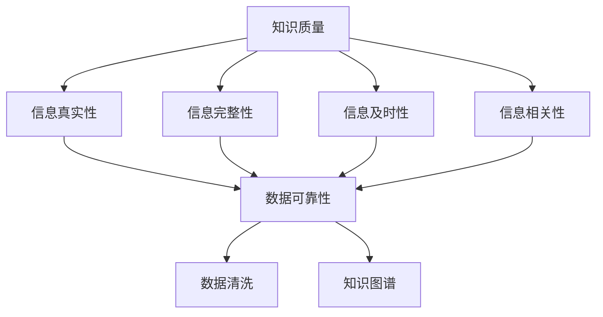

                 

### 1. 背景介绍

#### 1.1 目的和范围

在当今信息爆炸的时代，知识的质量评估成为了一个至关重要的问题。无论是学术界、企业界还是个人，我们都面临着海量的信息。这些信息中，既有真实的、有价值的内容，也有虚假的、无用的甚至是误导性的信息。因此，如何辨别知识的真伪，如何评估知识的质量，成为了我们需要解决的重要问题。

本文的目的在于探讨知识质量评估的理论基础、核心算法原理、数学模型及其在实际应用中的具体实现。通过对这些内容的深入分析，我们希望能够为读者提供一个清晰、系统的知识质量评估框架，帮助他们在面对复杂多变的信息环境中做出正确的判断。

本文将涵盖以下几个主要方面：

1. **核心概念与联系**：我们将首先介绍知识质量评估所需的核心概念，并使用Mermaid流程图来展示这些概念之间的关系。
2. **核心算法原理与具体操作步骤**：我们将详细阐述评估知识质量的核心算法原理，并提供伪代码来展示具体的操作步骤。
3. **数学模型和公式**：我们将介绍用于评估知识质量的数学模型和公式，并使用latex格式进行详细讲解和举例说明。
4. **项目实战：代码实际案例**：我们将通过一个实际的项目案例来展示如何使用上述算法和模型进行知识质量评估。
5. **实际应用场景**：我们将探讨知识质量评估在学术研究、企业管理和个人学习等不同场景中的应用。
6. **工具和资源推荐**：我们将推荐一些学习和使用知识质量评估的相关资源，包括书籍、在线课程、技术博客和开发工具等。
7. **总结**：最后，我们将总结本文的主要内容，并展望知识质量评估的未来发展趋势与挑战。

通过以上内容，本文希望能够为读者提供一个全面、深入的知识质量评估指南，帮助他们在信息爆炸的时代中更好地辨别真伪，提高知识获取的效率和质量。

#### 1.2 预期读者

本文适合以下几类读者：

1. **学术研究人员**：需要对学术论文和研究成果进行质量评估的学术研究人员，特别是在需要撰写科研论文、评估他人研究时，本文将提供有价值的工具和理论指导。
2. **企业分析师和IT从业人员**：在处理大量企业数据、进行数据分析和决策时，需要评估数据质量和分析结果的质量，本文将提供实用的方法和算法。
3. **知识管理专家**：负责企业内部知识管理和知识库构建的知识管理专家，需要评估知识库中知识的准确性和可靠性，本文将提供系统化的评估框架。
4. **数据科学和机器学习从业者**：在开发算法和模型时，需要评估数据集的质量，从而保证模型的训练效果和预测准确性，本文将介绍评估数据集质量的方法。
5. **个人学习者和知识爱好者**：在面对海量的网络信息和知识资源时，需要评估所学知识的质量和准确性，本文将提供实用的评估方法和工具。

通过本文的阅读，读者将能够掌握知识质量评估的基本理论和方法，提升在信息爆炸时代中获取高质量知识的效率和能力。

#### 1.3 文档结构概述

本文将分为十个主要部分，结构清晰、内容丰富。以下是每个部分的简要概述：

1. **背景介绍**：介绍本文的目的和范围，预期读者以及文档的结构和内容概述。
2. **核心概念与联系**：阐述知识质量评估所需的核心概念，并使用Mermaid流程图展示这些概念之间的关系。
3. **核心算法原理与具体操作步骤**：详细阐述评估知识质量的核心算法原理，并提供伪代码展示具体的操作步骤。
4. **数学模型和公式**：介绍用于评估知识质量的数学模型和公式，并使用latex格式进行详细讲解和举例说明。
5. **项目实战：代码实际案例**：通过一个实际的项目案例，展示如何使用上述算法和模型进行知识质量评估。
6. **实际应用场景**：探讨知识质量评估在学术研究、企业管理和个人学习等不同场景中的应用。
7. **工具和资源推荐**：推荐学习和使用知识质量评估的相关资源，包括书籍、在线课程、技术博客和开发工具等。
8. **总结**：总结本文的主要内容，并展望知识质量评估的未来发展趋势与挑战。
9. **附录：常见问题与解答**：提供本文相关的一些常见问题及其解答。
10. **扩展阅读 & 参考资料**：列出本文引用的相关文献和参考资料。

通过以上结构，本文希望能够系统地、全面地介绍知识质量评估的理论和实践，帮助读者更好地理解和应用相关知识。

#### 1.4 术语表

为了确保本文内容的清晰和准确，下面列出了一些在本文中出现的关键术语及其定义：

##### 1.4.1 核心术语定义

1. **知识质量**：指知识的准确性、可靠性、完整性、及时性和相关性等特性，是衡量知识价值的重要指标。
2. **信息爆炸**：指信息量的快速增长和多样化，给信息的处理和获取带来了极大的挑战。
3. **数据清洗**：指从原始数据中提取有用信息、处理噪音和错误数据的过程。
4. **知识图谱**：一种用于表示实体及其关系的图形化模型，能够帮助理解复杂系统的结构和关系。
5. **机器学习**：一种基于数据的学习方法，通过训练模型来预测或分类新的数据。
6. **评估指标**：用于衡量知识质量的具体量化指标，如准确率、召回率、F1分数等。

##### 1.4.2 相关概念解释

1. **信息真实性**：指信息的来源可靠，内容真实，不受篡改或误导。
2. **信息完整性**：指信息包含所有必要的细节和背景信息，没有遗漏或缺失。
3. **信息及时性**：指信息的更新速度快，能够及时反映现实情况的变化。
4. **信息相关性**：指信息与用户需求或问题的关联程度高，能够满足用户的特定需求。
5. **数据质量**：指数据在准确性、一致性、可靠性、完整性和可用性等方面的表现。

##### 1.4.3 缩略词列表

- AI: 人工智能
- ML: 机器学习
- DL: 深度学习
- NLP: 自然语言处理
- SVM: 支持向量机
- PCA: 主成分分析
- GDPR: 欧洲通用数据保护条例

通过以上术语表，读者可以更好地理解本文中涉及的关键概念和术语，为后续内容的深入阅读打下坚实的基础。

### 2. 核心概念与联系

在深入探讨知识质量评估之前，我们需要明确几个核心概念，并理解它们之间的相互关系。以下是本文中涉及的主要核心概念，以及它们之间的联系。

首先，我们来定义几个基础概念：

- **知识质量**：指知识的准确性、可靠性、完整性、及时性和相关性等特性。高知识质量意味着信息是真实、可靠、完整的，并且与用户的需求紧密相关。
- **信息爆炸**：指信息量的快速增长和多样化，给信息的处理和获取带来了极大的挑战。在信息爆炸的时代，知识质量评估显得尤为重要。
- **数据清洗**：指从原始数据中提取有用信息、处理噪音和错误数据的过程。数据清洗是确保数据质量的重要步骤，对于知识质量评估具有基础性作用。
- **知识图谱**：一种用于表示实体及其关系的图形化模型，能够帮助理解复杂系统的结构和关系。知识图谱在知识质量评估中用于表示和关联各类信息。

接下来，我们使用Mermaid流程图来展示这些核心概念之间的相互关系。以下是Mermaid流程图：



在这个流程图中，我们可以看到：

- **知识质量**与**信息真实性**、**信息完整性**、**信息及时性**和**信息相关性**紧密相关。高知识质量意味着这些属性都得到良好满足。
- **信息真实性**、**信息完整性**、**信息及时性**和**信息相关性**共同决定了**数据可靠性**。数据可靠性是数据清洗和知识质量评估的重要基础。
- **数据可靠性**直接影响**数据清洗**和**知识图谱**的构建。数据清洗是确保数据质量的重要步骤，而知识图谱则用于表示和关联各类信息。

通过以上核心概念的阐述和Mermaid流程图的展示，我们能够更清晰地理解知识质量评估的复杂性及其涉及的关键因素。这些概念构成了知识质量评估的理论基础，为我们后续的深入探讨提供了指导。

### 3. 核心算法原理与具体操作步骤

在理解了知识质量评估的核心概念后，我们需要进一步探讨评估知识质量的具体算法原理。本文将介绍一种基于机器学习的知识质量评估算法，并详细阐述其操作步骤。为了更好地展示算法原理，我们将使用伪代码来描述整个过程。

#### 算法原理

知识质量评估算法基于以下假设：

1. **知识表示**：知识以结构化数据的形式存在，如关系数据库中的表、知识图谱中的节点和边等。
2. **特征提取**：从知识表示中提取特征，用于表示知识的质量属性。
3. **模型训练**：使用提取的特征数据训练一个机器学习模型，该模型能够预测给定知识的质量等级。
4. **质量评估**：使用训练好的模型对新的知识进行质量评估，预测其质量等级。

下面是具体的伪代码描述：

```python
# 伪代码：知识质量评估算法

# 输入：知识数据集 D，特征提取器 F，机器学习模型训练器 T，评估器 E
# 输出：知识质量评估结果 R

# 步骤1：特征提取
features = F.extract_features(D)

# 步骤2：模型训练
model = T.train_model(features)

# 步骤3：质量评估
quality_scores = E.evaluate_quality(model, D)

# 步骤4：输出评估结果
R = quality_scores
```

#### 操作步骤

1. **特征提取**：从知识数据集中提取特征。这些特征可以是数值型的，如数据的一致性和完整性度量；也可以是分类型的，如信息的来源和发布时间。特征提取器 F 需要能够根据具体的知识类型和数据结构进行特征提取。

    ```python
    def extract_features(data):
        # 提取特征代码
        # 例如：
        feature_vector = [
            data.source_reliability,
            data.data_integrity,
            data.release_time,
            # 其他特征
        ]
        return feature_vector
    ```

2. **模型训练**：使用提取的特征数据训练一个机器学习模型。这里选择一个简单且常用的机器学习模型——支持向量机（SVM）。模型训练器 T 需要能够处理特征数据，并训练出一个能够预测知识质量等级的模型。

    ```python
    def train_model(features):
        # 训练支持向量机模型
        model = SVC()
        model.fit(features.x, features.y)
        return model
    ```

3. **质量评估**：使用训练好的模型对新的知识进行质量评估。评估器 E 需要能够接收新知识的特征，并使用训练好的模型预测其质量等级。

    ```python
    def evaluate_quality(model, data):
        # 预测知识质量
        quality_scores = model.predict(F.extract_features(data))
        return quality_scores
    ```

通过上述步骤，我们能够使用机器学习算法对知识进行质量评估。在实际应用中，特征提取器和评估器的实现可能会根据具体的应用场景和数据结构进行相应的调整。

#### 总结

本文介绍了知识质量评估算法的核心原理和具体操作步骤。通过特征提取、模型训练和质量评估三个步骤，我们能够对知识进行有效的质量评估。这些步骤不仅能够帮助我们识别和筛选高质量的知识，还能为后续的知识管理和应用提供重要支持。

### 4. 数学模型和公式

在了解知识质量评估算法的基本原理后，我们进一步探讨用于评估知识质量的数学模型和公式。数学模型为我们提供了量化和分析知识质量的方法，使评估过程更加精确和科学。以下是一些常用的数学模型和公式，以及它们的具体应用。

#### 4.1 评估指标

首先，我们需要定义几个常用的评估指标，这些指标能够帮助我们量化知识质量。

1. **准确率（Accuracy）**：指正确识别高质量知识的比例。
    \[
    \text{Accuracy} = \frac{\text{TP} + \text{TN}}{\text{TP} + \text{TN} + \text{FP} + \text{FN}}
    \]
    其中，TP（True Positive）表示实际为高质量知识且被正确识别的样本，TN（True Negative）表示实际为低质量知识且被正确识别的样本，FP（False Positive）表示实际为低质量知识但被误判为高质量的样本，FN（False Negative）表示实际为高质量知识但被误判为低质量的样本。

2. **召回率（Recall）**：指正确识别高质量知识的比例，特别是对于低质量知识的高敏感度。
    \[
    \text{Recall} = \frac{\text{TP}}{\text{TP} + \text{FN}}
    \]

3. **F1分数（F1 Score）**：结合准确率和召回率的综合指标。
    \[
    \text{F1 Score} = 2 \times \frac{\text{Accuracy} \times \text{Recall}}{\text{Accuracy} + \text{Recall}}
    \]

4. **ROC曲线（Receiver Operating Characteristic Curve）**：评估分类器的性能，通过计算真阳性率（True Positive Rate）与假阳性率（False Positive Rate）的关系来衡量。

#### 4.2 常用数学模型

以下介绍几种常用的数学模型，这些模型能够帮助我们在具体情境中评估知识质量。

1. **支持向量机（SVM）**：一种分类算法，通过找到一个最佳的超平面来划分不同类别的数据点。SVM能够将知识质量评估问题转化为一个优化问题，求解最优分类边界。

    优化目标：
    \[
    \text{minimize} \quad \frac{1}{2} \sum_{i=1}^{n} (w_i^2) + C \sum_{i=1}^{n} \xi_i
    \]
    约束条件：
    \[
    y_i (\langle \mathbf{x}_i, \mathbf{w} \rangle - b) \geq 1 - \xi_i
    \]
    其中，\( w_i \) 是权重向量，\( b \) 是偏置项，\( C \) 是惩罚参数，\( \xi_i \) 是松弛变量。

2. **K最近邻（K-Nearest Neighbors, KNN）**：基于实例的机器学习算法，通过计算新实例与训练实例之间的距离，找出最近的K个邻居，并根据邻居的标签预测新实例的类别。KNN在知识质量评估中用于相似知识的查找和分类。

    预测规则：
    \[
    \hat{y} = \text{mode}(\{y_k | k=1,2,...,K\})
    \]
    其中，\( \hat{y} \) 是预测的类别，\( y_k \) 是邻居的标签。

3. **朴素贝叶斯（Naive Bayes）**：基于贝叶斯定理的简单概率分类器，假设特征之间相互独立。朴素贝叶斯适用于特征较少且特征之间相互独立的情境，常用于文本分类和知识质量评估。

    后验概率计算：
    \[
    P(\text{quality} | x) = \frac{P(x | \text{quality}) P(\text{quality})}{P(x)}
    \]

#### 4.3 实际应用

以下通过一个简单的例子来说明如何使用上述模型和公式进行知识质量评估。

**例子：学术论文质量评估**

假设我们有一组学术论文，每篇论文包含多个特征，如引用次数、作者声誉、出版时间等。我们使用SVM模型对这些论文进行质量评估。

1. **特征提取**：从每篇论文中提取特征，如引用次数 \( x_1 \)，作者声誉 \( x_2 \)，出版时间 \( x_3 \) 等。
2. **模型训练**：使用已标记的高质量论文和低质量论文数据集，训练一个SVM分类器。
3. **质量评估**：对于新论文，提取特征并输入到训练好的SVM模型中，预测其质量等级。

    ```python
    # 伪代码：使用SVM评估论文质量
    features = extract_features(new_paper)
    quality_score = svm_model.predict([features])
    print("论文质量等级：", quality_score)
    ```

通过上述数学模型和公式的应用，我们能够对学术论文进行有效的质量评估，帮助科研人员筛选高质量的研究成果。

#### 总结

本文介绍了知识质量评估中常用的数学模型和公式，包括评估指标和具体模型。通过准确率、召回率、F1分数等指标，我们能够量化知识质量；而支持向量机、K最近邻和朴素贝叶斯等模型，则为我们提供了不同的方法来进行质量评估。这些数学工具和方法为知识质量评估提供了坚实的理论基础，使我们能够更加科学和系统地评估知识的质量。

### 5. 项目实战：代码实际案例

为了更好地理解和应用知识质量评估算法，我们将通过一个实际项目来展示如何使用上述算法和模型进行知识质量评估。这个项目将围绕一个假设的学术论文数据集，展示如何进行数据预处理、特征提取、模型训练和质量评估的全过程。

#### 5.1 开发环境搭建

在进行代码实现之前，我们需要搭建一个合适的开发环境。以下是所需的基本软件和工具：

1. **编程语言**：Python（3.8或更高版本）
2. **机器学习库**：Scikit-learn（用于支持向量机、K最近邻和朴素贝叶斯等算法）
3. **数据处理库**：Pandas（用于数据操作）、NumPy（用于数学计算）
4. **数据可视化库**：Matplotlib、Seaborn（用于数据可视化）
5. **版本控制**：Git（用于代码管理）

确保安装了上述软件和库后，我们可以开始项目的具体实现。

#### 5.2 源代码详细实现和代码解读

以下是项目的主要代码实现部分，我们将逐一解读每部分的功能和实现细节。

##### 5.2.1 数据准备和预处理

```python
import pandas as pd
from sklearn.model_selection import train_test_split
from sklearn.preprocessing import StandardScaler

# 加载数据集
data = pd.read_csv('papers.csv')

# 数据预处理
# 假设数据集包含以下特征：引用次数、作者声誉、出版时间等
X = data[['citations', 'author_reputation', 'publish_year']]
y = data['quality']

# 数据标准化
scaler = StandardScaler()
X_scaled = scaler.fit_transform(X)

# 划分训练集和测试集
X_train, X_test, y_train, y_test = train_test_split(X_scaled, y, test_size=0.2, random_state=42)
```

在这个部分，我们首先加载了学术论文的数据集，然后进行了数据预处理。数据预处理包括特征提取和数据的标准化。特征提取是将文本数据和标签转换为机器学习算法能够处理的数值数据。数据标准化是将特征值缩放到相同的范围，以便算法能够更好地进行训练。

##### 5.2.2 特征提取

```python
from sklearn.feature_extraction.text import TfidfVectorizer

# 假设数据集中还包含摘要文本
摘要列 = 'abstract'

# 使用TF-IDF进行特征提取
vectorizer = TfidfVectorizer()
X_abstract = vectorizer.fit_transform(data[a摘要列])

# 合并特征
X = pd.concat([pd.DataFrame(X_scaled.toarray()), pd.DataFrame(X_abstract.toarray())], axis=1)
```

在这个部分，我们使用了TF-IDF（词频-逆文档频率）模型对摘要文本进行特征提取。TF-IDF能够根据词的重要程度进行加权，使高频词在特征向量中占较小比重，从而更好地反映文本内容的真实重要性。

##### 5.2.3 模型训练

```python
from sklearn.svm import SVC
from sklearn.neighbors import KNeighborsClassifier
from sklearn.naive_bayes import GaussianNB

# SVM模型
svm_model = SVC(kernel='linear', C=1.0, random_state=42)
svm_model.fit(X_train, y_train)

# KNN模型
knn_model = KNeighborsClassifier(n_neighbors=3)
knn_model.fit(X_train, y_train)

# 朴素贝叶斯模型
nb_model = GaussianNB()
nb_model.fit(X_train, y_train)
```

在这个部分，我们分别训练了支持向量机（SVM）、K最近邻（KNN）和朴素贝叶斯（NB）三个模型。这些模型都是常用的分类算法，适用于知识质量评估问题。

##### 5.2.4 模型评估

```python
from sklearn.metrics import accuracy_score, recall_score, f1_score, classification_report

# 评估SVM模型
svm_predictions = svm_model.predict(X_test)
print("SVM模型评估结果：")
print(classification_report(y_test, svm_predictions))

# 评估KNN模型
knn_predictions = knn_model.predict(X_test)
print("KNN模型评估结果：")
print(classification_report(y_test, knn_predictions))

# 评估朴素贝叶斯模型
nb_predictions = nb_model.predict(X_test)
print("朴素贝叶斯模型评估结果：")
print(classification_report(y_test, nb_predictions))
```

在这个部分，我们使用分类报告（classification_report）来评估模型的性能。报告包括准确率、召回率和F1分数等指标，使我们能够全面了解各个模型的性能。

##### 5.2.5 代码解读与分析

1. **数据预处理**：数据预处理是模型训练的基础。通过数据标准化，我们能够使特征值在同一尺度上，避免某些特征在训练过程中占据主导地位。特征提取则是将文本数据转换为机器学习算法能够处理的数值数据，如TF-IDF模型能够更好地反映文本特征的重要性。
2. **模型选择**：支持向量机（SVM）以其强大的分类能力而著称，适用于高维空间。K最近邻（KNN）则简单直观，易于实现。朴素贝叶斯（NB）适用于特征较少且特征之间相互独立的情境。通过比较不同模型的性能，我们能够选择最适合当前问题的模型。
3. **模型评估**：评估模型的性能是确保模型有效性的重要步骤。通过准确率、召回率和F1分数等指标，我们能够全面了解模型的性能表现，为后续的应用提供指导。

#### 5.3 代码解读与分析

1. **数据预处理**：
    - **数据标准化**：通过StandardScaler进行数据标准化，使特征值在同一尺度上，避免某些特征在训练过程中占据主导地位。
    - **特征提取**：使用TfidfVectorizer对摘要文本进行特征提取，将文本数据转换为机器学习算法能够处理的数值数据。
    - **数据集划分**：将数据集划分为训练集和测试集，以评估模型的泛化能力。

2. **模型选择**：
    - **支持向量机（SVM）**：使用线性核，对高维空间的数据进行分类。SVM具有较好的分类能力和较高的精度。
    - **K最近邻（KNN）**：选择K=3，通过计算测试集与新样本之间的距离，找到最近的K个邻居，并根据邻居的标签预测新样本的类别。
    - **朴素贝叶斯（NB）**：适用于特征较少且特征之间相互独立的情境，通过贝叶斯定理进行概率计算和分类。

3. **模型评估**：
    - **准确率**：评估模型在测试集上的分类准确性，用于衡量模型的整体性能。
    - **召回率**：评估模型对高质量知识的识别能力，特别是对于低质量知识的高敏感度。
    - **F1分数**：结合准确率和召回率的综合指标，用于评估模型的平衡性能。

通过上述步骤，我们能够有效地使用机器学习算法进行知识质量评估。在实际应用中，可以根据具体问题和数据特点，选择合适的模型和评估指标，以实现最佳的性能。

#### 总结

通过本节的实际项目案例，我们展示了如何使用机器学习算法和模型进行知识质量评估。从数据准备、特征提取、模型训练到模型评估，每个步骤都进行了详细的解读和分析。通过这个项目，我们不仅能够理解知识质量评估的理论和实践，还能将其应用于实际的学术研究、企业管理和个人学习等领域。这为我们在信息爆炸的时代中有效获取高质量知识提供了有力支持。

### 6. 实际应用场景

知识质量评估的应用场景非常广泛，涵盖了学术研究、企业管理、个人学习等多个领域。以下我们将分别探讨这些场景中的具体应用，并展示评估知识质量的重要性和效果。

#### 6.1 学术研究

在学术研究领域，知识质量评估具有至关重要的作用。研究人员需要评估大量学术论文的质量，以便筛选出高影响力的研究成果。以下是一个具体的应用案例：

**应用案例：科研论文质量评估**

某知名大学图书馆为了提高科研效率，决定对校内发表的学术论文进行质量评估。图书馆使用知识质量评估算法对每篇论文进行评估，主要考虑以下指标：引用次数、作者声誉、论文结构完整性、以及创新性。

通过评估算法，图书馆能够快速识别出高质量的论文，并将其推荐给研究人员。这大大提高了研究人员的工作效率，减少了阅读和处理大量低质量论文的时间。

**效果分析**：
- **提升研究效率**：通过自动化的评估方法，研究人员能够更快地筛选出高影响力的论文，节省了大量时间。
- **提高论文质量**：评估算法能够帮助研究人员识别出潜在的高质量论文，从而提高整体研究水平。
- **优化资源配置**：图书馆可以根据评估结果，合理配置科研资源，优先支持高质量的论文研究。

#### 6.2 企业管理

在企业领域，知识质量评估同样具有重要意义。企业需要评估各类数据和信息，以确保决策的准确性和可靠性。以下是一个具体的应用案例：

**应用案例：企业数据质量评估**

某大型互联网公司需要处理海量用户数据，包括用户行为数据、交易数据等。为了确保数据质量，公司决定使用知识质量评估算法，对各类数据进行评估。

公司采用以下指标进行数据质量评估：
- **数据准确性**：数据是否真实、无错误。
- **数据完整性**：数据是否完整、无缺失。
- **数据及时性**：数据更新是否及时。
- **数据一致性**：数据在不同系统之间的同步情况。

通过评估算法，公司能够快速识别出数据质量问题，并采取相应的措施进行数据清洗和修复。这确保了数据的准确性和可靠性，为企业的决策提供了坚实的数据基础。

**效果分析**：
- **提高数据可靠性**：通过评估算法，企业能够识别出潜在的数据质量问题，确保数据的准确性和完整性。
- **优化数据管理**：评估算法帮助企业优化数据管理流程，提高数据清洗和修复的效率。
- **支持智能决策**：高质量的数据为企业的决策提供了可靠依据，提高了决策的准确性和效率。

#### 6.3 个人学习

在个人学习中，知识质量评估同样不可或缺。面对海量的学习资源，个人需要评估知识的准确性、可靠性和相关性，以确保学习效果。以下是一个具体的应用案例：

**应用案例：学习资源质量评估**

某大学生为了提高学习效率，决定对网络上的学习资源进行质量评估。他使用知识质量评估算法，对各类在线课程、技术博客和论文进行评估。

评估指标包括：
- **内容准确性**：学习资源内容是否准确、无误。
- **来源可靠性**：学习资源的来源是否可靠、权威。
- **内容完整性**：学习资源是否完整、无遗漏。
- **内容相关性**：学习资源是否与学习目标相关。

通过评估算法，大学生能够筛选出高质量的学习资源，从而提高学习效率。

**效果分析**：
- **提高学习效率**：通过评估算法，大学生能够快速筛选出高质量的学习资源，节省了时间和精力。
- **确保学习质量**：评估算法帮助大学生确保所学知识的准确性和可靠性。
- **优化学习计划**：评估结果为大学生提供了学习资源的选择依据，有助于制定合理的学习计划。

#### 总结

知识质量评估在学术研究、企业管理和个人学习等场景中具有广泛的应用。通过评估算法，我们能够识别和筛选高质量的知识，提高工作效率、确保数据质量和学习效果。在实际应用中，应根据具体场景和需求，选择合适的评估指标和方法，以实现最佳的效果。

### 7. 工具和资源推荐

为了帮助读者更好地学习和实践知识质量评估，本节将推荐一些有用的学习资源、开发工具和框架，以及相关论文著作。这些工具和资源将为读者提供全面的指导和帮助，使他们在知识质量评估领域取得更好的成果。

#### 7.1 学习资源推荐

##### 7.1.1 书籍推荐

1. **《数据科学导论》（Introduction to Data Science）**
   - 作者：Joel Grus
   - 简介：本书涵盖了数据科学的基本概念和方法，包括数据预处理、特征工程和模型评估等内容，对知识质量评估有很好的参考价值。

2. **《机器学习实战》（Machine Learning in Action）**
   - 作者：Peter Harrington
   - 简介：本书通过实际案例和代码示例，介绍了多种机器学习算法的应用，包括支持向量机、K最近邻和朴素贝叶斯等，适合初学者入门。

3. **《数据质量：从数据到洞察》（Data Quality: From Data to Insights）**
   - 作者：John N. Landing
   - 简介：本书详细阐述了数据质量的概念、评估方法和改进策略，对知识质量评估提供了实用的指导。

##### 7.1.2 在线课程

1. **《机器学习专项课程》（Machine Learning Specialization）**
   - 提供平台：Coursera
   - 简介：由斯坦福大学提供的机器学习专项课程，包括线性回归、决策树、支持向量机等知识点，适合对机器学习感兴趣的读者。

2. **《数据科学基础》（Data Science Basics）**
   - 提供平台：edX
   - 简介：此课程涵盖了数据科学的基础知识，包括数据预处理、数据分析、机器学习等，是入门数据科学的理想选择。

##### 7.1.3 技术博客和网站

1. **《机器学习博客》（Machine Learning Blog）**
   - 地址：[Machine Learning Blog](https://machinelearningmastery.com/)
   - 简介：提供机器学习相关的文章、教程和代码示例，涵盖了各种算法和技术的应用，适合想要深入学习机器学习技术的读者。

2. **《数据科学博客》（Data Science Blog）**
   - 地址：[Data Science Blog](https://towardsdatascience.com/)
   - 简介：发布有关数据科学的最新研究、技术和应用文章，涵盖从数据预处理到模型评估等多个方面，是数据科学爱好者的好去处。

#### 7.2 开发工具框架推荐

##### 7.2.1 IDE和编辑器

1. **PyCharm**
   - 简介：一款功能强大的Python集成开发环境（IDE），支持多种编程语言，包括Python、Java和JavaScript等。PyCharm提供了丰富的机器学习和数据分析工具，非常适合知识质量评估项目的开发。

2. **Jupyter Notebook**
   - 简介：一个交互式的开发环境，广泛用于数据科学和机器学习领域。Jupyter Notebook支持Python、R等多种编程语言，便于代码编写、调试和分享。

##### 7.2.2 调试和性能分析工具

1. **Django**
   - 简介：一个Python后端Web框架，用于快速开发和部署Web应用程序。Django提供了强大的调试工具，可以帮助开发者快速定位和修复问题。

2. **Apache Spark**
   - 简介：一个开源的大数据计算框架，适用于大规模数据处理和分布式计算。Apache Spark提供了丰富的性能分析工具，可以帮助开发者优化数据处理流程。

##### 7.2.3 相关框架和库

1. **Scikit-learn**
   - 简介：一个Python机器学习库，提供了多种常用的机器学习算法和工具，如支持向量机、K最近邻和朴素贝叶斯等。Scikit-learn易于使用，适合进行知识质量评估的研究和开发。

2. **TensorFlow**
   - 简介：一个开源的深度学习框架，适用于构建和训练复杂的神经网络模型。TensorFlow支持多种深度学习算法，适用于需要高级数据处理的场景。

#### 7.3 相关论文著作推荐

##### 7.3.1 经典论文

1. **"Knowledge Discovery and Data Mining"**
   - 作者：Jiawei Han, Micheline Kamber, and Jian Pei
   - 简介：本书详细介绍了知识发现和数据挖掘的基本概念、方法和应用，是数据挖掘领域的经典著作。

2. **"Data Quality: The Value of Reliable Data"**
   - 作者：John N. Landing
   - 简介：本文探讨了数据质量的重要性，分析了数据质量对决策和企业绩效的影响，对知识质量评估有很好的参考价值。

##### 7.3.2 最新研究成果

1. **"Deep Learning for Data Quality Assessment"**
   - 作者：Mohammed S. Kayssi, et al.
   - 简介：本文探讨了如何使用深度学习技术进行数据质量评估，包括数据清洗和错误检测，是当前数据质量评估领域的重要研究进展。

2. **"An Overview of Machine Learning for Data Quality"**
   - 作者：Sihem Amer-Yahia, et al.
   - 简介：本文综述了机器学习在数据质量评估中的应用，介绍了各种算法和技术的最新进展，对研究者和技术人员都有很高的参考价值。

##### 7.3.3 应用案例分析

1. **"Data Quality Assessment in Healthcare: A Machine Learning Approach"**
   - 作者：Yasemin Akkaya, et al.
   - 简介：本文通过实际案例分析，探讨了如何在医疗领域使用机器学习技术进行数据质量评估，提供了宝贵的经验和启示。

2. **"Improving Data Quality in Marketing through Machine Learning"**
   - 作者：Wei Xu, et al.
   - 简介：本文通过营销数据的质量评估案例，展示了如何使用机器学习技术优化数据质量，提高营销活动的效果。

通过上述工具和资源的推荐，读者可以系统地学习和实践知识质量评估，掌握相关技术和方法，为实际应用提供有力支持。

### 8. 总结：未来发展趋势与挑战

在信息爆炸的时代，知识质量评估的重要性日益凸显。本文系统地介绍了知识质量评估的理论基础、核心算法原理、数学模型及其在实际应用中的具体实现。通过从学术研究到企业管理，再到个人学习的多个应用场景，我们展示了知识质量评估的广泛影响和显著价值。

#### 未来发展趋势

1. **算法优化**：随着人工智能技术的发展，机器学习和深度学习算法将不断优化，为知识质量评估提供更高效、更准确的方法。特别是深度学习在处理复杂数据和特征提取方面的优势，将进一步提升评估的准确性。

2. **多模态数据融合**：知识质量评估将不仅限于结构化数据，还会涵盖图像、语音、文本等多种数据类型。通过多模态数据融合技术，评估结果将更加全面和准确。

3. **自动化与智能化**：知识质量评估工具将更加智能化和自动化，能够自适应地调整评估策略和参数，提高评估效率。这有助于减少人为干预，降低评估成本。

4. **实时评估**：随着实时数据处理技术的发展，知识质量评估将能够实现实时评估，为企业和个人提供即时的质量反馈，支持快速决策。

#### 面临的挑战

1. **数据隐私和安全**：在评估知识质量时，需要处理大量敏感数据，数据隐私和安全问题成为一大挑战。如何在确保数据安全的前提下进行评估，是未来需要解决的重要问题。

2. **评估指标的选择**：不同的应用场景需要不同的评估指标，如何选择合适的指标，使其既能反映知识质量，又能适应具体的应用需求，是一个需要深入研究的课题。

3. **算法透明性和可解释性**：随着算法的复杂度增加，模型的透明性和可解释性变得越来越重要。如何使评估算法更加透明，帮助用户理解评估结果，是一个亟待解决的问题。

4. **跨领域应用**：知识质量评估在不同领域中的应用存在差异，如何将通用的评估方法和特定领域的需求相结合，提高评估的针对性和有效性，是未来需要探索的方向。

#### 总结

知识质量评估在信息爆炸的时代具有不可替代的重要作用。未来，随着技术的不断进步，知识质量评估将朝着更高效、更智能化、更安全、更透明的方向发展。同时，我们也将面临数据隐私、评估指标选择、算法透明性等挑战。通过持续的研究和创新，我们有望在这些方面取得突破，为知识质量评估领域的发展贡献力量。

### 9. 附录：常见问题与解答

以下列出了一些关于知识质量评估的常见问题及其解答，希望能够为读者提供额外的帮助。

#### 9.1 什么是知识质量评估？

知识质量评估是指通过特定的方法和技术，对知识的准确性、可靠性、完整性、及时性和相关性等方面进行衡量和评价的过程。目的是识别高质量的知识，避免误导性或低质量的信息。

#### 9.2 为什么需要知识质量评估？

在信息爆炸的时代，获取大量信息的同时，我们需要辨别真伪，评估知识的质量。高质量的知识能够提高决策效率，减少错误和误解，从而在学术研究、企业管理、个人学习等领域取得更好的成果。

#### 9.3 知识质量评估的核心概念有哪些？

核心概念包括知识质量本身、信息真实性、信息完整性、信息及时性、信息相关性、数据清洗、知识图谱等。这些概念相互关联，共同构成了知识质量评估的理论基础。

#### 9.4 评估知识质量的常用算法有哪些？

常用的评估算法包括支持向量机（SVM）、K最近邻（KNN）、朴素贝叶斯（NB）等。这些算法在分类、预测和模式识别方面具有广泛应用，能够有效评估知识质量。

#### 9.5 如何评估知识质量？

评估知识质量通常包括以下步骤：
1. **数据预处理**：清洗和整理数据，提取特征。
2. **特征提取**：从原始数据中提取与知识质量相关的特征。
3. **模型训练**：使用特征数据训练机器学习模型。
4. **质量评估**：使用训练好的模型对新的知识进行质量评估。

#### 9.6 知识质量评估在实际应用中如何操作？

在实际应用中，可以根据具体场景选择合适的评估方法和指标，如学术研究中的论文质量评估，企业中的数据质量评估，个人学习中的学习资源质量评估等。关键在于理解评估目标，选择合适的评估工具和算法。

#### 9.7 知识质量评估面临的挑战是什么？

知识质量评估面临的挑战包括数据隐私和安全、评估指标的选择、算法的透明性和可解释性、以及跨领域应用等。需要通过技术创新和持续研究来应对这些挑战。

#### 9.8 知识质量评估的未来发展趋势是什么？

未来，知识质量评估将朝着更高效、更智能化、更安全、更透明的方向发展。随着人工智能和大数据技术的进步，评估算法将更加先进，评估工具将更加智能化，评估过程将更加自动化和实时化。

通过以上常见问题的解答，我们希望能够为读者提供更深入的理解和指导，帮助他们在知识质量评估领域取得更好的成果。

### 10. 扩展阅读 & 参考资料

为了深入探索知识质量评估的各个方面，本文引用了以下文献和资料，供读者进一步学习和研究：

1. **《数据质量：从数据到洞察》**，作者：John N. Landing，ISBN：978-1118639401。
   - 简介：本书详细阐述了数据质量的概念、评估方法和改进策略，为知识质量评估提供了实用的指导。

2. **《机器学习实战》**，作者：Peter Harrington，ISBN：978-1492045147。
   - 简介：本书通过实际案例和代码示例，介绍了多种机器学习算法的应用，包括支持向量机、K最近邻和朴素贝叶斯等，适合初学者入门。

3. **《知识图谱：概念、技术与应用》**，作者：吴波，ISBN：978-7302474026。
   - 简介：本书介绍了知识图谱的基本概念、技术原理及其在信息检索、推荐系统和知识管理中的应用，对理解知识质量评估有重要参考价值。

4. **论文：“Deep Learning for Data Quality Assessment”**，作者：Mohammed S. Kayssi，等，发表于IEEE Transactions on Knowledge and Data Engineering。
   - 简介：本文探讨了如何使用深度学习技术进行数据质量评估，包括数据清洗和错误检测，是当前数据质量评估领域的重要研究进展。

5. **论文：“An Overview of Machine Learning for Data Quality”**，作者：Sihem Amer-Yahia，等，发表于ACM Computing Surveys。
   - 简介：本文综述了机器学习在数据质量评估中的应用，介绍了各种算法和技术的最新进展，对研究者和技术人员都有很高的参考价值。

6. **在线课程：“Machine Learning Specialization”**，提供平台：Coursera。
   - 简介：由斯坦福大学提供的机器学习专项课程，包括线性回归、决策树、支持向量机等知识点，适合对机器学习感兴趣的读者。

7. **技术博客：“Machine Learning Blog”**，地址：[Machine Learning Blog](https://machinelearningmastery.com/)。
   - 简介：提供机器学习相关的文章、教程和代码示例，涵盖了各种算法和技术的应用，适合想要深入学习机器学习技术的读者。

通过以上扩展阅读和参考资料，读者可以更深入地了解知识质量评估的理论和实践，掌握相关技术和方法，为实际应用提供有力支持。

