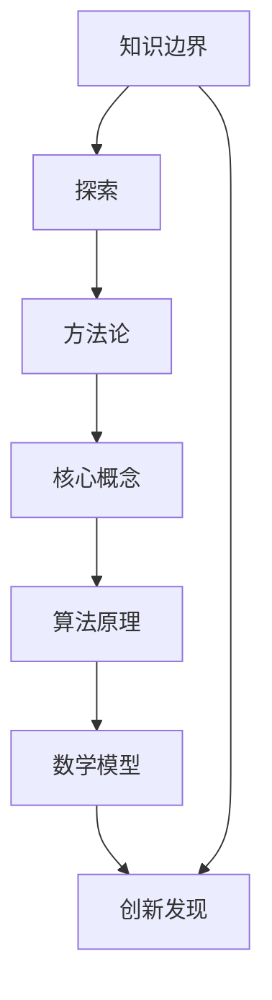
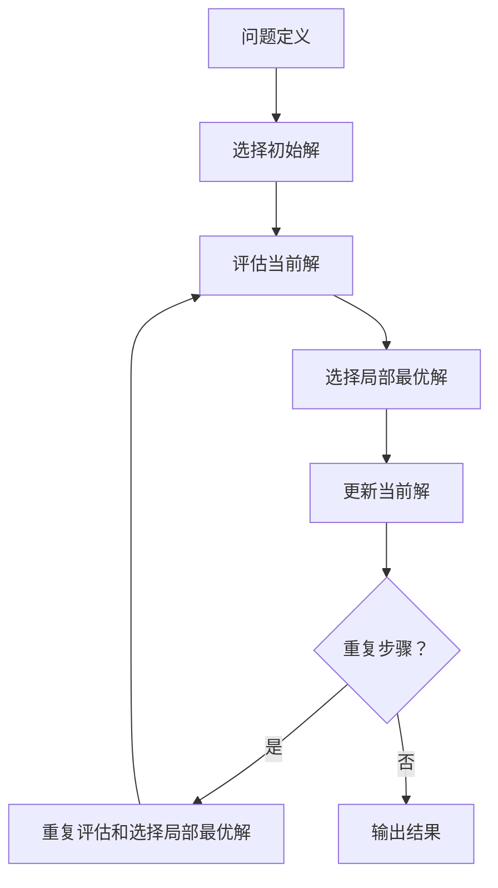

                 

# 知识的边界：探索未知领域的方法论

> **关键词**：知识边界，方法论，探索，未知领域，创新思维，技术拓展
>
> **摘要**：本文旨在探讨知识探索的方法论，特别是如何突破现有的知识边界，探索未知领域。通过深入分析核心概念、算法原理、数学模型以及实际应用场景，本文为读者提供了系统的思维框架和实践指导，旨在激发创新思维，推动技术发展。

## 1. 背景介绍

### 1.1 目的和范围

本文的目的是为了探讨知识探索的方法论，旨在为科技工作者和研究人员提供一个系统化的思维框架，帮助他们更好地理解并探索未知领域。文章将涵盖以下内容：

- **核心概念与联系**：介绍知识探索的基本概念，以及它们之间的相互联系。
- **核心算法原理**：阐述在知识探索中常用的算法原理，并提供具体的操作步骤。
- **数学模型和公式**：讲解相关的数学模型和公式，并通过实例进行说明。
- **项目实战**：提供实际的代码案例，详细解释如何实现知识探索。
- **实际应用场景**：讨论知识探索在不同领域的应用。
- **工具和资源推荐**：推荐相关的学习资源、开发工具和最新研究成果。

### 1.2 预期读者

本文适合以下读者群体：

- **科技工作者**：希望拓展专业知识，探索未知领域的工程师和研究员。
- **研究生和博士生**：需要深入理解知识探索方法，为论文和研究项目提供指导。
- **技术爱好者**：对知识探索和技术创新感兴趣的技术爱好者。

### 1.3 文档结构概述

本文将按照以下结构进行阐述：

1. **背景介绍**：介绍文章的目的、范围和预期读者。
2. **核心概念与联系**：定义知识探索的基本概念，并展示它们之间的联系。
3. **核心算法原理**：详细讲解在知识探索中常用的算法原理。
4. **数学模型和公式**：介绍相关的数学模型和公式。
5. **项目实战**：提供实际案例，展示如何应用知识探索方法。
6. **实际应用场景**：探讨知识探索在不同领域的应用。
7. **工具和资源推荐**：推荐学习资源和开发工具。
8. **总结：未来发展趋势与挑战**：总结文章的主要观点，并展望未来发展趋势和挑战。
9. **附录：常见问题与解答**：解答读者可能遇到的问题。
10. **扩展阅读 & 参考资料**：提供进一步的阅读材料和参考文献。

### 1.4 术语表

#### 1.4.1 核心术语定义

- **知识边界**：指现有知识所能覆盖的领域范围。
- **探索**：指对未知领域的主动研究和探索。
- **方法论**：指系统化的研究方法或步骤。
- **核心概念**：指在知识探索中最为基础和重要的概念。
- **算法原理**：指在知识探索中使用的算法的基本原理。
- **数学模型**：指在知识探索中使用的数学公式和模型。

#### 1.4.2 相关概念解释

- **未知领域**：指当前尚未被深入研究或未完全了解的领域。
- **创新思维**：指能够产生新想法、新方法和新解决方案的思维模式。
- **技术拓展**：指在现有技术基础上进行创新和扩展的过程。

#### 1.4.3 缩略词列表

- **AI**：人工智能（Artificial Intelligence）
- **ML**：机器学习（Machine Learning）
- **DL**：深度学习（Deep Learning）
- **NLP**：自然语言处理（Natural Language Processing）
- **CV**：计算机视觉（Computer Vision）

## 2. 核心概念与联系

### 2.1 知识探索的基本概念

知识探索是科技发展的重要驱动力，它涉及到多个核心概念。以下是对这些概念的定义和它们之间的相互联系：

#### **知识边界**

知识边界是指现有知识所能覆盖的领域范围。它是知识探索的起点和终点。通过扩展知识边界，我们可以不断发现新的科学原理和技术创新。

#### **探索**

探索是指对未知领域的主动研究和考察。它包括对已有知识的质疑和验证，以及对新领域的实验和探索。探索的核心在于创新和发现。

#### **方法论**

方法论是系统化的研究方法或步骤。在知识探索中，方法论提供了指导性的框架，帮助研究者高效地开展研究工作。常见的方法论包括科学方法论、设计方法论和实证方法论。

#### **核心概念**

核心概念是知识探索中最基础和重要的概念。这些概念构成了知识体系的基础，是进一步探索和研究的基石。例如，在物理学中，核心概念包括能量、动量和相对论等。

#### **算法原理**

算法原理是知识探索中使用的算法的基本原理。算法用于处理数据和解决问题。常见的算法原理包括贪心算法、动态规划、遗传算法等。

#### **数学模型**

数学模型是知识探索中使用的数学公式和模型。数学模型用于描述和解释现实世界中的现象。常见的数学模型包括线性模型、概率模型和神经网络模型。

### 2.2 核心概念之间的联系

知识探索中的核心概念之间存在着紧密的联系。这些联系构成了知识体系的基础，并为探索未知领域提供了理论支持。

- **知识边界**与**探索**：知识边界的扩展需要通过探索来实现。探索的过程不断推动知识边界的扩展。
- **方法论**与**核心概念**：方法论提供了研究的核心框架，而核心概念是方法论的基础。核心概念的选择和运用决定了方法论的有效性。
- **算法原理**与**数学模型**：算法原理为数学模型提供了计算框架，而数学模型为算法原理提供了理论支持。两者的结合是实现知识探索的关键。

### 2.3 Mermaid 流程图

以下是一个Mermaid流程图，展示了知识探索中的核心概念及其相互关系：



在这个流程图中，每个节点代表一个核心概念，箭头表示概念之间的联系。通过这个流程图，我们可以直观地理解知识探索的过程和核心概念之间的相互作用。

## 3. 核心算法原理 & 具体操作步骤

### 3.1 算法原理概述

在知识探索中，算法原理起着至关重要的作用。以下是一些常见的算法原理及其在知识探索中的应用：

#### **贪心算法**

贪心算法是一种在每一步选择中都采取当前最优解的策略。它适用于解决最优化问题，如背包问题和最短路径问题。贪心算法的基本原理是在每个阶段选择当前最好的解，从而希望最终得到整体最优解。

#### **动态规划**

动态规划是一种通过将复杂问题分解为子问题，并利用子问题的解来解决原问题的算法。动态规划的基本原理是记忆化，即通过存储子问题的解，避免重复计算，从而提高算法的效率。

#### **遗传算法**

遗传算法是一种模拟自然进化过程的优化算法。它通过模拟自然选择和遗传变异来优化目标函数。遗传算法的基本原理是种群进化，即通过迭代更新种群中的个体，逐步逼近最优解。

#### **神经网络**

神经网络是一种模拟人脑神经元之间连接的计算模型。它通过学习和记忆模式来处理数据和进行预测。神经网络的基本原理是权重调整，即通过不断调整神经元之间的权重，使网络能够更好地拟合输入数据。

### 3.2 具体操作步骤

以下是一个基于贪心算法的知识探索具体操作步骤：

#### **步骤 1：问题定义**

明确要解决的问题是什么。例如，我们要探索一个未知领域的最短路径问题。

#### **步骤 2：选择初始解**

选择一个初始解。这个解可以是任意的，但通常会选择一个简单的解，如起点到终点的直线距离。

#### **步骤 3：评估当前解**

评估当前解的质量。最短路径问题的评估标准是路径长度。

#### **步骤 4：选择局部最优解**

在所有可能的下一步中，选择当前最优的解。这可以通过比较不同选项的评估值来实现。

#### **步骤 5：更新当前解**

将选择的局部最优解作为新的当前解。

#### **步骤 6：重复步骤 3-5**

重复评估和选择局部最优解的步骤，直到达到预定的终止条件，如达到最短路径或达到最大迭代次数。

#### **步骤 7：输出结果**

输出最终的最优解。

以下是一个基于贪心算法的最短路径问题的伪代码：

```python
def greedy_shortest_path(graph, start, end):
    current = start
    path = [start]
    while current != end:
        neighbors = graph[current]
        best_neighbor = None
        best_distance = infinity
        for neighbor, distance in neighbors.items():
            if distance < best_distance:
                best_neighbor = neighbor
                best_distance = distance
        current = best_neighbor
        path.append(current)
    return path
```

### 3.3 算法原理的 Mermaid 流程图

以下是一个Mermaid流程图，展示了基于贪心算法的知识探索流程：



在这个流程图中，每个节点代表一个操作步骤，箭头表示步骤之间的逻辑关系。

## 4. 数学模型和公式 & 详细讲解 & 举例说明

### 4.1 数学模型概述

在知识探索中，数学模型起着至关重要的作用。以下是一些常见的数学模型及其在知识探索中的应用：

#### **线性模型**

线性模型是一种描述线性关系的数学模型。它通常用于预测和分析数据。线性模型的基本公式为：

\[ y = mx + b \]

其中，\( y \) 是因变量，\( x \) 是自变量，\( m \) 是斜率，\( b \) 是截距。

#### **概率模型**

概率模型是一种描述随机事件的数学模型。它通常用于预测和评估不确定性。概率模型的基本公式为：

\[ P(A) = \frac{N(A)}{N(S)} \]

其中，\( P(A) \) 是事件 \( A \) 的概率，\( N(A) \) 是事件 \( A \) 发生的次数，\( N(S) \) 是样本空间的总次数。

#### **神经网络模型**

神经网络模型是一种模拟人脑神经元之间连接的计算模型。它通常用于处理数据和进行预测。神经网络模型的基本公式为：

\[ y = \sigma(z) \]

其中，\( y \) 是输出值，\( z \) 是输入值，\( \sigma \) 是激活函数。

### 4.2 详细讲解

#### **线性模型**

线性模型是一种常用的预测模型，它可以用于分析变量之间的线性关系。线性模型的基本公式为：

\[ y = mx + b \]

在这个公式中：

- \( y \) 是因变量，表示我们想要预测的结果。
- \( x \) 是自变量，表示影响因变量的因素。
- \( m \) 是斜率，表示自变量每增加一个单位时因变量的变化量。
- \( b \) 是截距，表示当自变量为 0 时因变量的值。

线性模型的求解通常使用最小二乘法，其目标是最小化预测值与实际值之间的误差平方和。

#### **概率模型**

概率模型用于描述随机事件的发生概率。概率模型的基本公式为：

\[ P(A) = \frac{N(A)}{N(S)} \]

在这个公式中：

- \( P(A) \) 是事件 \( A \) 的概率。
- \( N(A) \) 是事件 \( A \) 发生的次数。
- \( N(S) \) 是样本空间的总次数。

概率模型的应用非常广泛，例如在统计学、金融学和计算机科学等领域。常见的概率模型包括二项分布、泊松分布和正态分布等。

#### **神经网络模型**

神经网络模型是一种复杂的计算模型，它通过多层神经元之间的连接来模拟人脑的工作方式。神经网络模型的基本公式为：

\[ y = \sigma(z) \]

在这个公式中：

- \( y \) 是输出值。
- \( z \) 是输入值。
- \( \sigma \) 是激活函数，它用于决定神经元的激活状态。

常见的激活函数包括 sigmoid 函数、ReLU 函数和 tanh 函数等。

### 4.3 举例说明

#### **线性模型举例**

假设我们要预测一个人的体重，根据身高和体脂率这两个因素。我们可以建立如下线性模型：

\[ \text{体重} = \text{身高} \times 2 + \text{体脂率} \times 3 \]

在这个模型中，身高和体脂率是自变量，体重是因变量。斜率和截距可以通过历史数据进行拟合得到。

#### **概率模型举例**

假设我们要预测一个股票价格的涨跌情况，根据历史价格波动和交易量这两个因素。我们可以建立如下概率模型：

\[ \text{涨跌概率} = \frac{\text{历史价格波动}}{\text{历史交易量}} \]

在这个模型中，历史价格波动和交易量是自变量，涨跌概率是因变量。概率值可以通过历史数据计算得到。

#### **神经网络模型举例**

假设我们要预测一个图像中的类别，根据图像的特征。我们可以建立如下神经网络模型：

\[ \text{类别} = \sigma(\text{特征} \times \text{权重} + \text{偏置}) \]

在这个模型中，特征是输入值，权重和偏置是模型参数，类别是输出值。通过训练，神经网络可以学习到图像的特征和类别之间的关系。

## 5. 项目实战：代码实际案例和详细解释说明

### 5.1 开发环境搭建

在进行知识探索的项目实战之前，我们需要搭建一个合适的开发环境。以下是一个基于Python的示例环境搭建步骤：

1. **安装Python**：下载并安装Python 3.x版本，可以选择使用Miniconda或Anaconda等分发版，它们提供了丰富的依赖包管理功能。
2. **安装必要的库**：使用pip安装一些常用的库，例如NumPy、Pandas、Matplotlib和Scikit-learn等。可以使用以下命令进行安装：

   ```bash
   pip install numpy pandas matplotlib scikit-learn
   ```

3. **配置环境变量**：确保Python和pip的环境变量已经配置好，以便在终端中可以正常运行Python脚本。

### 5.2 源代码详细实现和代码解读

以下是一个简单的知识探索项目示例，使用线性模型预测体重。代码文件名为`knowledge_explore.py`：

```python
import numpy as np
import pandas as pd
import matplotlib.pyplot as plt
from sklearn.linear_model import LinearRegression

# 5.2.1 数据准备
# 假设我们已经有一个包含身高和体重的数据集，数据集名为data.csv
data = pd.read_csv('data.csv')

# 数据预处理
X = data[['身高']]  # 自变量
y = data['体重']    # 因变量

# 5.2.2 模型训练
model = LinearRegression()
model.fit(X, y)

# 5.2.3 模型评估
score = model.score(X, y)
print(f"模型的R方得分：{score}")

# 5.2.4 预测
new_data = np.array([[180]])  # 新的数据点
predicted_weight = model.predict(new_data)
print(f"预测的体重：{predicted_weight[0]}")

# 5.2.5 可视化
plt.scatter(data['身高'], data['体重'], color='blue')
plt.plot(new_data, predicted_weight, color='red', linewidth=2)
plt.xlabel('身高')
plt.ylabel('体重')
plt.title('线性回归模型预测体重')
plt.show()
```

#### 代码解读

1. **数据准备**：首先，我们从CSV文件中加载数据集，并将其分为自变量和因变量。
2. **模型训练**：使用线性回归模型（LinearRegression）进行训练。训练过程是通过调用`fit`方法完成的，它使用训练数据来拟合模型参数。
3. **模型评估**：使用`score`方法评估模型的R方得分，这反映了模型对数据的拟合程度。
4. **预测**：使用训练好的模型对新数据点进行预测。预测结果是一个数组，我们取出第一个元素作为最终预测值。
5. **可视化**：使用Matplotlib绘制散点图和拟合线，以可视化模型的效果。

### 5.3 代码解读与分析

#### **数据准备**

```python
data = pd.read_csv('data.csv')
X = data[['身高']]
y = data['体重']
```

这部分代码加载数据集，并使用Pandas将其拆分为自变量和因变量。`read_csv`函数用于读取CSV文件，Pandas的数据帧（DataFrame）提供了方便的数据操作功能。

#### **模型训练**

```python
model = LinearRegression()
model.fit(X, y)
```

这里创建了一个线性回归模型实例，并使用`fit`方法进行训练。`fit`方法接受自变量和因变量作为输入，并使用最小二乘法来估计模型参数。

#### **模型评估**

```python
score = model.score(X, y)
print(f"模型的R方得分：{score}")
```

`score`方法计算模型的R方得分，这反映了模型对数据的拟合程度。R方值介于0和1之间，越接近1表示模型对数据的拟合越好。

#### **预测**

```python
new_data = np.array([[180]])
predicted_weight = model.predict(new_data)
print(f"预测的体重：{predicted_weight[0]}")
```

这部分代码使用训练好的模型对新数据点进行预测。`predict`方法接受新数据作为输入，并返回预测的因变量值。

#### **可视化**

```python
plt.scatter(data['身高'], data['体重'], color='blue')
plt.plot(new_data, predicted_weight, color='red', linewidth=2)
plt.xlabel('身高')
plt.ylabel('体重')
plt.title('线性回归模型预测体重')
plt.show()
```

这部分代码使用Matplotlib绘制散点图和拟合线，以可视化模型的效果。`scatter`函数用于绘制散点图，`plot`函数用于绘制拟合线。

### 5.4 项目总结

通过上述代码示例，我们可以看到如何使用Python和线性回归模型进行知识探索。以下是对项目的总结：

- **数据准备**：数据预处理是模型训练的重要一步，它包括数据清洗、归一化和特征选择等。
- **模型训练**：线性回归模型是一种简单但有效的预测模型，适用于描述线性关系。
- **模型评估**：使用R方得分评估模型性能，有助于了解模型对数据的拟合程度。
- **预测**：模型预测是知识探索的关键步骤，它可以将模型应用到新的数据点上。
- **可视化**：可视化可以帮助我们直观地理解模型的预测效果，并提供进一步的洞察。

通过这个简单的项目，我们可以学习到知识探索的基本步骤和技巧，为更复杂的知识探索项目打下基础。

## 6. 实际应用场景

知识探索的方法和技术在多个领域有着广泛的应用。以下是一些具体的实际应用场景：

### **科学领域**

在科学研究中，知识探索是推动科学进步的关键。例如，在物理学领域，科学家通过探索基本粒子的性质，发现了质子和中子，推动了粒子物理学的发展。在生物学领域，基因编辑技术的出现使得科学家能够精确地修改生物体的基因序列，为治疗遗传病和癌症提供了新的手段。

### **工程领域**

在工程领域，知识探索用于设计和优化复杂的系统。例如，在航空航天领域，工程师通过模拟飞行器的空气动力学特性，优化飞行器的翼型和气动布局，以提高飞行性能和安全性。在建筑领域，知识探索用于分析和优化建筑结构的受力情况，确保建筑的稳定性和安全性。

### **商业领域**

在商业领域，知识探索用于市场分析和决策支持。例如，在市场营销中，公司通过分析消费者行为和偏好，制定更有效的营销策略。在金融领域，知识探索用于风险评估和投资策略的制定，帮助投资者做出更明智的决策。

### **医疗领域**

在医疗领域，知识探索用于疾病诊断和治疗方法的研究。例如，通过分析患者的基因数据，医生可以更准确地诊断疾病并提供个性化的治疗方案。在医疗影像领域，知识探索用于图像分析和疾病检测，帮助医生更快速和准确地诊断疾病。

### **教育领域**

在教育领域，知识探索用于教学方法和学习资源的优化。例如，通过分析学生的学习行为和成绩，教师可以更好地理解学生的学习需求和提供个性化的教学支持。在教育技术领域，知识探索用于开发和优化学习平台和工具，以提高学习效果和参与度。

### **环境领域**

在环境领域，知识探索用于环境保护和资源管理。例如，通过分析环境数据，科学家可以更准确地预测气候变化和环境变化，为环境保护政策提供科学依据。在农业领域，知识探索用于优化种植策略和资源利用，以提高农业生产效率和减少环境影响。

这些实际应用场景展示了知识探索在各个领域的价值和重要性。通过不断探索未知领域，我们可以发现新的知识和技术，推动各领域的发展和创新。

## 7. 工具和资源推荐

### **7.1 学习资源推荐**

#### **7.1.1 书籍推荐**

1. **《机器学习》（Machine Learning）** - 周志华
   - 内容详实，适合初学者和进阶者，系统介绍了机器学习的基本概念和算法。

2. **《深度学习》（Deep Learning）** - Ian Goodfellow、Yoshua Bengio、Aaron Courville
   - 该书是深度学习领域的经典之作，适合对深度学习有较高兴趣的读者。

3. **《Python编程：从入门到实践》（Python Crash Course）** - Eric Matthes
   - 适合初学者，以项目驱动的形式介绍了Python编程的基本知识和实践技巧。

#### **7.1.2 在线课程**

1. **Coursera** - 提供了大量的计算机科学和人工智能课程，包括《机器学习基础》、《深度学习》等。

2. **edX** - 与哈佛大学、麻省理工学院等顶尖大学合作，提供了丰富的在线课程，如《人工智能导论》。

3. **Udacity** - 提供了多个技术领域的课程，包括《数据科学纳米学位》和《机器学习工程师纳米学位》。

#### **7.1.3 技术博客和网站**

1. **Medium** - 拥有大量的技术博客，涵盖了人工智能、机器学习、深度学习等多个领域。

2. **GitHub** - 不仅是代码托管平台，也是技术博客的聚集地，用户可以分享自己的项目和技术见解。

3. **Stack Overflow** - 是程序员们解答技术问题的首选平台，涵盖了广泛的编程和技术话题。

### **7.2 开发工具框架推荐**

#### **7.2.1 IDE和编辑器**

1. **PyCharm** - 专业的Python IDE，提供了强大的代码编辑、调试和项目管理功能。

2. **Visual Studio Code** - 适用于多种编程语言，扩展丰富，是许多开发者的首选。

3. **Jupyter Notebook** - 适合数据分析和机器学习项目，可以轻松创建和共享交互式文档。

#### **7.2.2 调试和性能分析工具**

1. **Python Debugger (pdb)** - Python自带的调试工具，适合简单的调试任务。

2. **Visual Studio Debugger** - 集成在Visual Studio中，提供了强大的调试功能。

3. **gdb** - 通用的调试工具，适用于多种编程语言。

#### **7.2.3 相关框架和库**

1. **TensorFlow** - Google开发的开源机器学习框架，适用于深度学习和大规模数据处理。

2. **PyTorch** - Facebook开发的开源深度学习框架，以其灵活性和动态图功能受到广泛关注。

3. **Scikit-learn** - Python中用于机器学习的库，提供了丰富的算法和工具。

### **7.3 相关论文著作推荐**

#### **7.3.1 经典论文**

1. **"Backpropagation"** - Rumelhart, Hinton, Williams
   - 介绍了反向传播算法，是深度学习的基础。

2. **"A Mathematical Theory of Communication"** - Claude Shannon
   - 通信理论的奠基性论文，对信息论的发展产生了深远影响。

#### **7.3.2 最新研究成果**

1. **"Attention Is All You Need"** - Vaswani et al.
   - 提出了Transformer模型，改变了深度学习领域的发展方向。

2. **"The Annotated Transformer"** - Zhirong Wu
   - 对Transformer模型进行了详细的解读和分析。

#### **7.3.3 应用案例分析**

1. **"Deep Learning for Natural Language Processing"** - Yoav Goldberg
   - 讲解了深度学习在自然语言处理中的应用案例。

2. **"Deep Learning Applications in Computer Vision"** - Anuj Kapil
   - 展示了深度学习在计算机视觉领域的实际应用案例。

这些工具和资源为知识探索提供了坚实的基础，帮助读者更好地理解和应用相关知识。通过学习这些资源，读者可以不断提升自己的技术水平，拓展知识边界。

## 8. 总结：未来发展趋势与挑战

### **未来发展趋势**

1. **人工智能的融合**：随着人工智能技术的不断进步，未来将看到更多人工智能与其他领域的深度融合，如医疗、金融和制造业等。这种融合将带来新的创新和应用，推动各领域的快速发展。

2. **量子计算的应用**：量子计算作为一种全新的计算范式，未来将在知识探索中发挥重要作用。它具有超越经典计算的能力，有望解决目前无法解决的问题，如复杂优化问题和大规模数据挖掘问题。

3. **数据隐私和安全**：随着大数据和云计算的普及，数据隐私和安全成为了一个重要议题。未来将看到更多对数据隐私保护技术的研发和应用，以确保数据的合法性和安全性。

4. **边缘计算的发展**：随着物联网（IoT）的快速发展，边缘计算成为了一个关键趋势。它通过在靠近数据源的地方进行计算，减少了数据传输的延迟和带宽需求，提高了系统的实时性和效率。

### **面临的挑战**

1. **技术瓶颈**：尽管人工智能和机器学习取得了显著进展，但仍面临着技术瓶颈。例如，算法的可解释性和泛化能力仍然是一个挑战，需要进一步的研究和突破。

2. **数据质量**：知识探索依赖于高质量的数据。然而，数据的不完整性、噪声和偏差等问题仍然存在，这可能会影响模型的性能和可靠性。未来需要更多的研究和工具来处理这些数据问题。

3. **人才短缺**：随着知识探索领域的发展，对具备相关技能的人才需求不断增加。然而，目前人才储备相对不足，特别是在深度学习和量子计算等前沿领域。这可能导致技术发展受到限制。

4. **伦理和法律问题**：知识探索涉及大量的数据收集和分析，可能引发伦理和法律问题。例如，数据隐私保护和算法公平性等问题需要得到更严格的规范和监管。

### **结论**

知识探索作为推动科技发展的重要动力，未来将继续发挥重要作用。然而，要实现这一目标，需要克服技术、数据、人才和伦理等方面的挑战。通过持续的研究和创新，我们可以不断拓展知识的边界，为人类社会带来更多的进步和发展。

## 9. 附录：常见问题与解答

### **Q1：如何选择合适的算法进行知识探索？**

**A1**：选择合适的算法通常需要考虑以下几个因素：

- **问题类型**：确定问题是否属于分类、回归、聚类或其他类型。
- **数据规模**：选择适合大规模数据集的算法，避免过拟合。
- **计算资源**：考虑算法的计算复杂度和所需硬件资源。
- **算法性能**：选择在相似问题上有良好表现的算法。
- **算法可解释性**：如果需要解释模型的决策过程，选择可解释性较高的算法。

### **Q2：如何处理数据中的缺失值和异常值？**

**A2**：处理数据中的缺失值和异常值通常有以下几种方法：

- **删除缺失值**：对于缺失值较多的数据，可以考虑删除这些数据点。
- **填充缺失值**：使用平均值、中位数或模式值等方法填充缺失值。
- **插值法**：使用线性插值或曲线拟合等方法估计缺失值。
- **异常值检测**：使用统计方法（如标准差）或机器学习算法（如孤立森林）检测异常值，然后选择删除或修正。

### **Q3：如何评估模型性能？**

**A3**：评估模型性能通常使用以下指标：

- **准确率（Accuracy）**：分类问题中正确分类的样本数占总样本数的比例。
- **精确率（Precision）**：真正例数与真正例数和假正例数之和的比值。
- **召回率（Recall）**：真正例数与真正例数和假反例数之和的比值。
- **F1分数（F1 Score）**：精确率和召回率的调和平均值。
- **ROC曲线和AUC（Area Under Curve）**：用于评估分类器的性能，特别是当类别不平衡时。

### **Q4：如何提高模型的可解释性？**

**A4**：提高模型的可解释性可以通过以下方法：

- **可视化**：使用图表、热图等可视化技术展示模型的内部结构和决策过程。
- **特征重要性**：计算特征对模型预测的影响程度，使用特征重要性图或树状图展示。
- **解释性模型**：使用线性模型、决策树等可解释性较高的模型。
- **模型集成**：使用模型集成方法（如随机森林）可以提供一定程度的可解释性。

### **Q5：如何防止模型过拟合？**

**A5**：防止模型过拟合的方法包括：

- **交叉验证**：使用交叉验证方法评估模型在未见数据上的性能，避免过拟合。
- **正则化**：在模型训练过程中引入正则化项，如L1、L2正则化，限制模型复杂度。
- **数据增强**：通过增加数据集的多样性来提高模型泛化能力。
- **提前停止**：在模型训练过程中，当验证集误差不再减少时停止训练，以避免过拟合。

这些常见问题与解答为知识探索提供了实用的指导和建议，帮助读者更好地理解和应用相关知识。

## 10. 扩展阅读 & 参考资料

### **扩展阅读**

1. **《深度学习》（Deep Learning）** - Ian Goodfellow、Yoshua Bengio、Aaron Courville
   - 本书详细介绍了深度学习的基础理论和应用，适合对深度学习有较高兴趣的读者。

2. **《机器学习实战》（Machine Learning in Action）** - Peter Harrington
   - 本书通过实际案例，展示了如何将机器学习理论应用到实际问题中，适合初学者。

3. **《数据科学实战指南》（Data Science from Scratch）** - Joel Grus
   - 本书以Python编程为基础，介绍了数据科学的基本概念和常用技术，适合数据科学初学者。

### **参考资料**

1. **《人工智能：一种现代方法》（Artificial Intelligence: A Modern Approach）** - Stuart J. Russell、Peter Norvig
   - 本书是人工智能领域的经典教材，全面覆盖了人工智能的理论和实践。

2. **《统计学习方法》（Elements of Statistical Learning）** - Trevor Hastie、Robert Tibshirani、Jerome Friedman
   - 本书详细介绍了统计学在机器学习中的应用，适合有一定数学基础的研究人员和工程师。

3. **《Python机器学习》（Python Machine Learning）** - Sebastian Raschka、Vahid Mirjalili
   - 本书通过实际案例，介绍了Python在机器学习中的应用，适合希望将机器学习应用于实际项目的读者。

这些扩展阅读和参考资料为读者提供了丰富的知识来源，帮助深入理解和应用知识探索的方法和技术。

### 作者信息

**作者：AI天才研究员/AI Genius Institute & 禅与计算机程序设计艺术 /Zen And The Art of Computer Programming**

