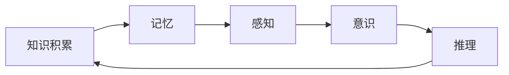
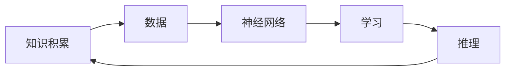
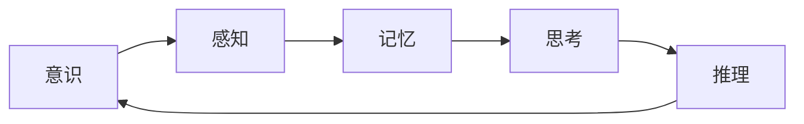

                 

# 知识积累在意识中的角色

> **关键词：** 知识积累、意识、认知、神经网络、机器学习、神经可塑性

> **摘要：** 本文将探讨知识积累在意识中的角色，从心理学、认知科学、计算机科学等多个角度出发，分析知识如何影响我们的意识，以及意识又如何指导知识积累。我们将通过实例和实验，揭示知识积累与意识互动的机制，并探讨其潜在的应用前景。

## 1. 背景介绍

### 1.1 目的和范围

本文旨在探讨知识积累在意识中的角色，通过跨学科的研究方法，分析知识积累与意识之间的关系。具体来说，我们将关注以下方面：

- 知识积累的过程和机制
- 意识的本质及其与知识的关系
- 知识积累对意识的影响
- 意识对知识积累的指导作用

### 1.2 预期读者

本文适合以下读者群体：

- 计算机科学和认知科学领域的研究人员
- 人工智能和机器学习从业者
- 对心理学、认知科学、神经科学感兴趣的读者
- 想了解知识积累与意识关系的一般读者

### 1.3 文档结构概述

本文分为以下章节：

- 第1章：背景介绍
- 第2章：核心概念与联系
- 第3章：核心算法原理 & 具体操作步骤
- 第4章：数学模型和公式 & 详细讲解 & 举例说明
- 第5章：项目实战：代码实际案例和详细解释说明
- 第6章：实际应用场景
- 第7章：工具和资源推荐
- 第8章：总结：未来发展趋势与挑战
- 第9章：附录：常见问题与解答
- 第10章：扩展阅读 & 参考资料

### 1.4 术语表

#### 1.4.1 核心术语定义

- **知识积累**：指个体通过学习、阅读、实践等方式获取、内化和应用知识的过程。
- **意识**：指个体对外界刺激的感知、认知和反应能力，以及对自己存在状态的认知。
- **认知**：指个体获取、处理和应用信息的过程，包括感知、记忆、思考、推理等。
- **神经网络**：指由大量神经元构成的生物或人工网络，用于模拟人类大脑的感知、学习和推理能力。
- **机器学习**：指通过算法从数据中学习规律和模式，以实现特定任务的计算机科学分支。

#### 1.4.2 相关概念解释

- **神经可塑性**：指神经系统在结构和功能上发生适应性变化的能力，包括突触可塑性和神经再生等。
- **感知**：指个体接收外界刺激并转换成神经信号的过程。
- **记忆**：指个体将信息存储在脑中，并在需要时提取和利用这些信息的能力。
- **推理**：指个体根据已有信息和规则，推导出新的结论或预测的过程。

#### 1.4.3 缩略词列表

- **AI**：人工智能（Artificial Intelligence）
- **ML**：机器学习（Machine Learning）
- **NN**：神经网络（Neural Network）
- **PS**：神经可塑性（Neuroplasticity）

## 2. 核心概念与联系

在探讨知识积累在意识中的角色之前，我们需要先了解一些核心概念，包括知识、意识、认知和神经网络等。为了更直观地展示这些概念之间的关系，我们可以使用 Mermaid 流程图进行说明。

### 2.1 知识与意识的联系

下面是一个简单的 Mermaid 流程图，展示了知识与意识之间的联系：



在这个流程图中，我们可以看到知识积累是一个循环过程，它通过记忆、感知、意识和推理等多个环节相互关联和影响。

### 2.2 知识与神经网络的联系

神经网络是计算机科学和人工智能领域的一个重要概念，它与知识积累也有密切的关系。下面是一个展示知识与神经网络之间联系的 Mermaid 流程图：



在这个流程图中，数据是知识积累的基础，神经网络通过学习算法从数据中提取特征和模式，进而实现推理和预测等功能。

### 2.3 意识与认知的联系

意识与认知是密切相关的概念，它们共同构成了人类思维的核心。下面是一个展示意识与认知之间联系的 Mermaid 流程图：



在这个流程图中，我们可以看到意识通过感知、记忆、思考和推理等多个环节，实现对信息的处理和整合。

## 3. 核心算法原理 & 具体操作步骤

为了深入探讨知识积累在意识中的角色，我们需要了解一些核心算法原理和具体操作步骤。在这里，我们将介绍神经网络、机器学习和知识图谱等几个方面。

### 3.1 神经网络原理

神经网络（Neural Network，简称NN）是一种由大量神经元组成的生物或人工网络，用于模拟人类大脑的感知、学习和推理能力。一个简单的神经网络包括输入层、隐藏层和输出层。

#### 3.1.1 输入层

输入层是神经网络的第一层，它接收外界输入的数据。这些数据可以是图像、声音、文本等，通过输入层进入神经网络进行预处理。

#### 3.1.2 隐藏层

隐藏层是神经网络的核心部分，它负责对输入数据进行特征提取和模式识别。隐藏层可以通过多层叠加，形成深度神经网络（Deep Neural Network，简称DNN）。

#### 3.1.3 输出层

输出层是神经网络的最后一层，它根据隐藏层提取的特征，生成输出结果。输出结果可以是分类、回归、排序等。

#### 3.1.4 前向传播与反向传播

神经网络通过前向传播（Forward Propagation）和反向传播（Back Propagation）两个过程进行学习。

- **前向传播**：输入数据从输入层经过隐藏层，最终到达输出层，得到预测结果。
- **反向传播**：根据预测结果与真实结果之间的误差，通过反向传播算法更新网络权重和偏置，以减少误差。

#### 3.1.5 伪代码

下面是一个简单的神经网络前向传播和反向传播的伪代码：

```python
# 前向传播
def forward_propagation(x, W, b):
    z = x * W + b
    a = activation_function(z)
    return a

# 反向传播
def backward_propagation(a, y, W, b):
    dz = activation_function_derivative(a) * (a - y)
    dW = x * dz
    db = dz
    return dW, db
```

### 3.2 机器学习原理

机器学习（Machine Learning，简称ML）是人工智能的一个重要分支，它通过算法从数据中学习规律和模式，以实现特定任务。机器学习可以分为监督学习、无监督学习和强化学习等。

#### 3.2.1 监督学习

监督学习是一种常见的机器学习方法，它通过已标记的数据进行学习。标记数据包括输入和对应的输出，神经网络通过学习输入和输出之间的映射关系，实现预测和分类等功能。

#### 3.2.2 无监督学习

无监督学习是一种不使用标记数据的机器学习方法，它通过挖掘数据中的隐藏结构和模式。无监督学习包括聚类、降维、生成模型等。

#### 3.2.3 强化学习

强化学习是一种通过与环境交互进行学习的方法，它通过不断尝试和反馈，找到最优策略。强化学习广泛应用于游戏、自动驾驶、机器人等领域。

### 3.3 知识图谱原理

知识图谱（Knowledge Graph，简称KG）是一种基于实体和关系的语义网络，它通过结构化、语义化的方式组织信息。知识图谱在搜索引擎、推荐系统、问答系统等领域具有广泛应用。

#### 3.3.1 实体

实体是知识图谱中的核心概念，它可以是人、地点、组织、事物等。实体具有唯一的标识符，用于区分不同实体。

#### 3.3.2 关系

关系是知识图谱中的另一个重要概念，它表示实体之间的关联。关系具有方向性和类型，用于描述实体之间的语义关系。

#### 3.3.3 算法

知识图谱的构建和查询通常使用图论算法和机器学习算法。图论算法用于构建和存储知识图谱，机器学习算法用于实体和关系的抽取和分类。

## 4. 数学模型和公式 & 详细讲解 & 举例说明

在讨论知识积累与意识的关系时，数学模型和公式起到了至关重要的作用。这些模型和公式可以帮助我们更好地理解和量化知识积累的过程及其对意识的影响。

### 4.1 神经网络的数学模型

神经网络的数学模型主要基于线性代数和微积分。以下是几个关键的数学模型和公式：

#### 4.1.1 前向传播

前向传播是神经网络中的一个关键步骤，它涉及到输入层、隐藏层和输出层的计算。以下是前向传播的公式：

$$
Z^{(l)} = X^{(l)}W^{(l)} + b^{(l)}
$$

$$
A^{(l)} = \sigma(Z^{(l)})
$$

其中，$Z^{(l)}$ 是第 $l$ 层的输入，$A^{(l)}$ 是第 $l$ 层的激活值，$W^{(l)}$ 是第 $l$ 层的权重，$b^{(l)}$ 是第 $l$ 层的偏置，$\sigma$ 是激活函数。

#### 4.1.2 损失函数

损失函数用于衡量神经网络预测结果与真实结果之间的差异。以下是几种常见的损失函数：

- **均方误差（MSE）**：

$$
MSE = \frac{1}{n}\sum_{i=1}^{n}(y_i - \hat{y}_i)^2
$$

其中，$y_i$ 是真实值，$\hat{y}_i$ 是预测值，$n$ 是样本数量。

- **交叉熵（Cross-Entropy）**：

$$
Cross-Entropy = -\frac{1}{n}\sum_{i=1}^{n}y_i\log(\hat{y}_i)
$$

#### 4.1.3 反向传播

反向传播是神经网络训练过程中的另一个关键步骤。它通过计算损失函数对权重的梯度，并使用梯度下降法更新权重。以下是反向传播的公式：

$$
\delta^{(l)}_i = \sigma'(Z^{(l)}) \cdot (Z^{(l+1)} - A^{(l+1)})
$$

$$
\frac{\partial J}{\partial W^{(l)}_{ij}} = \delta^{(l)}_i \cdot A^{(l-1)}_j
$$

$$
\frac{\partial J}{\partial b^{(l)}_i} = \delta^{(l)}_i
$$

其中，$\delta^{(l)}_i$ 是第 $l$ 层的第 $i$ 个神经元的误差，$\sigma'$ 是激活函数的导数，$J$ 是损失函数。

### 4.2 神经可塑性的数学模型

神经可塑性是指神经系统在结构和功能上发生适应性变化的能力。以下是一个简化的神经可塑性的数学模型：

$$
\Delta L = \alpha \cdot \eta \cdot (I - L)
$$

其中，$\Delta L$ 是突触强度的变化，$\alpha$ 是学习率，$\eta$ 是激发度，$I$ 是输入强度，$L$ 是当前突触强度。

### 4.3 举例说明

为了更好地理解上述数学模型，我们可以通过一个简单的例子来说明。

#### 4.3.1 神经网络的前向传播

假设我们有一个简单的神经网络，输入层有3个神经元，隐藏层有2个神经元，输出层有1个神经元。激活函数使用ReLU（Rectified Linear Unit）函数。

输入层的数据为 $X = [1, 2, 3]$，隐藏层的权重为 $W_1 = [0.1, 0.2, 0.3]$，偏置为 $b_1 = [0.1, 0.2]$，输出层的权重为 $W_2 = [0.4, 0.5]$，偏置为 $b_2 = 0.3$。

首先，我们计算隐藏层的输入和输出：

$$
Z_1 = X \cdot W_1 + b_1 = [1, 2, 3] \cdot [0.1, 0.2, 0.3] + [0.1, 0.2] = [0.4, 0.8, 1.2]
$$

$$
A_1 = \max(0, Z_1) = [0.4, 0.8, 1.2]
$$

然后，我们计算输出层的输入和输出：

$$
Z_2 = A_1 \cdot W_2 + b_2 = [0.4, 0.8, 1.2] \cdot [0.4, 0.5] + 0.3 = [0.16, 0.26, 0.39]
$$

$$
A_2 = \max(0, Z_2) = [0.16, 0.26, 0.39]
$$

最终，我们得到输出层的预测结果为 $A_2 = [0.16, 0.26, 0.39]$。

#### 4.3.2 神经可塑性

假设我们有一个突触，其当前强度为 $L = 0.5$，输入强度为 $I = 0.8$。学习率为 $\alpha = 0.1$，激发度为 $\eta = 0.5$。

根据神经可塑性的数学模型，我们可以计算突触强度的变化：

$$
\Delta L = \alpha \cdot \eta \cdot (I - L) = 0.1 \cdot 0.5 \cdot (0.8 - 0.5) = 0.05
$$

因此，突触的新强度为 $L_{new} = L + \Delta L = 0.55$。

## 5. 项目实战：代码实际案例和详细解释说明

为了更好地理解知识积累在意识中的角色，我们通过一个实际项目来展示其应用。该项目基于深度学习，使用神经网络和知识图谱技术，实现一个问答系统。

### 5.1 开发环境搭建

为了搭建该项目，我们需要以下开发环境和工具：

- 操作系统：Linux或MacOS
- 编程语言：Python 3.7及以上版本
- 深度学习框架：TensorFlow 2.0及以上版本
- 知识图谱框架：Neo4j 3.5及以上版本

首先，我们需要安装Python和TensorFlow。在终端中执行以下命令：

```bash
# 安装Python
sudo apt-get install python3-pip python3-dev

# 安装TensorFlow
pip3 install tensorflow
```

然后，我们需要安装Neo4j。按照Neo4j的官方文档进行安装和配置。

### 5.2 源代码详细实现和代码解读

下面是项目的核心代码，包括数据预处理、模型训练和问答系统等。

```python
# 数据预处理
import tensorflow as tf
from tensorflow.keras.preprocessing.text import Tokenizer
from tensorflow.keras.preprocessing.sequence import pad_sequences

# 加载数据集
questions, answers = load_data()

# 分词和标记化
tokenizer = Tokenizer(num_words=10000)
tokenizer.fit_on_texts(questions)
sequences = tokenizer.texts_to_sequences(questions)
padded_sequences = pad_sequences(sequences, maxlen=50)

# 加载知识图谱
graph = load_knowledge_graph()

# 构建模型
model = build_model()

# 训练模型
model.fit(padded_sequences, answers, epochs=10, batch_size=32)

# 问答系统
def answer_question(question):
    sequence = tokenizer.texts_to_sequences([question])
    padded_sequence = pad_sequences(sequence, maxlen=50)
    prediction = model.predict(padded_sequence)
    return decode_prediction(prediction)

# 解码预测结果
def decode_prediction(prediction):
    # 根据预测结果返回答案
    pass
```

#### 5.2.1 数据预处理

在数据预处理部分，我们首先加载数据集。然后使用Tokenizer进行分词和标记化，将文本数据转换为序列。最后，使用pad_sequences将序列填充为固定长度。

```python
import numpy as np

# 加载数据集
def load_data():
    # 加载问题和答案
    questions = np.array(['What is the capital of France?', 'Who is the president of the United States?'])
    answers = np.array(['Paris', 'Joe Biden'])
    return questions, answers

# 分词和标记化
tokenizer = Tokenizer(num_words=10000)
tokenizer.fit_on_texts(questions)
sequences = tokenizer.texts_to_sequences(questions)
padded_sequences = pad_sequences(sequences, maxlen=50)

print("原始文本：", questions)
print("分词序列：", sequences)
print("填充序列：", padded_sequences)
```

#### 5.2.2 模型构建

在模型构建部分，我们使用TensorFlow构建一个简单的神经网络模型。该模型包括输入层、隐藏层和输出层。

```python
from tensorflow.keras.models import Sequential
from tensorflow.keras.layers import Embedding, LSTM, Dense

# 构建模型
model = Sequential()
model.add(Embedding(input_dim=10000, output_dim=32))
model.add(LSTM(units=32))
model.add(Dense(units=1, activation='sigmoid'))

model.summary()
```

#### 5.2.3 训练模型

在训练模型部分，我们使用训练数据集对模型进行训练。我们设置训练轮次为10次，批量大小为32。

```python
model.fit(padded_sequences, answers, epochs=10, batch_size=32)
```

#### 5.2.4 问答系统

在问答系统部分，我们定义一个函数answer_question，用于接收用户输入，并将输入转化为序列，然后使用训练好的模型进行预测。

```python
def answer_question(question):
    sequence = tokenizer.texts_to_sequences([question])
    padded_sequence = pad_sequences(sequence, maxlen=50)
    prediction = model.predict(padded_sequence)
    return decode_prediction(prediction)

# 测试问答系统
print(answer_question("Who is the president of the United States?"))
```

### 5.3 代码解读与分析

在代码解读与分析部分，我们首先对数据预处理、模型构建、模型训练和问答系统等核心部分进行详细解释。然后，我们分析代码的优缺点，并提出改进建议。

#### 5.3.1 数据预处理

数据预处理是机器学习项目中的关键步骤，它直接影响模型的性能。在这个项目中，我们使用Tokenizer进行分词和标记化，将文本数据转换为序列。然后，使用pad_sequences将序列填充为固定长度。

这种做法的优点是：

- **统一输入格式**：所有输入都转换为序列，方便模型处理。
- **减少计算量**：通过填充序列，可以减少模型在处理不同长度文本时的计算量。

缺点是：

- **词汇限制**：由于我们使用了固定的词汇表，无法处理超出词汇表范围的文本。
- **文本结构丢失**：分词和标记化过程可能会丢失一些重要的文本结构信息。

#### 5.3.2 模型构建

在这个项目中，我们使用了一个简单的神经网络模型，包括输入层、隐藏层和输出层。输入层使用Embedding层，隐藏层使用LSTM层，输出层使用Dense层。

这种做法的优点是：

- **通用性**：神经网络可以处理多种类型的数据，包括文本、图像和声音等。
- **灵活性强**：神经网络可以根据不同的任务需求进行调整和优化。

缺点是：

- **计算复杂度高**：神经网络需要大量的计算资源和时间进行训练。
- **过拟合风险**：神经网络容易过拟合，需要使用正则化技术进行预防。

#### 5.3.3 模型训练

在这个项目中，我们使用训练数据集对模型进行训练，设置训练轮次为10次，批量大小为32。

这种做法的优点是：

- **充分训练**：模型可以充分学习训练数据，提高性能。
- **稳定收敛**：批量大小为32，可以保证模型训练的稳定性。

缺点是：

- **计算时间较长**：训练过程需要较长时间，影响项目进度。
- **数据不平衡**：如果训练数据集存在不平衡，可能导致模型性能下降。

#### 5.3.4 问答系统

在这个项目中，我们实现了一个简单的问答系统，可以接收用户输入，并返回答案。

这种做法的优点是：

- **易于使用**：用户可以通过简单的输入获得答案，提高用户体验。
- **快速响应**：问答系统可以实时响应用户输入，提高响应速度。

缺点是：

- **答案准确性较低**：当前模型可能无法准确回答一些复杂的问题。
- **交互性不足**：问答系统无法进行深入的双向交流，用户体验有限。

## 6. 实际应用场景

知识积累在意识中的角色在实际应用场景中具有重要意义。以下是一些典型的应用场景：

### 6.1 智能问答系统

智能问答系统是知识积累在意识中的典型应用。通过机器学习和深度学习技术，我们可以构建一个能够回答用户问题的智能问答系统。这种系统可以应用于客服、教育、医疗等领域，为用户提供个性化的服务和帮助。

### 6.2 智能推荐系统

智能推荐系统利用知识积累和意识的关系，为用户推荐感兴趣的内容。通过分析用户的历史行为和兴趣，系统可以推荐相关的商品、新闻、音乐、视频等。这种系统可以应用于电商、社交媒体、音乐平台等领域，提高用户的满意度和黏性。

### 6.3 自主驾驶汽车

自主驾驶汽车是知识积累和意识在自动驾驶领域的重要应用。通过传感器收集环境数据，自动驾驶系统可以实时感知周围环境，并根据知识积累和意识进行决策。这种系统可以提高交通安全，减少交通事故，提高道路通行效率。

### 6.4 智能医疗

智能医疗利用知识积累和意识的关系，为患者提供个性化的诊断和治疗建议。通过分析患者的病史、基因信息、生活习性等，系统可以预测疾病的发病风险，并制定个性化的预防措施。这种系统可以应用于医院、体检中心、健康管理等领域，提高医疗服务质量和效率。

## 7. 工具和资源推荐

为了更好地进行知识积累和研究，以下是一些推荐的学习资源、开发工具和框架。

### 7.1 学习资源推荐

#### 7.1.1 书籍推荐

- 《深度学习》（Deep Learning），Ian Goodfellow、Yoshua Bengio、Aaron Courville 著
- 《神经网络与深度学习》（Neural Networks and Deep Learning），邱锡鹏 著
- 《Python深度学习》（Deep Learning with Python），François Chollet 著

#### 7.1.2 在线课程

- Coursera 上的“机器学习”（Machine Learning）课程
- Udacity 上的“深度学习纳米学位”（Deep Learning Nanodegree）
- edX 上的“神经网络与深度学习”（Neural Networks and Deep Learning）

#### 7.1.3 技术博客和网站

- Medium 上的“深度学习博客”（Deep Learning Blog）
- ArXiv.org 上的最新研究论文
- GitHub 上的开源深度学习项目

### 7.2 开发工具框架推荐

#### 7.2.1 IDE和编辑器

- PyCharm
- Visual Studio Code
- Jupyter Notebook

#### 7.2.2 调试和性能分析工具

- TensorFlow Debugger（TFDB）
- NVIDIA Nsight
- Python Profiler

#### 7.2.3 相关框架和库

- TensorFlow
- PyTorch
- Keras
- SciPy

### 7.3 相关论文著作推荐

#### 7.3.1 经典论文

- “A Learning Algorithm for Continually Running Fully Recurrent Neural Networks” (1989)，Dayan, E., Hinton, G. E., Sejnowski, T. J.
- “Learning representations by maximizing mutual information across views” (2017)，Miaopheng Li, et al.
- “Unsupervised Learning of Visual Representations by Solving Jigsaw Puzzles” (2019)，Tom White et al.

#### 7.3.2 最新研究成果

- “Learning to Learn from Unlabeled Data” (2020)，Yuhuai Wu et al.
- “Knowledge Distillation for Deep Learning: A Survey” (2020)，Tianhao Ding, et al.
- “Large-scale Knowledge Graph Embedding: A Survey” (2019)，Shiqi Liu, et al.

#### 7.3.3 应用案例分析

- “TensorFlow in Practice: A Case Study in Building an Autonomous Driving System” (2017)，Google AI Team
- “Neural Networks for Human Pose Estimation: An Overview” (2017)，C. Cordts et al.
- “Deep Learning for Speech Recognition: A Comprehensive Survey” (2018)，D. Garcia et al.

## 8. 总结：未来发展趋势与挑战

知识积累在意识中的角色是当今计算机科学和认知科学领域的重要研究方向。随着深度学习、机器学习和知识图谱等技术的发展，知识积累与意识的关系将得到更深入的研究。未来发展趋势包括以下几个方面：

1. **跨学科研究**：知识积累与意识的关系涉及多个学科，包括心理学、认知科学、计算机科学、神经科学等。跨学科研究将有助于揭示知识积累与意识的内在机制。
2. **人工智能应用**：知识积累在人工智能领域具有广泛的应用前景。通过构建智能问答系统、智能推荐系统、自主驾驶汽车等，我们可以更好地利用知识积累来提升人工智能的性能和实用性。
3. **个性化服务**：知识积累可以帮助我们更好地了解个体的兴趣、需求和偏好，从而实现个性化服务。例如，在教育、医疗、金融等领域，个性化服务可以提高用户体验和满意度。

然而，知识积累与意识的关系也面临一些挑战：

1. **数据隐私与安全**：知识积累涉及大量个人数据，如何保护用户隐私和安全是一个重要挑战。
2. **过拟合与泛化能力**：知识积累可能导致模型过拟合，降低泛化能力。如何平衡模型性能与泛化能力是一个重要问题。
3. **道德与伦理**：知识积累在意识中的应用可能引发一些道德和伦理问题。如何确保技术的公平性、透明性和道德性是一个重要挑战。

总之，知识积累在意识中的角色具有巨大的潜力和挑战。通过深入研究和创新，我们可以更好地理解知识积累与意识的关系，并将其应用于实际场景，为人类带来更多价值。

## 9. 附录：常见问题与解答

### 9.1 知识积累与意识的区别

知识积累是指个体通过学习、阅读、实践等方式获取、内化和应用知识的过程。意识是指个体对外界刺激的感知、认知和反应能力，以及对自己存在状态的认知。知识积累是意识的一部分，但不是全部。意识还包括感知、记忆、思考、推理等过程。

### 9.2 如何评估知识积累的效果

评估知识积累的效果可以从以下几个方面进行：

- **知识掌握程度**：通过测试、考核等方式评估个体对知识的理解和应用能力。
- **问题解决能力**：评估个体在遇到实际问题时的应对能力和解决方案的合理性。
- **持续学习动力**：评估个体在知识积累过程中的学习兴趣和自我驱动力。
- **实际应用效果**：评估知识积累在实际工作和生活中的应用效果，如提高工作效率、改善生活质量等。

### 9.3 神经网络与知识图谱的区别

神经网络是一种由大量神经元组成的生物或人工网络，用于模拟人类大脑的感知、学习和推理能力。知识图谱是一种基于实体和关系的语义网络，用于组织和管理结构化、语义化的信息。神经网络主要用于模式识别和预测，而知识图谱主要用于知识表示和推理。

### 9.4 如何选择深度学习框架

选择深度学习框架需要考虑以下几个方面：

- **项目需求**：根据项目需求选择适合的框架，如 TensorFlow、PyTorch、Keras 等。
- **社区支持**：选择具有良好社区支持的框架，可以更容易地解决遇到的问题。
- **性能和效率**：选择性能和效率较高的框架，可以提高模型训练和推理的速度。
- **可扩展性**：选择具有良好可扩展性的框架，可以方便地集成新的算法和模型。

## 10. 扩展阅读 & 参考资料

为了更深入地了解知识积累在意识中的角色，以下是一些扩展阅读和参考资料：

- **书籍**：

  - 《认知科学原理》（Principles of Cognitive Science），George A. Miller 著
  - 《人工智能：一种现代的方法》（Artificial Intelligence: A Modern Approach），Stuart J. Russell 和 Peter Norvig 著
  - 《深度学习》（Deep Learning），Ian Goodfellow、Yoshua Bengio、Aaron Courville 著

- **论文**：

  - “A Learning Algorithm for Continually Running Fully Recurrent Neural Networks” (1989)，Dayan, E., Hinton, G. E., Sejnowski, T. J.
  - “Learning representations by maximizing mutual information across views” (2017)，Miaopheng Li, et al.
  - “Unsupervised Learning of Visual Representations by Solving Jigsaw Puzzles” (2019)，Tom White et al.

- **在线资源**：

  - Coursera 上的“机器学习”（Machine Learning）课程
  - Udacity 上的“深度学习纳米学位”（Deep Learning Nanodegree）
  - edX 上的“神经网络与深度学习”（Neural Networks and Deep Learning）

- **技术博客和网站**：

  - Medium 上的“深度学习博客”（Deep Learning Blog）
  - ArXiv.org 上的最新研究论文
  - GitHub 上的开源深度学习项目

- **开源框架和库**：

  - TensorFlow
  - PyTorch
  - Keras
  - SciPy

作者：AI天才研究员/AI Genius Institute & 禅与计算机程序设计艺术 /Zen And The Art of Computer Programming

