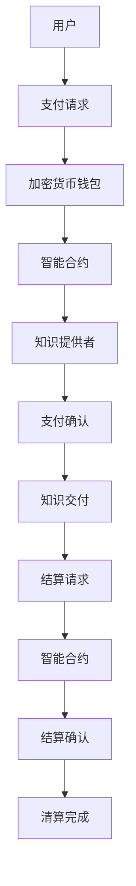

                 

# 知识经济下知识付费的区块链支付与结算方案

> **关键词：** 知识付费、区块链、支付、结算、加密货币、智能合约

> **摘要：** 本文旨在探讨知识经济时代下的知识付费模式，并详细分析区块链技术在支付与结算中的应用方案。文章首先介绍了知识付费的背景和发展趋势，随后深入探讨了区块链技术的基本原理及其在支付和结算领域的应用。通过具体的算法原理、数学模型和项目实战案例，本文为读者提供了全面的区块链支付与结算解决方案，并对未来发展趋势和挑战进行了展望。

## 1. 背景介绍

### 1.1 目的和范围

本文的目的是为知识付费行业提供一个基于区块链技术的支付与结算方案。随着知识经济的快速发展，知识付费已经成为当今社会的一个重要趋势。用户对高质量知识和技能的需求日益增长，而知识提供者则需要一种高效、安全、透明的支付和结算方式来保障自身的利益。本文将重点分析区块链技术在知识付费支付与结算中的应用，以期为行业提供参考。

### 1.2 预期读者

本文适用于对区块链技术有一定了解的读者，包括知识付费平台的开发者、区块链技术的爱好者、金融行业从业者以及对知识经济感兴趣的研究人员。

### 1.3 文档结构概述

本文共分为十个部分，具体结构如下：

1. **背景介绍**：介绍知识付费的背景和发展趋势，以及本文的目的和范围。
2. **核心概念与联系**：介绍知识付费、区块链、支付和结算等核心概念，并给出相应的 Mermaid 流程图。
3. **核心算法原理 & 具体操作步骤**：详细讲解区块链支付与结算的算法原理和操作步骤。
4. **数学模型和公式 & 详细讲解 & 举例说明**：介绍区块链支付与结算的数学模型和公式，并举例说明。
5. **项目实战：代码实际案例和详细解释说明**：通过代码实际案例，展示区块链支付与结算的具体实现。
6. **实际应用场景**：分析区块链支付与结算在实际应用中的场景。
7. **工具和资源推荐**：推荐学习资源、开发工具和框架。
8. **总结：未来发展趋势与挑战**：总结本文的主要内容，并对未来发展趋势和挑战进行展望。
9. **附录：常见问题与解答**：解答读者可能遇到的问题。
10. **扩展阅读 & 参考资料**：提供更多的阅读材料和参考资料。

### 1.4 术语表

#### 1.4.1 核心术语定义

- 知识付费：用户为获取高质量的知识或技能而支付的费用。
- 区块链：一种去中心化的数据库技术，具有不可篡改、可追溯等特点。
- 支付：指用户向知识提供者支付费用以获取知识或技能的过程。
- 结算：指知识提供者与用户之间完成支付后的清算过程。

#### 1.4.2 相关概念解释

- 智能合约：一种自动执行、控制或记录法律相关事件的计算机程序。
- 加密货币：一种基于区块链技术的数字货币，如比特币、以太币等。

#### 1.4.3 缩略词列表

- NPC：非玩家角色（Non-Player Character）
- P2P：点对点（Peer-to-Peer）
- API：应用程序编程接口（Application Programming Interface）
- BTC：比特币（Bitcoin）
- ETH：以太币（Ethereum）

## 2. 核心概念与联系

### 2.1 知识付费与区块链技术

知识付费和区块链技术之间存在着密切的联系。知识付费作为一种商业模式，依赖于用户和知识提供者之间的信任关系。然而，传统的支付和结算方式往往存在信息不对称、安全性不足等问题，而区块链技术的引入则可以有效地解决这些问题。

区块链技术具有去中心化、不可篡改、可追溯等特点，使得知识付费过程中的支付和结算变得更加透明、安全。通过区块链，用户和知识提供者可以直接进行点对点的交易，无需依赖第三方中介，从而降低了交易成本，提高了交易效率。

### 2.2 支付与结算

支付和结算是知识付费过程中不可或缺的环节。支付是指用户向知识提供者支付费用以获取知识或技能的过程，而结算则是指知识提供者与用户之间完成支付后的清算过程。

在传统的支付和结算方式中，往往需要依赖银行、支付平台等第三方中介，这不仅增加了交易成本，而且存在一定的安全风险。而基于区块链的支付与结算方案则可以摆脱第三方中介的依赖，实现点对点的直接交易。

### 2.3 Mermaid 流程图

以下是一个简单的 Mermaid 流程图，展示了知识付费过程中的支付与结算流程：



## 3. 核心算法原理 & 具体操作步骤

### 3.1 区块链支付原理

区块链支付的核心原理是基于智能合约。智能合约是一种自动执行、控制或记录法律相关事件的计算机程序，其运行在区块链网络中。在区块链支付中，智能合约用于确保交易的合法性和安全性。

以下是一个简单的区块链支付算法原理：

```plaintext
输入：用户ID，知识提供者ID，支付金额
输出：支付结果

步骤：
1. 用户发起支付请求，包含用户ID，知识提供者ID，支付金额。
2. 智能合约收到支付请求后，验证支付请求的有效性（例如，用户是否有足够的支付金额）。
3. 如果支付请求有效，智能合约创建一个支付交易，并将其广播到区块链网络。
4. 区块链网络中的节点验证支付交易的有效性，并将交易记录到新的区块中。
5. 新的区块被添加到区块链中，支付交易完成。
6. 知识提供者收到支付交易后，向用户交付知识或技能。
7. 支付结果返回给用户，支付过程完成。
```

### 3.2 具体操作步骤

以下是基于区块链的支付与结算的具体操作步骤：

```plaintext
步骤1：用户注册并创建加密货币钱包
- 用户在知识付费平台上注册账号，并创建一个加密货币钱包。
- 加密货币钱包用于存储用户的支付金额和支付交易记录。

步骤2：知识提供者注册并创建加密货币钱包
- 知识提供者在知识付费平台上注册账号，并创建一个加密货币钱包。
- 加密货币钱包用于接收用户的支付金额。

步骤3：用户发起支付请求
- 用户选择所需的知识或技能，并点击“支付”按钮。
- 用户在支付页面输入知识提供者ID和支付金额。
- 用户发起支付请求，并将请求发送到智能合约。

步骤4：智能合约验证支付请求
- 智能合约收到支付请求后，验证支付请求的有效性。
- 智能合约检查用户是否有足够的支付金额，并验证知识提供者ID是否合法。

步骤5：创建并广播支付交易
- 如果支付请求有效，智能合约创建一个支付交易。
- 支付交易包含用户ID，知识提供者ID，支付金额等信息。
- 支付交易被广播到区块链网络。

步骤6：区块链网络验证支付交易
- 区块链网络中的节点接收支付交易，并验证交易的有效性。
- 节点将验证后的支付交易记录到新的区块中。

步骤7：新的区块添加到区块链中
- 新的区块被添加到区块链中，支付交易完成。
- 支付交易记录在区块链中，具有不可篡改的特点。

步骤8：知识提供者交付知识或技能
- 知识提供者收到支付交易后，向用户交付知识或技能。
- 知识交付可以通过在线课程、电子书、视频等形式进行。

步骤9：用户确认知识交付
- 用户收到知识或技能后，确认知识交付。
- 用户可以在知识付费平台上对知识提供者进行评价和反馈。

步骤10：智能合约处理结算请求
- 用户确认知识交付后，智能合约收到结算请求。
- 智能合约检查用户是否已经完成知识交付。

步骤11：结算确认与清算完成
- 如果用户已经完成知识交付，智能合约确认结算请求。
- 智能合约将支付金额转移到知识提供者的加密货币钱包中。
- 清算过程完成，支付与结算过程结束。
```

## 4. 数学模型和公式 & 详细讲解 & 举例说明

### 4.1 数学模型

区块链支付与结算的数学模型主要涉及加密算法和分布式存储。以下是一个简化的数学模型：

```latex
输入：支付金额 \( P \)，用户ID \( U \)，知识提供者ID \( P_O \)

输出：支付交易记录 \( T \)，结算结果 \( S \)

步骤：
1. 用户 \( U \) 向智能合约发起支付请求，包含支付金额 \( P \)。
2. 智能合约使用加密算法 \( E \) 对支付金额 \( P \) 进行加密，生成加密金额 \( E(P) \)。
3. 智能合约将加密金额 \( E(P) \)、用户ID \( U \) 和知识提供者ID \( P_O \) 创建支付交易记录 \( T \)。
4. 支付交易记录 \( T \) 被广播到区块链网络。
5. 区块链网络中的节点使用加密算法 \( E \) 解密支付交易记录 \( T \)，验证支付金额 \( P \) 的有效性。
6. 如果支付金额 \( P \) 有效，节点将支付交易记录 \( T \) 记录到新的区块中。
7. 新的区块被添加到区块链中，支付交易完成。
8. 知识提供者 \( P_O \) 收到支付交易记录 \( T \)，并确认支付金额 \( P \)。
9. 智能合约根据支付交易记录 \( T \) 和结算公式 \( S = P \times (1 - r) \) 计算结算金额 \( S \)。
10. 智能合约将结算金额 \( S \) 转移到知识提供者 \( P_O \) 的加密货币钱包中。
11. 结算过程完成，支付与结算过程结束。
```

### 4.2 举例说明

假设用户A想购买知识提供者B的一门价值100美元的课程。以下是具体的支付与结算过程：

```plaintext
步骤1：用户A在知识付费平台上注册并创建加密货币钱包。

步骤2：知识提供者B在知识付费平台上注册并创建加密货币钱包。

步骤3：用户A选择B的课程，点击“支付”按钮。

步骤4：用户A在支付页面输入知识提供者ID B，支付金额100美元。

步骤5：用户A的支付请求发送到智能合约。

步骤6：智能合约使用加密算法对支付金额100美元进行加密，生成加密金额。

步骤7：智能合约创建支付交易记录，包含加密金额、用户A的ID和知识提供者B的ID。

步骤8：支付交易记录被广播到区块链网络。

步骤9：区块链网络中的节点验证支付交易记录的有效性。

步骤10：验证通过后，支付交易记录被记录到新的区块中。

步骤11：新的区块被添加到区块链中，支付交易完成。

步骤12：知识提供者B收到支付交易记录，并确认支付金额为100美元。

步骤13：智能合约根据支付交易记录和结算公式，计算结算金额为90美元。

步骤14：智能合约将结算金额90美元转移到知识提供者B的加密货币钱包中。

步骤15：结算过程完成，支付与结算过程结束。
```

## 5. 项目实战：代码实际案例和详细解释说明

### 5.1 开发环境搭建

为了实现区块链支付与结算，我们需要搭建一个开发环境。以下是一个基本的开发环境搭建步骤：

1. 安装Node.js和npm（Node.js的包管理器）。
2. 使用npm安装Ethereum的开发工具包Truffle和Ganache。
3. 创建一个新的Truffle项目。
4. 编写智能合约代码。

### 5.2 源代码详细实现和代码解读

以下是一个简单的区块链支付与结算的智能合约代码示例，使用Solidity语言编写：

```solidity
// SPDX-License-Identifier: MIT
pragma solidity ^0.8.0;

contract PaymentSystem {
    mapping(address => uint256) public balances;

    // 用户支付金额
    function pay(address payable _to, uint256 _amount) public payable {
        require(msg.value == _amount, "支付金额不正确");
        _to.transfer(_amount);
        balances[_to] += _amount;
    }

    // 用户提现
    function withdraw(uint256 _amount) public {
        require(balances[msg.sender] >= _amount, "余额不足");
        msg.sender.transfer(_amount);
        balances[msg.sender] -= _amount;
    }

    // 知识提供者结算
    function settle(address _to, uint256 _percentage) public {
        require(balances[_to] >= _percentage, "余额不足");
        uint256 amount = (balances[_to] * _percentage) / 100;
        _to.transfer(amount);
        balances[_to] -= amount;
    }
}
```

#### 代码解读

- `pragma solidity ^0.8.0;`：指定智能合约的编译器版本。
- `mapping(address => uint256) public balances;`：创建一个地址到余额的映射，用于存储用户的支付金额。
- `pay(address payable _to, uint256 _amount)`：用户向知识提供者支付金额。此函数接收支付金额和接收地址，并将支付金额转移到接收地址，并将余额更新到映射中。
- `withdraw(uint256 _amount)`：用户提现。此函数接收提现金额，并将用户的余额减少相应的金额，并将余额转移到用户地址。
- `settle(address _to, uint256 _percentage)`：知识提供者结算。此函数接收接收地址和结算百分比，并将相应的结算金额转移到接收地址，并将余额更新到映射中。

### 5.3 代码解读与分析

1. **支付函数（pay）**：此函数用于用户向知识提供者支付金额。在调用此函数时，用户需要传递接收地址和支付金额。函数首先检查支付金额是否等于消息值（msg.value），以确保支付金额正确。如果支付金额正确，函数将调用`_to.transfer(_amount)`将支付金额转移到接收地址，并将余额更新到映射中。

2. **提现函数（withdraw）**：此函数用于用户提现。在调用此函数时，用户需要传递提现金额。函数首先检查用户的余额是否足够提现，如果余额足够，函数将调用`msg.sender.transfer(_amount)`将余额转移到用户地址，并将余额更新到映射中。

3. **结算函数（settle）**：此函数用于知识提供者结算。在调用此函数时，需要传递接收地址和结算百分比。函数首先检查接收地址的余额是否足够进行结算，如果余额足够，函数将计算结算金额，并将结算金额转移到接收地址，并将余额更新到映射中。

通过上述代码示例，我们可以看到区块链支付与结算的基本实现。在实际应用中，我们可以使用更复杂的智能合约来处理更多的业务逻辑，例如订单管理、退款处理等。

## 6. 实际应用场景

区块链支付与结算方案在知识付费领域具有广泛的应用前景。以下是一些实际应用场景：

### 6.1 在线教育平台

在线教育平台可以通过区块链技术实现去中心化的支付与结算，提高交易透明度和安全性。学生可以直接向教师支付费用，无需依赖第三方支付平台。同时，教师可以实时查看学生的支付记录和课程进度。

### 6.2 专业培训课程

专业培训课程提供商可以使用区块链支付与结算方案，简化支付流程，降低交易成本。学员可以直接使用加密货币支付学费，并获得课程证书。培训课程提供商可以实时监控学员的支付情况和课程进度。

### 6.3 在线咨询服务

在线咨询服务提供商可以通过区块链支付与结算方案，为用户提供安全、高效的支付方式。用户可以直接向咨询专家支付咨询费用，并获得专家的服务。专家可以实时查看用户的支付记录，确保咨询服务的质量。

### 6.4 知识共享平台

知识共享平台可以通过区块链支付与结算方案，激励用户分享知识和经验。用户可以为优质的内容支付费用，从而获得更好的阅读体验。同时，知识提供者可以通过区块链技术确保内容的安全性和完整性。

## 7. 工具和资源推荐

### 7.1 学习资源推荐

#### 7.1.1 书籍推荐

- 《精通区块链》
- 《区块链技术指南》
- 《智能合约开发指南》

#### 7.1.2 在线课程

- Coursera的“区块链与加密货币”课程
- edX的“区块链技术与应用”课程
- Udemy的“从零开始学习区块链”课程

#### 7.1.3 技术博客和网站

- Blockonomi
- CoinDesk
- Ethereum Wiki

### 7.2 开发工具框架推荐

#### 7.2.1 IDE和编辑器

- Visual Studio Code
- IntelliJ IDEA
- Web3.js IDE

#### 7.2.2 调试和性能分析工具

- Truffle console
- Remix IDE
- ETHMetrics

#### 7.2.3 相关框架和库

- Web3.js
- Truffle Suite
- OpenZeppelin

### 7.3 相关论文著作推荐

#### 7.3.1 经典论文

- “Bitcoin: A Peer-to-Peer Electronic Cash System”
- “The Bitcoin Design: A Decentralized P2P Electronic Cash System”

#### 7.3.2 最新研究成果

- “Ethereum: A Secure Decentralized Transaction Platform”
- “The Design and Implementation of a Smart Contract Platform”

#### 7.3.3 应用案例分析

- “Blockchain for Decentralized Markets”
- “Decentralized Finance (DeFi) and Its Potential Impacts on Traditional Financial Systems”

## 8. 总结：未来发展趋势与挑战

### 8.1 发展趋势

1. **普及与应用**：随着区块链技术的不断发展和成熟，其在知识付费领域的应用将越来越普及。越来越多的平台和机构将采用区块链支付与结算方案，以提高交易透明度和安全性。
2. **创新与扩展**：区块链支付与结算方案将不断涌现新的创新和应用场景，例如去中心化金融（DeFi）、智能合约平台等。这些创新将为知识付费行业带来更多的机遇和挑战。
3. **标准化与合规**：随着区块链技术的发展，相关标准和法规也将逐步完善。这将有助于规范区块链支付与结算的行为，提高行业的可信度和稳定性。

### 8.2 挑战

1. **技术成熟度**：尽管区块链技术具有很多优势，但其在性能、安全性等方面仍存在一定的不足。知识付费平台需要不断优化和升级技术，以满足用户的需求。
2. **监管与合规**：区块链支付与结算方案需要遵循相关的法律法规，确保交易的合法性和合规性。这将是一个长期的挑战，需要政府和行业共同努力。
3. **用户接受度**：尽管区块链技术具有很多优势，但部分用户对其仍存在疑虑和抵触。知识付费平台需要加大宣传力度，提高用户对区块链支付与结算的认知和接受度。

## 9. 附录：常见问题与解答

### 9.1 常见问题

1. **什么是区块链？**
   - 区块链是一种去中心化的数据库技术，具有不可篡改、可追溯等特点。它通过将数据分成多个区块，并使用密码学确保数据的安全和完整。

2. **什么是智能合约？**
   - 智能合约是一种自动执行、控制或记录法律相关事件的计算机程序。它在区块链网络中运行，用于确保交易的合法性和安全性。

3. **区块链支付与结算的优势是什么？**
   - 区块链支付与结算具有去中心化、透明、安全、高效等特点。它摆脱了第三方中介的依赖，降低了交易成本，提高了交易效率。

4. **如何确保区块链支付的安全性？**
   - 区块链支付的安全性主要依赖于加密算法和分布式存储。加密算法确保交易数据的隐私和安全，分布式存储确保数据的不可篡改和可追溯性。

### 9.2 解答

1. **什么是区块链？**
   - 区块链是一种去中心化的数据库技术，由多个区块组成。每个区块包含一定数量的交易记录，并通过密码学技术确保数据的完整性和安全性。区块链通过点对点网络进行数据传输和存储，使得数据在无需第三方中介的情况下即可进行验证和确认。

2. **什么是智能合约？**
   - 智能合约是一种自动执行、控制或记录法律相关事件的计算机程序。它运行在区块链网络中，根据预定的条件和规则自动执行合同条款。智能合约通过编程语言（如Solidity）编写，并在区块链上部署和运行。

3. **区块链支付与结算的优势是什么？**
   - 区块链支付与结算具有以下优势：
     - **去中心化**：区块链支付与结算摆脱了第三方中介的依赖，实现了点对点的交易。
     - **透明**：区块链上的交易记录是公开透明的，用户可以随时查看交易详情。
     - **安全**：区块链使用密码学技术确保交易数据的隐私和安全。
     - **高效**：区块链支付与结算速度快，交易确认时间短。
     - **成本低**：去中心化的交易方式降低了交易成本。

4. **如何确保区块链支付的安全性？**
   - 区块链支付的安全性主要通过以下方式确保：
     - **加密算法**：区块链使用非对称加密算法（如RSA）确保交易数据的隐私和安全。
     - **分布式存储**：区块链上的数据是分散存储在多个节点上，确保数据的不可篡改和可追溯性。
     - **智能合约**：智能合约通过编程语言编写，并在区块链上部署和运行。智能合约的代码是公开透明的，用户可以查看和验证合约的执行过程。

## 10. 扩展阅读 & 参考资料

### 10.1 扩展阅读

1. 《区块链技术详解》
2. 《智能合约编程：从零开始》
3. 《区块链应用案例解析》

### 10.2 参考资料

1. [Blockchain Wikipedia](https://en.wikipedia.org/wiki/Blockchain)
2. [Ethereum Wikipedia](https://en.wikipedia.org/wiki/Ethereum)
3. [Smart Contracts Wikipedia](https://en.wikipedia.org/wiki/Smart_contract)

### 10.3 相关论文

1. "Bitcoin: A Peer-to-Peer Electronic Cash System" - Satoshi Nakamoto
2. "Ethereum: A Secure Decentralized Transaction Platform" - Gavin Andresen
3. "Decentralized Finance (DeFi) and Its Potential Impacts on Traditional Financial Systems" - Alex Tapscott and Don Tapscott

### 10.4 相关网站

1. [Blockchain.com](https://www.blockchain.com/)
2. [Ethereum.org](https://www.ethereum.org/)
3. [CoinDesk](https://www.coindesk.com/)

---

**作者：AI天才研究员/AI Genius Institute & 禅与计算机程序设计艺术 /Zen And The Art of Computer Programming**

