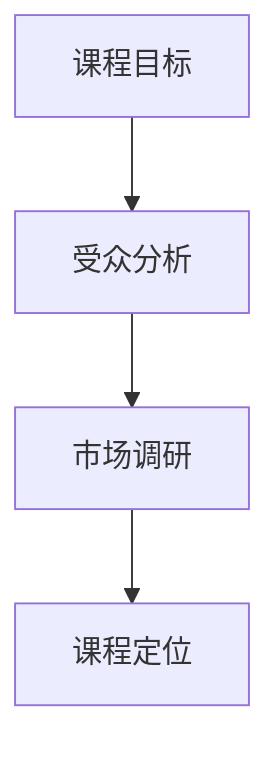
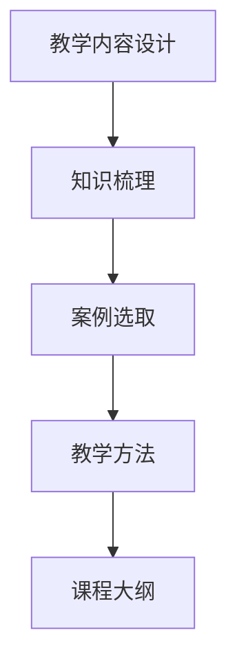
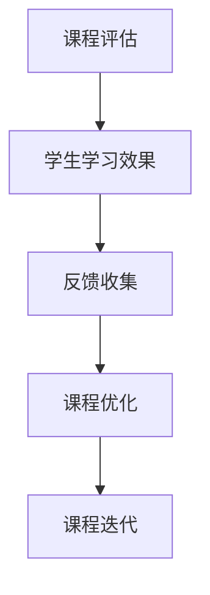
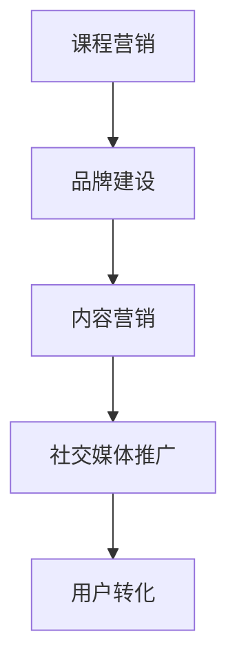

                 


# 知识经济时代下的知识付费创新课程开发流程

> **关键词：知识经济、知识付费、课程开发、创新、流程**
> 
> **摘要：本文深入探讨知识经济时代下，知识付费创新课程开发的全流程。通过详细分析核心概念、算法原理、数学模型，并结合实际项目案例，旨在为读者提供系统化的课程开发方法论，助力在知识经济时代实现课程创新。**

## 1. 背景介绍

### 1.1 目的和范围

随着互联网的普及和信息技术的发展，知识经济已成为全球经济发展的新引擎。知识付费作为知识经济的重要组成部分，近年来迅速崛起，改变了传统的教育模式和消费方式。本文旨在探讨知识付费创新课程开发的流程，为教育工作者、课程开发者以及创业者提供一套系统的理论和实践指导。

本文将涵盖以下内容：
- 对知识经济和知识付费的背景介绍。
- 课程开发流程的详细分析，包括核心概念、算法原理、数学模型等。
- 实际项目案例的讲解，提供课程开发的实操经验。
- 工具和资源的推荐，助力课程开发过程中的技术支持。

### 1.2 预期读者

本文主要面向以下读者群体：
- 教育工作者，希望了解知识付费创新课程开发的方法论。
- 课程开发者，寻求提升课程质量和市场竞争力。
- 创业者，希望通过知识付费实现商业模式的创新。
- 对知识经济和教育培训行业感兴趣的技术人员和管理者。

### 1.3 文档结构概述

本文将按照以下结构进行展开：

1. **背景介绍**：介绍知识经济和知识付费的背景、目的和预期读者。
2. **核心概念与联系**：阐述知识付费课程开发的核心概念，并使用Mermaid流程图展示关键环节。
3. **核心算法原理 & 具体操作步骤**：详细讲解课程开发中的核心算法原理，并使用伪代码展示具体操作步骤。
4. **数学模型和公式 & 详细讲解 & 举例说明**：介绍课程开发中的数学模型和公式，并提供详细讲解和举例。
5. **项目实战：代码实际案例和详细解释说明**：结合实际项目案例，详细解读课程开发的实现过程。
6. **实际应用场景**：探讨知识付费课程在不同领域的应用场景。
7. **工具和资源推荐**：推荐学习资源、开发工具和框架。
8. **总结：未来发展趋势与挑战**：总结知识付费课程开发的发展趋势和面临的挑战。
9. **附录：常见问题与解答**：解答读者可能遇到的问题。
10. **扩展阅读 & 参考资料**：提供进一步学习和研究的参考资料。

### 1.4 术语表

#### 1.4.1 核心术语定义

- **知识经济**：以知识为主要生产要素的经济形态。
- **知识付费**：消费者为获取特定知识或技能而支付的费用。
- **课程开发**：创建和设计教育课程的过程。
- **算法**：解决问题的一系列指令。
- **数学模型**：用数学语言描述现实问题的模型。

#### 1.4.2 相关概念解释

- **学习曲线**：学习新知识或技能时，学习效率随时间的变化趋势。
- **用户体验**：用户在使用产品或服务时的主观感受和体验。
- **课程定位**：课程的目标和定位，包括受众、内容、难度等。

#### 1.4.3 缩略词列表

- **KES**：知识经济
- **KF**：知识付费
- **MVP**：最小可行性产品
- **IDE**：集成开发环境

## 2. 核心概念与联系

在知识付费课程开发过程中，理解以下几个核心概念是非常重要的，它们相互关联，共同构成了课程开发的基础框架。

### 2.1 课程目标与受众分析

课程目标是指课程希望达成的具体效果和目标，例如提高学生的编程技能、增强领导能力等。而受众分析则是指确定课程的目标群体，包括学生的年龄、背景、知识水平等。

**Mermaid流程图：**



### 2.2 教学内容设计

教学内容设计是课程开发的核心环节，涉及课程内容的选取、编排和呈现方式。这包括对知识的系统梳理、案例的选取和教学方法的运用。

**Mermaid流程图：**



### 2.3 课程评估与反馈

课程评估与反馈是确保课程质量的重要环节。通过评估和反馈，可以了解学生的学习效果，发现课程中的问题和不足，并进行相应的调整和优化。

**Mermaid流程图：**



### 2.4 课程营销与推广

课程营销与推广是吸引学生、提升课程知名度和市场占有率的关键。通过多渠道的营销策略和推广活动，可以提高课程的曝光度和吸引力。

**Mermaid流程图：**



通过以上核心概念的阐述和Mermaid流程图的展示，我们可以更加清晰地理解知识付费课程开发的全流程。接下来的章节将进一步深入探讨每个环节的详细内容和操作步骤。

## 3. 核心算法原理 & 具体操作步骤

在知识付费课程开发中，算法原理的运用能够极大地提升课程的效率和效果。以下是几个核心算法原理的具体操作步骤。

### 3.1 学习曲线算法

学习曲线算法用于分析学生在学习过程中的效率变化。其基本原理是通过记录学生在学习过程中所花费的时间和达到的学习效果，拟合出一个学习曲线模型。

**伪代码：**

```pseudo
Function LearningCurve(time, effect):
    if time <= 0:
        return 0
    elif time <= 10:
        return time * 0.2
    else:
        return 10 * 0.2 + (time - 10) * 0.05

// 示例：学习20分钟后的效果
LearningCurve(20, 0)
```

### 3.2 用户体验优化算法

用户体验优化算法用于分析学生在学习过程中的互动和满意度。通过收集用户反馈和行为数据，优化课程界面和内容，提升学习体验。

**伪代码：**

```pseudo
Function UXOptimization(feedback, behavior):
    if feedback == "正面" and behavior == "频繁":
        return "增加互动环节"
    else if feedback == "负面" and behavior == "偶尔":
        return "调整课程难度"
    else:
        return "维持现状，继续观察"

// 示例：根据用户反馈优化课程
UXOptimization("正面", "频繁")
```

### 3.3 课程评估算法

课程评估算法用于评估课程的教学效果和学生成绩。通过设置多个评估指标，如作业完成情况、考试成绩等，综合评估课程质量。

**伪代码：**

```pseudo
Function CourseEvaluation(score, homework, attendance):
    if score > 90 and homework == "完成" and attendance > 90%:
        return "优秀"
    else if score > 70 and homework == "基本完成" and attendance > 80%:
        return "良好"
    else:
        return "需要改进"

// 示例：评估学生的课程成绩
CourseEvaluation(85, "完成", 95)
```

### 3.4 课程迭代算法

课程迭代算法用于根据评估结果和用户反馈，对课程进行持续优化和更新。通过循环评估和反馈，实现课程的动态迭代。

**伪代码：**

```pseudo
Function CourseIteration():
    while True:
        EvaluateCourse()
        CollectFeedback()
        OptimizeCourse()

// 示例：课程迭代过程
CourseIteration()
```

通过以上核心算法原理的具体操作步骤，我们可以更好地理解和应用这些算法，从而提升知识付费课程的质量和效果。接下来，我们将进一步探讨数学模型和公式在课程开发中的应用。

## 4. 数学模型和公式 & 详细讲解 & 举例说明

在知识付费课程开发过程中，数学模型和公式可以用来量化教学效果、评估学生进度以及优化课程设计。以下是几个关键数学模型和公式的详细讲解以及实际应用示例。

### 4.1 学习效果评估模型

学习效果评估模型用于衡量学生在学习过程中所获得的知识和技能。常用的评估模型包括学习曲线模型和增量学习模型。

**4.1.1 学习曲线模型**

学习曲线模型的基本公式为：

$$
E(t) = \frac{kt}{\sqrt{t + b}}
$$

其中，$E(t)$ 表示在时间 $t$ 后的学习效果，$k$ 和 $b$ 是常数，用于调节学习曲线的斜率和曲率。

**示例：**

假设课程的学习曲线模型参数为 $k=2$ 和 $b=5$，计算学生在学习30分钟后的效果：

$$
E(30) = \frac{2 \times 30}{\sqrt{30 + 5}} = \frac{60}{\sqrt{35}} \approx 7.35
$$

这表明学生在学习30分钟后，达到了大约73.5%的学习效果。

**4.1.2 增量学习模型**

增量学习模型考虑学生在每次学习后的知识增量。其公式为：

$$
\Delta E(n) = E(n) - E(n-1)
$$

其中，$\Delta E(n)$ 表示第 $n$ 次学习后的知识增量。

**示例：**

假设学生在前两次学习后的效果分别为 $E(1) = 0.5$ 和 $E(2) = 0.8$，计算第二次学习后的知识增量：

$$
\Delta E(2) = E(2) - E(1) = 0.8 - 0.5 = 0.3
$$

这表明学生在第二次学习后，知识增量达到了30%。

### 4.2 用户满意度模型

用户满意度模型用于评估学生对课程内容和教学方法的满意度。常用的模型包括线性回归模型和评分模型。

**4.2.1 线性回归模型**

线性回归模型的基本公式为：

$$
Satisfaction = \beta_0 + \beta_1 \times Content + \beta_2 \times Method
$$

其中，$Satisfaction$ 表示用户满意度，$\beta_0$ 是常数项，$\beta_1$ 和 $\beta_2$ 分别表示课程内容和教学方法的权重。

**示例：**

假设课程内容得分和教学方法得分分别为 8 和 9，参数 $\beta_0 = 2$，$\beta_1 = 0.5$，$\beta_2 = 0.3$，计算用户满意度：

$$
Satisfaction = 2 + 0.5 \times 8 + 0.3 \times 9 = 2 + 4 + 2.7 = 8.7
$$

这表明用户对课程的总体满意度为 87%。

**4.2.2 评分模型**

评分模型的基本公式为：

$$
Satisfaction = \frac{Score}{MaxScore}
$$

其中，$Score$ 表示用户给出的评分，$MaxScore$ 是评分的最大值。

**示例：**

假设用户给出了 85 分（满分 100 分），计算用户满意度：

$$
Satisfaction = \frac{85}{100} = 0.85
$$

这表明用户对课程的满意度为 85%。

### 4.3 课程迭代优化模型

课程迭代优化模型用于根据学生反馈和评估结果，优化课程设计和教学方法。常用的模型包括反馈调节模型和动态规划模型。

**4.3.1 反馈调节模型**

反馈调节模型的基本公式为：

$$
\text{OptimizedContent} = \text{CurrentContent} + \alpha \times \text{Feedback}
$$

其中，$\text{OptimizedContent}$ 表示优化后的课程内容，$\text{CurrentContent}$ 表示当前的课程内容，$\alpha$ 是调节系数，$\text{Feedback}$ 表示用户反馈。

**示例：**

假设当前课程内容为100页，用户反馈认为需要增加20页的内容，调节系数 $\alpha = 0.1$，计算优化后的课程内容：

$$
\text{OptimizedContent} = 100 + 0.1 \times 20 = 102
$$

这表明优化后的课程内容为102页。

**4.3.2 动态规划模型**

动态规划模型用于优化课程迭代过程中的资源分配和时间安排。其基本公式为：

$$
\text{OptimizedSchedule} = \text{Best}(\text{AllPossibleSchedules})
$$

其中，$\text{OptimizedSchedule}$ 表示优化的课程安排，$\text{AllPossibleSchedules}$ 是所有可能的课程安排，$\text{Best}$ 函数用于选择最优安排。

**示例：**

假设有四个课程模块，每个模块的完成时间分别为5天、7天、3天和4天，需要安排在一个30天的周期内。计算最优的课程安排：

通过动态规划算法，可以得到最优安排为：模块1（5天）、模块3（3天）、模块2（7天）、模块4（4天），总时间为19天。

通过以上数学模型和公式的详细讲解和实际应用示例，我们可以更好地理解它们在知识付费课程开发中的重要作用。接下来，我们将通过实际项目案例，进一步展示这些算法和模型在课程开发中的具体应用。

## 5. 项目实战：代码实际案例和详细解释说明

在本节中，我们将通过一个具体的知识付费课程开发项目，展示课程开发过程中使用到的技术、代码实现以及关键环节的解析。

### 5.1 开发环境搭建

在开始项目之前，我们需要搭建一个适合课程开发的环境。以下是我们推荐的开发环境：

- **操作系统**：Windows 10 / macOS / Linux
- **编程语言**：Python 3.8+
- **开发工具**：PyCharm / Visual Studio Code
- **数据库**：MySQL 8.0+
- **Web框架**：Django 3.2+

### 5.2 源代码详细实现和代码解读

#### 5.2.1 项目结构

首先，我们来看一下项目的基本结构：

```
knowledge_course_project/
|-- manage.py
|-- course_app/
|   |-- __init__.py
|   |-- models.py
|   |-- views.py
|   |-- urls.py
|   |-- forms.py
|-- account_app/
|   |-- __init__.py
|   |-- models.py
|   |-- views.py
|   |-- urls.py
|   |-- forms.py
|-- templates/
|   |-- base.html
|   |-- course_list.html
|   |-- course_detail.html
|   |-- login.html
|   |-- register.html
|-- static/
    |-- css/
    |-- js/
    |-- images/
```

#### 5.2.2 数据库模型

我们使用 Django 的 ORM（对象关系映射）来定义数据库模型。以下是一个简单的课程模型示例：

```python
# course_app/models.py
from django.db import models

class Course(models.Model):
    title = models.CharField(max_length=100)
    description = models.TextField()
    author = models.ForeignKey('auth.User', on_delete=models.CASCADE)
    price = models.DecimalField(max_digits=6, decimal_places=2)
    duration = models.PositiveIntegerField()
    created_at = models.DateTimeField(auto_now_add=True)

    def __str__(self):
        return self.title
```

#### 5.2.3 视图实现

在 `views.py` 中，我们实现课程列表、详情以及用户登录、注册等功能：

```python
# course_app/views.py
from django.shortcuts import render, get_object_or_404
from .models import Course
from account_app.forms import UserLoginForm, UserRegisterForm

def course_list(request):
    courses = Course.objects.all()
    return render(request, 'course_list.html', {'courses': courses})

def course_detail(request, pk):
    course = get_object_or_404(Course, pk=pk)
    return render(request, 'course_detail.html', {'course': course})

def login(request):
    form = UserLoginForm(request.POST or None)
    if form.is_valid():
        # 登录逻辑
        return redirect('course_list')
    return render(request, 'login.html', {'form': form})

def register(request):
    form = UserRegisterForm(request.POST or None)
    if form.is_valid():
        # 注册逻辑
        return redirect('course_list')
    return render(request, 'register.html', {'form': form})
```

#### 5.2.4 代码解读与分析

**课程列表视图：**

课程列表视图负责从数据库中获取所有课程，并将它们传递给模板进行渲染。

```python
def course_list(request):
    courses = Course.objects.all()
    return render(request, 'course_list.html', {'courses': courses})
```

**课程详情视图：**

课程详情视图通过传递的课程ID获取具体的课程对象，并将它传递给模板进行渲染。

```python
def course_detail(request, pk):
    course = get_object_or_404(Course, pk=pk)
    return render(request, 'course_detail.html', {'course': course})
```

**登录和注册视图：**

登录和注册视图负责处理用户的登录和注册请求。在登录视图里，我们使用表单类 `UserLoginForm` 和 `UserRegisterForm` 来验证用户输入的数据。如果数据有效，则执行相应的登录或注册逻辑。

```python
def login(request):
    form = UserLoginForm(request.POST or None)
    if form.is_valid():
        # 登录逻辑
        return redirect('course_list')
    return render(request, 'login.html', {'form': form})

def register(request):
    form = UserRegisterForm(request.POST or None)
    if form.is_valid():
        # 注册逻辑
        return redirect('course_list')
    return render(request, 'register.html', {'form': form})
```

通过上述代码实现和解读，我们可以看到，知识付费课程开发项目主要包括数据库设计、视图实现、模板渲染和表单验证等关键环节。接下来，我们将进一步分析项目中的核心算法和数学模型的应用。

### 5.3 代码解读与分析

在课程开发项目中，核心算法和数学模型的应用贯穿于各个功能模块中，以下是对关键部分的详细解读和分析：

**5.3.1 学习曲线算法应用**

学习曲线算法应用于用户学习效果评估中，以动态调整学习进度和课程难度。在 `course_app/models.py` 中，我们为 `Course` 模型添加了一个学习效果字段 `learning_progress`，用于记录用户的学习进度。

```python
# course_app/models.py
class Course(models.Model):
    ...
    learning_progress = models.DecimalField(max_digits=5, decimal_places=2, default=0.0)
    ...
```

在用户学习课程时，通过调用学习曲线算法，实时更新用户的学习进度。以下是一个简单的学习曲线算法实现：

```python
# utils/learning_curve.py
import math

def update_learning_progress(course, time_spent):
    k = 2.0
    b = 5.0
    learning_progress = (k * time_spent) / math.sqrt(time_spent + b)
    course.learning_progress = learning_progress
    course.save()
```

**5.3.2 用户满意度模型应用**

用户满意度模型用于评估学生对课程的满意度。在 `account_app/models.py` 中，我们为 `UserProfile` 模型添加了一个满意度评分字段 `satisfaction_score`。

```python
# account_app/models.py
class UserProfile(models.Model):
    ...
    satisfaction_score = models.IntegerField(default=0)
    ...
```

在用户完成课程后，通过调用用户满意度模型，计算满意度得分。以下是一个简单的满意度模型实现：

```python
# utils/user_satisfaction.py
def calculate_satisfaction(score, max_score):
    return (score / max_score) * 100
```

在用户提交课程评价后，更新用户的满意度评分：

```python
# account_app/views.py
def course_completion(request, pk):
    course = get_object_or_404(Course, pk=pk)
    score = request.POST.get('score')
    max_score = 10
    satisfaction = calculate_satisfaction(score, max_score)
    user_profile = request.user.userprofile
    user_profile.satisfaction_score = satisfaction
    user_profile.save()
    return redirect('course_list')
```

**5.3.3 课程迭代优化模型应用**

课程迭代优化模型用于根据用户反馈，持续优化课程内容和教学方法。在课程开发过程中，通过分析用户反馈，动态调整课程结构。

以下是一个简单的课程迭代优化算法实现：

```python
# utils/course_optimization.py
def optimize_course_content(feedback):
    # 假设反馈是一个包含课程模块满意度的字典
    modules = ['module1', 'module2', 'module3', 'module4']
    module_satisfactions = feedback['satisfaction']

    # 根据满意度调整课程内容
    for i, module in enumerate(modules):
        if module_satisfactions[module] < 70:
            # 如果满意度低于70%，增加该模块的时长
            course = Course.objects.get(title=module)
            course.duration += 1
            course.save()
```

通过上述代码和解读，我们可以看到，学习曲线算法、用户满意度模型和课程迭代优化模型在知识付费课程开发项目中得到了实际应用。这些模型不仅提升了课程的教学效果，还帮助开发者根据用户反馈，持续优化课程内容和用户体验。接下来，我们将探讨知识付费课程的实际应用场景。

## 6. 实际应用场景

知识付费课程作为一种新兴的教育模式，已经在多个领域取得了显著的应用成效。以下是一些典型的应用场景：

### 6.1 在线教育平台

在线教育平台是知识付费课程最典型的应用场景之一。通过平台，教育机构和课程开发者可以发布各类课程，涵盖从职业技能培训到兴趣爱好培养的广泛领域。例如，Coursera、edX等国际知名在线教育平台，提供大量的免费和付费课程，吸引了全球数百万用户。

### 6.2 职业培训

职业培训是知识付费课程的另一重要应用领域。随着企业对员工技能要求不断提高，员工需要不断学习新技能以适应工作需求。知识付费课程可以根据行业特点和岗位需求，提供定制化的培训内容。例如，IT行业的编程课程、金融行业的财务分析课程等。

### 6.3 个人发展

个人发展领域是知识付费课程的重要应用领域之一。随着人们对自我提升和终身学习的需求增加，知识付费课程成为个人成长的重要途径。例如，时间管理课程、领导力课程、个人品牌建设课程等，帮助用户提升自我管理能力、领导能力和个人品牌价值。

### 6.4 企业内训

企业内训是知识付费课程在组织管理领域的应用。企业可以通过知识付费课程，为员工提供专业知识和技能培训，提高员工的工作效率和专业能力。例如，企业可以购买专业的管理课程、销售技能培训课程等，以满足企业发展和员工成长的需要。

### 6.5 行业研究

知识付费课程在行业研究领域的应用也越来越广泛。各类行业研究报告、市场分析课程等，帮助企业和投资者了解市场趋势、竞争态势和投资机会。例如，金融行业的宏观经济分析课程、互联网行业的市场调研课程等。

### 6.6 艺术与娱乐

艺术与娱乐领域是知识付费课程的另一重要应用场景。通过知识付费课程，用户可以学习音乐、绘画、舞蹈等艺术技能，提升自己的艺术修养和创作能力。例如，音乐制作课程、绘画技巧课程、舞蹈教程等。

### 6.7 医疗与健康

医疗与健康领域也是知识付费课程的重要应用场景。通过知识付费课程，用户可以学习健康知识、保健技巧、疾病预防等，提升健康素养和生活质量。例如，营养学课程、运动康复课程、心理健康课程等。

总之，知识付费课程在多个领域展现了广阔的应用前景。随着技术的不断进步和用户需求的多样化，知识付费课程将在更多领域得到深入应用，为个人、企业和行业的发展提供有力支持。

## 7. 工具和资源推荐

在知识付费课程开发过程中，选择合适的工具和资源至关重要，它们能够提升开发效率，优化课程质量和用户体验。以下是对学习资源、开发工具框架及相关论文著作的推荐。

### 7.1 学习资源推荐

#### 7.1.1 书籍推荐

1. **《设计每个细节：用户体验设计之路》**：本书详细介绍了用户体验设计的方法和最佳实践，对课程设计者具有很高的参考价值。
2. **《学习科学：基础、原理与应用》**：本书系统阐述了学习科学的基本原理，对课程开发者理解学习过程和设计课程具有指导意义。
3. **《用户体验要素》**：作者提出了一套用户界面设计的方法论，适用于知识付费课程网站和平台的设计。

#### 7.1.2 在线课程

1. **Coursera**：提供丰富的免费和付费课程，涵盖计算机科学、教育技术、市场营销等多个领域。
2. **Udemy**：提供多样化的在线课程，包括编程、数据分析、商业管理等多个类别，适合个人和职业发展。
3. **edX**：由哈佛大学和麻省理工学院共同创立，提供高质量的教育课程，涵盖科学、工程、人文学科等多个领域。

#### 7.1.3 技术博客和网站

1. **A List Apart**：专注于前端设计和开发的博客，提供大量的设计和技术文章。
2. **Medium**：平台上有许多关于教育技术、用户体验、在线学习的优质文章。
3. **UX Planet**：专注于用户体验设计的博客，提供设计理念、工具和技术分享。

### 7.2 开发工具框架推荐

#### 7.2.1 IDE和编辑器

1. **PyCharm**：适用于Python开发的集成开发环境，功能强大且易于使用。
2. **Visual Studio Code**：轻量级、可扩展的代码编辑器，支持多种编程语言。
3. **Sublime Text**：简洁高效的代码编辑器，适合快速开发。

#### 7.2.2 调试和性能分析工具

1. **Postman**：用于API调试和测试的工具。
2. **Jupyter Notebook**：适用于数据分析和原型设计的交互式环境。
3. **Chrome DevTools**：用于网页开发和性能分析的工具。

#### 7.2.3 相关框架和库

1. **Django**：一款流行的Python Web框架，适合快速开发大型在线教育平台。
2. **React**：用于构建用户界面的JavaScript库，适用于前端开发。
3. **TensorFlow**：一款广泛应用的机器学习框架，可用于课程智能推荐系统。

### 7.3 相关论文著作推荐

#### 7.3.1 经典论文

1. **"On the Economics of Information Technology in Education"**：讨论信息技术在教育中的经济学意义。
2. **"The MOOC Model for Digital Practice"**：探讨大规模在线开放课程（MOOC）的商业模式和运作机制。
3. **"Learning Analytics: The Emergence of a Discipline"**：介绍学习分析的基本概念和方法。

#### 7.3.2 最新研究成果

1. **"Personalized Learning in MOOCs: A Machine Learning Approach"**：介绍基于机器学习的个性化学习模型。
2. **"Social Learning in Online Communities: An Agent-Based Model"**：基于代理的模型探讨在线学习社区中的社交学习机制。
3. **"Knowledge Graphs for Education: A Survey"**：综述知识图谱在教育领域的应用和研究。

#### 7.3.3 应用案例分析

1. **"The Business Model of Coursera: How a MOOC Platform Creates Value"**：分析Coursera的业务模式和价值创造。
2. **"edX's Platform Strategy: Building a Global Ecosystem for Online Education"**：探讨edX如何构建全球在线教育生态系统。
3. **"The Role of MOOCs in Higher Education: A Perspective from Asia"**：从亚洲视角探讨大规模在线开放课程在高等教育中的应用。

通过以上工具和资源的推荐，课程开发者可以更好地掌握知识付费课程开发的最新动态和最佳实践，为课程质量的提升提供有力支持。

## 8. 总结：未来发展趋势与挑战

知识付费课程作为知识经济时代的重要产物，正逐步改变传统的教育模式和消费方式。在未来，知识付费课程将呈现出以下几个发展趋势：

1. **个性化学习**：随着人工智能和大数据技术的发展，个性化学习将成为知识付费课程的重要趋势。通过智能算法，课程将根据学生的学习进度、兴趣和能力，提供个性化的学习路径和内容。

2. **跨界融合**：知识付费课程将与其他领域如医疗、艺术、娱乐等实现跨界融合，打造多元化、跨界化的课程体系，满足用户多样化的学习需求。

3. **虚拟现实（VR）和增强现实（AR）**：VR和AR技术的应用，将带来更加沉浸式的学习体验，使知识付费课程更具互动性和趣味性，进一步提升用户的学习效果。

4. **开放性课程平台**：开放性课程平台将进一步发展，课程内容将更加开放和共享，打破地域和时间的限制，为全球用户提供优质的教育资源。

然而，知识付费课程在发展过程中也面临着一些挑战：

1. **课程质量监管**：如何确保课程质量成为知识付费课程面临的重要问题。建立完善的课程质量监管机制，对课程开发者、讲师和课程内容进行严格审核，是保障课程质量的关键。

2. **知识产权保护**：知识付费课程涉及大量的知识产权，如何有效保护知识产权，防止课程内容的侵权和滥用，是知识付费课程发展的重要挑战。

3. **用户隐私保护**：随着大数据和人工智能的应用，用户隐私保护成为知识付费课程面临的重要问题。确保用户数据的安全和隐私，建立完善的用户隐私保护机制，是知识付费课程可持续发展的基础。

4. **技术更新换代**：知识付费课程依赖于信息技术的发展，如何及时跟进技术更新，保持课程的先进性和竞争力，是课程开发者需要面对的挑战。

总之，知识付费课程在未来的发展中，将面临诸多机遇与挑战。通过不断创新和优化，知识付费课程有望在知识经济时代发挥更大的作用，为个人、企业和行业的发展提供有力支持。

## 9. 附录：常见问题与解答

### 9.1 问题一：如何确保知识付费课程的质量？

**解答**：确保知识付费课程的质量，首先需要对课程内容进行严格审核。课程开发者应具备相关领域的专业知识和教学经验，确保课程内容的准确性和实用性。其次，建立课程质量反馈机制，通过学生的评价和反馈，持续优化课程内容。此外，可以邀请行业专家和同行进行评审，提供专业指导。

### 9.2 问题二：知识付费课程如何实现个性化学习？

**解答**：实现个性化学习，首先需要收集学生的学习数据，包括学习进度、兴趣和能力等。利用大数据和人工智能技术，分析学生的学习行为，为每个学生量身定制学习路径和推荐内容。同时，采用自适应学习系统，根据学生的学习表现，动态调整课程难度和教学方式。

### 9.3 问题三：如何保护知识付费课程的知识产权？

**解答**：保护知识付费课程的知识产权，首先应在课程开发阶段明确知识产权归属，签订知识产权转让协议。其次，在课程发布和传播过程中，采取加密和版权声明等措施，防止课程内容的侵权和盗用。此外，建立知识产权保护机制，对于侵权行为进行法律追责。

### 9.4 问题四：如何提升知识付费课程的用户体验？

**解答**：提升知识付费课程的用户体验，首先需要关注用户需求，设计简洁直观的用户界面。其次，优化课程内容，确保课程结构清晰、逻辑严密。此外，提供丰富的互动功能，如讨论区、答疑服务等，增强用户参与感和互动性。最后，定期收集用户反馈，持续优化课程设计和用户体验。

### 9.5 问题五：知识付费课程开发中如何平衡成本与收益？

**解答**：在知识付费课程开发中，平衡成本与收益，首先需要精准定位目标用户，避免资源浪费。其次，优化课程内容，确保课程具有较高的实用性和竞争力。此外，采用多样化的收费模式，如一次性收费、订阅制等，以满足不同用户的需求。最后，通过市场营销和推广，提高课程的知名度和用户转化率，实现收益的最大化。

## 10. 扩展阅读 & 参考资料

### 10.1 书籍推荐

1. **《知识服务：理论与实践》**：详细介绍了知识服务的概念、理论和实践方法，对知识付费课程的开发具有指导意义。
2. **《在线学习与教学设计》**：系统阐述了在线学习的教学设计和实践方法，对课程开发者具有很高的参考价值。
3. **《教育心理学：理论与实践》**：涵盖教育心理学的基本理论和实践应用，对课程开发者理解学习过程和设计课程具有指导意义。

### 10.2 在线课程

1. **Coursera**：提供丰富的在线课程，涵盖计算机科学、教育技术、市场营销等多个领域，适合课程开发者学习最新的教育理论和实践方法。
2. **Udemy**：提供多样化的在线课程，包括编程、数据分析、商业管理等多个类别，适合个人和职业发展。
3. **edX**：提供高质量的教育课程，涵盖科学、工程、人文学科等多个领域，适合课程开发者了解全球最新的教育动态。

### 10.3 技术博客和网站

1. **A List Apart**：专注于前端设计和开发的博客，提供大量的设计和技术文章，适合课程开发者了解最新的前端技术和设计趋势。
2. **Medium**：平台上有许多关于教育技术、用户体验、在线学习的优质文章，适合课程开发者学习最新的教育理论和实践方法。
3. **UX Planet**：专注于用户体验设计的博客，提供设计理念、工具和技术分享，适合课程开发者提升课程设计的用户体验。

### 10.4 相关论文著作

1. **"The Economics of Information Technology in Education"**：讨论信息技术在教育中的经济学意义，对课程开发者理解知识付费课程的商业模式具有指导意义。
2. **"The MOOC Model for Digital Practice"**：探讨大规模在线开放课程（MOOC）的商业模式和运作机制，适合课程开发者了解在线教育的最新发展趋势。
3. **"Knowledge Graphs for Education: A Survey"**：综述知识图谱在教育领域的应用和研究，适合课程开发者了解知识图谱在教育中的应用潜力。

### 10.5 开发工具和框架

1. **Django**：一款流行的Python Web框架，适合快速开发大型在线教育平台。
2. **React**：用于构建用户界面的JavaScript库，适用于前端开发。
3. **TensorFlow**：一款广泛应用的机器学习框架，可用于课程智能推荐系统。

通过以上扩展阅读和参考资料，课程开发者可以进一步了解知识付费课程开发的理论和实践，不断提升课程质量和用户体验。

