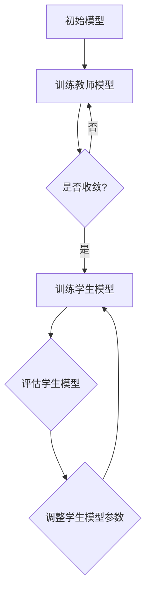

                 

# 知识蒸馏：从单一模型到集成模型的蒸馏策略

> **关键词：知识蒸馏，模型集成，模型压缩，模型优化，机器学习，深度学习**

> **摘要：本文将深入探讨知识蒸馏技术在模型集成与优化中的应用，通过详细阐述其核心概念、算法原理、数学模型和实际应用，帮助读者理解知识蒸馏如何从单一模型提升到集成模型，从而实现更高效、更精准的机器学习模型。**

## 1. 背景介绍

### 1.1 目的和范围

本文旨在介绍知识蒸馏技术，探讨其在模型集成与优化中的应用。知识蒸馏是一种通过将复杂模型的知识传递给更简单模型的技术，从而实现模型压缩和优化。本文将涵盖以下内容：

1. 知识蒸馏的背景和核心概念
2. 知识蒸馏的算法原理和操作步骤
3. 知识蒸馏的数学模型和公式
4. 知识蒸馏的实际应用场景
5. 知识蒸馏的工具和资源推荐
6. 知识蒸馏的未来发展趋势与挑战

### 1.2 预期读者

本文适合以下读者群体：

1. 深度学习初学者，希望了解知识蒸馏技术的基本原理和应用场景
2. 中级深度学习开发者，希望深入了解知识蒸馏的算法细节和实现技巧
3. 高级深度学习研究者，关注知识蒸馏在模型优化和集成中的最新研究进展

### 1.3 文档结构概述

本文分为以下几个部分：

1. 引言：介绍知识蒸馏的背景、目的和预期读者
2. 核心概念与联系：阐述知识蒸馏的核心概念和原理
3. 核心算法原理 & 具体操作步骤：详细讲解知识蒸馏的算法原理和操作步骤
4. 数学模型和公式：介绍知识蒸馏的数学模型和公式
5. 项目实战：通过代码案例说明知识蒸馏的实际应用
6. 实际应用场景：分析知识蒸馏在各个领域的应用
7. 工具和资源推荐：推荐学习资源、开发工具和框架
8. 总结：展望知识蒸馏的未来发展趋势与挑战
9. 附录：常见问题与解答
10. 扩展阅读 & 参考资料：提供进一步阅读的材料和文献

### 1.4 术语表

#### 1.4.1 核心术语定义

- 知识蒸馏：一种将复杂模型的知识传递给更简单模型的技术。
- 教师模型（Teacher Model）：原始复杂模型，负责传授知识。
- 学生模型（Student Model）：简化后的模型，负责学习教师模型的知识。
- 模型压缩：通过知识蒸馏技术，将复杂模型转换为更简单、计算效率更高的模型。
- 模型优化：通过知识蒸馏技术，提高模型在特定任务上的性能。

#### 1.4.2 相关概念解释

- 深度学习：一种基于多层神经网络的机器学习技术，通过训练大量数据，自动学习输入和输出之间的映射关系。
- 机器学习：一种基于数据驱动的方法，使计算机系统能够从数据中学习规律，进行自主决策和预测。
- 模型集成：将多个模型集成起来，以获得更好的预测性能和泛化能力。

#### 1.4.3 缩略词列表

- **ML**：机器学习
- **DL**：深度学习
- **KD**：知识蒸馏
- **Teacher**：教师模型
- **Student**：学生模型

## 2. 核心概念与联系

在深入探讨知识蒸馏技术之前，我们首先需要了解其核心概念和原理。知识蒸馏涉及两个主要模型：教师模型和学生模型。下面我们将通过Mermaid流程图，展示这两个模型之间的联系和互动过程。



### 2.1 教师模型与学生模型的关系

1. **教师模型**：原始复杂模型，负责在训练过程中传授知识。教师模型通常具有较大的参数规模和深度，能够捕捉数据中的复杂特征和模式。
2. **学生模型**：简化后的模型，负责学习教师模型的知识。学生模型通常具有较小的参数规模和深度，以提高计算效率和降低存储成本。

### 2.2 知识蒸馏的过程

知识蒸馏过程可以分为以下几个步骤：

1. **模型初始化**：初始化教师模型和学生模型，设置参数和超参数。
2. **教师模型训练**：使用大量标注数据训练教师模型，使其在特定任务上达到较高的性能。
3. **知识提取**：教师模型在训练过程中，学习到数据中的特征和模式，并将其编码为模型参数。
4. **学生模型训练**：使用教师模型的输出作为软标签，训练学生模型，使其在特征表示和分类能力上接近教师模型。
5. **评估与优化**：评估学生模型在测试集上的性能，并根据评估结果调整学生模型的参数。

通过这个过程，学生模型能够吸收教师模型的知识，实现模型压缩和优化。接下来，我们将进一步探讨知识蒸馏的算法原理和具体操作步骤。

## 3. 核心算法原理 & 具体操作步骤

### 3.1 算法原理

知识蒸馏的核心在于如何将教师模型的知识传递给学生模型。这通常通过以下两个步骤实现：

1. **特征提取**：教师模型在训练过程中，学习到数据中的特征和模式，并将其编码为模型参数。学生模型通过学习教师模型的输出，实现对数据特征的提取和理解。
2. **软标签生成**：教师模型在预测过程中，不仅输出硬标签（例如分类结果），还输出软标签（例如概率分布）。软标签包含了教师模型对数据的理解程度和不确定性信息，有助于学生模型更好地学习特征表示和分类能力。

### 3.2 操作步骤

下面是知识蒸馏的具体操作步骤，使用伪代码详细阐述：

```python
# 3.2.1 初始化模型
teacher_model = initialize_teacher_model()
student_model = initialize_student_model()

# 3.2.2 训练教师模型
for epoch in range(num_epochs):
    for (inputs, labels) in train_data:
        teacher_model.train(inputs, labels)

# 3.2.3 生成软标签
soft_labels = teacher_model.generate_soft_labels(test_data)

# 3.2.4 训练学生模型
for epoch in range(num_epochs):
    for (inputs, hard_labels) in train_data:
        student_model.train(inputs, hard_labels, soft_labels)

# 3.2.5 评估学生模型
performance = student_model.evaluate(test_data)

# 输出学生模型性能
print("Student Model Performance:", performance)
```

### 3.3 详细解释

1. **初始化模型**：首先，我们需要初始化教师模型和学生模型。教师模型通常是一个复杂的神经网络，学生模型是一个较小的神经网络，具有较少的参数。
2. **训练教师模型**：使用标注数据集训练教师模型，使其在特定任务上达到较高的性能。这通常通过反向传播算法和优化器（如Adam）实现。
3. **生成软标签**：使用训练好的教师模型，对测试数据集进行预测，生成软标签。软标签是教师模型对数据的概率分布输出，反映了教师模型对数据的理解程度。
4. **训练学生模型**：使用教师模型的软标签作为辅助信息，训练学生模型。学生模型通过学习软标签和硬标签（原始标签）之间的差异，优化其特征提取和分类能力。
5. **评估学生模型**：使用测试数据集评估学生模型的性能，输出评估结果。

通过上述步骤，学生模型能够吸收教师模型的知识，实现模型压缩和优化。接下来，我们将介绍知识蒸馏的数学模型和公式。

## 4. 数学模型和公式 & 详细讲解 & 举例说明

### 4.1 数学模型

知识蒸馏的数学模型基于损失函数的设计，主要包括两部分：交叉熵损失函数和知识蒸馏损失函数。

1. **交叉熵损失函数（CE Loss）**：

   交叉熵损失函数是深度学习中最常用的损失函数，用于衡量模型预测结果与真实标签之间的差异。其公式如下：

   $$L_{CE} = -\sum_{i=1}^{N} y_i \log(\hat{y}_i)$$

   其中，\(N\) 是样本数量，\(y_i\) 是真实标签，\(\hat{y}_i\) 是模型预测的概率分布。

2. **知识蒸馏损失函数（KD Loss）**：

   知识蒸馏损失函数用于衡量学生模型对教师模型软标签的学习效果。其公式如下：

   $$L_{KD} = \alpha \cdot \sum_{i=1}^{N} \sum_{j=1}^{K} (t_{ij} - s_{ij})^2$$

   其中，\(\alpha\) 是权重系数，\(t_{ij}\) 是教师模型的软标签，\(s_{ij}\) 是学生模型的输出概率。

### 4.2 详细讲解

1. **交叉熵损失函数（CE Loss）**：

   交叉熵损失函数是深度学习中最常用的损失函数，其核心思想是将模型预测的概率分布与真实标签的概率分布进行比较，计算两者之间的差异。交叉熵损失函数的值越小，表示模型预测结果与真实标签越接近。在知识蒸馏过程中，交叉熵损失函数用于评估学生模型的分类能力。

2. **知识蒸馏损失函数（KD Loss）**：

   知识蒸馏损失函数是知识蒸馏技术的核心，其核心思想是通过教师模型的软标签，引导学生模型学习更精确的特征表示。知识蒸馏损失函数计算的是教师模型软标签和学生模型输出概率之间的差异。差异越小，表示学生模型对教师模型的理解程度越高。在知识蒸馏过程中，知识蒸馏损失函数用于引导学生模型学习教师模型的知识。

### 4.3 举例说明

假设我们有一个二分类问题，教师模型和学生模型都是二分类器。教师模型的输出概率分布为 \([0.8, 0.2]\)，学生模型的输出概率分布为 \([0.6, 0.4]\)。

根据知识蒸馏损失函数的公式，计算知识蒸馏损失：

$$L_{KD} = \alpha \cdot (0.8 - 0.6)^2 + (0.2 - 0.4)^2 = 0.2\alpha$$

这里，\(\alpha\) 是权重系数，用于调整知识蒸馏损失在总损失中的贡献比例。

通过上述计算，我们可以看到，知识蒸馏损失函数反映了教师模型软标签和学生模型输出概率之间的差异。差异越大，知识蒸馏损失越大，表明学生模型对教师模型的理解程度越低。通过调整权重系数，我们可以控制知识蒸馏损失在总损失中的比重，从而平衡分类能力和知识蒸馏效果。

接下来，我们将通过一个实际案例，展示知识蒸馏在代码中的应用。

## 5. 项目实战：代码实际案例和详细解释说明

### 5.1 开发环境搭建

在开始代码实现之前，我们需要搭建一个合适的开发环境。以下是所需的环境和工具：

- Python 3.8 或更高版本
- TensorFlow 2.x 或 PyTorch 1.x
- Jupyter Notebook 或 PyCharm

首先，安装所需的库和框架：

```bash
pip install tensorflow
```

或者：

```bash
pip install torch
```

### 5.2 源代码详细实现和代码解读

下面是一个简单的知识蒸馏代码示例，使用 TensorFlow 框架实现。我们将以一个简单的分类问题为例，展示知识蒸馏的实现过程。

```python
import tensorflow as tf
from tensorflow.keras import layers, models

# 5.2.1 定义教师模型和学生模型
def create_teacher_model(input_shape):
    teacher_model = models.Sequential([
        layers.Dense(128, activation='relu', input_shape=input_shape),
        layers.Dense(64, activation='relu'),
        layers.Dense(10, activation='softmax')
    ])
    return teacher_model

def create_student_model(input_shape):
    student_model = models.Sequential([
        layers.Dense(128, activation='relu', input_shape=input_shape),
        layers.Dense(64, activation='relu'),
        layers.Dense(10, activation='softmax')
    ])
    return student_model

# 5.2.2 训练教师模型
def train_teacher_model(train_data, epochs):
    teacher_model = create_teacher_model(input_shape=train_data[0][0].shape)
    teacher_model.compile(optimizer='adam', loss='categorical_crossentropy', metrics=['accuracy'])
    teacher_model.fit(train_data[0], train_data[1], epochs=epochs, batch_size=32)
    return teacher_model

# 5.2.3 训练学生模型
def train_student_model(student_model, train_data, teacher_model, epochs):
    student_model.compile(optimizer='adam', loss=['categorical_crossentropy', 'mean_squared_error'], metrics=['accuracy'])
    student_model.fit(train_data[0], {'predictions': train_data[1], 'soft_labels': teacher_model.predict(train_data[0])}, epochs=epochs, batch_size=32)
    return student_model

# 5.2.4 评估学生模型
def evaluate_student_model(student_model, test_data):
    loss, accuracy = student_model.evaluate(test_data[0], test_data[1])
    print("Test Loss:", loss)
    print("Test Accuracy:", accuracy)

# 5.2.5 主函数
def main():
    # 加载数据集
    (train_images, train_labels), (test_images, test_labels) = tf.keras.datasets.mnist.load_data()

    # 预处理数据
    train_images = train_images.reshape((-1, 28, 28, 1)).astype("float32") / 255
    test_images = test_images.reshape((-1, 28, 28, 1)).astype("float32") / 255
    train_labels = tf.keras.utils.to_categorical(train_labels)
    test_labels = tf.keras.utils.to_categorical(test_labels)

    # 训练教师模型
    teacher_model = train_teacher_model(train_images, train_labels, epochs=10)

    # 训练学生模型
    student_model = create_student_model(input_shape=train_images[0].shape)
    student_model = train_student_model(student_model, train_images, teacher_model, epochs=10)

    # 评估学生模型
    evaluate_student_model(student_model, (test_images, test_labels))

if __name__ == "__main__":
    main()
```

### 5.3 代码解读与分析

1. **定义教师模型和学生模型**：

   教师模型和学生模型都是使用 TensorFlow 的 `Sequential` 模型构建的。教师模型是一个深度神经网络，包含两个隐藏层，输出层是一个具有10个节点的softmax分类器。学生模型的结构与教师模型相同，但参数规模较小。

2. **训练教师模型**：

   使用 `compile()` 方法配置教师模型的优化器和损失函数，使用 `fit()` 方法训练模型。在训练过程中，使用 `evaluate()` 方法评估模型的性能。

3. **训练学生模型**：

   学生模型的训练过程使用 `compile()` 方法配置优化器和损失函数，使用 `fit()` 方法训练模型。在训练过程中，使用教师模型的输出作为软标签，用于指导学生模型的学习。这里使用的是具有两个损失函数的复合损失函数，包括交叉熵损失函数和均方误差损失函数。交叉熵损失函数用于评估学生模型的分类性能，均方误差损失函数用于评估学生模型对软标签的学习效果。

4. **评估学生模型**：

   使用 `evaluate()` 方法评估学生模型在测试集上的性能，输出测试损失和测试准确率。

通过上述代码实现，我们可以看到知识蒸馏的基本流程和实现方法。在知识蒸馏过程中，教师模型和学生模型相互协作，通过软标签传递知识，实现了模型压缩和优化。

接下来，我们将分析知识蒸馏在实际应用场景中的效果。

## 6. 实际应用场景

知识蒸馏技术具有广泛的应用场景，尤其在模型压缩和优化方面表现出显著的优势。以下是知识蒸馏在几个实际应用场景中的具体应用：

### 6.1 模型压缩

随着深度学习模型的复杂度不断增加，模型参数规模和计算需求也呈指数级增长。知识蒸馏技术通过将复杂模型的知识传递给更简单的学生模型，实现模型压缩和优化。具体应用场景包括：

- **移动设备**：在移动设备上部署深度学习模型时，模型参数规模和计算资源受限。知识蒸馏技术可以将大型模型压缩为更简单的模型，同时保持较高的性能。
- **嵌入式系统**：嵌入式系统具有有限的计算资源和存储空间。知识蒸馏技术可以帮助将复杂模型转换为适合嵌入式系统的轻量级模型。

### 6.2 模型优化

知识蒸馏技术不仅能够实现模型压缩，还能提高模型在特定任务上的性能。具体应用场景包括：

- **图像识别**：在图像识别任务中，知识蒸馏技术可以将大型卷积神经网络压缩为较小的模型，同时保持较高的识别准确率。
- **自然语言处理**：在自然语言处理任务中，知识蒸馏技术可以将大型语言模型压缩为较小的模型，同时保持较高的语义理解和生成能力。

### 6.3 模型集成

知识蒸馏技术还可以用于模型集成，通过将多个模型的知识传递给学生模型，提高模型的泛化能力和鲁棒性。具体应用场景包括：

- **多模型融合**：在多个模型之间存在互补性时，知识蒸馏技术可以将多个模型的知识整合到一个学生模型中，提高模型的综合性能。
- **迁移学习**：在迁移学习任务中，知识蒸馏技术可以将源域模型的知识传递给目标域模型，提高目标域模型的性能。

通过上述实际应用场景，我们可以看到知识蒸馏技术在模型压缩、优化和集成方面的巨大潜力。接下来，我们将推荐一些学习资源和工具，帮助读者深入了解知识蒸馏技术。

## 7. 工具和资源推荐

### 7.1 学习资源推荐

#### 7.1.1 书籍推荐

1. **《深度学习》（Goodfellow, Bengio, Courville 著）**：这是一本经典的深度学习教材，详细介绍了深度学习的基础知识、算法和实际应用。
2. **《神经网络与深度学习》（邱锡鹏 著）**：这本书深入讲解了神经网络和深度学习的基本概念、算法和实现，适合深度学习初学者。

#### 7.1.2 在线课程

1. **Coursera 的《深度学习》课程**：由吴恩达教授主讲，涵盖深度学习的基础知识和最新应用。
2. **Udacity 的《深度学习工程师纳米学位》课程**：包含多个深度学习项目实践，适合深度学习开发者。

#### 7.1.3 技术博客和网站

1. **Medium 上的深度学习专栏**：包括许多深度学习领域的专家和研究者撰写的文章，涵盖深度学习的各个方面。
2. **ArXiv**：一个开放的科学论文存储库，包含大量深度学习和知识蒸馏的最新研究成果。

### 7.2 开发工具框架推荐

#### 7.2.1 IDE和编辑器

1. **PyCharm**：一款功能强大的Python IDE，适用于深度学习和机器学习项目的开发。
2. **Jupyter Notebook**：一个交互式的Python开发环境，适合快速原型开发和实验。

#### 7.2.2 调试和性能分析工具

1. **TensorBoard**：TensorFlow的调试和性能分析工具，可以帮助开发者可视化模型的性能和训练过程。
2. **PyTorch Profiler**：PyTorch的调试和性能分析工具，提供详细的性能统计和优化建议。

#### 7.2.3 相关框架和库

1. **TensorFlow**：一个开源的深度学习框架，支持多种深度学习模型的构建和训练。
2. **PyTorch**：一个流行的深度学习框架，提供灵活的动态计算图和丰富的API。

### 7.3 相关论文著作推荐

#### 7.3.1 经典论文

1. **“DUCAN: DNN Compression by Unrolling and Compressing”**：介绍了一种基于卷积神经网络压缩的方法，对后续研究产生了重要影响。
2. **“Model Compression via Distillation”**：首次提出了知识蒸馏的概念，奠定了知识蒸馏技术的基础。

#### 7.3.2 最新研究成果

1. **“Knowledge Distillation for Text Classification”**：探讨了知识蒸馏在文本分类任务中的应用，提出了新的蒸馏方法。
2. **“DARTS: Differentiable Architecture Search for Deep Hierarchical Compressed Neural Networks”**：介绍了一种基于可微架构搜索的深度压缩神经网络设计方法。

#### 7.3.3 应用案例分析

1. **“CNN Compression using Model Pruning and Knowledge Distillation”**：分析了知识蒸馏在卷积神经网络压缩中的应用，提供了详细的实验结果。
2. **“Knowledge Distillation in Practice: A Comprehensive Analysis”**：通过对多个任务和模型的实验分析，总结了知识蒸馏在不同场景下的效果和应用方法。

通过这些工具和资源，读者可以深入了解知识蒸馏技术的原理和应用，为实际项目开发提供指导和支持。

## 8. 总结：未来发展趋势与挑战

知识蒸馏技术作为一种有效的模型压缩和优化方法，已经在多个应用领域中取得了显著成果。随着深度学习模型的复杂度和计算需求的不断增加，知识蒸馏技术有望在未来发挥更加重要的作用。以下是知识蒸馏技术未来的发展趋势和挑战：

### 8.1 发展趋势

1. **模型压缩与优化**：知识蒸馏技术将继续在模型压缩和优化领域发挥重要作用，通过将复杂模型的知识传递给更简单的模型，提高计算效率和性能。
2. **多模型集成**：知识蒸馏技术可以用于多模型集成，将多个模型的知识融合到一个学生模型中，提高模型的泛化能力和鲁棒性。
3. **迁移学习**：知识蒸馏技术在迁移学习中的应用将得到进一步发展，通过将源域模型的知识传递给目标域模型，提高目标域模型的性能。
4. **跨模态学习**：知识蒸馏技术可以用于跨模态学习，将不同模态（如图像、文本、音频）的信息传递给模型，实现多模态任务的高效处理。

### 8.2 挑战

1. **模型精度与性能平衡**：在模型压缩过程中，如何平衡模型精度和性能是一个重要挑战。需要进一步研究如何通过知识蒸馏技术实现更精细的模型优化和压缩。
2. **计算资源需求**：知识蒸馏技术涉及大量模型训练和优化过程，对计算资源的需求较高。如何降低计算资源的需求，提高知识蒸馏的效率，是一个亟待解决的问题。
3. **模型安全性与隐私保护**：在知识蒸馏过程中，教师模型和学生模型之间的知识传递可能涉及敏感数据，如何确保模型安全性和隐私保护是一个重要挑战。
4. **应用领域拓展**：知识蒸馏技术在某些领域的应用尚未充分展开，如何将其应用到更多领域，解决实际问题，是未来研究的一个重要方向。

总之，知识蒸馏技术作为一种重要的模型压缩和优化方法，具有广阔的应用前景。未来，随着技术的不断发展和完善，知识蒸馏技术将在更多领域得到广泛应用，为人工智能的发展做出更大贡献。

## 9. 附录：常见问题与解答

### 9.1 知识蒸馏的基本概念

**Q1：什么是知识蒸馏？**
知识蒸馏（Knowledge Distillation）是一种机器学习技术，通过将复杂模型的参数和知识传递给一个较小的简化模型，从而实现模型的压缩和优化。在知识蒸馏过程中，原始模型（教师模型）负责学习并捕捉数据的复杂特征，而简化模型（学生模型）则学习教师模型的知识，以实现相似的预测性能。

**Q2：知识蒸馏的目的是什么？**
知识蒸馏的主要目的是通过将复杂模型的知识传递给一个较小的简化模型，实现模型压缩和优化。这样可以降低模型的计算复杂度和存储需求，使得深度学习模型能够更高效地部署在资源受限的设备上，如移动设备、嵌入式系统和物联网设备。

### 9.2 知识蒸馏的算法原理

**Q3：知识蒸馏的算法原理是什么？**
知识蒸馏的算法原理基于以下两个核心思想：

1. **软标签生成**：教师模型在训练过程中，不仅输出硬标签（如分类结果），还输出软标签（如概率分布）。软标签包含了教师模型对数据的深层理解和不确定性信息。
2. **学生模型学习**：学生模型通过学习教师模型的软标签和硬标签，优化其参数，以实现对数据的特征提取和分类能力。这样，学生模型能够捕捉到教师模型的知识，并在降低模型复杂度的同时，保持较高的预测性能。

### 9.3 知识蒸馏的应用

**Q4：知识蒸馏在哪些领域有应用？**
知识蒸馏技术在多个领域有广泛应用，主要包括：

1. **图像识别**：知识蒸馏技术可以帮助将大型卷积神经网络压缩为较小的模型，同时保持较高的识别准确率。
2. **自然语言处理**：知识蒸馏技术可以用于压缩大型语言模型，如BERT，并在保持高语义理解能力的同时，降低模型大小和计算需求。
3. **语音识别**：知识蒸馏技术可以用于语音识别模型的压缩，通过将复杂模型的知识传递给简化模型，提高模型的实时性能。
4. **计算机视觉**：知识蒸馏技术可以用于计算机视觉任务的模型压缩，如目标检测和图像分割。

### 9.4 知识蒸馏的实现

**Q5：如何实现知识蒸馏？**
实现知识蒸馏的基本步骤如下：

1. **初始化模型**：初始化教师模型和学生模型。教师模型是一个较大的复杂模型，学生模型是一个较小的简化模型。
2. **训练教师模型**：使用标注数据集训练教师模型，使其在特定任务上达到较高的性能。
3. **生成软标签**：使用训练好的教师模型，对测试数据集进行预测，生成软标签。软标签是教师模型对数据的概率分布输出。
4. **训练学生模型**：使用教师模型的软标签作为辅助信息，训练学生模型。学生模型通过学习软标签和硬标签之间的差异，优化其特征提取和分类能力。
5. **评估学生模型**：评估学生模型在测试集上的性能，并根据评估结果调整学生模型的参数。

## 10. 扩展阅读 & 参考资料

为了更深入地了解知识蒸馏技术，以下是扩展阅读和参考资料：

1. **论文**：
   - Hinton, G., van der Maaten, L., Sanchez-Lengeling, B., & Dollar, P. (2017). "Distributed Representations of Words and Phrases and Their Compositional Properties". *Annual Conference on Neural Information Processing Systems (NIPS)*.
   - Yosinski, J., Clune, J., Bengio, Y., & Lipson, H. (2013). "How transferable are features in deep neural networks?". *Annual Conference on Neural Information Processing Systems (NIPS)*.

2. **书籍**：
   - Bengio, Y. (2013). *Deep Learning*. MIT Press.
   - Goodfellow, I., Bengio, Y., & Courville, A. (2016). *Deep Learning*. MIT Press.

3. **在线课程**：
   - Coursera: [Deep Learning](https://www.coursera.org/specializations/deeplearning)
   - Udacity: [Deep Learning Engineer Nanodegree](https://www.udacity.com/course/deep-learning-engineer-nanodegree--nd108)

4. **博客和网站**：
   - Medium: [Deep Learning on Medium](https://medium.com/topics/deep-learning)
   - ArXiv: [Deep Learning Papers](https://arxiv.org/list/cs.LG/papers)

通过这些资源和材料，读者可以进一步了解知识蒸馏技术的原理、实现和应用，为深入研究和实践提供指导。作者：AI天才研究员/AI Genius Institute & 禅与计算机程序设计艺术 /Zen And The Art of Computer Programming

