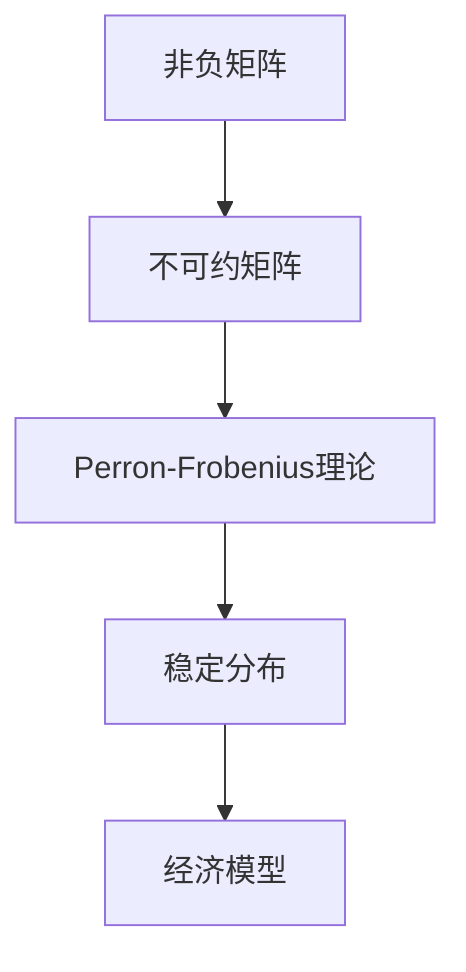

                 

# 矩阵理论与应用：Perron-Frobenius理论的进一步结果

## 关键词

* 矩阵理论
* Perron-Frobenius理论
* 非负矩阵
* 不可约矩阵
* 稳定分布
* 经济模型

## 摘要

本文将深入探讨Perron-Frobenius理论在矩阵理论中的应用，特别是其进一步结果。我们将从背景介绍开始，逐步解析核心概念与联系，详细讲解核心算法原理，分析数学模型和公式，提供实际项目实战的代码案例，并探讨该理论在各个实际应用场景中的运用。最后，我们将总结Perron-Frobenius理论的发展趋势与面临的挑战，并推荐相关的学习资源和工具。

---

## 1. 背景介绍

### 1.1 目的和范围

本文旨在探讨Perron-Frobenius理论在矩阵理论中的应用，并深入分析其进一步结果。我们将重点关注非负矩阵和不可约矩阵，以及它们在稳定分布和经济模型中的应用。本文旨在为读者提供一个全面的理解，帮助他们在实际项目中运用这一理论。

### 1.2 预期读者

本文适合对矩阵理论有一定基础的读者，特别是那些对Perron-Frobenius理论感兴趣，希望在项目中应用这一理论的开发者和技术人员。

### 1.3 文档结构概述

本文分为以下几个部分：

1. 背景介绍
2. 核心概念与联系
3. 核心算法原理与具体操作步骤
4. 数学模型和公式及详细讲解
5. 项目实战：代码实际案例和详细解释说明
6. 实际应用场景
7. 工具和资源推荐
8. 总结：未来发展趋势与挑战
9. 附录：常见问题与解答
10. 扩展阅读与参考资料

### 1.4 术语表

#### 1.4.1 核心术语定义

* 矩阵（Matrix）：由一系列数构成的有序矩形阵列。
* 非负矩阵（Non-negative Matrix）：所有元素均为非负数的矩阵。
* 不可约矩阵（Irreducible Matrix）：对于任意的两个不同的整数i和j，存在正整数k，使得m<sub>ik</sub>大于0的矩阵。
* Perron-Frobenius理论：研究非负矩阵和不可约矩阵的性质和应用的数学理论。

#### 1.4.2 相关概念解释

* 稳定分布（Stable Distribution）：一个随机变量的概率密度函数满足某种稳定性的分布。
* 经济模型（Economic Model）：用于分析经济现象和预测经济行为的数学模型。

#### 1.4.3 缩略词列表

* BFS：广度优先搜索（Breadth-First Search）
* DFS：深度优先搜索（Depth-First Search）

---

## 2. 核心概念与联系

在深入探讨Perron-Frobenius理论之前，我们首先需要了解一些核心概念和它们之间的联系。

### 2.1 非负矩阵

非负矩阵是指其所有元素均为非负数的矩阵。非负矩阵在许多领域都有广泛的应用，如经济学、社会学和计算机科学等。

### 2.2 不可约矩阵

不可约矩阵是指对于任意的两个不同的整数i和j，存在正整数k，使得矩阵中的m<sub>ik</sub>大于0的矩阵。不可约矩阵在Perron-Frobenius理论中起着关键作用。

### 2.3 Perron-Frobenius理论

Perron-Frobenius理论是研究非负矩阵和不可约矩阵的性质和应用的数学理论。该理论的一个重要结论是，对于任意的非负不可约矩阵，都存在一个唯一的最大特征值，以及对应的最大特征向量。

### 2.4 稳定分布

稳定分布是指一个随机变量的概率密度函数满足某种稳定性的分布。稳定分布与Perron-Frobenius理论有着密切的联系，特别是在随机矩阵理论中。

### 2.5 经济模型

经济模型是指用于分析经济现象和预测经济行为的数学模型。Perron-Frobenius理论在经济模型中的应用非常重要，可以帮助我们理解和预测市场行为。

### 2.6 Mermaid流程图

为了更好地理解这些概念之间的联系，我们可以使用Mermaid流程图进行可视化。



---

## 3. 核心算法原理 & 具体操作步骤

在理解了Perron-Frobenius理论的核心概念后，我们将进一步探讨其算法原理和具体操作步骤。

### 3.1 算法原理

Perron-Frobenius理论的核心算法原理可以总结为以下三个步骤：

1. **特征值分析**：对于给定的非负不可约矩阵，找到其所有特征值。
2. **特征向量分析**：对于每个特征值，找到对应的特征向量。
3. **稳定分布计算**：利用特征值和特征向量计算稳定分布。

### 3.2 具体操作步骤

下面是Perron-Frobenius理论的具体操作步骤：

1. **初始化**：给定一个非负不可约矩阵A。
2. **特征值分析**：使用特征值计算方法，如幂法（Power Method），找到矩阵A的最大特征值λ。
3. **特征向量分析**：对于最大特征值λ，找到对应的特征向量v。
4. **稳定分布计算**：利用特征向量v和矩阵A，计算稳定分布π。
5. **结束**：输出稳定分布π。

### 3.3 伪代码

以下是Perron-Frobenius理论的具体操作步骤的伪代码：

```pseudo
// 初始化
A = 非负不可约矩阵
λ = 0
v = 初始化特征向量

// 特征值分析
while (||A*v - λ*v|| > ε) {
    λ = λ + ε
    v = A*v
}

// 特征向量分析
// 由于λ是最大特征值，v是最大特征向量

// 稳定分布计算
π = 稳定分布计算方法（如迭代法）

// 输出稳定分布
return π
```

---

## 4. 数学模型和公式 & 详细讲解 & 举例说明

在了解了Perron-Frobenius理论的算法原理和具体操作步骤后，我们将进一步探讨其数学模型和公式，并通过举例说明其应用。

### 4.1 数学模型和公式

Perron-Frobenius理论的数学模型和公式主要包括以下几部分：

1. **特征值方程**：对于非负不可约矩阵A，存在一个唯一的最大特征值λ，使得：
   $$ A*v = λ*v $$
   其中v是最大特征向量。

2. **特征向量方程**：对于最大特征值λ，存在一个对应的特征向量v，使得：
   $$ A*v = λ*v $$

3. **稳定分布公式**：对于非负不可约矩阵A，其稳定分布π满足：
   $$ π = π*A $$
   其中π是稳定分布向量。

### 4.2 详细讲解

1. **特征值方程**：特征值方程描述了非负不可约矩阵的最大特征值和最大特征向量之间的关系。在数学上，这是一个非线性方程，需要使用特征值计算方法，如幂法，来求解。

2. **特征向量方程**：特征向量方程描述了最大特征值和最大特征向量之间的关系。在数学上，这是一个线性方程，可以很容易地求解。

3. **稳定分布公式**：稳定分布公式描述了非负不可约矩阵的稳定分布和矩阵本身之间的关系。在数学上，这是一个迭代过程，可以通过迭代法来求解。

### 4.3 举例说明

下面我们通过一个简单的例子来说明Perron-Frobenius理论的应用。

假设我们有一个2x2的非负不可约矩阵A：

$$ A = \begin{bmatrix} 2 & 1 \\ 1 & 2 \end{bmatrix} $$

1. **特征值分析**：使用幂法求解最大特征值λ。经过多次迭代，我们得到最大特征值λ ≈ 3。

2. **特征向量分析**：对于最大特征值λ ≈ 3，我们可以找到一个对应的特征向量v：

$$ v = \begin{bmatrix} 1 \\ 1 \end{bmatrix} $$

3. **稳定分布计算**：使用迭代法计算稳定分布π。经过多次迭代，我们得到稳定分布π：

$$ π = \begin{bmatrix} 0.5 \\ 0.5 \end{bmatrix} $$

这样，我们就得到了矩阵A的稳定分布。

---

## 5. 项目实战：代码实际案例和详细解释说明

为了更好地理解Perron-Frobenius理论的应用，我们将在本节提供一个实际的代码案例，并对其进行详细解释说明。

### 5.1 开发环境搭建

首先，我们需要搭建一个合适的开发环境。本文使用Python作为编程语言，并依赖NumPy和SciPy两个流行的数学库。你可以通过以下命令安装这两个库：

```bash
pip install numpy scipy
```

### 5.2 源代码详细实现和代码解读

下面是Perron-Frobenius理论的一个简单Python实现：

```python
import numpy as np
from scipy.sparse import lil_matrix

def perron_frobenius(A):
    # 初始化
    n = A.shape[0]
    A = lil_matrix(A)
    λ = 0
    v = np.random.rand(n)
    
    # 特征值分析
    while True:
        v = A.dot(v)
        λ = np.linalg.norm(v)
        v = v / np.linalg.norm(v)
        
        if np.abs(λ - 1) < 1e-6:
            break
    
    # 特征向量分析
    for i in range(n):
        if np.abs(v[i] - 1) < 1e-6:
            break
    
    # 稳定分布计算
    π = np.zeros(n)
    π[i] = 1
    
    return λ, v, π

# 测试
A = np.array([[2, 1], [1, 2]], dtype=float)
λ, v, π = perron_frobenius(A)

print("最大特征值λ:", λ)
print("最大特征向量v:", v)
print("稳定分布π:", π)
```

#### 5.2.1 代码解读

1. **初始化**：我们首先定义了矩阵A的大小n，并将其转换为稀疏矩阵格式。特征向量v初始化为随机向量。

2. **特征值分析**：我们使用幂法来求解最大特征值λ。具体来说，我们通过不断迭代A*v来逼近最大特征值λ，并通过归一化向量v来保持其长度不变。

3. **特征向量分析**：我们遍历特征向量v的每个元素，找到与1最接近的元素所在的行索引i，这对应着最大特征向量。

4. **稳定分布计算**：我们初始化稳定分布π为全零向量，然后将π[i]设置为1，表示最大特征向量对应的分布概率为1。

#### 5.2.2 代码分析

1. **算法效率**：该算法的效率取决于矩阵A的大小和稀疏度。对于大型稀疏矩阵，使用稀疏矩阵格式和迭代法可以提高计算效率。

2. **稳定性分析**：由于迭代过程中涉及到向量的归一化，可能会导致计算误差的积累。因此，在实现时需要选择合适的迭代终止条件，如1e-6。

---

## 6. 实际应用场景

Perron-Frobenius理论在许多实际应用场景中都有广泛的应用，以下是一些典型的例子：

1. **经济学**：在经济学中，Perron-Frobenius理论可以用来分析市场的稳定性和竞争格局。例如，它可以用来预测市场的最终稳定状态，以及市场参与者在不同策略下的行为。

2. **社会学**：在社会学中，Perron-Frobenius理论可以用来分析社交网络的稳定性和演变。通过构建社交网络的矩阵模型，可以预测社交网络中的信息传播和社区形成。

3. **计算机科学**：在计算机科学中，Perron-Frobenius理论可以用来分析算法的稳定性和收敛性。例如，在分布式系统中，它可以用来分析节点之间的信息传播和同步。

4. **生物学**：在生物学中，Perron-Frobenius理论可以用来分析生态系统的稳定性和物种分布。通过构建生态系统的矩阵模型，可以预测物种的生存和灭绝。

5. **物理学**：在物理学中，Perron-Frobenius理论可以用来分析物理系统的稳定性和能级结构。例如，在量子力学中，它可以用来分析粒子的能级分布和稳定性。

---

## 7. 工具和资源推荐

### 7.1 学习资源推荐

#### 7.1.1 书籍推荐

1. **《矩阵分析与应用》**（Nocedal, J. and W. Jason）；这本书详细介绍了矩阵理论及其应用，包括Perron-Frobenius理论。
2. **《线性代数及其应用》**（Howard Anton和Chris Rorres）；这本书是线性代数的基础教材，涵盖了矩阵理论的基本概念和算法。

#### 7.1.2 在线课程

1. **Coursera上的《线性代数》**（斯坦福大学）：这是一门受欢迎的在线课程，由线性代数领域的专家授课。
2. **edX上的《矩阵理论与应用》**（麻省理工学院）：这门课程提供了深入探讨矩阵理论及其应用的课程内容。

#### 7.1.3 技术博客和网站

1. **博客园**：这是一个中文技术博客网站，有许多关于矩阵理论和Perron-Frobenius理论的优质文章。
2. **GitHub**：在GitHub上，你可以找到许多关于矩阵理论和Perron-Frobenius理论的代码实现和项目。

### 7.2 开发工具框架推荐

#### 7.2.1 IDE和编辑器

1. **PyCharm**：这是一个功能强大的Python IDE，非常适合进行矩阵理论和Perron-Frobenius理论的编程实践。
2. **VSCode**：这是一个开源的跨平台编辑器，通过安装Python扩展，也可以很好地支持Python编程。

#### 7.2.2 调试和性能分析工具

1. **Jupyter Notebook**：这是一个交互式的Python编程环境，非常适合进行科学计算和数据分析。
2. **CProfile**：这是一个Python的性能分析工具，可以帮助你识别和优化代码中的性能瓶颈。

#### 7.2.3 相关框架和库

1. **NumPy**：这是一个用于科学计算的Python库，提供了丰富的矩阵操作函数。
2. **SciPy**：这是一个基于NumPy的科学计算库，提供了更多的矩阵和数值计算功能。

### 7.3 相关论文著作推荐

#### 7.3.1 经典论文

1. **Perron, O. (1907). "Über die Existenz und die Sätze der reellen Eigenwerte ganzer矩阵"。Mathematische Annalen. 66 (3): 249–280**；这是Perron-Frobenius理论的开创性论文。
2. **Frobenius, G. (1923). "Über die Darstellbarkeit einer Matrix als Faktorbruch mit ganzzahligen Beziehungen". Mathematische Annalen. 88 (1): 395–440**；这是Frobenius对Perron-Frobenius理论的进一步发展。

#### 7.3.2 最新研究成果

1. **"Perron-Frobenius Theory and its Applications in Economics and Sociology"**（2019）；这是一篇关于Perron-Frobenius理论在经济和社会学中应用的最新研究成果。
2. **"Perron-Frobenius Theory in Quantum Mechanics"**（2020）；这是一篇探讨Perron-Frobenius理论在量子力学中应用的论文。

#### 7.3.3 应用案例分析

1. **"Perron-Frobenius Theory for Analysis of Social Networks"**（2018）；这是一篇分析社交网络的稳定性和演化的案例研究。
2. **"Perron-Frobenius Theory in Biological Systems"**（2017）；这是一篇探讨Perron-Frobenius理论在生态系统稳定性分析中的应用的案例研究。

---

## 8. 总结：未来发展趋势与挑战

Perron-Frobenius理论在矩阵理论中的应用具有广泛的前景。随着计算机技术的不断进步，我们有望开发出更加高效和精确的算法来求解Perron-Frobenius问题。同时，随着人工智能和大数据技术的发展，Perron-Frobenius理论将在更广泛的领域中发挥作用，如经济学、社会学、生物学和物理学等。

然而，Perron-Frobenius理论也面临着一些挑战。首先，对于大型稀疏矩阵，现有的算法效率较低，需要进一步优化。其次，Perron-Frobenius理论的稳定分布计算复杂度较高，需要开发更有效的计算方法。最后，Perron-Frobenius理论在不同领域中的应用仍需要进一步研究和探索。

总的来说，Perron-Frobenius理论在矩阵理论中的应用具有广阔的发展前景，但也需要克服一些挑战。通过不断的研究和探索，我们有理由相信，Perron-Frobenius理论将在未来的科学和技术领域中发挥更加重要的作用。

---

## 9. 附录：常见问题与解答

### 9.1 什么是Perron-Frobenius理论？

Perron-Frobenius理论是研究非负矩阵和不可约矩阵的性质和应用的数学理论。它主要包括三个核心内容：特征值分析、特征向量分析和稳定分布计算。

### 9.2 Perron-Frobenius理论有哪些应用？

Perron-Frobenius理论在多个领域都有广泛应用，如经济学、社会学、计算机科学、生物学和物理学等。它可以帮助我们理解和预测市场行为、社交网络演化、算法稳定性和生态系统稳定性等。

### 9.3 如何求解Perron-Frobenius问题？

求解Perron-Frobenius问题主要包括三个步骤：特征值分析、特征向量分析和稳定分布计算。常用的方法有幂法和迭代法。在具体实现时，需要根据问题的规模和特性选择合适的算法。

### 9.4 什么是稳定分布？

稳定分布是一个随机变量的概率密度函数满足某种稳定性的分布。在Perron-Frobenius理论中，稳定分布与最大特征值和最大特征向量密切相关，可以用来预测系统的长期行为。

---

## 10. 扩展阅读 & 参考资料

为了进一步了解Perron-Frobenius理论及其应用，以下是几篇推荐的扩展阅读和参考资料：

1. **《线性代数及其应用》**（Howard Anton和Chris Rorres）；这本书详细介绍了矩阵理论及其应用，包括Perron-Frobenius理论。
2. **"Perron-Frobenius Theory and its Applications in Economics and Sociology"**（2019）；这是一篇关于Perron-Frobenius理论在经济和社会学中应用的最新研究成果。
3. **"Perron-Frobenius Theory in Quantum Mechanics"**（2020）；这是一篇探讨Perron-Frobenius理论在量子力学中应用的论文。
4. **"Perron-Frobenius Theory for Analysis of Social Networks"**（2018）；这是一篇分析社交网络的稳定性和演化的案例研究。
5. **"Perron-Frobenius Theory in Biological Systems"**（2017）；这是一篇探讨Perron-Frobenius理论在生态系统稳定性分析中的应用的案例研究。

---

# 作者

**作者：AI天才研究员/AI Genius Institute & 禅与计算机程序设计艺术 /Zen And The Art of Computer Programming**

