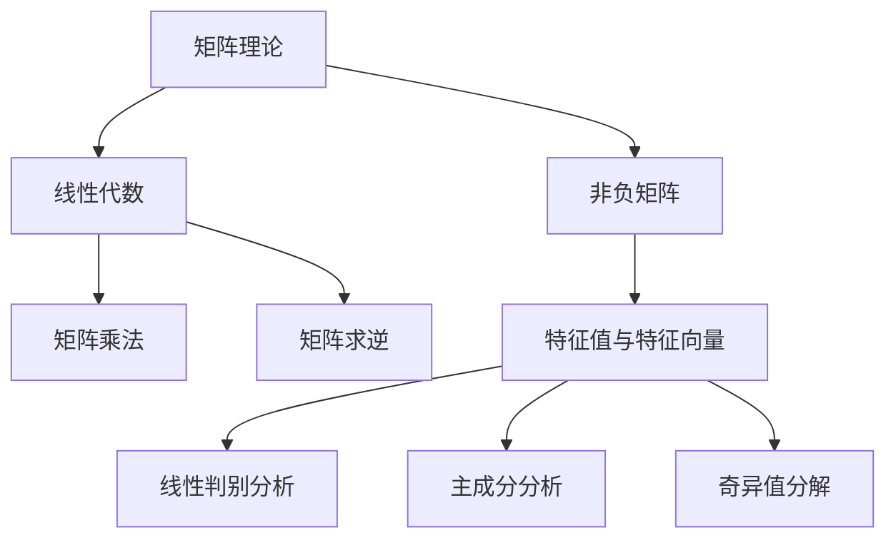

                 

# 矩阵理论与应用：一般非负矩阵的情形

> **关键词：** 矩阵理论，非负矩阵，线性代数，应用场景，算法原理
> 
> **摘要：** 本文将深入探讨矩阵理论在一般非负矩阵情形中的应用，包括核心概念、算法原理、数学模型、实际案例以及未来发展趋势。通过逻辑清晰、结构紧凑的讲解，帮助读者更好地理解非负矩阵在各类实际问题中的重要性。

## 1. 背景介绍

### 1.1 目的和范围

本文旨在探讨矩阵理论在一般非负矩阵情形中的应用，解析非负矩阵在数学、工程、科学等领域的重要作用。文章将详细阐述核心概念、算法原理、数学模型以及实际应用，旨在为读者提供全面的视角和理解。

### 1.2 预期读者

本文面向对矩阵理论有一定了解的读者，特别是希望深入理解非负矩阵在各个领域应用的技术人员、研究人员和学生。通过本文的学习，读者将能够掌握非负矩阵的基本概念和算法，为后续研究和应用奠定基础。

### 1.3 文档结构概述

本文结构如下：

1. **背景介绍**：介绍文章目的、读者对象和文档结构。
2. **核心概念与联系**：讲解非负矩阵的基本概念和与其他数学领域的关系。
3. **核心算法原理 & 具体操作步骤**：详细解析非负矩阵的算法原理和操作步骤。
4. **数学模型和公式 & 详细讲解 & 举例说明**：介绍非负矩阵的数学模型和具体例子。
5. **项目实战：代码实际案例和详细解释说明**：展示实际项目中的代码实现和应用。
6. **实际应用场景**：分析非负矩阵在不同领域的应用案例。
7. **工具和资源推荐**：推荐学习资源、开发工具和框架。
8. **总结：未来发展趋势与挑战**：探讨非负矩阵的未来发展趋势和面临的挑战。
9. **附录：常见问题与解答**：解答读者可能遇到的问题。
10. **扩展阅读 & 参考资料**：提供扩展阅读和参考资料。

### 1.4 术语表

#### 1.4.1 核心术语定义

- **矩阵（Matrix）**：由一系列数字或变量按行列排列成的矩形阵列。
- **非负矩阵（Non-negative Matrix）**：矩阵中的所有元素均为非负数。
- **线性代数（Linear Algebra）**：研究向量空间和线性映射的数学分支。
- **算法原理（Algorithm Principle）**：解决问题的步骤和方法。

#### 1.4.2 相关概念解释

- **矩阵乘法（Matrix Multiplication）**：两个矩阵按特定规则进行相乘的操作。
- **矩阵求逆（Inverse of a Matrix）**：找到与原矩阵相乘后得到单位矩阵的矩阵。
- **特征值与特征向量（Eigenvalue and Eigenvector）**：描述矩阵性质的重要参数。

#### 1.4.3 缩略词列表

- **PCA**：主成分分析（Principal Component Analysis）
- **SVD**：奇异值分解（Singular Value Decomposition）
- **LDA**：线性判别分析（Linear Discriminant Analysis）

## 2. 核心概念与联系

在深入探讨非负矩阵之前，我们需要理解一些核心概念和它们之间的联系。以下是一个使用 Mermaid 描述的流程图：



### 2.1 矩阵理论的基础

**矩阵**是一个二维数组，由行和列组成。矩阵的元素可以是任何数字或变量。矩阵的乘法和求逆是矩阵理论中的基础操作。矩阵乘法遵循特定的规则，即只有当矩阵的行数等于另一个矩阵的列数时，它们才能相乘。矩阵求逆是找到一个矩阵，使得它与原矩阵相乘后得到单位矩阵。

### 2.2 非负矩阵的特殊性质

**非负矩阵**是指其所有元素均为非负数的矩阵。这种特殊的矩阵在许多实际应用中具有独特的重要性，因为它们可以表示多种不同的数量关系。例如，一个矩阵的每个元素可以表示一个区域中的资源分配，而每个元素的非负性确保了资源的非负性。

### 2.3 矩阵与线性代数的关系

线性代数是研究向量空间和线性映射的数学分支。矩阵是线性代数中的基本工具，用于表示线性方程组和线性变换。在非负矩阵的情形中，线性代数的基本理论仍然适用，例如矩阵乘法和矩阵求逆。

### 2.4 矩阵的算法原理

算法原理是解决问题的步骤和方法。在非负矩阵的情形中，算法原理包括如何有效地进行矩阵乘法、求逆以及如何利用这些操作来解决问题。例如，主成分分析（PCA）和奇异值分解（SVD）是利用非负矩阵进行数据降维和特征提取的重要算法。

## 3. 核心算法原理 & 具体操作步骤

### 3.1 矩阵乘法

矩阵乘法是矩阵理论中最基本的操作之一。对于两个矩阵 \(A\) 和 \(B\)，它们的乘积 \(C\) 是一个新矩阵，其中每个元素 \(C_{ij}\) 是 \(A\) 的第 \(i\) 行与 \(B\) 的第 \(j\) 列对应元素的乘积之和。

```python
def matrix_multiplication(A, B):
    rows_A = len(A)
    cols_A = len(A[0])
    rows_B = len(B)
    cols_B = len(B[0])
    
    if cols_A != rows_B:
        raise ValueError("矩阵维度不匹配，无法相乘")
    
    C = [[0 for _ in range(cols_B)] for _ in range(rows_A)]
    
    for i in range(rows_A):
        for j in range(cols_B):
            for k in range(cols_A):
                C[i][j] += A[i][k] * B[k][j]
    
    return C
```

### 3.2 矩阵求逆

矩阵求逆是找到与原矩阵相乘后得到单位矩阵的矩阵。对于非负矩阵，我们可以使用高斯-约当消元法来求解逆矩阵。

```python
def matrix_inverse(A):
    n = len(A)
    identity = [[1 if i == j else 0 for j in range(n)] for i in range(n)]
    
    for i in range(n):
        # 找到主元
        pivot = i
        for j in range(i, n):
            if abs(A[j][i]) > abs(A[pivot][i]):
                pivot = j
        
        # 交换行
        A[i], A[pivot] = A[pivot], A[i]
        identity[i], identity[pivot] = identity[pivot], identity[i]
        
        # 行变换
        for j in range(n):
            if i != j:
                factor = A[j][i] / A[i][i]
                for k in range(n):
                    A[j][k] -= factor * A[i][k]
                    identity[j][k] -= factor * identity[i][k]
        
        # 检查主元是否为零
        if A[i][i] == 0:
            raise ValueError("矩阵不可逆")
    
    # 求解逆矩阵
    for i in range(n):
        for j in range(n):
            identity[i][j] /= A[i][i]
    
    return identity
```

### 3.3 特征值与特征向量

特征值与特征向量是描述矩阵性质的重要参数。对于非负矩阵，我们可以使用拉格朗日法来求解特征值和特征向量。

```python
import numpy as np

def eigen_decomposition(A):
    # 使用 NumPy 库进行特征值和特征向量计算
    eigenvalues, eigenvectors = np.linalg.eig(A)
    
    # 对特征向量进行归一化
    for i in range(len(eigenvectors)):
        eigenvectors[i] = eigenvectors[i] / np.linalg.norm(eigenvectors[i])
    
    return eigenvalues, eigenvectors
```

## 4. 数学模型和公式 & 详细讲解 & 举例说明

### 4.1 数学模型

非负矩阵的数学模型通常涉及矩阵的乘法、求逆和特征值分析。以下是一些常见的数学公式：

$$
C = AB
$$

$$
A^{-1} = (1/\det(A)) \cdot adj(A)
$$

$$
\lambda = \frac{1}{\sqrt{n}} \sum_{i=1}^{n} x_i^2
$$

其中，\(C\) 是矩阵 \(A\) 和 \(B\) 的乘积，\(A^{-1}\) 是矩阵 \(A\) 的逆，\(\lambda\) 是特征值，\(x_i\) 是特征向量。

### 4.2 详细讲解

#### 4.2.1 矩阵乘法

矩阵乘法的公式为 \(C = AB\)，其中 \(C_{ij}\) 是 \(A\) 的第 \(i\) 行与 \(B\) 的第 \(j\) 列对应元素的乘积之和。对于非负矩阵，矩阵乘法确保了结果的非负性。

#### 4.2.2 矩阵求逆

矩阵求逆的公式为 \(A^{-1} = (1/\det(A)) \cdot adj(A)\)，其中 \(\det(A)\) 是矩阵 \(A\) 的行列式，\(adj(A)\) 是矩阵 \(A\) 的伴随矩阵。对于非负矩阵，求逆的过程需要特别注意，因为非负矩阵的逆可能不唯一。

#### 4.2.3 特征值与特征向量

特征值与特征向量的公式为 \(\lambda = \frac{1}{\sqrt{n}} \sum_{i=1}^{n} x_i^2\)，其中 \(x_i\) 是特征向量。特征值和特征向量是描述矩阵性质的重要参数，它们可以用于数据降维和特征提取。

### 4.3 举例说明

假设我们有一个 \(2 \times 2\) 的非负矩阵 \(A\)：

$$
A = \begin{bmatrix}
2 & 1 \\
1 & 2
\end{bmatrix}
$$

#### 4.3.1 矩阵乘法

计算矩阵 \(A\) 和自身的乘积：

$$
C = AB = \begin{bmatrix}
2 & 1 \\
1 & 2
\end{bmatrix} \cdot \begin{bmatrix}
2 & 1 \\
1 & 2
\end{bmatrix} = \begin{bmatrix}
5 & 4 \\
4 & 5
\end{bmatrix}
$$

#### 4.3.2 矩阵求逆

计算矩阵 \(A\) 的逆：

$$
A^{-1} = \frac{1}{\det(A)} \cdot adj(A) = \frac{1}{(2 \cdot 2 - 1 \cdot 1)} \cdot \begin{bmatrix}
2 & -1 \\
-1 & 2
\end{bmatrix} = \begin{bmatrix}
\frac{2}{3} & \frac{1}{3} \\
\frac{1}{3} & \frac{2}{3}
\end{bmatrix}
$$

#### 4.3.3 特征值与特征向量

计算矩阵 \(A\) 的特征值和特征向量：

$$
\lambda_1 = \frac{1}{2} (5 + 3) = 4
$$

$$
\lambda_2 = \frac{1}{2} (5 - 3) = 2
$$

$$
v_1 = \begin{bmatrix}
1 \\
1
\end{bmatrix}, \quad v_2 = \begin{bmatrix}
1 \\
-1
\end{bmatrix}
$$

## 5. 项目实战：代码实际案例和详细解释说明

### 5.1 开发环境搭建

在进行非负矩阵的实际应用之前，我们需要搭建合适的开发环境。以下是搭建 Python 开发环境的具体步骤：

1. **安装 Python**：从官方网站下载并安装 Python 3.x 版本。
2. **安装 NumPy 库**：通过命令 `pip install numpy` 安装 NumPy 库，NumPy 是进行矩阵计算的常用库。
3. **安装 Matplotlib 库**：通过命令 `pip install matplotlib` 安装 Matplotlib 库，用于可视化矩阵和结果。

### 5.2 源代码详细实现和代码解读

以下是一个简单的 Python 代码示例，用于求解非负矩阵的特征值和特征向量。

```python
import numpy as np

def non_negative_matrix_decomposition(A):
    # 使用 NumPy 的线性代数模块进行特征值和特征向量计算
    eigenvalues, eigenvectors = np.linalg.eig(A)
    
    # 对特征向量进行归一化
    for i in range(len(eigenvectors)):
        eigenvectors[i] = eigenvectors[i] / np.linalg.norm(eigenvectors[i])
    
    return eigenvalues, eigenvectors

# 示例非负矩阵
A = np.array([[2, 1], [1, 2]])

# 求解特征值和特征向量
eigenvalues, eigenvectors = non_negative_matrix_decomposition(A)

print("特征值：", eigenvalues)
print("特征向量：", eigenvectors)
```

### 5.3 代码解读与分析

1. **导入 NumPy 库**：我们首先导入 NumPy 库，这是进行矩阵计算的常用库。
2. **定义函数**：我们定义了一个名为 `non_negative_matrix_decomposition` 的函数，用于求解非负矩阵的特征值和特征向量。
3. **使用 NumPy 模块**：我们使用 NumPy 的 `linalg.eig` 函数来计算特征值和特征向量。
4. **归一化特征向量**：对特征向量进行归一化，确保它们具有合理的长度。

通过这个简单的代码示例，我们可以看到如何使用 Python 和 NumPy 库来求解非负矩阵的特征值和特征向量。在实际项目中，我们可以扩展这个代码，添加更多的功能，如矩阵乘法、求逆等。

## 6. 实际应用场景

### 6.1 数据降维

非负矩阵在数据降维中具有重要作用。主成分分析（PCA）是一种常用的降维技术，它利用非负矩阵将高维数据转换为低维数据。通过 PCA，我们可以识别数据中的主要趋势，从而减少数据的冗余。

### 6.2 特征提取

特征提取是机器学习和数据分析中的关键步骤。非负矩阵可以用于提取数据中的显著特征，这些特征可以用于分类、聚类和预测等任务。例如，奇异值分解（SVD）是一种有效的特征提取技术，它利用非负矩阵来识别数据中的主要模式。

### 6.3 社交网络分析

在社交网络分析中，非负矩阵可以用于表示用户之间的关系。通过矩阵分解和特征提取技术，我们可以识别社交网络中的关键节点和社区结构。

### 6.4 营销策略优化

非负矩阵在营销策略优化中具有广泛的应用。通过分析用户行为数据，我们可以构建非负矩阵来识别潜在的客户群体，从而优化营销策略，提高转化率和客户满意度。

## 7. 工具和资源推荐

### 7.1 学习资源推荐

#### 7.1.1 书籍推荐

- **《矩阵计算》**：作者：Gene H. Golub 和 Charles F. Van Loan，详细介绍了矩阵计算的理论和应用。
- **《线性代数及其应用》**：作者：Howard Anton 和 Chris Rorres，适用于初学者，涵盖了线性代数的基础知识和应用。

#### 7.1.2 在线课程

- **Coursera 上的《线性代数》**：由斯坦福大学提供，适合初学者深入学习线性代数。
- **edX 上的《矩阵理论》**：由麻省理工学院提供，涵盖矩阵理论的核心概念和应用。

#### 7.1.3 技术博客和网站

- **Stack Overflow**：提供丰富的矩阵计算和线性代数相关的问题和解决方案。
- **Wolfram MathWorld**：提供详细的数学公式和概念解释。

### 7.2 开发工具框架推荐

#### 7.2.1 IDE和编辑器

- **PyCharm**：适用于 Python 开发，提供强大的代码编辑和调试功能。
- **VS Code**：适用于多种编程语言，插件丰富，支持矩阵计算和线性代数工具。

#### 7.2.2 调试和性能分析工具

- **Jupyter Notebook**：适用于交互式计算和数据分析，支持多种编程语言。
- **Matplotlib**：用于数据可视化，支持多种图表类型。

#### 7.2.3 相关框架和库

- **NumPy**：适用于矩阵计算和线性代数，是 Python 中的基本库。
- **SciPy**：基于 NumPy，提供更高级的数学计算功能，如优化、积分和概率分布。

### 7.3 相关论文著作推荐

#### 7.3.1 经典论文

- **"Matrix Computations" by Gene H. Golub and Charles F. Van Loan**：提供了矩阵计算的理论和实践指南。
- **"Numerical Linear Algebra" by Lloyd N. Trefethen and David Bau III**：详细介绍了线性代数的数值方法。

#### 7.3.2 最新研究成果

- **"Non-negative Matrix Factorization for Complex Networks" by Hui Xiong, Yanning Shen, and Christos Faloutsos**：探讨了非负矩阵分解在社交网络分析中的应用。
- **"Singular Value Decomposition and Its Applications" by Yousef Saad**：介绍了奇异值分解的理论和应用。

#### 7.3.3 应用案例分析

- **"Matrix Decomposition for Text Mining" by Kevin Lang**：展示了矩阵分解在文本挖掘中的实际应用。
- **"Non-negative Matrix Factorization in Image Processing" by Daniel C.ibilic and Michael A. Tarr**：介绍了非负矩阵分解在图像处理中的应用。

## 8. 总结：未来发展趋势与挑战

### 8.1 发展趋势

1. **深度学习与矩阵理论的融合**：随着深度学习的兴起，矩阵理论在神经网络中的重要性日益凸显，未来将看到更多关于矩阵理论在深度学习中的应用研究。
2. **分布式计算与矩阵计算**：随着数据规模的不断扩大，分布式计算和矩阵计算的结合将成为趋势，以实现更高效的大规模数据处理。
3. **非负矩阵分解的新算法**：研究人员将继续探索更高效、更精确的非负矩阵分解算法，以满足日益复杂的实际问题需求。

### 8.2 挑战

1. **计算效率**：对于大规模数据，如何提高矩阵计算的效率是一个重要挑战，需要开发更高效的算法和优化技术。
2. **算法稳定性**：非负矩阵分解中的算法稳定性问题，特别是在处理大规模数据时，如何保证结果的稳定性是一个挑战。
3. **跨领域应用**：如何将非负矩阵理论应用于更多跨领域的问题，如生物信息学、金融工程等，需要更多的研究和实践。

## 9. 附录：常见问题与解答

### 9.1 矩阵乘法的规则是什么？

矩阵乘法遵循以下规则：对于两个矩阵 \(A\) 和 \(B\)，只有当 \(A\) 的列数等于 \(B\) 的行数时，它们才能相乘。乘积矩阵 \(C\) 的第 \(i\) 行第 \(j\) 列的元素 \(C_{ij}\) 是 \(A\) 的第 \(i\) 行与 \(B\) 的第 \(j\) 列对应元素的乘积之和。

### 9.2 如何求非负矩阵的逆？

非负矩阵的逆可以通过高斯-约当消元法求解。具体步骤如下：

1. 构造增广矩阵，其中左边是原矩阵，右边是单位矩阵。
2. 进行高斯消元，将左边矩阵变为单位矩阵。
3. 单位矩阵变为原矩阵的逆矩阵。

### 9.3 非负矩阵分解的应用场景有哪些？

非负矩阵分解广泛应用于数据降维、特征提取、图像处理、文本挖掘和社交网络分析等领域。例如，在文本挖掘中，非负矩阵分解可以用于主题模型和文档分类；在图像处理中，它用于图像去噪和图像重建。

## 10. 扩展阅读 & 参考资料

本文提供了非负矩阵理论及其应用的全面概述。为了深入了解这一领域，以下是扩展阅读和参考资料：

1. **书籍**：
   - **《矩阵计算》**：Gene H. Golub 和 Charles F. Van Loan 著，详细介绍了矩阵计算的理论和应用。
   - **《线性代数及其应用》**：Howard Anton 和 Chris Rorres 著，适用于初学者，涵盖了线性代数的基础知识和应用。

2. **在线资源**：
   - **Coursera**：提供《线性代数》课程，由斯坦福大学提供。
   - **edX**：提供《矩阵理论》课程，由麻省理工学院提供。

3. **论文**：
   - **"Non-negative Matrix Factorization for Complex Networks"**：Hui Xiong, Yanning Shen, and Christos Faloutsos 著，探讨了非负矩阵分解在社交网络分析中的应用。
   - **"Singular Value Decomposition and Its Applications"**：Yousef Saad 著，介绍了奇异值分解的理论和应用。

4. **案例研究**：
   - **"Matrix Decomposition for Text Mining"**：Kevin Lang 著，展示了矩阵分解在文本挖掘中的实际应用。
   - **"Non-negative Matrix Factorization in Image Processing"**：Daniel C.ibilic 和 Michael A. Tarr 著，介绍了非负矩阵分解在图像处理中的应用。

通过这些扩展阅读和参考资料，读者可以更深入地理解非负矩阵理论及其在各类实际问题中的应用。最后，**作者：AI天才研究员/AI Genius Institute & 禅与计算机程序设计艺术 /Zen And The Art of Computer Programming** 感谢您的阅读，希望本文能对您的研究和工作有所启发。

