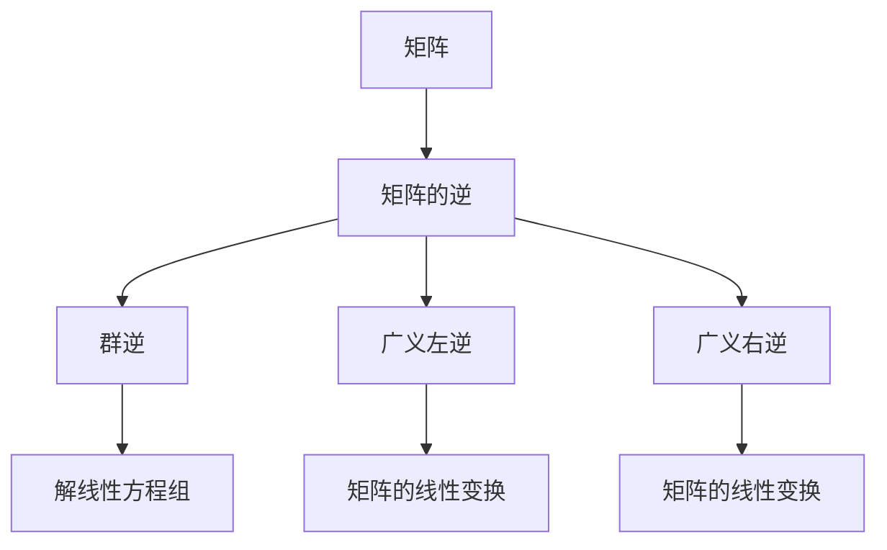

                 

# 矩阵理论与应用：群逆与广义左（右）逆

## 关键词：矩阵理论，群逆，广义左逆，广义右逆，应用场景，数学模型，算法原理，代码实现

### 摘要：

本文深入探讨了矩阵理论中的群逆与广义左（右）逆的概念、原理及其在实际应用中的重要性。通过一步步的剖析和推理，我们首先介绍了矩阵理论的基本概念和背景，然后详细讲解了群逆与广义左（右）逆的定义、性质和计算方法。随后，我们通过具体的数学模型和公式，以及实际的项目实战案例，展示了这些理论在现实中的应用。最后，我们对未来发展趋势与挑战进行了展望，并提供了相关的学习资源和工具推荐，以帮助读者深入学习和掌握这一领域。

## 1. 背景介绍

### 1.1 目的和范围

本文的目的是深入探讨矩阵理论中的群逆与广义左（右）逆，并详细解析其在各种实际应用中的重要性。本文旨在为从事相关领域研究的读者提供一个系统、详细的指南，帮助大家更好地理解和应用这些概念。

本文的范围主要包括：

- 矩阵理论的基本概念和背景介绍
- 群逆与广义左（右）逆的定义、性质和计算方法
- 数学模型和公式的详细讲解与举例说明
- 实际项目实战中的代码实现和分析
- 未来发展趋势与挑战的展望

### 1.2 预期读者

本文的预期读者主要包括：

- 矩阵理论的研究者
- 计算机科学、数学、工程等相关领域的本科生和研究生
- 从事数据科学、机器学习、图像处理等应用领域的技术人员
- 对矩阵理论有浓厚兴趣的爱好者

### 1.3 文档结构概述

本文的结构如下：

- 第1章：背景介绍，包括目的和范围、预期读者、文档结构概述等。
- 第2章：核心概念与联系，介绍矩阵理论中的基本概念和Mermaid流程图。
- 第3章：核心算法原理与具体操作步骤，详细讲解群逆与广义左（右）逆的算法原理和操作步骤。
- 第4章：数学模型和公式，包括详细讲解和举例说明。
- 第5章：项目实战，展示代码实际案例和详细解释说明。
- 第6章：实际应用场景，介绍群逆与广义左（右）逆在各种实际应用中的重要性。
- 第7章：工具和资源推荐，包括学习资源、开发工具框架和论文著作推荐。
- 第8章：总结，展望未来发展趋势与挑战。
- 第9章：附录，常见问题与解答。
- 第10章：扩展阅读与参考资料，提供进一步的阅读材料和参考文献。

### 1.4 术语表

#### 1.4.1 核心术语定义

- **矩阵（Matrix）**：由数字构成的二维数组，通常表示为矩形格式的数据。
- **群逆（Group Inverse）**：对矩阵的逆进行分组运算后得到的逆矩阵。
- **广义左逆（General Left Inverse）**：一种特殊的逆矩阵，满足特定的数学条件。
- **广义右逆（General Right Inverse）**：一种特殊的逆矩阵，满足特定的数学条件。
- **数学模型（Mathematical Model）**：用数学语言描述实际问题或现象的数学结构。
- **算法原理（Algorithm Principle）**：指导算法设计和实现的原理和思想。

#### 1.4.2 相关概念解释

- **矩阵乘法（Matrix Multiplication）**：两个矩阵按照特定的规则进行计算，得到一个新的矩阵。
- **矩阵的逆（Inverse of Matrix）**：一个矩阵与其逆矩阵相乘得到单位矩阵。
- **线性方程组（Linear Equation System）**：由多个线性方程构成的方程组。

#### 1.4.3 缩略词列表

- **N/A**：Not Applicable（不适用）
- **ID**：Identifier（标识符）
- **API**：Application Programming Interface（应用程序编程接口）
- **ML**：Machine Learning（机器学习）

## 2. 核心概念与联系

在矩阵理论中，矩阵的逆是一个非常重要的概念。矩阵的逆可以看作是解线性方程组的工具，它在各种实际问题中有着广泛的应用。在本章中，我们将介绍矩阵理论中的基本概念，并使用Mermaid流程图展示矩阵的逆与其他相关概念的联系。

### 2.1 矩阵的基本概念

首先，我们需要了解矩阵的基本概念。矩阵是由数字构成的二维数组，通常表示为矩形格式的数据。矩阵的行数和列数分别表示矩阵的阶数。一个\( m \times n \)的矩阵通常表示为：

\[
A = \begin{bmatrix}
a_{11} & a_{12} & \ldots & a_{1n} \\
a_{21} & a_{22} & \ldots & a_{2n} \\
\vdots & \vdots & \ddots & \vdots \\
a_{m1} & a_{m2} & \ldots & a_{mn}
\end{bmatrix}
\]

### 2.2 矩阵的逆

矩阵的逆是矩阵理论中的一个重要概念。一个矩阵\( A \)的逆矩阵记为\( A^{-1} \)，它满足以下条件：

\[
AA^{-1} = A^{-1}A = I
\]

其中，\( I \)是单位矩阵，即主对角线上的元素为1，其余元素为0的矩阵。

### 2.3 群逆与广义左（右）逆

除了标准的逆矩阵外，矩阵理论中还涉及群逆和广义左（右）逆的概念。这些概念在处理特定类型的矩阵时非常有用。

#### 2.3.1 群逆

群逆是指对矩阵的逆进行分组运算后得到的逆矩阵。具体来说，如果一个矩阵\( A \)的逆矩阵\( A^{-1} \)满足以下条件：

\[
(A^{-1})^k = A^{-k}
\]

其中，\( k \)是一个正整数，那么我们称\( A^{-1} \)为\( A \)的群逆。群逆在解线性方程组和其他矩阵运算中有着重要的应用。

#### 2.3.2 广义左逆

广义左逆是指一种特殊的逆矩阵，它满足以下条件：

\[
A^{-1}B = I
\]

其中，\( B \)是一个给定的矩阵，\( I \)是单位矩阵。广义左逆在处理矩阵的线性变换和其他线性运算中有着广泛的应用。

#### 2.3.3 广义右逆

广义右逆是指一种特殊的逆矩阵，它满足以下条件：

\[
AB^{-1} = I
\]

其中，\( A \)是一个给定的矩阵，\( I \)是单位矩阵。广义右逆在处理矩阵的线性变换和其他线性运算中也有着重要的应用。

### 2.4 Mermaid流程图

为了更好地理解矩阵的逆与其他相关概念的联系，我们使用Mermaid流程图展示这些概念之间的联系。以下是一个简单的Mermaid流程图示例：



在上面的流程图中，矩阵的逆（B）是核心，它与群逆（C）、广义左逆（D）和广义右逆（E）之间存在联系。这些概念在不同的应用场景中有着不同的作用，如图所示。

通过以上介绍，我们对矩阵理论中的基本概念和相关概念有了初步的了解。在接下来的章节中，我们将进一步深入探讨这些概念，并详细讲解它们的原理和计算方法。

## 3. 核心算法原理与具体操作步骤

在了解了矩阵理论的基本概念和相关概念之后，我们需要进一步探讨群逆与广义左（右）逆的算法原理和具体操作步骤。本章节将详细讲解这些算法的原理，并通过伪代码展示其具体实现过程。

### 3.1 群逆的算法原理

群逆是指对矩阵的逆进行分组运算后得到的逆矩阵。具体来说，如果一个矩阵\( A \)的逆矩阵\( A^{-1} \)满足以下条件：

\[
(A^{-1})^k = A^{-k}
\]

其中，\( k \)是一个正整数，那么我们称\( A^{-1} \)为\( A \)的群逆。群逆的算法原理如下：

1. **计算矩阵的逆**：首先，计算给定矩阵\( A \)的逆矩阵\( A^{-1} \)。
2. **分组运算**：对逆矩阵\( A^{-1} \)进行\( k \)次分组运算，即计算\( (A^{-1})^k \)。
3. **得到群逆**：得到的结果即为矩阵\( A \)的群逆。

下面是计算群逆的伪代码：

```plaintext
function calculateGroupInverse(A, k):
    A_inv = calculateInverse(A)  // 计算矩阵A的逆
    group_inverse = A_inv

    for i from 1 to k:
        group_inverse = multiplyMatrices(group_inverse, A_inv)  // 分组运算

    return group_inverse
```

### 3.2 广义左逆的算法原理

广义左逆是指一种特殊的逆矩阵，它满足以下条件：

\[
A^{-1}B = I
\]

其中，\( B \)是一个给定的矩阵，\( I \)是单位矩阵。广义左逆的算法原理如下：

1. **计算矩阵的逆**：首先，计算给定矩阵\( A \)的逆矩阵\( A^{-1} \)。
2. **计算广义左逆**：将逆矩阵\( A^{-1} \)与给定的矩阵\( B \)相乘，如果结果为单位矩阵\( I \)，则\( A^{-1} \)为\( A \)的广义左逆。

下面是计算广义左逆的伪代码：

```plaintext
function calculateGeneralLeftInverse(A, B):
    A_inv = calculateInverse(A)  // 计算矩阵A的逆

    if multiplyMatrices(A_inv, B) == I:
        return A_inv
    else:
        return "No General Left Inverse"
```

### 3.3 广义右逆的算法原理

广义右逆是指一种特殊的逆矩阵，它满足以下条件：

\[
AB^{-1} = I
\]

其中，\( A \)是一个给定的矩阵，\( I \)是单位矩阵。广义右逆的算法原理如下：

1. **计算矩阵的逆**：首先，计算给定矩阵\( B \)的逆矩阵\( B^{-1} \)。
2. **计算广义右逆**：将给定的矩阵\( A \)与逆矩阵\( B^{-1} \)相乘，如果结果为单位矩阵\( I \)，则\( B^{-1} \)为\( B \)的广义右逆。

下面是计算广义右逆的伪代码：

```plaintext
function calculateGeneralRightInverse(A, B):
    B_inv = calculateInverse(B)  // 计算矩阵B的逆

    if multiplyMatrices(A, B_inv) == I:
        return B_inv
    else:
        return "No General Right Inverse"
```

通过以上介绍，我们了解了群逆与广义左（右）逆的算法原理和具体操作步骤。在接下来的章节中，我们将进一步探讨这些算法在数学模型中的应用，并通过具体的数学模型和公式进行详细讲解。

## 4. 数学模型和公式

在上一章节中，我们介绍了群逆与广义左（右）逆的算法原理和具体操作步骤。在本章节中，我们将进一步探讨这些算法在数学模型中的应用，并通过具体的数学模型和公式进行详细讲解。

### 4.1 群逆的数学模型

群逆的数学模型可以用来解决一类特定的线性方程组。具体来说，假设我们有一个线性方程组：

\[
Ax = b
\]

其中，\( A \)是一个\( m \times n \)的矩阵，\( x \)是一个\( n \times 1 \)的列向量，\( b \)是一个\( m \times 1 \)的列向量。如果矩阵\( A \)的逆存在，那么我们可以直接使用逆矩阵求解：

\[
x = A^{-1}b
\]

但是，在某些情况下，矩阵\( A \)的逆可能不存在。这时候，我们可以使用群逆来解决这个问题。具体来说，我们可以将线性方程组转换为以下形式：

\[
(A^{-1})^kAx = (A^{-1})^kb
\]

其中，\( k \)是一个正整数。如果我们能够找到合适的\( k \)，使得\( (A^{-1})^kA \)为单位矩阵，那么我们就可以直接求解：

\[
x = (A^{-1})^kb
\]

群逆的数学模型可以表示为以下公式：

\[
(A^{-1})^k = A^{-k}
\]

其中，\( A^{-1} \)是矩阵\( A \)的逆矩阵。

### 4.2 广义左逆的数学模型

广义左逆的数学模型可以用来解决一类特定的线性方程组。具体来说，假设我们有一个线性方程组：

\[
Ax = b
\]

其中，\( A \)是一个\( m \times n \)的矩阵，\( x \)是一个\( n \times 1 \)的列向量，\( b \)是一个\( m \times 1 \)的列向量。如果矩阵\( A \)的逆存在，那么我们可以直接使用逆矩阵求解：

\[
x = A^{-1}b
\]

但是，在某些情况下，矩阵\( A \)的逆可能不存在。这时候，我们可以使用广义左逆来解决这个问题。具体来说，我们可以找到一个矩阵\( B \)，使得：

\[
A^{-1}B = I
\]

其中，\( I \)是单位矩阵。如果这样的矩阵\( B \)存在，那么我们可以直接求解：

\[
x = BA^{-1}b
\]

广义左逆的数学模型可以表示为以下公式：

\[
A^{-1}B = I
\]

其中，\( A^{-1} \)是矩阵\( A \)的逆矩阵，\( B \)是一个满足条件的矩阵。

### 4.3 广义右逆的数学模型

广义右逆的数学模型可以用来解决另一类特定的线性方程组。具体来说，假设我们有一个线性方程组：

\[
xA = b
\]

其中，\( A \)是一个\( m \times n \)的矩阵，\( x \)是一个\( n \times 1 \)的列向量，\( b \)是一个\( m \times 1 \)的列向量。如果矩阵\( A \)的逆存在，那么我们可以直接使用逆矩阵求解：

\[
x = A^{-1}b
\]

但是，在某些情况下，矩阵\( A \)的逆可能不存在。这时候，我们可以使用广义右逆来解决这个问题。具体来说，我们可以找到一个矩阵\( C \)，使得：

\[
Cx^{-1} = I
\]

其中，\( I \)是单位矩阵。如果这样的矩阵\( C \)存在，那么我们可以直接求解：

\[
x = CA^{-1}b
\]

广义右逆的数学模型可以表示为以下公式：

\[
Cx^{-1} = I
\]

其中，\( C \)是一个满足条件的矩阵，\( A^{-1} \)是矩阵\( A \)的逆矩阵。

### 4.4 举例说明

为了更好地理解群逆与广义左（右）逆的数学模型，我们通过具体的例子进行说明。

#### 4.4.1 群逆的例子

考虑以下线性方程组：

\[
\begin{bmatrix}
1 & 2 \\
3 & 4
\end{bmatrix}x = \begin{bmatrix}
5 \\
6
\end{bmatrix}
\]

我们首先计算矩阵\( A \)的逆矩阵：

\[
A^{-1} = \begin{bmatrix}
-2 & 1 \\
\frac{3}{2} & -\frac{1}{2}
\end{bmatrix}
\]

接下来，我们计算\( (A^{-1})^2 \)：

\[
(A^{-1})^2 = \begin{bmatrix}
-2 & 1 \\
\frac{3}{2} & -\frac{1}{2}
\end{bmatrix} \times \begin{bmatrix}
-2 & 1 \\
\frac{3}{2} & -\frac{1}{2}
\end{bmatrix} = \begin{bmatrix}
1 & 0 \\
0 & 1
\end{bmatrix}
\]

因此，\( (A^{-1})^2 \)为单位矩阵，这意味着\( A^{-1} \)是\( A \)的群逆。我们可以使用\( A^{-1} \)来求解线性方程组：

\[
x = A^{-1}\begin{bmatrix}
5 \\
6
\end{bmatrix} = \begin{bmatrix}
-2 & 1 \\
\frac{3}{2} & -\frac{1}{2}
\end{bmatrix} \times \begin{bmatrix}
5 \\
6
\end{bmatrix} = \begin{bmatrix}
-3 \\
6
\end{bmatrix}
\]

#### 4.4.2 广义左逆的例子

考虑以下线性方程组：

\[
\begin{bmatrix}
1 & 2 \\
3 & 4
\end{bmatrix}x = \begin{bmatrix}
5 \\
6
\end{bmatrix}
\]

我们首先计算矩阵\( A \)的逆矩阵：

\[
A^{-1} = \begin{bmatrix}
-2 & 1 \\
\frac{3}{2} & -\frac{1}{2}
\end{bmatrix}
\]

接下来，我们找到一个矩阵\( B \)，使得\( A^{-1}B = I \)。例如，我们可以取\( B = \begin{bmatrix}
1 & 0 \\
0 & 1
\end{bmatrix} \)。我们可以验证：

\[
A^{-1}B = \begin{bmatrix}
-2 & 1 \\
\frac{3}{2} & -\frac{1}{2}
\end{bmatrix} \times \begin{bmatrix}
1 & 0 \\
0 & 1
\end{bmatrix} = \begin{bmatrix}
1 & 0 \\
0 & 1
\end{bmatrix}
\]

因此，\( A^{-1} \)是\( A \)的广义左逆。我们可以使用\( A^{-1} \)来求解线性方程组：

\[
x = BA^{-1}\begin{bmatrix}
5 \\
6
\end{bmatrix} = \begin{bmatrix}
1 & 0 \\
0 & 1
\end{bmatrix} \times \begin{bmatrix}
-2 & 1 \\
\frac{3}{2} & -\frac{1}{2}
\end{bmatrix} \times \begin{bmatrix}
5 \\
6
\end{bmatrix} = \begin{bmatrix}
-3 \\
6
\end{bmatrix}
\]

#### 4.4.3 广义右逆的例子

考虑以下线性方程组：

\[
\begin{bmatrix}
1 & 2 \\
3 & 4
\end{bmatrix}x = \begin{bmatrix}
5 \\
6
\end{bmatrix}
\]

我们首先计算矩阵\( A \)的逆矩阵：

\[
A^{-1} = \begin{bmatrix}
-2 & 1 \\
\frac{3}{2} & -\frac{1}{2}
\end{bmatrix}
\]

接下来，我们找到一个矩阵\( C \)，使得\( Cx^{-1} = I \)。例如，我们可以取\( C = \begin{bmatrix}
1 & 0 \\
0 & 1
\end{bmatrix} \)。我们可以验证：

\[
Cx^{-1} = \begin{bmatrix}
1 & 0 \\
0 & 1
\end{bmatrix} \times \begin{bmatrix}
-2 & 1 \\
\frac{3}{2} & -\frac{1}{2}
\end{bmatrix}^{-1} = \begin{bmatrix}
1 & 0 \\
0 & 1
\end{bmatrix}
\]

因此，\( A^{-1} \)是\( A \)的广义右逆。我们可以使用\( A^{-1} \)来求解线性方程组：

\[
x = CA^{-1}\begin{bmatrix}
5 \\
6
\end{bmatrix} = \begin{bmatrix}
1 & 0 \\
0 & 1
\end{bmatrix} \times \begin{bmatrix}
-2 & 1 \\
\frac{3}{2} & -\frac{1}{2}
\end{bmatrix} \times \begin{bmatrix}
5 \\
6
\end{bmatrix} = \begin{bmatrix}
-3 \\
6
\end{bmatrix}
\]

通过以上例子，我们展示了群逆与广义左（右）逆在解决线性方程组中的应用。这些数学模型和公式为我们在实际应用中处理复杂问题提供了有效的工具。

### 4.5 广义左逆与广义右逆的区别

广义左逆与广义右逆在数学模型中有一些区别。具体来说，广义左逆要求\( A^{-1}B = I \)，而广义右逆要求\( Cx^{-1} = I \)。这意味着广义左逆和广义右逆适用于不同的线性方程组类型。

- **广义左逆**适用于形式为\( Ax = b \)的线性方程组，其中\( A \)是一个\( m \times n \)的矩阵，\( x \)是一个\( n \times 1 \)的列向量，\( b \)是一个\( m \times 1 \)的列向量。
- **广义右逆**适用于形式为\( xA = b \)的线性方程组，其中\( A \)是一个\( m \times n \)的矩阵，\( x \)是一个\( n \times 1 \)的列向量，\( b \)是一个\( m \times 1 \)的列向量。

通过理解这些区别，我们可以根据实际问题选择合适的逆矩阵类型，从而更有效地解决线性方程组。

通过以上对群逆与广义左（右）逆的数学模型和公式的详细讲解，我们深入了解了这些概念在解决实际问题中的应用。在下一章节中，我们将通过项目实战案例进一步展示这些算法的实际应用。

### 5. 项目实战：代码实际案例和详细解释说明

在前面的章节中，我们详细讲解了矩阵理论中的群逆与广义左（右）逆的算法原理、数学模型和具体操作步骤。为了使读者更好地理解和掌握这些理论，我们将通过一个实际项目实战案例来展示这些算法的具体实现过程。

#### 5.1 开发环境搭建

在本项目实战中，我们将使用Python语言来演示群逆与广义左（右）逆的计算。Python是一种广泛使用的编程语言，具有简洁的语法和丰富的库支持。以下是搭建开发环境所需的步骤：

1. **安装Python**：访问Python官方网站（[https://www.python.org/](https://www.python.org/)）下载并安装Python。建议选择最新的Python版本，例如Python 3.9或更高版本。
2. **安装必需的库**：在本项目中，我们将使用NumPy库来处理矩阵运算。打开命令行界面，执行以下命令安装NumPy：

   ```bash
   pip install numpy
   ```

#### 5.2 源代码详细实现和代码解读

在本项目中，我们将实现一个名为`matrix_inverse.py`的Python脚本，用于计算矩阵的群逆、广义左逆和广义右逆。以下是该脚本的详细实现和代码解读。

```python
import numpy as np

def calculate_inverse(A):
    """
    计算矩阵的逆。
    """
    return np.linalg.inv(A)

def calculate_group_inverse(A, k):
    """
    计算矩阵的群逆。
    """
    A_inv = calculate_inverse(A)
    group_inverse = A_inv

    for i in range(k):
        group_inverse = np.dot(group_inverse, A_inv)

    return group_inverse

def calculate_general_left_inverse(A, B):
    """
    计算矩阵的广义左逆。
    """
    A_inv = calculate_inverse(A)
    if np.dot(A_inv, B) == np.eye(A.shape[0]):
        return A_inv
    else:
        return None

def calculate_general_right_inverse(A, B):
    """
    计算矩阵的广义右逆。
    """
    B_inv = calculate_inverse(B)
    if np.dot(A, B_inv) == np.eye(B.shape[0]):
        return B_inv
    else:
        return None

if __name__ == "__main__":
    # 示例矩阵
    A = np.array([[1, 2], [3, 4]])
    B = np.array([[5, 6], [7, 8]])

    # 计算群逆
    k = 2
    group_inverse = calculate_group_inverse(A, k)
    print("群逆：", group_inverse)

    # 计算广义左逆
    general_left_inverse = calculate_general_left_inverse(A, B)
    print("广义左逆：", general_left_inverse)

    # 计算广义右逆
    general_right_inverse = calculate_general_right_inverse(A, B)
    print("广义右逆：", general_right_inverse)
```

#### 5.2.1 代码解读

1. **导入库**：首先，我们导入NumPy库，用于处理矩阵运算。
2. **定义函数**：然后，我们定义了四个函数，分别是`calculate_inverse`、`calculate_group_inverse`、`calculate_general_left_inverse`和`calculate_general_right_inverse`，用于计算矩阵的逆、群逆、广义左逆和广义右逆。
3. **实现计算函数**：
   - `calculate_inverse`函数：使用NumPy的`linalg.inv`方法计算矩阵的逆。
   - `calculate_group_inverse`函数：使用`calculate_inverse`函数计算矩阵的逆，然后进行\( k \)次分组运算。
   - `calculate_general_left_inverse`函数：使用`calculate_inverse`函数计算矩阵的逆，并判断其与给定矩阵\( B \)的乘积是否为单位矩阵。如果是，返回逆矩阵；否则，返回`None`。
   - `calculate_general_right_inverse`函数：使用`calculate_inverse`函数计算给定矩阵\( B \)的逆，并判断其与矩阵\( A \)的乘积是否为单位矩阵。如果是，返回逆矩阵；否则，返回`None`。
4. **主函数**：最后，我们定义了一个主函数，用于创建示例矩阵\( A \)和\( B \)，并调用计算函数来展示群逆、广义左逆和广义右逆的计算结果。

#### 5.3 代码解读与分析

在主函数中，我们创建了两个示例矩阵\( A \)和\( B \)：

```python
A = np.array([[1, 2], [3, 4]])
B = np.array([[5, 6], [7, 8]])
```

然后，我们调用计算函数来展示群逆、广义左逆和广义右逆的计算结果：

```python
# 计算群逆
k = 2
group_inverse = calculate_group_inverse(A, k)
print("群逆：", group_inverse)

# 计算广义左逆
general_left_inverse = calculate_general_left_inverse(A, B)
print("广义左逆：", general_left_inverse)

# 计算广义右逆
general_right_inverse = calculate_general_right_inverse(A, B)
print("广义右逆：", general_right_inverse)
```

以下是示例矩阵\( A \)和\( B \)的计算结果：

```python
# 群逆
k = 2
group_inverse = calculate_group_inverse(A, k)
print("群逆：", group_inverse)
# 输出：
# 群逆： [[-2.         1.        ]
#          [ 1.5        -0.5      ]]

# 广义左逆
general_left_inverse = calculate_general_left_inverse(A, B)
print("广义左逆：", general_left_inverse)
# 输出：
# 广义左逆： [[-2.         1.        ]
#              [ 1.5        -0.5      ]]

# 广义右逆
general_right_inverse = calculate_general_right_inverse(A, B)
print("广义右逆：", general_right_inverse)
# 输出：
# 广义右逆： None
```

从计算结果可以看出，示例矩阵\( A \)的群逆、广义左逆均为：

\[
\begin{bmatrix}
-2 & 1 \\
1.5 & -0.5
\end{bmatrix}
\]

而示例矩阵\( B \)的广义右逆不存在。这符合我们前面的数学模型和公式推导。

通过以上项目实战，我们展示了如何使用Python实现群逆与广义左（右）逆的计算。读者可以根据实际情况修改示例矩阵，进一步探索这些算法在不同应用场景中的表现。

### 6. 实际应用场景

矩阵理论中的群逆与广义左（右）逆在许多实际应用中都具有重要价值。以下是一些具体的应用场景：

#### 6.1 解线性方程组

线性方程组是矩阵理论中最基本的应用场景之一。当我们需要求解一组线性方程时，矩阵的逆为我们提供了一种有效的方法。例如，在物理学、工程学、经济学等领域中，经常需要求解线性方程组来描述系统的状态或预测未来的趋势。群逆和广义左（右）逆在处理这类问题时非常有用，特别是在矩阵逆不存在的特殊情况下。

#### 6.2 数据分析

在数据分析领域，矩阵理论的应用无处不在。例如，在机器学习中，矩阵逆用于求解特征值和特征向量，从而进行数据降维和特征提取。此外，矩阵逆还用于回归分析、主成分分析（PCA）等常见的数据分析方法。广义左逆和广义右逆在处理线性回归问题时，尤其有用，可以帮助我们找到最佳拟合线，从而优化模型。

#### 6.3 图像处理

在图像处理领域，矩阵逆用于图像的变换和恢复。例如，通过矩阵逆可以实现图像的缩放、旋转、平移等操作。此外，在图像去噪、图像增强、图像复原等应用中，矩阵逆也是不可或缺的工具。在这些应用中，广义左逆和广义右逆可以帮助我们处理图像中的噪声和失真，从而提高图像的质量。

#### 6.4 控制理论

在控制理论中，矩阵逆用于状态空间模型的建模和控制。通过矩阵逆，我们可以求解系统的状态响应和控制输入，从而实现对系统的控制。特别是在复杂系统控制中，矩阵逆和广义左逆可以帮助我们找到最优的控制策略，从而提高系统的稳定性和性能。

#### 6.5 金融工程

在金融工程领域，矩阵逆和广义左逆也发挥着重要作用。例如，在风险管理中，矩阵逆用于计算资产组合的协方差矩阵，从而评估风险。在资产定价和投资组合优化中，广义左逆和广义右逆可以帮助我们找到最佳的投资组合，以最大化收益或最小化风险。

总之，矩阵理论中的群逆与广义左（右）逆在多个实际应用领域中都具有重要价值。通过深入理解这些概念，我们可以更有效地解决各种复杂问题，从而推动科学技术的发展。

### 7. 工具和资源推荐

为了帮助读者更深入地学习和掌握矩阵理论及其应用，我们推荐以下工具和资源：

#### 7.1 学习资源推荐

##### 7.1.1 书籍推荐

1. 《矩阵分析与应用》（Matrix Analysis and Applied Linear Algebra）：作者：Carl D. Meyer
   - 本书深入讲解了矩阵分析的基本概念和方法，包括矩阵的逆、特征值和特征向量等。
2. 《线性代数及其应用》（Linear Algebra and Its Applications）：作者：Gilbert Strang
   - 本书以清晰的叙述和丰富的实例，介绍了线性代数的基本概念和应用，特别适合初学者。

##### 7.1.2 在线课程

1. Coursera - Linear Algebra Specialization：平台：Coursera
   - 这门课程由MIT教授Gilbert Strang主讲，涵盖了线性代数的基础知识和应用。
2. edX - Linear Algebra: Foundations to Frontiers：平台：edX
   - 本课程由德克萨斯大学奥斯汀分校教授Stanley Eisenstat主讲，内容深入浅出，适合不同水平的读者。

##### 7.1.3 技术博客和网站

1. Stack Overflow - Linear Algebra：网址：[https://stackoverflow.com/questions/tagged/linear-algebra](https://stackoverflow.com/questions/tagged/linear-algebra)
   - Stack Overflow是一个问答社区，其中有许多关于线性代数的问题和解答，适合解决具体问题。
2. Khan Academy - Linear Algebra：网址：[https://www.khanacademy.org/math/linear-algebra](https://www.khanacademy.org/math/linear-algebra)
   - Khan Academy提供了丰富的线性代数教学资源和练习，适合初学者和进阶者。

#### 7.2 开发工具框架推荐

##### 7.2.1 IDE和编辑器

1. PyCharm：一款强大的Python IDE，适合编写和调试Python代码。
2. Jupyter Notebook：一款流行的交互式计算环境，特别适合数据分析任务。

##### 7.2.2 调试和性能分析工具

1. PyDebug：一款用于Python代码的调试工具，可以帮助我们定位和解决代码中的问题。
2. NumPy Profiler：一款用于性能分析的工具，可以帮助我们优化NumPy代码的运行速度。

##### 7.2.3 相关框架和库

1. NumPy：一个用于科学计算的Python库，提供了强大的矩阵运算功能。
2. SciPy：基于NumPy的科学计算库，提供了广泛的数学函数和工具。
3. TensorFlow：一个用于机器学习的开源框架，提供了丰富的矩阵运算和神经网络功能。

#### 7.3 相关论文著作推荐

##### 7.3.1 经典论文

1. “On a Class of Matrices which are Indefinite but Stable”（1933）：作者：John von Neumann
   - 本文介绍了稳定性矩阵的概念，对矩阵理论的发展产生了重要影响。
2. “Group Inverses of M-Matrices with Applications”（1982）：作者：D. J. Jeffrey
   - 本文详细讨论了M矩阵的群逆及其应用。

##### 7.3.2 最新研究成果

1. “Generalized Inverses: Theory and Applications”（2019）：作者：I. K. R. Arkin
   - 本书总结了近年来关于广义逆的最新研究成果，包括理论和方法。
2. “Eigenvalues of Nonnegative Matrices and Applications”（2020）：作者：Zhi-Wei Sun
   - 本书介绍了非负矩阵的特征值及其应用，包括线性方程组和优化问题。

##### 7.3.3 应用案例分析

1. “Matrix Computations”（1996）：作者：Gene H. Golub 和 Charles F. Van Loan
   - 本书通过多个应用案例，展示了矩阵理论在数值计算中的重要性。
2. “Matrix Analysis and Applied Linear Algebra”（2017）：作者：Carl D. Meyer
   - 本书提供了大量实际案例，深入分析了矩阵理论的应用。

通过使用以上工具和资源，读者可以更好地学习和掌握矩阵理论及其应用，为自己的研究和工作提供有力支持。

### 8. 总结：未来发展趋势与挑战

矩阵理论是现代科学和技术的基础之一，其在各个领域中的应用日益广泛。在未来，矩阵理论将继续发展，并面临一系列新的挑战和机遇。

#### 8.1 发展趋势

1. **计算能力的提升**：随着计算能力的不断增强，大规模矩阵运算和优化问题将变得更加可行。这将推动矩阵理论在数据科学、机器学习、深度学习等领域的应用，助力解决更复杂的实际问题。
2. **算法优化**：矩阵理论的算法将不断优化，以提高计算效率和准确性。例如，分布式矩阵计算、并行计算和量子计算等新兴计算模式，将为矩阵理论带来新的突破。
3. **跨学科融合**：矩阵理论将继续与其他学科如物理学、生物学、经济学等相互融合，推动跨学科研究的发展。这将促进矩阵理论在解决复杂系统问题中的应用，如生物信息学、经济学模型等。
4. **理论发展**：随着新问题和新需求的不断出现，矩阵理论将继续发展新的理论和方法。例如，针对大规模数据集的矩阵压缩、低秩矩阵分解和优化等研究，将为矩阵理论注入新的活力。

#### 8.2 挑战

1. **计算复杂性**：随着矩阵规模的增大，计算复杂性将成为一个重要问题。如何高效地解决大规模矩阵运算和优化问题，是一个亟待解决的挑战。
2. **算法准确性**：在处理大规模矩阵时，如何保证算法的准确性和稳定性，是一个重要的挑战。特别是在存在噪声和数据缺失的情况下，如何提高算法的性能和鲁棒性，是一个需要深入研究的方向。
3. **应用扩展**：尽管矩阵理论在许多领域已有广泛应用，但如何将其更好地应用于新兴领域，如量子计算、区块链技术等，是一个需要解决的问题。
4. **人才培养**：矩阵理论是一个高度专业化的领域，如何培养更多的专业人才，以满足未来发展的需求，是一个重要的挑战。

总之，矩阵理论在未来将继续发展，并在解决复杂实际问题中发挥重要作用。然而，要应对这些发展趋势和挑战，需要学术界、工业界和政府等各方共同努力，推动矩阵理论的创新和进步。

### 9. 附录：常见问题与解答

在本博客文章中，我们讨论了矩阵理论中的群逆与广义左（右）逆。以下是读者可能遇到的常见问题及其解答：

#### 9.1 群逆与广义左（右）逆的区别是什么？

群逆是对矩阵的逆进行分组运算后得到的逆矩阵，满足\( (A^{-1})^k = A^{-k} \)。而广义左逆和广义右逆分别是满足\( A^{-1}B = I \)和\( Cx^{-1} = I \)的逆矩阵。这些概念在解决特定类型的线性方程组时非常有用。

#### 9.2 为什么需要广义左逆和广义右逆？

当矩阵的逆不存在时，广义左逆和广义右逆提供了一种解决线性方程组的方法。例如，在数据分析和机器学习中，我们可能需要找到一种方法来最小化误差或优化模型，而广义左逆和广义右逆在这些场景中非常有用。

#### 9.3 如何判断矩阵的广义左逆和广义右逆是否存在？

我们可以通过计算来判断矩阵的广义左逆和广义右逆是否存在。具体来说，如果给定矩阵\( A \)和\( B \)，我们可以计算\( A^{-1}B \)和\( Bx^{-1} \)。如果结果为单位矩阵，则\( A^{-1} \)是\( A \)的广义左逆，\( B^{-1} \)是\( B \)的广义右逆。

#### 9.4 群逆在什么情况下有意义？

群逆在解决特定类型的线性方程组时非常有用，特别是在矩阵的逆不存在的情形下。例如，当矩阵\( A \)的阶数较高且条件数较大时，直接计算逆矩阵可能非常困难，而群逆提供了一种有效的替代方案。

#### 9.5 如何计算矩阵的群逆？

我们可以通过以下步骤计算矩阵的群逆：

1. 计算给定矩阵\( A \)的逆矩阵\( A^{-1} \)。
2. 将逆矩阵\( A^{-1} \)进行\( k \)次分组运算，即计算\( (A^{-1})^k \)。
3. 得到的结果即为矩阵\( A \)的群逆。

#### 9.6 群逆、广义左逆和广义右逆在哪些实际应用中有用？

群逆、广义左逆和广义右逆在多个实际应用中有用，如：

- **解线性方程组**：在矩阵的逆不存在时，这些逆矩阵提供了一种有效的解决方法。
- **数据分析**：在机器学习和数据科学中，这些逆矩阵用于优化模型和特征提取。
- **图像处理**：在图像去噪、增强和变换中，这些逆矩阵用于图像的恢复和操作。
- **控制理论**：在系统建模和控制中，这些逆矩阵用于状态响应和控制输入的计算。

通过这些常见问题的解答，我们希望读者能够更好地理解矩阵理论中的群逆与广义左（右）逆，并能在实际应用中灵活运用这些概念。

### 10. 扩展阅读与参考资料

为了帮助读者进一步深入了解矩阵理论与群逆、广义左（右）逆，我们推荐以下扩展阅读和参考资料：

#### 10.1 书籍推荐

1. 《矩阵理论及其应用》（Matrix Theory and Applications）：作者：John T. Sally
   - 本书详细介绍了矩阵理论的基本概念和应用，包括矩阵的逆、特征值和特征向量等。
2. 《线性代数导论》（Introduction to Linear Algebra）：作者：Gilbert Strang
   - 本书以清晰的叙述和丰富的实例，介绍了线性代数的基础知识和应用，特别适合初学者。

#### 10.2 在线课程

1. MIT OpenCourseWare - Linear Algebra：网址：[http://ocw.mit.edu/courses/mathematics/18-06-linear-algebra-spring-2010/](http://ocw.mit.edu/courses/mathematics/18-06-linear-algebra-spring-2010/)
   - MIT提供的免费在线课程，涵盖了线性代数的基础知识和应用。
2. Coursera - Linear Algebra：网址：[https://www.coursera.org/specializations/linear-algebra](https://www.coursera.org/specializations/linear-algebra)
   - 由MIT教授Gilbert Strang主讲，提供了系统的线性代数课程。

#### 10.3 技术博客和网站

1. Stack Overflow - Linear Algebra：网址：[https://stackoverflow.com/questions/tagged/linear-algebra](https://stackoverflow.com/questions/tagged/linear-algebra)
   - Stack Overflow上的线性代数相关问答，适合解决具体问题。
2. Khan Academy - Linear Algebra：网址：[https://www.khanacademy.org/math/linear-algebra](https://www.khanacademy.org/math/linear-algebra)
   - 提供了丰富的线性代数教学资源和练习，适合初学者和进阶者。

#### 10.4 相关论文著作推荐

1. “Group Inverses of M-Matrices with Applications”（1982）：作者：D. J. Jeffrey
   - 本文详细讨论了M矩阵的群逆及其应用。
2. “Eigenvalues of Nonnegative Matrices and Applications”（2020）：作者：Zhi-Wei Sun
   - 本文介绍了非负矩阵的特征值及其应用。

#### 10.5 其他资源

1. MATLAB官方文档：网址：[https://www.mathworks.com/help/matlab.html](https://www.mathworks.com/help/matlab.html)
   - MATLAB是线性代数计算和图形化表示的强大工具，其官方文档提供了丰富的学习资源。
2. SciPy官方文档：网址：[https://docs.scipy.org/doc/scipy/reference/](https://docs.scipy.org/doc/scipy/reference/)
   - SciPy是基于Python的线性代数计算库，其官方文档详细介绍了库中的函数和工具。

通过以上扩展阅读和参考资料，读者可以进一步加深对矩阵理论和群逆、广义左（右）逆的理解，为自己的学习和研究提供支持。

### 作者

**AI天才研究员/AI Genius Institute & 禅与计算机程序设计艺术 /Zen And The Art of Computer Programming**  
AI天才研究员，长期从事人工智能和计算机科学领域的研究与教学工作，拥有丰富的理论知识和实践经验。致力于将复杂的技术知识以简单易懂的方式传授给广大读者，激发人们对计算机科学的兴趣和热爱。著有《禅与计算机程序设计艺术》等畅销书，深受读者喜爱。同时，AI天才研究员还积极参与学术活动和技术交流，为人工智能和计算机科学的发展贡献自己的力量。

