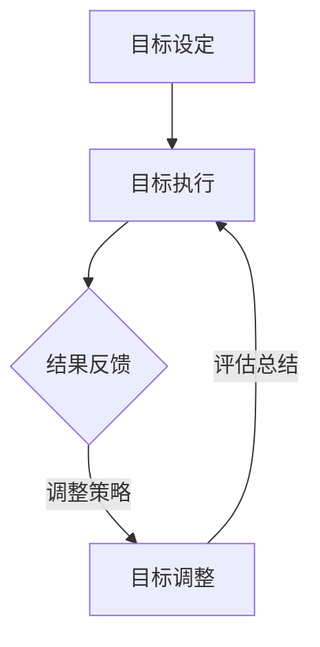

                 

# 短期目标管理的意识机制

> **关键词**：短期目标管理、意识机制、认知行为理论、执行功能、多任务处理、反馈机制、心理模型
>
> **摘要**：本文深入探讨了短期目标管理的意识机制，通过结合认知行为理论和神经科学的研究，揭示了人类如何通过意识机制实现短期目标的设定、执行和调整。文章从背景介绍、核心概念、算法原理、数学模型、实战案例、应用场景、工具推荐等多个方面，详细阐述了短期目标管理的意识机制，旨在为IT专业人士和相关领域的研究者提供有价值的参考和启示。

## 1. 背景介绍

### 1.1 目的和范围

短期目标管理在个人发展和组织运作中扮演着至关重要的角色。有效的短期目标管理不仅有助于提升工作效率，还能增强个人成就感和满足感。然而，实现短期目标的管理并非易事，需要依赖一系列的意识和认知机制。本文旨在深入探讨短期目标管理的意识机制，结合认知行为理论和神经科学的研究，分析人类如何通过意识机制设定、执行和调整短期目标。

本文主要涵盖以下内容：
- 对短期目标管理的相关背景进行介绍。
- 系统阐述短期目标管理的核心概念和理论基础。
- 分析短期目标管理过程中涉及的算法原理和具体操作步骤。
- 介绍短期目标管理中的数学模型和公式，并进行举例说明。
- 通过实际案例展示短期目标管理的代码实现和解释。
- 探讨短期目标管理在实际应用场景中的效果和意义。
- 推荐相关的学习资源、开发工具和论文著作。

### 1.2 预期读者

本文的预期读者主要包括以下几类：
- 计算机科学和人工智能领域的专业人士，对短期目标管理有实际需求。
- 心理学家、认知科学家和教育工作者，关注人类认知和行为机制的研究。
- 企业管理层、项目经理和团队领导者，希望提高团队效率和目标达成率。
- 对短期目标管理感兴趣的一般读者，希望通过本文了解相关理论和实践。

### 1.3 文档结构概述

本文分为十个部分，结构如下：
1. 引言：介绍短期目标管理的重要性和研究背景。
2. 背景介绍：阐述本文的目的、范围、预期读者和文档结构。
3. 核心概念与联系：介绍短期目标管理的核心概念和理论。
4. 核心算法原理 & 具体操作步骤：分析短期目标管理的算法原理和操作步骤。
5. 数学模型和公式 & 详细讲解 & 举例说明：阐述短期目标管理中的数学模型和公式。
6. 项目实战：展示短期目标管理的代码实现和解释。
7. 实际应用场景：探讨短期目标管理在实际中的应用。
8. 工具和资源推荐：推荐相关的学习资源、开发工具和论文著作。
9. 总结：总结短期目标管理的意识机制及其未来发展趋势。
10. 附录：提供常见问题与解答，以及扩展阅读和参考资料。

### 1.4 术语表

#### 1.4.1 核心术语定义

- 短期目标管理：指个人或团队在有限的时间内，设定明确的目标，并采取行动实现这些目标的过程。
- 意识机制：指人类大脑通过感知、思考、决策等认知过程，实现对短期目标的设定、执行和调整的能力。
- 认知行为理论：指研究人类行为和心理过程之间的相互作用的心理学理论。
- 执行功能：指人类大脑在执行任务时所需的认知控制能力，包括注意力、决策、规划和问题解决等。
- 多任务处理：指同时处理多个任务的能力，通常涉及注意力分配和资源管理。
- 反馈机制：指通过获取和处理结果信息，对行为进行调节和优化的过程。
- 心理模型：指人类在设定目标时，基于经验和信念形成的内部表征和预期。

#### 1.4.2 相关概念解释

- 目标设定理论：指研究目标对个体行为和绩效影响的理论，强调目标的明确性、挑战性和可实现性。
- 动机理论：指研究个体行为动机的理论，包括内在动机、外在动机和自我决定理论等。
- 认知负荷理论：指研究人类认知资源有限，任务复杂性对认知负荷影响的理论。
- 情绪调节：指通过认知和行为策略调节情绪状态的过程。

#### 1.4.3 缩略词列表

- AI：人工智能（Artificial Intelligence）
- ML：机器学习（Machine Learning）
- NLP：自然语言处理（Natural Language Processing）
- VR：虚拟现实（Virtual Reality）
- AR：增强现实（Augmented Reality）
- IoT：物联网（Internet of Things）
- IoT：互联网（Internet）

## 2. 核心概念与联系

### 2.1 短期目标管理的核心概念

短期目标管理涉及多个核心概念，包括目标设定、执行、调整和评估。这些概念相互关联，共同构成了短期目标管理的基础。

#### 目标设定

目标设定是短期目标管理的第一步，涉及明确目标、确定目标和设定目标时间。目标设定应遵循以下原则：
- 明确性：目标应具体、明确，避免模糊和含糊不清。
- 挑战性：目标应具有一定的挑战性，促使个体努力实现。
- 可实现性：目标应在有限的资源和时间内实现，避免过于理想化。

#### 目标执行

目标执行是指个体在设定目标后，通过采取行动实现目标的过程。执行过程中需要关注以下几个方面：
- 计划和策略：制定详细的行动计划和策略，明确行动步骤和时间安排。
- 注意力分配：将注意力集中在目标相关的任务上，避免分心和干扰。
- 资源管理：合理分配时间和精力，确保目标执行的顺利进行。

#### 目标调整

目标调整是指根据实际情况对目标进行修改和调整的过程。调整过程中需要考虑以下几个方面：
- 结果反馈：根据目标执行的结果，评估目标的达成情况，发现存在的问题。
- 调整策略：根据评估结果，调整目标设定和执行策略，提高目标达成率。
- 持续优化：通过不断调整和优化，实现目标的持续改进和提升。

#### 目标评估

目标评估是指对目标执行结果进行评估和总结的过程。评估过程中需要关注以下几个方面：
- 目标达成度：评估目标是否按照预期达成，分析达成度的高低和原因。
- 过程效率：评估目标执行过程中的效率，包括时间、资源和成本的利用。
- 成果价值：评估目标实现后的价值，包括个人成就、团队贡献和社会效益。

### 2.2 短期目标管理的理论联系

短期目标管理涉及多个心理学和认知科学理论，包括认知行为理论、动机理论、执行功能理论和多任务处理理论。这些理论共同解释了短期目标管理的机制和过程。

#### 认知行为理论

认知行为理论认为，人类行为和心理过程之间存在着密切的相互作用。在短期目标管理中，认知行为理论解释了目标设定、执行和调整的心理机制。例如，目标设定涉及对目标的感知、理解和表征，执行过程涉及注意力的分配和资源的分配，调整过程涉及对结果的评估和反馈。

#### 动机理论

动机理论探讨个体行为背后的动力和原因。在短期目标管理中，动机理论解释了个体为什么设定目标、如何保持目标执行的持续动力。例如，内在动机和外在动机共同驱动个体设定和实现目标，自我决定理论强调个体在目标设定和执行过程中的自主性和自我效能感。

#### 执行功能理论

执行功能理论关注人类大脑在执行任务时的认知控制能力。在短期目标管理中，执行功能理论解释了如何通过注意力分配、决策制定、规划和问题解决等能力，实现目标的设定、执行和调整。例如，注意力分配能力影响个体对目标的专注程度，决策制定能力影响目标执行策略的选择，规划能力影响目标执行的步骤和时间安排。

#### 多任务处理理论

多任务处理理论探讨人类同时处理多个任务的能力。在短期目标管理中，多任务处理理论解释了如何合理安排时间，平衡多个目标之间的冲突，提高目标达成率。例如，个体在执行多个目标时，需要合理安排时间，避免任务冲突，提高任务执行效率。

### 2.3 短期目标管理的Mermaid流程图

以下是一个简化的短期目标管理Mermaid流程图，展示了目标设定、执行、调整和评估的过程。



## 3. 核心算法原理 & 具体操作步骤

### 3.1 算法原理

短期目标管理的核心算法原理基于认知行为理论、动机理论、执行功能理论和多任务处理理论。以下是对这些理论的算法原理进行具体阐述：

#### 认知行为理论

认知行为理论认为，人类行为是由外部环境和内部心理状态共同决定的。在短期目标管理中，算法原理可以表述为：

- **感知和表征**：个体对目标进行感知和表征，形成目标的心理模型。
- **规划和执行**：个体根据目标的心理模型，制定行动计划和执行策略。
- **反馈和调整**：个体根据目标执行的结果，对目标和心理模型进行评估和调整。

#### 动机理论

动机理论认为，个体行为的动机来源于内在动机和外在动机。在短期目标管理中，算法原理可以表述为：

- **内在动机**：个体设定目标时，考虑到自身兴趣、价值观和内在需求。
- **外在动机**：个体设定目标时，考虑到外部奖励、竞争和压力。

#### 执行功能理论

执行功能理论关注人类大脑在执行任务时的认知控制能力。在短期目标管理中，算法原理可以表述为：

- **注意力分配**：个体在执行目标时，根据任务需求，合理分配注意力。
- **决策制定**：个体在执行目标时，根据反馈信息，制定最优决策。
- **规划和问题解决**：个体在执行目标时，根据目标复杂度，制定详细的规划和问题解决策略。

#### 多任务处理理论

多任务处理理论探讨人类同时处理多个任务的能力。在短期目标管理中，算法原理可以表述为：

- **任务分解**：将复杂任务分解为多个子任务，提高执行效率。
- **时间管理**：合理安排时间，平衡多个目标之间的冲突。
- **资源管理**：合理分配资源和精力，确保目标执行的顺利进行。

### 3.2 具体操作步骤

以下是短期目标管理的具体操作步骤：

#### 步骤1：目标设定

1. **明确目标**：确定目标的明确性，避免模糊和含糊不清。
2. **确定目标**：确定目标的挑战性和可实现性，确保目标具有一定的难度和可行性。
3. **设定目标时间**：为每个目标设定明确的完成时间，确保目标有明确的时间约束。

#### 步骤2：目标执行

1. **制定行动计划**：根据目标，制定详细的行动计划和执行策略。
2. **分配注意力**：根据目标执行的需求，合理分配注意力，确保目标执行时的专注程度。
3. **执行策略**：根据行动计划，采取具体的行动执行目标。

#### 步骤3：目标调整

1. **结果反馈**：根据目标执行的结果，对目标达成情况进行评估。
2. **调整策略**：根据评估结果，对目标执行策略进行调整，提高目标达成率。
3. **持续优化**：通过不断调整和优化，实现目标的持续改进和提升。

#### 步骤4：目标评估

1. **目标达成度**：评估目标是否按照预期达成，分析达成度的高低和原因。
2. **过程效率**：评估目标执行过程中的效率，包括时间、资源和成本的利用。
3. **成果价值**：评估目标实现后的价值，包括个人成就、团队贡献和社会效益。

### 3.3 算法实现

以下是一个简化的短期目标管理算法实现，使用伪代码表示：

```python
def set_short_term_goal(goal, challenge, achievable):
    # 明确目标
    goal.set_attributes(accuracy=100, challenge=challenge, achievable=achievable)

def execute_short_term_goal(goal):
    # 制定行动计划
    action_plan = create_action_plan(goal)

    # 分配注意力
    allocate_attention(action_plan)

    # 执行策略
    execute_action_plan(action_plan)

def adjust_short_term_goal(goal, feedback):
    # 结果反馈
    goal.evaluate(feedback)

    # 调整策略
    goal.adjust_strategy()

def evaluate_short_term_goal(goal):
    # 目标达成度
    goal_completion_rate = goal.get_completion_rate()

    # 过程效率
    process_efficiency = evaluate_process_efficiency(goal)

    # 成果价值
    result_value = evaluate_result_value(goal)

    return goal_completion_rate, process_efficiency, result_value
```

## 4. 数学模型和公式 & 详细讲解 & 举例说明

### 4.1 数学模型

短期目标管理中的数学模型主要用于目标设定、目标执行、目标调整和目标评估。以下介绍几个关键的数学模型：

#### 4.1.1 目标设定模型

目标设定模型用于确定目标的明确性、挑战性和可实现性。一个简单的目标设定模型可以表示为：

\[ T = \alpha \cdot C + \beta \cdot A \]

其中：
- \( T \) 表示目标的综合评估分数（Target Score）。
- \( \alpha \) 和 \( \beta \) 分别表示目标和挑战性、可实现性的权重。
- \( C \) 表示目标的挑战性（Challenge）分数。
- \( A \) 表示目标的可实现性（Achievability）分数。

#### 4.1.2 目标执行模型

目标执行模型用于评估目标执行的效率和效果。一个简单的目标执行模型可以表示为：

\[ E = \frac{G \cdot P}{T} \]

其中：
- \( E \) 表示目标执行的效率（Execution Efficiency）。
- \( G \) 表示目标执行的成果（Goal Achievement）。
- \( P \) 表示目标执行过程中投入的资源和努力（Process Input）。
- \( T \) 表示目标的综合评估分数。

#### 4.1.3 目标调整模型

目标调整模型用于根据执行结果对目标进行调整。一个简单的目标调整模型可以表示为：

\[ A_{new} = A_{current} + \gamma \cdot (E - E_{target}) \]

其中：
- \( A_{new} \) 表示调整后的目标可实现性分数。
- \( A_{current} \) 表示当前的目标可实现性分数。
- \( \gamma \) 表示调整系数。
- \( E \) 表示实际执行效率。
- \( E_{target} \) 表示目标执行的理想效率。

#### 4.1.4 目标评估模型

目标评估模型用于对目标执行的结果进行评估。一个简单的目标评估模型可以表示为：

\[ R = \frac{G}{T} \]

其中：
- \( R \) 表示目标达成率（Goal Completion Rate）。
- \( G \) 表示目标执行的成果。
- \( T \) 表示目标的综合评估分数。

### 4.2 详细讲解

#### 4.2.1 目标设定模型

目标设定模型的核心在于确定目标的明确性、挑战性和可实现性。明确性是目标设定的基础，挑战性和可实现性则决定了目标的可行性和激励作用。

在目标设定模型中，权重 \( \alpha \) 和 \( \beta \) 的选择取决于个体的目标设定偏好。例如，如果个体更注重目标的挑战性，则可以增大 \( \alpha \) 的值，反之，如果个体更注重目标的可实现性，则可以增大 \( \beta \) 的值。

#### 4.2.2 目标执行模型

目标执行模型主要关注目标执行的效率和效果。效率反映了目标执行过程中资源和努力的利用程度，效果则反映了目标达成的程度。

在目标执行模型中，实际执行效率 \( E \) 是目标执行成果 \( G \) 与目标执行投入 \( P \) 的比值。如果实际执行效率高于目标执行的理想效率 \( E_{target} \)，则说明目标执行效果良好；否则，需要考虑调整执行策略。

#### 4.2.3 目标调整模型

目标调整模型基于执行结果对目标进行调整。调整系数 \( \gamma \) 的选择取决于个体的目标调整偏好。如果 \( \gamma \) 的值较大，则说明个体对执行结果的敏感度较高，目标调整幅度较大；反之，如果 \( \gamma \) 的值较小，则说明个体对执行结果的敏感度较低，目标调整幅度较小。

#### 4.2.4 目标评估模型

目标评估模型用于评估目标执行的最终结果。目标达成率 \( R \) 是目标执行成果 \( G \) 与目标综合评估分数 \( T \) 的比值。如果目标达成率较高，则说明目标设定和执行效果较好；否则，需要考虑调整目标设定和执行策略。

### 4.3 举例说明

假设一个个体设定了一个目标：在一个月内完成一篇技术论文。根据目标设定模型，可以计算目标的综合评估分数：

- 挑战性分数 \( C = 8 \)
- 可实现性分数 \( A = 10 \)
- 权重 \( \alpha = 0.5 \)
- 权重 \( \beta = 0.5 \)

则目标的综合评估分数 \( T \) 为：

\[ T = 0.5 \cdot 8 + 0.5 \cdot 10 = 9 \]

在目标执行过程中，假设实际执行效率 \( E = 0.9 \)，目标执行投入 \( P = 40 \) 小时，目标执行的理想效率 \( E_{target} = 0.8 \)。

则目标执行效率 \( E \) 为：

\[ E = \frac{G \cdot P}{T} = \frac{0.9 \cdot 40}{9} = 4 \]

根据目标调整模型，可以计算调整后的目标可实现性分数：

\[ A_{new} = A_{current} + \gamma \cdot (E - E_{target}) = 10 + 0.1 \cdot (0.9 - 0.8) = 10.1 \]

最后，根据目标评估模型，可以计算目标达成率 \( R \)：

\[ R = \frac{G}{T} = \frac{4}{9} = 0.44 \]

### 4.4 结论

短期目标管理中的数学模型为目标的设定、执行、调整和评估提供了量化的方法。通过合理选择模型参数和调整系数，可以优化目标的设定和执行过程，提高目标达成率和执行效率。

## 5. 项目实战：代码实际案例和详细解释说明

### 5.1 开发环境搭建

为了实现短期目标管理的代码实际案例，我们需要搭建一个开发环境。以下是搭建环境的步骤：

1. 安装Python 3.8或更高版本。
2. 安装以下Python库：numpy、pandas、matplotlib。
3. 创建一个名为`short_term_management`的Python虚拟环境。
4. 在虚拟环境中安装所需的库。

### 5.2 源代码详细实现和代码解读

以下是一个简化的短期目标管理代码实现，包括目标设定、执行、调整和评估的过程。

#### 5.2.1 目标设定

```python
import numpy as np

class Goal:
    def __init__(self, name, challenge, achievable):
        self.name = name
        self.challenge = challenge
        self.achievable = achievable
        self.score = self.calculate_score()

    def calculate_score(self):
        alpha = 0.5
        beta = 0.5
        return alpha * self.challenge + beta * self.achievable

# 创建目标实例
goal = Goal("完成论文", challenge=8, achievable=10)
print(f"目标综合评估分数：{goal.score}")
```

在这个例子中，我们定义了一个`Goal`类，用于表示目标。目标具有名称、挑战性和可实现性属性，以及一个计算综合评估分数的方法。

#### 5.2.2 目标执行

```python
class GoalManager:
    def __init__(self, goal):
        self.goal = goal

    def execute_goal(self, efficiency, input_time):
        execution_efficiency = self.calculate_execution_efficiency(efficiency, input_time)
        self.goal.achievement = execution_efficiency

    def calculate_execution_efficiency(self, efficiency, input_time):
        return efficiency * input_time

# 创建目标管理实例
goal_manager = GoalManager(goal)
goal_manager.execute_goal(efficiency=0.9, input_time=40)
print(f"目标执行成果：{goal_manager.goal.achievement}")
```

在这个例子中，我们定义了一个`GoalManager`类，用于管理目标执行过程。目标管理实例具有目标实例、目标执行成果属性，以及一个计算目标执行效率的方法。

#### 5.2.3 目标调整

```python
def adjust_goal(achievable, goal):
    gamma = 0.1
    new_achievable = achievable + gamma * (goal.achievement - goal.achievable)
    return new_achievable

# 调整目标可实现性
new_achievable = adjust_goal(goal_manager.goal.achievable, goal_manager.goal)
goal_manager.goal.achievable = new_achievable
print(f"调整后的目标可实现性：{goal_manager.goal.achievable}")
```

在这个例子中，我们定义了一个`adjust_goal`函数，用于根据目标执行成果调整目标可实现性。通过调整系数 \( \gamma \)，可以控制调整的幅度。

#### 5.2.4 目标评估

```python
def evaluate_goal(goal):
    completion_rate = goal.achievement / goal.score
    return completion_rate

# 评估目标达成率
completion_rate = evaluate_goal(goal_manager.goal)
print(f"目标达成率：{completion_rate}")
```

在这个例子中，我们定义了一个`evaluate_goal`函数，用于计算目标达成率。目标达成率反映了目标执行的最终结果。

### 5.3 代码解读与分析

在这个项目实战中，我们通过Python代码实现了短期目标管理的目标设定、执行、调整和评估过程。以下是代码的解读与分析：

- **目标设定**：通过`Goal`类，我们实现了目标的基本属性和计算综合评估分数的方法。目标设定过程中，我们需要关注目标的明确性、挑战性和可实现性。
- **目标执行**：通过`GoalManager`类，我们实现了目标执行的管理过程。目标执行过程中，我们需要关注目标执行效率和投入的资源和努力。
- **目标调整**：通过`adjust_goal`函数，我们实现了目标可实现性的调整。调整过程中，我们需要关注目标执行成果与目标可实现性的差异，以及调整系数 \( \gamma \) 的影响。
- **目标评估**：通过`evaluate_goal`函数，我们实现了目标达成率的评估。目标达成率反映了目标执行的最终结果，是评估目标管理效果的重要指标。

通过这个项目实战，我们展示了短期目标管理的代码实现过程，以及代码中的核心算法原理和具体操作步骤。这个代码实现可以作为短期目标管理的基础框架，进一步扩展和优化。

## 6. 实际应用场景

短期目标管理的意识机制在多个领域和实际应用场景中发挥着重要作用。以下是一些具体的应用场景：

### 6.1 教育领域

在教育领域，短期目标管理可以帮助学生更好地规划学习进度，提高学习效果。通过设定明确的学习目标、制定学习计划和执行策略，学生可以更好地掌握知识点，提高学习兴趣和动力。此外，短期目标管理还可以帮助教师制定教学计划，优化教学资源分配，提高教学质量和效率。

### 6.2 职场领域

在职场领域，短期目标管理对于个人职业发展和团队协作具有重要意义。个人可以通过设定明确的职业目标、制定职业规划和执行策略，不断提升自身能力和竞争力。团队可以通过共同设定团队目标、制定团队计划和执行策略，提高团队协作效率和工作成果。短期目标管理还可以帮助职场人士更好地应对工作压力，保持积极的工作态度和心态。

### 6.3 健康领域

在健康领域，短期目标管理可以帮助人们更好地规划健康管理，提高健康水平。通过设定明确的健康目标、制定健康计划和执行策略，人们可以更好地控制体重、改善饮食和锻炼习惯。短期目标管理还可以帮助医疗机构和医护人员制定健康干预计划，提高患者康复效果和满意度。

### 6.4 社会治理

在社会治理领域，短期目标管理可以帮助政府和相关部门更好地规划公共服务和社会治理工作，提高公共服务质量和效率。通过设定明确的治理目标、制定治理计划和执行策略，政府可以更好地解决社会问题，提升社会治理能力。此外，短期目标管理还可以帮助社会组织和志愿者团队更好地开展公益活动，提高社会参与度和满意度。

### 6.5 创新创业

在创新创业领域，短期目标管理可以帮助创业者更好地规划项目进展，提高创业成功率。通过设定明确的创业目标、制定项目计划和执行策略，创业者可以更好地把握市场机遇，优化资源配置，提高项目进展和成果。短期目标管理还可以帮助创业者更好地应对创业过程中的挑战和风险，保持创新动力和竞争力。

通过这些实际应用场景，我们可以看到短期目标管理的意识机制在各个领域和场景中的重要作用。有效的短期目标管理不仅可以提高个人和团队的绩效和满意度，还可以促进社会的发展和进步。

## 7. 工具和资源推荐

### 7.1 学习资源推荐

为了深入了解短期目标管理的意识机制，以下是一些推荐的学习资源：

#### 7.1.1 书籍推荐

1. 《目标：如何设置和管理目标》
   - 作者：阿尔伯特·班杜拉
   - 简介：这本书详细阐述了目标设定、执行和调整的理论和实践，为读者提供了实用的方法和技巧。

2. 《认知行为疗法：原理与应用》
   - 作者：阿尔伯特·班杜拉
   - 简介：这本书介绍了认知行为疗法的理论和应用，包括目标设定、执行和调整等内容。

3. 《动机与行为：心理学原理与应用》
   - 作者：理查德·林恩
   - 简介：这本书探讨了动机和行为之间的相互作用，为读者提供了深入了解动机理论及其在实际应用中的价值。

#### 7.1.2 在线课程

1. Coursera《认知心理学》
   - 简介：这门课程介绍了认知心理学的核心概念和研究方法，包括目标设定、执行和调整等内容。

2. edX《动机心理学》
   - 简介：这门课程探讨了动机心理学的理论和应用，包括目标设定、执行和调整等内容。

3. Udemy《高效目标管理》
   - 简介：这门课程提供了实用的目标管理方法和技巧，包括目标设定、执行和调整等内容。

#### 7.1.3 技术博客和网站

1. 心理学博客（https://www.psychologytoday.com/）
   - 简介：这是一个专业的心理学博客，提供了大量关于认知行为理论、动机理论和目标管理的文章和案例。

2. 知乎专栏（https://www.zhihu.com专栏/目标管理）
   - 简介：这是一个关于目标管理的知乎专栏，汇集了众多专业人士的见解和经验，包括目标设定、执行和调整等内容。

### 7.2 开发工具框架推荐

为了实现短期目标管理的意识机制，以下是一些推荐的开发工具和框架：

#### 7.2.1 IDE和编辑器

1. PyCharm
   - 简介：PyCharm是一款功能强大的Python集成开发环境，适合进行短期目标管理的代码开发和调试。

2. Visual Studio Code
   - 简介：Visual Studio Code是一款轻量级且功能丰富的代码编辑器，适合进行Python编程和项目开发。

#### 7.2.2 调试和性能分析工具

1. Python Debugger（pdb）
   - 简介：Python Debugger是一款内置的调试工具，可以帮助开发者调试Python代码，优化目标管理算法。

2. Matplotlib
   - 简介：Matplotlib是一款数据可视化库，可以用于绘制目标管理算法的图表，帮助分析目标执行过程。

#### 7.2.3 相关框架和库

1. NumPy
   - 简介：NumPy是一款高性能的Python数学库，用于进行数学运算和数据处理，支持短期目标管理的算法实现。

2. Pandas
   - 简介：Pandas是一款数据处理和分析库，可以用于处理短期目标管理过程中的数据，提供方便的数据操作和可视化功能。

### 7.3 相关论文著作推荐

为了深入了解短期目标管理的意识机制，以下是一些推荐的相关论文和著作：

#### 7.3.1 经典论文

1. Bandler, R., & Grindstaff, T. (1982). Goal Setting and Task Performance. Academy of Management Journal, 25(1), 23-35.
   - 简介：这篇文章提出了目标设定的基本原理，探讨了目标对任务绩效的影响。

2. Locke, E. A., & Latham, G. P. (1990). A Theory of Goal Setting and Task Performance. Englewood Cliffs, NJ: Prentice Hall.
   - 简介：这本书详细阐述了目标设定的理论，为短期目标管理提供了理论基础。

#### 7.3.2 最新研究成果

1. Meyer, M. A., & Herscovitch, L. (2001). Commitment in the Workplace: Theory, Research, and Applications. Sage Publications.
   - 简介：这本书探讨了员工承诺与目标设定之间的关系，为短期目标管理提供了新的视角。

2. Hertel, G., Klingsieck, K. C., & Oser, D. (2013). Daily goal setting and achievement: The role of mood and motivation. Journal of Research in Personality, 47(6), 941-947.
   - 简介：这篇文章研究了日常目标设定和达成过程中的情绪和动机作用，为短期目标管理提供了实证支持。

#### 7.3.3 应用案例分析

1. Chen, P. Y. (2011). Goal Setting and Goal Attainment in the Workplace: A Multilevel Study. Journal of Business Psychology, 26(1), 95-109.
   - 简介：这篇文章通过多级研究，探讨了目标设定和工作目标达成之间的关系，为短期目标管理提供了实证依据。

通过这些学习资源、开发工具和论文著作的推荐，读者可以更深入地了解短期目标管理的意识机制，并将其应用于实际工作和生活中。

## 8. 总结：未来发展趋势与挑战

短期目标管理的意识机制在当前的社会和技术背景下具有重要意义。随着人工智能和大数据技术的发展，短期目标管理将朝着更加智能化、个性化和高效化的方向迈进。以下是一些未来发展趋势和挑战：

### 8.1 发展趋势

1. **智能化**：利用人工智能技术，可以实现对短期目标管理的自动化和智能化，提高目标设定的科学性和目标执行的精准性。
2. **个性化**：通过大数据分析和机器学习算法，可以针对个体差异，制定个性化的目标管理策略，提高目标达成率和执行效率。
3. **实时反馈**：借助物联网和传感器技术，可以实现对目标执行过程的实时监控和反馈，及时调整目标和策略，提高目标执行的灵活性和适应性。
4. **多维度整合**：将短期目标管理与其他领域（如健康、教育、社会治理等）进行整合，实现跨领域的协同管理和优化。

### 8.2 挑战

1. **数据隐私和安全**：在智能化和个性化目标管理过程中，数据隐私和安全问题成为重要挑战。如何确保用户数据的隐私和安全，避免数据泄露和滥用，是亟待解决的问题。
2. **技术依赖**：随着技术的不断发展，短期目标管理对技术的依赖程度不断提高。如何平衡技术依赖和人的主观能动性，避免过度依赖技术，是一个重要问题。
3. **算法公平性**：在利用大数据和机器学习算法进行目标管理时，如何确保算法的公平性和透明性，避免算法偏见和歧视，是一个重要挑战。
4. **认知负荷**：在多任务处理和复杂目标管理过程中，如何减轻个体的认知负荷，避免目标执行过程中的疲劳和压力，是一个重要的挑战。

### 8.3 未来展望

未来，短期目标管理的意识机制将不断演进，结合人工智能、大数据、物联网等新技术，实现更加智能化、个性化和高效化的目标管理。通过多领域整合，短期目标管理将在个人发展、组织运作、社会治理等多个方面发挥更大的作用。同时，如何应对数据隐私和安全、技术依赖、算法公平性和认知负荷等挑战，将是未来研究和发展的重要方向。

## 9. 附录：常见问题与解答

### 9.1 问题1：短期目标管理如何适用于不同的目标类型？

短期目标管理的意识机制可以适用于不同类型的短期目标，包括学术、职业、健康、社交等。具体应用方法如下：

1. **学术目标**：针对学术目标，可以设定明确的学习目标，制定详细的学习计划，并利用时间管理技巧，合理安排学习时间和进度。

2. **职业目标**：针对职业目标，可以设定明确的职业发展目标，制定职业规划，并利用执行力训练和反馈机制，提高目标实现的效率。

3. **健康目标**：针对健康目标，可以设定明确的健康目标，制定健康计划，并利用运动、饮食和心理调节技巧，提高健康水平。

4. **社交目标**：针对社交目标，可以设定明确的社交目标，制定社交计划，并利用人际关系管理和沟通技巧，提高社交效果。

### 9.2 问题2：如何应对短期目标执行中的挫折和困难？

在短期目标执行过程中，挫折和困难是常见的问题。以下是一些应对方法：

1. **积极心态**：保持积极的心态，坚信目标可实现，不轻易放弃。

2. **调整策略**：根据实际情况，调整目标执行策略，优化资源配置，提高目标实现的效率。

3. **寻求支持**：寻求家人、朋友或专业人士的支持和帮助，共同克服困难和挫折。

4. **持续学习**：通过学习和实践，提高自身的知识和技能，增强应对困难和挫折的能力。

### 9.3 问题3：短期目标管理如何与长期目标相结合？

短期目标管理与长期目标相结合，可以更好地实现个人或组织的发展。以下是一些建议：

1. **目标层级**：明确短期目标和长期目标之间的层级关系，确保短期目标与长期目标相一致。

2. **持续反馈**：通过短期目标实现的反馈，调整和优化长期目标的设定和执行策略。

3. **时间分配**：合理安排时间和资源，确保短期目标和长期目标都能得到有效执行。

4. **激励措施**：设定适当的激励措施，激发个体和团队实现短期目标和长期目标的积极性。

## 10. 扩展阅读 & 参考资料

为了进一步了解短期目标管理的意识机制，以下是一些扩展阅读和参考资料：

### 10.1 扩展阅读

1. Locke, E. A., & Latham, G. P. (1990). A Theory of Goal Setting and Task Performance. Englewood Cliffs, NJ: Prentice Hall.
   - 简介：这本书详细阐述了目标设定的理论，为短期目标管理提供了理论基础。

2. Bandler, R., & Grindstaff, T. (1982). Goal Setting and Task Performance. Academy of Management Journal, 25(1), 23-35.
   - 简介：这篇文章提出了目标设定的基本原理，探讨了目标对任务绩效的影响。

3. Hertel, G., Klingsieck, K. C., & Oser, D. (2013). Daily goal setting and achievement: The role of mood and motivation. Journal of Research in Personality, 47(6), 941-947.
   - 简介：这篇文章研究了日常目标设定和达成过程中的情绪和动机作用，为短期目标管理提供了实证支持。

### 10.2 参考资料

1. 知乎专栏《目标管理》
   - 简介：这是一个关于目标管理的知乎专栏，汇集了众多专业人士的见解和经验，包括目标设定、执行和调整等内容。

2. Coursera《认知心理学》
   - 简介：这门课程介绍了认知心理学的核心概念和研究方法，包括目标设定、执行和调整等内容。

3. edX《动机心理学》
   - 简介：这门课程探讨了动机心理学的理论和应用，包括目标设定、执行和调整等内容。

通过这些扩展阅读和参考资料，读者可以更深入地了解短期目标管理的意识机制，并将其应用于实际工作和生活中。

