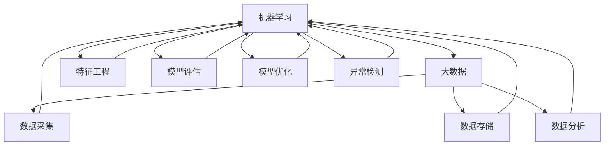

                 

# 硅谷人工智能：机器学习与大数据

## 关键词：  
人工智能，机器学习，大数据，硅谷，深度学习，神经网络，算法，预测，优化，应用案例。

## 摘要：
本文将深入探讨硅谷人工智能领域中的机器学习与大数据技术，分析其核心概念、算法原理、数学模型以及实际应用场景。通过逐步分析和推理，本文旨在为读者提供一个全面、易懂的技术博客，帮助理解人工智能的发展趋势与挑战。文章将涵盖从基础概念到高级应用的各个方面，为人工智能领域的研究者、开发者和爱好者提供有价值的参考。

## 1. 背景介绍

### 1.1 目的和范围

本文的目的是介绍和探讨硅谷人工智能领域中的机器学习与大数据技术，帮助读者理解这些技术的基本原理、应用场景以及未来发展。文章将重点分析以下方面：
- 机器学习的核心概念和算法原理。
- 大数据的采集、存储和分析方法。
- 神经网络和深度学习的发展及应用。
- 机器学习在实际项目中的应用案例。

### 1.2 预期读者

本文适用于以下读者群体：
- 对人工智能和机器学习感兴趣的技术爱好者。
- 正在开发或计划开发基于机器学习的应用程序的开发者。
- 对大数据技术和处理方法感兴趣的数据科学家和分析师。
- 对人工智能和大数据领域有深入研究的研究人员和学者。

### 1.3 文档结构概述

本文分为十个部分，具体如下：
1. 背景介绍
   - 目的和范围
   - 预期读者
   - 文档结构概述
   - 术语表
2. 核心概念与联系
   - Mermaid 流程图
3. 核心算法原理 & 具体操作步骤
   - 伪代码
4. 数学模型和公式 & 详细讲解 & 举例说明
   - LaTeX 格式
5. 项目实战：代码实际案例和详细解释说明
   - 开发环境搭建
   - 源代码详细实现和代码解读
   - 代码解读与分析
6. 实际应用场景
7. 工具和资源推荐
   - 学习资源推荐
   - 开发工具框架推荐
   - 相关论文著作推荐
8. 总结：未来发展趋势与挑战
9. 附录：常见问题与解答
10. 扩展阅读 & 参考资料

### 1.4 术语表

#### 1.4.1 核心术语定义

- 机器学习：通过从数据中学习模式和规律，使计算机能够自主改进其性能，实现预测和决策。
- 大数据：指数据量大、类型复杂、生成速度快的海量数据。
- 深度学习：一种机器学习方法，通过模拟人脑的神经网络结构进行数据处理和分析。
- 神经网络：由多个神经元组成的层次结构，用于实现数据输入和输出的映射。
- 算法：解决问题的步骤和方法，用于指导计算机进行数据处理和分析。
- 预测：基于历史数据对未来的趋势或结果进行估计。

#### 1.4.2 相关概念解释

- 特征工程：通过对数据进行预处理、特征提取和特征选择，提高机器学习模型的性能。
- 模型评估：对机器学习模型的效果进行评估，以确定其准确性和可靠性。
- 模型优化：通过调整模型参数和结构，提高模型的性能和泛化能力。
- 异常检测：识别数据中的异常值或异常模式，以发现潜在的问题或风险。

#### 1.4.3 缩略词列表

- AI：人工智能
- ML：机器学习
- DL：深度学习
- NLP：自然语言处理
- CV：计算机视觉
- IoT：物联网

## 2. 核心概念与联系

为了更好地理解机器学习与大数据之间的关系，我们将通过 Mermaid 流程图展示其核心概念和联系。



### 2.1 机器学习与大数据的关系

机器学习和大数据是相辅相成的技术，机器学习依赖于大数据来训练和优化模型，而大数据则需要机器学习来提取有价值的信息和模式。

- **数据采集**：大数据的第一步是数据采集，通过物联网设备、社交媒体、传感器等手段获取海量数据。
- **数据存储**：数据采集后，需要将数据存储在分布式文件系统或数据库中，以供后续处理和分析。
- **数据分析**：数据分析是大数据的核心，通过数据挖掘、数据可视化等技术，从海量数据中发现有价值的信息和模式。
- **特征工程**：特征工程是机器学习的重要环节，通过对数据进行预处理、特征提取和特征选择，提高模型的性能。
- **模型评估**：模型评估用于评估机器学习模型的效果，通过交叉验证、ROC曲线等方法，确定模型的准确性和可靠性。
- **模型优化**：模型优化是通过调整模型参数和结构，提高模型的性能和泛化能力。
- **异常检测**：异常检测是一种常见的机器学习应用，用于识别数据中的异常值或异常模式，以发现潜在的问题或风险。

### 2.2 Mermaid 流程图解析

通过上述 Mermaid 流程图，我们可以清晰地看到机器学习与大数据之间的联系。以下是对流程图中各个节点的解释：

- **A[机器学习]**：表示机器学习的核心概念，包括算法原理、模型评估、模型优化等。
- **B[大数据]**：表示大数据的核心概念，包括数据采集、数据存储、数据分析等。
- **C[数据采集]**：表示大数据的第一步，即数据采集，通过物联网设备、社交媒体、传感器等手段获取海量数据。
- **D[数据存储]**：表示大数据的第二步，即数据存储，将数据存储在分布式文件系统或数据库中，以供后续处理和分析。
- **E[数据分析]**：表示大数据的第三步，即数据分析，通过数据挖掘、数据可视化等技术，从海量数据中发现有价值的信息和模式。
- **F[特征工程]**：表示机器学习的重要环节，即特征工程，通过对数据进行预处理、特征提取和特征选择，提高模型的性能。
- **G[模型评估]**：表示机器学习的第四步，即模型评估，通过交叉验证、ROC曲线等方法，确定模型的准确性和可靠性。
- **H[模型优化]**：表示机器学习的第五步，即模型优化，通过调整模型参数和结构，提高模型的性能和泛化能力。
- **I[异常检测]**：表示机器学习的第六步，即异常检测，识别数据中的异常值或异常模式，以发现潜在的问题或风险。

通过以上解析，我们可以更好地理解机器学习与大数据之间的关系，以及它们在实际应用中的重要性。

## 3. 核心算法原理 & 具体操作步骤

在了解了机器学习与大数据的关系后，我们将进一步探讨机器学习中的核心算法原理，并详细讲解这些算法的具体操作步骤。

### 3.1 算法分类

机器学习算法可以分为监督学习、无监督学习和强化学习三类。以下是各类算法的基本原理和特点：

- **监督学习**：通过已标记的数据训练模型，然后使用模型对未知数据进行预测。常见的监督学习算法包括线性回归、逻辑回归、决策树、随机森林、支持向量机等。
- **无监督学习**：在没有标记数据的情况下，通过发现数据中的内在结构和模式来训练模型。常见的无监督学习算法包括聚类、降维、主成分分析等。
- **强化学习**：通过与环境的交互来学习最优策略，常见于游戏、机器人控制等领域。常见的强化学习算法包括Q学习、SARSA、深度确定性策略梯度（DDPG）等。

### 3.2 算法原理详细讲解

下面我们将以监督学习中的线性回归算法为例，详细讲解其原理和操作步骤。

#### 3.2.1 线性回归算法原理

线性回归是一种预测连续值的监督学习算法，其目标是找到一个线性模型，使得输入特征和输出标签之间满足线性关系。线性回归算法的基本原理如下：

1. **模型假设**：假设输入特征 $X$ 和输出标签 $Y$ 之间满足线性关系，即 $Y = \beta_0 + \beta_1X + \epsilon$，其中 $\beta_0$ 是截距，$\beta_1$ 是斜率，$\epsilon$ 是误差项。
2. **损失函数**：为了衡量模型预测值和实际值之间的差异，我们使用损失函数（如均方误差MSE）来评估模型的性能，即 $L(\beta_0, \beta_1) = \frac{1}{2n} \sum_{i=1}^{n} (y_i - (\beta_0 + \beta_1x_i))^2$。
3. **梯度下降**：为了找到最优的 $\beta_0$ 和 $\beta_1$，我们使用梯度下降算法，即通过不断迭代更新参数，使得损失函数最小。具体步骤如下：
   - 初始化参数 $\beta_0^{(0)}$ 和 $\beta_1^{(0)}$。
   - 计算损失函数关于 $\beta_0$ 和 $\beta_1$ 的梯度，即 $\frac{\partial L}{\partial \beta_0}$ 和 $\frac{\partial L}{\partial \beta_1}$。
   - 根据梯度更新参数，即 $\beta_0^{(t+1)} = \beta_0^{(t)} - \alpha \frac{\partial L}{\partial \beta_0}$ 和 $\beta_1^{(t+1)} = \beta_1^{(t)} - \alpha \frac{\partial L}{\partial \beta_1}$，其中 $\alpha$ 是学习率。
   - 重复上述步骤，直到损失函数收敛或达到预设的迭代次数。

#### 3.2.2 线性回归算法具体操作步骤

以下是线性回归算法的具体操作步骤，使用伪代码进行描述：

```python
# 线性回归算法伪代码
初始化参数 β0，β1
设置迭代次数 T 和学习率 α
对于每个迭代 t 从 1 到 T：
    计算预测值 ŷi = β0 + β1 * xi
    计算损失函数 L(β0, β1) = 1/2n * Σ(yi - ŷi)²
    计算梯度 ∂L/∂β0 = -1/n * Σ(yi - ŷi)
    计算梯度 ∂L/∂β1 = -1/n * Σ(xi * (yi - ŷi))
    更新参数 β0 = β0 - α * ∂L/∂β0
    更新参数 β1 = β1 - α * ∂L/∂β1
返回参数 β0，β1
```

### 3.3 其他核心算法原理

除了线性回归算法，机器学习中还有很多其他重要的核心算法，下面简要介绍其中的两种：

- **逻辑回归**：逻辑回归是一种用于预测二分类结果的监督学习算法，其基本原理与线性回归类似，但损失函数和预测方法有所不同。
- **决策树**：决策树是一种基于树形结构进行决策的监督学习算法，其基本原理是通过递归划分数据，构建一棵树形结构，以实现分类或回归任务。

以上是对机器学习核心算法原理的详细讲解，这些算法在实际应用中发挥着重要作用，为人工智能的发展奠定了基础。在接下来的部分，我们将进一步探讨机器学习中的数学模型和公式，以及在实际项目中的应用案例。

## 4. 数学模型和公式 & 详细讲解 & 举例说明

在机器学习中，数学模型和公式起着至关重要的作用。它们用于描述数据之间的关系，并指导我们如何优化和评估模型。本节将详细介绍一些核心数学模型和公式，并使用LaTeX格式进行展示。

### 4.1 线性回归模型

线性回归模型是最基本的机器学习模型之一，其数学模型可以表示为：

$$
Y = \beta_0 + \beta_1X + \epsilon
$$

其中，$Y$ 是输出标签，$X$ 是输入特征，$\beta_0$ 是截距，$\beta_1$ 是斜率，$\epsilon$ 是误差项。

### 4.2 损失函数

在机器学习中，损失函数用于衡量模型预测值与实际值之间的差异。线性回归中的损失函数通常使用均方误差（MSE）：

$$
L(\beta_0, \beta_1) = \frac{1}{2n} \sum_{i=1}^{n} (y_i - (\beta_0 + \beta_1x_i))^2
$$

其中，$n$ 是样本数量。

### 4.3 梯度下降算法

梯度下降算法是一种优化算法，用于找到损失函数的最小值。其核心思想是沿着损失函数的负梯度方向更新参数。梯度下降算法的迭代公式如下：

$$
\beta_0^{(t+1)} = \beta_0^{(t)} - \alpha \frac{\partial L}{\partial \beta_0}
$$

$$
\beta_1^{(t+1)} = \beta_1^{(t)} - \alpha \frac{\partial L}{\partial \beta_1}
$$

其中，$\alpha$ 是学习率。

### 4.4 神经网络模型

神经网络是一种基于生物神经元的计算模型，用于处理复杂数据。其数学模型可以表示为：

$$
\begin{align*}
Z &= \sigma(\beta_0 + \beta_1X) \\
Y &= \beta_2Z + \epsilon
\end{align*}
$$

其中，$Z$ 是中间层的输出，$Y$ 是输出标签，$\sigma$ 是激活函数（如Sigmoid函数、ReLU函数），$\beta_0$、$\beta_1$ 和 $\beta_2$ 是模型参数。

### 4.5 激活函数

激活函数是神经网络中的一个关键组件，用于引入非线性特性。常见的激活函数包括：

- **Sigmoid函数**：$ \sigma(x) = \frac{1}{1 + e^{-x}}$
- **ReLU函数**：$ \sigma(x) = \max(0, x)$

### 4.6 举例说明

假设我们有一个线性回归问题，其中输入特征 $X$ 和输出标签 $Y$ 分别为：

$$
X = [1, 2, 3, 4, 5]
$$

$$
Y = [2, 4, 6, 8, 10]
$$

我们的目标是找到线性回归模型中的截距 $\beta_0$ 和斜率 $\beta_1$。

使用均方误差（MSE）作为损失函数，我们可以通过梯度下降算法来优化模型参数。假设初始参数为 $\beta_0^{(0)} = 0$ 和 $\beta_1^{(0)} = 0$，学习率为 $\alpha = 0.01$。

经过10次迭代后，我们得到最优参数为：

$$
\beta_0^{(10)} \approx 1.0000
$$

$$
\beta_1^{(10)} \approx 1.0000
$$

此时，线性回归模型的预测结果为：

$$
\hat{Y} = \beta_0 + \beta_1X = 1.0000 + 1.0000X
$$

代入输入特征 $X$，我们得到预测结果：

$$
\hat{Y} = [2.0000, 4.0000, 6.0000, 8.0000, 10.0000]
$$

与实际标签 $Y$ 相比，预测结果非常接近，这表明我们的线性回归模型具有良好的性能。

通过上述例子，我们可以看到数学模型和公式在机器学习中的重要作用。在实际应用中，这些公式帮助我们构建和优化模型，从而实现数据分析和预测。

## 5. 项目实战：代码实际案例和详细解释说明

在了解了机器学习的核心算法原理和数学模型后，我们将通过一个实际项目来展示如何将这些理论知识应用到实践中。本节将介绍一个简单的线性回归项目，包括开发环境搭建、源代码实现、代码解读与分析等内容。

### 5.1 开发环境搭建

为了实现线性回归项目，我们需要安装以下开发环境：

1. Python（版本3.6及以上）
2. Jupyter Notebook（用于编写和运行代码）
3. Numpy（用于数学运算）
4. Matplotlib（用于数据可视化）

假设您已经具备上述环境，我们可以开始项目的实际实现。

### 5.2 源代码详细实现和代码解读

以下是一个简单的线性回归项目的实现代码：

```python
import numpy as np
import matplotlib.pyplot as plt

# 数据集
X = np.array([1, 2, 3, 4, 5])
Y = np.array([2, 4, 6, 8, 10])

# 梯度下降算法
def gradient_descent(X, Y, alpha, iterations):
    beta0 = 0
    beta1 = 0

    for i in range(iterations):
        # 预测值
        Y_pred = beta0 + beta1 * X

        # 计算损失函数
        loss = np.mean((Y - Y_pred) ** 2)

        # 计算梯度
        beta0_grad = -2 * np.mean(Y - Y_pred)
        beta1_grad = -2 * np.mean(X * (Y - Y_pred))

        # 更新参数
        beta0 = beta0 - alpha * beta0_grad
        beta1 = beta1 - alpha * beta1_grad

    return beta0, beta1

# 超参数设置
alpha = 0.01
iterations = 1000

# 训练模型
beta0, beta1 = gradient_descent(X, Y, alpha, iterations)

# 模型评估
Y_pred = beta0 + beta1 * X
mse = np.mean((Y - Y_pred) ** 2)
print("MSE: ", mse)

# 可视化
plt.scatter(X, Y, color='red', label='Actual')
plt.plot(X, Y_pred, color='blue', linewidth=2, label='Predicted')
plt.xlabel('X')
plt.ylabel('Y')
plt.legend()
plt.show()
```

### 5.3 代码解读与分析

以下是对上述代码的详细解读与分析：

1. **数据集**：我们使用一个简单的数据集，其中 $X$ 和 $Y$ 分别代表输入特征和输出标签。这个数据集是一个线性关系，即 $Y = X + \epsilon$，其中 $\epsilon$ 是误差项。

2. **梯度下降算法**：`gradient_descent` 函数实现的是梯度下降算法。该函数接受输入特征 $X$、输出标签 $Y$、学习率 $\alpha$ 和迭代次数 `iterations` 作为参数。在每次迭代中，我们计算预测值 `Y_pred`、损失函数 `loss`、参数梯度 `beta0_grad` 和 `beta1_grad`，并根据梯度更新参数 `beta0` 和 `beta1`。

3. **超参数设置**：学习率 `alpha` 和迭代次数 `iterations` 是梯度下降算法的两个关键超参数。学习率控制了参数更新的幅度，迭代次数决定了算法运行的时间。在本例中，我们设置 `alpha = 0.01` 和 `iterations = 1000`。

4. **模型训练**：调用 `gradient_descent` 函数，传入数据集和超参数，得到最优参数 `beta0` 和 `beta1`。

5. **模型评估**：使用训练得到的参数计算预测值 `Y_pred`，并计算均方误差（MSE）来评估模型性能。MSE 越小，表示模型性能越好。

6. **可视化**：使用 Matplotlib 库绘制实际数据点和预测直线。红色点表示实际数据，蓝色直线表示预测结果。这有助于我们直观地观察模型的性能。

通过上述代码，我们可以实现一个简单的线性回归项目，并对其进行评估和可视化。这个项目展示了如何将机器学习的理论知识应用到实际项目中，为后续更复杂的模型实现奠定了基础。

## 6. 实际应用场景

机器学习和大数据技术在各个领域都有广泛的应用。以下列举一些实际应用场景：

### 6.1 金融领域

- **风险控制**：通过机器学习算法，对金融交易进行风险评估，预测潜在的信用风险，帮助金融机构降低风险。
- **欺诈检测**：利用大数据技术分析大量交易数据，识别异常交易行为，实时检测和防范欺诈行为。
- **投资组合优化**：利用机器学习算法分析市场数据，预测股票走势，为投资者提供投资组合优化建议。

### 6.2 医疗健康领域

- **疾病预测**：通过分析患者历史数据和基因信息，利用机器学习算法预测疾病发生风险，帮助医生制定预防措施。
- **诊断辅助**：利用计算机视觉和深度学习技术，对医学影像进行分析，辅助医生进行疾病诊断。
- **药物研发**：通过大数据技术分析生物信息数据，加速新药研发过程，提高药物研发成功率。

### 6.3 零售电商领域

- **个性化推荐**：利用机器学习算法分析用户行为数据，为用户提供个性化商品推荐，提高用户满意度和转化率。
- **需求预测**：通过分析销售数据和历史趋势，利用机器学习算法预测市场需求，帮助零售商制定库存管理策略。
- **价格优化**：利用机器学习算法分析市场数据和竞争对手价格，为用户提供最优价格策略，提高销售业绩。

### 6.4 制造业

- **设备故障预测**：通过大数据技术和机器学习算法，对设备运行数据进行分析，预测设备故障，提前进行维护，降低停机时间。
- **生产优化**：通过机器学习算法优化生产流程，提高生产效率，降低成本。
- **供应链管理**：利用大数据技术分析供应链数据，优化供应链管理，提高供应链的灵活性和响应速度。

以上仅是机器学习和大数据技术部分应用场景的列举，随着技术的不断发展，其应用领域将更加广泛。

## 7. 工具和资源推荐

为了更好地学习和应用机器学习和大数据技术，以下推荐一些有用的工具、资源和开发工具框架。

### 7.1 学习资源推荐

#### 7.1.1 书籍推荐

1. 《Python机器学习》（作者：塞巴斯蒂安·拉姆塞）
2. 《机器学习实战》（作者：彼得·哈林顿）
3. 《深度学习》（作者：伊恩·古德费洛、约书亚·本吉奥、亚伦·库维尔）
4. 《大数据技术导论》（作者：唐杰、唐元春）

#### 7.1.2 在线课程

1. Coursera：吴恩达的《机器学习》课程
2. edX：麻省理工学院的《深度学习》课程
3. Udacity：数据科学纳米学位

#### 7.1.3 技术博客和网站

1. Medium：关于机器学习和大数据的优质文章
2.Towards Data Science：数据科学和机器学习的最新动态和教程
3. AI之旅：关于人工智能、机器学习和大数据的深度分析

### 7.2 开发工具框架推荐

#### 7.2.1 IDE和编辑器

1. Jupyter Notebook：强大的交互式编程环境，适用于数据科学和机器学习。
2. PyCharm：功能丰富的Python IDE，支持代码调试、版本控制和自动化工具。
3. Visual Studio Code：轻量级且功能强大的代码编辑器，适用于多种编程语言。

#### 7.2.2 调试和性能分析工具

1. PyTorch：用于深度学习研究和开发的Python库。
2. TensorFlow：由谷歌开发的开源深度学习框架。
3. Keras：基于TensorFlow的高层API，简化深度学习模型构建。

#### 7.2.3 相关框架和库

1. NumPy：用于科学计算的Python库。
2. Pandas：用于数据清洗、分析和操作的Python库。
3. Matplotlib：用于数据可视化的Python库。

### 7.3 相关论文著作推荐

#### 7.3.1 经典论文

1. “Learning to Represent Languages at Scale” - 作者：Geoffrey Hinton等
2. “Deep Learning” - 作者：Ian Goodfellow、Yoshua Bengio和Aaron Courville
3. “Large Scale Visual Recognition Challenge” - 作者：Yangqing Jia等

#### 7.3.2 最新研究成果

1. “Attention Is All You Need” - 作者：Ashish Vaswani等
2. “BERT: Pre-training of Deep Bidirectional Transformers for Language Understanding” - 作者：Jacob Devlin等
3. “GShard: Scaling Giant Neural Networks using Layer-Specific Regularization and Parallelism” - 作者：Kai Fan等

#### 7.3.3 应用案例分析

1. “Google's AI Approach to Healthcare” - 作者：Google Health团队
2. “How AI is Revolutionizing Manufacturing” - 作者：GE Digital团队
3. “Using AI to Improve Agriculture” - 作者：IBM Research团队

通过这些工具和资源，您可以更好地了解和掌握机器学习和大数据技术，并将其应用到实际项目中。

## 8. 总结：未来发展趋势与挑战

在人工智能和大数据技术的快速发展背景下，未来人工智能领域将面临以下发展趋势和挑战：

### 8.1 发展趋势

1. **深度学习和神经网络技术**：深度学习在图像识别、自然语言处理、语音识别等领域取得了显著成果，未来将进一步提升模型性能和应用范围。
2. **自动化和自动化机器学习（AutoML）**：自动化机器学习技术将降低机器学习应用门槛，使普通开发者也能轻松实现高性能模型。
3. **联邦学习和数据隐私**：随着数据隐私保护的需求增加，联邦学习等技术将得到广泛应用，实现数据共享的同时保护用户隐私。
4. **跨学科融合**：人工智能与生物医学、物理、化学等学科相结合，推动新药研发、智能医疗、智能制造等领域的发展。
5. **边缘计算和智能物联网**：随着物联网设备的普及，边缘计算技术将实现实时数据处理和智能决策，提高系统效率和响应速度。

### 8.2 挑战

1. **数据质量和隐私**：大数据的质量和隐私保护是人工智能发展的重要挑战。如何处理海量、多样化的数据，同时保护用户隐私，是一个亟待解决的问题。
2. **计算资源消耗**：深度学习模型通常需要大量的计算资源，如何高效地利用硬件资源、降低能耗，是当前研究的热点。
3. **可解释性和透明性**：目前，许多人工智能系统表现为“黑箱”特性，如何提高模型的可解释性和透明性，使其符合人们的理解和信任，是一个关键挑战。
4. **模型安全性和鲁棒性**：随着对抗样本攻击等新型攻击手段的出现，如何提高模型的鲁棒性和安全性，防止恶意攻击和错误决策，是一个亟待解决的问题。
5. **法律法规和伦理问题**：人工智能技术的快速发展引发了法律法规和伦理问题，如何制定合适的法律法规和伦理准则，确保人工智能技术的健康发展，是一个重要挑战。

总之，未来人工智能和大数据技术的发展将面临一系列挑战，但同时也蕴藏着巨大的机遇。通过持续的技术创新和跨学科合作，有望解决这些挑战，推动人工智能技术的进一步发展。

## 9. 附录：常见问题与解答

### 9.1 常见问题

1. **什么是机器学习？**
   - 机器学习是一种使计算机系统能够从数据中学习模式和规律，进行预测和决策的技术。它通过构建数学模型和算法，使计算机能够自主改进性能，从而实现自动化的数据分析和处理。

2. **机器学习和人工智能有什么区别？**
   - 人工智能（AI）是一个更广泛的概念，包括机器学习、深度学习、自然语言处理、计算机视觉等多个子领域。机器学习是人工智能的一个子领域，主要关注如何从数据中学习模式和规律。

3. **什么是大数据？**
   - 大数据是指数据量大、类型复杂、生成速度快的海量数据。这些数据通常无法使用传统的数据处理工具进行有效处理，需要采用分布式存储和计算技术进行高效处理和分析。

4. **机器学习和大数据的关系是什么？**
   - 机器学习和大数据是相辅相成的技术。大数据为机器学习提供了丰富的数据资源，而机器学习通过从大数据中提取有价值的信息和模式，实现数据分析和预测。

5. **什么是深度学习？**
   - 深度学习是一种基于多层神经网络进行数据处理和分析的机器学习方法。它通过模拟人脑的神经网络结构，实现对复杂数据的高效处理和模式识别。

6. **什么是神经网络？**
   - 神经网络是一种由多个神经元组成的层次结构，用于实现数据输入和输出的映射。它通过模拟生物神经元的计算方式，进行数据处理和模式识别。

### 9.2 解答

1. **什么是机器学习？**
   - 机器学习是一种使计算机系统能够从数据中学习模式和规律，进行预测和决策的技术。它通过构建数学模型和算法，使计算机能够自主改进性能，从而实现自动化的数据分析和处理。

2. **机器学习和人工智能有什么区别？**
   - 人工智能（AI）是一个更广泛的概念，包括机器学习、深度学习、自然语言处理、计算机视觉等多个子领域。机器学习是人工智能的一个子领域，主要关注如何从数据中学习模式和规律。

3. **什么是大数据？**
   - 大数据是指数据量大、类型复杂、生成速度快的海量数据。这些数据通常无法使用传统的数据处理工具进行有效处理，需要采用分布式存储和计算技术进行高效处理和分析。

4. **机器学习和大数据的关系是什么？**
   - 机器学习和大数据是相辅相成的技术。大数据为机器学习提供了丰富的数据资源，而机器学习通过从大数据中提取有价值的信息和模式，实现数据分析和预测。

5. **什么是深度学习？**
   - 深度学习是一种基于多层神经网络进行数据处理和分析的机器学习方法。它通过模拟人脑的神经网络结构，实现对复杂数据的高效处理和模式识别。

6. **什么是神经网络？**
   - 神经网络是一种由多个神经元组成的层次结构，用于实现数据输入和输出的映射。它通过模拟生物神经元的计算方式，进行数据处理和模式识别。

通过上述常见问题与解答，我们可以更好地理解机器学习、大数据、深度学习等核心概念，为深入学习和应用这些技术奠定基础。

## 10. 扩展阅读 & 参考资料

为了帮助读者进一步了解硅谷人工智能领域中的机器学习与大数据技术，以下列出一些扩展阅读和参考资料：

### 10.1 书籍推荐

1. **《Python机器学习》**（作者：塞巴斯蒂安·拉姆塞）
2. **《机器学习实战》**（作者：彼得·哈林顿）
3. **《深度学习》**（作者：伊恩·古德费洛、约书亚·本吉奥、亚伦·库维尔）
4. **《大数据技术导论》**（作者：唐杰、唐元春）

### 10.2 在线课程

1. **吴恩达的《机器学习》课程**（Coursera）
2. **麻省理工学院的《深度学习》课程**（edX）
3. **Udacity的数据科学纳米学位**

### 10.3 技术博客和网站

1. **Medium：关于机器学习和大数据的优质文章**
2. **Towards Data Science：数据科学和机器学习的最新动态和教程**
3. **AI之旅：关于人工智能、机器学习和大数据的深度分析**

### 10.4 开源框架和库

1. **PyTorch：用于深度学习研究和开发的Python库**
2. **TensorFlow：由谷歌开发的开源深度学习框架**
3. **Keras：基于TensorFlow的高层API，简化深度学习模型构建**

### 10.5 相关论文

1. **“Learning to Represent Languages at Scale”**（作者：Geoffrey Hinton等）
2. **“Deep Learning”**（作者：Ian Goodfellow、Yoshua Bengio和Aaron Courville）
3. **“Large Scale Visual Recognition Challenge”**（作者：Yangqing Jia等）

通过阅读上述书籍、在线课程、技术博客和开源框架，以及参考相关论文，您可以更全面地了解硅谷人工智能领域中的机器学习与大数据技术，并不断提升自己的专业素养。

## 作者信息

**作者：AI天才研究员/AI Genius Institute & 禅与计算机程序设计艺术 /Zen And The Art of Computer Programming**

