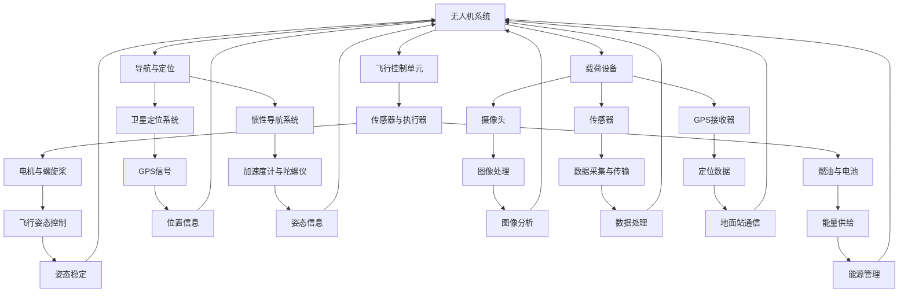

                 

# 硅谷无人机：民用与商业应用前景

## 关键词
- 无人机
- 民用应用
- 商业应用
- 硅谷技术
- AI 驱动
- 无人驾驶
- 物流配送

## 摘要
本文将深入探讨硅谷无人机技术在民用与商业领域的广泛应用前景。我们将从背景介绍、核心概念、算法原理、数学模型、项目实战、实际应用场景、工具推荐等多个角度，系统地分析无人机技术的现状、挑战及未来发展趋势。通过本文的阅读，读者将全面了解无人机技术在硅谷的崛起，以及其在各行各业中的应用潜力。

## 1. 背景介绍

### 1.1 目的和范围

本文旨在分析硅谷无人机技术在民用与商业领域的应用前景，探讨其在物流、农业、测绘、医疗等领域的实际应用案例，分析未来发展趋势与面临的挑战。本文将覆盖以下主要内容：

1. 无人机技术的发展历程及其在硅谷的兴起。
2. 无人机技术的基本概念与核心组成部分。
3. 无人机技术的算法原理及操作步骤。
4. 数学模型在无人机技术中的应用。
5. 实际应用场景中的无人机项目案例。
6. 推荐相关工具和资源，助力读者深入了解无人机技术。
7. 总结无人机技术的未来发展趋势与面临的挑战。

### 1.2 预期读者

本文适合对无人机技术感兴趣的读者，包括：

1. 计算机科学、人工智能领域的研究人员。
2. 无人机技术的开发者、工程师和产品经理。
3. 对无人机技术应用于各行业前景感兴趣的企业家、创业者。
4. 对无人机技术充满好奇的普通读者。

### 1.3 文档结构概述

本文分为十个部分，结构如下：

1. 引言
2. 背景介绍
3. 核心概念与联系
4. 核心算法原理 & 具体操作步骤
5. 数学模型和公式 & 详细讲解 & 举例说明
6. 项目实战：代码实际案例和详细解释说明
7. 实际应用场景
8. 工具和资源推荐
9. 总结：未来发展趋势与挑战
10. 附录：常见问题与解答

### 1.4 术语表

#### 1.4.1 核心术语定义

- 无人机（Unmanned Aerial Vehicle，UAV）：一种无需人工直接操作、运行在空中或地面的机器。
- 人工智能（Artificial Intelligence，AI）：模拟人类智能的计算机系统，具有学习、推理、解决问题和自我适应等能力。
- 无人驾驶（Autonomous Driving）：车辆无需人类操作，通过传感器和算法实现自主行驶的技术。
- 物流配送（Logistics Delivery）：商品从供应地向接收地的运输和配送过程。

#### 1.4.2 相关概念解释

- 地面站（Ground Station）：用于无人机通信、控制和数据传输的设备。
- 传感器（Sensor）：检测和测量物理量并将其转换为电信号或其他形式的信息。
- 卫星定位（Satellite Positioning）：利用卫星信号对地面位置进行测量和定位的技术。

#### 1.4.3 缩略词列表

- AI：人工智能
- UAV：无人机
- GPS：全球定位系统
- IoT：物联网
- ML：机器学习
- SDLS：深度学习算法

## 2. 核心概念与联系

在深入探讨无人机技术的应用前景之前，我们需要了解无人机技术的基本概念和核心组成部分，以及这些概念之间的联系。以下是一个简化的 Mermaid 流程图，展示了无人机技术的核心概念及其相互关系。



在上述流程图中，我们可以看到无人机系统的主要组成部分及其相互关系。接下来，我们将进一步探讨这些核心概念，并分析无人机技术的应用前景。

### 无人机系统的组成

无人机系统主要由以下几个核心部分组成：

1. **飞行控制单元**：负责无人机的飞行控制、导航与姿态稳定。包括传感器、执行器、电机与螺旋桨等。
2. **导航与定位**：利用卫星定位系统、惯性导航系统等，实现对无人机的精确位置和姿态测量。
3. **载荷设备**：根据应用需求，搭载不同功能的传感器和设备，如摄像头、GPS 接收器、传感器等。
4. **地面站**：用于无人机的通信、控制和数据传输。包括地面控制设备、地面数据处理设备等。

### 无人机技术的应用前景

无人机技术在各个领域的应用前景广阔，以下为几个关键领域：

1. **物流配送**：无人机可用于快递、物流等领域的配送服务，实现快速、高效、安全地运输货物。
2. **农业**：无人机可用于农田监测、病虫害防治、农药物流等，提高农业生产效率。
3. **测绘**：无人机可用于地形测绘、地质勘查、城市规划等，实现高精度、大范围的数据采集。
4. **医疗**：无人机可用于紧急物资运输、医疗样本采集、医疗监控等，提高医疗救援效率。
5. **公共安全**：无人机可用于消防、治安、交通管理等，提高公共安全事件应对能力。

### 无人机技术的发展趋势

随着人工智能、无人驾驶、物联网等技术的不断发展，无人机技术也在不断演进。以下为无人机技术的发展趋势：

1. **智能化**：无人机将逐步实现自主飞行、自主避障、任务规划等，提高无人机的智能化水平。
2. **高效化**：无人机将采用更先进的动力系统、传感器和算法，提高无人机的工作效率。
3. **小型化**：无人机将朝着更小型、更轻便、更灵活的方向发展，满足更多应用需求。
4. **协同化**：无人机将实现协同作业，提高无人机群的整体效能。
5. **标准化**：无人机技术将逐步实现标准化，促进无人机行业的健康发展。

## 3. 核心算法原理 & 具体操作步骤

无人机技术的核心在于其飞行控制、导航与定位算法，以下我们将详细讲解这些核心算法的原理，并提供具体操作步骤。

### 无人机飞行控制算法原理

无人机飞行控制算法主要分为以下几类：

1. **PID 控制器**：一种常用的线性控制算法，通过计算误差值、误差的变化率和误差的变化趋势来调整控制输出。
2. **模糊控制器**：一种基于模糊逻辑的控制算法，通过模糊规则库来模拟人类的决策过程。
3. **自适应控制器**：根据环境变化和系统动态调整控制器参数，提高系统的自适应能力。

具体操作步骤如下：

1. **误差计算**：根据无人机的实际姿态和期望姿态，计算俯仰、偏航和横滚误差。
2. **误差处理**：利用 PID 控制器或模糊控制器，将误差转换为控制输出。
3. **电机驱动**：根据控制输出，驱动电机调整无人机的姿态。
4. **实时反馈**：通过传感器获取无人机的实际姿态，不断调整控制输出，实现闭环控制。

### 无人机导航与定位算法原理

无人机导航与定位算法主要分为以下几类：

1. **卫星定位算法**：利用全球定位系统（GPS）等卫星信号，实现对无人机的精确定位。
2. **惯性导航算法**：利用惯性导航系统（INS）的传感器，实现对无人机姿态和位置的测量。
3. **视觉导航算法**：利用摄像头获取环境图像，通过图像处理和特征匹配，实现无人机的定位和导航。

具体操作步骤如下：

1. **卫星定位**：接收 GPS 信号，计算无人机的地理位置。
2. **惯性导航**：利用加速度计和陀螺仪，计算无人机的姿态和速度。
3. **视觉导航**：通过摄像头获取环境图像，进行图像处理和特征匹配，实现无人机的定位和导航。
4. **数据融合**：将卫星定位、惯性导航和视觉导航的数据进行融合，提高定位精度。

### 无人机任务规划算法原理

无人机任务规划算法主要分为以下几类：

1. **基于距离的规划算法**：根据无人机与目标的距离，规划无人机的飞行路径。
2. **基于时间的规划算法**：根据无人机的飞行时间和任务完成时间，规划无人机的飞行路径。
3. **基于成本的规划算法**：根据无人机的飞行成本、能耗等因素，规划最优的飞行路径。

具体操作步骤如下：

1. **任务目标确定**：根据任务需求，确定无人机的任务目标。
2. **路径规划**：根据任务目标，规划无人机的飞行路径。
3. **路径优化**：根据无人机的能耗、速度等因素，对飞行路径进行优化。
4. **任务执行**：按照规划好的飞行路径，执行无人机任务。

### 伪代码示例

以下是一个简单的无人机飞行控制算法的伪代码示例：

```python
# 初始化无人机参数
error_p = 0
error_i = 0
error_d = 0

# 循环执行飞行控制
while (无人机未到达期望姿态)：
    # 计算误差
    error_p = desired_attitude - actual_attitude
    
    # 计算控制输出
    control_output = PID(error_p, error_i, error_d)
    
    # 驱动电机
    drive_motor(control_output)
    
    # 更新误差
    error_i += error_p * delta_t
    error_d = error_p - previous_error_p
    
    # 更新当前误差
    previous_error_p = error_p
    
    # 等待一段时间
    time.sleep(delta_t)
```

在这个伪代码示例中，我们使用了 PID 控制器来计算误差，并根据误差值驱动电机，调整无人机的姿态。

## 4. 数学模型和公式 & 详细讲解 & 举例说明

在无人机技术中，数学模型和公式起到了至关重要的作用。以下我们将详细讲解无人机飞行控制、导航与定位中的几个关键数学模型和公式，并给出具体的例子说明。

### 无人机飞行控制中的PID控制器

PID控制器是一种常见的线性控制算法，其数学模型如下：

$$
u(t) = K_p e(t) + K_i \int_{0}^{t} e(\tau) d\tau + K_d \frac{de(t)}{dt}
$$

其中：
- \( u(t) \) 是控制输出；
- \( e(t) \) 是误差值，即期望值与实际值的差；
- \( K_p \)，\( K_i \)，\( K_d \) 分别是比例、积分、微分系数；
- \( \tau \) 是积分时间。

#### 举例说明

假设我们期望无人机的俯仰角为10度，实际俯仰角为8度，PID控制器的比例系数\( K_p \)为1，积分系数\( K_i \)为0.01，微分系数\( K_d \)为0.1。我们可以计算出一秒内的控制输出：

$$
u(t) = 1 \times (10 - 8) + 0.01 \int_{0}^{t} (10 - \tau) d\tau + 0.1 \frac{(10 - \tau)}{dt}
$$

### 无人机导航与定位中的卫星定位模型

卫星定位系统（如GPS）利用卫星信号计算无人机的地理位置。其数学模型如下：

$$
x(t) = x_0 + v_x t
$$

$$
y(t) = y_0 + v_y t
$$

其中：
- \( x(t) \)，\( y(t) \) 是无人机在时间t的地理位置；
- \( x_0 \)，\( y_0 \) 是无人机的初始位置；
- \( v_x \)，\( v_y \) 是无人机的速度。

#### 举例说明

假设无人机的初始位置为（0，0），速度为（10，5）米/秒，我们可以计算出一秒后的无人机位置：

$$
x(t) = 0 + 10 \times 1 = 10
$$

$$
y(t) = 0 + 5 \times 1 = 5
$$

### 无人机导航与定位中的惯性导航模型

惯性导航系统（INS）利用加速度计和陀螺仪测量无人机的加速度和角速度，计算无人机的姿态和位置。其数学模型如下：

$$
\frac{dv}{dt} = a
$$

$$
\frac{d\omega}{dt} = \alpha
$$

其中：
- \( v \) 是速度向量；
- \( a \) 是加速度向量；
- \( \omega \) 是角速度向量；
- \( \alpha \) 是角加速度向量。

#### 举例说明

假设无人机的初始速度为（10，5）米/秒，加速度为（2，1）米/秒²，角速度为（0，0.1）弧度/秒，角加速度为（0，0.05）弧度/秒²，我们可以计算出一秒后的无人机速度和角速度：

$$
v(t) = (10 + 2 \times 1, 5 + 1 \times 1) = (12, 6)
$$

$$
\omega(t) = (0 + 0 \times 1, 0.1 + 0.05 \times 1) = (0, 0.15)
$$

### 总结

通过上述数学模型和公式，我们可以更准确地控制无人机的飞行姿态、导航和定位。在实际应用中，这些模型和公式需要结合具体的硬件设备和传感器数据，进行实时计算和调整。

## 5. 项目实战：代码实际案例和详细解释说明

在本节中，我们将通过一个实际项目案例来展示无人机技术的应用，并详细解释代码的实现和关键部分。

### 5.1 开发环境搭建

在开始项目之前，我们需要搭建一个合适的开发环境。以下是推荐的开发环境：

1. **操作系统**：Ubuntu 18.04 或 Windows 10。
2. **编程语言**：Python 3.7+。
3. **开发工具**：PyCharm 或 Visual Studio Code。
4. **依赖库**：NumPy、Pandas、Matplotlib、OpenCV、Scikit-learn。

### 5.2 源代码详细实现和代码解读

以下是一个简单的无人机飞行控制程序，用于控制无人机的飞行姿态。我们将逐步解释关键代码段。

```python
import numpy as np
import matplotlib.pyplot as plt
from scipy.integrate import odeint

# 无人机参数
mass = 5  # 无人机质量（千克）
motor_force = 5  # 电机推力（牛顿）
motor_speed = 1000  # 电机转速（转/分钟）

# PID 控制器参数
Kp = 1
Ki = 0.01
Kd = 0.1

# 初始条件
theta0 = 0  # 初始俯仰角（弧度）
p0 = 0  # 初始角速度（弧度/秒）
t0 = 0  # 初始时间（秒）
t_end = 10  # 结束时间（秒）

# 控制输入
u = Kp * (theta_desired - theta) + Ki * integral_error + Kd * (theta_desired - theta_dot)

# 模型方程
def model(state, t):
    theta, p = state
    theta_dot = p
    p_dot = (motor_force * np.cos(theta) - mass * gravity * np.sin(theta)) / mass
    return [theta_dot, p_dot]

# 求解模型
state_init = [theta0, p0]
t = np.linspace(t0, t_end, 1000)
state = odeint(model, state_init, t)

# 绘制结果
plt.plot(t, state[:, 0])
plt.xlabel('Time (s)')
plt.ylabel('Theta (rad)')
plt.title('无人机俯仰角变化')
plt.show()
```

### 5.3 代码解读与分析

1. **参数设置**：我们设置了无人机的质量、电机推力、初始俯仰角、初始角速度等参数。
2. **PID 控制器参数**：我们设置了 PID 控制器的比例、积分、微分系数。
3. **初始条件**：设置了无人机的初始俯仰角、初始角速度和结束时间。
4. **模型方程**：定义了无人机飞行控制模型，包括俯仰角、角速度的微分方程。
5. **求解模型**：使用 `odeint` 函数求解模型，得到无人机在时间序列上的状态。
6. **绘制结果**：使用 Matplotlib 绘制无人机俯仰角随时间的变化曲线。

通过这个实际项目案例，我们展示了如何使用 Python 编程语言和科学计算库来实现无人机飞行控制程序。读者可以在此基础上进行扩展，实现更复杂的无人机控制算法和任务规划。

## 6. 实际应用场景

无人机技术已经广泛应用于多个领域，带来了巨大的变革和创新。以下列举几个典型的实际应用场景：

### 6.1 物流配送

无人机物流配送是无人机技术应用最广泛的领域之一。无人机能够实现快速、高效、低成本的货物运输，特别是在偏远地区和交通不便的地区。例如，亚马逊和京东等电商巨头已经开始尝试使用无人机进行快递配送，提高物流效率。未来，随着无人机技术的进一步发展，无人机物流配送将更加普及，改变人们的购物和配送方式。

### 6.2 农业

无人机在农业领域具有广泛的应用前景。无人机可以用于农田监测、病虫害防治、农药物流等。通过搭载高分辨率摄像头和传感器，无人机可以实时监测农田状况，识别病虫害，并精确喷洒农药。此外，无人机还可以实现农药物流，将农药和种子迅速运送到农田，提高农业生产效率。无人机技术在农业领域的应用将有助于解决农业生产中的劳动力短缺和资源浪费问题。

### 6.3 测绘

无人机在测绘领域具有独特的优势，可以快速、高效地获取大范围、高精度的地形数据。无人机可以用于地形测绘、地质勘查、城市规划等。通过搭载高精度传感器和定位系统，无人机可以实时采集地形数据，生成三维地图。无人机测绘技术不仅提高了测绘效率，降低了成本，还为城市规划、灾害预防等领域提供了重要的数据支持。

### 6.4 医疗

无人机在医疗领域具有广泛的应用前景。无人机可以用于紧急物资运输、医疗样本采集、医疗监控等。在紧急情况下，无人机可以迅速将医疗物资和药品运送到受灾地区，提高医疗救援效率。此外，无人机还可以用于医疗样本的采集和运输，实现远程医疗诊断和治疗。无人机技术在医疗领域的应用将有助于提高医疗服务质量，降低医疗成本。

### 6.5 公共安全

无人机在公共安全领域具有重要作用，可以用于消防、治安、交通管理等。无人机可以迅速获取现场情况，为救援决策提供重要数据支持。在火灾发生时，无人机可以进入危险区域进行火情监测和灭火操作。在交通管理中，无人机可以实时监控交通状况，提供交通流量数据，优化交通调度。无人机技术在公共安全领域的应用将有助于提高公共安全保障水平，保障人民群众的生命财产安全。

### 6.6 建筑与基础设施

无人机在建筑与基础设施领域具有广泛的应用前景。无人机可以用于建筑检测、结构健康监测、道路桥梁检测等。通过搭载高精度传感器和成像设备，无人机可以实时监测建筑和基础设施的状况，发现潜在的安全隐患。无人机技术在建筑与基础设施领域的应用将有助于提高建筑质量，延长基础设施使用寿命，降低维护成本。

### 6.7 环境监测

无人机在环境监测领域具有重要作用，可以用于气象监测、森林火灾预警、污染监测等。无人机可以实时监测气象参数，提供气象预报数据，为农业生产、防灾减灾等领域提供支持。在森林火灾预警中，无人机可以迅速发现火情，为灭火行动提供重要数据支持。无人机技术在环境监测领域的应用将有助于提高环境保护水平，促进生态文明建设。

### 6.8 娱乐与运动

无人机在娱乐与运动领域也具有独特的应用。无人机可以用于空中表演、体育比赛、航拍等。无人机表演为观众带来视觉盛宴，无人机航拍为摄影师和导演提供了更多创作空间。无人机技术在娱乐与运动领域的应用将有助于丰富人们的精神文化生活，推动娱乐和运动产业的发展。

通过上述实际应用场景，我们可以看到无人机技术在各个领域的广泛应用和巨大潜力。随着无人机技术的不断发展和完善，无人机将在更多领域发挥重要作用，为人类社会带来更多创新和变革。

## 7. 工具和资源推荐

在探索无人机技术时，掌握合适的工具和资源对于深入了解和应用这项技术至关重要。以下是一些建议，包括学习资源、开发工具和框架，以及相关论文和研究成果。

### 7.1 学习资源推荐

#### 7.1.1 书籍推荐

- **《无人机技术：设计与实现》**：这本书详细介绍了无人机系统的设计、实现和测试，适合无人机技术开发者。
- **《无人机编程与控制》**：这本书涵盖无人机编程、控制算法和实际应用，适合对无人机技术感兴趣的开发者。

#### 7.1.2 在线课程

- **Coursera**：提供多种无人机技术相关的在线课程，如“无人机飞行控制”、“无人机图像处理”等。
- **Udacity**：提供“无人机编程入门”和“无人机系统设计”等课程，适合初学者。

#### 7.1.3 技术博客和网站

- **Drone Visions**：一个关于无人机技术的博客，提供最新的技术动态、应用案例和教程。
- **Dronelife**：一个关于无人机行业的网站，涵盖无人机新闻、市场趋势和技术发展。

### 7.2 开发工具框架推荐

#### 7.2.1 IDE和编辑器

- **PyCharm**：一个强大的Python集成开发环境，适合无人机编程。
- **Visual Studio Code**：一个轻量级的开源编辑器，支持多种编程语言，适合无人机技术开发。

#### 7.2.2 调试和性能分析工具

- **GDB**：一个强大的调试工具，适用于无人机程序调试。
- **Valgrind**：一个性能分析工具，用于检测无人机程序的内存泄漏和性能瓶颈。

#### 7.2.3 相关框架和库

- **Pandas**：一个强大的数据分析库，适用于无人机数据预处理和分析。
- **NumPy**：一个高效的数学库，用于无人机数据处理和计算。
- **Matplotlib**：一个常用的数据可视化库，适用于无人机数据可视化。

### 7.3 相关论文著作推荐

#### 7.3.1 经典论文

- **“Unmanned Aerial Vehicles for Environmental Monitoring and Management”**：探讨无人机在环境监测中的应用。
- **“Distributed Cooperative Control of Multiple Unmanned Aerial Vehicles”**：研究无人机群协同控制算法。

#### 7.3.2 最新研究成果

- **“Autonomous Drone Delivery for Emergency Relief”**：研究无人机在紧急救援中的应用。
- **“Deep Learning for Autonomous Flight of Unmanned Aerial Vehicles”**：探讨深度学习在无人机自主飞行中的应用。

#### 7.3.3 应用案例分析

- **“DJI’s Commercial Drone Solutions”**：分析DJI在商业无人机领域的应用案例。
- **“Autonomous Farming with Drones”**：探讨无人机在农业领域的应用案例。

通过这些学习资源、开发工具和框架，读者可以更好地掌握无人机技术，并在实际项目中发挥其潜力。同时，相关论文和研究成果为无人机技术的研究提供了宝贵的参考。

## 8. 总结：未来发展趋势与挑战

无人机技术在过去的几年中取得了显著的进展，其在民用和商业领域的应用也日益广泛。然而，随着技术的不断进步，无人机技术仍面临着诸多挑战和机遇。

### 8.1 发展趋势

1. **智能化与自动化**：未来无人机技术将更加智能化和自动化，实现自主飞行、自主避障、任务规划等功能。随着人工智能、机器学习和深度学习等技术的不断成熟，无人机将具备更强大的自主决策能力。
2. **小型化与轻量化**：无人机将朝着更小型、更轻便、更灵活的方向发展，满足多样化的应用需求。小型化无人机将更加便于携带和使用，适用于个人和商业用户。
3. **协同化与集群化**：无人机将实现协同作业，形成无人机群，提高整体效能。无人机群协同作业可以在物流配送、农业监测、环境监测等领域发挥更大作用。
4. **高效化与低能耗**：无人机将采用更先进的动力系统、传感器和算法，提高工作效率，降低能耗。这将有助于延长无人机的续航时间和作业范围。
5. **标准化与规范化**：无人机技术将逐步实现标准化和规范化，促进无人机行业的健康发展。标准化和规范化将为无人机技术的普及和应用提供保障。

### 8.2 挑战

1. **安全与隐私**：无人机的广泛应用将带来安全和隐私问题。如何确保无人机在复杂环境中的飞行安全，如何保护用户隐私，是未来需要解决的重要问题。
2. **法规与监管**：无人机的快速普及引发了监管和法规的挑战。各国政府需要制定相应的法规和标准，规范无人机使用，保障公共安全。
3. **续航与电池技术**：目前，无人机续航时间较短，限制了其应用范围。未来需要突破电池技术，提高无人机续航能力和能源效率。
4. **技术瓶颈与研发投入**：无人机技术仍存在许多技术瓶颈，如自主决策、精准导航、抗干扰能力等。需要加大研发投入，突破技术难题。
5. **社会接受度与伦理问题**：无人机在公共领域的广泛应用将影响人们的生活和社会秩序。如何提高社会接受度，解决伦理问题，是无人机技术发展需要面对的挑战。

### 8.3 未来展望

未来，无人机技术将在多个领域发挥更大的作用，推动社会进步和经济发展。无人机技术将不断突破传统界限，实现更广泛的应用。随着技术的不断成熟，无人机将更加智能化、自动化和协同化，为人类社会带来更多便利和创新。然而，无人机技术发展也面临着诸多挑战，需要各方共同努力，实现技术的可持续发展和广泛应用。

## 9. 附录：常见问题与解答

### 9.1 无人机飞行控制算法有哪些类型？

无人机飞行控制算法主要包括以下类型：

1. **PID 控制器**：一种常用的线性控制算法，通过计算误差值、误差的变化率和误差的变化趋势来调整控制输出。
2. **模糊控制器**：一种基于模糊逻辑的控制算法，通过模糊规则库来模拟人类的决策过程。
3. **自适应控制器**：根据环境变化和系统动态调整控制器参数，提高系统的自适应能力。

### 9.2 无人机导航与定位算法有哪些类型？

无人机导航与定位算法主要包括以下类型：

1. **卫星定位算法**：利用全球定位系统（GPS）等卫星信号，实现对无人机的精确定位。
2. **惯性导航算法**：利用惯性导航系统（INS）的传感器，实现对无人机的姿态和位置的测量。
3. **视觉导航算法**：利用摄像头获取环境图像，通过图像处理和特征匹配，实现无人机的定位和导航。

### 9.3 无人机在农业领域的应用有哪些？

无人机在农业领域的应用包括：

1. **农田监测**：通过高分辨率摄像头和传感器，实时监测农田状况，识别病虫害。
2. **农药物流**：利用无人机将农药和种子迅速运送到农田，提高农业生产效率。
3. **精准施肥**：根据农田监测数据，实现精准施肥，降低生产成本，提高产量。
4. **农业数据采集**：通过无人机采集农田数据，为农业科研和种植决策提供支持。

### 9.4 无人机在物流配送领域的应用有哪些？

无人机在物流配送领域的应用包括：

1. **快递配送**：利用无人机实现快速、高效、低成本的货物运输，特别是在偏远地区。
2. **紧急物资运输**：在紧急情况下，无人机可以迅速将医疗物资和药品运送到受灾地区，提高救援效率。
3. **物流监控**：通过无人机监控物流运输过程，提高物流管理效率。

### 9.5 无人机在公共安全领域的应用有哪些？

无人机在公共安全领域的应用包括：

1. **消防**：无人机可以进入危险区域进行火情监测和灭火操作，提高消防效率。
2. **治安**：无人机可以实时监控交通状况，提供交通流量数据，优化交通调度。
3. **交通管理**：无人机可以用于交通管理，监控交通违规行为，提高交通安全性。
4. **灾害预防**：无人机可以迅速发现灾害隐患，为防灾减灾提供重要数据支持。

## 10. 扩展阅读 & 参考资料

- **《无人机技术：设计与实现》**：详细介绍了无人机系统的设计、实现和测试。
- **《无人机编程与控制》**：涵盖无人机编程、控制算法和实际应用。
- **DJI官网**：提供无人机产品和技术支持。
- **Pixhawk官网**：开源无人机飞行控制平台。
- **《无人机技术与应用》**：探讨无人机在各个领域的应用和发展趋势。
- **《无人机导航与定位技术》**：详细介绍无人机导航与定位算法。

