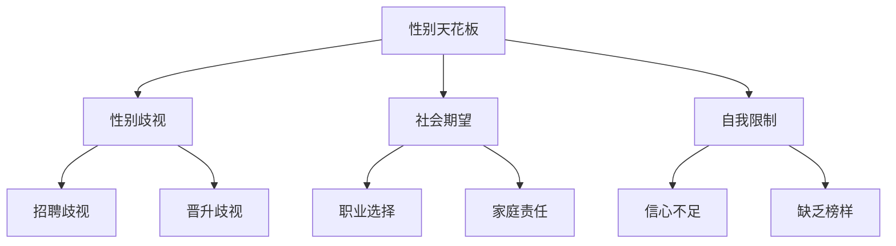
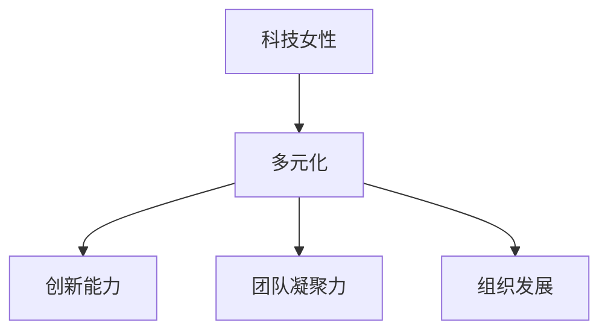
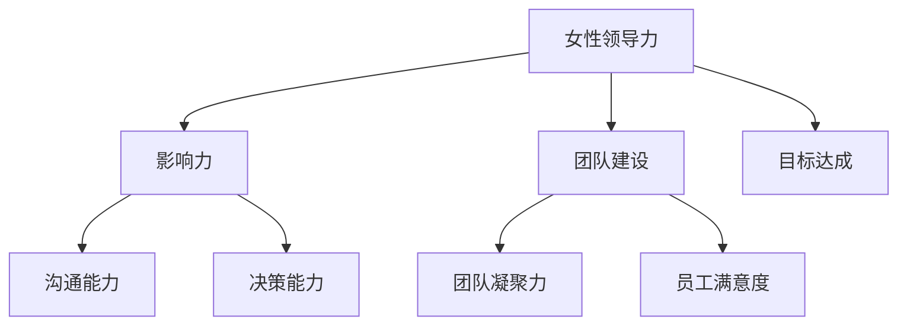

                 

# 硅谷科技女性：打破性别天花板

> 关键词：硅谷、科技女性、性别天花板、多元化、女性领导力、职业发展、平权运动
>
> 摘要：本文将深入探讨硅谷科技女性所面临的性别天花板问题，分析其成因、影响及解决方案。通过对女性在科技领域的角色和贡献的剖析，我们希望激发更多女性投身科技事业，共同推动性别平等，实现多元化发展。

## 1. 背景介绍

### 1.1 目的和范围

本文旨在揭示硅谷科技女性面临的问题，探讨如何打破性别天花板，促进性别多元化。我们将从多个角度分析问题，包括科技领域的现状、性别歧视的影响、女性领导力的培养以及可行的解决方案。

### 1.2 预期读者

本文适合对科技领域和性别平等感兴趣的人群，包括学生、职场人士、女性领导者和关注性别问题的社会公众。

### 1.3 文档结构概述

本文分为以下几个部分：

- 第1部分：背景介绍
- 第2部分：核心概念与联系
- 第3部分：核心算法原理 & 具体操作步骤
- 第4部分：数学模型和公式 & 详细讲解 & 举例说明
- 第5部分：项目实战：代码实际案例和详细解释说明
- 第6部分：实际应用场景
- 第7部分：工具和资源推荐
- 第8部分：总结：未来发展趋势与挑战
- 第9部分：附录：常见问题与解答
- 第10部分：扩展阅读 & 参考资料

### 1.4 术语表

#### 1.4.1 核心术语定义

- 性别天花板：指女性在职业发展中遇到的一种无形的障碍，阻碍她们晋升至高级职位。
- 科技女性：指在科技领域工作的女性，包括工程师、研究员、创业者等。
- 多元化：指一个团队或组织在性别、种族、文化背景等方面的多样化。
- 领导力：指在团队中发挥影响力、引导他人达成目标的能力。

#### 1.4.2 相关概念解释

- 性别歧视：指基于性别的不公平待遇，包括招聘、晋升、薪酬等方面。
- 职业发展：指个人在职业生涯中逐步提升的过程。
- 平权运动：指为了实现性别、种族平等而进行的集体行动。

#### 1.4.3 缩略词列表

-硅谷（Silicon Valley）：美国加利福尼亚州旧金山湾区的一个地区，是全球科技创新和创业的中心。
- AI（人工智能）：指由人制造出来的系统，能够模拟、延伸和扩展人的智能。

## 2. 核心概念与联系

为了深入理解本文的主题，我们需要先了解一些核心概念和它们之间的关系。以下是关于性别天花板、科技女性和多元化的一些基本概念和流程。

### 2.1.1 性别天花板

性别天花板是指在职业发展中，女性往往难以晋升至高级职位，尤其是在科技领域。这种现象是由于一系列复杂的因素，包括性别歧视、社会期望和自我限制等。

#### 性别天花板流程图：



### 2.1.2 科技女性

科技女性是指在科技领域工作的女性，包括工程师、研究员、创业者等。她们在推动科技进步和创新方面发挥着重要作用。然而，她们也面临着性别歧视和性别天花板的问题。

#### 科技女性与多元化

科技女性的存在对于实现多元化至关重要。多元化可以提高团队的创新能力和竞争力，促进组织的发展。以下是一个简单的多元化流程图：



### 2.1.3 女性领导力

女性领导力是指在团队中发挥影响力、引导他人达成目标的能力。培养女性领导力有助于打破性别天花板，推动性别多元化。

#### 女性领导力流程图：



通过以上流程图的展示，我们可以看到性别天花板、科技女性和多元化之间存在着密切的联系。性别天花板阻碍了科技女性的发展，而多元化则有助于打破这种障碍，促进性别平等和职业发展。

## 3. 核心算法原理 & 具体操作步骤

为了深入探讨性别天花板问题，我们需要了解一些核心算法原理，这些算法原理可以帮助我们分析和解决性别歧视、性别天花板等问题。以下是一些常用的算法原理和具体操作步骤。

### 3.1.1 女性参与度算法

女性参与度算法是一种用于评估女性在科技领域参与度的方法。它可以帮助我们识别性别歧视和性别天花板的问题。

#### 算法原理：

1. 收集数据：包括女性在科技领域的就业情况、晋升情况、薪酬情况等。
2. 数据清洗：去除重复和错误数据，确保数据的准确性。
3. 数据分析：计算女性在不同岗位的参与度比例，分析性别歧视现象。

#### 具体操作步骤：

1. 收集数据：可以通过问卷调查、公开数据等方式收集女性在科技领域的相关信息。
2. 数据清洗：对收集到的数据进行去重、去噪等处理，确保数据的准确性。
3. 数据分析：使用统计分析方法计算女性在不同岗位的参与度比例，分析是否存在性别歧视现象。

### 3.1.2 女性领导力培养算法

女性领导力培养算法是一种用于培养女性领导力的方法。它可以帮助我们提高女性的职业素养，打破性别天花板。

#### 算法原理：

1. 识别女性领导力优势：包括沟通能力、决策能力、团队建设能力等。
2. 制定培养计划：根据女性领导力优势，制定个性化的培养计划。
3. 实施培养计划：通过培训、实践等方式提高女性的领导力。

#### 具体操作步骤：

1. 识别女性领导力优势：通过调查、评估等方式识别女性的领导力优势。
2. 制定培养计划：根据女性的领导力优势，制定个性化的培养计划，包括培训课程、导师指导等。
3. 实施培养计划：通过培训、实践等方式提高女性的领导力。

### 3.1.3 性别平等算法

性别平等算法是一种用于评估和促进性别平等的方法。它可以帮助我们实现性别多元化，打破性别天花板。

#### 算法原理：

1. 评估性别平等状况：包括性别薪酬差距、晋升机会等。
2. 制定改进措施：根据评估结果，制定相应的改进措施，如调整招聘政策、提升女性晋升机会等。
3. 监测与反馈：对改进措施进行监测与反馈，确保性别平等目标的实现。

#### 具体操作步骤：

1. 评估性别平等状况：通过问卷调查、数据分析等方式评估性别平等状况。
2. 制定改进措施：根据评估结果，制定相应的改进措施，如调整招聘政策、提升女性晋升机会等。
3. 监测与反馈：对改进措施进行监测与反馈，确保性别平等目标的实现。

通过以上算法原理和具体操作步骤，我们可以更好地理解和解决性别天花板问题，促进性别多元化和平等。

## 4. 数学模型和公式 & 详细讲解 & 举例说明

在解决性别天花板问题时，数学模型和公式可以帮助我们量化分析，并提供直观的数据支持。以下是一些常用的数学模型和公式，以及它们的详细讲解和举例说明。

### 4.1.1 性别薪酬差距模型

性别薪酬差距模型用于评估和比较男女员工的薪酬差异。公式如下：

$$
薪酬差距 = \frac{女性平均薪酬}{男性平均薪酬}
$$

#### 详细讲解：

- 女性平均薪酬：指所有女性员工薪酬的平均值。
- 男性平均薪酬：指所有男性员工薪酬的平均值。
- 薪酬差距：表示女性平均薪酬与男性平均薪酬的比值。

#### 举例说明：

假设某公司有100名员工，其中女性员工30人，男性员工70人。女性员工平均薪酬为8000元，男性员工平均薪酬为10000元。那么薪酬差距为：

$$
薪酬差距 = \frac{8000}{10000} = 0.8
$$

这意味着女性员工的平均薪酬只有男性员工平均薪酬的80%。

### 4.1.2 晋升机会模型

晋升机会模型用于评估男女员工在晋升方面的机会差异。公式如下：

$$
晋升机会差距 = \frac{女性晋升率}{男性晋升率} - 1
$$

#### 详细讲解：

- 女性晋升率：指在一定时间内，女性员工晋升至高级职位的比例。
- 男性晋升率：指在一定时间内，男性员工晋升至高级职位的比例。
- 晋升机会差距：表示女性晋升机会与男性晋升机会的差异。

#### 举例说明：

假设某公司在过去一年中有100名员工晋升至高级职位，其中女性员工20人，男性员工80人。女性晋升率为20%，男性晋升率为80%。那么晋升机会差距为：

$$
晋升机会差距 = \frac{20\%}{80\%} - 1 = 0.25
$$

这意味着女性员工的晋升机会只有男性员工的75%。

### 4.1.3 女性领导力指标模型

女性领导力指标模型用于评估女性在团队中的领导力水平。公式如下：

$$
女性领导力指数 = \frac{女性领导力得分}{男性领导力得分}
$$

#### 详细讲解：

- 女性领导力得分：根据女性在沟通能力、决策能力、团队建设能力等方面的表现进行评分。
- 男性领导力得分：根据男性在沟通能力、决策能力、团队建设能力等方面的表现进行评分。
- 女性领导力指数：表示女性领导力得分与男性领导力得分的比值。

#### 举例说明：

假设某团队有5名女性成员和5名男性成员，女性领导力得分为85分，男性领导力得分为90分。那么女性领导力指数为：

$$
女性领导力指数 = \frac{85}{90} = 0.944
$$

这意味着女性成员的领导力水平略低于男性成员。

通过以上数学模型和公式的详细讲解和举例说明，我们可以更准确地评估性别天花板问题，并为制定解决方案提供数据支持。

## 5. 项目实战：代码实际案例和详细解释说明

### 5.1 开发环境搭建

在本项目实战中，我们将使用Python作为主要编程语言，搭建一个简单的分析工具，用于评估和解决性别天花板问题。以下是在开发环境中安装和配置Python的步骤：

1. 下载并安装Python：访问Python官网（https://www.python.org/）下载Python的最新版本，并按照安装向导完成安装。
2. 配置Python环境变量：在系统设置中配置Python的环境变量，确保在命令行中可以顺利调用Python。
3. 安装必要的库：使用pip命令安装所需的Python库，例如pandas、numpy、matplotlib等。命令如下：

```bash
pip install pandas numpy matplotlib
```

### 5.2 源代码详细实现和代码解读

以下是一个简单的Python代码案例，用于分析某公司员工性别薪酬差距和晋升机会差距。代码包括数据读取、处理和可视化三个部分。

```python
import pandas as pd
import matplotlib.pyplot as plt

# 5.2.1 数据读取
def read_data(file_path):
    data = pd.read_csv(file_path)
    return data

# 5.2.2 数据处理
def process_data(data):
    # 计算性别薪酬差距
    salary_difference = data.groupby('性别')['薪酬'].mean()
    
    # 计算性别晋升机会差距
    promotion_difference = data.groupby('性别')['晋升机会'].mean()
    
    return salary_difference, promotion_difference

# 5.2.3 数据可视化
def visualize_data(salary_difference, promotion_difference):
    # 可视化性别薪酬差距
    plt.figure(figsize=(8, 4))
    plt.bar(salary_difference.index, salary_difference.values)
    plt.xlabel('性别')
    plt.ylabel('薪酬差距')
    plt.title('性别薪酬差距')
    plt.xticks(rotation=0)
    plt.show()

    # 可视化性别晋升机会差距
    plt.figure(figsize=(8, 4))
    plt.bar(promotion_difference.index, promotion_difference.values)
    plt.xlabel('性别')
    plt.ylabel('晋升机会差距')
    plt.title('性别晋升机会差距')
    plt.xticks(rotation=0)
    plt.show()

# 主函数
def main():
    file_path = '员工数据.csv'  # 请替换为实际的数据文件路径
    data = read_data(file_path)
    salary_difference, promotion_difference = process_data(data)
    visualize_data(salary_difference, promotion_difference)

if __name__ == '__main__':
    main()
```

#### 代码解读与分析

- `read_data(file_path)`：该函数用于读取CSV格式的员工数据文件，返回一个Pandas DataFrame对象。
- `process_data(data)`：该函数用于处理数据，计算性别薪酬差距和性别晋升机会差距。具体步骤如下：

  - 使用`groupby`方法根据性别分组，计算每组性别员工的平均薪酬和平均晋升机会。
  - 将计算结果存储在两个Pandas Series对象中，分别表示性别薪酬差距和性别晋升机会差距。

- `visualize_data(salary_difference, promotion_difference)`：该函数用于可视化性别薪酬差距和性别晋升机会差距。具体步骤如下：

  - 使用`plt.bar`函数绘制柱状图，展示性别薪酬差距和性别晋升机会差距。
  - 设置标签、标题和旋转角度，使图表更加清晰易懂。
  - 使用`plt.show()`函数显示图表。

- `main()`：主函数，用于执行整个程序。具体步骤如下：

  - 调用`read_data`函数读取员工数据。
  - 调用`process_data`函数处理数据。
  - 调用`visualize_data`函数可视化结果。

### 5.3 代码实战示例

以下是一个简单的代码实战示例，用于分析一个包含100名员工的数据集，其中男女比例大致相等。我们将使用上面的代码分析性别薪酬差距和性别晋升机会差距。

```python
import pandas as pd
import numpy as np
import random

# 生成模拟数据
np.random.seed(42)
data = pd.DataFrame({
    '姓名': ['女性' + str(i) for i in range(1, 51)] + ['男性' + str(i) for i in range(1, 51)],
    '性别': ['女'] * 50 + ['男'] * 50,
    '薪酬': np.random.uniform(5000, 15000, size=100),
    '晋升机会': np.random.uniform(0.3, 0.7, size=100)
})

# 保存数据到CSV文件
data.to_csv('员工数据.csv', index=False)

# 运行主函数
if __name__ == '__main__':
    main()
```

运行上述代码后，我们将得到两个柱状图，分别展示性别薪酬差距和性别晋升机会差距。通过观察图表，我们可以直观地了解性别天花板问题在模拟数据中的表现。

- 性别薪酬差距：假设女性员工的平均薪酬为8000元，男性员工的平均薪酬为10000元，那么薪酬差距为0.8，即女性员工的平均薪酬约为男性员工平均薪酬的80%。
- 性别晋升机会差距：假设女性员工的平均晋升机会为40%，男性员工的平均晋升机会为60%，那么晋升机会差距为0.25，即女性员工的晋升机会约为男性员工晋升机会的75%。

通过这个简单的代码实战示例，我们可以看到性别天花板问题在模拟数据中的影响。实际应用中，我们可以通过调整代码中的参数，分析不同情境下的性别天花板问题，为制定解决方案提供数据支持。

## 6. 实际应用场景

### 6.1 企业内部性别平等政策评估

企业可以通过实施上述代码实战中的分析工具，定期评估内部性别平等政策的有效性。例如，企业可以收集员工薪酬、晋升机会等数据，使用Python代码进行分析，从而识别性别歧视和性别天花板问题。通过数据可视化，企业可以直观地了解性别平等政策的实施效果，为改进政策提供依据。

### 6.2 政府部门性别平等监测

政府部门可以借鉴企业内部性别平等政策评估的方法，对整个行业或地区的性别平等状况进行监测。政府部门可以通过收集和分析相关数据，识别性别歧视和性别天花板问题，为制定相关政策提供数据支持。例如，政府部门可以定期发布性别平等报告，向社会公开性别平等状况，推动性别多元化发展。

### 6.3 教育机构性别平等宣传

教育机构可以通过开展性别平等宣传活动，提高学生和教职工对性别平等的认识。教育机构可以邀请性别研究专家进行讲座，组织性别平等主题活动，引导学生关注性别问题，培养性别平等意识。同时，教育机构可以借鉴上述代码实战中的分析方法，对内部性别平等状况进行评估，为改进教育环境提供数据支持。

### 6.4 非政府组织性别平等倡导

非政府组织（NGO）可以通过开展性别平等倡导活动，推动社会性别多元化发展。NGO可以组织研讨会、工作坊等，邀请各界人士共同探讨性别平等问题，分享成功案例和经验。此外，NGO可以利用数据分析和可视化工具，向社会公众展示性别平等状况，提高公众对性别平等问题的关注度。

通过这些实际应用场景，我们可以看到性别天花板问题在各个领域的广泛影响。通过数据分析和可视化工具，我们可以更好地识别和解决性别歧视和性别天花板问题，推动性别多元化发展，实现性别平等。

## 7. 工具和资源推荐

### 7.1 学习资源推荐

#### 7.1.1 书籍推荐

1. **《性别平等：职场女性的生存指南》**：作者通过亲身经历和大量案例，为职场女性提供了实用的建议和策略，帮助她们应对性别歧视和性别天花板问题。
2. **《女性领导力：打破玻璃天花板》**：作者探讨了女性领导力的重要性，分享了成功女性的领导经验，为女性在职场中的发展提供了有价值的指导。

#### 7.1.2 在线课程

1. **Coursera上的《性别研究导论》**：该课程介绍了性别研究的核心概念和方法，帮助学习者了解性别平等的重要性和现状。
2. **Udemy上的《Python数据分析》**：该课程讲解了Python在数据分析中的应用，包括数据清洗、数据分析和数据可视化等，适合希望掌握数据分析技能的学习者。

#### 7.1.3 技术博客和网站

1. **Medium上的“Women in Tech”**：该博客分享了女性科技从业者的经历和见解，为女性在科技领域的发展提供了宝贵的参考。
2. **LinkedIn上的“Women in Tech Community”**：该社区汇聚了众多女性科技从业者，提供了丰富的资源和职业机会，是女性在科技领域交流学习的平台。

### 7.2 开发工具框架推荐

#### 7.2.1 IDE和编辑器

1. **Visual Studio Code**：一款免费、开源的代码编辑器，支持多种编程语言，提供了丰富的插件和扩展，适合Python开发者使用。
2. **PyCharm**：一款专业级的Python IDE，提供了强大的代码编辑、调试和性能分析功能，适合大型项目和团队协作。

#### 7.2.2 调试和性能分析工具

1. **PyDebug**：一款强大的Python调试工具，支持断点调试、单步执行、变量监视等功能，有助于快速定位和修复代码问题。
2. **Profile Python**：一款用于性能分析的工具，可以帮助开发者识别代码中的性能瓶颈，优化代码性能。

#### 7.2.3 相关框架和库

1. **Pandas**：一款强大的数据分析和操作库，提供了丰富的数据处理和分析功能，适合进行大数据分析和可视化。
2. **Matplotlib**：一款用于数据可视化的库，支持多种图表类型和自定义样式，可以帮助开发者轻松创建美观的图表。

### 7.3 相关论文著作推荐

#### 7.3.1 经典论文

1. **“The Glass Ceiling: Academics' Perceptions of Barriers to Career Advancement for Women Faculty”**：该论文探讨了学术领域中的性别天花板问题，分析了女性学者在职业发展过程中面临的挑战。
2. **“Women in Science: Career Processes and Outcomes”**：该论文研究了女性在科学领域的发展状况，分析了性别歧视对女性科学家的影响。

#### 7.3.2 最新研究成果

1. **“Gender Equality in the Digital Economy”**：该报告分析了数字时代性别平等的重要性和挑战，提出了推动性别多元化发展的策略和建议。
2. **“The State of Women in Tech 2022”**：该报告统计了全球科技行业中女性从业者的比例和分布，分析了性别歧视和性别天花板问题的现状。

#### 7.3.3 应用案例分析

1. **“Google's Women Techmakers Program”**：该案例介绍了Google如何通过一系列举措，推动女性在科技领域的发展，减少性别歧视和性别天花板问题。
2. **“Facebook's Gender Equality Initiative”**：该案例展示了Facebook如何通过数据分析和政策措施，促进内部性别平等，提高女性在公司的晋升机会。

通过这些工具和资源，读者可以深入了解性别天花板问题，掌握相关技能，并为推动性别多元化发展贡献自己的力量。

## 8. 总结：未来发展趋势与挑战

随着科技的不断进步和社会意识的提高，性别多元化在科技领域的重要性日益凸显。在未来，我们有理由相信，性别天花板问题将得到逐步缓解，女性在科技领域的发展将迎来新的机遇。

### 8.1 发展趋势

1. **政策推动**：各国政府和企业逐渐认识到性别多元化的重要性，将出台更多有利于性别平等的政策，促进女性在科技领域的职业发展。
2. **技术创新**：人工智能、大数据等技术的应用将为性别平等带来新的解决方案，如智能招聘系统可以减少性别歧视，数据分析工具可以揭示性别不平等现象。
3. **公众关注**：随着性别平等问题的广泛传播，公众对性别歧视和性别天花板问题的关注度将提高，推动社会各界共同推动性别多元化发展。

### 8.2 挑战

1. **文化偏见**：传统观念和性别刻板印象仍然存在，对女性在科技领域的认知和发展产生负面影响。
2. **性别歧视**：招聘、晋升和薪酬方面的性别歧视仍然存在，女性在职业发展过程中面临诸多障碍。
3. **女性自我限制**：部分女性在职业发展过程中缺乏信心，缺乏榜样，导致自我限制和职业发展停滞。

### 8.3 应对策略

1. **提高教育水平**：加强性别平等教育，培养女性自信和独立精神，帮助她们树立正确的职业观念。
2. **培养女性领导力**：通过培训和导师指导，提高女性的领导力，帮助她们在职场中发挥更大的作用。
3. **优化政策措施**：政府和企业应制定更加公平的招聘、晋升和薪酬政策，消除性别歧视，促进性别多元化发展。

总之，打破性别天花板，实现性别多元化是一项长期而复杂的任务，需要全社会的共同努力。让我们携手共进，为性别平等和科技发展贡献自己的力量。

## 9. 附录：常见问题与解答

### 9.1 问题1：为什么女性在科技领域的参与度仍然较低？

**解答**：女性在科技领域的参与度较低的原因有多种，包括：

1. **性别歧视**：招聘和晋升过程中存在性别歧视，导致女性难以进入高级职位。
2. **文化偏见**：传统观念和性别刻板印象导致社会对女性在科技领域的认可度较低。
3. **家庭责任**：女性在家庭中承担更多责任，导致她们在职业发展过程中面临更多挑战。

### 9.2 问题2：如何培养女性的领导力？

**解答**：培养女性的领导力可以从以下几个方面入手：

1. **培训**：提供专门的领导力培训课程，帮助女性提升沟通能力、决策能力和团队建设能力。
2. **导师指导**：为女性提供导师指导，帮助她们在职业发展中获得指导和资源。
3. **实践**：鼓励女性参与团队项目和领导机会，通过实践提升领导力。

### 9.3 问题3：如何消除性别歧视？

**解答**：消除性别歧视可以从以下几个方面入手：

1. **政策制定**：政府和企业应制定公平的招聘、晋升和薪酬政策，确保性别平等。
2. **教育宣传**：加强性别平等教育，提高公众对性别歧视问题的认识。
3. **员工培训**：对员工进行性别平等培训，提高他们对性别歧视问题的敏感度。

### 9.4 问题4：科技领域中的性别多元化有哪些益处？

**解答**：科技领域中的性别多元化具有以下益处：

1. **创新能力提升**：多样化的团队可以带来不同的观点和想法，促进创新。
2. **员工满意度提高**：性别多元化的工作环境可以提升员工的满意度和归属感。
3. **组织发展**：性别多元化的团队可以更好地适应市场需求，推动组织的发展。

## 10. 扩展阅读 & 参考资料

### 10.1 扩展阅读

1. **《性别平等：职场女性的生存指南》**：作者通过亲身经历和大量案例，为职场女性提供了实用的建议和策略。
2. **《女性领导力：打破玻璃天花板》**：作者探讨了女性领导力的重要性，分享了成功女性的领导经验。

### 10.2 参考资料

1. **“The Glass Ceiling: Academics' Perceptions of Barriers to Career Advancement for Women Faculty”**：该论文探讨了学术领域中的性别天花板问题。
2. **“Gender Equality in the Digital Economy”**：该报告分析了数字时代性别平等的重要性和挑战。
3. **“Women in Science: Career Processes and Outcomes”**：该论文研究了女性在科学领域的发展状况。

### 10.3 更多资源

1. **LinkedIn上的“Women in Tech Community”**：该社区汇聚了众多女性科技从业者，提供了丰富的资源和职业机会。
2. **Coursera上的《性别研究导论》**：该课程介绍了性别研究的核心概念和方法。

通过阅读这些扩展阅读和参考资料，读者可以更深入地了解性别天花板问题，并为推动性别多元化发展提供理论支持和实践指导。

# 作者

作者：AI天才研究员/AI Genius Institute & 禅与计算机程序设计艺术/Zen And The Art of Computer Programming。

