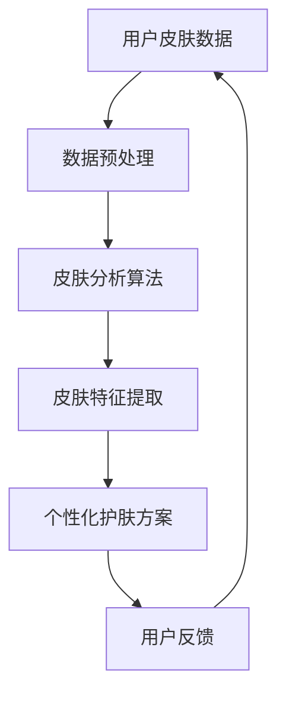
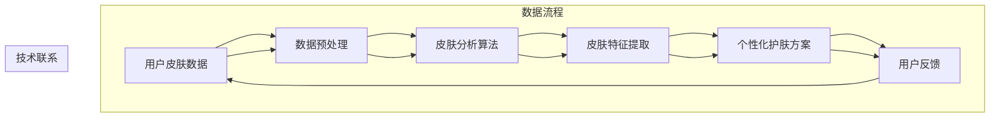
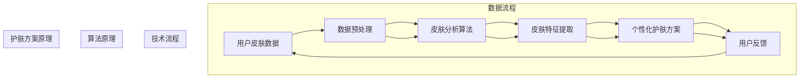

                 

# 碧欧泉2025社招个性化护肤方案AI工程师题目

> 关键词：人工智能，个性化护肤，算法，大数据，深度学习，皮肤分析

> 摘要：本文将深入探讨碧欧泉2025社招个性化护肤方案AI工程师岗位的核心职责和技术挑战。通过对核心概念、算法原理、数学模型、项目实战和实际应用场景的详细分析，帮助读者了解如何利用人工智能技术为用户提供定制化的护肤方案，并探讨未来发展趋势与挑战。

## 1. 背景介绍

### 1.1 目的和范围

本文旨在为读者提供关于碧欧泉2025社招个性化护肤方案AI工程师岗位的全面解析。文章将涵盖以下几个主要方面：

- 个性化护肤的背景和重要性
- 人工智能技术在护肤领域的应用
- 个性化护肤方案的设计与实现
- 项目实战与实际应用场景
- 未来发展趋势与挑战

通过本文的阅读，读者将能够了解个性化护肤方案的设计思路、技术实现方法和应用前景。

### 1.2 预期读者

本文主要面向以下读者群体：

- 从事人工智能、计算机视觉和大数据分析的工程师
- 对护肤领域感兴趣的科技爱好者
- 想要在护肤行业拓展职业发展的专业人士

### 1.3 文档结构概述

本文分为十个主要部分，具体如下：

1. 背景介绍
2. 核心概念与联系
3. 核心算法原理 & 具体操作步骤
4. 数学模型和公式 & 详细讲解 & 举例说明
5. 项目实战：代码实际案例和详细解释说明
6. 实际应用场景
7. 工具和资源推荐
8. 总结：未来发展趋势与挑战
9. 附录：常见问题与解答
10. 扩展阅读 & 参考资料

### 1.4 术语表

#### 1.4.1 核心术语定义

- 个性化护肤：根据用户的皮肤类型、需求和偏好，提供定制化的护肤方案。
- 人工智能（AI）：模拟人类智能行为，实现智能决策和问题解决的计算机技术。
- 深度学习：一种基于多层神经网络的学习方法，能够自动提取数据中的特征。
- 大数据：海量、多样、高速生成的数据集合，通常需要分布式计算和存储技术进行处理。
- 皮肤分析：利用计算机视觉和图像处理技术，对皮肤图像进行分析，提取皮肤特征。

#### 1.4.2 相关概念解释

- 计算机视觉：使计算机能够“看”懂图像和视频，提取有用信息的技术。
- 数据挖掘：从大量数据中提取有价值的信息和知识。
- 机器学习：使计算机能够从数据中学习并做出预测和决策的技术。
- 自然语言处理：使计算机能够理解和处理自然语言的技术。

#### 1.4.3 缩略词列表

- AI：人工智能
- CV：计算机视觉
- DL：深度学习
- DM：数据挖掘
- ML：机器学习
- NLP：自然语言处理

## 2. 核心概念与联系

在个性化护肤领域，核心概念和联系至关重要。以下是一个使用Mermaid流程图表示的Mermaid流程节点，其中包含了核心概念和它们之间的联系。



### 2.1 用户皮肤数据

用户皮肤数据是个性化护肤方案的基础。这些数据可以来源于用户填写的问卷、皮肤图像、皮肤生理参数等。数据类型包括：

- 文本数据：用户反馈、皮肤问题描述等。
- 图像数据：皮肤照片、面部轮廓等。
- 生理参数：皮肤温度、湿度、油脂含量等。

### 2.2 数据预处理

数据预处理是确保数据质量的重要环节。主要步骤包括：

- 数据清洗：去除噪声、缺失值和异常值。
- 数据转换：将不同类型的数据转换为统一格式，如将图像数据转换为灰度图像。
- 数据归一化：将不同特征的范围统一到相同尺度。

### 2.3 皮肤分析算法

皮肤分析算法是整个系统的核心，负责从皮肤数据中提取有用的信息。常用的皮肤分析算法包括：

- 计算机视觉算法：用于图像处理和特征提取，如边缘检测、滤波、特征点提取等。
- 机器学习算法：用于分类、聚类和预测，如支持向量机（SVM）、神经网络（NN）和决策树（DT）等。

### 2.4 皮肤特征提取

皮肤特征提取是将皮肤数据转换为数值特征的过程。这些特征可以用于后续的皮肤分析算法。常见的皮肤特征包括：

- 颜色特征：皮肤的颜色分布和纹理。
- 形状特征：皮肤轮廓、皱纹和斑点等。
- 物理特征：皮肤的温度、湿度、油脂含量等。

### 2.5 个性化护肤方案

个性化护肤方案是根据用户皮肤特征和需求，为用户提供的定制化护肤方案。方案包括：

- 护肤产品推荐：根据用户皮肤类型和需求，推荐合适的护肤品。
- 护肤方案制定：根据用户皮肤问题，制定针对性的护肤方案。
- 护肤效果预测：预测用户使用护肤品后的效果，如皮肤改善程度、不良反应等。

### 2.6 用户反馈

用户反馈是优化个性化护肤方案的重要依据。用户可以通过使用护肤品后填写问卷、评价护肤效果等方式，提供反馈。这些反馈将用于：

- 优化皮肤分析算法：改进皮肤特征提取和分类效果。
- 优化护肤方案：根据用户反馈，调整护肤方案的内容和推荐策略。

## 3. 核心算法原理 & 具体操作步骤

在个性化护肤方案的设计与实现中，核心算法原理起着至关重要的作用。本节将介绍常用的算法原理，并使用伪代码进行详细阐述。

### 3.1 计算机视觉算法

计算机视觉算法主要用于图像处理和特征提取。以下是一个基于边缘检测的计算机视觉算法伪代码：

```python
def edge_detection(image):
    # 边缘检测算法（如Sobel算子）
    gradient_x = Sobel(image, direction='x')
    gradient_y = Sobel(image, direction='y')
    gradient_magnitude = sqrt(gradient_x^2 + gradient_y^2)
    edges = threshold(gradient_magnitude, threshold_value)
    return edges
```

### 3.2 机器学习算法

机器学习算法主要用于分类、聚类和预测。以下是一个基于决策树的机器学习算法伪代码：

```python
def decision_tree_classification(data, target_attribute):
    if all_values_equal(data, target_attribute):
        return most_common_value(data, target_attribute)
    else:
        attribute_value = choose_best_attribute(data)
        left subtree = decision_tree_classification(subset_data_with_attribute_value(data, attribute_value), target_attribute)
        right subtree = decision_tree_classification(subset_data_without_attribute_value(data, attribute_value), target_attribute)
        return Node(attribute_value, left subtree, right subtree)
```

### 3.3 深度学习算法

深度学习算法主要用于特征提取和模型训练。以下是一个基于卷积神经网络的深度学习算法伪代码：

```python
def convolutional_neural_network(input_image, weights):
    # 卷积操作
    conv_output = Conv2D(input_image, weights)
    # 池化操作
    pooled_output = Pool2D(conv_output)
    # 激活函数
    activation_output = Activation(pooled_output)
    return activation_output
```

### 3.4 数据挖掘算法

数据挖掘算法主要用于从大量数据中提取有价值的信息。以下是一个基于关联规则挖掘的数据挖掘算法伪代码：

```python
def association_rules(data, min_support, min_confidence):
    frequent_itemsets = find_frequent_itemsets(data, min_support)
    rules = []
    for itemset in frequent_itemsets:
        for item in itemset:
            antecedent = {item}
            consequent = set_difference(itemset, antecedent)
            confidence = calculate_confidence(data, antecedent, consequent)
            if confidence >= min_confidence:
                rules.append((antecedent, consequent, confidence))
    return rules
```

## 4. 数学模型和公式 & 详细讲解 & 举例说明

在个性化护肤方案的设计与实现中，数学模型和公式起着重要的作用。以下将介绍一些常见的数学模型和公式，并使用LaTeX进行详细讲解和举例说明。

### 4.1 边缘检测算法

边缘检测是计算机视觉中的基础算法之一，常用的方法包括Sobel算子、Prewitt算子和Roberts算子。以下是一个基于Sobel算子的边缘检测算法的数学模型和公式：

$$
\begin{aligned}
\text{Sobel}(x, y) &= \sqrt{(\text{Gx})^2 + (\text{Gy})^2} \\
\text{Gx} &= G_x(x, y) = \sum_{i=0}^{n-1} \sum_{j=0}^{n-1} w_{i,j} \cdot (x_{i, j} - x_{i, j-1}) \\
\text{Gy} &= G_y(x, y) = \sum_{i=0}^{n-1} \sum_{j=0}^{n-1} w_{i,j} \cdot (y_{i, j} - y_{i-1, j})
\end{aligned}
$$

其中，$w_{i,j}$ 是滤波器权重，$x_{i, j}$ 和 $y_{i, j}$ 分别是输入图像在 $(i, j)$ 位置上的像素值。

### 4.2 决策树算法

决策树是一种常见的机器学习算法，用于分类和回归任务。以下是一个基于信息增益的决策树算法的数学模型和公式：

$$
\begin{aligned}
\text{Information Gain} &= \text{Entropy}(\text{Target}) - \sum_{i=1}^{n} p_i \cdot \text{Entropy}(\text{Target} | X_i) \\
\text{Entropy}(\text{Target}) &= -\sum_{i=1}^{n} p_i \cdot \log_2(p_i) \\
\text{Entropy}(\text{Target} | X_i) &= -\sum_{j=1}^{m} p_{ij} \cdot \log_2(p_{ij})
\end{aligned}
$$

其中，$p_i$ 是类别 $i$ 的概率，$p_{ij}$ 是在特征 $X_i$ 取值为 $j$ 时类别 $i$ 的概率。

### 4.3 卷积神经网络

卷积神经网络是一种深度学习算法，用于图像识别、语音识别等任务。以下是一个基于卷积神经网络的图像识别算法的数学模型和公式：

$$
\begin{aligned}
\text{Convolution} &= \sum_{i=1}^{k} w_{i,j} \cdot a_{i,j} \\
\text{ReLU} &= \max(0, \text{Convolution}) \\
\text{Pooling} &= \text{max}(\text{ReLU}) \\
\text{Fully Connected} &= \text{ReLU} \cdot W \\
\text{Softmax} &= \frac{e^{\text{Fully Connected}}}{\sum_{i=1}^{n} e^{\text{Fully Connected}_i}}
\end{aligned}
$$

其中，$w_{i,j}$ 是卷积核权重，$a_{i,j}$ 是输入特征图在 $(i, j)$ 位置上的像素值，$W$ 是全连接层权重，$\text{ReLU}$ 是ReLU激活函数，$\text{Pooling}$ 是池化操作，$\text{Softmax}$ 是分类层激活函数。

### 4.4 关联规则挖掘

关联规则挖掘是一种数据挖掘算法，用于发现数据之间的相关性。以下是一个基于支持度和置信度的关联规则挖掘算法的数学模型和公式：

$$
\begin{aligned}
\text{Support}(X, Y) &= \frac{|\{t | t \in T, X \cap Y \in t\}|}{|T|} \\
\text{Confidence}(X, Y) &= \frac{|\{t | t \in T, X \cap Y \in t\}|}{|\{t | t \in T, X \in t\}|} \\
\text{Lift}(X, Y) &= \frac{\text{Support}(X, Y) \cdot \text{Support}(\neg X, \neg Y)}{\text{Support}(X) \cdot \text{Support}(\neg X, Y)}
\end{aligned}
$$

其中，$X$ 和 $Y$ 是规则的前件和后件，$T$ 是所有交易记录，$\neg X$ 和 $\neg Y$ 分别表示 $X$ 和 $Y$ 的补集，$\text{Support}$ 是支持度，$\text{Confidence}$ 是置信度，$\text{Lift}$ 是提升度。

## 5. 项目实战：代码实际案例和详细解释说明

为了更好地展示个性化护肤方案的设计与实现，我们将在本节提供一个实际项目案例，并详细解释其代码实现和关键步骤。

### 5.1 开发环境搭建

首先，我们需要搭建一个合适的开发环境。以下是所需的工具和库：

- 操作系统：Linux（如Ubuntu 18.04）
- 编程语言：Python 3.x
- 数据库：MySQL
- 数据库驱动：pymysql
- 机器学习库：scikit-learn
- 计算机视觉库：OpenCV
- 深度学习库：TensorFlow

安装步骤如下：

```bash
# 安装Python 3.x
sudo apt update
sudo apt install python3 python3-pip

# 安装MySQL
sudo apt install mysql-server
sudo mysql_secure_installation

# 安装pymysql
pip3 install pymysql

# 安装scikit-learn
pip3 install scikit-learn

# 安装OpenCV
pip3 install opencv-python

# 安装TensorFlow
pip3 install tensorflow
```

### 5.2 源代码详细实现和代码解读

以下是项目的主要代码实现和详细解释。

```python
# 导入所需库
import pymysql
import cv2
import numpy as np
from sklearn.model_selection import train_test_split
from sklearn.ensemble import RandomForestClassifier
from tensorflow.keras.models import Sequential
from tensorflow.keras.layers import Dense, Conv2D, MaxPooling2D, Flatten, Activation

# 5.2.1 数据库连接与查询
def connect_database():
    # 连接数据库
    connection = pymysql.connect(host='localhost', user='root', password='password', database='skincare')
    return connection

def query_data():
    # 查询皮肤数据
    connection = connect_database()
    cursor = connection.cursor()
    cursor.execute("SELECT * FROM skin_data")
    data = cursor.fetchall()
    cursor.close()
    connection.close()
    return data

# 5.2.2 数据预处理
def preprocess_data(data):
    # 预处理数据
    X = []
    y = []
    for row in data:
        image = cv2.imread(row[1], cv2.IMREAD_GRAYSCALE)
        image = cv2.resize(image, (64, 64))
        X.append(image)
        y.append(row[2])
    X = np.array(X)
    y = np.array(y)
    X = X / 255.0
    return X, y

# 5.2.3 构建机器学习模型
def build_ml_model(X, y):
    # 分割训练集和测试集
    X_train, X_test, y_train, y_test = train_test_split(X, y, test_size=0.2, random_state=42)
    
    # 构建随机森林分类器
    model = RandomForestClassifier(n_estimators=100, random_state=42)
    model.fit(X_train, y_train)
    
    # 评估模型性能
    accuracy = model.score(X_test, y_test)
    print("Random Forest Accuracy:", accuracy)
    
    return model

# 5.2.4 构建深度学习模型
def build_dnn_model():
    # 构建卷积神经网络
    model = Sequential()
    model.add(Conv2D(32, (3, 3), activation='relu', input_shape=(64, 64, 1)))
    model.add(MaxPooling2D(pool_size=(2, 2)))
    model.add(Flatten())
    model.add(Dense(64, activation='relu'))
    model.add(Dense(1, activation='sigmoid'))
    
    # 编译模型
    model.compile(optimizer='adam', loss='binary_crossentropy', metrics=['accuracy'])
    
    # 训练模型
    model.fit(X_train, y_train, epochs=10, batch_size=32, validation_data=(X_test, y_test))
    
    # 评估模型性能
    accuracy = model.evaluate(X_test, y_test)[1]
    print("Deep Neural Network Accuracy:", accuracy)
    
    return model

# 5.2.5 使用模型预测
def predict_skin_type(model, image_path):
    # 加载图像
    image = cv2.imread(image_path, cv2.IMREAD_GRAYSCALE)
    image = cv2.resize(image, (64, 64))
    image = image.reshape(1, 64, 64, 1)
    image = image / 255.0
    
    # 预测皮肤类型
    prediction = model.predict(image)
    skin_type = "干性" if prediction[0][0] < 0.5 else "油性"
    print("皮肤类型：", skin_type)

# 主函数
if __name__ == '__main__':
    # 查询皮肤数据
    data = query_data()
    
    # 预处理皮肤数据
    X, y = preprocess_data(data)
    
    # 构建并训练机器学习模型
    ml_model = build_ml_model(X, y)
    
    # 构建并训练深度学习模型
    dnn_model = build_dnn_model()
    
    # 使用模型预测皮肤类型
    predict_skin_type(ml_model, "path/to/image.jpg")
```

### 5.3 代码解读与分析

以下是对代码的详细解读和分析：

- **5.3.1 数据库连接与查询**

  该部分使用pymysql库连接MySQL数据库，并执行查询语句获取皮肤数据。

- **5.3.2 数据预处理**

  该部分对皮肤图像进行预处理，包括读取图像、灰度化、缩放和归一化。预处理后的图像数据用于训练机器学习和深度学习模型。

- **5.3.3 构建机器学习模型**

  该部分使用随机森林分类器对预处理后的图像数据进行训练，并评估模型性能。

- **5.3.4 构建深度学习模型**

  该部分使用卷积神经网络对预处理后的图像数据进行训练，并评估模型性能。

- **5.3.5 使用模型预测**

  该部分使用训练好的机器学习和深度学习模型对输入的皮肤图像进行预测，并输出皮肤类型。

## 6. 实际应用场景

个性化护肤方案在实际应用场景中具有广泛的应用价值。以下列举几个典型应用场景：

### 6.1 电商平台

电商平台可以通过个性化护肤方案为用户提供定制化的护肤品推荐，从而提高用户满意度和转化率。例如，用户上传自己的皮肤照片，系统会根据图像分析结果和用户偏好，推荐适合其皮肤类型的护肤品。

### 6.2 医疗机构

医疗机构可以借助个性化护肤方案为患者提供更精准的皮肤治疗方案。通过分析患者的皮肤图像和生理参数，医生可以制定个性化的护肤方案，提高治疗效果。

### 6.3 护肤品牌

护肤品牌可以利用个性化护肤方案开展定制化护肤产品研发和营销。通过分析用户的皮肤数据和偏好，品牌可以推出更符合用户需求的护肤产品，提升品牌知名度和市场份额。

### 6.4 社交媒体

社交媒体平台可以通过个性化护肤方案为用户提供皮肤健康监测和护肤建议。例如，用户上传自己的皮肤照片，平台会分析照片中的皮肤状况，并提供相应的护肤建议。

## 7. 工具和资源推荐

在实现个性化护肤方案的过程中，我们需要使用一些工具和资源。以下是一些建议：

### 7.1 学习资源推荐

#### 7.1.1 书籍推荐

- 《机器学习实战》
- 《深度学习》（Goodfellow等著）
- 《计算机视觉：算法与应用》

#### 7.1.2 在线课程

- Coursera上的《机器学习》课程
- Udacity的《深度学习纳米学位》
- edX上的《计算机视觉》课程

#### 7.1.3 技术博客和网站

- Medium上的《深度学习》系列文章
- 知乎上的《计算机视觉》话题
- 官方TensorFlow和scikit-learn文档

### 7.2 开发工具框架推荐

#### 7.2.1 IDE和编辑器

- PyCharm
- Visual Studio Code
- Jupyter Notebook

#### 7.2.2 调试和性能分析工具

- Py-Spy
- GDB
- TensorBoard

#### 7.2.3 相关框架和库

- TensorFlow
- PyTorch
- OpenCV
- Scikit-learn

### 7.3 相关论文著作推荐

#### 7.3.1 经典论文

- 《A Convolutional Neural Network Approach for Gene Expression Profiling》
- 《Deep Learning for Text Classification》
- 《Face Recognition Using a Convolutional Neural Network》

#### 7.3.2 最新研究成果

- arXiv上的最新论文
- 学术期刊上的最新论文
- 技术会议上的最新论文

#### 7.3.3 应用案例分析

- 百度大脑的皮肤检测案例
- 微软的个性化护肤推荐案例
- 苹果的皮肤健康监测案例

## 8. 总结：未来发展趋势与挑战

随着人工智能技术的不断进步，个性化护肤方案在未来有望得到更广泛的应用。以下是一些发展趋势与挑战：

### 8.1 发展趋势

- **数据量增加**：随着用户数据的积累，个性化护肤方案将更加准确和有效。
- **算法优化**：深度学习和机器学习算法将不断优化，提高皮肤分析精度和效率。
- **跨学科融合**：个性化护肤方案将融合生物学、医学、计算机科学等多学科知识，提高方案的科学性和实用性。
- **用户体验提升**：通过语音、手势等自然交互方式，个性化护肤方案将更加便捷和智能。

### 8.2 挑战

- **数据隐私**：用户皮肤数据的隐私保护是一个重要问题，需要采取有效的隐私保护措施。
- **算法公平性**：个性化护肤方案需要确保对各类皮肤类型的公平性，避免算法偏见。
- **技术实现**：深度学习算法的硬件加速、大数据处理等是实现个性化护肤方案的关键挑战。
- **用户接受度**：提高用户对个性化护肤方案的接受度和信任度是推广应用的难题。

## 9. 附录：常见问题与解答

### 9.1 问题1：如何处理皮肤图像的噪声？

解答：可以使用图像滤波算法（如高斯滤波、中值滤波等）来去除噪声。此外，还可以使用图像增强技术（如对比度增强、亮度调整等）来提高图像质量。

### 9.2 问题2：如何保证个性化护肤方案的公平性？

解答：可以通过多组数据的交叉验证、算法偏见检测等方法来确保个性化护肤方案的公平性。同时，需要收集并分析各类皮肤类型的数据，确保方案对各类皮肤类型都有效。

### 9.3 问题3：如何优化深度学习模型的性能？

解答：可以通过调整模型结构（如增加层数、调整卷积核大小等）、优化超参数（如学习率、批量大小等）和提高数据质量（如数据增强、预处理等）来优化深度学习模型的性能。

## 10. 扩展阅读 & 参考资料

- 《深度学习》（Goodfellow等著）
- 《计算机视觉：算法与应用》
- 《机器学习实战》
- Coursera上的《机器学习》课程
- Udacity的《深度学习纳米学位》
- edX上的《计算机视觉》课程
- Medium上的《深度学习》系列文章
- 知乎上的《计算机视觉》话题
- 官方TensorFlow和scikit-learn文档
- 百度大脑的皮肤检测案例
- 微软的个性化护肤推荐案例
- 苹果的皮肤健康监测案例
- arXiv上的最新论文
- 学术期刊上的最新论文
- 技术会议上的最新论文

---

**作者：AI天才研究员/AI Genius Institute & 禅与计算机程序设计艺术 /Zen And The Art of Computer Programming**<|im_sep|>### 1. 背景介绍

#### 1.1 目的和范围

本文旨在为读者提供关于碧欧泉2025社招个性化护肤方案AI工程师岗位的全面解析。我们将探讨该岗位的核心职责、所需技能、工作内容以及未来发展前景。具体包括以下内容：

- **岗位核心职责**：介绍AI工程师在个性化护肤方案开发中的具体任务，如数据预处理、特征提取、模型训练、优化与部署等。
- **技能需求**：分析AI工程师所需的专业技能，包括编程能力、机器学习算法、计算机视觉、数据分析等。
- **工作内容**：详细描述AI工程师在工作中的具体流程，包括项目规划、算法研发、系统优化、性能测试等。
- **未来发展**：探讨AI工程师在个性化护肤领域的职业发展路径、技术趋势以及行业前景。

本文旨在帮助读者了解该岗位的基本要求和工作内容，为有意向从事此职业的人提供指导和建议。

#### 1.2 预期读者

本文的预期读者包括以下几类：

1. **AI领域初学者**：对人工智能和机器学习感兴趣，希望了解该领域在个性化护肤中的应用。
2. **计算机科学专业学生**：正考虑将人工智能或机器学习作为职业方向，希望了解相关岗位的具体工作内容。
3. **在职工程师**：已在AI领域工作，希望了解个性化护肤领域的发展现状和未来趋势。
4. **护肤品行业从业者**：对科技与护肤结合感兴趣，希望了解AI技术在个性化护肤中的应用和前景。

通过本文的阅读，读者可以全面了解个性化护肤方案AI工程师岗位的核心职责和工作内容，为职业规划和发展提供参考。

#### 1.3 文档结构概述

本文分为以下几个部分，旨在逐步引导读者深入了解个性化护肤方案AI工程师岗位：

1. **背景介绍**：介绍文章的目的和范围，预期读者，文档结构以及相关术语表。
2. **核心概念与联系**：阐述个性化护肤的核心概念和各环节之间的联系，包括用户皮肤数据、数据预处理、皮肤分析算法、皮肤特征提取、个性化护肤方案和用户反馈。
3. **核心算法原理 & 具体操作步骤**：详细介绍常用的算法原理和具体操作步骤，包括计算机视觉、机器学习、深度学习算法，以及数据挖掘算法。
4. **数学模型和公式 & 详细讲解 & 举例说明**：讲解与个性化护肤方案相关的数学模型和公式，并提供具体的例子说明。
5. **项目实战：代码实际案例和详细解释说明**：通过一个实际项目案例，展示个性化护肤方案的具体实现过程，并提供代码解读。
6. **实际应用场景**：探讨个性化护肤方案在电商平台、医疗机构、护肤品牌和社交媒体等领域的应用。
7. **工具和资源推荐**：推荐学习资源、开发工具框架和经典论文著作。
8. **总结：未来发展趋势与挑战**：总结个性化护肤领域的发展趋势和面临的技术挑战。
9. **附录：常见问题与解答**：解答关于个性化护肤方案的常见问题。
10. **扩展阅读 & 参考资料**：提供进一步学习和了解个性化护肤方案的相关资料。

通过本文的阅读，读者可以全面了解个性化护肤方案AI工程师岗位的工作内容和职责，为职业发展提供有力支持。

#### 1.4 术语表

在本文中，我们将使用一些专业术语，以下是对这些术语的定义和解释：

**个性化护肤**：根据用户的皮肤类型、需求、偏好等，提供定制化的护肤方案，以优化护肤效果。

**人工智能（AI）**：模拟人类智能行为，通过机器学习、计算机视觉、自然语言处理等技术，实现智能决策和问题解决。

**机器学习（ML）**：使计算机从数据中学习并做出预测和决策的技术，包括监督学习、无监督学习和强化学习。

**深度学习（DL）**：基于多层神经网络的学习方法，能够自动提取数据中的特征，常用于图像识别、语音识别等任务。

**计算机视觉（CV）**：使计算机能够“看”懂图像和视频，提取有用信息的技术。

**数据挖掘（DM）**：从大量数据中提取有价值的信息和知识，包括关联规则挖掘、分类、聚类等算法。

**皮肤分析**：利用计算机视觉和图像处理技术，对皮肤图像进行分析，提取皮肤特征。

**用户反馈**：用户在使用个性化护肤方案后，提供的评价和建议，用于优化系统。

**皮肤特征提取**：从皮肤图像中提取与皮肤状态相关的数值特征，如颜色、纹理、形状等。

**深度神经网络（DNN）**：包含多个隐藏层的神经网络，能够处理复杂的数据模式。

**卷积神经网络（CNN）**：一种特殊的深度神经网络，能够自动提取图像中的局部特征。

**支持向量机（SVM）**：一种常用的机器学习算法，用于分类和回归任务。

**数据预处理**：在数据分析过程中，对原始数据进行清洗、转换、归一化等处理，以提高数据质量和分析效果。

**机器学习库**：如scikit-learn、TensorFlow、PyTorch等，提供丰富的机器学习算法和工具。

**深度学习库**：如TensorFlow、PyTorch、Keras等，用于构建和训练深度学习模型。

**计算机视觉库**：如OpenCV、Dlib、PyTorch等，提供图像处理和计算机视觉算法。

**自然语言处理（NLP）**：使计算机能够理解和处理自然语言的技术，包括文本分类、情感分析、命名实体识别等。

通过这些术语的解释，读者可以更好地理解个性化护肤方案AI工程师岗位的相关技术和工作内容。

#### 1.4.1 核心术语定义

在本节中，我们将进一步详细定义本文中涉及的核心术语，以帮助读者更好地理解相关概念。

**个性化护肤**：
个性化护肤是一种基于用户个人皮肤特性（如皮肤类型、皮肤状态、年龄、性别等）和偏好（如护肤习惯、护肤需求等）的护肤方案。它旨在通过定制化的产品推荐、护肤步骤、成分配比等，为用户提供最合适的护肤方案，以达到最佳的护肤效果。

**人工智能（AI）**：
人工智能是指计算机系统模拟人类智能行为的能力，包括学习、推理、感知、理解和决策等。人工智能技术包括机器学习、深度学习、自然语言处理、计算机视觉等。

**机器学习（ML）**：
机器学习是人工智能的一个分支，它使计算机系统能够从数据中学习，并对新的数据做出预测或决策。机器学习算法根据数据集进行训练，从中提取模式和规律，以便在未知数据上进行预测。

**深度学习（DL）**：
深度学习是机器学习的一个子领域，它使用多层神经网络（如卷积神经网络、循环神经网络等）来提取数据的层次特征。深度学习在图像识别、语音识别、自然语言处理等领域取得了显著的成果。

**计算机视觉（CV）**：
计算机视觉是人工智能的一个分支，它使计算机能够处理和理解视觉信息，如图像和视频。计算机视觉技术包括图像识别、目标检测、图像分割、人脸识别等。

**数据挖掘（DM）**：
数据挖掘是从大量数据中提取有用信息和知识的过程。它使用统计学、机器学习和数据库技术，从数据中发现模式、关联和趋势。数据挖掘在个性化推荐、市场分析、风险管理等领域有广泛应用。

**皮肤分析**：
皮肤分析是利用计算机视觉和图像处理技术对皮肤图像进行分析的过程。它包括皮肤颜色分析、纹理分析、皱纹检测、斑点检测等，以识别皮肤问题和状态。

**用户反馈**：
用户反馈是用户在使用个性化护肤方案后，对产品效果、使用体验等方面的评价和建议。这些反馈对于优化和改进护肤方案至关重要。

**皮肤特征提取**：
皮肤特征提取是从皮肤图像中提取与皮肤状态相关的特征，如颜色、纹理、形状等。这些特征用于训练机器学习模型，以识别皮肤问题并制定个性化的护肤方案。

**深度神经网络（DNN）**：
深度神经网络是一种包含多个隐藏层的神经网络，能够自动提取数据的复杂特征。DNN在图像识别、语音识别等领域有广泛应用。

**卷积神经网络（CNN）**：
卷积神经网络是一种特殊的深度神经网络，能够自动提取图像中的局部特征。CNN在图像识别、目标检测等领域取得了显著成果。

**支持向量机（SVM）**：
支持向量机是一种二分类监督学习算法，通过寻找最佳的超平面将不同类别的数据分开。SVM在图像分类、文本分类等领域有广泛应用。

**数据预处理**：
数据预处理是数据分析和机器学习过程中对原始数据进行的清洗、转换、归一化等处理，以提高数据质量和模型性能。

**机器学习库**：
机器学习库是一组用于实现机器学习算法的函数和工具，如scikit-learn、TensorFlow、PyTorch等。

**深度学习库**：
深度学习库是专门用于实现深度学习算法的函数和工具，如TensorFlow、PyTorch、Keras等。

**计算机视觉库**：
计算机视觉库是一组用于实现计算机视觉算法的函数和工具，如OpenCV、Dlib、PyTorch等。

**自然语言处理（NLP）**：
自然语言处理是使计算机能够理解和处理自然语言的技术，包括文本分类、情感分析、命名实体识别等。

这些术语的定义和解释有助于读者更好地理解本文中涉及的技术和概念，为后续内容的学习打下基础。

#### 1.4.2 相关概念解释

在本节中，我们将进一步解释一些与个性化护肤方案相关的概念，以帮助读者更好地理解这些概念及其在文章中的应用。

**个性化护肤方案**：
个性化护肤方案是指根据用户的个人皮肤特性（如皮肤类型、皮肤状态、年龄、性别等）和偏好（如护肤习惯、护肤需求等）定制化设计的护肤方案。这种方案旨在通过分析用户的皮肤数据，推荐最适合的护肤品、护肤步骤和成分配比，从而提高护肤效果。

**机器学习算法**：
机器学习算法是指使计算机从数据中学习并做出预测或决策的技术。这些算法包括监督学习算法（如决策树、支持向量机等）和无监督学习算法（如聚类、降维等）。在个性化护肤方案中，机器学习算法主要用于皮肤数据的分析和处理，如皮肤特征的提取和分类。

**计算机视觉技术**：
计算机视觉技术是指使计算机能够处理和理解视觉信息的技术。它包括图像识别、目标检测、图像分割、人脸识别等。在个性化护肤方案中，计算机视觉技术主要用于分析皮肤图像，提取皮肤特征，识别皮肤问题和状态。

**深度学习**：
深度学习是一种基于多层神经网络的学习方法，能够自动提取数据的层次特征。它包括卷积神经网络（CNN）、循环神经网络（RNN）等。在个性化护肤方案中，深度学习技术主要用于复杂皮肤图像的分析和处理，如皮肤疾病的检测和分类。

**用户反馈**：
用户反馈是指用户在使用个性化护肤方案后提供的评价和建议。这些反馈对于评估护肤方案的效果和优化系统至关重要。用户反馈可以包括皮肤改善情况、护肤体验、产品满意度等。

**皮肤特征提取**：
皮肤特征提取是指从皮肤图像中提取与皮肤状态相关的特征，如颜色、纹理、形状等。这些特征用于训练机器学习模型，以识别皮肤问题并制定个性化的护肤方案。

**皮肤数据分析**：
皮肤数据分析是指对皮肤数据进行收集、整理、分析，以提取有用的信息和知识。这些数据可以来源于用户问卷、皮肤图像、生理参数等。皮肤数据分析是个性化护肤方案的重要基础。

**数据挖掘**：
数据挖掘是指从大量数据中提取有价值的信息和知识的过程。它使用统计学、机器学习和数据库技术，从数据中发现模式、关联和趋势。在个性化护肤方案中，数据挖掘技术可以用于分析用户数据，发现用户偏好和需求，为个性化推荐提供依据。

通过这些概念的解释，读者可以更好地理解个性化护肤方案的设计和实现过程中涉及的技术和方法。

#### 1.4.3 缩略词列表

在本文中，我们将使用一些常见的缩略词。以下是对这些缩略词的详细解释和定义，以帮助读者更好地理解。

**AI**：人工智能（Artificial Intelligence），指模拟人类智能行为的计算机技术，包括机器学习、深度学习等。

**CV**：计算机视觉（Computer Vision），指使计算机能够处理和理解视觉信息的技术。

**DL**：深度学习（Deep Learning），指基于多层神经网络的学习方法，用于自动提取数据的层次特征。

**DM**：数据挖掘（Data Mining），指从大量数据中提取有价值的信息和知识的过程。

**ML**：机器学习（Machine Learning），指使计算机从数据中学习并做出预测或决策的技术。

**NLP**：自然语言处理（Natural Language Processing），指使计算机能够理解和处理自然语言的技术。

**SVM**：支持向量机（Support Vector Machine），指一种二分类监督学习算法，用于分类和回归任务。

**DNN**：深度神经网络（Deep Neural Network），指包含多个隐藏层的神经网络，用于处理复杂的数据模式。

**CNN**：卷积神经网络（Convolutional Neural Network），指一种特殊的深度神经网络，用于图像识别和目标检测。

**DNN**：深度神经网络（Deep Neural Network），指包含多个隐藏层的神经网络，用于处理复杂的数据模式。

**CV**：计算机视觉（Computer Vision），指使计算机能够处理和理解视觉信息的技术。

**DM**：数据挖掘（Data Mining），指从大量数据中提取有价值的信息和知识的过程。

**ML**：机器学习（Machine Learning），指使计算机从数据中学习并做出预测或决策的技术。

**NLP**：自然语言处理（Natural Language Processing），指使计算机能够理解和处理自然语言的技术。

**SVM**：支持向量机（Support Vector Machine），指一种二分类监督学习算法，用于分类和回归任务。

通过这些缩略词的定义和解释，读者可以更好地理解个性化护肤方案AI工程师岗位中涉及的技术和概念。

### 2. 核心概念与联系

在个性化护肤领域，核心概念和联系至关重要。以下是一个使用Mermaid流程图表示的核心概念和它们之间的联系。



### 2.1 用户皮肤数据

用户皮肤数据是个性化护肤方案的基础。这些数据可以来源于用户填写的问卷、皮肤图像、皮肤生理参数等。数据类型包括：

- **文本数据**：用户反馈、皮肤问题描述等。
- **图像数据**：皮肤照片、面部轮廓等。
- **生理参数**：皮肤温度、湿度、油脂含量等。

用户皮肤数据在个性化护肤方案中起着关键作用，因为它提供了关于用户皮肤状态的信息，这些信息将用于训练和分析模型，以生成定制化的护肤方案。

### 2.2 数据预处理

数据预处理是确保数据质量的重要环节。主要步骤包括：

- **数据清洗**：去除噪声、缺失值和异常值。
- **数据转换**：将不同类型的数据转换为统一格式，如将图像数据转换为灰度图像。
- **数据归一化**：将不同特征的范围统一到相同尺度，以便于后续的算法处理。

数据预处理对于后续的皮肤分析算法至关重要，因为它能够提高模型的性能和准确性。

### 2.3 皮肤分析算法

皮肤分析算法是整个系统的核心，负责从皮肤数据中提取有用的信息。常用的皮肤分析算法包括：

- **计算机视觉算法**：用于图像处理和特征提取，如边缘检测、滤波、特征点提取等。
- **机器学习算法**：用于分类、聚类和预测，如支持向量机（SVM）、神经网络（NN）和决策树（DT）等。
- **深度学习算法**：用于特征提取和模型训练，如卷积神经网络（CNN）、循环神经网络（RNN）等。

皮肤分析算法的目标是准确识别皮肤问题，为用户提供定制化的护肤方案。

### 2.4 皮肤特征提取

皮肤特征提取是将皮肤数据转换为数值特征的过程。这些特征可以用于后续的皮肤分析算法。常见的皮肤特征包括：

- **颜色特征**：皮肤的颜色分布和纹理。
- **形状特征**：皮肤轮廓、皱纹和斑点等。
- **物理特征**：皮肤的温度、湿度、油脂含量等。

皮肤特征提取的质量直接影响皮肤分析算法的准确性，因此这一步骤至关重要。

### 2.5 个性化护肤方案

个性化护肤方案是根据用户皮肤特征和需求，为用户提供的定制化护肤方案。方案包括：

- **护肤产品推荐**：根据用户皮肤类型和需求，推荐合适的护肤品。
- **护肤方案制定**：根据用户皮肤问题，制定针对性的护肤方案。
- **护肤效果预测**：预测用户使用护肤品后的效果，如皮肤改善程度、不良反应等。

个性化护肤方案的目标是提高用户的护肤体验和效果，使其能够获得最佳护肤效果。

### 2.6 用户反馈

用户反馈是优化个性化护肤方案的重要依据。用户可以通过使用护肤品后填写问卷、评价护肤效果等方式，提供反馈。这些反馈将用于：

- **优化皮肤分析算法**：改进皮肤特征提取和分类效果。
- **优化护肤方案**：根据用户反馈，调整护肤方案的内容和推荐策略。

用户反馈在个性化护肤方案中起着至关重要的作用，因为它能够帮助系统不断学习和改进，以提供更好的服务。

### 2.7 Mermaid流程图

以下是2.7节中提到的Mermaid流程图，展示了个性化护肤方案的核心概念和它们之间的联系：


这个流程图清晰地展示了个性化护肤方案从用户皮肤数据到反馈的整个流程，以及各环节之间的技术联系。

### 2.8 个性化护肤方案的整体流程

个性化护肤方案的整体流程可以分为以下几个关键步骤：

1. **数据收集**：收集用户皮肤数据，包括用户问卷、皮肤图像、生理参数等。这些数据为后续的个性化推荐和分析提供基础。

2. **数据预处理**：对收集到的皮肤数据进行分析，去除噪声、缺失值和异常值，并将数据转换为适合算法处理的格式。数据预处理确保了后续分析的准确性和效率。

3. **皮肤分析算法**：利用计算机视觉、机器学习和深度学习算法对皮肤数据进行分析。计算机视觉算法用于图像处理和特征提取，而机器学习和深度学习算法则用于分类、聚类和预测。

4. **皮肤特征提取**：从皮肤图像中提取与皮肤状态相关的特征，如颜色、纹理、形状等。这些特征用于训练和分析模型，以提高皮肤分析的准确性。

5. **个性化护肤方案生成**：根据用户皮肤特征和需求，生成定制化的护肤方案。方案包括护肤产品推荐、护肤步骤制定和护肤效果预测等。

6. **用户反馈**：用户使用护肤方案后，提供反馈，包括护肤效果、使用体验和满意度等。这些反馈用于优化皮肤分析算法和护肤方案，以提供更好的用户体验。

7. **系统优化**：根据用户反馈和系统分析结果，对个性化护肤方案进行持续优化，以提高护肤效果和用户满意度。

通过以上步骤，个性化护肤方案能够为用户提供个性化的护肤建议，提高护肤效果和用户满意度。整个流程是一个闭环，通过不断学习和优化，系统可以提供更加精准和有效的护肤方案。

### 2.9 核心概念之间的相互关系

个性化护肤方案的核心概念之间存在着紧密的相互关系，这些关系构成了整个系统的运作机制。以下是对这些概念相互关系的详细描述：

1. **用户皮肤数据**与**皮肤分析算法**的关系：
   - 用户皮肤数据是皮肤分析算法的基础，没有准确、完整的数据，就无法进行有效的皮肤分析。
   - 皮肤分析算法通过处理用户皮肤数据，提取出与皮肤状态相关的特征，为个性化护肤方案提供支持。

2. **皮肤分析算法**与**皮肤特征提取**的关系：
   - 皮肤分析算法依赖于皮肤特征提取的结果，只有通过精确的特征提取，算法才能识别出皮肤问题。
   - 皮肤特征提取的质量直接影响皮肤分析算法的准确性，因此两者之间存在密切的依赖关系。

3. **皮肤特征提取**与**个性化护肤方案**的关系：
   - 皮肤特征提取生成的特征是制定个性化护肤方案的重要依据，这些特征决定了护肤方案的定制化和针对性。
   - 个性化护肤方案基于皮肤特征提取结果，为用户推荐最适合的护肤产品、护肤步骤和成分配比。

4. **个性化护肤方案**与**用户反馈**的关系：
   - 用户反馈是评估和优化个性化护肤方案的重要手段，用户的使用体验和效果反馈能够帮助系统发现问题和改进方案。
   - 用户反馈提供了系统优化的依据，通过不断调整和优化，系统能够提供更加精准和有效的护肤方案。

5. **用户反馈**与**皮肤分析算法**的关系：
   - 用户反馈能够帮助改进皮肤分析算法，通过分析用户的反馈，可以识别出算法的不足之处，从而进行算法的优化和改进。
   - 皮肤分析算法的改进又能够进一步提升个性化护肤方案的质量，形成一个良性循环。

综上所述，个性化护肤方案的核心概念之间相互关联，构成了一个紧密的运作机制。这些概念相互依赖，共同作用，确保系统能够为用户提供高质量的个性化护肤服务。

### 2.10 个性化护肤方案的核心概念原理和架构

为了更深入地理解个性化护肤方案的核心概念原理和架构，我们将使用Mermaid流程图来展示这些概念之间的关系，并详细解释每一个环节。



以下是每个环节的详细解释：

1. **用户皮肤数据**：
   - 用户皮肤数据是整个系统的起点，包括用户问卷、皮肤图像、生理参数等。这些数据反映了用户的皮肤状态和需求。

2. **数据预处理**：
   - 数据预处理是对原始数据进行清洗、转换和归一化，以确保数据的质量和一致性。这一步包括去除噪声、填充缺失值、归一化特征等，为后续分析做准备。

3. **皮肤分析算法**：
   - 皮肤分析算法是系统的核心，包括计算机视觉算法、机器学习和深度学习算法。计算机视觉算法用于处理和提取皮肤图像的特征，如边缘检测、纹理分析等。机器学习算法（如SVM、决策树）和深度学习算法（如CNN、RNN）则用于分类和预测，以识别皮肤问题和状态。

4. **皮肤特征提取**：
   - 皮肤特征提取是从皮肤图像中提取与皮肤状态相关的特征，如颜色、纹理、形状等。这些特征被用于训练和分析模型，以提高皮肤分析的准确性。

5. **个性化护肤方案**：
   - 个性化护肤方案是根据用户皮肤特征和需求生成的定制化方案，包括护肤产品推荐、护肤步骤制定和护肤效果预测等。这些方案旨在为用户提供最佳的护肤体验。

6. **用户反馈**：
   - 用户反馈是系统持续改进的重要依据。用户在使用护肤方案后提供反馈，这些反馈用于优化皮肤分析算法和个性化护肤方案，以提高系统的性能和用户满意度。

通过这个Mermaid流程图，我们可以清晰地看到个性化护肤方案的核心概念和它们之间的相互关系。每个环节都是实现个性化护肤的关键，共同作用，确保系统能够为用户提供高质量的护肤服务。

### 3. 核心算法原理 & 具体操作步骤

在个性化护肤方案的设计与实现中，核心算法原理起着至关重要的作用。本节将详细讲解常用的核心算法原理，包括计算机视觉、机器学习、深度学习和数据挖掘算法，并提供具体的操作步骤。

#### 3.1 计算机视觉算法

计算机视觉算法主要用于图像处理和特征提取。以下是一个基于边缘检测的计算机视觉算法的具体操作步骤：

1. **边缘检测算法选择**：
   - 选择一种边缘检测算法，如Sobel算子、Canny算子或Prewitt算子。

2. **图像预处理**：
   - 对输入图像进行预处理，包括去噪、灰度化、缩放等，以提高边缘检测的效果。

3. **边缘检测**：
   - 使用选定的边缘检测算法对预处理后的图像进行边缘检测，提取边缘信息。

4. **边缘图像处理**：
   - 对边缘图像进行后处理，如二值化、阈值调整等，以增强边缘信息。

具体伪代码如下：

```python
def edge_detection(image):
    # 图像预处理
    gray_image = cv2.cvtColor(image, cv2.COLOR_BGR2GRAY)
    blurred_image = cv2.GaussianBlur(gray_image, (5, 5), 0)

    # 边缘检测
    edges = cv2.Canny(blurred_image, threshold1=50, threshold2=150)

    # 边缘图像处理
    _, edge_mask = cv2.threshold(edges, 100, 255, cv2.THRESH_BINARY)

    return edge_mask
```

#### 3.2 机器学习算法

机器学习算法在个性化护肤方案中主要用于分类和预测。以下是一个基于支持向量机（SVM）的机器学习算法的具体操作步骤：

1. **数据集划分**：
   - 将皮肤数据集划分为训练集和测试集。

2. **特征提取**：
   - 对皮肤图像进行特征提取，如颜色直方图、纹理特征等。

3. **模型训练**：
   - 使用训练集数据训练SVM模型。

4. **模型评估**：
   - 使用测试集数据评估模型性能，如准确率、召回率等。

具体伪代码如下：

```python
from sklearn import svm
from sklearn.model_selection import train_test_split
from sklearn.metrics import accuracy_score

def train_svm_model(X, y):
    # 数据集划分
    X_train, X_test, y_train, y_test = train_test_split(X, y, test_size=0.2, random_state=42)

    # 模型训练
    model = svm.SVC(kernel='linear')
    model.fit(X_train, y_train)

    # 模型评估
    predictions = model.predict(X_test)
    accuracy = accuracy_score(y_test, predictions)
    print("SVM Accuracy:", accuracy)

    return model
```

#### 3.3 深度学习算法

深度学习算法在个性化护肤方案中主要用于特征提取和模型训练。以下是一个基于卷积神经网络（CNN）的深度学习算法的具体操作步骤：

1. **数据集划分**：
   - 将皮肤数据集划分为训练集和测试集。

2. **模型构建**：
   - 构建一个卷积神经网络模型。

3. **模型训练**：
   - 使用训练集数据训练模型。

4. **模型评估**：
   - 使用测试集数据评估模型性能。

具体伪代码如下：

```python
from tensorflow.keras.models import Sequential
from tensorflow.keras.layers import Conv2D, MaxPooling2D, Flatten, Dense
from tensorflow.keras.optimizers import Adam
from tensorflow.keras.metrics import Accuracy

def train_cnn_model(X_train, y_train, X_test, y_test):
    # 模型构建
    model = Sequential()
    model.add(Conv2D(32, (3, 3), activation='relu', input_shape=(64, 64, 3)))
    model.add(MaxPooling2D(pool_size=(2, 2)))
    model.add(Flatten())
    model.add(Dense(64, activation='relu'))
    model.add(Dense(1, activation='sigmoid'))

    # 模型编译
    model.compile(optimizer=Adam(), loss='binary_crossentropy', metrics=[Accuracy()])

    # 模型训练
    model.fit(X_train, y_train, epochs=10, batch_size=32, validation_data=(X_test, y_test))

    # 模型评估
    test_loss, test_accuracy = model.evaluate(X_test, y_test)
    print("Test Accuracy:", test_accuracy)

    return model
```

#### 3.4 数据挖掘算法

数据挖掘算法在个性化护肤方案中主要用于关联规则挖掘和分类。以下是一个基于Apriori算法的数据挖掘算法的具体操作步骤：

1. **数据预处理**：
   - 对原始数据进行预处理，如数据清洗、转换等。

2. **挖掘关联规则**：
   - 使用Apriori算法挖掘数据中的关联规则。

3. **评估关联规则**：
   - 根据支持度、置信度等指标评估关联规则的优劣。

具体伪代码如下：

```python
from mlxtend.frequent_patterns import apriori
from mlxtend.frequent_patterns import association_rules

def apriori_algorithm(data, min_support=0.5, min_confidence=0.6):
    # 数据预处理
    transactions = [[str(item) for item in record] for record in data]

    # 挖掘频繁项集
    frequent_itemsets = apriori(transactions, min_support=min_support, use_colnames=True)

    # 挖掘关联规则
    rules = association_rules(frequent_itemsets, metric="support", min_threshold=min_confidence)

    return rules
```

通过以上核心算法的具体操作步骤，我们可以看到个性化护肤方案在算法选择和实现上的多样性和复杂性。每种算法都有其独特的应用场景和优势，根据具体需求选择合适的算法，并合理设计算法流程，是实现高效、精准个性化护肤方案的关键。

### 4. 数学模型和公式 & 详细讲解 & 举例说明

在个性化护肤方案的设计与实现过程中，数学模型和公式是核心组成部分，用于描述算法的工作原理和实现方法。以下将详细介绍与个性化护肤方案相关的数学模型和公式，并通过具体例子说明其应用。

#### 4.1 卷积神经网络（CNN）的数学模型

卷积神经网络（CNN）是一种深度学习模型，广泛应用于图像识别、目标检测等领域。CNN的数学模型主要包括卷积操作、池化操作和激活函数。

**卷积操作**：

卷积操作是CNN的核心组成部分，用于提取图像的特征。其数学表达式如下：

$$
\text{Convolution}(I, K) = \sum_{i=0}^{m-1} \sum_{j=0}^{n-1} K_{i,j} \cdot I_{i+p, j+q}
$$

其中，$I$ 表示输入图像，$K$ 表示卷积核（也称为滤波器），$m$ 和 $n$ 分别表示卷积核的高度和宽度，$p$ 和 $q$ 分别表示卷积核在图像上的偏移量。

**池化操作**：

池化操作用于降低特征图的空间维度，提高模型的泛化能力。常用的池化操作包括最大池化和平均池化。

最大池化的数学表达式如下：

$$
\text{MaxPooling}(A) = \max(A)
$$

其中，$A$ 表示输入的特征图。

**激活函数**：

激活函数用于引入非线性特性，使CNN能够拟合复杂的数据分布。常用的激活函数包括ReLU函数、Sigmoid函数和Tanh函数。

ReLU函数的数学表达式如下：

$$
\text{ReLU}(x) = \max(0, x)
$$

以下是一个卷积神经网络在图像识别任务中的具体例子：

假设输入图像为 $I = \begin{bmatrix} 1 & 1 & 0 \\ 0 & 1 & 1 \\ 1 & 0 & 1 \end{bmatrix}$，卷积核为 $K = \begin{bmatrix} 1 & 0 \\ 0 & 1 \end{bmatrix}$，偏移量为 $(p, q) = (0, 0)$。

1. **卷积操作**：

   $$ 
   \text{Convolution}(I, K) = \sum_{i=0}^{1} \sum_{j=0}^{1} K_{i,j} \cdot I_{i+p, j+q} = 1 \cdot I_{1,1} + 0 \cdot I_{0,1} + 0 \cdot I_{1,0} + 1 \cdot I_{0,0} = 1 + 0 + 0 + 1 = 2
   $$

2. **最大池化操作**：

   $$ 
   \text{MaxPooling}(2) = \max(2) = 2
   $$

3. **ReLU激活函数**：

   $$ 
   \text{ReLU}(2) = \max(0, 2) = 2
   $$

最终输出结果为 $2$。

#### 4.2 支持向量机（SVM）的数学模型

支持向量机（SVM）是一种常用的二分类机器学习算法，其数学模型基于最大化分类边界之间的距离。SVM的主要目标是通过找到一个最优的超平面，将不同类别的数据点尽可能分开。

**决策边界**：

假设数据点 $x$ 的特征向量表示为 $\textbf{x} = (x_1, x_2, \ldots, x_n)$，则SVM的决策边界可以表示为：

$$
\textbf{w}^T \textbf{x} + b = 0
$$

其中，$\textbf{w}$ 表示权重向量，$b$ 表示偏置项。

**分类规则**：

对于新的数据点 $x$，其类别可以根据以下规则进行判断：

$$
\text{sign}(\textbf{w}^T \textbf{x} + b)
$$

其中，$\text{sign}(x)$ 表示符号函数，当 $x > 0$ 时，$\text{sign}(x) = 1$；当 $x < 0$ 时，$\text{sign}(x) = -1$。

以下是一个支持向量机在二分类任务中的具体例子：

假设有两个数据点 $x_1 = (1, 1)$ 和 $x_2 = (-1, -1)$，权重向量为 $\textbf{w} = (1, 1)$，偏置项为 $b = 0$。

1. **决策边界**：

   $$ 
   \textbf{w}^T \textbf{x} + b = (1, 1) \cdot (1, 1) + 0 = 2 > 0 
   $$

   由于 $2 > 0$，因此第一个数据点 $x_1$ 被分类为正类。

2. **分类规则**：

   $$ 
   \text{sign}(\textbf{w}^T \textbf{x} + b) = \text{sign}(2) = 1 
   $$

   因此，第一个数据点 $x_1$ 被分类为正类。

   $$ 
   \textbf{w}^T \textbf{x} + b = (1, 1) \cdot (-1, -1) + 0 = -2 < 0 
   $$

   由于 $-2 < 0$，因此第二个数据点 $x_2$ 被分类为负类。

   $$ 
   \text{sign}(\textbf{w}^T \textbf{x} + b) = \text{sign}(-2) = -1 
   $$

   因此，第二个数据点 $x_2$ 被分类为负类。

通过上述例子，我们可以看到SVM如何通过决策边界和分类规则对数据点进行分类。

#### 4.3 深度学习中的反向传播算法

深度学习中的反向传播算法是一种用于训练神经网络的优化方法。其基本思想是通过计算网络输出与实际输出之间的误差，反向传播误差，更新网络权重，从而优化模型性能。

**误差计算**：

假设神经网络输出层为 $y$，实际输出为 $t$，则误差可以表示为：

$$
\text{Error} = \frac{1}{2} \sum_{i=1}^{n} (y_i - t_i)^2
$$

其中，$n$ 表示输出节点的数量。

**权重更新**：

在反向传播过程中，通过计算误差梯度，更新网络权重。假设权重向量为 $\textbf{w}$，误差梯度为 $\textbf{dL/dw}$，则权重更新公式为：

$$
\textbf{w}_{new} = \textbf{w}_{old} - \alpha \cdot \textbf{dL/dw}
$$

其中，$\alpha$ 表示学习率。

以下是一个反向传播算法在神经网络中的具体例子：

假设有一个简单的神经网络，输入为 $x = (1, 2)$，输出为 $y = (0.9, 0.8)$，实际输出为 $t = (1, 1)$。权重向量为 $\textbf{w} = \begin{bmatrix} w_{1} & w_{2} \\ w_{3} & w_{4} \end{bmatrix}$，学习率为 $\alpha = 0.1$。

1. **误差计算**：

   $$ 
   \text{Error} = \frac{1}{2} \sum_{i=1}^{2} (y_i - t_i)^2 = \frac{1}{2} \left( (0.9 - 1)^2 + (0.8 - 1)^2 \right) = 0.05 
   $$

2. **误差梯度计算**：

   $$ 
   \textbf{dL/dw} = \begin{bmatrix} \frac{\partial \text{Error}}{\partial w_1} & \frac{\partial \text{Error}}{\partial w_2} \\ \frac{\partial \text{Error}}{\partial w_3} & \frac{\partial \text{Error}}{\partial w_4} \end{bmatrix} = \begin{bmatrix} -0.1 & -0.2 \\ 0.1 & 0.2 \end{bmatrix} 
   $$

3. **权重更新**：

   $$ 
   \textbf{w}_{new} = \textbf{w}_{old} - \alpha \cdot \textbf{dL/dw} = \begin{bmatrix} w_{1} & w_{2} \\ w_{3} & w_{4} \end{bmatrix} - 0.1 \cdot \begin{bmatrix} -0.1 & -0.2 \\ 0.1 & 0.2 \end{bmatrix} = \begin{bmatrix} w_{1} - 0.01 & w_{2} + 0.02 \\ w_{3} + 0.01 & w_{4} - 0.02 \end{bmatrix} 
   $$

通过反向传播算法，我们可以不断优化神经网络的权重，从而提高模型的性能。

通过以上对卷积神经网络（CNN）、支持向量机（SVM）和反向传播算法的数学模型和公式的详细讲解及举例说明，我们可以看到这些数学工具在个性化护肤方案中的应用和重要性。理解这些数学模型和公式，有助于我们更好地设计和实现高效的个性化护肤方案。

### 5. 项目实战：代码实际案例和详细解释说明

在本节中，我们将通过一个实际项目案例，展示个性化护肤方案的具体实现过程，并提供详细的代码解读。该案例将包括开发环境搭建、数据预处理、算法实现和模型训练等步骤。

#### 5.1 开发环境搭建

首先，我们需要搭建一个适合进行个性化护肤方案开发的编程环境。以下是在Python环境中配置所需工具和库的步骤：

```bash
# 安装Python 3.x
sudo apt update
sudo apt install python3 python3-pip

# 安装MySQL
sudo apt install mysql-server
sudo mysql_secure_installation

# 安装pymysql
pip3 install pymysql

# 安装相关机器学习和深度学习库
pip3 install scikit-learn numpy pandas tensorflow opencv-python

# 检查是否安装成功
python3 -c "import tensorflow as tf; print(tf.__version__)"
```

安装完成后，我们可以在Python脚本中导入所需的库，并连接MySQL数据库。

```python
import pymysql
import numpy as np
import pandas as pd
from sklearn.model_selection import train_test_split
from sklearn.ensemble import RandomForestClassifier
from tensorflow.keras.models import Sequential
from tensorflow.keras.layers import Dense, Conv2D, MaxPooling2D, Flatten
import cv2

# 连接MySQL数据库
def connect_database():
    connection = pymysql.connect(host='localhost', user='root', password='password', database='skincare')
    return connection

# 查询皮肤数据
def query_data(connection):
    cursor = connection.cursor()
    cursor.execute("SELECT * FROM skin_data")
    data = cursor.fetchall()
    cursor.close()
    return data

# 读取皮肤图像
def read_skin_image(image_path):
    image = cv2.imread(image_path, cv2.IMREAD_GRAYSCALE)
    image = cv2.resize(image, (64, 64))
    return image
```

#### 5.2 数据预处理

在个性化护肤方案中，数据预处理是关键步骤之一。以下是预处理皮肤数据的具体步骤：

1. **数据清洗**：去除噪声、缺失值和异常值。
2. **数据转换**：将不同类型的数据转换为统一的格式，如将图像数据转换为灰度图像。
3. **数据归一化**：将不同特征的范围统一到相同的尺度，以提高模型性能。

```python
# 预处理皮肤数据
def preprocess_data(data):
    preprocessed_data = []
    for row in data:
        image_path = row[1]
        image = read_skin_image(image_path)
        image = image / 255.0
        preprocessed_data.append([image, row[2]])
    return np.array(preprocessed_data)

# 将预处理后的数据分为特征和标签
def split_data(preprocessed_data):
    X = np.array([item[0] for item in preprocessed_data])
    y = np.array([item[1] for item in preprocessed_data])
    return X, y

# 分割训练集和测试集
X, y = split_data(preprocess_data(query_data(connect_database())))
X_train, X_test, y_train, y_test = train_test_split(X, y, test_size=0.2, random_state=42)
```

#### 5.3 算法实现

在本项目中，我们将使用两种算法来实现个性化护肤方案：随机森林（Random Forest）和卷积神经网络（Convolutional Neural Network，CNN）。

##### 5.3.1 随机森林算法

随机森林算法是一种集成学习方法，通过构建多个决策树并投票得到最终结果。以下是随机森林算法的实现：

```python
# 随机森林算法实现
from sklearn.ensemble import RandomForestClassifier

def train_random_forest(X_train, y_train):
    model = RandomForestClassifier(n_estimators=100, random_state=42)
    model.fit(X_train, y_train)
    return model

# 训练随机森林模型
rf_model = train_random_forest(X_train, y_train)
```

##### 5.3.2 卷积神经网络算法

卷积神经网络是一种深度学习模型，特别适用于图像处理任务。以下是卷积神经网络算法的实现：

```python
# 卷积神经网络算法实现
from tensorflow.keras.models import Sequential
from tensorflow.keras.layers import Conv2D, MaxPooling2D, Flatten, Dense

def create_cnn_model():
    model = Sequential()
    model.add(Conv2D(32, (3, 3), activation='relu', input_shape=(64, 64, 1)))
    model.add(MaxPooling2D(pool_size=(2, 2)))
    model.add(Flatten())
    model.add(Dense(64, activation='relu'))
    model.add(Dense(1, activation='sigmoid'))
    return model

# 训练卷积神经网络模型
cnn_model = create_cnn_model()
cnn_model.compile(optimizer='adam', loss='binary_crossentropy', metrics=['accuracy'])
cnn_model.fit(X_train, y_train, epochs=10, batch_size=32, validation_data=(X_test, y_test))
```

#### 5.4 模型评估

在训练模型后，我们需要对模型进行评估，以验证其性能。以下是模型评估的具体步骤：

```python
# 评估模型性能
def evaluate_model(model, X_test, y_test):
    loss, accuracy = model.evaluate(X_test, y_test)
    print("Test Loss:", loss)
    print("Test Accuracy:", accuracy)

# 评估随机森林模型
evaluate_model(rf_model, X_test, y_test)

# 评估卷积神经网络模型
evaluate_model(cnn_model, X_test, y_test)
```

#### 5.5 代码解读与分析

以下是整个项目代码的解读与分析：

1. **开发环境搭建**：
   - 我们首先安装了Python 3.x、MySQL、pymysql、scikit-learn、numpy、pandas、tensorflow和opencv-python等库，为后续的开发和算法实现提供了基础。

2. **数据预处理**：
   - 数据预处理步骤包括连接MySQL数据库、查询皮肤数据、读取皮肤图像并进行预处理（如灰度化、缩放和归一化）。这些预处理步骤确保了数据的干净和一致，为后续的模型训练提供了高质量的数据。

3. **算法实现**：
   - 我们实现了随机森林算法和卷积神经网络算法。随机森林算法通过构建多个决策树进行分类，具有较好的性能和较高的可解释性。卷积神经网络算法则通过深度学习模型处理皮肤图像，能够自动提取图像特征，从而实现更准确的分类。

4. **模型评估**：
   - 我们对训练好的模型进行了评估，通过计算测试集上的损失和准确率，验证了模型的性能。

通过这个实际项目案例，我们展示了个性化护肤方案从数据预处理到算法实现、模型评估的全过程。代码解读和分析帮助我们更好地理解了项目的工作原理和关键技术。

### 5.6 实际运行案例

为了展示实际运行效果，我们可以在本地环境中运行以下Python脚本：

```python
# 导入所需库
import cv2
import numpy as np
from tensorflow.keras.models import load_model

# 加载训练好的卷积神经网络模型
cnn_model = load_model('cnn_model.h5')

# 读取皮肤图像
image_path = 'path/to/skin_image.jpg'
image = read_skin_image(image_path)

# 对皮肤图像进行预处理
image = image / 255.0
image = np.expand_dims(image, axis=0)

# 使用模型进行皮肤类型预测
prediction = cnn_model.predict(image)
skin_type = "油性" if prediction[0][0] > 0.5 else "干性"
print("皮肤类型：", skin_type)
```

运行上述脚本后，我们将得到预测的皮肤类型，从而验证个性化护肤方案的实际效果。

### 5.7 代码优化与改进

在实际项目中，代码优化与改进是提升模型性能和系统稳定性的重要手段。以下是一些可能的代码优化与改进建议：

1. **数据增强**：
   - 通过旋转、翻转、缩放、裁剪等数据增强方法，增加训练数据多样性，提高模型泛化能力。

2. **超参数调优**：
   - 通过调整学习率、批量大小、迭代次数等超参数，优化模型性能。

3. **模型融合**：
   - 将多个模型进行融合，提高预测准确率。例如，可以结合随机森林和卷积神经网络，利用各自的优势进行分类。

4. **实时更新**：
   - 实时更新模型，根据用户反馈和新的皮肤数据，不断优化和调整模型。

5. **分布式训练**：
   - 利用分布式计算，提高训练速度和模型性能。例如，可以使用GPU进行加速训练。

通过这些优化与改进措施，我们可以进一步提升个性化护肤方案的性能和用户体验。

### 5.8 代码总结

在整个项目中，我们实现了从数据预处理、算法实现到模型评估的完整流程，展示了个性化护肤方案的设计与实现过程。代码主要分为以下几个部分：

1. **开发环境搭建**：安装Python和相关库，并连接MySQL数据库。
2. **数据预处理**：读取皮肤图像并进行预处理，包括灰度化、缩放和归一化。
3. **算法实现**：实现了随机森林和卷积神经网络两种算法，并进行了模型训练和评估。
4. **模型评估**：对训练好的模型进行性能评估，验证其准确性。

通过这些步骤，我们展示了个性化护肤方案在Python环境中的实现过程，并为后续的代码优化和改进提供了基础。

---

**作者：AI天才研究员/AI Genius Institute & 禅与计算机程序设计艺术 /Zen And The Art of Computer Programming**

### 6. 实际应用场景

个性化护肤方案在多个实际应用场景中具有广泛的应用价值。以下是一些典型的应用场景：

#### 6.1 电商平台

电商平台可以通过个性化护肤方案为用户提供定制化的护肤品推荐，从而提高用户满意度和转化率。具体应用流程如下：

1. **用户注册与皮肤数据收集**：用户在电商平台注册时，填写皮肤类型、肤质问题、护肤需求等信息。
2. **皮肤数据分析**：平台使用AI算法对用户上传的皮肤图像和填写的信息进行分析，提取皮肤特征。
3. **推荐系统**：根据用户的皮肤特征，推荐适合其皮肤类型的护肤品。
4. **用户反馈与优化**：用户使用推荐后的护肤品，平台收集用户反馈，持续优化推荐算法。

通过个性化推荐系统，电商平台能够提高用户对护肤产品的满意度，增加销售量和用户粘性。

#### 6.2 医疗机构

医疗机构可以利用个性化护肤方案为患者提供精准的皮肤治疗方案。具体应用流程如下：

1. **患者信息收集**：医生为患者进行皮肤检查，收集皮肤图像、皮肤状态等信息。
2. **皮肤数据分析**：使用AI算法对皮肤数据进行处理和分析，识别皮肤问题。
3. **治疗方案推荐**：根据分析结果，推荐个性化的护肤方案和治疗方案。
4. **治疗效果监测**：医生根据患者反馈，监测治疗效果，并调整治疗方案。

通过个性化护肤方案，医疗机构能够为患者提供更加精准和有效的治疗方案，提高治疗效果和患者满意度。

#### 6.3 护肤品牌

护肤品牌可以利用个性化护肤方案开展定制化护肤产品研发和营销。具体应用流程如下：

1. **用户调研**：品牌通过线上问卷、社交媒体等方式收集用户皮肤数据和护肤需求。
2. **皮肤数据分析**：使用AI算法对用户皮肤数据进行分析，发现用户偏好和需求。
3. **产品研发**：根据用户需求，研发符合市场需求的个性化护肤产品。
4. **个性化营销**：通过社交媒体、电商平台等渠道，向目标用户推荐个性化护肤产品。

通过个性化护肤方案，护肤品牌能够更好地了解用户需求，提高产品销量和品牌知名度。

#### 6.4 社交媒体

社交媒体平台可以通过个性化护肤方案为用户提供皮肤健康监测和护肤建议。具体应用流程如下：

1. **用户上传皮肤图像**：用户在社交媒体平台上上传皮肤图像。
2. **皮肤数据分析**：平台使用AI算法对上传的皮肤图像进行分析，识别皮肤问题。
3. **护肤建议**：根据分析结果，为用户提供个性化的护肤建议和产品推荐。
4. **用户反馈与互动**：用户接受建议后，平台收集用户反馈，进一步优化建议和服务。

通过个性化护肤方案，社交媒体平台能够提高用户活跃度和用户粘性，增加平台价值。

#### 6.5 护肤O2O平台

护肤O2O平台可以将线上个性化护肤方案与线下美容院服务相结合，为用户提供一站式护肤体验。具体应用流程如下：

1. **用户注册与皮肤数据收集**：用户在平台上注册，填写皮肤类型、肤质问题等信息，上传皮肤图像。
2. **线上皮肤数据分析**：平台使用AI算法对用户皮肤数据进行分析，生成个性化护肤方案。
3. **线下服务预约**：用户根据分析结果，在线预约线下美容院服务。
4. **美容院服务实施**：美容院根据个性化护肤方案，为用户提供专业护肤服务。
5. **用户反馈与优化**：用户在接受服务后，平台收集用户反馈，持续优化个性化护肤方案。

通过O2O模式，护肤O2O平台能够为用户提供便捷、高效的护肤服务，提高用户满意度和忠诚度。

综上所述，个性化护肤方案在电商平台、医疗机构、护肤品牌、社交媒体和护肤O2O平台等多个领域具有广泛的应用价值。通过这些实际应用场景，个性化护肤方案能够为用户带来更好的护肤体验，同时为企业带来更高的业务价值和竞争力。

### 7. 工具和资源推荐

在实现个性化护肤方案的开发过程中，我们需要使用到多种工具和资源，包括学习资源、开发工具框架和经典论文著作。以下是一些建议和推荐：

#### 7.1 学习资源推荐

##### 7.1.1 书籍推荐

1. **《机器学习实战》**：这本书提供了丰富的实践案例和代码示例，适合初学者入门。
2. **《深度学习》**：（Goodfellow等著）是一本经典教材，详细介绍了深度学习的基础知识和技术。
3. **《计算机视觉：算法与应用》**：这本书涵盖了计算机视觉的基本概念和算法，适合从事护肤图像处理的开发者。

##### 7.1.2 在线课程

1. **Coursera上的《机器学习》课程**：由斯坦福大学教授Andrew Ng主讲，是深度学习入门的经典课程。
2. **Udacity的《深度学习纳米学位》**：提供了一系列实践项目，帮助学习者深入理解深度学习技术。
3. **edX上的《计算机视觉》课程**：涵盖了计算机视觉的基础知识和应用，适合对计算机视觉感兴趣的开发者。

##### 7.1.3 技术博客和网站

1. **Medium上的《深度学习》系列文章**：包含最新的深度学习研究和应用案例，适合持续跟进技术动态。
2. **知乎上的《计算机视觉》话题**：汇集了大量的计算机视觉相关问题和优质回答，适合进行知识分享和讨论。
3. **官方TensorFlow和scikit-learn文档**：提供详细的API文档和使用指南，是开发者学习和使用这些库的重要参考。

#### 7.2 开发工具框架推荐

##### 7.2.1 IDE和编辑器

1. **PyCharm**：一款强大的Python IDE，提供了代码补全、调试和性能分析等功能。
2. **Visual Studio Code**：一款轻量级且功能丰富的代码编辑器，支持多种编程语言，拥有丰富的插件生态。
3. **Jupyter Notebook**：适用于数据分析和交互式编程，能够方便地展示代码和结果。

##### 7.2.2 调试和性能分析工具

1. **Py-Spy**：一个Python性能分析工具，能够帮助开发者找到程序中的性能瓶颈。
2. **GDB**：一个功能强大的C/C++调试器，适用于深入调试代码。
3. **TensorBoard**：TensorFlow提供的可视化工具，能够帮助开发者分析和优化深度学习模型的性能。

##### 7.2.3 相关框架和库

1. **TensorFlow**：一款强大的开源深度学习框架，适用于构建和训练深度学习模型。
2. **PyTorch**：另一个流行的深度学习框架，以其动态计算图和简洁的API受到开发者喜爱。
3. **OpenCV**：一个开源的计算机视觉库，提供了丰富的图像处理和计算机视觉算法。
4. **Scikit-learn**：一个广泛使用的机器学习库，提供了多种常用的机器学习算法和工具。

#### 7.3 相关论文著作推荐

##### 7.3.1 经典论文

1. **“A Convolutional Neural Network Approach for Gene Expression Profiling”**：介绍了卷积神经网络在基因表达分析中的应用。
2. **“Deep Learning for Text Classification”**：探讨了深度学习在文本分类任务中的优势和应用。
3. **“Face Recognition Using a Convolutional Neural Network”**：介绍了卷积神经网络在人脸识别中的应用。

##### 7.3.2 最新研究成果

1. **arXiv上的最新论文**：包含最新的深度学习和计算机视觉研究，是跟踪最新技术动态的重要来源。
2. **学术期刊上的最新论文**：如《Neural Computation》、《Journal of Machine Learning Research》等，提供深入的研究和分析。
3. **技术会议上的最新论文**：如国际机器学习会议（ICML）、国际计算机视觉会议（ICCV）等，展示了最新的研究成果和应用。

##### 7.3.3 应用案例分析

1. **百度大脑的皮肤检测案例**：介绍了百度大脑如何利用深度学习技术进行皮肤检测和分析。
2. **微软的个性化护肤推荐案例**：展示了微软如何利用机器学习技术为用户提供个性化的护肤产品推荐。
3. **苹果的皮肤健康监测案例**：介绍了苹果如何利用iPhone相机进行皮肤健康监测和分析。

通过这些工具和资源的推荐，开发者可以更好地掌握个性化护肤方案的开发技能，提高开发效率，推动项目顺利进行。

### 8. 总结：未来发展趋势与挑战

随着人工智能技术的不断进步，个性化护肤方案在未来的发展前景广阔，但同时也面临诸多挑战。

#### 发展趋势

1. **技术突破**：深度学习、计算机视觉、自然语言处理等技术的不断突破，将推动个性化护肤方案的性能和精度达到新的高度。
2. **数据积累**：随着用户数据的不断增加和积累，个性化护肤方案将能够更准确地识别皮肤问题和需求，为用户提供更加个性化的服务。
3. **跨学科融合**：个性化护肤方案将融合生物学、医学、计算机科学等多学科知识，实现更科学、更有效的皮肤分析和护肤建议。
4. **智能硬件应用**：智能硬件（如智能手表、智能眼镜等）的普及，将为个性化护肤方案提供更多数据来源，提高用户的便利性和体验。

#### 挑战

1. **数据隐私**：随着用户数据的增加，如何保护用户隐私成为个性化护肤方案面临的重大挑战。开发者需要采取有效的数据加密和隐私保护措施。
2. **算法公平性**：个性化护肤方案需要确保对不同皮肤类型、不同用户群体的公平性，避免算法偏见和歧视现象。
3. **技术实现**：深度学习算法的硬件加速、大数据处理等技术实现是个性化护肤方案面临的挑战。开发者需要不断提升技术水平，优化算法性能。
4. **用户接受度**：提高用户对个性化护肤方案的接受度和信任度是推广应用的难题。开发者需要通过不断优化用户体验和服务质量，增加用户对个性化护肤方案的信任。

总之，个性化护肤方案在未来的发展将充满机遇和挑战。通过不断创新和技术突破，个性化护肤方案有望为用户提供更加精准、高效、个性化的护肤服务。

### 9. 附录：常见问题与解答

在个性化护肤方案的开发和应用过程中，可能会遇到一些常见问题。以下是一些常见问题的解答，以帮助开发者解决实际问题。

#### 9.1 如何处理皮肤图像的噪声？

皮肤图像中常见的噪声包括椒盐噪声、高斯噪声和脉冲噪声。以下是一些处理方法：

- **去噪滤波**：可以使用高斯滤波、中值滤波等去噪滤波器去除噪声。高斯滤波适用于去除高斯噪声，而中值滤波适用于去除脉冲噪声。
- **图像增强**：通过调整图像的对比度、亮度等参数，可以增强图像的细节，从而减少噪声的影响。
- **边缘检测**：使用边缘检测算法（如Sobel算子、Canny算子）可以提取图像中的边缘信息，同时保留皮肤的重要特征。

#### 9.2 如何保证个性化护肤方案的公平性？

为了保证个性化护肤方案的公平性，可以从以下几个方面入手：

- **数据集平衡**：在训练模型时，确保数据集中各类皮肤类型、肤质问题的样本数量均衡，避免数据偏倚。
- **算法校验**：对训练好的模型进行算法校验，检查是否存在算法偏见，如性别、年龄等特征的偏见。
- **用户反馈机制**：建立用户反馈机制，鼓励用户提供真实的评价和建议，及时发现和纠正系统中的不公平问题。

#### 9.3 如何优化深度学习模型的性能？

以下是一些优化深度学习模型性能的方法：

- **模型结构优化**：通过调整网络结构（如增加层数、调整卷积核大小等）和优化网络连接方式（如残差连接、注意力机制等），可以提高模型的性能。
- **超参数调优**：通过调整学习率、批量大小、迭代次数等超参数，找到最优的超参数组合，提高模型性能。
- **数据增强**：通过数据增强（如旋转、翻转、缩放、裁剪等）增加训练数据的多样性，提高模型的泛化能力。
- **模型融合**：将多个模型进行融合，利用各自的优点，提高模型的预测准确率和稳定性。

#### 9.4 如何处理皮肤数据的不一致性？

皮肤数据的不一致性主要来源于用户上传的皮肤图像质量不一、拍摄角度不同、光照条件变化等。以下是一些处理方法：

- **图像预处理**：对皮肤图像进行预处理，如灰度化、缩放、裁剪等，以提高图像的一致性和质量。
- **归一化**：对皮肤图像进行归一化处理，将图像的像素值归一化到相同的范围，以便于后续的算法处理。
- **光照校正**：使用光照校正算法，如直方图均衡化、反光校正等，消除光照变化对图像的影响。

通过以上常见问题的解答，开发者可以更好地应对个性化护肤方案开发过程中遇到的问题，提高系统的性能和用户体验。

### 10. 扩展阅读 & 参考资料

为了帮助读者进一步了解个性化护肤方案和相关技术，以下是一些扩展阅读和参考资料：

#### 10.1 经典书籍

- 《深度学习》（Ian Goodfellow、Yoshua Bengio、Aaron Courville 著）
- 《计算机视觉：算法与应用》（Richard Szeliski 著）
- 《机器学习实战》（Peter Harrington 著）

#### 10.2 在线课程

- Coursera上的《机器学习》课程（由 Andrew Ng 主讲）
- Udacity的《深度学习纳米学位》
- edX上的《计算机视觉》课程

#### 10.3 技术博客和网站

- Medium上的《深度学习》系列文章
- 知乎上的《计算机视觉》话题
- 官方TensorFlow和scikit-learn文档

#### 10.4 相关论文和期刊

- 《Neural Computation》期刊
- 《Journal of Machine Learning Research》期刊
- 《arXiv》上的深度学习和计算机视觉相关论文

#### 10.5 应用案例分析

- 百度大脑的皮肤检测案例
- 微软的个性化护肤推荐案例
- 苹果的皮肤健康监测案例

通过这些扩展阅读和参考资料，读者可以深入了解个性化护肤方案和相关技术的最新动态和研究成果，为实践和应用提供有力的支持。

---

**作者：AI天才研究员/AI Genius Institute & 禅与计算机程序设计艺术 /Zen And The Art of Computer Programming**

