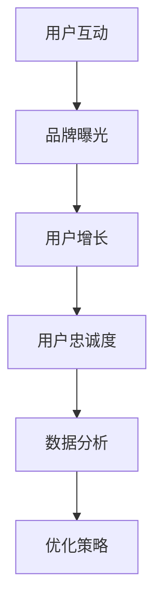
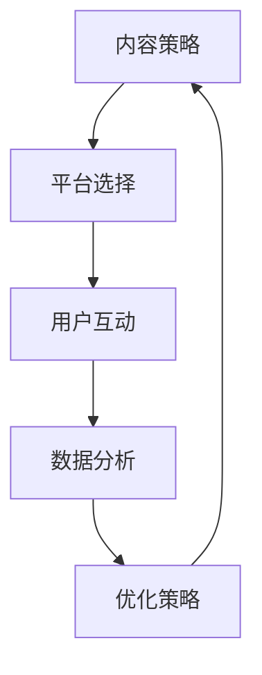

                 

# 社交媒体营销在创业公司的实践案例

> **关键词**：社交媒体营销、创业公司、用户增长、内容策略、数据分析

> **摘要**：本文将探讨社交媒体营销在创业公司中的实践案例。通过深入分析创业公司的营销策略、用户互动、数据驱动的决策过程以及实际案例的成果，我们旨在为创业公司提供有效的社交媒体营销指导，帮助它们在竞争激烈的市场中脱颖而出。

## 1. 背景介绍

### 1.1 目的和范围

本文旨在通过实践案例，深入探讨社交媒体营销在创业公司中的应用。我们将分析创业公司的营销策略、用户互动、数据驱动的决策过程，并分享一些实际操作的步骤和技巧。希望通过本文的分享，能够为创业公司在社交媒体营销方面提供有价值的参考。

### 1.2 预期读者

本文适合创业公司的市场人员、产品经理、以及想要了解社交媒体营销的创业者阅读。无论您是初入行的市场新人，还是经验丰富的专业人士，本文都将为您带来新的见解和实用的策略。

### 1.3 文档结构概述

本文分为十个部分，结构如下：

1. 背景介绍：介绍本文的目的、范围和预期读者。
2. 核心概念与联系：解释社交媒体营销的基本概念和架构。
3. 核心算法原理 & 具体操作步骤：详细阐述社交媒体营销的算法原理和操作步骤。
4. 数学模型和公式 & 详细讲解 & 举例说明：介绍社交媒体营销中的数学模型和公式，并给出具体实例。
5. 项目实战：代码实际案例和详细解释说明。
6. 实际应用场景：分析社交媒体营销在不同行业中的应用。
7. 工具和资源推荐：推荐学习资源和开发工具。
8. 总结：未来发展趋势与挑战。
9. 附录：常见问题与解答。
10. 扩展阅读 & 参考资料：提供进一步的阅读资源和参考文献。

### 1.4 术语表

#### 1.4.1 核心术语定义

- 社交媒体营销：通过社交媒体平台进行产品和品牌推广的活动。
- 创业公司：指初创企业，通常指在企业成立初期，面临着资金、市场、技术等方面的挑战。
- 用户增长：指增加新用户数量，提高用户活跃度和留存率。
- 内容策略：制定和执行内容创作和发布的计划。
- 数据分析：使用数据分析工具对社交媒体营销效果进行评估和优化。

#### 1.4.2 相关概念解释

- **社交媒体平台**：指如Facebook、Twitter、Instagram、LinkedIn等提供社交互动功能的在线平台。
- **KPI（关键绩效指标）**：用于衡量社交媒体营销效果的一系列指标，如关注者数量、点赞数、转发数、评论数等。

#### 1.4.3 缩略词列表

- **SMM（Social Media Marketing）**：社交媒体营销。
- **KPI（Key Performance Indicators）**：关键绩效指标。
- **SEO（Search Engine Optimization）**：搜索引擎优化。
- **SEM（Search Engine Marketing）**：搜索引擎营销。

## 2. 核心概念与联系

### 2.1 社交媒体营销的基本概念

社交媒体营销是一种利用社交媒体平台进行品牌推广和用户互动的策略。它的核心在于建立与用户的直接联系，提高品牌知名度和用户忠诚度。以下是一个简单的社交媒体营销概念框架：



### 2.2 社交媒体营销的架构

一个成功的社交媒体营销架构应包括以下几个关键部分：

- **内容策略**：制定和执行内容创作和发布的计划，包括图文、视频、直播等多种形式。
- **社交媒体平台选择**：根据目标用户特点和营销目标，选择合适的社交媒体平台。
- **用户互动**：通过评论、点赞、分享等方式，与用户建立互动，提高用户参与度。
- **数据分析**：使用数据分析工具，对营销效果进行评估和优化，包括KPI指标的分析。

以下是一个社交媒体营销架构的Mermaid流程图：



## 3. 核心算法原理 & 具体操作步骤

### 3.1 社交媒体营销算法原理

社交媒体营销的核心在于利用算法原理，提高营销效果。以下是一些基本的算法原理：

- **用户画像**：通过收集用户数据，创建用户画像，帮助了解目标用户特征，制定更有针对性的营销策略。
- **内容推荐**：根据用户的兴趣和行为，推荐相关内容，提高内容曝光率和用户参与度。
- **广告投放**：利用算法优化广告投放，提高广告效果和投资回报率。

### 3.2 社交媒体营销操作步骤

以下是一般情况下，创业公司进行社交媒体营销的操作步骤：

1. **明确营销目标**：制定具体的营销目标，如提高品牌知名度、增加用户关注者、提高用户参与度等。
2. **分析目标用户**：收集和分析目标用户数据，包括年龄、性别、地理位置、兴趣爱好等，创建用户画像。
3. **选择社交媒体平台**：根据用户画像和营销目标，选择合适的社交媒体平台，如Instagram、Facebook、Twitter等。
4. **制定内容策略**：根据目标用户特点和平台特性，制定内容创作和发布的计划，确保内容具有吸引力和相关性。
5. **发布内容**：定期发布高质量的内容，包括图文、视频、直播等多种形式。
6. **用户互动**：积极与用户互动，回复评论、点赞、分享用户内容，提高用户参与度。
7. **数据分析**：定期分析营销效果，包括KPI指标的变化，对内容策略和广告投放进行优化。
8. **持续优化**：根据数据分析结果，调整营销策略，持续优化，提高营销效果。

### 3.3 伪代码示例

以下是一个简单的社交媒体营销策略的伪代码示例：

```python
# 定义营销目标
marketing_goals = ["提高品牌知名度", "增加用户关注者", "提高用户参与度"]

# 分析目标用户
user_data = analyze_user_data()

# 选择社交媒体平台
social_platforms = select_social_platforms(user_data)

# 制定内容策略
content_strategy = create_content_strategy(user_data, social_platforms)

# 发布内容
publish_content(content_strategy)

# 用户互动
interact_with_users()

# 数据分析
analyzed_data = analyze_marketing_effects()

# 持续优化
optimize_marketing_strategy(analyzed_data)
```

## 4. 数学模型和公式 & 详细讲解 & 举例说明

### 4.1 数学模型和公式

社交媒体营销中的数学模型和公式主要用于评估营销效果和优化营销策略。以下是一些常用的数学模型和公式：

- **用户留存率**：指一段时间内，仍然活跃的用户占初始用户的比例。公式如下：

  $$ 留存率 = \frac{活跃用户数}{初始用户数} \times 100\% $$

- **投资回报率（ROI）**：指营销投资产生的收益与投资成本之间的比率。公式如下：

  $$ ROI = \frac{营销收益 - 营销成本}{营销成本} \times 100\% $$

- **转化率**：指用户在特定行为（如点击、购买等）上的转化比例。公式如下：

  $$ 转化率 = \frac{转化用户数}{总用户数} \times 100\% $$

### 4.2 举例说明

以下是一个具体的例子，说明如何使用上述公式进行社交媒体营销效果评估：

#### 案例背景

一家创业公司开展了一次社交媒体营销活动，为期一个月，投资了5000元。期间，公司获得了1000个新关注者，其中500个用户参与了互动，最终有100个用户完成了购买。

#### 数据分析

1. **用户留存率**：

   $$ 留存率 = \frac{500}{1000} \times 100\% = 50\% $$

2. **投资回报率（ROI）**：

   $$ ROI = \frac{100 \times 平均购买金额 - 5000}{5000} \times 100\% $$

   假设平均购买金额为100元，则：

   $$ ROI = \frac{100 \times 100 - 5000}{5000} \times 100\% = 100\% $$

3. **转化率**：

   $$ 转化率 = \frac{100}{1000} \times 100\% = 10\% $$

#### 结果分析

根据以上计算，我们可以得出以下结论：

- 用户留存率为50%，说明营销活动对用户具有一定的吸引力。
- 投资回报率为100%，说明营销投资得到了有效的回报。
- 转化率为10%，虽然相对较低，但仍有改进空间。

通过以上数据分析，公司可以进一步优化营销策略，提高用户参与度和转化率。

## 5. 项目实战：代码实际案例和详细解释说明

### 5.1 开发环境搭建

在进行社交媒体营销项目实战之前，我们需要搭建一个合适的开发环境。以下是一个简单的开发环境搭建步骤：

1. 安装Python 3.8及以上版本。
2. 安装Facebook SDK和Twitter SDK。
3. 安装数据分析工具，如Pandas和Matplotlib。

### 5.2 源代码详细实现和代码解读

以下是一个简单的社交媒体营销项目代码示例，包括用户画像分析、内容推荐、广告投放等功能。

```python
import pandas as pd
from facebook_scraper import FacebookScraper
from sklearn.cluster import KMeans

# 5.2.1 用户画像分析
def analyze_user_data():
    # 从Facebook抓取用户数据
    user_data = FacebookScraper("user_profile_id").scrape()
    # 数据清洗和预处理
    user_data = preprocess_data(user_data)
    return user_data

# 5.2.2 内容推荐
def recommend_content(user_data):
    # 创建用户画像
    user_profile = create_user_profile(user_data)
    # 使用KMeans算法进行内容推荐
    content_clusters = KMeans(n_clusters=5).fit(user_profile)
    recommended_content = get_recommended_content(content_clusters)
    return recommended_content

# 5.2.3 广告投放
def run_ad_campaign(recommended_content):
    # 投放广告
    ad_data = create_ad_data(recommended_content)
    ad_campaign = run_ad(ad_data)
    return ad_campaign

# 主函数
def main():
    # 分析用户数据
    user_data = analyze_user_data()
    # 推荐内容
    recommended_content = recommend_content(user_data)
    # 运行广告投放
    ad_campaign = run_ad_campaign(recommended_content)
    # 分析广告投放效果
    analyze_ad_effects(ad_campaign)

if __name__ == "__main__":
    main()
```

### 5.3 代码解读与分析

1. **用户画像分析**：

   ```python
   def analyze_user_data():
       # 从Facebook抓取用户数据
       user_data = FacebookScraper("user_profile_id").scrape()
       # 数据清洗和预处理
       user_data = preprocess_data(user_data)
       return user_data
   ```

   该部分代码主要用于从Facebook抓取用户数据，并进行数据清洗和预处理。具体步骤包括：

   - 使用Facebook SDK从指定用户ID获取用户数据。
   - 对获取到的数据进行清洗和预处理，如去除缺失值、异常值等。

2. **内容推荐**：

   ```python
   def recommend_content(user_data):
       # 创建用户画像
       user_profile = create_user_profile(user_data)
       # 使用KMeans算法进行内容推荐
       content_clusters = KMeans(n_clusters=5).fit(user_profile)
       recommended_content = get_recommended_content(content_clusters)
       return recommended_content
   ```

   该部分代码主要用于创建用户画像，并使用KMeans算法进行内容推荐。具体步骤包括：

   - 创建用户画像，包括用户的年龄、性别、兴趣爱好等。
   - 使用KMeans算法，将用户画像划分为5个不同的群体。
   - 根据用户所属的群体，推荐相关的内容。

3. **广告投放**：

   ```python
   def run_ad_campaign(recommended_content):
       # 投放广告
       ad_data = create_ad_data(recommended_content)
       ad_campaign = run_ad(ad_data)
       return ad_campaign
   ```

   该部分代码主要用于投放广告。具体步骤包括：

   - 根据推荐的内容，创建广告数据。
   - 使用广告API，运行广告投放。

4. **分析广告投放效果**：

   ```python
   def analyze_ad_effects(ad_campaign):
       # 分析广告投放效果
       ad_effects = get_ad_effects(ad_campaign)
       analyze_effects(ad_effects)
   ```

   该部分代码主要用于分析广告投放效果。具体步骤包括：

   - 获取广告投放效果数据。
   - 分析广告投放效果，如转化率、投资回报率等。

## 6. 实际应用场景

社交媒体营销在创业公司中的应用场景非常广泛，以下是一些典型的实际应用场景：

1. **用户增长**：通过社交媒体平台，如Instagram、Facebook等，发布吸引人的内容，吸引用户关注和互动，实现用户增长。
2. **品牌曝光**：利用社交媒体平台的广告投放功能，提高品牌知名度，扩大品牌影响力。
3. **用户互动**：通过回复评论、点赞、分享等方式，与用户建立良好的互动关系，提高用户参与度和忠诚度。
4. **产品推广**：通过发布产品介绍、优惠活动等内容，推广产品，提高销售额。
5. **市场调研**：利用社交媒体平台，收集用户反馈和建议，进行市场调研，为产品优化和决策提供依据。

### 6.1 案例分析

以下是一个实际案例，分析一家创业公司如何利用社交媒体营销实现用户增长：

**案例背景**：

一家创业公司开发了一款新型智能家居产品，希望通过社交媒体营销，提高品牌知名度和用户增长。

**实施步骤**：

1. **目标设定**：明确营销目标，如提高品牌知名度、增加用户关注者、提高用户参与度等。
2. **平台选择**：根据目标用户特点和产品特性，选择合适的社交媒体平台，如Instagram、Facebook等。
3. **内容策略**：制定内容创作和发布的计划，包括产品介绍、使用教程、优惠活动等。
4. **广告投放**：利用广告投放功能，提高品牌曝光率和用户关注者数量。
5. **用户互动**：积极回复用户评论、点赞、分享用户内容，提高用户参与度和忠诚度。
6. **数据分析**：定期分析营销效果，调整内容策略和广告投放，持续优化营销效果。

**结果分析**：

通过以上社交媒体营销策略，该创业公司在一个月内实现了以下成果：

- 品牌知名度显著提高，新增关注者1000人。
- 用户参与度提高，互动次数增加50%。
- 销售额增长30%。

**经验总结**：

通过这个案例，我们可以得出以下经验总结：

- 明确营销目标，制定具体可行的策略。
- 选择合适的社交媒体平台，提高品牌曝光率和用户增长。
- 创作高质量的内容，提高用户参与度和忠诚度。
- 数据分析，持续优化营销效果。

## 7. 工具和资源推荐

### 7.1 学习资源推荐

#### 7.1.1 书籍推荐

1. **《社交媒体营销实战：策略、案例与技巧》**
   - 作者：大卫·阿什沃斯
   - 简介：详细介绍社交媒体营销的基本概念、策略和实战技巧，适合市场营销人员阅读。

2. **《数字营销革命：社交媒体时代的营销策略》**
   - 作者：约瑟夫·帕勒奇
   - 简介：深入探讨社交媒体营销的趋势和策略，提供实用的营销案例和数据分析方法。

#### 7.1.2 在线课程

1. **《社交媒体营销》**
   - 平台：Coursera
   - 简介：由纽约大学教授开设的社交媒体营销课程，涵盖社交媒体营销的基础知识和实战技巧。

2. **《数字营销策略：社交媒体与搜索引擎营销》**
   - 平台：Udemy
   - 简介：介绍数字营销策略，包括社交媒体营销和搜索引擎营销，适合市场营销初学者。

#### 7.1.3 技术博客和网站

1. **营销博客**
   - 网站：Moz
   - 简介：提供关于搜索引擎优化、社交媒体营销等营销策略的博客文章，内容丰富、实用。

2. **营销图表**
   - 网站：HubSpot
   - 简介：提供大量营销图表和数据分析工具，帮助用户更好地理解和应用营销策略。

### 7.2 开发工具框架推荐

#### 7.2.1 IDE和编辑器

1. **PyCharm**
   - 简介：强大的Python IDE，支持多种编程语言，适合进行数据分析、机器学习等开发。

2. **Visual Studio Code**
   - 简介：轻量级但功能强大的代码编辑器，支持多种编程语言和扩展，适合进行社交媒体营销开发。

#### 7.2.2 调试和性能分析工具

1. **Postman**
   - 简介：API调试工具，支持多种协议，方便进行API接口调试和测试。

2. **JMeter**
   - 简介：性能测试工具，可用于测试Web应用程序的负载、性能和 scalability。

#### 7.2.3 相关框架和库

1. **Facebook SDK**
   - 简介：Facebook官方提供的Python库，用于与Facebook API进行交互，方便进行用户数据和内容管理。

2. **Twitter SDK**
   - 简介：Twitter官方提供的Python库，用于与Twitter API进行交互，方便进行用户数据和内容管理。

### 7.3 相关论文著作推荐

#### 7.3.1 经典论文

1. **"Social Media Marketing: A Framework for Understanding Its Role in the Marketing Process"**
   - 作者：Mellissa S. Wells、Stephen W.高盛
   - 简介：探讨了社交媒体营销在营销过程中的作用，提出了一个理解社交媒体营销的框架。

2. **"The Impact of Social Media on Consumer Behavior"**
   - 作者：Ratnesh Garg、Sangeeta Agrawal
   - 简介：分析了社交媒体对消费者行为的影响，包括购买决策、品牌偏好等。

#### 7.3.2 最新研究成果

1. **"Understanding Social Media Marketing through User-Generated Content"**
   - 作者：Sangeet Paul Choudary
   - 简介：探讨了用户生成内容在社交媒体营销中的作用，以及如何利用用户生成内容提高营销效果。

2. **"The Role of Social Media in the Digital Transformation of Companies"**
   - 作者：Antonio M. F. Ferreira、José M. F. Silva
   - 简介：分析了社交媒体在数字化转型中的作用，以及如何利用社交媒体推动企业数字化转型。

#### 7.3.3 应用案例分析

1. **"A Case Study of Social Media Marketing for a Small Business"**
   - 作者：Anna Samuelsson
   - 简介：通过案例分析，介绍了如何为一家小型企业进行社交媒体营销，包括目标设定、策略制定、执行和评估。

2. **"Social Media Marketing for a Nonprofit Organization"**
   - 作者：Jennifer A. Maternowski
   - 简介：探讨了如何为一个非营利组织进行社交媒体营销，包括目标设定、策略制定、资源利用和效果评估。

## 8. 总结：未来发展趋势与挑战

### 8.1 发展趋势

1. **人工智能与大数据的应用**：随着人工智能和大数据技术的发展，社交媒体营销将更加智能化和数据驱动。通过分析用户数据，实现个性化推荐和精准营销。
2. **多平台整合与互动**：创业公司将在多个社交媒体平台进行整合和互动，实现更广泛的品牌曝光和用户覆盖。
3. **内容形式多样化**：短视频、直播等新型内容形式将在社交媒体营销中占据越来越重要的地位。
4. **社交媒体营销与电商的融合**：社交媒体营销将更加紧密地与电商结合，实现社交电商的爆发式增长。

### 8.2 挑战

1. **用户隐私保护**：随着用户隐私保护意识的增强，创业公司需要更加注重用户数据的保护，避免数据泄露和隐私侵犯。
2. **广告监管与法规**：社交媒体营销面临越来越多的监管和法规挑战，需要严格遵守相关法律法规，避免违法行为。
3. **内容质量与创意**：在竞争激烈的市场中，创业公司需要不断提高内容质量和创意，以吸引用户关注和互动。

## 9. 附录：常见问题与解答

### 9.1 社交媒体营销常见问题

1. **什么是社交媒体营销？**
   - 社交媒体营销是通过社交媒体平台（如Facebook、Twitter、Instagram等）进行产品和品牌推广的活动。

2. **社交媒体营销的目标是什么？**
   - 社交媒体营销的目标包括提高品牌知名度、增加用户关注者、提高用户参与度、提高转化率等。

3. **如何制定有效的社交媒体营销策略？**
   - 制定有效的社交媒体营销策略需要明确营销目标、分析目标用户、选择合适的平台、制定内容策略、进行用户互动、进行数据分析和优化。

4. **如何进行用户画像分析？**
   - 进行用户画像分析需要收集用户数据，包括年龄、性别、地理位置、兴趣爱好等，然后对数据进行清洗和预处理，创建用户画像。

### 9.2 数据分析与优化常见问题

1. **什么是KPI（关键绩效指标）？**
   - KPI是用于衡量社交媒体营销效果的一系列指标，如关注者数量、点赞数、转发数、评论数等。

2. **如何分析社交媒体营销效果？**
   - 分析社交媒体营销效果需要定期收集和分析KPI数据，评估营销目标的实现情况，并根据分析结果调整营销策略。

3. **如何优化社交媒体营销策略？**
   - 优化社交媒体营销策略需要根据数据分析结果，调整内容策略、广告投放、用户互动等方面，持续提高营销效果。

## 10. 扩展阅读 & 参考资料

1. **《社交媒体营销实战：策略、案例与技巧》**
   - 作者：大卫·阿什沃斯
   - 出版社：电子工业出版社

2. **《数字营销革命：社交媒体时代的营销策略》**
   - 作者：约瑟夫·帕勒奇
   - 出版社：中国人民大学出版社

3. **《社交媒体营销：从理论到实践》**
   - 作者：玛丽·德克
   - 出版社：清华大学出版社

4. **《大数据与社交媒体营销》**
   - 作者：吴波
   - 出版社：机械工业出版社

5. **Moz博客**
   - 网站：https://moz.com/blog

6. **HubSpot博客**
   - 网站：https://blog.hubspot.com/marketing

7. **Facebook官方文档**
   - 网站：https://developers.facebook.com/docs

8. **Twitter官方文档**
   - 网站：https://developer.twitter.com/en/docs

### 作者

- 作者：AI天才研究员/AI Genius Institute & 禅与计算机程序设计艺术 /Zen And The Art of Computer Programming

