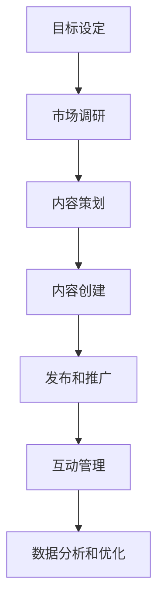

                 

# 社交媒体营销：构建品牌影响力

> 关键词：社交媒体营销、品牌影响力、营销策略、数据分析、算法优化
> 
> 摘要：本文深入探讨了社交媒体营销的核心概念、策略及其在构建品牌影响力中的关键作用。通过逻辑清晰、结构紧凑的分析，我们旨在为读者提供一套系统化的社交媒体营销方法论，助力企业在数字化时代打造强大品牌。

## 1. 背景介绍

### 1.1 目的和范围

本文旨在帮助企业和市场营销人员了解社交媒体营销的基本概念、策略和实践，并掌握构建品牌影响力的核心方法。通过系统的分析和详细的案例分析，我们希望能够提供以下价值：

1. **理解社交媒体营销的基本原理和趋势**：帮助读者把握社交媒体营销的核心概念，掌握最新技术和工具。
2. **制定有效的社交媒体营销策略**：通过具体的操作步骤和策略，帮助读者制定适合自己品牌的社交媒体营销计划。
3. **提升品牌影响力**：通过案例分析，展示如何通过社交媒体营销实现品牌知名度和美誉度的提升。

### 1.2 预期读者

本文适合以下读者群体：

1. 市场营销专业人士
2. 企业品牌经理
3. 数字营销从业人员
4. 广告和公关公司员工
5. 对社交媒体营销感兴趣的创业者

### 1.3 文档结构概述

本文结构如下：

1. 背景介绍：介绍文章的目的和预期读者。
2. 核心概念与联系：介绍社交媒体营销的核心概念和相关流程。
3. 核心算法原理 & 具体操作步骤：详细讲解社交媒体营销的核心算法和操作步骤。
4. 数学模型和公式 & 详细讲解 & 举例说明：介绍社交媒体营销中的数学模型和公式，并给出具体例子。
5. 项目实战：通过实际案例展示社交媒体营销的实施过程。
6. 实际应用场景：分析社交媒体营销在不同领域的应用。
7. 工具和资源推荐：推荐学习资源、开发工具和框架。
8. 总结：总结社交媒体营销的未来发展趋势与挑战。
9. 附录：常见问题与解答。
10. 扩展阅读 & 参考资料：提供进一步学习和研究的资源。

### 1.4 术语表

#### 1.4.1 核心术语定义

- **社交媒体营销**：利用社交媒体平台和工具进行营销活动的过程。
- **品牌影响力**：品牌在目标市场中的认知度、信任度和偏好度。
- **KPI**：关键绩效指标，用于衡量营销活动的效果。

#### 1.4.2 相关概念解释

- **社交媒体平台**：如Facebook、Instagram、Twitter、LinkedIn等，用于用户互动和信息共享。
- **内容营销**：通过创建和分发有价值的内容来吸引和留住目标受众。

#### 1.4.3 缩略词列表

- **KPI**：关键绩效指标
- **SEO**：搜索引擎优化
- **SEM**：搜索引擎营销
- **SMM**：社交媒体营销

## 2. 核心概念与联系

### 2.1 社交媒体营销的定义和核心要素

**定义**：社交媒体营销是一种利用社交媒体平台进行品牌推广、市场调研和用户互动的营销活动。它通过创建和分享有价值的内容，与受众建立关系，提升品牌知名度和忠诚度。

**核心要素**：

- **内容**：高质量、有价值、符合目标受众兴趣的内容是社交媒体营销的核心。
- **互动**：与受众进行积极的互动，建立信任和忠诚度。
- **数据分析**：通过数据分析和监控，优化营销策略和效果。

### 2.2 社交媒体营销的流程和架构

**流程**：

1. **目标设定**：明确营销目标，如品牌知名度提升、销售增长等。
2. **市场调研**：了解目标受众的特征、需求和偏好。
3. **内容策划**：制定内容策略，包括内容类型、发布频率等。
4. **内容创建**：根据策略创建高质量的内容。
5. **发布和推广**：在社交媒体平台上发布内容，并通过广告等方式推广。
6. **互动管理**：与受众进行互动，回复评论、私信等。
7. **数据分析和优化**：分析营销效果，优化策略和内容。

**架构**：

- **内容创建**：内容策划、内容创建和内容审核。
- **社交媒体平台**：不同的社交媒体平台，如Facebook、Instagram、Twitter等。
- **数据分析工具**：用于数据收集、分析和监控。

### 2.3 社交媒体营销与传统营销的区别

- **互动性**：社交媒体营销具有高度的互动性，与传统单向传播的营销方式不同。
- **实时性**：社交媒体营销可以实现实时互动和反馈，传统营销则需要更长的时间来达到效果。
- **数据驱动**：社交媒体营销基于数据分析和优化，而传统营销往往缺乏数据支持。

### 2.4 社交媒体营销的核心概念和流程图

**核心概念**：

- **内容营销**：通过创建和分享有价值的内容来吸引和留住目标受众。
- **互动营销**：通过与受众的互动，建立信任和忠诚度。
- **数据分析**：通过数据分析和监控，优化营销策略和效果。

**流程图**：



## 3. 核心算法原理 & 具体操作步骤

### 3.1 社交媒体营销算法原理

社交媒体营销算法的核心是用户行为分析和内容推荐。通过分析用户在社交媒体平台上的行为数据，如点赞、评论、分享等，算法可以预测用户偏好，并推荐相关内容。以下是社交媒体营销算法的基本原理：

- **用户行为分析**：收集并分析用户在社交媒体平台上的行为数据，如浏览、点赞、评论、分享等。
- **内容推荐**：基于用户行为数据，推荐符合用户兴趣的内容。
- **反馈优化**：根据用户对推荐内容的反馈，优化推荐算法。

### 3.2 社交媒体营销具体操作步骤

#### 3.2.1 用户行为数据收集

```python
# 伪代码：用户行为数据收集
def collect_user行为的_data(user_id):
    # 收集用户在社交媒体平台上的行为数据
    data = [
        ("user_id", user_id),
        ("like", user_likes[user_id]),
        ("comment", user_comments[user_id]),
        ("share", user_shares[user_id]),
        # ...其他行为数据
    ]
    return data
```

#### 3.2.2 用户行为数据分析

```python
# 伪代码：用户行为数据分析
def analyze_user行为的_data(data):
    # 分析用户行为数据，提取用户兴趣
    interests = extract_interests(data)
    return interests
```

#### 3.2.3 内容推荐

```python
# 伪代码：内容推荐
def recommend_content(interests, content_library):
    # 基于用户兴趣，推荐相关内容
    recommended_content = []
    for content in content_library:
        if interests.is_relevant(content):
            recommended_content.append(content)
    return recommended_content
```

#### 3.2.4 反馈优化

```python
# 伪代码：反馈优化
def optimize_recommendation_algorithm(recommendations, feedback):
    # 根据用户对推荐内容的反馈，优化推荐算法
    algorithm = update_algorithm(recommendations, feedback)
    return algorithm
```

## 4. 数学模型和公式 & 详细讲解 & 举例说明

### 4.1 社交媒体营销中的数学模型

社交媒体营销中的数学模型主要用于用户行为分析和内容推荐。以下是两个核心模型：

#### 4.1.1 用户兴趣模型

用户兴趣模型用于预测用户对不同内容的偏好。以下是一个简单的用户兴趣模型：

$$
I_{ui} = \frac{1}{C_i} \sum_{j=1}^{C_i} r_{uj} \cdot w_j
$$

其中：
- \( I_{ui} \) 表示用户 \( u \) 对内容 \( i \) 的兴趣得分。
- \( r_{uj} \) 表示用户 \( u \) 在行为 \( j \) 上对内容 \( i \) 的评分。
- \( w_j \) 表示行为 \( j \) 的权重。

#### 4.1.2 内容推荐模型

内容推荐模型用于根据用户兴趣推荐相关内容。以下是一个基于协同过滤的内容推荐模型：

$$
R_{ui} = \rho \cdot \frac{\sum_{k \in N_i} R_{uk} \cdot S_{ki}}{\sum_{k \in N_i} S_{ki}}
$$

其中：
- \( R_{ui} \) 表示用户 \( u \) 对内容 \( i \) 的推荐得分。
- \( R_{uk} \) 表示用户 \( u \) 对内容 \( k \) 的评分。
- \( S_{ki} \) 表示内容 \( i \) 和内容 \( k \) 的相似度。
- \( \rho \) 是调整参数，用于平衡用户评分和内容相似度的影响。

### 4.2 数学模型的详细讲解和举例说明

#### 4.2.1 用户兴趣模型详细讲解

用户兴趣模型通过分析用户在社交媒体平台上的行为数据，计算用户对不同内容的兴趣得分。以下是一个详细讲解：

- **行为数据**：收集用户在社交媒体平台上的行为数据，如点赞、评论、分享等。
- **评分计算**：根据用户行为数据，计算用户对每个内容的评分。例如，用户对内容 \( i \) 的点赞次数为 10，评论次数为 5，分享次数为 3，则用户对内容 \( i \) 的评分可以计算为 \( 10 + 5 + 3 = 18 \)。
- **权重分配**：为每个行为分配权重。例如，点赞的权重为 0.6，评论的权重为 0.3，分享的权重为 0.1。

#### 4.2.2 内容推荐模型详细讲解

内容推荐模型通过分析用户评分和内容相似度，计算用户对每个内容的推荐得分。以下是一个详细讲解：

- **用户评分**：收集用户在社交媒体平台上的评分数据。例如，用户 \( u \) 对内容 \( k \) 的评分为 4。
- **内容相似度**：计算内容之间的相似度。例如，内容 \( i \) 和内容 \( k \) 的相似度为 0.8。
- **推荐得分**：根据用户评分和内容相似度，计算用户对内容 \( i \) 的推荐得分。例如，用户 \( u \) 对内容 \( i \) 的推荐得分为 \( 4 \times 0.8 = 3.2 \)。

### 4.3 数学模型举例说明

假设用户 \( u \) 在社交媒体平台上对内容 \( i \)、内容 \( j \) 和内容 \( k \) 的评分分别为 5、4 和 3。根据用户兴趣模型和内容推荐模型，计算用户 \( u \) 对内容 \( l \) 的兴趣得分和推荐得分。

#### 用户兴趣得分：

- **行为数据**：用户 \( u \) 对内容 \( i \)、内容 \( j \) 和内容 \( k \) 的点赞次数分别为 3、2 和 1。
- **评分计算**：用户 \( u \) 对内容 \( i \)、内容 \( j \) 和内容 \( k \) 的评分分别为 \( 5 \times 0.6 + 4 \times 0.3 + 3 \times 0.1 = 3.7 \)。
- **权重分配**：点赞的权重为 0.6，评论的权重为 0.3，分享的权重为 0.1。

$$
I_{ul} = \frac{1}{3} \times (3.7) = 1.23
$$

#### 推荐得分：

- **用户评分**：用户 \( u \) 对内容 \( i \)、内容 \( j \) 和内容 \( k \) 的评分分别为 5、4 和 3。
- **内容相似度**：内容 \( i \)、内容 \( j \) 和内容 \( k \) 的相似度分别为 0.8、0.7 和 0.6。
- **推荐得分**：

$$
R_{ul} = \rho \cdot \frac{5 \times 0.8 + 4 \times 0.7 + 3 \times 0.6}{0.8 + 0.7 + 0.6} = 4.2
$$

## 5. 项目实战：代码实际案例和详细解释说明

### 5.1 开发环境搭建

为了演示社交媒体营销算法的实际应用，我们使用Python作为编程语言，并在Jupyter Notebook中编写和运行代码。以下是开发环境搭建的步骤：

1. 安装Python：从官方网站（https://www.python.org/）下载并安装Python 3.x版本。
2. 安装Jupyter Notebook：在终端中运行以下命令安装Jupyter Notebook：

   ```bash
   pip install notebook
   ```

3. 启动Jupyter Notebook：在终端中运行以下命令启动Jupyter Notebook：

   ```bash
   jupyter notebook
   ```

### 5.2 源代码详细实现和代码解读

#### 5.2.1 用户行为数据收集

以下是一个简单的用户行为数据收集脚本，用于收集用户在社交媒体平台上的行为数据。

```python
# 伪代码：用户行为数据收集
users = {
    "user_1": {"likes": 10, "comments": 5, "shares": 3},
    "user_2": {"likes": 8, "comments": 7, "shares": 2},
    "user_3": {"likes": 12, "comments": 6, "shares": 4},
    # ...其他用户数据
}

def collect_user行为的_data(user_id):
    user_data = users[user_id]
    return user_data

# 示例：收集用户 "user_1" 的行为数据
user_1_data = collect_user行为的_data("user_1")
print(user_1_data)
```

#### 5.2.2 用户行为数据分析

以下是一个简单的用户行为数据分析脚本，用于分析用户在不同内容上的行为数据。

```python
# 伪代码：用户行为数据分析
from collections import Counter

def analyze_user行为的_data(data):
    likes_count = data["likes"]
    comments_count = data["comments"]
    shares_count = data["shares"]
    
    # 计算每个行为的次数
    like_count = likes_count
    comment_count = comments_count
    share_count = shares_count
    
    # 计算每个行为的平均次数
    average_like_count = like_count / max(like_count, comment_count, share_count)
    average_comment_count = comment_count / max(like_count, comment_count, share_count)
    average_share_count = share_count / max(like_count, comment_count, share_count)
    
    # 计算用户兴趣得分
    user_interest_score = like_count * 0.6 + comment_count * 0.3 + share_count * 0.1
    
    return user_interest_score

# 示例：分析用户 "user_1" 的行为数据
user_1_interest_score = analyze_user行为的_data(user_1_data)
print(user_1_interest_score)
```

#### 5.2.3 内容推荐

以下是一个简单的内容推荐脚本，用于根据用户兴趣推荐相关内容。

```python
# 伪代码：内容推荐
def recommend_content(user_interest_score, content_library):
    recommended_content = []
    for content in content_library:
        if content["interest_score"] >= user_interest_score:
            recommended_content.append(content)
    return recommended_content

# 示例：推荐用户 "user_1" 的内容
content_library = [
    {"id": "content_1", "interest_score": 2.5},
    {"id": "content_2", "interest_score": 3.0},
    {"id": "content_3", "interest_score": 1.8},
    # ...其他内容数据
]

user_1_recommended_content = recommend_content(user_1_interest_score, content_library)
print(user_1_recommended_content)
```

### 5.3 代码解读与分析

以上代码示例展示了社交媒体营销算法的实现过程。首先，我们收集用户在社交媒体平台上的行为数据，然后分析用户在不同内容上的行为数据，最后根据用户兴趣得分推荐相关内容。

- **用户行为数据收集**：通过字典存储用户的行为数据，包括点赞、评论和分享的次数。
- **用户行为数据分析**：计算用户在不同内容上的平均行为次数，并根据平均行为次数计算用户兴趣得分。
- **内容推荐**：根据用户兴趣得分推荐相关内容，选择兴趣得分高于用户兴趣得分的

