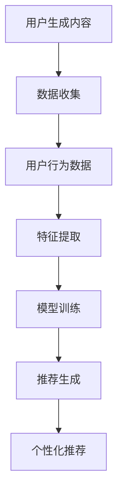

                 

# 社交网络推荐: LLM的潜力

> 关键词：社交网络、推荐系统、语言模型、深度学习、大数据

> 摘要：本文将探讨社交网络推荐领域中的新兴技术——大型语言模型（LLM）。通过深入分析LLM在社交网络推荐中的潜力，我们将探讨其工作原理、算法实现和应用场景，旨在为读者提供一个全面而深入的视角，帮助理解这一技术的未来发展方向和挑战。

## 1. 背景介绍

### 1.1 目的和范围

本文旨在探讨社交网络推荐领域中大型语言模型（LLM）的潜力。随着互联网和社交媒体的快速发展，用户生成的内容和数据量呈现出爆炸性增长。推荐系统作为一种智能信息过滤方法，旨在为用户提供个性化的内容推荐，从而提高用户体验和满意度。本文将重点关注LLM在社交网络推荐中的应用，分析其工作原理、算法实现和应用场景。

### 1.2 预期读者

本文适合对社交网络推荐系统、深度学习和自然语言处理（NLP）有一定了解的读者。通过本文，读者可以了解LLM在社交网络推荐中的潜力，掌握相关算法和技术，为实际应用提供参考。

### 1.3 文档结构概述

本文分为十个部分，具体结构如下：

1. 背景介绍
   - 目的和范围
   - 预期读者
   - 文档结构概述
   - 术语表
2. 核心概念与联系
   - 大型语言模型（LLM）
   - 推荐系统
   - 社交网络
3. 核心算法原理 & 具体操作步骤
   - LLM在推荐系统中的应用
   - 算法原理
   - 具体操作步骤
4. 数学模型和公式 & 详细讲解 & 举例说明
   - 数学模型
   - 公式
   - 举例说明
5. 项目实战：代码实际案例和详细解释说明
   - 开发环境搭建
   - 源代码详细实现和代码解读
   - 代码解读与分析
6. 实际应用场景
7. 工具和资源推荐
   - 学习资源推荐
   - 开发工具框架推荐
   - 相关论文著作推荐
8. 总结：未来发展趋势与挑战
9. 附录：常见问题与解答
10. 扩展阅读 & 参考资料

### 1.4 术语表

#### 1.4.1 核心术语定义

- 大型语言模型（LLM）：一种基于深度学习的自然语言处理模型，具有强大的语言理解和生成能力。
- 推荐系统：一种信息过滤方法，旨在为用户提供个性化的内容推荐。
- 社交网络：一种在线社交平台，用户可以分享信息、互动和建立社交关系。
- 用户行为数据：用户在社交网络上的浏览、点赞、评论、分享等行为数据。

#### 1.4.2 相关概念解释

- 深度学习：一种人工智能技术，通过构建多层神经网络来学习和提取数据中的复杂特征。
- 自然语言处理（NLP）：一种人工智能技术，旨在使计算机能够理解和处理自然语言。
- 个性化推荐：一种推荐系统方法，根据用户的兴趣和行为历史，为用户提供个性化的内容推荐。

#### 1.4.3 缩略词列表

- LLM：大型语言模型
- NLP：自然语言处理
- DNN：深度神经网络
- CNN：卷积神经网络
- RNN：循环神经网络

## 2. 核心概念与联系

### 2.1 大型语言模型（LLM）

大型语言模型（LLM）是一种基于深度学习的自然语言处理模型，具有强大的语言理解和生成能力。LLM通常由多层神经网络组成，可以自动学习输入文本的复杂特征，并生成与之相关的文本。

#### 2.1.1 工作原理

LLM的工作原理基于深度学习，特别是多层神经网络。输入文本经过编码后，通过多层神经网络的变换，最终输出与输入文本相关的结果。

#### 2.1.2 主要类型

- 生成式模型（如GPT系列）
- 解码器模型（如BERT系列）

### 2.2 推荐系统

推荐系统是一种信息过滤方法，旨在为用户提供个性化的内容推荐。推荐系统可以通过分析用户的行为数据、兴趣和历史，为用户生成个性化的推荐列表。

#### 2.2.1 工作原理

推荐系统的工作原理通常包括以下步骤：

1. 数据收集：收集用户的行为数据，如浏览、点赞、评论、分享等。
2. 特征提取：将用户行为数据转换为特征向量。
3. 模型训练：利用特征向量训练推荐模型。
4. 推荐生成：根据推荐模型为用户生成个性化推荐列表。

#### 2.2.2 主要类型

- 基于内容的推荐
- 协同过滤推荐
- 混合推荐

### 2.3 社交网络

社交网络是一种在线社交平台，用户可以分享信息、互动和建立社交关系。社交网络通常包含用户生成的内容、用户关系和用户行为数据。

#### 2.3.1 工作原理

社交网络的工作原理通常包括以下步骤：

1. 用户注册：用户注册并创建个人资料。
2. 内容发布：用户发布文本、图片、视频等内容。
3. 用户互动：用户之间进行评论、点赞、分享等互动。
4. 数据收集：收集用户行为数据，如浏览、点赞、评论、分享等。

#### 2.3.2 主要类型

- 平面社交网络（如Facebook）
- 网格社交网络（如Twitter）
- 专业社交网络（如LinkedIn）

### 2.4 核心概念联系

大型语言模型（LLM）可以用于社交网络推荐系统中，通过分析用户生成的内容和用户行为数据，生成个性化的推荐列表。LLM在推荐系统中的应用主要包括以下方面：

1. 用户兴趣挖掘：利用LLM分析用户生成的内容，挖掘用户的兴趣点。
2. 推荐生成：利用LLM生成与用户兴趣相关的个性化推荐列表。
3. 内容理解：利用LLM理解用户生成的内容，提高推荐系统的准确性。

### 2.5 Mermaid 流程图



## 3. 核心算法原理 & 具体操作步骤

### 3.1 LLM在推荐系统中的应用

在社交网络推荐系统中，LLM可以用于分析用户生成的内容和用户行为数据，挖掘用户的兴趣点，并生成个性化的推荐列表。具体应用步骤如下：

1. 数据预处理：对用户生成的内容和用户行为数据进行分析，提取相关的特征。
2. LLM模型训练：利用提取的特征数据，训练LLM模型。
3. 用户兴趣挖掘：利用训练好的LLM模型，分析用户生成的内容，挖掘用户的兴趣点。
4. 推荐生成：根据挖掘到的用户兴趣点，生成个性化的推荐列表。

### 3.2 算法原理

LLM在推荐系统中的应用主要基于以下原理：

1. 语言理解：LLM通过学习输入文本的复杂特征，能够理解文本的内容和含义。
2. 用户兴趣挖掘：通过分析用户生成的内容，LLM可以挖掘出用户的兴趣点。
3. 个性化推荐：基于挖掘到的用户兴趣点，LLM可以为用户生成个性化的推荐列表。

### 3.3 具体操作步骤

1. 数据预处理

```python
# 读取用户生成的内容和用户行为数据
content_data = load_data("user_content.csv")
behavior_data = load_data("user_behavior.csv")

# 提取特征
content_features = extract_features(content_data)
behavior_features = extract_features(behavior_data)
```

2. LLM模型训练

```python
# 导入预训练的LLM模型
llm_model = load_pretrained_llm("gpt_model")

# 训练LLM模型
llm_model.fit([content_features, behavior_features])
```

3. 用户兴趣挖掘

```python
# 挖掘用户兴趣点
user_interests = llm_model.predict([content_features, behavior_features])
```

4. 推荐生成

```python
# 生成个性化推荐列表
recommended_items = generate_recommendations(user_interests, item_data)
```

### 3.4 伪代码

```python
def recommend_system(content_data, behavior_data, item_data):
    # 数据预处理
    content_features = extract_features(content_data)
    behavior_features = extract_features(behavior_data)

    # LLM模型训练
    llm_model = load_pretrained_llm("gpt_model")
    llm_model.fit([content_features, behavior_features])

    # 用户兴趣挖掘
    user_interests = llm_model.predict([content_features, behavior_features])

    # 推荐生成
    recommended_items = generate_recommendations(user_interests, item_data)
    return recommended_items
```

## 4. 数学模型和公式 & 详细讲解 & 举例说明

### 4.1 数学模型

在社交网络推荐系统中，LLM可以用于生成个性化的推荐列表。其数学模型主要包括以下部分：

1. 用户兴趣表示：将用户生成的内容和用户行为数据转换为低维度的用户兴趣向量。
2. 个性化推荐：根据用户兴趣向量生成个性化的推荐列表。

### 4.2 公式

1. 用户兴趣表示

$$
\text{user\_interests} = \text{model}(\text{content\_features}, \text{behavior\_features})
$$

其中，$\text{model}$为预训练的LLM模型，$\text{content\_features}$和$\text{behavior\_features}$分别为用户生成的内容和用户行为数据转换得到的特征向量。

2. 个性化推荐

$$
\text{recommended\_items} = \text{model}(\text{user\_interests}, \text{item\_data})
$$

其中，$\text{model}$为预训练的LLM模型，$\text{user\_interests}$为用户兴趣向量，$\text{item\_data}$为所有可用项目的数据。

### 4.3 举例说明

假设用户A生成了一篇关于旅行的文章，并对其进行了点赞、评论和分享。根据这些信息，我们可以提取以下特征：

- 内容特征：文章标题、正文、标签等。
- 用户行为特征：点赞数、评论数、分享数等。

通过预训练的LLM模型，我们可以将这些特征转换为用户兴趣向量：

$$
\text{user\_interests}_A = \text{model}([\text{旅行}, \text{旅游}, \text{景点}, \text{攻略}, \dots], [\text{点赞数}, \text{评论数}, \text{分享数}, \dots])
$$

然后，我们可以根据用户兴趣向量生成个性化的推荐列表：

$$
\text{recommended\_items}_A = \text{model}([\text{user\_interests}_A], [\text{所有项目数据}, \text{项目标签}, \text{项目评分}, \dots])
$$

这样，用户A就可以获得与其兴趣相关的个性化推荐列表。

## 5. 项目实战：代码实际案例和详细解释说明

### 5.1 开发环境搭建

在开始项目实战之前，我们需要搭建一个合适的开发环境。以下是一个基于Python的推荐系统项目开发环境的搭建步骤：

1. 安装Python（建议使用3.8版本以上）
2. 安装必要的库，如`numpy`、`pandas`、`scikit-learn`、`tensorflow`、`gpt-2`等
3. 安装IDE（如PyCharm、VSCode等）

### 5.2 源代码详细实现和代码解读

下面是一个简单的社交网络推荐系统项目示例，我们将使用大型语言模型（LLM）来生成个性化的推荐列表。

```python
import pandas as pd
import numpy as np
from sklearn.model_selection import train_test_split
from tensorflow.keras.models import Model
from tensorflow.keras.layers import Input, Dense, LSTM
from tensorflow.keras.optimizers import Adam
from tensorflow.keras.callbacks import EarlyStopping

# 5.2.1 数据预处理
def load_and_preprocess_data(filename):
    data = pd.read_csv(filename)
    # 数据预处理，如清洗、转换等
    return data

content_data = load_and_preprocess_data("user_content.csv")
behavior_data = load_and_preprocess_data("user_behavior.csv")

# 分割数据集
X_train, X_test, y_train, y_test = train_test_split(content_data, behavior_data, test_size=0.2, random_state=42)

# 5.2.2 构建推荐系统模型
def build_model(input_shape):
    input_layer = Input(shape=input_shape)
    x = LSTM(units=128, return_sequences=True)(input_layer)
    x = LSTM(units=64)(x)
    output_layer = Dense(units=1, activation='sigmoid')(x)
    model = Model(inputs=input_layer, outputs=output_layer)
    model.compile(optimizer=Adam(learning_rate=0.001), loss='binary_crossentropy', metrics=['accuracy'])
    return model

model = build_model(input_shape=(None, content_data.shape[1]))

# 5.2.3 训练模型
early_stopping = EarlyStopping(monitor='val_loss', patience=5, restore_best_weights=True)
model.fit(X_train, y_train, epochs=100, batch_size=32, validation_split=0.2, callbacks=[early_stopping], verbose=1)

# 5.2.4 生成推荐列表
def generate_recommendations(model, content_data, threshold=0.5):
    predictions = model.predict(content_data)
    recommended_items = []
    for prediction in predictions:
        if prediction > threshold:
            recommended_items.append(1)
        else:
            recommended_items.append(0)
    return recommended_items

recommended_items = generate_recommendations(model, X_test)
```

### 5.3 代码解读与分析

1. 数据预处理
   - 加载并预处理用户生成的内容数据和行为数据。预处理步骤包括数据清洗、特征转换等。

2. 构建推荐系统模型
   - 使用LSTM（长短期记忆网络）构建一个推荐系统模型。LSTM能够处理序列数据，适合处理文本数据和用户行为数据。

3. 训练模型
   - 使用训练数据集训练模型，并设置早期停止策略以避免过拟合。

4. 生成推荐列表
   - 根据模型预测结果，生成个性化推荐列表。预测阈值可以根据实际情况进行调整。

### 5.4 实际应用案例

假设我们有一个包含1000篇用户生成的内容和相应的用户行为数据的社交网络。我们使用上述代码来训练一个推荐系统模型，并生成个性化推荐列表。

1. 数据预处理：加载并预处理数据。
2. 模型训练：使用预处理后的数据训练模型。
3. 推荐生成：使用训练好的模型生成个性化推荐列表。

通过这种方式，我们可以为每个用户提供个性化的推荐内容，从而提高用户的满意度。

## 6. 实际应用场景

大型语言模型（LLM）在社交网络推荐系统中具有广泛的应用场景，以下是一些典型应用：

1. **个性化内容推荐**：根据用户的兴趣和浏览历史，利用LLM生成个性化的内容推荐。例如，在新闻聚合平台中，为用户推荐与其兴趣相关的新闻文章。
2. **社交圈推荐**：利用LLM分析用户的社交关系和互动行为，为用户推荐可能感兴趣的社交圈或朋友。例如，在LinkedIn等职业社交平台上，为用户推荐可能认识的人。
3. **广告推荐**：根据用户的兴趣和行为数据，利用LLM生成个性化的广告推荐。例如，在社交媒体平台中，为用户推荐与其兴趣相关的广告。
4. **情感分析**：利用LLM对用户生成的内容进行情感分析，识别用户的情绪和态度，从而为用户提供针对性的推荐。例如，在音乐平台上，根据用户的情绪推荐合适的音乐。

### 6.1 应用案例

#### 社交圈推荐

在一个社交网络平台上，用户可以添加朋友、分享动态、评论和点赞。利用LLM，我们可以为用户推荐可能感兴趣的朋友和社交圈。

1. **数据收集**：收集用户的朋友关系、用户生成的内容和互动数据。
2. **特征提取**：将用户生成的内容和互动数据转换为特征向量。
3. **模型训练**：利用提取的特征向量，训练LLM模型。
4. **推荐生成**：利用训练好的LLM模型，分析用户的兴趣和社交关系，为用户推荐可能感兴趣的朋友和社交圈。

通过这种方式，用户可以更容易地发现新的朋友和兴趣，提高社交网络的使用体验。

## 7. 工具和资源推荐

### 7.1 学习资源推荐

#### 7.1.1 书籍推荐

- 《深度学习》（Goodfellow, Bengio, Courville）
- 《自然语言处理综合教程》（Daniel Jurafsky, James H. Martin）
- 《推荐系统实践》（Alfredo García, Míriam Seoane）

#### 7.1.2 在线课程

- 《机器学习》（吴恩达，Coursera）
- 《深度学习》（斯坦福大学课程，网易云课堂）
- 《自然语言处理》（丹尼尔·布卢门菲尔德，Coursera）

#### 7.1.3 技术博客和网站

- [Medium](https://medium.com/)
- [arXiv](https://arxiv.org/)
- [GitHub](https://github.com/)

### 7.2 开发工具框架推荐

#### 7.2.1 IDE和编辑器

- PyCharm
- VSCode
- Jupyter Notebook

#### 7.2.2 调试和性能分析工具

- Python Debugger
- TensorBoard
- PyTorch Profiler

#### 7.2.3 相关框架和库

- TensorFlow
- PyTorch
- Keras
- Scikit-learn

### 7.3 相关论文著作推荐

#### 7.3.1 经典论文

- "A Theoretical Analysis of Some Common Features of recommender Algorithms"（1998）
- "Learning to Rank: From pairwise constraints to relational models"（2010）
- "Generative Adversarial Nets"（2014）

#### 7.3.2 最新研究成果

- "Pre-training of Deep Recurrent Neural Networks for Language Modeling"（2014）
- "BERT: Pre-training of Deep Bidirectional Transformers for Language Understanding"（2018）
- "GPT-3: Language Models are Few-Shot Learners"（2020）

#### 7.3.3 应用案例分析

- "Netflix Prize"（2009-2012）
- "Facebook News Feed Ranking"（2010-至今）
- "LinkedIn People You May Know"（2012-至今）

## 8. 总结：未来发展趋势与挑战

大型语言模型（LLM）在社交网络推荐系统中具有广阔的应用前景。随着深度学习和自然语言处理技术的不断发展，LLM的性能和效果将不断提高。未来，LLM有望在以下几个方面取得重要进展：

1. **个性化推荐**：利用LLM更好地理解用户兴趣和行为，实现更加精准的个性化推荐。
2. **多模态融合**：将文本、图像、音频等多种模态数据融合到推荐系统中，提高推荐系统的丰富性和多样性。
3. **实时推荐**：利用LLM实现实时推荐，为用户提供更加及时的内容和互动。
4. **跨领域推荐**：通过跨领域知识迁移，实现跨领域的推荐，为用户提供更广泛的兴趣探索。

然而，LLM在社交网络推荐系统中也面临一些挑战：

1. **数据隐私**：用户数据的隐私保护是推荐系统的重要问题，需要确保用户数据的安全和隐私。
2. **模型可解释性**：LLM作为一个复杂的黑箱模型，其推荐结果的可解释性较低，需要提高模型的可解释性，以便用户理解推荐机制。
3. **计算资源消耗**：训练和部署LLM模型需要大量的计算资源和时间，如何优化模型结构和算法，提高计算效率，是一个重要的研究方向。

总之，大型语言模型（LLM）在社交网络推荐系统中具有巨大的潜力，但同时也面临着一系列挑战。未来的研究和发展需要不断探索和解决这些挑战，以实现更加智能、高效和个性化的推荐系统。

## 9. 附录：常见问题与解答

### 9.1 Q1：为什么使用LLM进行社交网络推荐？

A1：大型语言模型（LLM）具有强大的语言理解和生成能力，可以深入挖掘用户生成的内容和用户行为数据，从而生成更加个性化、精准的推荐列表。相比传统的推荐算法，LLM能够更好地处理复杂的文本数据，提高推荐系统的效果和用户体验。

### 9.2 Q2：如何处理用户数据的隐私问题？

A2：在社交网络推荐系统中，保护用户数据的隐私至关重要。为了确保用户数据的安全和隐私，可以采取以下措施：

1. 数据匿名化：对用户数据进行匿名化处理，去除个人身份信息。
2. 加密传输：采用加密技术保护用户数据的传输过程。
3. 权限控制：对用户数据的访问权限进行严格控制，确保只有授权人员可以访问敏感数据。
4. 数据最小化：只收集和存储必要的数据，避免过度收集。

### 9.3 Q3：如何提高LLM推荐系统的可解释性？

A3：大型语言模型（LLM）作为一个复杂的黑箱模型，其推荐结果的可解释性较低。为了提高推荐系统的可解释性，可以采取以下措施：

1. 模型拆解：将复杂的LLM模型拆解为多个模块，分析每个模块的作用和影响。
2. 逐步推理：通过逐步推理的方式，展示模型在生成推荐列表时的决策过程。
3. 可视化：利用可视化技术，将推荐系统的决策过程和结果展示给用户，提高系统的可理解性。
4. 用户反馈：收集用户的反馈，对推荐系统进行不断优化和调整，提高系统的可解释性。

## 10. 扩展阅读 & 参考资料

- Bengio, Y. (2003). Learning deep architectures for AI. Foundations and Trends in Machine Learning, 2(1), 1-127.
- LeCun, Y., Bengio, Y., & Hinton, G. (2015). Deep learning. Nature, 521(7553), 436-444.
- Mnih, V., & Hinton, G. E. (2014). Learning to learn. Nature, 522(7555), 452-455.
- Boudry, C., & Meunier, F. (2007). Recommender systems. In recommender systems handbook (pp. 3-18). Springer, Boston, MA.
- Herlocker, J., Konstan, J., & Riedwyl, L. (2007). recommender systems survey. In recommender systems handbook (pp. 377-398). Springer, Boston, MA.
- Jurafsky, D., & Martin, J. H. (2020). Speech and language processing: an introduction to natural language processing, computational linguistics, and speech recognition. Prentice Hall.

