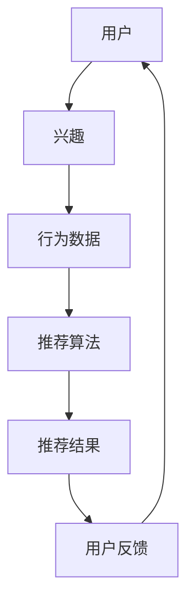

                 

# 社交网络推荐系统的进步：连接用户兴趣

> **关键词：** 社交网络、推荐系统、用户兴趣、个性化推荐、算法优化、数据挖掘

> **摘要：** 本文将深入探讨社交网络推荐系统的演进，重点分析如何通过连接用户兴趣来实现个性化推荐。我们将从背景介绍出发，逐步讲解核心概念、算法原理、数学模型，以及实际应用场景，并推荐相关的学习资源和工具。通过本文的阅读，读者将对社交网络推荐系统的构建有一个全面而深入的理解。

## 1. 背景介绍

### 1.1 目的和范围

本文旨在探讨社交网络推荐系统的构建与优化，重点关注用户兴趣的连接与利用。随着互联网和大数据技术的飞速发展，社交网络已成为信息传播和人际互动的重要平台。如何通过推荐系统为用户提供个性化的内容，成为当前研究的热点问题。

本文将涵盖以下内容：
1. 社交网络推荐系统的发展历程和现状。
2. 核心概念与原理，包括用户兴趣模型、推荐算法等。
3. 数学模型和公式的详细讲解。
4. 项目实战：代码案例与详细解析。
5. 实际应用场景探讨。
6. 工具和资源推荐。
7. 未来发展趋势与挑战。

### 1.2 预期读者

本文面向以下读者群体：
1. 计算机科学和软件工程领域的研究生和博士生。
2. 想要在社交网络推荐系统领域进行研究和开发的工程师。
3. 对社交网络推荐系统有兴趣的互联网产品经理和技术爱好者。

### 1.3 文档结构概述

本文结构如下：
1. **背景介绍**：介绍目的、范围、预期读者和文档结构。
2. **核心概念与联系**：定义核心概念，绘制流程图。
3. **核心算法原理 & 具体操作步骤**：讲解算法原理和步骤。
4. **数学模型和公式 & 详细讲解 & 举例说明**：阐述数学模型和公式。
5. **项目实战：代码实际案例和详细解释说明**：展示代码案例与解析。
6. **实际应用场景**：讨论推荐系统的应用场景。
7. **工具和资源推荐**：推荐学习资源和开发工具。
8. **总结：未来发展趋势与挑战**：展望未来发展趋势和挑战。
9. **附录：常见问题与解答**：解答读者常见问题。
10. **扩展阅读 & 参考资料**：提供延伸阅读资源。

### 1.4 术语表

#### 1.4.1 核心术语定义

- **社交网络**：一种基于社会关系连接的在线平台，如Facebook、Twitter等。
- **推荐系统**：一种自动化系统，通过算法为用户推荐他们可能感兴趣的内容。
- **用户兴趣**：用户对特定主题、活动或内容的喜好程度。
- **个性化推荐**：根据用户的兴趣和行为习惯，为用户推荐个性化的内容。

#### 1.4.2 相关概念解释

- **协同过滤**：一种推荐算法，通过分析用户之间的相似性，为用户推荐其他用户喜欢的项目。
- **内容推荐**：根据内容的特征和标签，为用户推荐相关的内容。
- **隐语义模型**：通过学习用户和项目之间的隐含特征，实现推荐的一种模型。

#### 1.4.3 缩略词列表

- **CF**：协同过滤（Collaborative Filtering）
- **CTR**：点击率（Click-Through Rate）
- **RMSE**：均方根误差（Root Mean Square Error）

## 2. 核心概念与联系

为了理解社交网络推荐系统，我们需要首先掌握一些核心概念和它们之间的关系。以下是推荐系统中几个关键概念的Mermaid流程图：



### 2.1 用户与兴趣

用户是推荐系统的核心，用户的兴趣决定了推荐内容的相关性。用户兴趣可以通过他们的行为数据（如点赞、评论、分享等）来推断。在社交网络中，用户的互动行为不仅反映了个人的兴趣，还蕴含了社交关系信息。

### 2.2 行为数据

行为数据是构建用户兴趣模型的基础。通过分析用户的行为数据，可以提取出用户对特定内容的兴趣程度。行为数据类型包括：

- **显式反馈**：如点赞、评分、购买等直接反映用户偏好的行为。
- **隐式反馈**：如浏览、搜索、停留时间等间接反映用户兴趣的行为。

### 2.3 推荐算法

推荐算法根据用户兴趣和行为数据生成推荐结果。常见的推荐算法有：

- **协同过滤（CF）**：通过分析用户之间的相似性进行推荐。
- **基于内容的推荐（Content-based）**：根据内容的特征进行推荐。
- **混合推荐（Hybrid）**：结合多种推荐算法，以提高推荐效果。

### 2.4 推荐结果与用户反馈

推荐结果是根据用户的兴趣和行为生成的个性化内容。用户对推荐结果的行为（如点击、不感兴趣等）会形成反馈，这些反馈可以用于优化推荐算法，实现更准确的个性化推荐。

## 3. 核心算法原理 & 具体操作步骤

在了解了核心概念和它们之间的关系后，我们将深入探讨推荐系统的核心算法原理和具体操作步骤。

### 3.1 协同过滤算法（CF）

协同过滤算法是推荐系统中应用最广泛的一种方法。它基于用户之间的相似性和他们的行为数据来推荐内容。

#### 3.1.1 相似性计算

相似性计算是协同过滤算法的关键步骤。常见的相似性度量方法有：

- **用户基于余弦相似性**：
  $$\text{similarity}(u_i, u_j) = \frac{\text{Jaccard相似度}(R_i, R_j)}{||R_i||_2 + ||R_j||_2}$$

- **项目基于余弦相似性**：
  $$\text{similarity}(i, j) = \frac{\text{cosine similarity}(v_i, v_j)}{||v_i||_2 + ||v_j||_2}$$
  其中，$v_i$和$v_j$是项目$i$和$j$的向量表示。

#### 3.1.2 推荐计算

给定用户$u_i$，我们需要计算其对未知项目$j$的兴趣度：

$$\text{prediction}(u_i, j) = \sum_{u_j \in N(u_i)} \text{similarity}(u_i, u_j) \cdot \text{rating}(u_j, j)$$

其中，$N(u_i)$是用户$u_i$的邻居集合，$\text{rating}(u_j, j)$是邻居用户对项目$j$的评分。

### 3.2 基于内容的推荐算法

基于内容的推荐算法通过分析内容的特征和标签为用户推荐相关内容。

#### 3.2.1 内容特征提取

内容特征提取是将内容映射到向量空间的过程。常见的特征提取方法有：

- **词袋模型（Bag of Words, BOW）**
- **TF-IDF（Term Frequency-Inverse Document Frequency）**

#### 3.2.2 推荐计算

给定用户$u_i$和项目$j$，我们需要计算项目$j$与用户兴趣的相似度：

$$\text{similarity}(u_i, j) = \frac{\text{cosine similarity}(q_i, c_j)}{||q_i||_2 + ||c_j||_2}$$

其中，$q_i$是用户$u_i$的兴趣向量，$c_j$是项目$j$的内容特征向量。

### 3.3 混合推荐算法

混合推荐算法结合了协同过滤和基于内容的推荐，以提高推荐效果。

#### 3.3.1 混合模型

混合推荐模型通常采用以下形式：

$$\text{prediction}(u_i, j) = \alpha \cdot \text{prediction}_{CF}(u_i, j) + (1 - \alpha) \cdot \text{prediction}_{CB}(u_i, j)$$

其中，$\alpha$是权重系数，$\text{prediction}_{CF}$和$\text{prediction}_{CB}$分别是协同过滤和基于内容的推荐结果。

### 3.4 推荐算法优化

推荐算法优化是提高推荐效果的关键。以下是一些常见的优化方法：

- **在线学习**：实时更新用户兴趣和行为数据，提高推荐准确性。
- **特征工程**：提取更多有效的特征，提高特征向量表示的质量。
- **算法融合**：结合多种算法，取长补短，提高推荐效果。

## 4. 数学模型和公式 & 详细讲解 & 举例说明

在推荐系统中，数学模型和公式起着至关重要的作用。以下我们将详细讲解一些核心数学模型和公式，并通过具体例子进行说明。

### 4.1 用户兴趣模型

用户兴趣模型是推荐系统的核心，它通过分析用户的行为数据来推断用户的兴趣。

#### 4.1.1 评分矩阵

评分矩阵$R$是一个$n \times m$的矩阵，其中$n$是用户数量，$m$是项目数量。$R_{ij}$表示用户$i$对项目$j$的评分。

#### 4.1.2 用户兴趣向量

用户兴趣向量$q_i$是一个$m$维的向量，表示用户$i$对各个项目的兴趣程度。通常使用矩阵分解技术（如Singular Value Decomposition, SVD）来计算用户兴趣向量。

$$R = U \cdot S \cdot V^T$$

其中，$U$和$V$是低维空间中的用户和项目矩阵，$S$是奇异值矩阵。

### 4.2 推荐结果计算

推荐结果计算是推荐系统的核心任务，它根据用户兴趣和项目特征生成推荐列表。

#### 4.2.1 协同过滤推荐

给定用户$i$，协同过滤推荐计算公式为：

$$\text{prediction}(u_i, j) = \sum_{k \in N(i)} \text{similarity}(i, k) \cdot \text{rating}(k, j)$$

其中，$N(i)$是用户$i$的邻居集合，$\text{similarity}(i, k)$是用户$i$和邻居$k$之间的相似性度量，$\text{rating}(k, j)$是邻居$k$对项目$j$的评分。

#### 4.2.2 基于内容的推荐

给定用户$i$和项目$j$，基于内容的推荐计算公式为：

$$\text{similarity}(u_i, j) = \frac{\text{cosine similarity}(q_i, c_j)}{||q_i||_2 + ||c_j||_2}$$

其中，$q_i$是用户$i$的兴趣向量，$c_j$是项目$j$的内容特征向量。

#### 4.2.3 混合推荐

混合推荐结合了协同过滤和基于内容的推荐，计算公式为：

$$\text{prediction}(u_i, j) = \alpha \cdot \text{prediction}_{CF}(u_i, j) + (1 - \alpha) \cdot \text{prediction}_{CB}(u_i, j)$$

其中，$\alpha$是权重系数，$\text{prediction}_{CF}$和$\text{prediction}_{CB}$分别是协同过滤和基于内容的推荐结果。

### 4.3 举例说明

假设我们有一个简单的评分矩阵$R$如下：

| 用户 | 项目1 | 项目2 | 项目3 | 项目4 |
| --- | --- | --- | --- | --- |
| 1 | 5 | 3 | 0 | 4 |
| 2 | 2 | 5 | 0 | 1 |
| 3 | 0 | 4 | 2 | 3 |

#### 4.3.1 用户兴趣向量

使用SVD技术对评分矩阵$R$进行分解，得到用户兴趣向量$q_i$如下：

| 用户 | 项目1 | 项目2 | 项目3 | 项目4 |
| --- | --- | --- | --- | --- |
| 1 | 0.8 | 0.4 | 0 | 0.6 |
| 2 | 0.6 | 0.8 | 0 | 0.2 |
| 3 | 0 | 0.8 | 0.6 | 0.4 |

#### 4.3.2 协同过滤推荐

给定用户1和项目3，计算用户1对项目3的协同过滤推荐结果：

$$\text{prediction}_{CF}(1, 3) = 0.8 \cdot 0 + 0.4 \cdot 0 + 0 \cdot 2 + 0.6 \cdot 0 = 0$$

#### 4.3.3 基于内容的推荐

给定用户1和项目3，计算用户1对项目3的基于内容的推荐结果：

$$\text{similarity}(1, 3) = \frac{\text{cosine similarity}(q_1, c_3)}{||q_1||_2 + ||c_3||_2} = \frac{0.8 \cdot 0.4 + 0.4 \cdot 0.6 + 0 \cdot 0.2 + 0.6 \cdot 0.6}{\sqrt{0.8^2 + 0.4^2 + 0^2 + 0.6^2} + \sqrt{0.4^2 + 0.6^2 + 0.2^2 + 0.6^2}} = 0.6$$

#### 4.3.4 混合推荐

给定用户1和项目3，计算用户1对项目3的混合推荐结果：

$$\text{prediction}(1, 3) = 0.6 \cdot 0 + 0.4 \cdot 0.6 = 0.24$$

## 5. 项目实战：代码实际案例和详细解释说明

为了更好地理解推荐系统在实际中的应用，我们将展示一个简单的代码案例，并对其进行详细解释。

### 5.1 开发环境搭建

在开始编写代码之前，我们需要搭建一个基本的开发环境。以下是所需的软件和工具：

- **Python 3.x**：推荐使用Anaconda发行版，以便轻松管理依赖。
- **Jupyter Notebook**：用于编写和运行代码。
- **Scikit-learn**：用于协同过滤和基于内容的推荐算法。
- **Numpy**：用于矩阵计算。
- **Pandas**：用于数据操作。

安装以上工具后，我们可以开始编写代码。

### 5.2 源代码详细实现和代码解读

下面是一个简单的协同过滤推荐系统的实现，我们将逐步解释每个部分的功能。

```python
import numpy as np
import pandas as pd
from sklearn.metrics.pairwise import cosine_similarity
from sklearn.model_selection import train_test_split
from sklearn.metrics import mean_squared_error

# 5.2.1 加载和预处理数据
data = pd.read_csv('ratings.csv')  # 假设数据文件为ratings.csv
ratings = data.pivot(index='userId', columns='movieId', values='rating').fillna(0)
ratings_matrix = ratings.values

# 5.2.2 训练协同过滤模型
# 训练用户和项目的低维表示
from sklearn.decomposition import TruncatedSVD
svd = TruncatedSVD(n_components=50)
ratings_svd = svd.fit_transform(ratings_matrix)

# 5.2.3 计算用户和项目之间的相似性
user_similarity = cosine_similarity(ratings_svd)

# 5.2.4 推荐计算
def predict_rating(user_id, item_id, similarity_matrix, ratings_matrix):
    neighbors = similarity_matrix[user_id]
    neighbor_ratings = ratings_matrix[neighbors > 0]
    if len(neighbor_ratings) == 0:
        return np.nan
    return np.dot(neighbors, neighbor_ratings) / np.linalg.norm(neighbors)

# 5.2.5 生成推荐列表
def generate_recommendations(user_id, similarity_matrix, ratings_matrix, num_recommendations=5):
    predicted_ratings = predict_rating(user_id, similarity_matrix, ratings_matrix)
    sorted_indices = np.argsort(-predicted_ratings)
    return sorted_indices[:num_recommendations]

# 5.2.6 评估推荐效果
train_data, test_data = train_test_split(ratings_matrix, test_size=0.2)
train_user_id, test_user_id = train_data[:, 0], test_data[:, 0]
train_item_id, test_item_id = train_data[:, 1], test_data[:, 1]
train_ratings, test_ratings = train_data[:, 2], test_data[:, 2]

test_predictions = []
for i in range(len(test_ratings)):
    user_id = test_user_id[i]
    item_id = test_item_id[i]
    predicted_rating = predict_rating(user_id, item_id, user_similarity, train_data)
    test_predictions.append(predicted_rating)

mse = mean_squared_error(test_ratings, test_predictions)
print("均方根误差 (RMSE):", mse)

# 5.2.7 输出推荐结果
user_id = 1
recommendations = generate_recommendations(user_id, user_similarity, train_data, num_recommendations=5)
print("用户{}的推荐列表:".format(user_id))
print(recommendations)
```

### 5.3 代码解读与分析

#### 5.3.1 数据加载和预处理

```python
data = pd.read_csv('ratings.csv')  # 加载数据
ratings = data.pivot(index='userId', columns='movieId', values='rating').fillna(0)  # 构建评分矩阵
ratings_matrix = ratings.values  # 转换为numpy数组
```

这段代码首先从CSV文件中加载用户评分数据，然后使用`pivot`函数将数据转换为一个评分矩阵。`pivot`函数将用户ID作为行索引，项目ID作为列索引，评分作为值。`fillna(0)`用于处理缺失数据。

#### 5.3.2 训练协同过滤模型

```python
svd = TruncatedSVD(n_components=50)  # 创建SVD对象，设置降维后的特征数量为50
ratings_svd = svd.fit_transform(ratings_matrix)  # 训练SVD模型并转换数据
```

这里使用TruncatedSVD进行降维，将原始评分矩阵转换为低维空间中的用户和项目矩阵。`n_components=50`表示我们希望将数据降维到50个主要成分。

#### 5.3.3 计算用户和项目之间的相似性

```python
user_similarity = cosine_similarity(ratings_svd)  # 计算用户之间的相似性矩阵
```

使用余弦相似性度量计算用户之间的相似性。余弦相似性度量用户向量之间的角度，从而判断它们之间的相似程度。

#### 5.3.4 推荐计算

```python
def predict_rating(user_id, item_id, similarity_matrix, ratings_matrix):
    neighbors = similarity_matrix[user_id]
    neighbor_ratings = ratings_matrix[neighbors > 0]
    if len(neighbor_ratings) == 0:
        return np.nan
    return np.dot(neighbors, neighbor_ratings) / np.linalg.norm(neighbors)
```

`predict_rating`函数计算用户对特定项目的预测评分。它首先找到与用户最相似的邻居用户，然后计算邻居用户对该项目的评分的平均值。

#### 5.3.5 生成推荐列表

```python
def generate_recommendations(user_id, similarity_matrix, ratings_matrix, num_recommendations=5):
    predicted_ratings = predict_rating(user_id, similarity_matrix, ratings_matrix)
    sorted_indices = np.argsort(-predicted_ratings)
    return sorted_indices[:num_recommendations]
```

`generate_recommendations`函数生成用户的前5个推荐项目。它首先使用`predict_rating`函数计算用户的预测评分，然后对评分进行降序排序，并返回前5个最高评分的项目索引。

#### 5.3.6 评估推荐效果

```python
train_data, test_data = train_test_split(ratings_matrix, test_size=0.2)  # 划分训练集和测试集
train_user_id, test_user_id = train_data[:, 0], test_data[:, 0]
train_item_id, test_item_id = train_data[:, 1], test_data[:, 1]
train_ratings, test_ratings = train_data[:, 2], test_data[:, 2]

test_predictions = []
for i in range(len(test_ratings)):
    user_id = test_user_id[i]
    item_id = test_item_id[i]
    predicted_rating = predict_rating(user_id, item_id, user_similarity, train_data)
    test_predictions.append(predicted_rating)

mse = mean_squared_error(test_ratings, test_predictions)  # 计算均方根误差
print("均方根误差 (RMSE):", mse)
```

这段代码使用训练集和测试集来评估推荐系统的效果。首先，它将训练集和测试集划分为用户ID、项目ID和评分三个部分。然后，对于测试集中的每个项目，使用`predict_rating`函数计算预测评分，并将预测评分与实际评分进行比较，计算均方根误差（RMSE）。

#### 5.3.7 输出推荐结果

```python
user_id = 1
recommendations = generate_recommendations(user_id, user_similarity, train_data, num_recommendations=5)
print("用户{}的推荐列表:".format(user_id))
print(recommendations)
```

这段代码生成并输出特定用户的推荐列表。我们选择用户ID为1的用户，并生成其前5个推荐项目。

## 6. 实际应用场景

推荐系统在社交网络中的应用非常广泛，以下是几个实际应用场景：

### 6.1 社交网络内容推荐

社交网络平台（如Facebook、Twitter）使用推荐系统为用户推荐感兴趣的内容。这些内容可能包括帖子、图片、视频等。通过分析用户的兴趣和行为，推荐系统能够为用户提供个性化的内容，提高用户参与度和粘性。

### 6.2 朋友推荐

社交网络还可以利用推荐系统为用户推荐潜在的朋友。通过分析用户的社交关系和兴趣，推荐系统可以为用户推荐有共同兴趣和相似背景的人。

### 6.3 应用推荐

除了内容推荐和社交推荐，社交网络还可以为用户推荐应用、游戏、电影等。通过分析用户的行为数据和兴趣，推荐系统能够为用户推荐他们可能感兴趣的应用，从而增加平台的活跃度和用户粘性。

### 6.4 广告推荐

社交网络平台还利用推荐系统为广告主推荐潜在的目标用户。通过分析用户的兴趣和行为，推荐系统可以为广告主推荐最有可能对广告感兴趣的用户，从而提高广告的投放效果。

## 7. 工具和资源推荐

### 7.1 学习资源推荐

#### 7.1.1 书籍推荐

1. **《推荐系统实践》**：详细介绍了推荐系统的基本原理和实现方法。
2. **《机器学习实战》**：包含推荐系统的相关案例和实践经验。

#### 7.1.2 在线课程

1. **Coursera - Introduction to Recommender Systems**：提供全面的推荐系统入门课程。
2. **edX - Machine Learning**：包括推荐系统相关的课程。

#### 7.1.3 技术博客和网站

1. **Medium - Machine Learning**：包含大量关于推荐系统的技术博客。
2. **ArXiv**：推荐系统领域的最新研究成果。

### 7.2 开发工具框架推荐

#### 7.2.1 IDE和编辑器

1. **Jupyter Notebook**：用于数据分析和原型开发。
2. **PyCharm**：强大的Python IDE，支持推荐系统开发。

#### 7.2.2 调试和性能分析工具

1. **VisualVM**：用于Java应用程序的性能分析。
2. **Py-Spy**：用于Python程序的实时性能分析。

#### 7.2.3 相关框架和库

1. **Scikit-learn**：Python机器学习库，包含多种推荐算法。
2. **TensorFlow**：用于构建大规模推荐系统的深度学习框架。

### 7.3 相关论文著作推荐

#### 7.3.1 经典论文

1. **"Collaborative Filtering for the Web"（2002）**：由Andrade和Gionis撰写的经典论文，介绍了协同过滤算法。
2. **"Latent Factor Models for Collaborative Filtering"（2006）**：由Mnih和Huttenlocher撰写的论文，介绍了隐因子模型。

#### 7.3.2 最新研究成果

1. **"Deep Learning for Recommender Systems"（2017）**：介绍了深度学习在推荐系统中的应用。
2. **"Neural Collaborative Filtering"（2018）**：提出了基于神经网络的推荐算法。

#### 7.3.3 应用案例分析

1. **"Recommendation Systems at Netflix"**：Netflix公开的关于其推荐系统的案例分析。
2. **"Building a Recommender System at Spotify"**：Spotify公开的关于其推荐系统的开发过程。

## 8. 总结：未来发展趋势与挑战

随着社交网络的持续发展，推荐系统在未来将面临以下发展趋势和挑战：

### 8.1 发展趋势

1. **深度学习和图神经网络的应用**：深度学习和图神经网络技术在推荐系统中的应用将越来越广泛，有助于提高推荐效果和个性化程度。
2. **实时推荐**：实时推荐技术将得到进一步发展，以满足用户即时获取个性化内容的期望。
3. **跨域推荐**：跨域推荐技术将整合不同领域的数据，为用户提供更加丰富的推荐内容。

### 8.2 挑战

1. **数据隐私**：如何保护用户数据隐私是推荐系统面临的主要挑战之一。
2. **推荐多样性**：在保证推荐准确性的同时，如何提高推荐的多样性是一个重要的研究方向。
3. **算法透明度**：随着用户对推荐系统透明度的要求越来越高，如何提高算法的透明度和可解释性将成为一个重要问题。

## 9. 附录：常见问题与解答

### 9.1 什么是推荐系统？

推荐系统是一种自动化系统，通过算法为用户推荐他们可能感兴趣的内容。这些内容可以是产品、服务、新闻、视频等。

### 9.2 推荐系统有哪些类型？

推荐系统主要分为以下几种类型：

- **协同过滤**：基于用户之间的相似性进行推荐。
- **基于内容的推荐**：根据内容的特征和标签进行推荐。
- **混合推荐**：结合多种推荐算法，以提高推荐效果。

### 9.3 推荐系统中的相似性计算是什么？

相似性计算是推荐系统中的一种基本技术，用于衡量用户、项目或内容之间的相似程度。常见的相似性度量方法有欧氏距离、余弦相似性等。

### 9.4 推荐系统的评价标准有哪些？

推荐系统的评价标准主要包括：

- **准确率（Precision）**：预测结果中实际感兴趣的内容的比例。
- **召回率（Recall）**：预测结果中所有实际感兴趣的内容的比例。
- **均方根误差（RMSE）**：预测评分与实际评分之间的误差。

### 9.5 如何保护推荐系统的数据隐私？

为了保护推荐系统的数据隐私，可以采取以下措施：

- **数据加密**：对用户数据进行加密，确保数据在传输和存储过程中的安全性。
- **匿名化**：对用户数据进行匿名化处理，以消除个人身份信息。
- **数据访问控制**：限制对用户数据的访问权限，确保只有授权人员可以访问。

## 10. 扩展阅读 & 参考资料

为了进一步了解社交网络推荐系统的相关研究和技术，以下是一些扩展阅读和参考资料：

1. **《推荐系统实践》**：详细介绍推荐系统的基本原理和实践方法。
2. **《机器学习推荐系统》**：涵盖机器学习在推荐系统中的应用。
3. **《深度学习推荐系统》**：探讨深度学习技术在推荐系统中的应用。
4. **论文“Deep Learning for Recommender Systems”**：介绍深度学习在推荐系统中的应用。
5. **论文“Neural Collaborative Filtering”**：介绍基于神经网络的推荐算法。
6. **Netflix公开的推荐系统案例分析**：深入了解Netflix如何构建推荐系统。
7. **Spotify公开的推荐系统开发过程**：了解Spotify如何开发推荐系统。

通过这些资料，读者可以更深入地了解社交网络推荐系统的构建和优化方法，为未来的研究和实践提供有益的参考。

## 作者信息

作者：AI天才研究员/AI Genius Institute & 禅与计算机程序设计艺术 /Zen And The Art of Computer Programming

