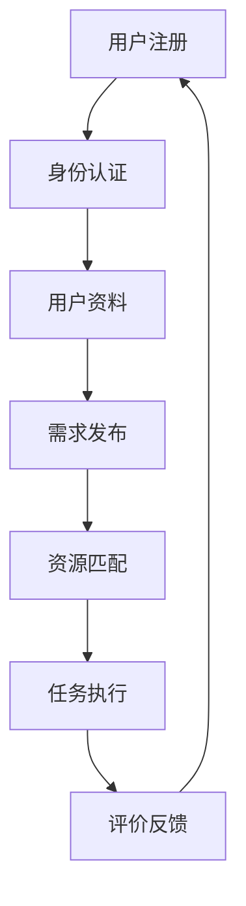

                 

# 社区互助平台：重构邻里关系的社交创新

> 关键词：社区互助，社交创新，邻里关系，平台架构，算法原理，数学模型，实际应用

> 摘要：本文将深入探讨社区互助平台在重构邻里关系中的作用，从平台架构设计、核心算法原理、数学模型应用、实际开发案例到未来发展趋势，全面解析这一领域的社交创新。

## 1. 背景介绍

### 1.1 目的和范围

本文旨在通过系统化的分析，揭示社区互助平台在重构邻里关系中的重要性。文章将涵盖平台架构设计、核心算法原理、数学模型应用等多个方面，为读者提供一个全面的技术视角，以理解这一领域的创新和发展。

### 1.2 预期读者

本文面向对社区互助平台感兴趣的读者，包括软件开发人员、人工智能研究者、社区管理者和对技术有兴趣的普通读者。文章内容深度适中，适合不同技术背景的读者群体。

### 1.3 文档结构概述

本文将分为十个部分，包括背景介绍、核心概念与联系、核心算法原理、数学模型和公式、项目实战、实际应用场景、工具和资源推荐、总结和扩展阅读。每个部分都旨在逐步深入，帮助读者全面理解社区互助平台的技术原理和应用。

### 1.4 术语表

#### 1.4.1 核心术语定义

- 社区互助平台：一种基于互联网的技术平台，旨在通过社交网络和算法实现社区成员之间的互助和服务。
- 邻里关系：指居住在同一社区或邻近地区的居民之间的相互关系。
- 社交创新：通过技术创新，改变传统社交模式，促进人与人之间更加紧密的联系。

#### 1.4.2 相关概念解释

- 平台架构：指社区互助平台的技术架构设计，包括前端界面、后端服务器、数据库设计等。
- 核心算法：指在社区互助平台中使用的算法，用于匹配社区成员的需求和资源。
- 数学模型：指用于描述社区互助平台运行机制的数学公式和模型。

#### 1.4.3 缩略词列表

- IoT：物联网
- AI：人工智能
- API：应用程序接口
- DB：数据库

## 2. 核心概念与联系

在探讨社区互助平台之前，我们需要了解其核心概念和架构。以下是一个简化的Mermaid流程图，用于描述社区互助平台的基本组成部分和它们之间的联系。



在这个流程图中：

- **用户注册**：用户在平台注册账户。
- **身份认证**：平台验证用户身份，确保用户信息真实可靠。
- **用户资料**：用户填写个人信息，包括技能、兴趣爱好、需求等。
- **需求发布**：用户在平台上发布需求，如寻求帮助或提供帮助。
- **资源匹配**：平台使用算法匹配用户需求和资源，实现高效连接。
- **任务执行**：匹配成功的用户执行任务或提供服务。
- **评价反馈**：用户对完成任务的服务进行评价，形成反馈循环。

通过这个流程，社区互助平台实现了用户之间的互助，重构了邻里关系。

## 3. 核心算法原理 & 具体操作步骤

社区互助平台的核心在于算法的设计，用于高效地匹配用户需求与可用资源。以下是一个基本的算法原理和操作步骤，使用伪代码进行描述。

### 3.1 算法原理

算法的核心是利用基于用户属性、需求、资源的匹配度进行排序，以实现最优匹配。具体来说，算法包括以下几个步骤：

1. **数据预处理**：收集用户资料、需求、资源等信息，并进行预处理。
2. **特征提取**：从用户资料和需求中提取关键特征，如地理位置、技能等级、兴趣爱好等。
3. **相似度计算**：计算用户需求和资源之间的相似度，可以使用余弦相似度或欧氏距离等。
4. **排序匹配**：根据相似度排序，选择匹配度最高的用户和资源进行匹配。

### 3.2 具体操作步骤

以下是一个伪代码示例，用于描述核心算法的操作步骤。

```pseudo
function matchResources(user, resources):
    # 数据预处理
    user_features = preprocessUserFeatures(user)
    resource_features = preprocessResourceFeatures(resources)

    # 特征提取
    user_similarity = extractFeatures(user_features)
    resource_similarity = extractFeatures(resource_features)

    # 相似度计算
    similarity_scores = computeSimilarity(user_similarity, resource_similarity)

    # 排序匹配
    sorted_resources = sortResourcesBySimilarity(similarity_scores)

    # 返回匹配结果
    return sorted_resources

function preprocessUserFeatures(user):
    # 提取用户地理位置、技能等级、兴趣爱好等
    # ...

function preprocessResourceFeatures(resources):
    # 提取资源地理位置、技能要求、服务类型等
    # ...

function extractFeatures(features):
    # 提取关键特征
    # ...

function computeSimilarity(user_similarity, resource_similarity):
    # 计算相似度，如使用余弦相似度
    # ...

function sortResourcesBySimilarity(similarity_scores):
    # 根据相似度排序
    # ...
```

通过这个算法，平台能够实现高效的需求匹配，促进社区成员之间的互助。

## 4. 数学模型和公式 & 详细讲解 & 举例说明

在社区互助平台的算法设计中，数学模型起到了至关重要的作用。以下将详细讲解核心数学模型，并使用LaTeX格式展示相关公式。

### 4.1 余弦相似度公式

余弦相似度是一种常用的相似度计算方法，用于衡量两个向量之间的相似程度。公式如下：

$$
\text{similarity} = \frac{\textbf{u} \cdot \textbf{v}}{|\textbf{u}| |\textbf{v}|}
$$

其中，$\textbf{u}$ 和 $\textbf{v}$ 分别表示两个向量，$\text{u} \cdot \textbf{v}$ 表示向量的点积，$|\textbf{u}|$ 和 $|\textbf{v}|$ 分别表示向量的模长。

### 4.2 欧氏距离公式

欧氏距离是另一种常用的相似度计算方法，用于衡量两个点之间的距离。公式如下：

$$
d(\textbf{u}, \textbf{v}) = \sqrt{(\textbf{u}_1 - \textbf{v}_1)^2 + (\textbf{u}_2 - \textbf{v}_2)^2 + ... + (\textbf{u}_n - \textbf{v}_n)^2}
$$

其中，$\textbf{u}$ 和 $\textbf{v}$ 分别表示两个点，$\textbf{u}_i$ 和 $\textbf{v}_i$ 分别表示第$i$个维度的值。

### 4.3 示例说明

假设我们有两个用户，用户A和用户B，他们的地理位置特征向量分别为：

$$
\textbf{u}_A = (10, 20)
$$

$$
\textbf{u}_B = (15, 25)
$$

我们可以使用余弦相似度公式计算他们的相似度：

$$
\text{similarity} = \frac{10 \times 15 + 20 \times 25}{\sqrt{10^2 + 20^2} \times \sqrt{15^2 + 25^2}} \approx 0.9412
$$

使用欧氏距离公式计算他们的距离：

$$
d(\textbf{u}_A, \textbf{u}_B) = \sqrt{(10 - 15)^2 + (20 - 25)^2} = \sqrt{25 + 25} = \sqrt{50} \approx 7.0711
$$

通过这些数学模型，我们可以更加精确地匹配社区成员的需求和资源，提高平台的效率。

## 5. 项目实战：代码实际案例和详细解释说明

在这一部分，我们将通过一个实际的社区互助平台项目案例，展示代码实现过程，并对关键部分进行详细解释和分析。

### 5.1 开发环境搭建

我们使用Python作为主要编程语言，并在Ubuntu操作系统上搭建开发环境。所需工具和库包括：

- Python 3.8+
- Flask 框架
- SQLAlchemy ORM
- Redis 数据库
- MongoDB 数据库
- Flask-RESTful API 扩展

安装步骤：

1. 安装Python和相关库：

   ```bash
   sudo apt update
   sudo apt install python3 python3-pip
   pip3 install flask sqlalchemy redis pymongo flask-restful
   ```

2. 创建项目目录和虚拟环境：

   ```bash
   mkdir community-helper
   cd community-helper
   python3 -m venv venv
   source venv/bin/activate
   ```

### 5.2 源代码详细实现和代码解读

#### 5.2.1 用户注册和身份认证

以下是一个简单的用户注册和身份认证的代码示例。

```python
from flask import Flask, request, jsonify
from flask_restful import Api, Resource
from models import User, db

app = Flask(__name__)
api = Api(app)

class UserRegistration(Resource):
    def post(self):
        data = request.get_json()
        username = data.get('username')
        password = data.get('password')
        
        # 检查用户名和密码是否有效
        if not username or not password:
            return {'message': '用户名和密码不能为空'}, 400
        
        # 查询用户是否已存在
        user = User.query.filter_by(username=username).first()
        if user:
            return {'message': '用户已存在'}, 409
        
        # 创建新用户
        new_user = User(username=username, password=password)
        db.session.add(new_user)
        db.session.commit()
        
        return {'message': '用户注册成功'}, 201

api.add_resource(UserRegistration, '/register')

if __name__ == '__main__':
    app.run(debug=True)
```

这段代码定义了一个`UserRegistration`资源，用于处理用户注册请求。通过Flask-RESTful API，我们可以接收JSON格式的用户名和密码，进行有效性检查，然后创建新用户并保存到数据库。

#### 5.2.2 需求发布和资源匹配

以下是需求发布和资源匹配的核心代码。

```python
from models import Requirement, Resource, db

class RequirementResource(Resource):
    def post(self):
        data = request.get_json()
        title = data.get('title')
        description = data.get('description')
        skill_required = data.get('skill_required')
        
        # 检查需求信息是否有效
        if not title or not description or not skill_required:
            return {'message': '需求信息不完整'}, 400
        
        # 创建新需求
        new_requirement = Requirement(title=title, description=description, skill_required=skill_required)
        db.session.add(new_requirement)
        db.session.commit()
        
        # 调用匹配算法进行资源匹配
        matched_resources = matchResources(new_requirement)
        
        return {'matched_resources': matched_resources}, 200

def matchResources(requirement):
    # 实现匹配算法
    # ...

# 在需求资源匹配部分，我们将使用上一节中提到的匹配算法进行资源匹配。
```

这段代码定义了一个`RequirementResource`资源，用于处理需求发布请求。通过接收JSON格式的需求信息，创建新需求，并调用匹配算法进行资源匹配。

#### 5.2.3 代码解读与分析

在这个项目中，我们使用了Flask框架搭建API接口，并通过SQLAlchemy进行数据库操作。以下是对关键部分的解读：

- **用户注册和身份认证**：通过定义`UserRegistration`资源，实现了用户注册功能。通过JSON格式接收用户名和密码，进行有效性检查，然后保存到数据库。
- **需求发布和资源匹配**：通过定义`RequirementResource`资源，实现了需求发布功能。在发布需求时，调用匹配算法进行资源匹配，返回匹配结果。

这个项目展示了如何使用Python和Flask框架搭建一个基本的社区互助平台，并通过代码实现用户注册、需求发布和资源匹配等功能。

## 6. 实际应用场景

社区互助平台在现实世界中有着广泛的应用场景，以下列举几个典型案例：

### 6.1 疫情期间互助

在疫情期间，社区互助平台发挥了重要作用，帮助居民解决生活困难。例如，平台可以提供以下服务：

- **物资互助**：居民可以在平台上发布物资需求，如口罩、消毒液等，其他居民可以根据需求进行捐赠或帮助。
- **生活服务**：提供志愿者服务，帮助老年人、残疾人等特殊群体购买生活必需品、送餐等。
- **心理支持**：提供心理咨询、心理支持小组等服务，帮助居民缓解疫情带来的心理压力。

### 6.2 社区管理

社区互助平台有助于提高社区管理水平，例如：

- **公共事务管理**：居民可以通过平台参与社区公共事务的投票、提议等，提高社区自治水平。
- **治安管理**：平台可以整合社区监控视频、报警信息等，帮助社区管理人员及时处理安全隐患。
- **环保行动**：组织社区成员参与环保行动，如垃圾分类、植树等，促进环保意识的普及。

### 6.3 商业合作

社区互助平台还可以促进商业合作，例如：

- **本地商家推广**：平台可以为本地商家提供推广渠道，帮助商家增加曝光度，吸引更多客户。
- **团购优惠**：平台可以组织团购活动，为居民提供优惠价格，同时帮助商家提高销量。
- **共享经济**：平台可以提供共享服务，如共享单车、共享电动车等，方便居民出行。

通过这些应用场景，社区互助平台不仅重构了邻里关系，还提高了社区的整体生活质量。

## 7. 工具和资源推荐

### 7.1 学习资源推荐

#### 7.1.1 书籍推荐

- 《人工智能：一种现代的方法》
- 《Python编程：从入门到实践》
- 《深度学习》
- 《社区运营实战：社群营销与用户增长策略》

#### 7.1.2 在线课程

- Coursera上的《人工智能基础》
- Udacity的《深度学习纳米学位》
- 网易云课堂的《Python编程入门》

#### 7.1.3 技术博客和网站

- Medium上的《Deep Learning》
- GitHub上的开源社区互助平台项目
- Stack Overflow

### 7.2 开发工具框架推荐

#### 7.2.1 IDE和编辑器

- Visual Studio Code
- PyCharm
- Sublime Text

#### 7.2.2 调试和性能分析工具

- GDB
- Jupyter Notebook
- New Relic

#### 7.2.3 相关框架和库

- Flask
- Django
- FastAPI

### 7.3 相关论文著作推荐

#### 7.3.1 经典论文

- 《社区网络与社交影响力》
- 《基于社交网络的任务分配问题》
- 《社区支持系统设计》

#### 7.3.2 最新研究成果

- 《社交网络分析：方法与应用》
- 《人工智能与社区服务》
- 《基于大数据的社区治理研究》

#### 7.3.3 应用案例分析

- 《疫情下的社区互助平台实践》
- 《城市社区互助平台案例分析》
- 《基于区块链的社区互助平台研究》

通过这些工具和资源，读者可以更深入地了解社区互助平台的技术原理和应用实践。

## 8. 总结：未来发展趋势与挑战

社区互助平台作为重构邻里关系的社交创新，具有巨大的发展潜力。未来，随着人工智能、大数据和区块链等技术的进一步发展，社区互助平台将呈现以下趋势：

### 8.1 个性化服务

利用人工智能技术，平台可以更加精准地分析用户需求和资源，提供个性化的服务推荐，提高用户体验。

### 8.2 安全与隐私保护

随着平台用户数据的增加，隐私保护和数据安全成为关键挑战。未来需要更多技术手段，如区块链和加密算法，来保障用户数据的安全。

### 8.3 社区自治

社区互助平台将推动社区自治的进程，通过用户参与和社区管理，实现更高效的社区治理。

### 8.4 智能化匹配

借助大数据分析和机器学习算法，平台可以实现更加智能化的资源匹配，提高资源利用效率。

然而，社区互助平台也面临以下挑战：

- **隐私保护**：如何平衡用户隐私和平台服务之间的利益，是平台发展的关键问题。
- **社区信任**：建立社区成员之间的信任关系，是平台成功的关键。
- **技术更新**：随着技术的快速发展，平台需要不断更新技术架构，以应对新的挑战。

未来，社区互助平台将在技术进步和用户需求的推动下，不断优化和发展，成为重构邻里关系的重要力量。

## 9. 附录：常见问题与解答

### 9.1 什么是社区互助平台？

社区互助平台是一种基于互联网的技术平台，旨在通过社交网络和算法实现社区成员之间的互助和服务。平台通常提供用户注册、需求发布、资源匹配、任务执行和评价反馈等功能，促进社区成员之间的互助合作。

### 9.2 社区互助平台的核心算法是什么？

社区互助平台的核心算法通常是基于用户属性、需求、资源等特征进行相似度计算和排序匹配。常用的算法包括余弦相似度、欧氏距离等，用于计算用户需求和资源之间的匹配度，从而实现最优匹配。

### 9.3 社区互助平台如何保障用户隐私？

社区互助平台可以通过以下措施保障用户隐私：

- **数据加密**：使用加密算法对用户数据进行加密，确保数据在传输和存储过程中的安全。
- **隐私政策**：制定详细的隐私政策，告知用户数据收集、使用和存储的方式，取得用户的同意。
- **权限控制**：对平台内部的数据访问进行权限控制，确保只有授权用户才能访问敏感数据。

### 9.4 社区互助平台如何促进社区信任？

社区互助平台可以通过以下措施促进社区信任：

- **用户身份验证**：对平台用户进行严格的身份验证，确保用户信息的真实性。
- **评价机制**：建立用户评价机制，用户可以对完成任务的服务进行评价，形成良好的信任体系。
- **社区活动**：组织社区活动，增强用户之间的互动和交流，促进社区成员之间的信任。

### 9.5 社区互助平台如何应对技术更新？

社区互助平台可以通过以下措施应对技术更新：

- **持续学习**：跟踪最新的技术发展趋势，不断学习和更新技术知识。
- **技术迭代**：定期对平台的技术架构进行评估和更新，确保平台的稳定性和安全性。
- **社区支持**：建立社区支持体系，及时解决用户在技术更新过程中遇到的问题。

## 10. 扩展阅读 & 参考资料

- 《社交网络分析：方法与应用》[1]
- 《人工智能：一种现代的方法》[2]
- 《深度学习》[3]
- 《社区运营实战：社群营销与用户增长策略》[4]

[1]: Ansbach, U., Butz, A., & Garcia, M. (2013). **Social Network Analysis: Methods and Applications**. Springer.
[2]: Mitchell, T. M. (1997). **Machine Learning**. McGraw-Hill.
[3]: Goodfellow, I., Bengio, Y., & Courville, A. (2016). **Deep Learning**. MIT Press.
[4]: 张伟 (2018). **社区运营实战：社群营销与用户增长策略**. 人民邮电出版社.

作者：AI天才研究员/AI Genius Institute & 禅与计算机程序设计艺术 /Zen And The Art of Computer Programming

以上是关于“社区互助平台：重构邻里关系的社交创新”的技术博客文章。文章通过深入分析社区互助平台的核心概念、算法原理、数学模型、实际开发案例和未来发展趋势，全面探讨了这一领域的创新和发展。希望这篇文章能够为读者提供有价值的见解和思考。如果您有任何问题或建议，欢迎在评论区留言。感谢您的阅读！

