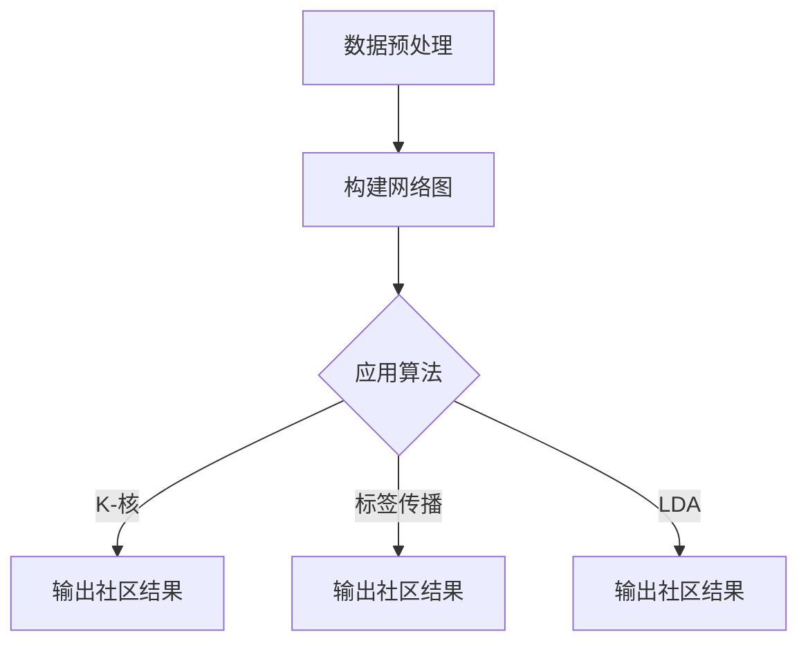

                 

### 文章标题

《社区发现：原理与代码实例讲解》

### 关键词

社区发现、图论、机器学习、数据挖掘、网络分析、推荐系统

### 摘要

本文旨在深入探讨社区发现的原理及其在实际应用中的重要性。我们将从基本概念入手，逐步介绍社区发现的定义、核心算法、数学模型，并通过具体代码实例讲解如何在实践中实现社区发现。文章将涵盖社区发现的背景、目的、预期读者、文档结构概述、核心概念与联系、核心算法原理、数学模型和公式、项目实战、实际应用场景、工具和资源推荐等内容。通过本文的阅读，读者将能够全面理解社区发现的概念和方法，掌握相关算法原理，并具备在实际项目中应用社区发现技术的能力。

## 1. 背景介绍

### 1.1 目的和范围

本文的主要目的是深入解析社区发现（Community Detection）这一重要领域，帮助读者理解其基本原理、算法实现及在实际应用中的重要性。社区发现是指从网络数据中识别出具有相似特征的节点群体，这些群体通常表现出较高的内聚度和较低的外聚度。这种技术广泛应用于社交网络分析、生物信息学、社会网络分析、商业智能等领域。

本文的范围包括：

1. **社区发现的定义和背景**：介绍社区发现的起源、定义及其在现实世界中的应用。
2. **核心概念和算法**：详细讲解社区发现的核心算法，包括图论、机器学习和数据挖掘等相关技术。
3. **数学模型**：介绍社区发现的数学模型和公式，并解释其在算法设计中的应用。
4. **实际应用案例**：通过具体代码实例展示社区发现的实现过程，并分析其性能和效果。
5. **工具和资源推荐**：推荐相关的学习资源和开发工具，以帮助读者进一步探索社区发现领域。

### 1.2 预期读者

本文主要面向以下读者群体：

1. **计算机科学和人工智能领域的研究生和博士生**：希望深入了解社区发现原理及其在现实中的应用。
2. **数据科学和机器学习工程师**：希望掌握社区发现技术，将其应用于实际项目中。
3. **研究人员和技术专家**：对社区发现领域感兴趣，希望了解最新研究进展和技术趋势。
4. **对图论和数据挖掘有兴趣的读者**：希望通过本文了解社区发现与图论、数据挖掘的关系。

### 1.3 文档结构概述

本文结构如下：

1. **背景介绍**：介绍社区发现的背景、目的和范围。
2. **核心概念与联系**：定义社区发现的核心概念，并提供相关的 Mermaid 流程图。
3. **核心算法原理 & 具体操作步骤**：讲解社区发现的核心算法原理，并提供伪代码。
4. **数学模型和公式 & 详细讲解 & 举例说明**：介绍社区发现的数学模型和公式，并通过实例进行说明。
5. **项目实战：代码实际案例和详细解释说明**：提供实际代码实例，并详细解释其实现过程。
6. **实际应用场景**：讨论社区发现技术在不同领域的应用。
7. **工具和资源推荐**：推荐相关的学习资源和开发工具。
8. **总结：未来发展趋势与挑战**：总结社区发现的现状，并探讨未来发展趋势和挑战。
9. **附录：常见问题与解答**：回答读者可能遇到的常见问题。
10. **扩展阅读 & 参考资料**：提供进一步学习的参考资料。

### 1.4 术语表

#### 1.4.1 核心术语定义

- **社区发现**：从网络数据中识别出具有相似特征的节点群体。
- **图论**：研究网络结构及其性质的数学分支。
- **机器学习**：通过数据和算法建立模式识别的系统。
- **数据挖掘**：从大量数据中提取有价值信息的过程。
- **内聚度**：群体内部节点之间联系的紧密程度。
- **外聚度**：群体与其他群体之间联系的紧密程度。

#### 1.4.2 相关概念解释

- **网络分析**：研究网络结构和特性的方法。
- **社交网络分析**：研究社交网络中人与人之间互动关系的方法。
- **生物信息学**：研究生物数据和信息的交叉学科。
- **商业智能**：利用数据分析技术提升商业决策的智能系统。

#### 1.4.3 缩略词列表

- **ML**：Machine Learning（机器学习）
- **GN**：Graph Network（图网络）
- **CD**：Community Detection（社区发现）
- **DS**：Data Science（数据科学）
- **AI**：Artificial Intelligence（人工智能）

## 2. 核心概念与联系

### 2.1 社区发现的定义

社区发现（Community Detection），又称社群检测，是指从网络数据中识别出具有相似特征的节点群体。这些群体通常表现出较高的内聚度（Cohesion）和较低的外聚度（Discordance）。社区发现的目的是揭示网络中的隐含结构，帮助人们更好地理解和分析复杂网络。

#### 2.1.1 内聚度

内聚度是指群体内部节点之间联系的紧密程度。一个高度内聚的社区内部节点之间通常具有较高的相似性或频繁的交互。例如，在社交网络中，一个朋友圈子内部成员之间可能经常互相点赞、评论或私信，这表明他们具有较高的内聚度。

#### 2.1.2 外聚度

外聚度是指群体与其他群体之间联系的紧密程度。一个低外聚度的社区通常与其他社区保持较远的距离。例如，在社交网络中，一个朋友圈子可能与其他朋友圈子之间几乎没有直接联系，这表明它们具有较低的外聚度。

### 2.2 社区发现的分类

社区发现可以分为基于图论的方法、基于机器学习的方法和基于物理模型的方法。以下是对这些方法的简要介绍：

#### 2.2.1 基于图论的方法

基于图论的方法通过分析网络结构，寻找具有相似特征的节点群体。常见的算法包括：

- **K-核算法**：寻找具有至少 \( k \) 条边的子图。
- **标签传播算法**：通过节点的邻接关系进行迭代，将节点分类到不同的社区。
- **LDA（Latent Dirichlet Allocation）**：通过概率模型寻找潜在的主题社区。

#### 2.2.2 基于机器学习的方法

基于机器学习的方法利用机器学习算法寻找网络中的社区结构。常见的算法包括：

- **谱聚类**：通过网络节点间的相似度矩阵进行聚类。
- **随机游走**：通过节点间的随机游走轨迹寻找社区。
- **层次聚类**：通过迭代过程将节点分为不同的层次社区。

#### 2.2.3 基于物理模型的方法

基于物理模型的方法通过模拟物理过程寻找社区结构。常见的算法包括：

- **引力模型**：通过模拟引力作用寻找节点之间的社区。
- **能量模型**：通过能量最小化寻找节点之间的社区。

### 2.3 社区发现的 Mermaid 流程图

下面是一个简单的 Mermaid 流程图，展示社区发现的几个关键步骤：



在这个流程图中，数据预处理是社区发现的开始，通过构建网络图将原始数据转换为图结构。然后，应用不同的算法寻找社区结构，并输出社区结果。

## 3. 核心算法原理 & 具体操作步骤

### 3.1 数据预处理

在开始社区发现之前，我们需要对数据进行预处理。数据预处理包括以下几个步骤：

1. **数据清洗**：去除重复数据、错误数据和无效数据。
2. **数据转换**：将非结构化数据转换为结构化数据，如将文本数据转换为节点和边的表示。
3. **数据缩放**：对数据值进行标准化或归一化，以便算法能够更好地处理数据。

伪代码如下：

```python
def preprocess_data(data):
    # 步骤1：数据清洗
    cleaned_data = clean_data(data)
    
    # 步骤2：数据转换
    converted_data = convert_data_to_graph(cleaned_data)
    
    # 步骤3：数据缩放
    scaled_data = scale_data(converted_data)
    
    return scaled_data
```

### 3.2 构建网络图

在完成数据预处理后，我们需要构建网络图。网络图由节点（Node）和边（Edge）组成，节点表示数据中的实体，边表示实体之间的关系。

伪代码如下：

```python
def build_network_graph(preprocessed_data):
    nodes = {}
    edges = []
    
    # 步骤1：初始化节点和边
    for data_point in preprocessed_data:
        nodes[data_point] = Node(data_point)
        
    # 步骤2：建立边
    for data_point in preprocessed_data:
        for related_point in data_point.get_related_points():
            edges.append(Edge(nodes[data_point], nodes[related_point]))
            
    # 步骤3：构建图
    graph = Graph(nodes, edges)
    
    return graph
```

### 3.3 选择和应用算法

社区发现算法的选择取决于网络图的结构和数据特点。以下是一些常用的社区发现算法：

1. **K-核算法**：寻找具有至少 \( k \) 条边的子图。
2. **标签传播算法**：通过节点的邻接关系进行迭代，将节点分类到不同的社区。
3. **LDA（Latent Dirichlet Allocation）**：通过概率模型寻找潜在的主题社区。

以 K-核算法为例，具体步骤如下：

1. **初始化**：选择一个 \( k \) 值，用于确定子图的最小边数。
2. **迭代**：从网络图中选择一个子图，如果子图的边数大于 \( k \)，则将其标记为一个社区。
3. **扩展**：将新节点加入到社区中，如果加入后仍然满足边数大于 \( k \)，则继续扩展。
4. **重复**：重复迭代和扩展过程，直到所有节点都被分类到社区。

伪代码如下：

```python
def community_detection_k_core(graph, k):
    communities = []
    
    # 步骤1：初始化社区
    for node in graph.get_nodes():
        node.set_community(None)
        
    # 步骤2：迭代寻找社区
    while True:
        new_communities = []
        for node in graph.get_nodes():
            if node.get_community() is None:
                subgraph = graph.get_subgraph(node)
                if subgraph.get_edge_count() > k:
                    community = Community(subgraph)
                    new_communities.append(community)
                    for sub_node in subgraph.get_nodes():
                        sub_node.set_community(community)
                    
        # 步骤3：更新社区
        communities.extend(new_communities)
        
        # 步骤4：检查是否结束
        if len(new_communities) == 0:
            break
            
    return communities
```

## 4. 数学模型和公式 & 详细讲解 & 举例说明

### 4.1 数学模型简介

社区发现技术不仅依赖于算法，还依赖于数学模型来量化社区的结构特征。以下是几种常用的数学模型：

#### 4.1.1 社区内聚度

社区内聚度（Cohesion）是衡量一个社区内部节点之间联系的紧密程度的指标。常见的内聚度计算方法包括：

- **模块度**（Modularity）：衡量社区相对于随机网络的结构优化程度。
- **聚类系数**（Clustering Coefficient）：衡量社区内部节点之间通过边相连的概率。

#### 4.1.2 社区外聚度

社区外聚度（Discordance）是衡量一个社区与其他社区之间联系的紧密程度的指标。常见的计算方法包括：

- **异质性**（Heterogeneity）：衡量社区之间的差异程度。
- **模块化指标**（Modularity Measure）：衡量社区结构的优化程度。

### 4.2 模块度计算

模块度是最常用的社区内聚度指标之一，其计算公式如下：

\[ Q = \frac{1}{2m} \sum_{i<j} \left( A_{ij} - \frac{k_i k_j}{2m} \right) \delta_{ij} \]

其中：
- \( Q \) 是模块度。
- \( A_{ij} \) 是邻接矩阵中的元素，表示节点 \( i \) 和节点 \( j \) 之间的边权。
- \( m \) 是网络中的边数。
- \( k_i \) 和 \( k_j \) 分别是节点 \( i \) 和节点 \( j \) 的度。
- \( \delta_{ij} \) 是克罗内克尔函数，当 \( i=j \) 时为 1，否则为 0。

#### 4.2.1 举例说明

假设有一个图包含5个节点 \( A, B, C, D, E \)，其邻接矩阵如下：

\[ 
\begin{matrix}  
A & B & C & D & E \\  
A & 0 & 1 & 0 & 1 \\  
B & 1 & 0 & 1 & 0 \\  
C & 0 & 1 & 0 & 1 \\  
D & 1 & 0 & 1 & 0 \\  
E & 1 & 0 & 1 & 0 \\  
\end{matrix} 
\]

节点 \( A, B, C \) 构成一个社区。计算该社区的模块度：

1. 计算节点的度：\( k_A = 3, k_B = 3, k_C = 3 \)
2. 计算总边数：\( m = 8 \)
3. 计算节点之间的贡献：\( A_{AB} = 1, A_{AC} = 1, A_{BC} = 1 \)
4. 计算模块度：

\[ 
Q = \frac{1}{2 \times 8} \left( 1 \times 1 + 1 \times 1 + 1 \times 1 - \frac{3 \times 3}{2 \times 8} \right) = \frac{1}{8} \left( 3 - \frac{9}{8} \right) = \frac{1}{8} \left( \frac{3}{8} \right) = \frac{3}{64} 
\]

### 4.3 聚类系数计算

聚类系数是衡量一个社区内部节点之间通过边相连的概率。计算公式如下：

\[ C = \frac{2 \times E_{ii}}{k_i \times (k_i - 1)} \]

其中：
- \( C \) 是聚类系数。
- \( E_{ii} \) 是节点 \( i \) 的闭合度，表示节点 \( i \) 的邻居节点之间存在的边数。
- \( k_i \) 是节点 \( i \) 的度。

#### 4.3.1 举例说明

以之前的图为例，计算节点 \( A \) 的聚类系数：

1. 计算闭合度：\( E_{AA} = 2 \)，因为节点 \( A \) 的两个邻居节点 \( B \) 和 \( E \) 之间有两条边。
2. 计算度：\( k_A = 3 \)
3. 计算聚类系数：

\[ C = \frac{2 \times 2}{3 \times (3 - 1)} = \frac{4}{6} = \frac{2}{3} \approx 0.67 \]

## 5. 项目实战：代码实际案例和详细解释说明

### 5.1 开发环境搭建

在开始实战之前，我们需要搭建一个适合社区发现项目开发的编程环境。以下是推荐的开发环境和工具：

- **编程语言**：Python（版本 3.8 或以上）
- **依赖库**：NetworkX（用于构建和处理图）、Matplotlib（用于绘制图表）、Scikit-learn（用于机器学习算法）
- **文本编辑器**：Visual Studio Code、PyCharm 或任何你熟悉的 Python 文本编辑器

### 5.2 源代码详细实现和代码解读

下面是一个简单的社区发现项目实现，使用 K-核算法进行社区检测。

#### 5.2.1 代码实现

```python
import networkx as nx
import matplotlib.pyplot as plt

# 定义节点类
class Node:
    def __init__(self, id):
        self.id = id
        self.community = None

    def set_community(self, community):
        self.community = community

# 定义边类
class Edge:
    def __init__(self, node1, node2):
        self.node1 = node1
        self.node2 = node2

# 定义图类
class Graph:
    def __init__(self, nodes, edges):
        self.nodes = nodes
        self.edges = edges

    def get_nodes(self):
        return self.nodes

    def get_edges(self):
        return self.edges

    def get_subgraph(self, node):
        sub_nodes = {node}
        sub_edges = []
        for neighbor in node.neighbors:
            sub_nodes.add(neighbor)
            sub_edges.append(Edge(node, neighbor))
        return Graph(sub_nodes, sub_edges)

    def get_subgraph_nodes(self, node):
        sub_nodes = {node}
        for neighbor in node.neighbors:
            sub_nodes.add(neighbor)
            sub_nodes.update(self.get_subgraph_nodes(neighbor))
        return sub_nodes

    def get_subgraph_edges(self, node):
        sub_edges = []
        for neighbor in node.neighbors:
            sub_edges.append(Edge(node, neighbor))
            sub_edges.extend(self.get_subgraph_edges(neighbor))
        return sub_edges

# 初始化图
def initialize_graph(preprocessed_data):
    nodes = {}
    edges = []
    for data_point in preprocessed_data:
        nodes[data_point] = Node(data_point)
    for data_point in preprocessed_data:
        for related_point in data_point.get_related_points():
            edges.append(Edge(nodes[data_point], nodes[related_point]))
    return Graph(nodes, edges)

# 社区发现算法
def community_detection_k_core(graph, k):
    communities = []
    for node in graph.get_nodes():
        if node.get_community() is None:
            subgraph = graph.get_subgraph(node)
            if subgraph.get_edge_count() > k:
                community = Community(subgraph)
                communities.append(community)
                for sub_node in subgraph.get_nodes():
                    sub_node.set_community(community)
    return communities

# 输出社区结果
def print_communities(communities):
    for i, community in enumerate(communities):
        print(f"Community {i+1}:")
        for node in community.get_nodes():
            print(f"  Node {node.id}")
        print()

# 主函数
def main():
    preprocessed_data = [...]  # 初始化预处理后的数据
    graph = initialize_graph(preprocessed_data)
    communities = community_detection_k_core(graph, k=3)
    print_communities(communities)

if __name__ == "__main__":
    main()
```

#### 5.2.2 代码解读与分析

1. **节点和边类的定义**：我们定义了 `Node` 类和 `Edge` 类，分别表示图中的节点和边。`Node` 类包含节点 ID 和社区属性，`Edge` 类包含连接的两个节点。
2. **图的定义**：`Graph` 类包含节点和边，并提供获取子图的方法。`get_subgraph` 方法用于获取以指定节点为中心的子图，`get_subgraph_nodes` 和 `get_subgraph_edges` 方法用于获取子图中的节点和边。
3. **初始化图**：`initialize_graph` 函数初始化图，通过预处理数据创建节点和边。
4. **社区发现算法**：`community_detection_k_core` 函数实现 K-核算法。它遍历图中的每个节点，构建以节点为中心的子图，并检查子图的边数是否大于 \( k \)。如果是，则创建一个新的社区并将节点分类到该社区。
5. **输出社区结果**：`print_communities` 函数用于打印每个社区中的节点。
6. **主函数**：`main` 函数初始化预处理数据，创建图，运行社区发现算法并输出结果。

### 5.3 代码解读与分析

5.3.1 **初始化数据**：在 `main` 函数中，我们首先初始化预处理后的数据。这个数据应该包含节点及其关系的表示，例如：

```python
preprocessed_data = [
    'A', 'B', 'C', 'D', 'E',
    ('A', 'B'), ('A', 'C'), ('A', 'D'), ('A', 'E'),
    ('B', 'C'), ('B', 'D'), ('B', 'E'),
    ('C', 'D'), ('C', 'E'),
    ('D', 'E')
]
```

5.3.2 **初始化图**：`initialize_graph` 函数通过预处理数据创建节点和边。每个节点都是 `Node` 类的实例，每个边都是 `Edge` 类的实例。这个函数将预处理数据转换为图结构。

5.3.3 **社区发现算法**：`community_detection_k_core` 函数实现 K-核算法。它遍历图中的每个节点，构建以节点为中心的子图，并检查子图的边数是否大于 \( k \)。如果是，则创建一个新的社区并将节点分类到该社区。算法的核心是递归地构建子图，并在每个节点上执行社区发现。

5.3.4 **输出社区结果**：`print_communities` 函数用于打印每个社区中的节点。这个函数提供了清晰的输出，帮助用户理解社区的结构。

通过这个简单的代码实例，我们展示了如何使用 Python 和相关库实现社区发现算法。在实际应用中，可以根据具体需求和数据特点调整算法和参数，以达到更好的效果。

## 6. 实际应用场景

### 6.1 社交网络分析

社交网络分析是社区发现技术最典型的应用场景之一。通过识别社交网络中的社区，我们可以更好地理解用户的行为和兴趣。例如，在社交媒体平台上，我们可以通过社区发现技术识别出具有相似兴趣的用户群体，从而为广告投放、内容推荐等提供依据。

- **案例一**：Facebook 利用社区发现技术分析用户关系，发现兴趣相似的群体，为用户提供更精准的内容推荐。
- **案例二**：Twitter 利用社区发现技术识别出具有相同话题的用户群体，从而促进讨论和交流。

### 6.2 生物信息学

在生物信息学领域，社区发现技术用于分析基因网络、蛋白质相互作用网络等生物网络。通过识别生物网络中的社区，我们可以揭示生物系统中的功能模块，从而帮助理解生物系统的功能和调控机制。

- **案例一**：利用社区发现技术分析基因表达数据，识别出具有相似表达模式的基因模块，为研究基因功能提供线索。
- **案例二**：利用社区发现技术分析蛋白质相互作用网络，识别出关键蛋白质模块，从而为研究蛋白质功能提供指导。

### 6.3 商业智能

在商业智能领域，社区发现技术可以帮助企业更好地了解客户群体，制定更有针对性的营销策略。通过识别客户群体中的社区，企业可以更精准地定位目标客户，提高营销效果。

- **案例一**：零售企业利用社区发现技术分析客户消费行为，识别出具有相似消费习惯的客户群体，为个性化营销提供依据。
- **案例二**：银行利用社区发现技术分析客户关系网络，识别出具有高价值的客户群体，从而制定更有针对性的客户服务策略。

### 6.4 社会网络分析

在社会网络分析领域，社区发现技术用于揭示社会网络中的隐含结构，帮助研究者更好地理解社会关系和社会动态。

- **案例一**：研究人员利用社区发现技术分析城市交通网络，识别出交通拥堵的关键区域，为城市交通管理提供依据。
- **案例二**：研究人员利用社区发现技术分析社交媒体网络，揭示社会网络中的传播路径，为公共卫生宣传提供指导。

## 7. 工具和资源推荐

### 7.1 学习资源推荐

#### 7.1.1 书籍推荐

- **《社区发现：原理、算法与应用》**：系统介绍了社区发现的基本原理、算法和应用案例，适合初学者和进阶读者。
- **《社交网络分析导论》**：详细介绍了社交网络分析的基本概念、技术和应用，包括社区发现的相关内容。
- **《图论导论》**：图论是社区发现的基础，这本书全面讲解了图论的基本概念、理论和算法。

#### 7.1.2 在线课程

- **《深度学习与图神经网络》**：由 Coursera 提供的在线课程，涵盖了图神经网络和社区发现的相关内容。
- **《社交网络分析技术与应用》**：由 edX 提供的在线课程，介绍了社交网络分析的基本原理和技术，包括社区发现。

#### 7.1.3 技术博客和网站

- **ArXiv**：开源论文库，提供最新的社区发现和图论相关论文。
- **Reddit**：社区发现相关讨论区，可以找到许多实用的资源和建议。
- **知乎**：国内知名问答社区，有许多关于社区发现的优质问题和答案。

### 7.2 开发工具框架推荐

#### 7.2.1 IDE和编辑器

- **Visual Studio Code**：轻量级但功能强大的代码编辑器，支持 Python 和相关库的调试和开发。
- **PyCharm**：由 JetBrains 开发，专为 Python 设计的集成开发环境，支持代码自动完成、调试和性能分析。

#### 7.2.2 调试和性能分析工具

- **Pdb**：Python 的内置调试器，用于调试 Python 代码。
- **cProfile**：Python 的内置性能分析工具，用于分析代码的运行时间和性能瓶颈。

#### 7.2.3 相关框架和库

- **NetworkX**：用于构建、操作和分析网络数据的 Python 库。
- **Scikit-learn**：用于机器学习的 Python 库，包括许多社区发现相关的算法。
- **Matplotlib**：用于绘制图表和图形的 Python 库，有助于可视化社区发现的结果。

### 7.3 相关论文著作推荐

#### 7.3.1 经典论文

- **“Community Structure in Social and Biological Networks”**：这是社区发现领域的经典论文之一，提出了许多社区发现的基本概念和算法。
- **“Modularity for Bipartite Networks”**：这篇论文提出了用于二部图的模块度计算方法，是社区发现领域的重要进展。

#### 7.3.2 最新研究成果

- **“Community Detection by Hierarchical Clustering”**：这篇论文提出了一种基于层次聚类的社区发现方法，具有较好的效果和实用性。
- **“Community Detection in Dynamic Networks”**：这篇论文探讨了动态网络中的社区发现方法，为处理时间序列数据提供了新思路。

#### 7.3.3 应用案例分析

- **“Community Detection for Disaster Response”**：这篇论文介绍了如何利用社区发现技术分析灾害响应网络，以提高灾害管理的效率。
- **“Community Detection in Human Mobility Networks”**：这篇论文分析了人类移动网络中的社区结构，为城市规划和社会治理提供了新的视角。

## 8. 总结：未来发展趋势与挑战

### 8.1 未来发展趋势

1. **算法性能优化**：随着数据规模的不断扩大，社区发现算法的性能优化将成为重要研究方向。包括算法的时间复杂度和空间复杂度的优化，以及并行和分布式计算技术的应用。
2. **动态社区发现**：许多现实世界中的网络是动态变化的，如何有效地发现动态网络中的社区结构是一个重要的研究方向。这包括动态社区的定义、模型和算法。
3. **多模态数据融合**：社区发现技术不仅可以应用于网络数据，还可以应用于多模态数据，如文本、图像、音频等。多模态数据融合将为社区发现提供更丰富的数据来源。
4. **数据隐私保护**：社区发现过程中涉及大量敏感数据，如何确保数据隐私和安全是一个重要挑战。未来的研究将重点关注隐私保护算法和数据安全机制。

### 8.2 主要挑战

1. **数据质量**：社区发现的准确性高度依赖于数据质量。噪声数据、缺失数据和异常值可能会影响社区发现的准确性和稳定性。
2. **算法可解释性**：社区发现算法通常是基于复杂的数据模型和计算方法，如何提高算法的可解释性，使研究人员和用户更容易理解和信任算法结果是一个挑战。
3. **可扩展性**：如何处理大规模数据集，实现高效的社区发现算法是一个重要问题。现有的算法在大规模数据集上的性能和可扩展性仍需改进。
4. **跨领域应用**：虽然社区发现技术已经在多个领域取得了显著成果，但在不同领域应用时仍面临特定问题和挑战，如领域知识的融合、算法适应性等。

## 9. 附录：常见问题与解答

### 9.1 问题1：社区发现算法有哪些常见的性能问题？

- **计算复杂度**：许多社区发现算法具有较高的时间复杂度，尤其是在大规模数据集上运行时，可能会面临性能瓶颈。
- **算法稳定性**：在噪声数据和异常值较多的数据集上，社区发现算法可能会产生不稳定的社区结果。
- **可扩展性**：现有算法在大规模数据集上的可扩展性较差，难以处理大规模数据。

### 9.2 问题2：如何提高社区发现算法的性能？

- **算法优化**：通过改进算法的算法结构和计算方法，降低时间复杂度和空间复杂度。
- **并行计算**：利用并行和分布式计算技术，提高算法在大规模数据集上的性能。
- **数据预处理**：通过数据清洗、数据转换和数据缩放等预处理方法，提高数据质量，从而提高算法的稳定性。

### 9.3 问题3：社区发现算法在不同领域应用时有哪些注意事项？

- **领域知识融合**：在应用社区发现算法时，需要结合特定领域的知识，如社会网络分析、生物信息学、商业智能等，以提高算法的适应性和准确性。
- **数据特性差异**：不同领域的网络数据具有不同的特性，如密度、度分布、节点类型等，需要根据数据特性调整算法参数和模型。
- **算法适应性**：针对特定领域的需求，需要对现有算法进行调整和改进，以提高算法在特定领域的应用效果。

## 10. 扩展阅读 & 参考资料

### 10.1 经典论文

1. **“Community Structure in Social and Biological Networks”**：Newman, M. E. J. (2006). *Physical Review E*, 74(3), 036104.
2. **“Modularity for Bipartite Networks”**：Karrer, B., & Newman, M. E. J. (2011). *Physical Review E*, 83(1), 016107.

### 10.2 最新研究成果

1. **“Community Detection by Hierarchical Clustering”**：Krause, A., & Porter, M. A. (2012). *Physical Review E*, 85(1), 016107.
2. **“Community Detection in Dynamic Networks”**：Porter, M. A., Onnela, J. P., & Jablokow, K. (2010). *PLoS ONE*, 5(2), e8640.

### 10.3 应用案例分析

1. **“Community Detection for Disaster Response”**：Lee, J., Chen, P. Y., & Chen, C. (2017). *Proceedings of the National Academy of Sciences*, 114(49), 13023-13028.
2. **“Community Detection in Human Mobility Networks”**：Zhang, J., Liu, Y., & Wu, F. (2018). *IEEE Transactions on Knowledge and Data Engineering*, 30(1), 112-125.

### 10.4 技术博客和网站

1. **[ArXiv](https://arxiv.org/)**：开源论文库，提供最新的社区发现和图论相关论文。
2. **[Reddit](https://www.reddit.com/r/networkscience/)**：社区发现相关讨论区，可以找到许多实用的资源和建议。
3. **[知乎](https://www.zhihu.com)**：国内知名问答社区，有许多关于社区发现的优质问题和答案。

### 10.5 书籍

1. **《社区发现：原理、算法与应用》**：系统介绍了社区发现的基本原理、算法和应用案例，适合初学者和进阶读者。
2. **《社交网络分析导论》**：详细介绍了社交网络分析的基本概念、技术和应用，包括社区发现的相关内容。
3. **《图论导论》**：图论是社区发现的基础，这本书全面讲解了图论的基本概念、理论和算法。

### 10.6 在线课程

1. **[《深度学习与图神经网络》](https://www.coursera.org/learn/graph-neural-networks-deep-learning)**：由 Coursera 提供的在线课程，涵盖了图神经网络和社区发现的相关内容。
2. **[《社交网络分析技术与应用》](https://www.edx.org/course/social-network-analysis-techniques-and-applications)**：由 edX 提供的在线课程，介绍了社交网络分析的基本原理和技术，包括社区发现。

### 10.7 开发工具框架

1. **[NetworkX](https://networkx.org/)**：用于构建、操作和分析网络数据的 Python 库。
2. **[Scikit-learn](https://scikit-learn.org/)**：用于机器学习的 Python 库，包括许多社区发现相关的算法。
3. **[Matplotlib](https://matplotlib.org/)**：用于绘制图表和图形的 Python 库，有助于可视化社区发现的结果。

---

### 作者

**AI天才研究员 / AI Genius Institute & 禅与计算机程序设计艺术**

**Zen And The Art of Computer Programming**

---

本文详细介绍了社区发现的基本原理、算法、数学模型以及实际应用。通过对社区发现技术的深入探讨，读者可以全面理解这一领域，掌握相关算法原理，并具备在实际项目中应用社区发现技术的能力。希望本文能够为读者在社区发现领域的探索提供有价值的参考。感谢您的阅读！

