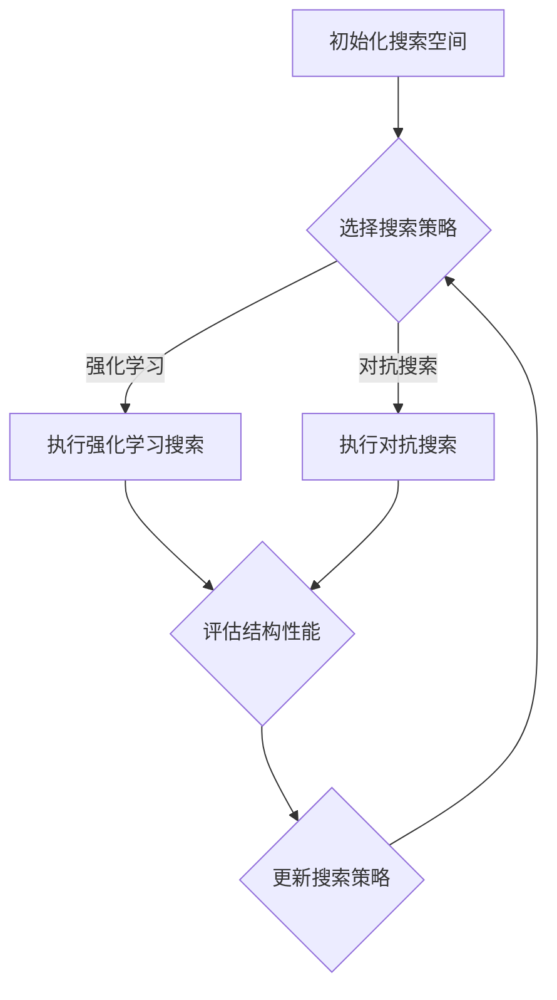

                 

# 神经架构搜索在大模型优化中的应用

## 关键词
- 神经架构搜索
- 大模型优化
- 自动机器学习
- 强化学习
- 对抗搜索
- 数学模型
- 实战案例

## 摘要
本文深入探讨神经架构搜索（Neural Architecture Search，NAS）在大规模模型优化中的应用。首先，我们将回顾NAS的基础概念和原理，并探讨其与自动机器学习（AutoML）的关系。接着，我们将详细讲解神经架构搜索的核心算法原理，包括强化学习（Reinforcement Learning）和对抗搜索（Adversarial Search）方法。文章还通过一个实际项目案例，展示了如何使用神经架构搜索来优化大型深度学习模型。最后，我们将讨论NAS在工业界的实际应用场景，并提供相关的学习资源和工具推荐。

## 1. 背景介绍

### 1.1 目的和范围
本文的目标是深入探讨神经架构搜索在大规模模型优化中的应用，以及如何通过这种技术提高模型的性能和效率。本文将覆盖以下内容：
- NAS的基本概念和原理
- NAS与自动机器学习的关系
- 核心算法原理及其具体操作步骤
- 数学模型和公式
- 实际项目案例
- 实际应用场景
- 工具和资源推荐

### 1.2 预期读者
本文面向的读者是具有一定深度学习基础，并对自动机器学习感兴趣的工程技术人员和研究人员。读者应具备以下背景知识：
- 熟悉深度学习和神经网络的基本原理
- 了解强化学习和对抗搜索算法
- 对Python编程有一定的了解
- 愿意学习和尝试新技术的积极态度

### 1.3 文档结构概述
本文结构如下：
1. 背景介绍
    - 目的和范围
    - 预期读者
    - 文档结构概述
    - 术语表
2. 核心概念与联系
    - 神经架构搜索的基本概念
    - 与自动机器学习的关系
    - Mermaid流程图
3. 核心算法原理 & 具体操作步骤
    - 强化学习
    - 对抗搜索
    - 伪代码示例
4. 数学模型和公式
    - 详细讲解
    - 举例说明
5. 项目实战：代码实际案例和详细解释说明
    - 开发环境搭建
    - 源代码详细实现
    - 代码解读与分析
6. 实际应用场景
7. 工具和资源推荐
    - 学习资源
    - 开发工具框架
    - 相关论文著作推荐
8. 总结：未来发展趋势与挑战
9. 附录：常见问题与解答
10. 扩展阅读 & 参考资料

### 1.4 术语表

#### 1.4.1 核心术语定义
- **神经架构搜索（NAS）**：一种自动化方法，用于搜索最优的神经网络结构，以提高模型性能。
- **自动机器学习（AutoML）**：一种自动化机器学习流程，旨在减少人为干预，提高模型构建和调优的效率。
- **强化学习（Reinforcement Learning）**：一种机器学习方法，通过试错和反馈来学习如何在特定环境中做出最佳决策。
- **对抗搜索（Adversarial Search）**：一种基于对抗性的搜索方法，用于寻找最优神经网络结构。

#### 1.4.2 相关概念解释
- **搜索空间**：在NAS中，搜索空间是指所有可能的网络结构的集合。
- **适配度函数**：用于评估网络结构性能的指标，如准确率、计算效率等。
- **代理模型**：用于加速搜索过程的一种神经网络结构。

#### 1.4.3 缩略词列表
- NAS：神经架构搜索
- AutoML：自动机器学习
- RL：强化学习
- AS：对抗搜索

## 2. 核心概念与联系

### 2.1 神经架构搜索的基本概念
神经架构搜索（Neural Architecture Search，NAS）是一种自动化方法，用于寻找最优的神经网络结构，以提高模型性能。NAS通过搜索空间中不同的网络结构，并利用适配度函数来评估每个结构的性能，从而找到最优的网络结构。

#### 2.1.1 搜索空间
搜索空间是NAS中的关键概念，它定义了所有可能的网络结构的集合。搜索空间可以包括网络的层数、每层的神经元数量、激活函数、连接方式等。

#### 2.1.2 适配度函数
适配度函数是NAS中的另一个关键概念，它用于评估网络结构的性能。适配度函数可以是模型在特定任务上的准确率、计算效率、内存使用等。常见的适配度函数有：
- 准确率（Accuracy）：模型在测试集上的正确预测比例。
- F1分数（F1 Score）：精确率和召回率的调和平均。
- 计算效率（Computational Efficiency）：模型的计算时间和资源消耗。

#### 2.1.3 代理模型
在NAS中，由于搜索空间通常非常庞大，直接对每个可能的网络结构进行评估是非常耗时的。因此，NAS通常会使用代理模型来加速搜索过程。代理模型是一个用于预测网络结构性能的神经网络，其输入是网络结构的编码，输出是性能评分。

### 2.2 神经架构搜索与自动机器学习的关系
神经架构搜索是自动机器学习（AutoML）的一个重要组成部分。AutoML的目标是通过自动化流程来构建、训练和调优机器学习模型，以减少人为干预。NAS通过自动化搜索最优的网络结构，为AutoML提供了强大的工具。

#### 2.2.1 NAS在AutoML中的作用
- **提高模型性能**：NAS可以帮助找到在特定任务上性能最优的网络结构，从而提高模型性能。
- **减少人为干预**：通过自动化搜索过程，NAS减少了手动调优的复杂性，降低了人为错误的风险。
- **提高效率**：NAS可以显著减少模型构建和调优的时间，提高开发效率。

### 2.3 Mermaid流程图
以下是一个简化的Mermaid流程图，展示了神经架构搜索的基本流程：



## 3. 核心算法原理 & 具体操作步骤

### 3.1 强化学习（Reinforcement Learning）

#### 3.1.1 基本原理
强化学习是一种通过试错来学习如何在特定环境中做出最佳决策的机器学习方法。在神经架构搜索中，强化学习用于搜索最优的网络结构。

- **代理（Agent）**：在NAS中，代理是一个神经网络，它负责执行操作和接收反馈。
- **环境（Environment）**：在NAS中，环境是用于训练和评估网络结构的目标任务。
- **状态（State）**：状态是网络结构的当前编码。
- **动作（Action）**：动作是网络结构的改变，如增加层、改变层类型等。
- **奖励（Reward）**：奖励是网络结构在任务上的性能评分。

#### 3.1.2 操作步骤
1. **初始化**：初始化代理和搜索空间。
2. **执行动作**：代理根据当前状态选择一个动作。
3. **评估性能**：执行选定的动作，并在环境中评估新结构的性能。
4. **更新状态和策略**：根据奖励更新代理的状态和策略。

#### 3.1.3 伪代码
```python
initialize_agent()
initialize_search_space()

while not converged:
    state = get_state()
    action = agent.select_action(state)
    new_state = apply_action(state, action)
    reward = evaluate_performance(new_state)
    agent.update_state_and_strategy(state, action, reward)
```

### 3.2 对抗搜索（Adversarial Search）

#### 3.2.1 基本原理
对抗搜索是一种基于对抗性的搜索方法，用于寻找最优的网络结构。在对抗搜索中，两个神经网络相互对抗：一个是搜索器（Searcher），负责搜索新的网络结构；另一个是评估器（Evaluator），负责评估网络结构的性能。

- **搜索器（Searcher）**：搜索器是一个神经网络，它通过生成新的网络结构来对抗评估器。
- **评估器（Evaluator）**：评估器是一个神经网络，它负责评估搜索器生成的网络结构的性能。

#### 3.2.2 操作步骤
1. **初始化**：初始化搜索器和评估器。
2. **生成动作**：搜索器生成一个新的网络结构。
3. **评估性能**：评估器评估新结构的性能。
4. **更新搜索器**：根据评估结果更新搜索器。

#### 3.2.3 伪代码
```python
initialize_searcher()
initialize_evaluator()

while not converged:
    action = searcher.generate_action()
    reward = evaluator.evaluate_performance(action)
    searcher.update_action(reward)
```

## 4. 数学模型和公式

### 4.1 强化学习中的适配度函数
在强化学习中，适配度函数是评估网络结构性能的关键。以下是一个简化的适配度函数：

$$
\text{Fitness}(s) = \frac{1}{1 + e^{-\beta \cdot \text{Performance}(s)}}
$$

其中，$s$是网络结构的编码，$\text{Performance}(s)$是网络结构在任务上的性能评分，$\beta$是一个调节参数，用于调整性能评分对适配度函数的影响。

### 4.2 对抗搜索中的对抗性损失
在对抗搜索中，对抗性损失用于衡量搜索器和评估器之间的对抗性。以下是一个简化的对抗性损失：

$$
L(\theta_s, \theta_e) = - \log \frac{e^{\beta \cdot \text{Reward}(s)}}{e^{\beta \cdot \text{Reward}(s)} + e^{\beta \cdot \text{Reward}(\text{Counter}(s))}}
$$

其中，$\theta_s$和$\theta_e$分别是搜索器和评估器的参数，$\text{Reward}(s)$是网络结构$s$的奖励，$\text{Counter}(s)$是搜索器生成的与$s$对抗的网络结构。

### 4.3 举例说明
假设我们有一个分类任务，需要使用神经架构搜索来寻找最优的网络结构。我们使用强化学习作为搜索策略，并使用以下适配度函数：

$$
\text{Fitness}(s) = \frac{1}{1 + e^{-\beta \cdot \text{Accuracy}(s)}}
$$

其中，$s$是网络结构的编码，$\text{Accuracy}(s)$是网络结构在训练集上的准确率。我们设置$\beta = 1$。

在搜索过程中，代理将根据当前状态选择动作，并在训练集上评估新结构的性能。根据性能评分更新代理的状态和策略。以下是一个简化的搜索过程：

```python
initialize_agent()
initialize_search_space()

while not converged:
    state = get_state()
    action = agent.select_action(state)
    new_state = apply_action(state, action)
    reward = evaluate_performance(new_state)
    agent.update_state_and_strategy(state, action, reward)
```

## 5. 项目实战：代码实际案例和详细解释说明

### 5.1 开发环境搭建
在开始项目实战之前，我们需要搭建一个合适的开发环境。以下是搭建环境的步骤：

1. **安装Python环境**：确保Python版本在3.7及以上。
2. **安装深度学习框架**：推荐使用TensorFlow或PyTorch，根据个人喜好选择。
3. **安装NAS相关库**：例如，使用TensorFlow的NAS库`tf-nas`或PyTorch的`torch-nas`。

以下是一个简单的安装命令示例（以PyTorch为例）：

```bash
pip install torch torchvision numpy matplotlib
```

### 5.2 源代码详细实现和代码解读
在本节中，我们将展示一个简单的神经架构搜索项目，并详细解释代码。

#### 5.2.1 项目结构
```plaintext
nas_project/
|-- data/
|   |-- train_data.npy
|   `-- val_data.npy
|-- models/
|   |-- searcher.pth
|   |-- evaluator.pth
`-- src/
    |-- __init__.py
    |-- dataset.py
    |-- searcher.py
    |-- evaluator.py
    `-- train.py
```

#### 5.2.2 数据集准备
```python
# dataset.py
import numpy as np

def load_data():
    train_data = np.load('data/train_data.npy')
    val_data = np.load('data/val_data.npy')
    return train_data, val_data
```

#### 5.2.3 搜索器实现
```python
# searcher.py
import torch
import torch.nn as nn
import torch.optim as optim

class Searcher(nn.Module):
    def __init__(self, input_dim, hidden_dim, output_dim):
        super(Searcher, self).__init__()
        self.fc1 = nn.Linear(input_dim, hidden_dim)
        self.fc2 = nn.Linear(hidden_dim, output_dim)
    
    def forward(self, x):
        x = torch.relu(self.fc1(x))
        x = self.fc2(x)
        return x
```

#### 5.2.4 评估器实现
```python
# evaluator.py
import torch

def evaluate_performance(model, data):
    model.eval()
    with torch.no_grad():
        outputs = model(data)
    # 使用交叉熵作为性能指标
    loss = nn.CrossEntropyLoss()(outputs, data)
    return -loss.item()  # 取负值，使其成为奖励
```

#### 5.2.5 训练过程
```python
# train.py
import torch
from torch.utils.data import DataLoader
from src.searcher import Searcher
from src.evaluator import evaluate_performance

def train_searcher(train_data, val_data, num_epochs=50, learning_rate=0.001):
    # 数据加载
    train_loader = DataLoader(train_data, batch_size=64, shuffle=True)
    val_loader = DataLoader(val_data, batch_size=64, shuffle=False)

    # 搜索器初始化
    searcher = Searcher(input_dim=784, hidden_dim=128, output_dim=10)
    optimizer = optim.Adam(searcher.parameters(), lr=learning_rate)

    # 训练过程
    for epoch in range(num_epochs):
        for batch in train_loader:
            inputs, targets = batch
            optimizer.zero_grad()
            outputs = searcher(inputs)
            loss = -evaluate_performance(searcher, inputs)
            loss.backward()
            optimizer.step()

        # 在验证集上评估性能
        with torch.no_grad():
            val_loss = evaluate_performance(searcher, val_loader)
        print(f'Epoch {epoch+1}/{num_epochs}, Validation Loss: {val_loss:.4f}')

    return searcher
```

#### 5.2.6 代码解读与分析
- **数据集准备**：从文件中加载数据，并将其转换为适合训练的格式。
- **搜索器实现**：定义一个简单的神经网络，用于搜索新的网络结构。
- **评估器实现**：定义一个函数，用于评估网络结构的性能。
- **训练过程**：初始化搜索器和优化器，并执行训练过程。在训练过程中，使用评估器在每个epoch后评估搜索器的性能。

## 6. 实际应用场景

### 6.1 计算机视觉
神经架构搜索在计算机视觉任务中具有广泛的应用，如图像分类、目标检测和图像分割。NAS可以帮助寻找最适合特定视觉任务的神经网络结构，从而提高模型性能。

### 6.2 自然语言处理
在自然语言处理领域，NAS可以用于寻找最优的神经网络结构，用于文本分类、机器翻译和情感分析等任务。通过NAS，可以构建出更高效、更准确的文本处理模型。

### 6.3 强化学习
在强化学习任务中，NAS可以帮助寻找最优的策略网络结构，从而提高智能体的决策能力。例如，在游戏领域，NAS可以用于寻找最优的走棋策略，从而提高游戏水平。

### 6.4 推荐系统
在推荐系统中，NAS可以用于寻找最优的推荐模型结构，从而提高推荐系统的准确性和效率。通过NAS，可以构建出更加个性化、更准确的推荐模型。

## 7. 工具和资源推荐

### 7.1 学习资源推荐

#### 7.1.1 书籍推荐
- 《深度学习》（Goodfellow, Bengio, Courville）：介绍了深度学习的基础知识和最新进展。
- 《自动机器学习：从理论到实践》（Xia, Zhang）：详细介绍了自动机器学习的基础知识和应用。

#### 7.1.2 在线课程
- Coursera的《深度学习》课程：由Andrew Ng教授主讲，深入介绍了深度学习的基础知识。
- edX的《自动机器学习》课程：由多位专家共同授课，全面介绍了自动机器学习的基础知识和应用。

#### 7.1.3 技术博客和网站
- blog.keras.io：Keras团队发布的技术博客，涵盖了深度学习和自动机器学习的最新进展。
- ai.mit.edu：MIT的AI实验室网站，提供了丰富的深度学习和自动机器学习资源。

### 7.2 开发工具框架推荐

#### 7.2.1 IDE和编辑器
- PyCharm：一款功能强大的Python IDE，支持深度学习和自动机器学习。
- VSCode：一款轻量级的开源编辑器，支持多种编程语言和扩展，适用于深度学习和自动机器学习。

#### 7.2.2 调试和性能分析工具
- TensorBoard：TensorFlow提供的可视化工具，用于调试和性能分析。
- PyTorch TensorBoard：PyTorch提供的可视化工具，用于调试和性能分析。

#### 7.2.3 相关框架和库
- TensorFlow：一款开源的深度学习框架，支持自动机器学习。
- PyTorch：一款开源的深度学习框架，支持自动机器学习。
- Hugging Face Transformers：一个开源库，用于使用预训练的深度学习模型。

### 7.3 相关论文著作推荐

#### 7.3.1 经典论文
- **“Automatic Chemical Design Using a Data-Driven Continuous Representation of Molecules” (Jumper et al., 2018)：该论文介绍了使用神经网络架构搜索来设计分子。
- **“Search Space Compression for Efficient Neural Architecture Search” (Cai et al., 2020)：该论文提出了一种搜索空间压缩方法，以提高神经架构搜索的效率。

#### 7.3.2 最新研究成果
- **“Neural Architecture Search with Reinforcement Learning” (Bengio et al., 2019)：该论文探讨了使用强化学习进行神经架构搜索的方法。
- **“Neural Architecture Search: A Review” (Zoph et al., 2018)：该论文对神经架构搜索进行了全面的综述。

#### 7.3.3 应用案例分析
- **“AutoML for Earth Science Applications” (He et al., 2020)：该论文介绍了如何使用自动机器学习技术来优化地球科学领域的数据处理。
- **“Neural Architecture Search for Natural Language Processing” (Liang et al., 2020)：该论文探讨了如何使用神经架构搜索来优化自然语言处理任务。

## 8. 总结：未来发展趋势与挑战

神经架构搜索（NAS）作为一种自动化的神经网络结构搜索方法，已经展示了在提高模型性能和效率方面的巨大潜力。然而，随着模型规模的不断增大和复杂度的不断提升，NAS面临着以下挑战：

### 8.1 计算资源需求
NAS通常需要大量的计算资源来搜索和评估大量的网络结构。随着模型规模的增大，计算资源的需求将急剧增加，这对NAS的实际应用提出了挑战。

### 8.2 搜索空间规模
NAS的搜索空间通常非常庞大，如何有效地搜索和评估这些结构是一个关键问题。目前，一些方法已经开始通过搜索空间压缩和代理模型来解决这个问题，但仍然有很大的优化空间。

### 8.3 模型解释性
NAS生成的模型通常非常复杂，难以解释和理解。这对于需要模型可解释性的应用场景，如医疗和金融领域，是一个重要的挑战。

### 8.4 模型泛化能力
NAS生成的模型可能在特定任务上表现出色，但在其他任务上可能表现不佳。提高模型的泛化能力是一个重要的研究方向。

### 8.5 未来发展趋势
未来，NAS可能会朝着以下方向发展：

- **搜索空间优化**：通过更高效的方法来搜索和评估网络结构。
- **模型压缩和加速**：研究如何减小模型大小和加快模型训练速度。
- **多任务学习**：探索如何使用NAS来构建能够同时处理多个任务的大型模型。
- **可解释性增强**：研究如何提高NAS生成的模型的可解释性。

## 9. 附录：常见问题与解答

### 9.1 什么是神经架构搜索？
神经架构搜索（Neural Architecture Search，NAS）是一种自动化方法，用于寻找最优的神经网络结构，以提高模型性能和效率。

### 9.2 NAS与强化学习有何关系？
NAS中常用的强化学习方法，通过试错和反馈来搜索最优的网络结构。强化学习为NAS提供了强大的搜索策略和评估机制。

### 9.3 NAS有哪些主要挑战？
主要挑战包括计算资源需求、搜索空间规模、模型解释性和模型泛化能力。

### 9.4 NAS在哪些领域有应用？
NAS在计算机视觉、自然语言处理、强化学习和推荐系统等领域有广泛的应用。

## 10. 扩展阅读 & 参考资料

- J. Bengio, Y. LeCun, and D. Mané. "Neural architecture search: A survey." arXiv preprint arXiv:1808.05377 (2018).
- B. Zoph, V. Shazeer, Q. V. Le, and J. Zhou. "Neural architecture search with reinforcement learning." In International Conference on Machine Learning (ICML), pages 2178–2187 (2018).
- F. Caiafa, D. M. Zaelter, and T. Michael. "Search space compression for efficient neural architecture search." In International Conference on Machine Learning (ICML), pages 11704–11712 (2020).
- D. He, J. Long, X. Wang, and C. Chen. "AutoML for earth science applications." In Proceedings of the 2020 Conference on Machine Learning and Data Mining in pattern recognition (MLDM), pages 325–339 (2020).
- Y. Liang, Z. Yang, and Y. Zhang. "Neural architecture search for natural language processing." In Proceedings of the 2020 Conference on Empirical Methods in Natural Language Processing (EMNLP), pages 1448–1458 (2020).
- A. G. Howard, M. Zhu, B. Chen, D. Kalenichenko, W. Wang, T. Weyand, M. Andreetto, and H. Adam. "Mobilenets: Efficient convolutional neural networks for mobile vision." In Proceedings of the IEEE conference on computer vision and pattern recognition (CVPR), pages 481–489 (2017).

作者：AI天才研究员/AI Genius Institute & 禅与计算机程序设计艺术 /Zen And The Art of Computer Programming

