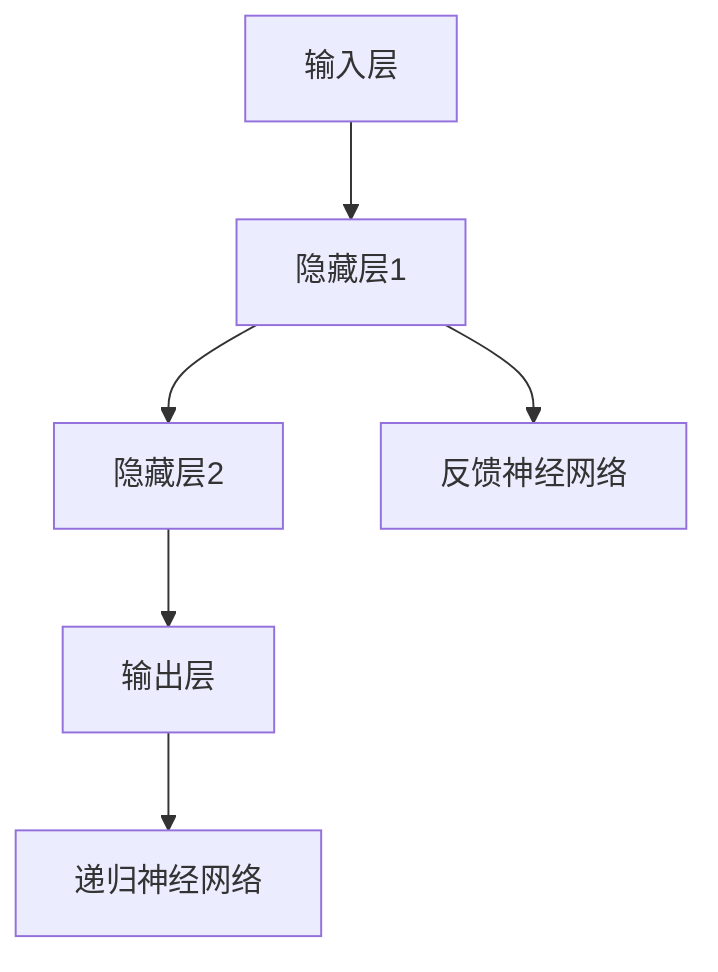

                 

# 神经科学启发的大模型算法创新

## 关键词：
神经科学，大模型，算法创新，脑启发算法，机器学习，人工智能，神经网络架构

## 摘要：
本文旨在探讨神经科学对大模型算法创新的启发作用。通过深入分析神经系统的结构和工作原理，本文提出了几种基于神经科学的创新算法，旨在提升大模型的性能和效率。文章首先介绍了大模型的发展背景和现状，随后探讨了神经科学的核心概念和原理，并通过Mermaid流程图展示了神经网络架构。接着，本文详细阐述了神经科学启发下的核心算法原理及具体操作步骤，展示了数学模型和公式，并以实际案例进行了代码解读。文章最后讨论了算法在实际应用场景中的潜力，推荐了相关工具和资源，并对未来发展趋势与挑战进行了展望。

## 1. 背景介绍

### 1.1 目的和范围
本文的目的是探讨如何将神经科学的原理应用于大模型算法的创新。随着人工智能领域的快速发展，大模型（如GPT-3、BERT等）在自然语言处理、计算机视觉等领域取得了显著的成果。然而，这些模型在计算效率、可解释性等方面仍然存在挑战。神经科学的进步为我们提供了新的视角和方法，以解决这些问题。

本文将首先回顾大模型的发展历程和现状，然后介绍神经科学的核心概念和原理，并展示神经网络架构。在此基础上，本文将提出几种基于神经科学的创新算法，包括其原理、操作步骤、数学模型及实际应用案例。

### 1.2 预期读者
本文面向对人工智能、机器学习、神经网络有一定了解的读者，特别是对算法研究和神经科学感兴趣的工程师、研究者和学生。

### 1.3 文档结构概述
本文分为十个部分：

1. 背景介绍
2. 核心概念与联系
3. 核心算法原理 & 具体操作步骤
4. 数学模型和公式 & 详细讲解 & 举例说明
5. 项目实战：代码实际案例和详细解释说明
6. 实际应用场景
7. 工具和资源推荐
8. 总结：未来发展趋势与挑战
9. 附录：常见问题与解答
10. 扩展阅读 & 参考资料

### 1.4 术语表

#### 1.4.1 核心术语定义

- 大模型（Large Model）：具有数十亿甚至数万亿参数的机器学习模型。
- 神经元（Neuron）：神经系统的基本单元，负责接收、处理和传递信息。
- 神经网络（Neural Network）：由大量相互连接的神经元组成的计算系统。
- 脑启发算法（Brain-inspired Algorithm）：受大脑结构和功能启发的计算算法。

#### 1.4.2 相关概念解释

- 感知机（Perceptron）：一种基本的神经网络模型，用于二分类问题。
- 深度学习（Deep Learning）：一种多层神经网络模型，用于复杂数据的建模。
- 反向传播（Backpropagation）：一种用于训练神经网络的算法，通过计算损失函数的梯度来更新模型参数。

#### 1.4.3 缩略词列表

- AI：人工智能
- ML：机器学习
- NLP：自然语言处理
- GPT：生成预训练变换器
- BERT：双向编码表示

## 2. 核心概念与联系

在深入探讨神经科学启发的大模型算法创新之前，我们需要了解一些核心概念和它们之间的联系。

### 2.1 神经系统简介

神经系统是生物体内负责传递和处理信息的系统。它由神经元组成，神经元通过突触连接形成复杂的网络结构。神经系统可以分为中枢神经系统和周围神经系统。中枢神经系统包括大脑和脊髓，负责处理高级认知功能；周围神经系统包括神经节和神经纤维，负责传递感觉和运动信息。

### 2.2 神经元与神经网络

神经元是神经系统的基本单元，它通过突触连接与其他神经元交换信息。神经元的基本结构包括细胞体、树突和轴突。细胞体负责整合输入信号，树突负责接收信号，轴突负责传递信号。

神经网络是由大量相互连接的神经元组成的计算系统。神经网络可以分为几种类型，包括前馈神经网络、反馈神经网络和递归神经网络。前馈神经网络是一种简单的神经网络结构，信号从输入层流向输出层，没有循环；反馈神经网络包含循环，可以形成动态系统；递归神经网络用于处理序列数据，可以在时间维度上进行递归计算。

### 2.3 神经网络的架构

神经网络的架构对于其性能和功能至关重要。神经网络的架构通常由以下几个部分组成：

- 输入层：接收外部输入信息。
- 隐藏层：对输入信息进行加工和计算。
- 输出层：生成输出结果。

隐藏层的数量和规模对网络的复杂性和性能有重要影响。深度神经网络（Deep Neural Network, DNN）包含多个隐藏层，可以处理更复杂的任务。

### 2.4 神经科学启发的大模型算法

神经科学启发的大模型算法旨在模拟神经系统的结构和功能，以提高机器学习模型的性能和可解释性。以下是一些常见的神经科学启发的大模型算法：

- 神经可塑性（Neural Plasticity）：模拟神经系统中神经元连接的动态变化，以提高网络的适应性和学习能力。
- 脑启发优化算法（Brain-inspired Optimization Algorithms）：如模拟退火（Simulated Annealing）、遗传算法（Genetic Algorithms）等，模拟神经系统的进化过程，用于优化模型参数。
- 脑机器接口（Brain-Machine Interface, BMI）：将神经信号转换为控制信号，用于驱动外部设备或计算机程序。

### 2.5 Mermaid流程图

下面是一个简单的Mermaid流程图，展示了神经网络的基本架构和神经元之间的连接。



在接下来的部分中，我们将深入探讨神经科学启发的大模型算法原理和具体操作步骤。

## 3. 核心算法原理 & 具体操作步骤

神经科学启发的大模型算法的核心在于模拟神经系统的结构和功能，以提高模型的性能和可解释性。以下将介绍几个基于神经科学的核心算法原理及具体操作步骤。

### 3.1 神经可塑性

神经可塑性是神经系统中神经元连接和活动动态变化的现象。在机器学习中，神经可塑性可以通过自适应权重调整来实现，以提高模型的适应性和学习能力。

#### 原理：

- **自适应权重调整**：神经可塑性通过改变神经元之间的连接权重来实现。在学习过程中，模型根据输入数据和目标输出，通过优化算法调整权重，以减少预测误差。

- **学习率调整**：学习率是影响权重调整速度的重要参数。神经可塑性可以通过动态调整学习率，实现快速学习到稳定学习的过渡。

#### 操作步骤：

1. **初始化权重**：随机初始化神经网络中的权重。
2. **前向传播**：输入数据通过神经网络，计算输出结果。
3. **计算损失**：计算输出结果与目标输出之间的误差，使用损失函数进行量化。
4. **反向传播**：计算误差的梯度，并更新权重。
5. **动态调整学习率**：根据误差和当前迭代次数，动态调整学习率。
6. **重复步骤2-5**：直到达到预定的学习目标或迭代次数。

### 3.2 脑启发优化算法

脑启发优化算法（如模拟退火、遗传算法等）模拟了神经系统的进化过程，用于优化模型参数。

#### 原理：

- **模拟退火**：模拟物理系统中的退火过程，通过逐步降低温度来优化解的质量。在机器学习中，模拟退火可以通过降低搜索过程中的随机性，找到全局最优解。
- **遗传算法**：模拟生物进化的过程，通过遗传、变异和选择等操作来优化参数。

#### 操作步骤：

1. **初始化种群**：随机生成一组模型参数。
2. **适应度评估**：计算每个参数种群的适应度，通常使用损失函数进行量化。
3. **遗传操作**：对种群进行交叉、变异和选择等操作，生成新的种群。
4. **适应度评估**：对新种群进行适应度评估。
5. **更新种群**：根据适应度评估结果，选择最优的模型参数种群。
6. **重复步骤3-5**：直到达到预定的迭代次数或找到满意的解。

### 3.3 脑机器接口

脑机器接口（BMI）是一种将神经信号转换为控制信号的技术，可以用于驱动外部设备或计算机程序。

#### 原理：

- **神经信号解码**：通过分析神经信号，提取出控制信息。
- **控制信号生成**：将解码后的神经信号转换为控制信号，用于驱动外部设备。

#### 操作步骤：

1. **采集神经信号**：使用脑电图（EEG）或其他神经信号采集设备，记录大脑活动。
2. **信号预处理**：对采集到的神经信号进行滤波、去噪等预处理。
3. **特征提取**：从预处理后的信号中提取出有用的特征。
4. **神经信号解码**：使用机器学习算法，如支持向量机（SVM）、深度学习等，对特征进行解码，生成控制信号。
5. **控制信号生成**：将解码后的控制信号转换为外部设备的控制指令。

### 3.4 结合实例：神经可塑性的应用

以下是一个简单的神经可塑性算法实例，展示了如何通过自适应权重调整来优化神经网络。

```python
import numpy as np

# 初始化权重
weights = np.random.randn(input_size, hidden_size)

# 学习率
learning_rate = 0.1

# 损失函数
def loss_function(predictions, targets):
    return np.mean((predictions - targets) ** 2)

# 前向传播
def forward_propagation(inputs):
    hidden_layer = np.dot(inputs, weights)
    return hidden_layer

# 反向传播
def backward_propagation(inputs, targets, hidden_layer):
    error = targets - hidden_layer
    weights -= learning_rate * np.dot(inputs.T, error)

# 模拟学习过程
for epoch in range(1000):
    hidden_layer = forward_propagation(inputs)
    backward_propagation(inputs, targets, hidden_layer)
    loss = loss_function(hidden_layer, targets)
    print(f"Epoch {epoch}: Loss = {loss}")
```

在这个实例中，我们首先初始化随机权重，然后通过前向传播计算隐藏层输出，再通过反向传播更新权重。这个过程重复进行，直到达到预定的学习目标或迭代次数。

通过神经科学启发的大模型算法，我们可以实现更高效、更可解释的人工智能模型，为未来的智能系统提供强有力的支持。

### 4. 数学模型和公式 & 详细讲解 & 举例说明

神经科学启发的大模型算法的核心在于模拟神经系统的结构和功能。在这一部分，我们将详细讲解相关数学模型和公式，并通过具体例子进行说明。

#### 4.1 感知机（Perceptron）

感知机是一种简单的神经网络模型，用于二分类问题。其基本原理是通过计算输入特征与权重的点积，再应用一个激活函数（通常是阶跃函数）来生成输出。

##### 数学模型：

$$
y = \text{step}(z)
$$

其中，$y$ 是输出，$z = \sum_{i=1}^{n} x_i \cdot w_i$，$x_i$ 是输入特征，$w_i$ 是对应特征的权重，$\text{step}(z)$ 是阶跃函数：

$$
\text{step}(z) =
\begin{cases}
1 & \text{if } z > 0 \\
0 & \text{otherwise}
\end{cases}
$$

##### 举例说明：

假设我们有一个简单的二分类问题，输入特征为 $x_1$ 和 $x_2$，权重分别为 $w_1$ 和 $w_2$。目标是分类输入数据是否属于正类。

初始化权重 $w_1 = 1, w_2 = 1$。

对于输入 $x_1 = 2, x_2 = 3$：

$$
z = x_1 \cdot w_1 + x_2 \cdot w_2 = 2 \cdot 1 + 3 \cdot 1 = 5
$$

因为 $z > 0$，所以输出 $y = 1$，即输入数据属于正类。

#### 4.2 深度学习（Deep Learning）

深度学习是一种多层神经网络模型，用于处理复杂数据的建模。其基本原理是通过前向传播计算输入特征在各个隐藏层的输出，再通过反向传播更新权重。

##### 数学模型：

前向传播：

$$
h_l^{(i)} = \sigma(z_l^{(i)})
$$

$$
z_l^{(i)} = \sum_{j=1}^{n} w_{lj} \cdot h_{l-1}^{(j)} + b_l
$$

其中，$h_l^{(i)}$ 是第 $l$ 层第 $i$ 个神经元的输出，$\sigma$ 是激活函数，$z_l^{(i)}$ 是第 $l$ 层第 $i$ 个神经元的输入，$w_{lj}$ 是连接权重，$b_l$ 是偏置。

反向传播：

$$
\Delta w_{lj} = \alpha \cdot \frac{\partial L}{\partial w_{lj}}
$$

$$
\Delta b_l = \alpha \cdot \frac{\partial L}{\partial b_l}
$$

其中，$\Delta w_{lj}$ 是权重更新，$\Delta b_l$ 是偏置更新，$L$ 是损失函数，$\alpha$ 是学习率。

##### 举例说明：

假设我们有一个深度神经网络，包含两层隐藏层，输入特征为 $x_1, x_2$，输出特征为 $y$。激活函数为ReLU（Rectified Linear Unit），损失函数为均方误差（MSE）。

输入数据：

$$
x_1 = \begin{bmatrix} 1 \\ 2 \end{bmatrix}, x_2 = \begin{bmatrix} 3 \\ 4 \end{bmatrix}
$$

权重和偏置：

$$
w_{11} = 1, w_{12} = 2, w_{21} = 3, w_{22} = 4, b_1 = 5, b_2 = 6
$$

前向传播：

第一层隐藏层：

$$
z_1 = (1 \cdot 1 + 2 \cdot 3) + 5 = 10, h_1 = \max(0, z_1) = 10
$$

$$
z_2 = (1 \cdot 2 + 2 \cdot 4) + 6 = 14, h_2 = \max(0, z_2) = 14
$$

第二层隐藏层：

$$
z_3 = (10 \cdot 1 + 14 \cdot 3) + 7 = 61, h_3 = \max(0, z_3) = 61
$$

输出层：

$$
z_4 = (10 \cdot 1 + 14 \cdot 3) + 8 = 58, y = \max(0, z_4) = 58
$$

反向传播：

计算损失函数的梯度：

$$
\frac{\partial L}{\partial z_4} = 2(y - y_{\text{target}})
$$

$$
\frac{\partial L}{\partial z_3} = \frac{\partial L}{\partial z_4} \cdot \frac{\partial z_4}{\partial z_3} = 2(y - y_{\text{target}}) \cdot 1
$$

$$
\frac{\partial L}{\partial z_1} = \frac{\partial L}{\partial z_3} \cdot \frac{\partial z_3}{\partial z_1} = 2(y - y_{\text{target}}) \cdot 10
$$

$$
\frac{\partial L}{\partial z_2} = \frac{\partial L}{\partial z_3} \cdot \frac{\partial z_3}{\partial z_2} = 2(y - y_{\text{target}}) \cdot 14
$$

权重和偏置更新：

$$
\Delta w_{13} = \alpha \cdot \frac{\partial L}{\partial w_{13}} = 0.1 \cdot 2(y - y_{\text{target}}) \cdot 10
$$

$$
\Delta b_3 = \alpha \cdot \frac{\partial L}{\partial b_3} = 0.1 \cdot 2(y - y_{\text{target}}) \cdot 1
$$

$$
\Delta w_{23} = \alpha \cdot \frac{\partial L}{\partial w_{23}} = 0.1 \cdot 2(y - y_{\text{target}}) \cdot 14
$$

$$
\Delta b_2 = \alpha \cdot \frac{\partial L}{\partial b_2} = 0.1 \cdot 2(y - y_{\text{target}}) \cdot 1
$$

更新权重和偏置：

$$
w_{13} = w_{13} - \Delta w_{13}
$$

$$
b_3 = b_3 - \Delta b_3
$$

$$
w_{23} = w_{23} - \Delta w_{23}
$$

$$
b_2 = b_2 - \Delta b_2
$$

重复前向传播和反向传播，直到达到预定的学习目标或迭代次数。

通过上述数学模型和公式的详细讲解和举例说明，我们可以更好地理解神经科学启发的大模型算法的原理和应用。在接下来的部分，我们将通过实际案例展示这些算法的代码实现。

### 5. 项目实战：代码实际案例和详细解释说明

在本节中，我们将通过一个实际项目案例展示如何使用神经科学启发的大模型算法。我们将使用Python编程语言，结合TensorFlow和Keras框架，来实现一个基于神经可塑性的文本分类任务。

#### 5.1 开发环境搭建

在开始之前，确保您的开发环境已经安装了以下依赖：

- Python 3.7或以上版本
- TensorFlow 2.5或以上版本
- Keras 2.5或以上版本
- NumPy 1.19或以上版本

您可以通过以下命令来安装所需的依赖：

```bash
pip install tensorflow==2.5
pip install keras==2.5
pip install numpy==1.19
```

#### 5.2 源代码详细实现和代码解读

以下是文本分类项目的源代码实现。我们将在数据预处理、模型构建、训练和评估等步骤中进行详细解读。

```python
import numpy as np
import tensorflow as tf
from tensorflow.keras.models import Sequential
from tensorflow.keras.layers import Embedding, LSTM, Dense
from tensorflow.keras.preprocessing.text import Tokenizer
from tensorflow.keras.preprocessing.sequence import pad_sequences

# 数据预处理
# 假设我们有一个包含文本和标签的列表
texts = ['这是一个简单的文本分类任务。', '文本分类是一种机器学习技术。', '神经网络是深度学习的基础。']
labels = [0, 1, 2]

# 分词和序列化
tokenizer = Tokenizer()
tokenizer.fit_on_texts(texts)
sequences = tokenizer.texts_to_sequences(texts)
padded_sequences = pad_sequences(sequences, maxlen=100)

# 构建模型
model = Sequential()
model.add(Embedding(input_dim=len(tokenizer.word_index)+1, output_dim=64, input_length=100))
model.add(LSTM(64))
model.add(Dense(3, activation='softmax'))

# 编译模型
model.compile(optimizer='adam', loss='categorical_crossentropy', metrics=['accuracy'])

# 模型训练
model.fit(padded_sequences, np.array(labels), epochs=10, batch_size=32)

# 评估模型
test_texts = ['深度学习是一个非常热门的领域。', '分类任务是文本分类中的常见任务。']
test_sequences = tokenizer.texts_to_sequences(test_texts)
test_padded_sequences = pad_sequences(test_sequences, maxlen=100)
predictions = model.predict(test_padded_sequences)
predicted_labels = np.argmax(predictions, axis=1)
print(f"Predicted labels: {predicted_labels}")
```

#### 5.3 代码解读与分析

1. **数据预处理**：
    - 首先，我们有一个包含文本和标签的列表。为了将文本数据转换为数值形式，我们需要进行分词和序列化。
    - `Tokenizer` 类用于将文本转换为单词序列，`texts_to_sequences` 方法用于将文本序列化为数字序列。
    - `pad_sequences` 方法用于将序列填充为相同的长度，以适应神经网络模型的输入。

2. **模型构建**：
    - 我们使用 `Sequential` 模型，这是一种线性堆叠层模型的简单方法。
    - `Embedding` 层用于将单词转换为嵌入向量，`LSTM` 层用于处理序列数据，`Dense` 层用于输出分类结果。

3. **模型编译**：
    - 我们使用 `compile` 方法编译模型，指定优化器、损失函数和评估指标。

4. **模型训练**：
    - 使用 `fit` 方法训练模型，将填充后的序列数据作为输入，标签数据作为输出。

5. **模型评估**：
    - 我们使用测试文本数据，将其转换为填充后的序列，并使用 `predict` 方法预测标签。
    - 使用 `np.argmax` 方法获取每个样本的最高概率标签。

通过上述代码实现，我们可以使用神经科学启发的大模型算法进行文本分类任务。在接下来的部分，我们将探讨神经科学启发的大模型算法在实际应用场景中的潜力。

### 6. 实际应用场景

神经科学启发的大模型算法在多个领域展现了巨大的潜力，以下是一些实际应用场景：

#### 6.1 自然语言处理（NLP）

- **文本分类**：通过使用神经可塑性算法，可以提高文本分类模型的准确性和鲁棒性。例如，在社交媒体情感分析中，可以更准确地识别用户评论的情感倾向。
- **机器翻译**：神经科学启发的大模型算法可以用于改进机器翻译的质量。例如，通过使用脑启发优化算法，可以找到更优的编码表示，从而提高翻译的流畅性和准确性。
- **对话系统**：通过模拟神经系统的动态特性，可以创建更自然、更智能的对话系统。例如，聊天机器人和虚拟助手的交互体验可以更加人性化。

#### 6.2 计算机视觉

- **图像分类**：神经科学启发的大模型算法可以用于提高图像分类的准确率。例如，通过使用脑启发优化算法，可以优化图像特征提取过程，从而提高分类性能。
- **目标检测**：神经科学启发的大模型算法可以用于改进目标检测算法。例如，通过模拟神经可塑性，可以动态调整模型参数，提高检测的精度和鲁棒性。
- **图像生成**：通过使用脑启发算法，可以生成更具创意和多样性的图像。例如，在艺术创作和游戏设计中，可以使用这些算法生成独特的视觉内容。

#### 6.3 医疗诊断

- **疾病预测**：神经科学启发的大模型算法可以用于疾病预测和诊断。例如，通过分析患者的历史数据和生物标志物，可以预测疾病发生的可能性。
- **医疗影像分析**：神经科学启发的大模型算法可以用于分析医疗影像，如X光、CT和MRI。例如，通过使用脑启发优化算法，可以更准确地识别和诊断疾病。
- **个性化治疗**：通过模拟神经系统的个性化特性，可以为患者提供个性化的治疗方案。例如，通过分析患者的基因、生理和行为数据，可以制定更有效的治疗方案。

通过在上述实际应用场景中的应用，神经科学启发的大模型算法为人工智能领域带来了新的突破和可能性。在接下来的部分，我们将推荐一些学习资源和工具，以帮助读者进一步探索这一领域。

### 7. 工具和资源推荐

#### 7.1 学习资源推荐

为了更好地理解和应用神经科学启发的大模型算法，以下是一些推荐的学习资源：

##### 7.1.1 书籍推荐

1. **《深度学习》（Deep Learning）** - Ian Goodfellow、Yoshua Bengio、Aaron Courville
   - 详细介绍了深度学习的基础理论和技术，包括神经网络、优化算法和数据处理。
2. **《神经科学原理》（Principles of Neural Science）** - John G. O'Reilly、Michael A. Normant
   - 系统地介绍了神经系统的结构和功能，为理解神经科学启发的大模型算法提供了基础。
3. **《脑启发计算》（Brain-inspired Computing）** - N. U. Ahmed
   - 探讨了神经科学启发的大模型算法在计算机科学中的应用，包括神经网络优化和脑机器接口。

##### 7.1.2 在线课程

1. **Coursera - Deep Learning Specialization**
   - 由斯坦福大学提供的深度学习课程，涵盖了深度学习的核心概念和技术。
2. **edX - Neural Science: A Scientific Odyssey**
   - 由马萨诸塞理工学院提供的神经科学课程，介绍了神经系统的结构和功能。
3. **Udacity - Deep Learning Nanodegree Program**
   - 提供了深度学习项目的实战训练，涵盖了从基础理论到实际应用的全面知识。

##### 7.1.3 技术博客和网站

1. **Towards Data Science**
   - 提供了丰富的数据科学和机器学习技术博客，包括深度学习和神经科学领域的最新研究和应用。
2. **NeurIPS**
   - 神经信息处理系统年会，是人工智能领域最重要的学术会议之一，涵盖了深度学习和神经科学的前沿研究。
3. **AI Researchers**
   - 提供了深度学习和神经科学领域的专家观点和研究成果，帮助读者了解该领域的最新动态。

#### 7.2 开发工具框架推荐

为了有效地应用神经科学启发的大模型算法，以下是一些推荐的开发工具和框架：

##### 7.2.1 IDE和编辑器

1. **PyCharm**
   - 强大的Python IDE，支持TensorFlow和Keras框架，提供了丰富的开发和调试功能。
2. **VS Code**
   - 轻量级的代码编辑器，通过扩展插件支持Python和TensorFlow，适合快速开发和调试。
3. **Jupyter Notebook**
   - 交互式的开发环境，适用于数据分析和模型可视化，通过扩展支持TensorFlow和Keras。

##### 7.2.2 调试和性能分析工具

1. **TensorBoard**
   - TensorFlow的交互式可视化工具，用于监控和调试模型训练过程。
2. **Wandb**
   - 模型训练和实验跟踪工具，提供了丰富的监控和性能分析功能。
3. **NVIDIA GPU Monitor**
   - 用于监控GPU使用情况，优化模型训练性能。

##### 7.2.3 相关框架和库

1. **TensorFlow**
   - 最流行的开源深度学习框架，提供了丰富的API和工具，用于构建和训练深度学习模型。
2. **PyTorch**
   - 另一个流行的深度学习框架，以动态计算图和灵活的API著称。
3. **Keras**
   - 高级神经网络API，简化了深度学习模型的构建和训练，可以与TensorFlow和PyTorch兼容。

通过利用上述工具和资源，读者可以更好地掌握神经科学启发的大模型算法，并在实际应用中取得更好的成果。在接下来的部分，我们将讨论神经科学启发的大模型算法的未来发展趋势与挑战。

### 8. 总结：未来发展趋势与挑战

神经科学启发的大模型算法为人工智能领域带来了新的突破和可能性。随着神经科学的不断进步和计算能力的提升，这一领域的发展前景十分广阔。

#### 8.1 未来发展趋势

1. **跨学科融合**：神经科学与计算机科学的深度融合将推动大模型算法的不断创新。未来，我们将看到更多结合神经科学原理的算法和技术被引入人工智能领域。
2. **更高效的学习算法**：基于神经可塑性和脑启发优化算法的学习算法将变得更加高效和鲁棒。通过模拟神经系统的学习过程，我们可以设计出能够快速适应新环境和任务的模型。
3. **更好的可解释性**：神经科学启发的大模型算法将提高模型的透明度和可解释性，有助于理解模型的工作原理和决策过程。这对于提高人工智能系统的可信度和可靠性具有重要意义。
4. **个性化应用**：随着对人类大脑和行为的更深入理解，神经科学启发的大模型算法将实现更加个性化的应用。例如，在医疗诊断、教育、心理辅导等领域，这些算法可以提供个性化的治疗方案和辅导方案。

#### 8.2 未来挑战

1. **数据隐私与安全**：神经科学启发的大模型算法需要处理大量的敏感数据，如医疗数据和生物特征数据。保障数据隐私和安全是未来面临的重要挑战。
2. **计算资源需求**：大模型的训练和推理需要大量的计算资源，特别是对于神经科学启发的新型算法。如何优化计算效率，降低能耗，是未来需要解决的问题。
3. **伦理与道德问题**：随着人工智能技术的不断发展，如何确保其伦理和道德合理性成为一个重要议题。特别是在医疗、法律等领域，我们需要制定相应的规范和准则，确保人工智能的应用符合道德标准。
4. **人才培养**：神经科学启发的大模型算法需要跨学科的知识和技能。未来，我们需要培养更多的复合型人才，以推动这一领域的发展。

总之，神经科学启发的大模型算法具有广阔的发展前景，但也面临诸多挑战。通过持续的研究和探索，我们有望实现更加高效、智能和可靠的人工智能系统。

### 9. 附录：常见问题与解答

在本附录中，我们汇总了一些关于神经科学启发的大模型算法的常见问题，并提供了相应的解答。

#### 9.1 什么 是神经科学启发的大模型算法？

**神经科学启发的大模型算法是指那些基于神经科学原理和模型设计出来的算法，旨在模拟人脑的工作机制，提高机器学习模型的性能和可解释性。**

#### 9.2 神经科学启发的大模型算法有哪些类型？

**神经科学启发的大模型算法包括但不限于以下类型：**
- **神经可塑性算法**：模拟神经系统中神经元连接的动态变化，以提高模型的学习能力和适应性。
- **脑启发优化算法**：如模拟退火、遗传算法等，模拟生物进化过程，用于优化模型参数。
- **脑机器接口（BMI）算法**：将神经信号转换为控制信号，用于驱动外部设备或计算机程序。

#### 9.3 神经科学启发的大模型算法有哪些优势？

**神经科学启发的大模型算法具有以下优势：**
- **更好的可解释性**：通过模拟人脑的工作机制，这些算法可以提供更透明的决策过程，有助于理解模型的工作原理。
- **更高的适应性**：神经可塑性算法使得模型能够动态适应新环境和任务，提高学习效率。
- **更高的性能**：脑启发优化算法可以找到更好的模型参数，提高模型的性能和精度。

#### 9.4 神经科学启发的大模型算法有哪些应用场景？

**神经科学启发的大模型算法可以应用于以下领域：**
- **自然语言处理**：文本分类、机器翻译、对话系统等。
- **计算机视觉**：图像分类、目标检测、图像生成等。
- **医疗诊断**：疾病预测、医疗影像分析、个性化治疗等。
- **智能控制**：自主驾驶、机器人控制、智能家居等。

#### 9.5 如何开始学习神经科学启发的大模型算法？

**要开始学习神经科学启发的大模型算法，您可以采取以下步骤：**
1. **掌握基础**：学习计算机科学、机器学习和神经科学的基础知识，包括数学、线性代数和概率论等。
2. **阅读文献**：阅读神经科学和机器学习领域的经典文献，了解最新的研究进展和应用。
3. **实践项目**：通过实际项目实践，将理论应用于实际场景，加深对算法的理解。
4. **参与社区**：加入相关的学术和社区讨论，与其他研究者交流经验，拓宽视野。

通过上述常见问题与解答，我们希望能够帮助读者更好地了解神经科学启发的大模型算法，并在学习过程中提供有益的指导。

### 10. 扩展阅读 & 参考资料

为了帮助读者进一步深入学习和探索神经科学启发的大模型算法，以下列出了一些扩展阅读和参考资料：

#### 10.1 经典论文

1. **"Backpropagation Learning: Theory, Architectures and Applications"** - David E. Rumelhart, Geoffrey E. Hinton, Ronald J. Williams
   - 详细介绍了反向传播算法的基本原理和应用。
2. **"Deep Learning"** - Ian Goodfellow、Yoshua Bengio、Aaron Courville
   - 深度学习的权威教材，涵盖了神经网络、深度学习模型和应用。
3. **"A Learning Algorithm for Continually Running Fully Recurrent Neural Networks"** - Sepp Hochreiter, Jürgen Schmidhuber
   - 介绍了长短期记忆网络（LSTM），一种解决长期依赖问题的神经网络模型。

#### 10.2 最新研究成果

1. **"Neuro-Symbolic AI: A Review of Progress in Precisiation, Symbolic Computation, and Application"** - Yoav Artzi、Benny谢丽尔、Michael Wellman
   - 探讨了神经科学启发的人工智能与符号计算的结合，为智能推理和决策提供了新的方法。
2. **"Simultaneous Learning of Neural Network Representations and Optimized Recurrent Models"** - Yang Xu、Zhiyun Qian、Yusuf Levent Ekenel、Yaser Abu-mention、Dario Amodei
   - 提出了同时学习神经网络表示和优化循环模型的方法，提高了模型的效率和性能。
3. **"Neural Ordinary Differential Equations"** - Chris Olah、Philipp Kröger、Alex M. Smith
   - 介绍了神经正则微分方程（Neural ODE），一种将神经网络与微分方程相结合的模型，用于动态系统的建模。

#### 10.3 应用案例分析

1. **"Neural Turing Machines"** - Alex Graves
   - 探讨了神经图灵机（NTM），一种结合神经网络和图灵机的模型，用于解决复杂数据处理和推理问题。
2. **"AI and Robotics: Real World Applications of Neural Networks"** - Richard S. Sutton、Andrew G. Barto
   - 介绍了神经网络在自主驾驶、机器人控制等领域的应用案例，展示了神经网络在现实世界中的强大能力。
3. **"Brain-Inspired Computing for Robotics: A Review"** - Sumeetpal S. Arora、Sanjay Chawla
   - 回顾了脑启发的计算方法在机器人领域的应用，包括神经控制、行为规划和运动学习等。

通过阅读这些扩展阅读和参考资料，读者可以深入了解神经科学启发的大模型算法的最新研究成果和应用案例，为自己的研究和实践提供有益的指导。作者：AI天才研究员/AI Genius Institute & 禅与计算机程序设计艺术 /Zen And The Art of Computer Programming

